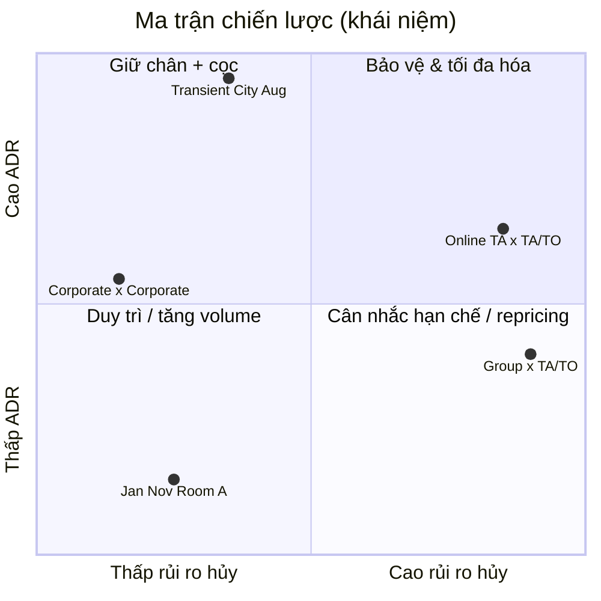

# EDA Tổng hợp — Key Findings & Hành động đề xuất

> **Nguồn:** Kết hợp [EDA Stage 1 — Cancellation Analysis](EDA%20Stage%201%20-%20Cancellation%20Analysis.md) và [EDA Stage 2 — ADR Analysis](EDA%20Stage%202%20-%20ADR.md)  
> **Dữ liệu:** `hotel_bookings_v4.csv` (Stage 1) · `hotel_bookings_v5.csv` (Stage 2, tái tạo từ v4 + `day_of_week`)  
> **Notebook:** `eda_cancellation.ipynb` · `eda_adr.ipynb`  
> **Phạm vi:** 82.811 booking | 23.284 hủy (**28,12%**) | 58.066 lưu trú thành công (ADR > 0) | Mean ADR **105,92**

---

## 1. Bức tranh tổng quan

Hai giai đoạn EDA bổ sung cho nhau hai góc nhìn cốt lõi của **Revenue Management**:

| Góc nhìn | Stage 1 — Cancellation | Stage 2 — ADR |
|---|---|---|
| **Câu hỏi** | Booking nào *không* materialize? | Booking nào *mang giá trị* cao nhất? |
| **Chỉ số** | Tỷ lệ hủy (`is_canceled`) | Average Daily Rate (`adr`) |
| **Biến phân tích** | lead_time, deposit_type, market_segment, distribution_channel | arrival_month, day_of_week, room_type, customer_type, hotel |
| **Số biểu đồ** | 11 | 11 |

**Thông điệp chính:** Rủi ro hủy và cơ hội doanh thu **không phân bố đồng đều** — cùng một booking có thể vừa là nguồn doanh thu lớn (ADR cao, mùa cao điểm) vừa là rủi ro hủy cao (Online TA, lead_time dài, không cọc). Chiến lược hiệu quả cần **target theo tổ hợp đặc trưng**, không áp dụng chính sách một kiểu cho toàn bộ portfolio.



---

## 2. Key findings — Stage 1 (Cancellation)

### 2.1 Số liệu nền

- **28,12%** booking bị hủy — gần **1/3** demand không chuyển thành lưu trú.
- **98,7%** booking là **No Deposit** → rủi ro hủy mang tính hệ thống.
- **79,6%** booking qua kênh **TA/TO** (tỷ lệ hủy **31,5%**).

### 2.2 Findings theo chiều phân tích

| Chiều | Phát hiện chính | Số liệu đáng chú ý |
|---|---|---|
| **Lead time** | Rủi ro hủy tăng **monotonic** theo thời gian đặt trước | 0–30 ngày: **17%** → >180 ngày: **42%**; bước nhảy lớn nhất sau **30 ngày** (+15,4 pp) |
| **Deposit** | Không cọc = rủi ro cao ở quy mô lớn | No Deposit: **27,3%** cancel (81.767 booking); Non Refund: **95,0%** (963 booking, volume nhỏ) |
| **Market segment** | Online TA = segment lớn nhất **và** rủi ro cao nhất | 50.391 booking, cancel **35,5%**; Corporate thấp nhất: **12,8%** |
| **Distribution channel** | TA/TO chiếm ~80% volume, cancel cao nhất | TA/TO **31,5%** vs Direct **15,1%**, Corporate **13,6%** |
| **Segment × Channel** | Rủi ro do **giao thoa**, không chỉ do kênh | Online TA × TA/TO: **50.104** booking, **35,7%**; Groups × TA/TO: **36,2%**; Offline TA/TO × TA/TO cùng kênh nhưng chỉ **15,1%** |

### 2.3 Insight then chốt — Cancellation

1. **Ngưỡng 30 ngày lead_time** là ranh giới phân loại rủi ro quan trọng nhất.
2. **Online TA × TA/TO** là ô rủi ro lớn nhất toàn hệ thống (~17.866 booking hủy ước tính).
3. **Market segment quan trọng hơn channel** trong việc giải thích hủy (cùng TA/TO, Online vs Offline chênh ~21 pp).
4. **Corporate / Direct** là các tổ hợp ổn định — ít cần can thiệp khẩn cấp.

---

## 3. Key findings — Stage 2 (ADR)

### 3.1 Số liệu nền

- Mean ADR toàn portfolio (lưu trú thành công): **105,92**.
- **City Hotel** mean **112,05** vs **Resort Hotel** **97,09** (+14,96).
- **Transient** chiếm **81,9%** booking và có ADR cao nhất (**108,74**).

### 3.2 Findings theo chiều phân tích

| Chiều | Phát hiện chính | Số liệu đáng chú ý |
|---|---|---|
| **Tháng đến** | Seasonality rõ — mùa hè peak | August mean **151,19** (median 140 €); January **70,16**; YoY August +37,79 (2015→2017) |
| **Day of week** | Cuối tuần premium nhẹ | Friday cao nhất **109,55**; Tue/Wed thấp nhất ~103,5 € (~5 € chênh) |
| **Room type** | Gradient giá rõ theo hạng phòng | H **185**, G **181**, A **93,04** (65% volume); room_match **82,0%** |
| **Room match** | Không khớp phòng ≠ ADR cao hơn | Khớp: **109,20** vs Không khớp: **90,96** (−18,24) |
| **Room × Hotel** | Pricing strategy khác biệt giữa 2 khách sạn | City premium ở A/D/E/F/G; Resort cao hơn ở B/C |
| **Customer type** | Transient dẫn dắt doanh thu | Transient **109** vs Group **87,23**; City Transient **114,22** |
| **Customer × Hotel** | City cao hơn mọi segment | Contract chênh lớn nhất: City **110,66** vs Resort **79,92** (+30,74) |

### 3.3 Insight then chốt — ADR

1. **Seasonality theo tháng** là driver ADR mạnh nhất (chênh ~115% Jan→Aug), mạnh hơn day-of-week (~5%).
2. **City Hotel + Transient + mùa cao điểm** là tổ hợp doanh thu cao nhất.
3. **Phòng A** chiếm volume lớn nhưng kéo ADR xuống — cơ hội upsell A→D/E.
4. **Rate card phải tách theo hotel × segment × room** — không dùng giá chung.

---

## 4. Insight xuyên suốt (Stage 1 × Stage 2)

### 4.1 Nghịch lý và cơ hội

| Hiện tượng | Cancellation | ADR | Hàm ý chiến lược |
|---|---|---|---|
| **Online TA / TA/TO** | Cancel cao (35,5–36,2%), volume cực lớn | Transient ADR cao (109) | Segment *vừa lớn vừa giá trị* nhưng *rủi ro hủy cao* → ưu tiên deposit + overbooking policy |
| **Groups** | Cancel **36,2%** (Groups × TA/TO) | ADR thấp nhất (**87,23**) | Double penalty: vừa dễ hủy vừa margin thấp → điều kiện hợp đồng chặt, cọc theo lead_time |
| **Corporate / Contract** | Cancel thấp (~12,8%) | ADR trung bình (~92,81 ) nhưng City Contract **110,66** | Segment ổn định, đáng giữ — nhưng rate khác biệt lớn City vs Resort |
| **Lead time dài + mùa cao** | Cancel >36–42% | ADR peak 70,16–151,19 (Jul–Aug) | Mỗi booking hủy mùa hè = mất **~130–150 €/đêm** → ROI cao khi giảm hủy |
| **No Deposit** | 98,7% booking, cancel 27,3% | — | Chính sách cọc là lever lớn nhất chưa được khai thác |
| **Phòng A (standard)** | — (volume lớn → impact hủy lớn) | 65% booking, ADR ~93 | Tập trung retention + upsell; promotion ở Jan/Nov |

### 4.2 Ma trận ưu tiên tích hợp (Rủi ro hủy × Giá trị ADR)

| Ưu tiên | Tổ hợp | Cancel risk | ADR | Chiến lược |
|:---:|---|:---:|:---:|---|
| 🔴 **P1** | Online TA × TA/TO + lead_time >60 ng + Jul–Aug | Rất cao | Rất cao | Cọc bắt buộc, reminder, overbooking có kiểm soát, rate fence |
| 🔴 **P1** | Groups × TA/TO + lead_time dài | Rất cao | Thấp | Hợp đồng nhóm chặt, attrition clause, cọc tăng dần theo lead_time |
| 🟠 **P2** | Transient × City × Aug × Room F/G | Trung bình | Rất cao | Peak pricing, hạn chế OTA discount, inventory protection |
| 🟠 **P2** | No Deposit + lead_time >30 (toàn hệ thống) | Cao | Hỗn hợp | Tiered deposit policy theo lead_time bin |
| 🟡 **P3** | Offline TA/TO × TA/TO | Trung bình | Trung bình | Theo dõi, A/B test cọc nhẹ |
| 🟢 **P4** | Corporate × Corporate + lead_time ngắn | Thấp | Trung bình–cao (City) | Duy trì quan hệ, ưu đãi loyalty |
| 🟢 **P4** | Jan/Nov + Room A + Group/Contract | Thấp–TB | Thấp | Promotion, package, fill rate |

### 4.3 Ba tension cần cân bằng

1. **Volume vs Margin:** Online TA/TA/TO mang volume nhưng cancel cao; Transient City mang margin cao.
2. **Fill rate vs ADR:** Jan/Nov cần promotion (ADR ~70,16) nhưng không nên ảnh hưởng rate fence mùa cao.
3. **Operational vs Pricing:** room_match (82% khớp) là vấn đề fulfillment; ADR phản ánh giá đặt — upgrade/downgrade cần quản lý riêng khỏi pricing.

---

## 5. Hành động đề xuất

### 5.1 Ngắn hạn (0–3 tháng) — Quick wins

| # | Hành động | Mục tiêu | Dựa trên |
|---|---|---|---|
| 1 | **Triển khai cọc tiered theo lead_time** (>30 ng: cọc 1 đêm; >180 ng: cọc 2 đêm hoặc non-refundable partial) | Giảm cancel ở bin rủi ro cao | Stage 1: bước nhảy cancel sau 30 ngày |
| 2 | **Review chính sách Online TA × TA/TO** — yêu cầu cọc, cutoff modification | Giảm ~17k booking hủy ước tính/năm | Stage 1: ô rủi ro lớn nhất |
| 3 | **Rate calendar mùa cao điểm** — tăng giá Jul–Aug, đặc biệt City + Transient + F/G | Tối đa hóa ADR peak (+40–80 € vs thấp điểm) | Stage 2: August 151,19 |
| 4 | **Weekend premium nhẹ** (+3–5 € Fri–Sat) | Tăng RevPAR cuối tuần | Stage 2: Friday +6 € vs mid-week |
| 5 | **Promotion targeted Jan/Nov** — Room A, Group/Contract, mid-week | Cải thiện occupancy mùa thấp | Stage 2: ADR ~70,16; Stage 1: cancel thấp hơn ở segment ổn định |

### 5.2 Trung hạn (3–6 tháng) — Chiến lược

| # | Hành động | Mục tiêu |
|---|---|---|
| 6 | **Rate fence riêng City vs Resort** theo customer_type × room_type | Tránh underpricing Contract tại City (+30 € gap) |
| 7 | **Upsell path A → D/E** trong mùa cao (Apr–Aug) | Tăng ADR trên 65% volume phòng standard |
| 8 | **Group booking policy** — cọc, attrition, lead_time cap | Giảm cancel Groups × TA/TO (36,2%) |
| 9 | **Channel shift pilot** — chuyển Online TA sang Direct (cancel 35,7% → 5,6% ở sample nhỏ) | Giảm dependency TA/TO (80% volume) |
| 10 | **Dashboard theo dõi** cancel rate + ADR theo segment × channel × month | Ra quyết định data-driven liên tục |

### 5.3 Dài hạn (6–12 tháng) — Modeling & hệ thống

| # | Hành động | Output kỳ vọng |
|---|---|---|
| 11 | **Mô hình dự báo cancellation** — features: lead_time, deposit, segment × channel, lead_time × deposit | Xác suất hủy theo booking → dynamic deposit |
| 12 | **Mô hình dự báo ADR / revenue** — features: month, day_of_week, room_type × hotel, customer_type × hotel | Optimal price recommendation |
| 13 | **Integrated RM system** — kết hợp cancel probability × expected ADR = **expected revenue at risk** | Prioritize inventory protection theo giá trị thực |
| 14 | **Theo dõi YoY ADR** tại July–August làm KPI pricing | Duy trì growth (+37,79 YoY đã quan sát) |

---

## 6. KPI đề xuất theo dõi

| KPI | Baseline (EDA) | Mục tiêu gợi ý |
|---|---|---|
| Tỷ lệ hủy tổng thể | 28,12% | < 24% (12 tháng) |
| Cancel rate Online TA × TA/TO | 35,7% | < 30% |
| Cancel rate lead_time >180 ngày | 41,7% | < 35% |
| Tỷ lệ booking No Deposit | 98,7% | < 85% (có cọc tiered) |
| Mean ADR (lưu trú thành công) | 105,92 | +5–8% YoY |
| Mean ADR August | 151,19 | Duy trì premium, std kiểm soát |
| Mean ADR January | 70,16 | Cải thiện occupancy, ADR ≥ 75 € |
| Tỷ lệ room_match | 82,0% | ≥ 85% |
| ADR Transient City Hotel | 114,22 | Bảo vệ margin, không discount OTA mùa cao |

---

## 7. Lộ trình triển khai gợi ý

```
Giai đoạn 1 (Tháng 1–2)     Giai đoạn 2 (Tháng 3–4)     Giai đoạn 3 (Tháng 5–8)
─────────────────────       ─────────────────────       ─────────────────────
✓ Cọc tiered lead_time      ✓ Rate fence City/Resort    ✓ Peak pricing Jul–Aug
✓ Review Online TA policy   ✓ Upsell A→D/E              ✓ Cancel model v1
✓ Dashboard KPI cơ bản      ✓ Group policy mới          ✓ ADR model v1
                            ✓ Channel shift pilot       ✓ Integrated RM
```

---

## 8. Kết luận

Hai giai đoạn EDA cho thấy bài toán Revenue Management của portfolio này **không phải chọn giữa giảm hủy hay tăng giá** — mà phải **target chính xác** các tổ hợp nơi rủi ro hủy và giá trị ADR giao nhau:

- **Bảo vệ doanh thu mùa cao** (Jul–Aug, City, Transient, premium room) bằng cọc và inventory control — vì mỗi booking hủy ở đây tổn thất ~130–150 €/đêm.
- **Kiểm soát rủi ro hủy hệ thống** (Online TA × TA/TO, lead_time >30 ng, No Deposit) — đây là lever impact lớn nhất trên ~28% cancel rate tổng thể.
- **Tối ưu mùa thấp** (Jan/Nov, Room A) bằng promotion có chọn lọc — cải thiện fill rate mà không erode rate fence mùa cao.

Bước tiếp theo tự nhiên là **Stage 3 — Predictive Modeling**: xây dựng mô hình cancellation và ADR/revenue, sử dụng các feature và interaction đã xác định qua 22 biểu đồ EDA, để chuyển từ insight mô tả sang **quyết định tự động hóa**.

---

## Phụ lục — Tham chiếu nhanh

| Tài liệu | Nội dung | Biểu đồ |
|---|---|:---:|
| [EDA Stage 1 — Cancellation](EDA%20Stage%201%20-%20Cancellation%20Analysis.md) | lead_time, deposit, segment, channel | 11 |
| [EDA Stage 2 — ADR](EDA%20Stage%202%20-%20ADR.md) | month, day_of_week, room_type, customer_type | 11 |

---

*Tài liệu tổng hợp từ EDA Stage 1 & Stage 2. Cập nhật lần cuối: 3/7/2026 — Executive Summary (key dedup mới, 82.811 booking).*