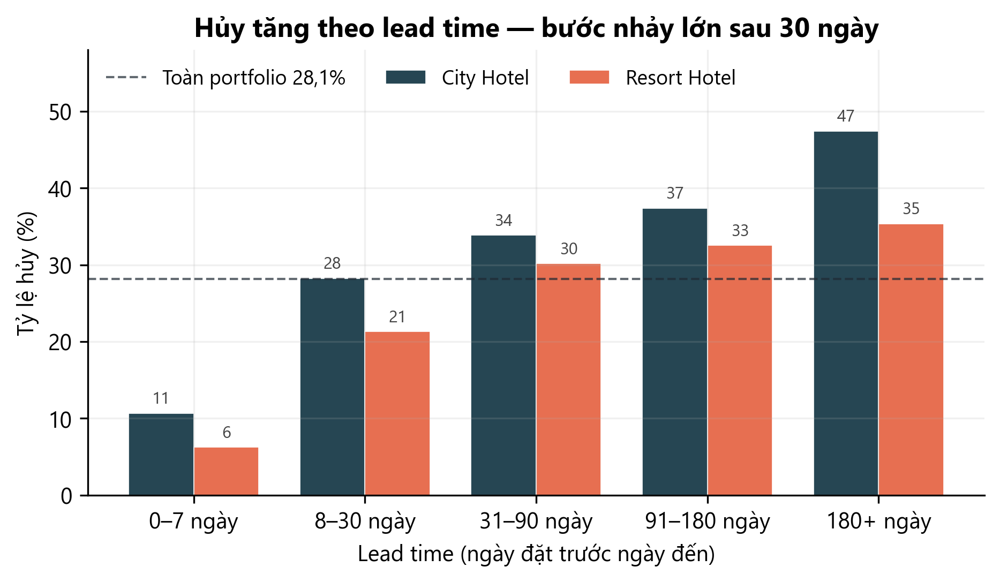
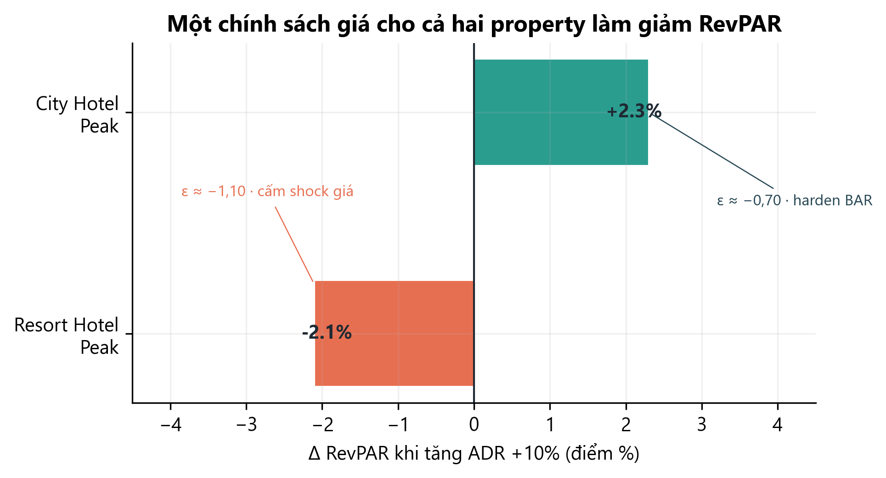

# Hotel Booking Demand — Tối ưu RevPAR & quy trình đặt phòng

[](https://www.python.org/)
[](https://pandas.pydata.org/)
[](https://scikit-learn.org/)
[](https://lightgbm.readthedocs.io/)
[](https://www.microsoft.com/sql-server)
[](https://powerbi.microsoft.com/)
[](https://creativecommons.org/licenses/by/4.0/)

Dự án phân tích nhu cầu đặt phòng của **City Hotel** và **Resort Hotel** (Bồ Đào Nha, 07/2015–08/2017) để trả lời một câu hỏi điều hành:

> **Làm sao tăng RevPAR mà không đẩy hủy, walk và xung đột kênh — khi hai property không cùng một nhịp cầu?**

Kết quả chính: **pricing playbook bất đối xứng**, **luồng booking theo mức rủi ro hủy**, và **lộ trình pilot có kiểm soát** — đã back-test trên lịch sử trước khi đề xuất triển khai.

**Live demos**

| Sản phẩm | URL |
|----------|-----|
| Dashboard điều hành (HTML) | [hotel-booking-demand-dashboard.vercel.app](https://hotel-booking-demand-dashboard.vercel.app) |
| Báo cáo SCQA (HTML) | [hotel-booking-demand-scqa.vercel.app](https://hotel-booking-demand-scqa.vercel.app) |

---

## Mục lục

1. [Tổng quan](#1-header--project-overview)
2. [Dashboard điều hành](#2-dashboard-điều-hành-và-phân-tích-chuyên-sâu)
3. [Nguồn dữ liệu & từ điển](#3-data-source--dictionary)
4. [Phương pháp](#4-methodology)
5. [Câu hỏi nghiệp vụ & SQL](#5-business-questions--sql-analytics)
6. [Kết quả & insight](#6-key-findings--business-insights)
7. [Đề xuất](#7-recommendations)
8. [Cấu trúc repo](#8-repository-structure)
9. [Cài đặt & chạy](#9-installation--usage)
10. [Tech stack](#10-tech-stack)

---

## 1. Header & Project Overview

### Bối cảnh ngành (2015–2017)

Giai đoạn dữ liệu trùng với chu kỳ tăng trưởng mạnh của khách sạn toàn cầu *trước* đại dịch: cầu du lịch quốc tế lập đỉnh liên tiếp, kênh OTA chiếm ưu thế phân phối, và văn hóa **hủy miễn phí** trở thành chuẩn mặc định trên Booking.com / Expedia.

| Tín hiệu | Số liệu | Ý nghĩa với bài toán |
|----------|---------|----------------------|
| Cầu du lịch thế giới | UNWTO: **1,184 tỷ** lượt khách quốc tế (2015) → **1,235 tỷ** (2016) → **1,323 tỷ** (2017) | Occupancy dễ “đẹp trên giấy”, nhưng hủy OTA làm cầu *thực hiện* không chắc |
| Hiệu suất phòng (benchmark STR, Mỹ) | Occupancy ~**65,5–65,9%**; RevPAR **78,67 → 83,57 USD** (2015–2017) | Ngành tối ưu **RevPAR = ADR × Occupancy**, không tối ưu riêng một vế |
| Phân phối châu Âu | Booking.com + Expedia ~**80%** booking OTA; top 3 (kèm HRS) ~**92%** (HOTREC / Phocuswright 2015–2016) | Commission + rate parity + hủy linh hoạt siết Direct |
| Bồ Đào Nha | 2017: **20,6 triệu** khách KS, **57,5 triệu** đêm lưu trú (+8,9% / +7,4%); Lisbon + Algarve chiếm phần lớn tăng trưởng (INE) | Dataset Antonio et al. đúng lúc boom Lisbon (city) vs Algarve (resort) |

Hai hệ quả vận hành của thời kỳ này — đúng biến `is_canceled` và kênh `TA/TO` trong dữ liệu:

1. **Free cancellation culture.** OTA bán “hủy miễn phí đến sát ngày đến” để thắng conversion. Hotel nhận pipeline lớn nhưng **~28% booking không materialize** (trên file phân tích v5).
2. **Overbooking có kiểm soát.** ~90% chuỗi lớn dùng overbooking như công cụ revenue management, không phải lỗi vận hành — rủi ro chỉ xuất hiện khi *walk* vượt ngưỡng.

Nguồn chi tiết: [docs/references.bib](docs/references.bib). Paper gốc dataset: Antonio, de Almeida & Nunes, *Data in Brief* 22:41–49 (2019), [doi:10.1016/j.dib.2018.11.126](https://doi.org/10.1016/j.dib.2018.11.126) (CC BY 4.0).

### Mục tiêu dự án

| Mục tiêu | KPI / quyết định |
|----------|------------------|
| **Tối ưu RevPAR** | Tách playbook City vs Resort; dải BAR floor–recommend–ceil; cấm shock giá Resort Peak |
| **Giảm Cancellation Rate & ma sát đặt phòng** | Phân luồng theo P(hủy): Low = đặt nhanh Direct; Medium = CRM confirm; High = buffer bán lại đúng BAR |
| **Không đánh đổi walk / kênh** | Buffer có safety factor; refill ưu tiên Direct; Legal review rate-parity trước best-rate |

Phạm vi: **recommend-only** — không tự đẩy giá lên OTA. Pilot có kill switch khi Δcancel hoặc walk vượt ngưỡng.

---

## 2. Dashboard điều hành và phân tích chuyên sâu

Hai kênh cùng công thức KPI (ADR / Occupancy / RevPAR / cancel), khác công cụ hiển thị.

| Kênh | Thư mục | Trạng thái | Cách mở |
|------|---------|------------|---------|
| **HTML / Chart.js** | [`dashboard-html/`](dashboard-html/) | Live trên Vercel | [Dashboard](https://hotel-booking-demand-dashboard.vercel.app) · local: `python -m http.server 8765` |
| **Power BI** | [`dashboard-powerbi/`](dashboard-powerbi/) | Đang dựng — star-schema + DAX khớp HTML | [POWERBI_SETUP_GUIDE.md](dashboard-powerbi/POWERBI_SETUP_GUIDE.md) |
| **Báo cáo SCQA** | [`reports/html/`](reports/html/) | Live | [SCQA](https://hotel-booking-demand-scqa.vercel.app) |

Bốn view quyết định (cùng IA trên HTML và Power BI):

| View | Việc stakeholder làm | Grain dữ liệu |
|------|----------------------|---------------|
| **Overview** | 30 giây nắm booking, revenue, ADR, Occ, RevPAR, cancel; mix kênh / quốc gia / customer type | `Fact_RevPAR_Monthly` + cube booking |
| **RevPAR** | So City vs Resort theo tháng; waterfall ΔADR vs ΔOcc; scatter ADR × Occ; heatmap mùa | Tháng + ngày |
| **Cancellation** | Driver hủy (lead, deposit, kênh, segment) + brush/cross-filter + funnel overbooking | Booking-level |
| **Pricing Simulator** | What-if ADR / Occ / cancel trong band — **không** xuất một “giá tối ưu” duy nhất | Panel tháng |

Nguồn dashboard: CSV star-schema trong `data/star schema/` (`revpar_monthly.csv`, `hotel_bookings_normalized.csv`). Design system: teal `#0F766E` + cognac `#9A4E1C` (`design-system/hotel-booking-demand/`).

Đào sâu ngoài dashboard: bộ báo cáo `reports/02` → `reports/35` (EDA → model hủy → elasticity → playbook → stakeholder pack).

---

## 3. Data Source & Dictionary

### Nguồn gốc & license

| | |
|--|--|
| Kaggle | [jessemostipak/hotel-booking-demand](https://www.kaggle.com/datasets/jessemostipak/hotel-booking-demand/data) (Jesse Mostipak) |
| Paper gốc | Antonio, N., de Almeida, A., & Nunes, L. (2019). Hotel booking demand datasets. *Data in Brief, 22*, 41–49. [doi:10.1016/j.dib.2018.11.126](https://doi.org/10.1016/j.dib.2018.11.126) |
| License | **CC BY 4.0** ([Creative Commons Attribution 4.0](https://creativecommons.org/licenses/by/4.0/)) — bắt buộc ghi nguồn tác giả gốc khi tái sử dụng |
| Đối tượng | 1 City Hotel (Lisbon) + 1 Resort Hotel (Algarve), đã ẩn danh PII |

### Quy mô

| Lớp | Dòng × cột | Ghi chú |
|-----|-----------:|---------|
| **Raw** (`hotel_bookings.csv`) | **119.390 × 32** | Arrival 01/07/2015 → 31/08/2017; City 79.330 · Resort 40.060; hủy raw **37,0%**; trùng 31.994 dòng; `company` thiếu 112.593 |
| **Phân tích v5** (`hotel_bookings_v5.csv`) | **82.811 × 36** | Dedup theo key nghiệp vụ, drop `company`, fill missing, thêm KPI; hủy **28,12%**; City 50.686 (hủy 30,7%) · Resort 32.125 (hủy 24,1%); 178 quốc gia; lead time 0–737 ngày (median 48) |
| Panel tháng | 26 tháng (2015-07 → 2017-08) | 2017 cắt tháng 8 → forecast 6 tháng chỉ mang tính minh họa |

**Giới hạn bắt buộc:** dataset **không có inventory phòng** → Occupancy và RevPAR là **proxy** (`occ = 1 − cancel_rate` ở grain phù hợp; `revpar = adr × occ`). Không suy diễn P&L kế toán từ lost-revenue proxy.

### Data dictionary (32 cột gốc)

| Cột | Ý nghĩa |
|-----|---------|
| `hotel` | City Hotel / Resort Hotel |
| `is_canceled` | 1 = hủy, 0 = không hủy (**target**) |
| `lead_time` | Số ngày từ lúc ghi PMS đến ngày đến |
| `arrival_date_year` / `_month` / `_week_number` / `_day_of_month` | Ngày đến |
| `stays_in_weekend_nights` / `stays_in_week_nights` | Số đêm cuối tuần / trong tuần |
| `adults` / `children` / `babies` | Thành phần đoàn |
| `meal` | Gói ăn (BB, HB, FB, SC, Undefined) |
| `country` | Quốc gia (ISO 3166) |
| `market_segment` | Online TA, Offline TA/TO, Direct, Groups, Corporate, Complementary, Aviation |
| `distribution_channel` | TA/TO, Direct, Corporate, GDS |
| `is_repeated_guest` | Khách quay lại |
| `previous_cancellations` / `previous_bookings_not_canceled` | Lịch sử PMS |
| `reserved_room_type` / `assigned_room_type` | Phòng đặt vs phòng gán (mismatch = tín hiệu ops / overbook) |
| `booking_changes` | Số lần sửa booking |
| `deposit_type` | No Deposit / Non Refund / Refundable |
| `agent` / `company` | ID đại lý / công ty (`company` drop ở v5 vì thiếu >94%) |
| `days_in_waiting_list` | Ngày nằm waiting list |
| `customer_type` | Transient, Transient-Party, Contract, Group |
| `adr` | Average Daily Rate (€ / phòng / đêm) |
| `required_car_parking_spaces` | Chỗ đậu xe yêu cầu (tín hiệu cam kết mạnh) |
| `total_of_special_requests` | Số yêu cầu đặc biệt |
| `reservation_status` / `reservation_status_date` | Check-Out / Canceled / No-Show — **leakage**, không đưa vào model |

**Cột sinh thêm trên v5:** `total_nights`, `revenue`, `Occupancy_Rate`, `RevPAR`, `day_of_week`.

Công thức KPI (stay thành công):

```text
revenue        = adr × (weekend_nights + week_nights)     khi is_canceled = 0
occupancy_rate = AVG(1 − is_canceled)                     proxy — không có inventory
adr            = AVG(adr) WHERE is_canceled = 0 AND adr > 0
revpar         = adr × occupancy_rate
```

Khi gộp nhiều tháng/hotel: **không** `AVG` các cột tỷ lệ — dùng trọng số `successful_bookings` / `total_bookings` (xem `sql/README.md`).

Mùa vận hành: **Peak** = 7–8 · **Shoulder** = 4–6 & 9–10 · **Low** = 11–3.

---

## 4. Methodology

```text
01  Làm sạch raw → v2…v5
        ↓
02–05  EDA hủy / ADR · tương quan · kiểm định (loại leakage)
        ↓
06–14  Model P(hủy)  RF → LightGBM + calibrate + SHAP
        ↓
10–16, 26  BRD · chính sách cọc · overbooking buffer
        ↓
17b, 20*  ADR strategy + forecast Demand / ADR / RevPAR (tách City / Resort)
        ↓
22–24  Elasticity → tối ưu BAR → ensemble ML (floor / recommend / ceil)
        ↓
27–28  What-if + back-test 2015–2016 → Pricing Playbook
        ↓
29–35  Executive summary · slide · implementation · monitoring
        ↓
SQL star-schema + dashboard HTML / Power BI
```

Luôn **tách City vs Resort**. Không train trên `reservation_status`, `revenue`, Occupancy, RevPAR, `assigned_room_type`.

| Tầng | Kỹ thuật | Output |
|------|----------|--------|
| Làm sạch | Dedup key nghiệp vụ, drop `company`, giữ cả lớp hủy | `hotel_bookings_v5.csv` |
| EDA / infer | Binning, χ² + Cramér's V, Mann–Whitney, logistic OR | Hotspot lead × segment × mùa |
| P(hủy) | LightGBM **v2.2** AUC **0,896** (isotonic); scores vận hành hiện tại **v2 @ 0,35** | Tier Low / Medium / High |
| Forecast | ADF+KPSS, SARIMAX, Holt–Winters vs Seasonal Naive | Stance RAISE / HOLD / CUT |
| Giá | Log–log OLS + month FE; iso-elastic \(R(p)=p\cdot Q(p)\); HGB ensemble | Band BAR ±15% |
| Kiểm chứng | What-if Peak +5/10/15% ADR; dual-objective; back-test `go=True` nếu ΔRevPAR ≥ 0 và Δcancel ≤ +1 pp | Playbook 28 |

Star schema: `01_create_star_schema.sql` → `02_populate` → `03_business_questions.sql` (SQL Server). Rebuild CSV: `python scripts/build_star_schema_v5.py`.

---

## 5. Business Questions & SQL Analytics

Sáu câu hỏi điều hành — cùng logic trên dashboard, flat SQL (`SQLQuery1/2`) và star (`03_business_questions.sql`).

| # | Câu hỏi | Quyết định | Insight kỳ vọng | SQL |
|---|---------|------------|-----------------|-----|
| **Q1** | Tăng trưởng đến từ đâu? Doanh thu phụ thuộc kênh / thị trường nào? | Nếu 1 kênh hoặc 1 quốc gia > 50% revenue → đa dạng hóa, tăng Direct | TA/TO + thị trường lớn = rủi ro tập trung, không phải “kênh đang chạy tốt” | `03` BQ1 |
| **Q2** | City vs Resort khác nhau thế nào về RevPAR / ADR / Occ? | **Không** một playbook giá cho cả hai | City Peak harden BAR; Resort Peak HOLD; Resort Low CUT nhẹ | `03` BQ2 |
| **Q3** | Còn dư địa tăng giá mà không mất occupancy? | ADR thấp + Occ cao = headroom; ADR cao + Occ thấp = quá giá / hủy | Quadrant ngày + RevPAR theo hạng phòng (đặt vs gán) | `03` BQ3 |
| **Q4** | Hủy tập trung ở đâu (lead, deposit, kênh, segment)? | High-risk → buffer + refill Direct; đừng siết deposit hàng loạt | Lead dài hủy cao. Non Refund cancel cao → **audit**, không kết luận cọc đang chặn hủy | `03` BQ4 |
| **Q5** | ADR / Occ / cancel đổi thì RevPAR đổi thế nào? | Stress-test trong band, không shock Resort Peak | Mô phỏng từng dòng hotel×tháng rồi mới gộp | `03` BQ5 |
| **Q6** | Customer type nào gánh nền doanh thu theo tháng? | Giữ Transient; Contract nhỏ nhưng ổn | Transient là xương sống. Repeat hủy thấp hơn New | `03` BQ6 |

Insight bổ sung (I1–I4): special requests, lịch sử hủy, Direct vs OTA, weekend vs weekday.

Chạy ngắn: import v5 → `dbo.hotel_booking_db` → `01` + `02` + `03`. Chi tiết: [`sql/README.md`](sql/README.md).

---

## 6. Key Findings & Business Insights

### Biến dẫn đến hủy

- **Lead time là tín hiệu monotonic mạnh nhất.** 0–30 ngày hủy ~**17%** → >180 ngày ~**42%**; bước nhảy lớn nhất sau **30 ngày**. City 180+ ngày hủy **47%** vs Resort **35%**.
- **Online TA × TA/TO** là hotspot hệ thống: ~50k booking, hủy **~35,7%**. Cùng kênh TA/TO, Online vs Offline chênh **~21 pp** → **segment quan trọng hơn channel**.
- **98,7% No Deposit** — rủi ro hủy mang tính hệ thống, không phải outlier. Non Refund hủy **~95%** trên mẫu nhỏ → **audit chất lượng / channel gaming**, không siết cọc hàng loạt.
- Tín hiệu sau khi loại leakage (Cramér's V / r): `market_segment` **0,219**, `lead_time` **0,196**, parking **−0,189**, `deposit_type` **0,161**. Parking và special requests = cam kết thật — **không** đưa vào buffer.
- Model: High-tier (P ≥ 0,55) hủy thật **~64%** (nguồn bán lại); Low (P < 0,35) chỉ **~4%**. LightGBM v2.2 AUC **0,896**.



*Hình 1. Hủy vượt trung bình portfolio (28,1%) ngay khi lead time > 30 ngày — ngưỡng phân luồng CRM / cọc / buffer.*

### Nguyên nhân làm giảm RevPAR

- **Một mức tăng giá cho cả hai property là sai.** City Peak +10% ADR → RevPAR **+2,3%** (ε ≈ −0,70). Resort Peak +10% ADR → RevPAR **−2,1%** (ε ≈ −1,10): mất volume nhiều hơn phần thu thêm.
- **Tối ưu thuần doanh thu quá tay.** Analytic p★ gợi ý City RAISE ~+21%; dual-objective + band ±15% mới an toàn khi hủy/OTA High cao.
- **Hủy “đốt” cầu đã bán:** lost-revenue proxy **~11,25M €** (**33,7%** doanh thu tiềm năng); tổ hợp Online TA + lead > 90 + Jul–Aug chỉ 8,7% booking nhưng gánh **22,6%** doanh thu mất.
- Seasonality ADR rất gắt (Jan ~**70 €** vs Aug ~**151 €**) trong khi Occupancy là proxy — tăng ADR Peak mà không giữ Occ (vì hủy) làm RevPAR đi xuống dù “giá đẹp”.
- Resort Offline TA/TO rất elastic (ε_ops ≈ **−2,24**) → dump Online Peak càng hại mix.



*Hình 2. Cùng một shock +10% ADR: City Peak được, Resort Peak mất RevPAR — đây là insight đắt giá nhất của playbook.*

### Nút thắt quy trình đặt phòng hiện tại

1. **Phụ thuộc OTA / TA-TO (~80% volume)** trong khi Direct hủy chỉ **15,1%** — funnel Direct ma sát cao, OTA ma sát thấp + hủy cao.
2. **Không phân luồng theo rủi ro lúc đặt.** Khách Low-risk bị cùng friction với High-risk; High-risk không vào bộ đệm bán lại kịp.
3. **No Deposit mặc định** + free cancellation OTA → pipeline ảo; waiting list / overbooking không gắn P(hủy) từng booking.
4. **Room mismatch ~18%** (phần lớn free upgrade A/B) — inventory gán muộn, phá ADR ladder và trải nghiệm.
5. **Groups** hủy theo block nhưng đang bị dump giá thay vì siết attrition / hợp đồng (ε inelastic).
6. **Một rate card cho City + Resort** — nút thắt chiến lược: Peak City cần harden, Peak Resort cần HOLD, Low Resort cần CUT nhẹ Offline-first.

---

## 7. Recommendations

Ước tác động (proxy in-sample, base portfolio ~**€2,84M**/năm) — **không** phải P&L chắc chắn; phải shadow/pilot trước khi lập ngân sách.

| Kịch bản | Δ doanh thu năm hóa | Điều kiện |
|----------|--------------------:|-----------|
| A · Conservative (rule đã back-test) | **~€10k** | City Peak RAISE trong band + Resort Low CUT −5% |
| B · Full p★ trong guardrail | **~€59k** | Ensemble ε + BAR ±15% |
| C · B + Direct / buffer mix | **~€70–85k** | Commission tiết kiệm + refill đúng BAR; Legal parity |

### Chiến lược & chính sách (từ báo cáo 15, 16, 26, 28)

| # | Hành động | Chi tiết |
|---|-----------|----------|
| **R1** | Playbook bất đối xứng | City Peak harden BAR; Resort Peak **HOLD — cấm shock +10%**; Resort Low CUT **~−5%**, promo Offline trước Online |
| **R2** | Không chốt cực trị +21% | Luôn floor–recommend–ceil (±15%); dual α ≤ 0,7 khi Peak + High OTA |
| **R3** | Booking theo tier hủy | Low (P < 0,35): frictionless Direct. Medium: CRM confirm. High (P ≥ 0,55): buffer → refill Direct đúng BAR |
| **R4** | Buffer có trần | `buffer = hủy thật (ô) × 0,6`; cap 20%/ngày (Groups 15%). Không overbook Low/Medium. Mode phòng thủ Peak: v2.1 @ 0,28 (Recall ~0,95) |
| **R5** | Cọc có mục tiêu, không hàng loạt | Thử nghiệm cọc Online TA lead > 30 (mô phỏng +1,52M € net) — A/B hẹp, audit Non Refund trước |
| **R6** | Tăng Direct | Best-rate trong band; mở slot buffer Direct trước OTA; giảm friction Low-tier |
| **R7** | Groups / Corporate | Harden hợp đồng + attrition; không dump block |
| **R8** | Pilot 16 tuần | Shadow → City Peak → Resort Low → Direct UX. Kill switch nếu Δcancel > +1 pp hoặc walk > 3–5% |

### Tóm tắt cho CEO

**Bottom line:** một chính sách giá chung cho hai khách sạn đang để tiền trên bàn ở Resort và bỏ lỡ dư địa ở City; đồng thời 28% nhu cầu đang "rò" qua hủy phòng mà không được quản trị theo rủi ro. Ba đòn bẩy dưới đây giải quyết cả hai, với rào chắn để không đánh đổi bằng walk-in hay xung đột kênh.

- **Định giá theo property, không theo cảm tính.** City chịu được nâng giá cao điểm có kiểm soát; Resort thì giữ nguyên — mọi phép tăng giá mạnh ở Resort đã được kiểm chứng là *lỗ* RevPAR, không phải lãi. Mùa thấp, Resort nên giảm nhẹ (~5%) để giữ occupancy thay vì để trống phòng.
- **Biến rủi ro hủy thành tài sản, không phải tổn thất.** Thay vì đối xử như nhau với mọi booking, hệ thống chấm điểm rủi ro để phân luồng: khách an toàn được trải nghiệm đặt phòng mượt, khách rủi ro cao được đưa vào "bộ đệm" bán lại đúng giá qua kênh trực tiếp — không xả giá rẻ qua OTA.
- **Siết có chọn lọc, không siết đại trà.** Không áp đặt cọc bắt buộc hay overbooking tràn lan lên toàn hệ thống — chỉ can thiệp đúng nhóm rủi ro cao (đặt sớm qua OTA), có trần an toàn và siết chặt hợp đồng nhóm đoàn.
- **Đề xuất quyết định:** phê duyệt pilot 16 tuần, có cơ chế dừng tự động nếu hủy phòng hoặc walk-in vượt ngưỡng an toàn. Kịch bản thận trọng mang lại **~€10k/năm**; nếu triển khai đầy đủ trong khung an toàn, tiềm năng đạt **~€70–85k/năm** trên nền doanh thu ~€2,8M — chưa tính tác động thu hồi biên lợi nhuận từ giảm phụ thuộc OTA.

Tài liệu quyết định: [29 Executive Summary](reports/29_executive_summary.md) · [28 Playbook](reports/28_finalize_dynamic_pricing_playbook.md) · [34 Implementation](reports/34_implementation_guide.md).

---

## 8. Repository Structure

```text
Hotel-Booking-Demand/
├── README.md
├── requirements.txt
├── data/                          # gitignored — đặt hotel_bookings.csv rồi chạy notebook 01
│   ├── hotel_bookings.csv         # raw 119.390 × 32
│   ├── hotel_bookings_v5.csv      # file phân tích 82.811 × 36
│   └── star schema/               # dim_* + fact CSV cho dashboard / Power BI
├── notebooks/                     # 01 cleaning → 27 validate (Python / statsmodels / sklearn)
├── models/                        # LightGBM / RF cancellation v1 → v2.2 + artifacts
├── sql/                           # 01 schema · 02 populate · 03 business questions (T-SQL)
├── dashboard-html/                # SPA tĩnh Chart.js + JSON aggregate (Vercel)
├── dashboard-powerbi/             # Hướng dẫn DAX / model (in progress)
├── reports/                       # 02–35 markdown + html/ SCQA
│   └── html/
├── design-system/hotel-booking-demand/
├── docs/                          # Guide học dự án + figures README + references.bib
│   └── figures/
├── scripts/                       # build star-schema (local)
└── cv/                            # không thuộc pipeline phân tích
```

Đọc theo vai trò: GM → `reports/29` + `31`. RM → `28` + `34`. FO/CRM → `26` + booking flow trong `28`. Finance → ROI trong `29` / `33`.

---

## 9. Installation & Usage

**Yêu cầu:** Python 3.10+, Git. SQL Server / SSMS nếu chạy star-schema. Power BI Desktop nếu dựng bản DAX.

```bash
git clone https://github.com/KANguyen2802/Hotel-Booking-Demand.git
cd Hotel-Booking-Demand

python -m venv .venv
# Windows PowerShell
.venv\Scripts\Activate.ps1
# macOS / Linux
# source .venv/bin/activate

pip install -r requirements.txt
```

**Dữ liệu** (thư mục `data/` không nằm trên GitHub):

1. Tải [hotel-booking-demand](https://www.kaggle.com/datasets/jessemostipak/hotel-booking-demand/data) → lưu `data/hotel_bookings.csv`.
2. Chạy làm sạch: mở `notebooks/01_data_cleaning.ipynb` (raw → v5).
3. (Tuỳ chọn) rebuild star-schema CSV:

```bash
python scripts/build_star_schema_v5.py
```

**Dashboard HTML**

```bash
cd dashboard-html
python -m http.server 8765
# http://localhost:8765
```

Refresh JSON từ star-schema: `python dashboard-html/_export_data.py`.

**SQL Server**

1. Import `hotel_bookings_v5.csv` → `dbo.hotel_booking_db`.
2. Chạy `sql/01_create_star_schema.sql` → `02_populate_star_schema.sql` → `03_business_questions.sql`.
3. Prototype một bảng: `SQLQuery1.sql` / `SQLQuery2.sql`.

**Power BI:** làm theo [`dashboard-powerbi/POWERBI_SETUP_GUIDE.md`](dashboard-powerbi/POWERBI_SETUP_GUIDE.md) (import CSV, quan hệ, measure DAX khớp HTML).

**Notebooks theo thứ tự:** xem [`notebooks/README.md`](notebooks/README.md). Model hủy: [`models/README.md`](models/README.md).

---

## 10. Tech Stack

| Lớp | Công cụ |
|-----|---------|
| Ngôn ngữ | Python 3.10+, T-SQL, DAX, HTML/CSS/vanilla JS |
| Data wrangling | Pandas, NumPy |
| EDA & viz notebook | Matplotlib, Seaborn, Jupyter |
| Thống kê / forecast | SciPy, statsmodels (SARIMAX, Holt–Winters, ADF/KPSS) |
| ML hủy & giá | Scikit-learn (HGB), LightGBM, SHAP, Optuna |
| Kho & truy vấn | SQL Server (star schema: `Fact_Booking`, `Fact_RevPAR_Monthly`, `Fact_Daily_AdrOcc` + dims) |
| Dashboard | Chart.js 4, Power BI |
| Deploy | Vercel (static HTML) |
| Báo cáo | Markdown → HTML SCQA; Playwright (xuất hình) |

---

## Tài liệu đọc tiếp

| Bạn cần | Đọc |
|---------|-----|
| 1–2 trang quyết định | [29 — Executive Summary](reports/29_executive_summary.md) |
| Playbook giá & booking | [28 — Dynamic Pricing Playbook](reports/28_finalize_dynamic_pricing_playbook.md) |
| Triển khai 16 tuần | [34 — Implementation Guide](reports/34_implementation_guide.md) |
| Mục lục closing pack | [reports/29_35_closing_pack_index.md](reports/29_35_closing_pack_index.md) |

## Nguồn tham khảo (bối cảnh ngành & dữ liệu)

1. Antonio, N., de Almeida, A., & Nunes, L. (2019). Hotel booking demand datasets. *Data in Brief, 22*, 41–49. https://doi.org/10.1016/j.dib.2018.11.126
2. Mostipak, J. (2019). *Hotel booking demand* [Dataset]. Kaggle. https://www.kaggle.com/datasets/jessemostipak/hotel-booking-demand/data
3. UNWTO. *World Tourism Barometer* (2015–2017): 1.184 / 1.235 / 1.323 tỷ lượt khách quốc tế.
4. STR. US year-end hotel performance 2015–2017 (occupancy ~65,5–65,9%; RevPAR 78.67–83.57 USD).
5. HOTREC / Phocuswright. *European Hotel Distribution Study* — Booking.com + Expedia ~80% OTA châu Âu.
6. PwC. *European cities hotel forecast for 2016 and 2017*.
7. Statistics Portugal (INE). Tourism activity 2016–2017 (Lisbon & Algarve).
8. Antonio, N., Almeida, A., & Nunes, L. (2017). Predicting hotel bookings cancellation with a machine learning classification model. *IEEE ICMLA*. https://doi.org/10.1109/ICMLA.2017.00-11

BibTeX đầy đủ: [`docs/references.bib`](docs/references.bib).

---

*Cập nhật: 16/08/2026 · Recommend-only. Occupancy/RevPAR là proxy — không có inventory thật.*
