# Hướng dẫn đọc và đánh giá chỉ số thống kê & kiểm định giả thuyết

> **Phạm vi:**  
> - `05_hypothesis_testing.ipynb` — kiểm định H1–H4 liên quan `is_canceled`  
> - `05b_hypothesis_visualization.ipynb` — heatmap, box plot, time series hỗ trợ diễn giải  
> **Biến mục tiêu (kiểm định):** `is_canceled` (0 = Không hủy, 1 = Hủy)  
> **Dữ liệu:** `hotel_bookings_v5.csv` (~82.811 booking, tỷ lệ hủy **28,12%**)  
> **α (alpha):** 0,05  
> **Hình:** `reports/figures/05/` (từ notebook 05) và `reports/figures/05b/` (từ notebook 05b)

---

## Mục tiêu tài liệu

Sau khi đọc xong, bạn có thể:

1. Đọc đúng **mọi chỉ số** kiểm định (p-value, U, χ², Cramér's V, rank-biserial *r*, OR, Pseudo R², residual, bootstrap CI…).
2. Đọc **toàn bộ chart** trong `05` và `05b`.
3. Phân biệt *có ý nghĩa thống kê* vs *ảnh hưởng thực tế mạnh/yếu*.
4. Liên kết số liệu ↔ visual ↔ ý nghĩa kinh doanh.

---

# PHẦN I — Khái niệm nền & cách đọc chỉ số

## 1. H₀, H₁ và quyết định

| Ký hiệu | Ý nghĩa | Ví dụ (H1 — lead_time) |
|---|---|---|
| **H₀** | Giả thuyết không (không khác / độc lập) | Phân bố lead_time giống nhau giữa hủy và không hủy |
| **H₁** | Giả thuyết đối (có khác / có liên quan) | Hai phân bố khác nhau |

| Kết luận (α = 0,05) | Cách nói đúng | Cách nói sai |
|---|---|---|
| **Bác bỏ H₀** | Có bằng chứng thống kê cho association | “Chứng minh nhân quả 100%” |
| **Không bác bỏ H₀** | Không đủ bằng chứng để bác bỏ H₀ | “Chắc chắn không liên quan” |

---

## 2. p-value và α

| Chỉ số | Ý nghĩa | Cách đọc |
|---|---|---|
| **p-value** | Xác suất thấy kết quả “cực đoan” như quan sát (hoặc hơn) nếu H₀ đúng | p < 0,05 → thường bác bỏ H₀ |
| **α = 0,05** | Ngưỡng chấp nhận sai lầm loại I (bác bỏ H₀ oan) | Chuẩn dùng trong notebook |
| **p ≈ 0** với n ≈ 82.811 | Rất phổ biến | **Không** đồng nghĩa “quan hệ vô hạn” |

**Quy tắc vàng:** p chỉ trả lời *có/không association*; độ mạnh phải đọc **effect size**.

---

## 3. Bản đồ kiểm định trong notebook 05

| Giả thuyết | Biến | Test chính | Effect size chính |
|---|---|---|---|
| **H1** | `lead_time` (liên tục) | Mann-Whitney U | Rank-biserial *r* + bootstrap CI |
| **H1b** | `lead_time_bin` | Chi-squared | Cramér's V |
| **H2** | `deposit_type` | Chi-squared (+ post-hoc z) | Cramér's V |
| **H3** | `market_segment` | Chi-squared + residuals | Cramér's V |
| **H4** | 3 biến đồng thời | Logistic + LR test | OR, Pseudo R² |

---

## 4. Mann-Whitney U (H1) — chỉ số

Dùng khi so sánh biến **số** giữa **2 nhóm** nhị phân; không cần giả định chuẩn.

| Chỉ số | Ý nghĩa | Cách đọc (H1 thực tế) |
|---|---|---|
| **U** | Thống kê Mann-Whitney | Ít diễn giải trực tiếp; dùng để ra p |
| **p-value** | Ý nghĩa thống kê | p ≈ 0 → bác bỏ H₀ |
| **rank-biserial r** | Effect size (−1…+1) | r = **0,2995** → mức **trung bình**; dương = nhóm hủy có lead_time cao hơn |
| **Median / Mean** | Mô tả 2 nhóm | Median: 37 vs **79** ngày; Mean: 68,2 vs 104,9 |
| **Bootstrap median diff + 95% CI** | Chênh median (hủy − không hủy) | Diff = **42** ngày; CI **[41, 44]** không chứa 0 → chênh thực tế rõ |

**Quy ước \|r\|:** ~0,1 nhỏ · ~0,3 trung bình · ~0,5+ lớn.

---

## 5. Chi-squared (H1b, H2, H3) — chỉ số

Kiểm tra **độc lập** giữa biến phân loại và `is_canceled`.

| Chỉ số | Ý nghĩa | Cách đọc |
|---|---|---|
| **χ² (chi2)** | Độ lệch tổng observed vs expected | Càng lớn → càng lệch khỏi độc lập |
| **df** | Bậc tự do | (số hàng − 1) × (số cột − 1) |
| **p-value** | Ý nghĩa tổng thể | p < 0,05 → bác bỏ H₀ |
| **Cramér's V** | Effect size (0…1) | 0 = không association; càng gần 1 càng mạnh |
| **min expected** | Ô kỳ vọng nhỏ nhất | **< 5** → cảnh báo giả định |
| **ô expected < 5** | Số ô E < 5 | Càng nhiều → càng thận trọng |
| **Standardized residual** | Ô nào “đóng góp bất thường” | \|r\| > 2 ≈ lệch đáng kể so kỳ vọng |

**Quy ước Cramér's V (bảng 2 cột như is_canceled):** ~0,10 yếu · ~0,20 trung bình · ~0,30+ khá mạnh.

**Cancel rate theo nhóm** = % hủy trong từng category — luôn đọc kèm V và residual.

---

## 6. Post-hoc z-test (H2) — chỉ số

Sau khi chi-squared tổng thể có ý nghĩa, so sánh **từng cặp** tỷ lệ hủy.

| Chỉ số | Ý nghĩa | Cách đọc |
|---|---|---|
| **Chênh tỷ lệ (%)** | rate_A − rate_B | Dương = A hủy nhiều hơn B |
| **z-stat** | Độ lớn chênh so sai số chuẩn | \|z\| lớn → chênh rõ |
| **p / p Bonferroni** | Ý nghĩa sau chỉnh đa so sánh | Bonferroni p < 0,05 → cặp có ý nghĩa |

---

## 7. Logistic Regression (H4) — chỉ số

Mô hình: `is_canceled ~ lead_time + deposit_type + market_segment`  
Baseline: `deposit_type = No Deposit`, `market_segment = Direct` (tùy cách mã hóa trong notebook).

| Chỉ số | Ý nghĩa | Cách đọc |
|---|---|---|
| **coef (β)** | Thay đổi log-odds | Dương → tăng odds hủy |
| **OR = exp(β)** | Odds ratio | OR > 1 tăng hủy; OR < 1 giảm hủy; OR = 1 không đổi |
| **95% CI của OR** | Khoảng tin cậy | CI chứa 1 → thường không có ý nghĩa |
| **p (từng hệ số)** | H₀: β = 0 khi đã kiểm soát biến khác | p < 0,05 → có ý nghĩa |
| **Pseudo R² (McFadden)** | Mức fit tương đối vs null | Ở đây **0,0937** (~9,4%) — hợp lý với hành vi phức tạp |
| **LR χ² / LLR p** | So mô hình đầy đủ vs null | p ≈ 0 → bác bỏ H₀ tổng thể |

**Ví dụ OR lead_time:** OR(+1 ngày) ≈ **1,005** → OR(+30 ngày) ≈ **1,157** (mỗi thêm ~1 tháng, odds hủy tăng ~15,7%).

---

## 8. Kết quả số tổng hợp (notebook 05)

| H | Test | p | Effect size | Kết luận |
|---|---|---|---:|---|
| H1 | Mann-Whitney | ≈ 0 | r = **0,2995** | Bác bỏ H₀ |
| H1b | Chi-squared | ≈ 0 | V = **0,2132** | Bác bỏ H₀ |
| H2 | Chi-squared | ≈ 0 | V = **0,1614** | Bác bỏ H₀ |
| H3 | Chi-squared | ≈ 0 | V = **0,2187** | Bác bỏ H₀ |
| H4 | Logistic LR | ≈ 0 | Pseudo R² = **0,0937** | Bác bỏ H₀ |

---

# PHẦN II — Cách đọc chart trong `05_hypothesis_testing.ipynb`

## Chart 01 — H1 Mann-Whitney: lead_time

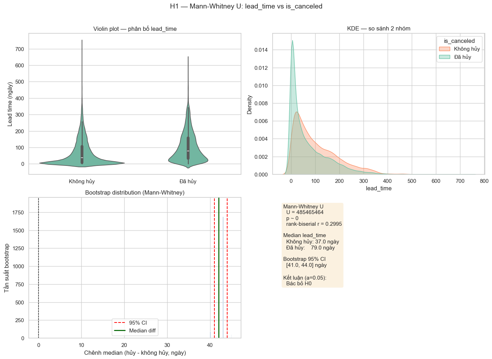

| Panel | Cách đọc visual |
|---|---|
| **Violin (trái trên)** | Hình dạng phân bố; chấm trắng = median. Nhóm “Đã hủy” median cao hơn, thân violin dày hơn ở lead_time lớn |
| **KDE (phải trên)** | Hai đường mật độ chồng nhau. Đường hủy lệch phải → lead_time cao hơn |
| **Bootstrap (trái dưới)** | Histogram chênh median. Đường 0 = H₀. CI đỏ nằm xa 0 về phía dương → chênh thực tế ổn định (~41–44 ngày) |
| **Hộp số (phải dưới)** | U, p, r, median 2 nhóm, CI, kết luận |

**Liên kết chỉ số:** r = 0,30 (trung bình) + CI không chứa 0 → không chỉ “p nhỏ vì n lớn”, mà chênh median ~**42 ngày** có ý nghĩa thực tế.

---

## Chart 02 — H2 Chi-squared: deposit_type

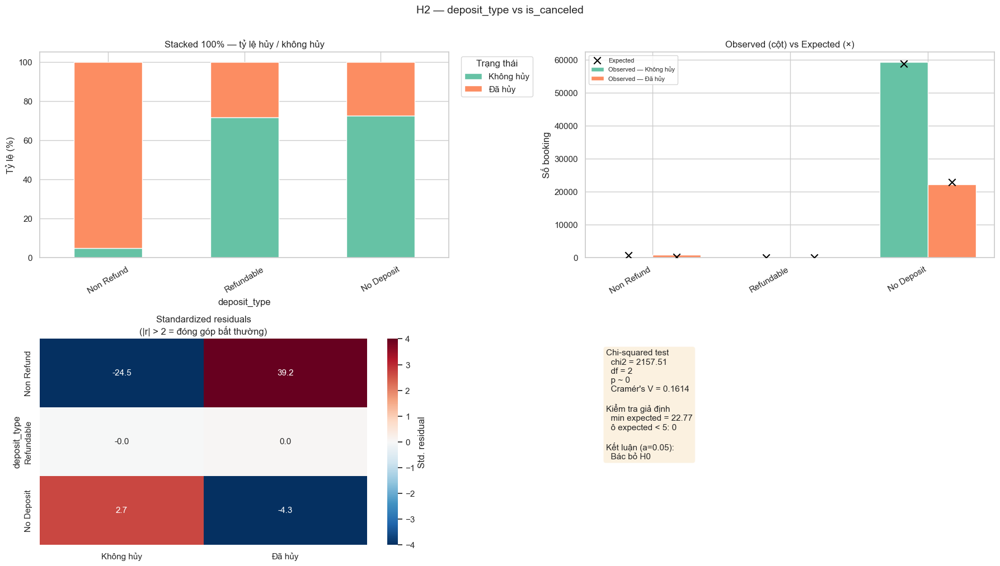

| Panel | Cách đọc |
|---|---|
| **Stacked 100% (trái trên)** | Tỷ lệ hủy trong từng loại cọc. **Non Refund** gần như toàn cam (~95%) |
| **Observed vs Expected (phải trên)** | Cột = quan sát; dấu **x** = kỳ vọng nếu độc lập. Lệch xa x = ô đóng góp vào χ² |
| **Residual heatmap (trái dưới)** | Đỏ = nhiều hơn kỳ vọng; xanh = ít hơn. \|r\| > 2 = bất thường. Non Refund × Đã hủy ≈ **+39** |
| **Hộp số** | χ², df, p, V, min expected, kết luận |

**Cảnh báo diễn giải:** Non Refund tỷ lệ hủy cực cao có thể là **reverse causality** / cách gán nhãn — association ≠ nhân quả.

---

## Chart 03 — H2 Post-hoc z-test (cặp deposit_type)

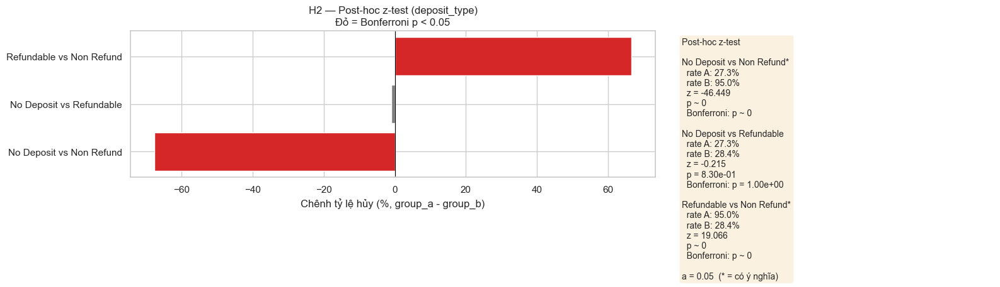

| Visual | Ý nghĩa |
|---|---|
| **Thanh đỏ** | Bonferroni p < 0,05 — cặp khác biệt có ý nghĩa |
| **Thanh xám** | Không có ý nghĩa sau Bonferroni |
| **Hướng thanh** | Phải = group_a hủy nhiều hơn; trái = ít hơn |
| **Độ dài** | Độ lớn chênh tỷ lệ (%) |

**Đọc nhanh:** No Deposit vs Non Refund và Refundable vs Non Refund = **có ý nghĩa**; No Deposit vs Refundable ≈ **không khác** (27,3% vs 28,4%).

---

## Chart 04 — H3 Chi-squared: market_segment

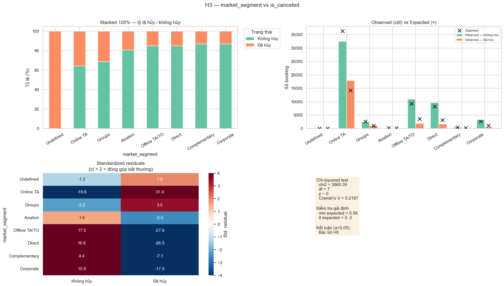

Cùng layout 4 panel như Chart 02.

**Điểm nhìn chính trên residual:**

| Ô | Residual (xấp xỉ) | Ý nghĩa |
|---|---:|---|
| Online TA × Đã hủy | **+31,4** | Hủy nhiều hơn kỳ vọng rất mạnh |
| Offline TA/TO × Đã hủy | **−27,9** | Hủy ít hơn kỳ vọng |
| Direct × Đã hủy | **−26,5** | Hủy ít hơn kỳ vọng |
| Corporate × Đã hủy | **−17,5** | Hủy ít hơn kỳ vọng |

**V = 0,2187** — association phân loại **mạnh nhất** trong các chi-squared. Lưu ý 2 ô expected < 5 (Undefined) → không diễn giải residual nhóm đó.

---

## Chart 05 — H1b Chi-squared: lead_time_bin

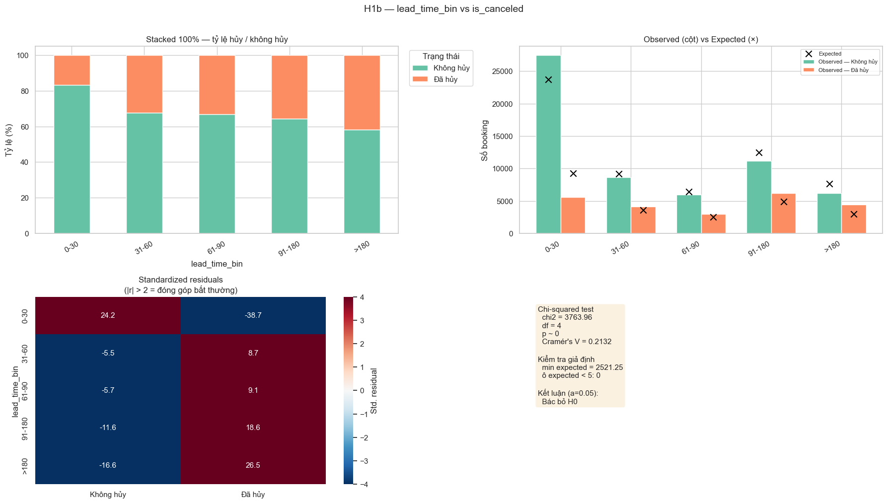

| Bin | Tỷ lệ hủy | Residual “Đã hủy” (xấp xỉ) |
|---|---:|---:|
| 0–30 | **16,8%** | −38,7 (hủy **ít** hơn kỳ vọng) |
| 31–60 | 32,2% | +8,7 |
| 61–90 | 33,2% | +9,1 |
| 91–180 | 35,6% | +18,6 |
| >180 | **41,7%** | +26,5 (hủy **nhiều** hơn kỳ vọng) |

**Cách đọc stacked bar:** phần cam tăng dần khi lead_time dài hơn. Bước nhảy lớn nhất: **0–30 → 31–60** (gần gấp đôi).

---

## Chart 06 — H4 Logistic Regression đa biến

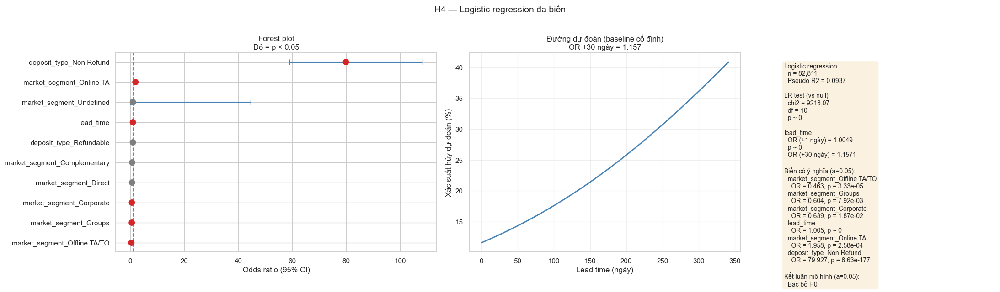

| Panel | Cách đọc |
|---|---|
| **Forest plot (trái)** | Điểm = OR; thanh ngang = 95% CI. Đường đứt tại **OR = 1**. **Đỏ** = p < 0,05; xám = không có ý nghĩa. Phải của 1 = tăng hủy; trái = giảm hủy |
| **Đường dự đoán (giữa)** | P(hủy) tăng theo lead_time khi giữ baseline cố định. Annotation OR(+30 ngày) ≈ 1,16 |
| **Hộp số (phải)** | n, Pseudo R², LR test, OR lead_time, danh sách biến có ý nghĩa |

**OR đáng nhớ:** Online TA > 1 (rủi ro cao hơn baseline); Offline/Corporate/Groups < 1; Non Refund OR rất lớn (cần thận trọng như H2).

---

## Chart 07 — Dashboard effect size tổng hợp

| Panel | Cách đọc |
|---|---|
| **Trái — Effect size** | So sánh **độ mạnh tương đối** (không so tuyệt đối giữa metric khác đơn vị). lead_time *r* cao nhất; Pseudo R² thấp hơn vì là metric khác |
| **Giữa — −log10(p)** | Càng dài càng “p nhỏ”. Đường α = 0,05. Tất cả vượt xa ngưỡng → mọi test bác bỏ H₀ |
| **Phải — Hộp tổng hợp** | Tóm tắt U/χ²/V/r/Pseudo R² và kết luận chung |

**Bài học visual:** Khi mọi p đều ≈ 0 (n lớn), **panel effect size** mới giúp xếp hạng mức ảnh hưởng thực tế.

---

# PHẦN III — Cách đọc chart trong `05b_hypothesis_visualization.ipynb`

Notebook 05b **không chạy test**, mà cung cấp visual mô tả để hiểu pattern hủy / ADR / thời gian — bổ sung cho kết luận kiểm định.

## A. Heatmaps

### Chart 01 — Cancellation rate: market_segment × distribution_channel

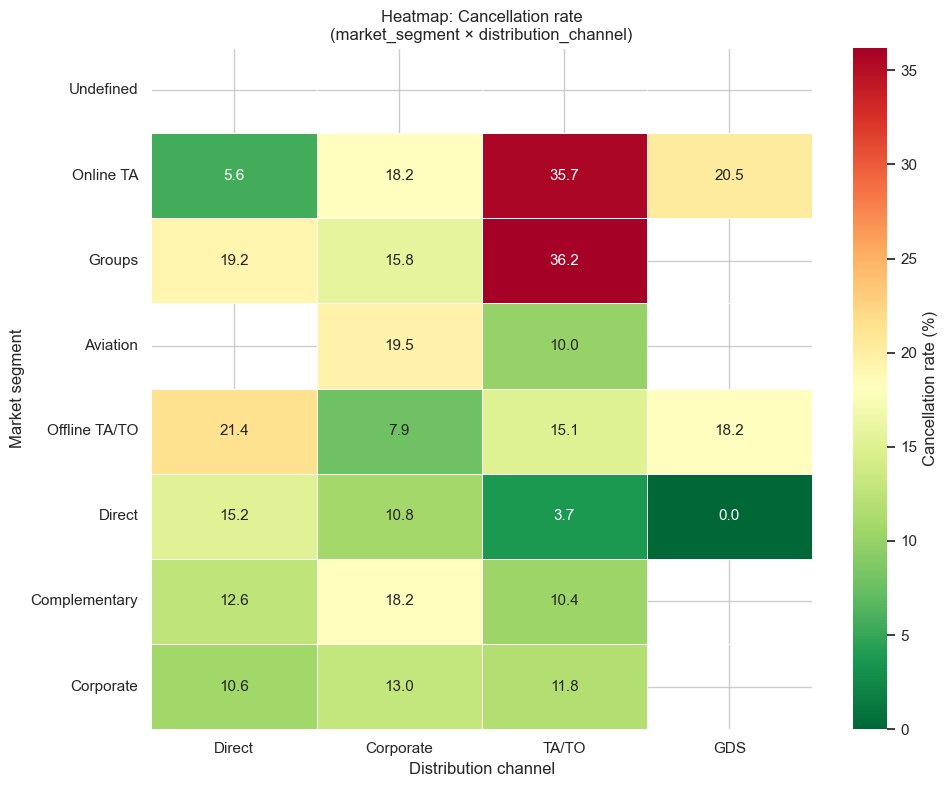

| Thành phần | Cách đọc |
|---|---|
| **Màu** | Xanh = tỷ lệ hủy thấp; đỏ = cao |
| **Số trong ô** | % hủy của cặp segment × channel |
| **Ô trống** | Không có / quá ít dữ liệu |

**Liên kết H3:** Online TA × TA/TO và Groups × TA/TO thường đỏ (~35–36%) — khớp residual Online TA cao. Direct × nhiều channel xanh hơn — khớp Direct hủy thấp hơn kỳ vọng.

---

### Chart 02 — Mean ADR: tháng × năm

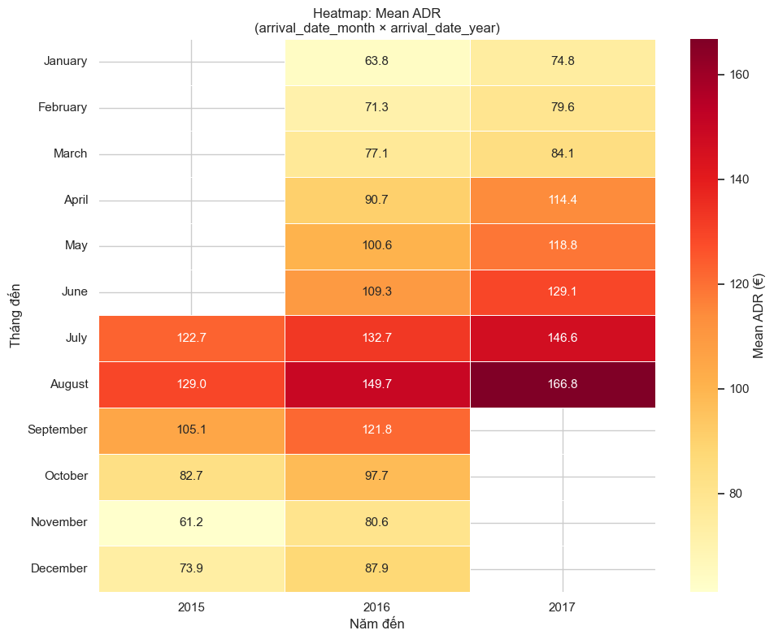

Đọc theo **màu + số**: tháng cao điểm (hè) thường ADR cao hơn; so theo cột năm để thấy xu hướng theo thời gian. Dùng để hiểu bối cảnh giá, không phải kết luận H1–H4 trực tiếp.

---

### Chart 03 — Mean ADR: reserved_room_type × hotel

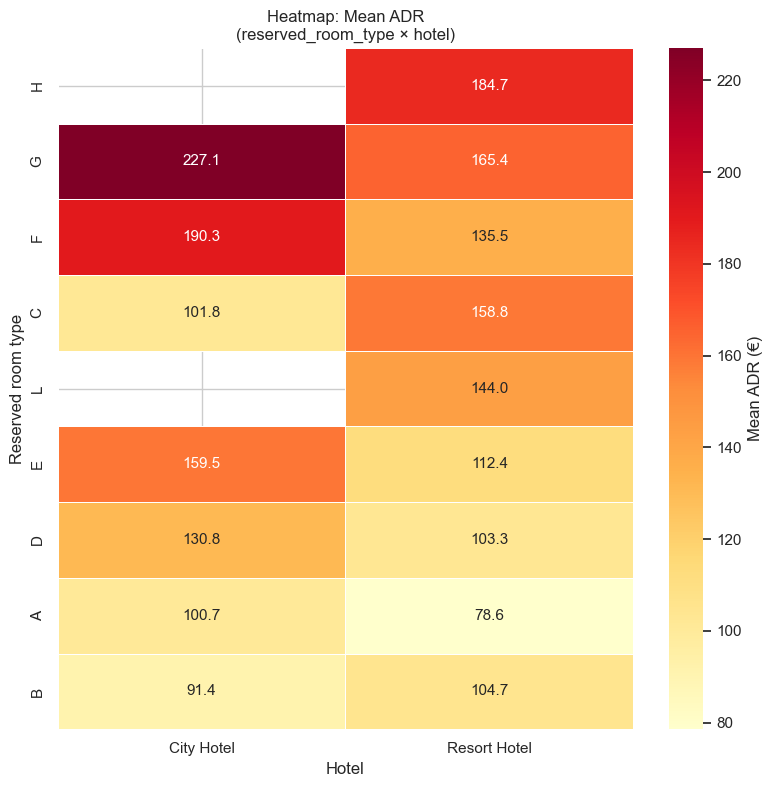

So giá trung bình theo hạng phòng và loại khách sạn. Ô đỏ/đậm = ADR cao hơn. Hữu ích khi giải thích khác biệt City vs Resort.

---

## B. Box plots

### Cách đọc box plot (chung)

| Thành phần | Ý nghĩa |
|---|---|
| **Đường giữa hộp** | Median |
| **Hộp** | IQR (Q1–Q3) — 50% giữa |
| **Râu** | Khoảng điển hình ngoài IQR |
| **Điểm rời** | Outlier |

So 2+ nhóm: nhìn **median lệch** và **hộp dịch lên/xuống** trước, outlier sau.

---

### Chart 04 — lead_time theo is_canceled *(liên kết trực tiếp H1)*

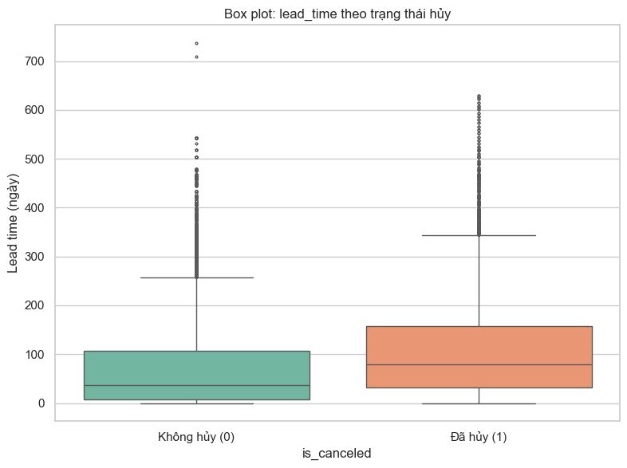

**Cách đọc:** Hộp “Đã hủy” cao hơn rõ (median ~80 vs ~37). Khớp Chart 01 của notebook 05 và r = 0,30. Nhiều outlier lead_time rất dài ở cả hai nhóm → nên dùng Mann-Whitney (robust) thay vì chỉ tin mean/t-test.

---

### Chart 05 — ADR theo tháng đến

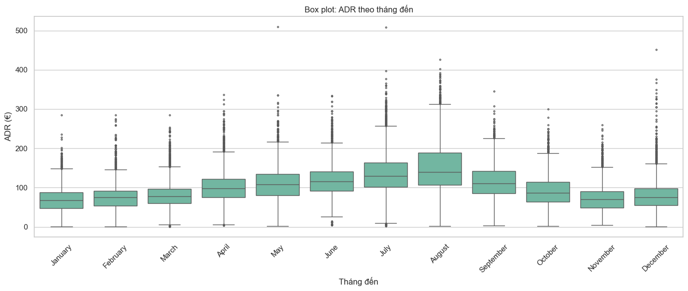

Median/IQR ADR thay đổi theo mùa; tháng hè thường cao hơn. Đọc pattern mùa vụ giá.

---

### Chart 06 — ADR theo ngày trong tuần

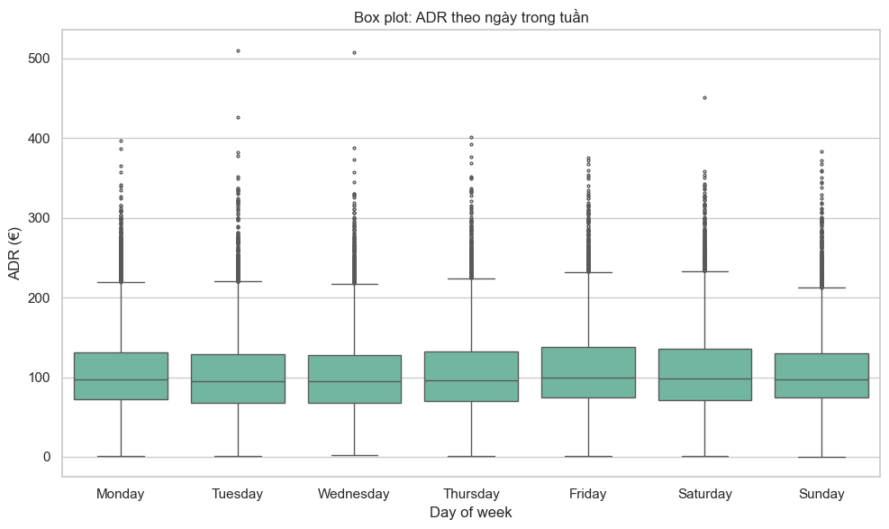

So median ADR giữa các ngày. Chênh nhỏ → ngày trong tuần ít phân hóa giá hơn tháng/mùa.

---

### Chart 07 — ADR theo room_match

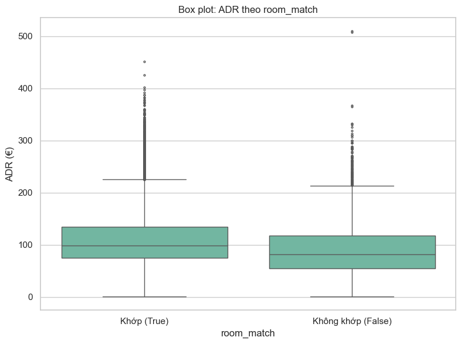

So ADR khi phòng đặt khớp / không khớp phòng nhận. Nhìn median và độ phân tán để thấy nhóm nào giá cao hơn hoặc biến thiên mạnh hơn.

---

### Chart 08 — ADR theo customer_type

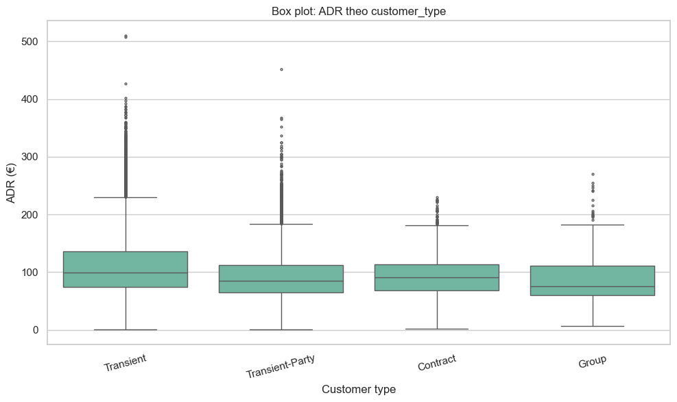

So Transient / Transient-Party / Contract / Group. Hữu ích khi nối với insight segment/customer trong EDA và model.

---

## C. Time series

### Chart 09 — Tỷ lệ hủy theo year_month

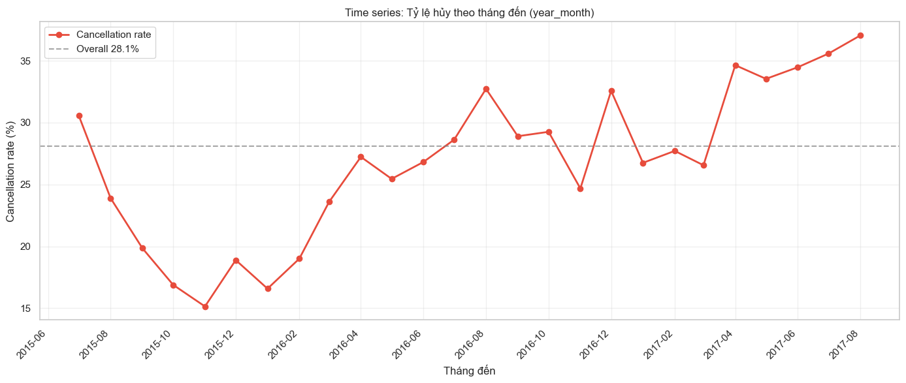

| Visual | Cách đọc |
|---|---|
| **Đường đỏ** | Cancellation rate theo tháng đến |
| **Đường đứt ngang** | Overall ~**28,1%** |
| **Trên / dưới đường đứt** | Tháng rủi ro cao / thấp hơn trung bình |

Thấy biến động mạnh theo thời gian (đáy ~2015-11, đỉnh tăng về 2017) — kiểm định H1–H4 là association **tổng thể**, không thay thế phân tích mùa/năm.

---

### Chart 10 — Mean ADR theo year_month

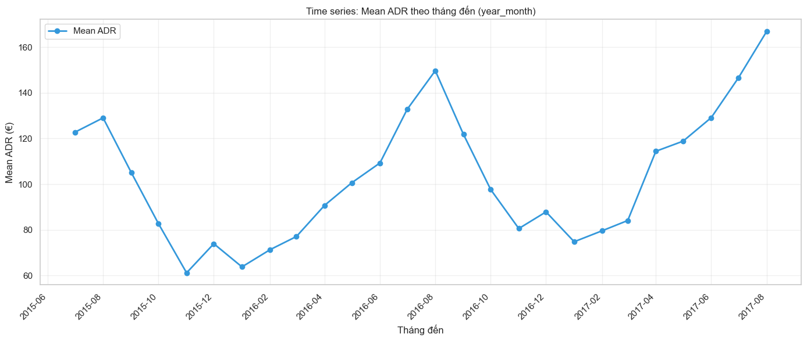

Đọc xu hướng và mùa vụ của giá trung bình theo timeline. Thường có chu kỳ hè cao – cuối năm thấp hơn.

---

### Chart 11 — Dual-axis: Cancellation rate vs Mean ADR

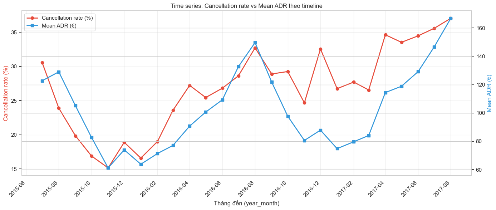

| Trục | Chuỗi |
|---|---|
| Trái (đỏ) | Cancellation rate (%) |
| Phải (xanh) | Mean ADR (€) |

**Cách đọc:** Hai đường tăng/giảm cùng hướng theo mùa → gợi ý đồng biến theo thời gian (không phải chứng minh nhân quả). Dùng để đặt câu hỏi theo dõi thêm, không thay thế OR/logistic.

---

### Chart 12 — Mean ADR theo tháng, tách theo hotel

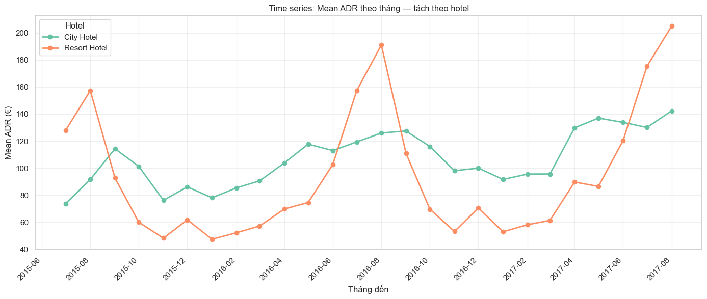

Hai (hoặc nhiều) đường theo `hotel`. So mức giá và biên độ mùa vụ giữa City Hotel vs Resort Hotel trên cùng timeline.

---

# PHẦN IV — Liên kết chỉ số ↔ chart ↔ quyết định

## Checklist đọc `05_hypothesis_testing.ipynb`

1. Đọc **H₀ / H₁** của từng mục.
2. Xem **p-value** → có bác bỏ H₀ không?
3. Bắt buộc xem **effect size** (r / V / OR / Pseudo R²) — không dừng ở p ≈ 0.
4. Với chi-squared: kiểm **min expected** và **residual heatmap**.
5. Với H2: đọc thêm **post-hoc** (cặp nào thật sự khác).
6. Với H4: đọc **OR + CI** trên forest plot, không chỉ Pseudo R².
7. Nhớ: association **≠** nhân quả (đặc biệt Non Refund).

## Checklist đọc `05b_hypothesis_visualization.ipynb`

1. Heatmap hủy: tìm **ô đỏ / xanh** và nối với residual H3.
2. Box lead_time: xác nhận median hủy cao hơn (khớp H1).
3. Time series hủy: xem tháng nào lệch khỏi 28,1%.
4. Dual-axis: mô tả đồng biến theo thời gian, không kết luận nhân quả giá → hủy.

## Bảng “hỏi gì → nhìn đâu?”

| Câu hỏi | Chỉ số | Chart |
|---|---|---|
| Lead time có liên quan hủy không? | H1: p, r, CI | `05` Chart 01; `05b` Chart 04 |
| Lead time dài bao nhiêu thì hủy tăng? | H1b: V + cancel % theo bin | `05` Chart 05 |
| Loại cọc nào khác biệt? | H2: V + post-hoc | `05` Chart 02–03 |
| Segment nào đóng góp lệch mạnh? | Residual \|r\| > 2 | `05` Chart 04; `05b` Chart 01 |
| Sau khi kiểm soát lẫn nhau, biến nào còn ý nghĩa? | H4: OR, p, LR test | `05` Chart 06 |
| Cái nào “mạnh” hơn khi mọi p đều ≈ 0? | Effect size ranking | `05` Chart 07 |
| Hủy biến động theo thời gian thế nào? | — | `05b` Chart 09, 11 |
| ADR / mùa / phòng trông ra sao? | — | `05b` Chart 02–03, 05–08, 10, 12 |

## Ý nghĩa kinh doanh rút từ kiểm định + visual

| Ưu tiên | Hành động gợi ý | Cơ sở |
|---|---|---|
| Cao | Theo dõi booking **lead_time > 30 ngày**, đặc biệt **> 180** | H1, H1b + Chart 05 |
| Cao | Rà soát / forecast riêng **Online TA** | H3 residual + heatmap 05b Chart 01 |
| Trung bình | Phân tích sâu **Non Refund** (nhân quả vs nhãn) | H2 + post-hoc |
| Trung bình | Ưu tiên giữ chỗ ổn định hơn cho **Corporate / Direct / Offline** | H3, H4 OR < 1 |
| Bối cảnh | Theo dõi tháng hủy lệch xa 28,1% | 05b Chart 09 |

---

## Tài liệu liên quan

| File | Nội dung |
|---|---|
| `notebooks/05_hypothesis_testing.ipynb` | Kiểm định H1–H4 |
| `notebooks/05b_hypothesis_visualization.ipynb` | Heatmap / box / time series |
| `reports/05_hypothesis_testing_is_canceled.md` | Báo cáo kết quả kiểm định |
| `reports/figures/05/chart_01.png` … `chart_07.png` | Hình kiểm định |
| `reports/figures/05b/chart_01.png` … `chart_12.png` | Hình visualization |
| `docs/Guide - Cach doc va danh gia mo hinh du doan.md` | Đọc chỉ số & chart mô hình dự đoán |

---

*Cập nhật: 13/7/2026 — hướng dẫn đọc chỉ số thống kê & kiểm định giả thuyết (kèm hình từ `05` và `05b`).*
