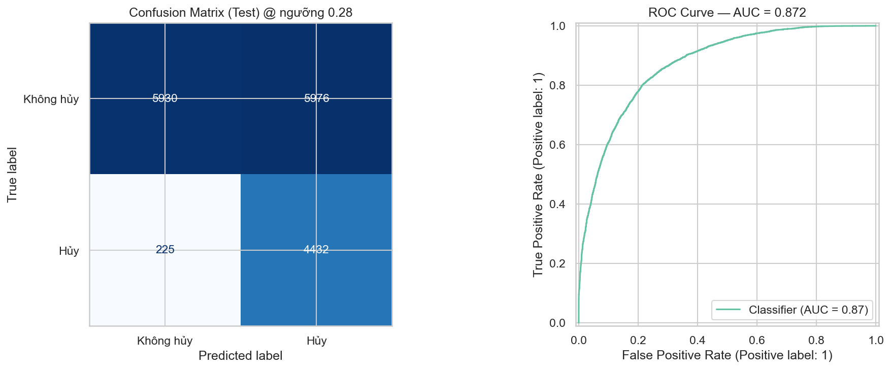
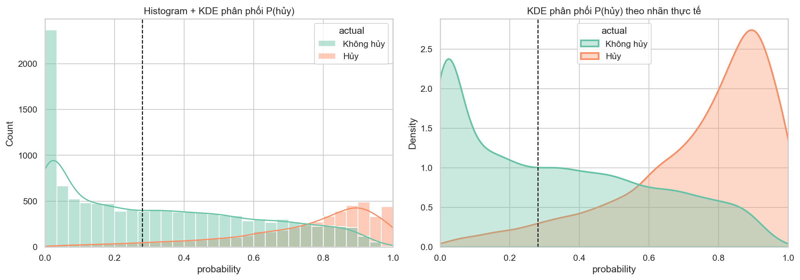
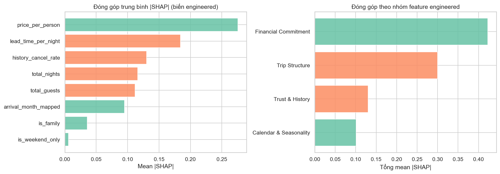
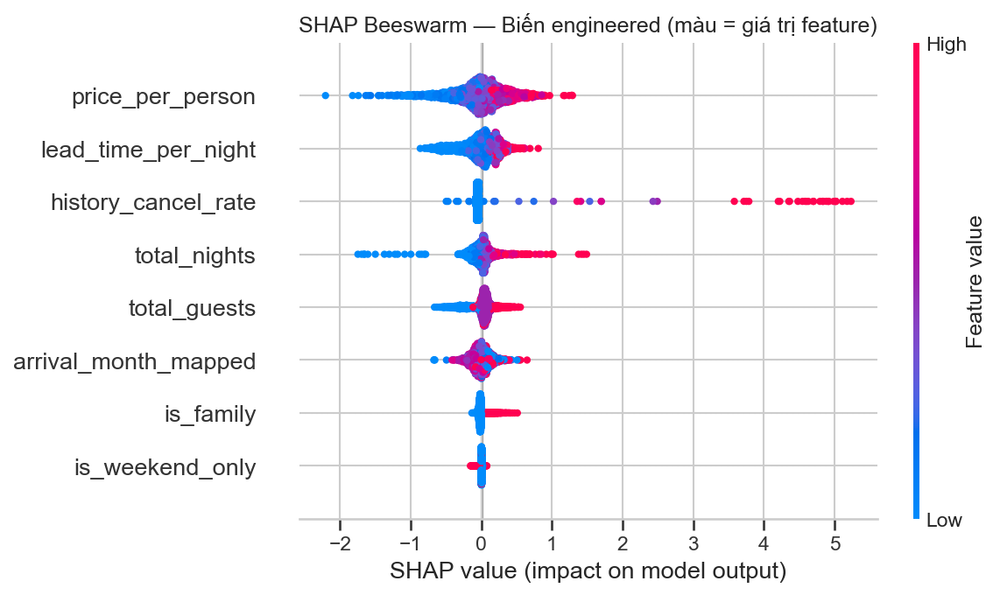
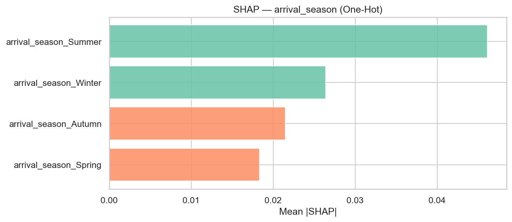
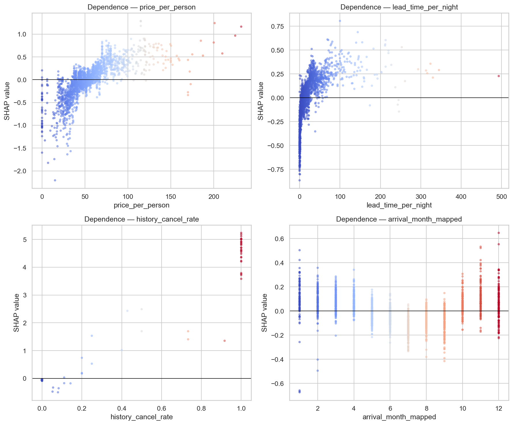
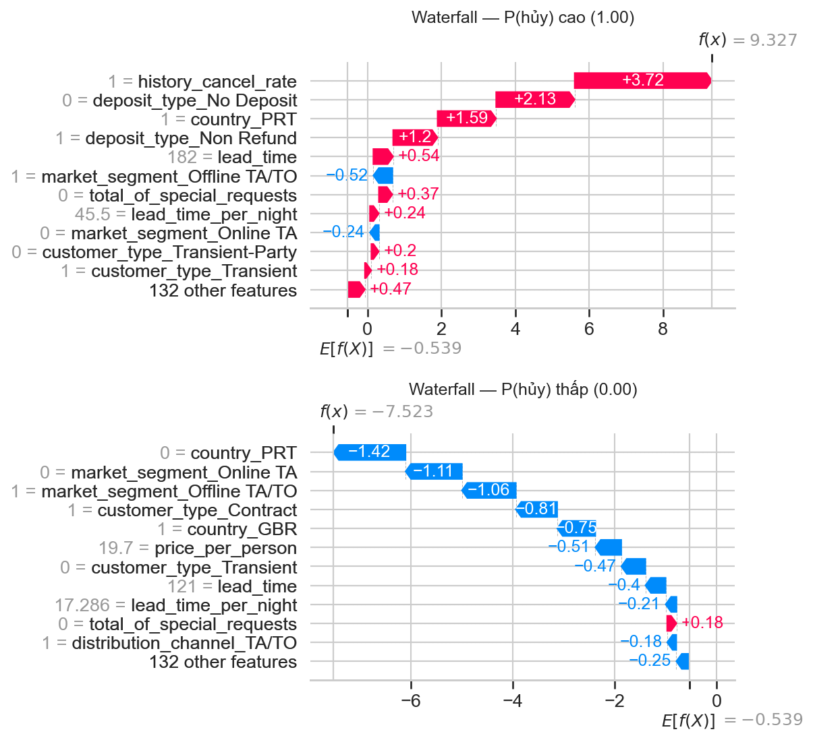
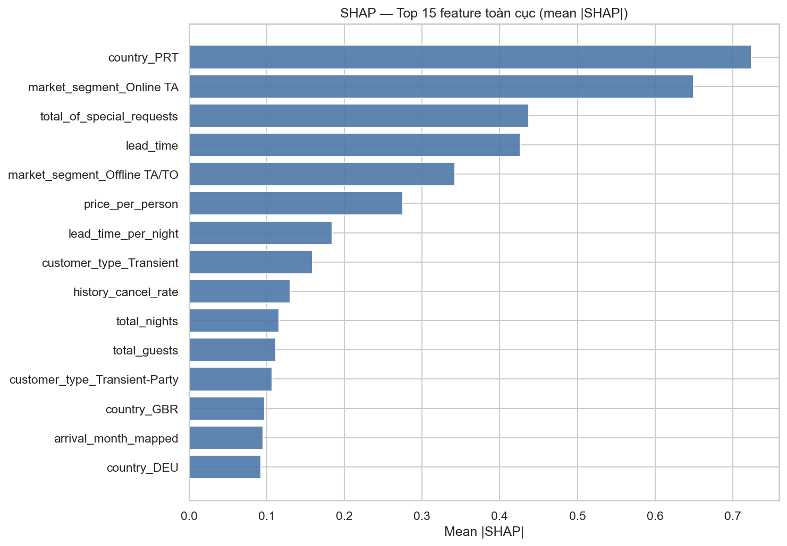

# Hướng dẫn đọc và đánh giá mô hình dự đoán hủy phòng

> **Phạm vi:** `09_cancellation_model_v2_1.ipynb` (LightGBM v2.1)  
> **Biến mục tiêu:** `is_canceled` (0 = Không hủy, 1 = Hủy)  
> **Dữ liệu:** `hotel_bookings_v5.csv` (~82.811 booking, tỷ lệ hủy ~28,12%)  
> **Hình ảnh:** `reports/figures/09_1/` (xuất từ notebook v2.1)

---

## Mục tiêu tài liệu

Sau khi đọc xong, bạn có thể:

1. Đọc đúng **mọi chỉ số** trên tập test (ROC-AUC, Recall, Precision, F1, Accuracy, CV).
2. Đọc **Confusion Matrix, ROC, phân phối xác suất, Feature Importance**.
3. Đọc **toàn bộ chart SHAP** (bar, beeswarm, dependence, waterfall).
4. Liên kết chỉ số ↔ chart ↔ ý nghĩa kinh doanh (ưu tiên bắt booking sẽ hủy).

---

## Bối cảnh mô hình v2.1 (tóm tắt)

| Thành phần | Giá trị |
|---|---|
| Thuật toán | LightGBM (`LGBMClassifier`) |
| Ngưỡng dự đoán | **0,28** — `P(hủy) ≥ 0,28` → dự đoán **Hủy** |
| Cân bằng lớp | `scale_pos_weight` × 1,5 so với tỷ lệ tự nhiên |
| Train / Test | 66.248 / 16.563 (stratified, tỷ lệ hủy giữ ~28,12%) |
| Metric tối ưu khi tune | ROC-AUC (GridSearchCV + Optuna) |

**Nguyên tắc kinh doanh của v2.1:** hạ ngưỡng và tăng trọng số lớp Hủy để **ưu tiên Recall Hủy** (bắt được nhiều booking sẽ hủy), chấp nhận Precision thấp hơn và nhiều False Positive hơn.

---

# PHẦN I — Cách đọc chỉ số đánh giá

## 1. Confusion Matrix — bốn ô cơ bản

Khi đã chọn ngưỡng (ở đây **0,28**), mỗi booking được gán nhãn dự đoán. Bốn ô:

| Ô | Tên | Ý nghĩa | Hệ quả kinh doanh |
|---|---|---|---|
| **TP** | True Positive | Dự đoán Hủy, **đúng** là Hủy | Bắt đúng rủi ro — tốt cho overbooking / follow-up |
| **TN** | True Negative | Dự đoán Không hủy, **đúng** | Không làm phiền khách chắc chắn đến |
| **FP** | False Positive | Dự đoán Hủy, nhưng khách **vẫn đến** | False alarm — có thể overbooking / chính sách quá chặt |
| **FN** | False Negative | Dự đoán Không hủy, nhưng khách **hủy** | **Nguy hiểm nhất** nếu dùng cho overbooking |

Với class lệch (~28% hủy), **không** nên chỉ nhìn Accuracy.

---

## 2. Các chỉ số chính trên tập Test

Số liệu từ notebook v2.1 (mô hình **Tuned**, ngưỡng **0,28**):

| Chỉ số | Giá trị Tuned | Công thức / ý nghĩa | Cách đọc trong bối cảnh khách sạn |
|---|---:|---|---|
| **ROC-AUC** | **0,8720** | Khả năng xếp hạng booking Hủy cao hơn Không hủy | 0,80+ = tốt; đo **khả năng phân biệt**, không phụ thuộc ngưỡng |
| **Recall Hủy** | **0,9517** | TP / (TP + FN) — bắt được bao nhiêu % hủy thật | ~95% booking hủy bị gắn cờ — đúng mục tiêu v2.1 |
| **Precision Hủy** | **0,4258** | TP / (TP + FP) — trong số dự đoán hủy, bao nhiêu % đúng | ~43% dự đoán “Hủy” là đúng; nhiều false alarm |
| **F1 Hủy** | **0,5884** | Trung hòa Precision & Recall | Tổng hợp; khi ưu tiên Recall thì F1 thường thấp hơn ngưỡng 0,50 |
| **Accuracy** | **0,6256** | (TP + TN) / tổng | Dễ gây hiểu nhầm khi class lệch — **không** dùng làm metric chính |

### Classification Report (Tuned @ 0,28)

| Lớp | Precision | Recall | F1 | Support |
|---|---:|---:|---:|---:|
| Không hủy | 0,96 | 0,50 | 0,66 | 11.906 |
| Hủy | 0,43 | 0,95 | 0,59 | 4.657 |
| Accuracy | — | — | 0,63 | 16.563 |

**Cách đọc nhanh:**

- Recall **Không hủy = 0,50** → chỉ một nửa booking không hủy được dự đoán đúng “Không hủy” (do ngưỡng thấp đẩy nhiều case sang “Hủy”).
- Precision **Không hủy = 0,96** → khi mô hình nói “Không hủy”, gần như chắc chắn đúng (vì FN rất ít).

---

## 3. So sánh Baseline vs Tuned

| Model | ROC-AUC | Recall Hủy | Precision Hủy | F1 Hủy | Accuracy |
|---|---:|---:|---:|---:|---:|
| Baseline | 0,8658 | 0,9620 | 0,4050 | 0,5700 | 0,5920 |
| **Tuned** | **0,8720** | 0,9517 | **0,4258** | **0,5884** | **0,6256** |

**Cách đọc:** Tuned cải thiện AUC, Precision, F1, Accuracy; Recall hơi giảm so Baseline nhưng vẫn rất cao (~95%). Chọn Tuned vì **phân biệt tốt hơn** và cân bằng hơn.

---

## 4. CV ROC-AUC (đánh giá ổn định)

| Chỉ số | Giá trị | Ý nghĩa |
|---|---:|---|
| CV ROC-AUC 5-fold (train) | **0,8677 ± 0,0038** | Ước lượng trên train qua cross-validation |
| Production CV ROC-AUC (artifact) | 0,8660 | Bản params đã lưu |
| Test ROC-AUC | 0,8720 | Đánh giá cuối trên test |

**Cách đọc:** Test AUC ≈ CV AUC → mô hình **không overfit rõ**. Độ lệch chuẩn CV nhỏ (±0,0038) → ổn định giữa các fold.

---

## 5. Ngưỡng dự đoán — trade-off Recall ↔ F1

| Ngưỡng | Recall Hủy | F1 Hủy | Khi nào dùng |
|---:|---:|---:|---|
| 0,50 | 0,8578 | **0,6613** | Cân bằng hơn; ít false alarm hơn |
| 0,35 | 0,9270 | 0,6120 | Trung gian (v2 cũ) |
| **0,28** | **0,9517** | 0,5884 | **v2.1** — ưu tiên bắt hủy |

**Quy tắc:** Hạ ngưỡng → Recall ↑, Precision ↓ (thường), F1 có thể ↓. Chọn ngưỡng theo **chi phí sai lầm**, không theo “số đẹp” trên Accuracy.

---

## 6. Phân phối xác suất P(hủy)

Thống kê trên test:

| Nhãn thực tế | n | Mean P(hủy) | Median | Std |
|---|---:|---:|---:|---:|
| Không hủy | 11.906 | 0,3285 | 0,2824 | 0,2767 |
| Hủy | 4.657 | **0,7458** | **0,8110** | 0,2158 |

**Cách đọc:** Nhóm Hủy có P trung bình ~0,75; nhóm Không hủy ~0,33. Hai phân bố tách khá rõ → hỗ trợ AUC cao. Median Không hủy (~0,28) gần ngưỡng → nhiều booking “biên” bị đẩy sang dự đoán Hủy (giải thích FP cao).

---

# PHẦN II — Cách đọc chart đánh giá mô hình

## Chart 01 — Confusion Matrix & ROC Curve



### A. Confusion Matrix (trái) — @ ngưỡng 0,28

|  | Dự đoán Không hủy | Dự đoán Hủy |
|---|---:|---:|
| **Thực Không hủy** | TN = **5.930** | FP = **5.976** |
| **Thực Hủy** | FN = **225** | TP = **4.432** |

**Cách đọc visual:**

1. Ô **FN gần trắng / nhỏ (225)** → bỏ sót hủy rất ít → Recall cao.
2. Ô **FP lớn (5.976)** gần bằng TN → nhiều false alarm → Precision ~0,43.
3. Màu đậm hơn = số lượng lớn hơn — nhìn màu trước, rồi đọc số.

**Kiểm tra nhanh bằng chỉ số:**

- Recall Hủy ≈ 4432 / (4432 + 225) ≈ **0,95**
- Precision Hủy ≈ 4432 / (4432 + 5976) ≈ **0,43**

### B. ROC Curve (phải) — AUC = 0,872

| Thành phần visual | Ý nghĩa |
|---|---|
| Trục X | False Positive Rate = FP / (FP + TN) |
| Trục Y | True Positive Rate = Recall |
| Đường cong gần góc trên-trái | Phân biệt tốt |
| Đường chéo (tưởng tượng) | AUC = 0,5 = đoán ngẫu nhiên |
| **Diện tích dưới cong** | AUC = **0,872** |

**Lưu ý:** ROC **không** gắn với một ngưỡng cố định; mỗi điểm trên cong là một ngưỡng khác nhau. Confusion Matrix mới là “ảnh chụp” tại **0,28**.

---

## Chart 02 — Phân phối xác suất dự đoán



| Panel | Loại | Cách đọc |
|---|---|---|
| **Trái** | Histogram + KDE | Số lượng booking theo P(hủy); đỉnh xanh (Không hủy) gần 0; đỉnh cam (Hủy) gần 0,9 |
| **Phải** | KDE mật độ | Hình dạng phân bố (không phụ thuộc count); thấy vùng chồng chéo rõ hơn |
| **Đường đứt nét** | Ngưỡng 0,28 | Trái đường = dự đoán Không hủy; phải = dự đoán Hủy |

**Ý nghĩa:**

- Hai đỉnh tách xa → mô hình **phân biệt tốt** (khớp AUC cao).
- Vùng chồng giữa ~0,3–0,7 → nơi dễ nhầm; ngưỡng 0,28 cắt sâu vào đuôi phân bố Không hủy → nhiều FP nhưng ít FN.
- Median Không hủy ≈ ngưỡng → visual giải thích vì sao Accuracy không cao dù AUC tốt.

---

## Chart 03 — Feature Importance (gain)


| Thành phần | Ý nghĩa |
|---|---|
| Trục X | **Gain** — tổng đóng góp khi feature được dùng để tách node trong cây |
| Thứ tự trên → dưới | Quan trọng giảm dần |
| Thanh dài | Model phụ thuộc nhiều vào feature đó khi học |

**Top tín hiệu (ví dụ):** `lead_time`, `market_segment_Online TA`, `price_per_person`, `lead_time_per_night`, `total_of_special_requests`, `country_PRT`…

**Cách đọc đúng / sai:**

| Đúng | Sai |
|---|---|
| Feature nào model **dùng nhiều** để giảm loss | Feature “gây hủy” theo nghĩa nhân quả |
| So sánh **tương đối** trong cùng model | So sánh gain tuyệt đối giữa 2 model khác nhau |
| Bổ sung bằng SHAP để biết **hướng** (+/−) | Kết luận hướng chỉ từ gain |

---

# PHẦN III — Cách đọc chart SHAP

SHAP (SHapley Additive exPlanations) trả lời: *feature này đẩy dự đoán Hủy lên hay xuống bao nhiêu so với baseline?*

**Quy ước dấu (class Hủy):**

| SHAP | Ảnh hưởng |
|---|---|
| **> 0** (thường đỏ trên waterfall) | Tăng điểm / xác suất **Hủy** |
| **< 0** (thường xanh) | Giảm điểm / xác suất **Hủy** |
| **\|SHAP\| lớn** | Ảnh hưởng mạnh (bất kể hướng) |

Notebook dùng `TreeExplainer` trên mẫu test (~2.000 quan sát).

---

## Chart 04 — Mean \|SHAP\| biến engineered & theo nhóm



### Trái — từng biến engineered

Thanh dài hơn = trung bình \|SHAP\| lớn hơn → biến ảnh hưởng mạnh **toàn cục**.

Thứ tự điển hình: `price_per_person` > `lead_time_per_night` > `history_cancel_rate` > `total_nights` > …

**Lưu ý:** Đây chỉ là **độ mạnh trung bình**, chưa nói hướng (cao/thấp làm tăng hay giảm hủy).

### Phải — tổng theo nhóm nghiệp vụ

| Nhóm | Ý nghĩa kinh doanh |
|---|---|
| Financial Commitment | Cam kết tài chính (`price_per_person`, …) |
| Trip Structure | Cấu trúc chuyến (`lead_time_per_night`, `total_nights`, …) |
| Trust & History | Lịch sử hủy (`history_cancel_rate`) |
| Calendar & Seasonality | Tháng / mùa |

**Cách đọc:** Nhóm Financial / Trip thường đóng góp lớn → ưu tiên giám sát giá và cấu trúc đặt phòng khi vận hành.

---

## Chart 05 — SHAP Beeswarm (biến engineered)



| Thành phần visual | Cách đọc |
|---|---|
| **Trục Y** | Feature, xếp theo tầm ảnh hưởng |
| **Trục X** | SHAP value (trái = giảm hủy, phải = tăng hủy) |
| **Màu** | Giá trị feature: xanh = thấp, đỏ = cao |
| **Độ dày đám điểm** | Mật độ booking |

**Ví dụ diễn giải:**

- `price_per_person`: đỏ bên phải → giá/người cao thường **tăng** rủi ro hủy.
- `lead_time_per_night`: đỏ bên phải → đặt sớm / đêm dài thường **tăng** rủi ro.
- `history_cancel_rate`: đuôi đỏ dài sang phải (+ vài đơn vị) → khách từng hủy nhiều là tín hiệu **rất mạnh**, dù không áp dụng mọi booking.
- `is_weekend_only`: cụm sát 0 → ảnh hưởng yếu.

---

## Chart 06 — SHAP `arrival_season` (One-Hot)



Mean \|SHAP\| theo mùa (Summer > Winter > Autumn > Spring).

**Cách đọc:** Mùa hè ảnh hưởng trung bình lớn nhất trong bốn mùa One-Hot. Chart này **không** nói Summer luôn tăng hủy — chỉ nói “biết booking thuộc Summer thay đổi dự đoán nhiều hơn Spring”. Để biết hướng, xem beeswarm / dependence / waterfall.

---

## Chart 07 — SHAP Dependence (4 biến mạnh)



| Panel | Cách đọc xu hướng |
|---|---|
| **price_per_person** | Giá thấp → SHAP âm (giảm hủy); giá tăng → SHAP dương rồi bão hòa |
| **lead_time_per_night** | Gần 0 → giảm hủy; tăng dần → tăng rủi ro hủy |
| **history_cancel_rate** | ~0 gần trung tính; = 1 → SHAP nhảy rất cao (+4 đến +5) |
| **arrival_month_mapped** | Dạng chữ U / theo mùa: giữa năm thường âm hơn; cuối năm dương hơn |

**Cách đọc visual:**

1. Nhìn **trục X** = giá trị feature thực.
2. Nhìn **trục Y** = SHAP (hướng + độ lớn).
3. Đường ngang Y = 0 = không đẩy dự đoán.
4. Màu thường phản ánh chính giá trị feature (xanh thấp → đỏ cao).

Đây là chart tốt nhất để trả lời: *“Khi feature tăng, rủi ro hủy đi lên hay xuống?”*

---

## Chart 08 — SHAP Beeswarm toàn cục (Top 15)


Giống Chart 05 nhưng gồm **cả feature gốc + One-Hot** (không chỉ engineered).

**Một số hướng điển hình:**

| Feature | Đọc màu–hướng |
|---|---|
| `country_PRT` = 1 (đỏ) | Thường đẩy **tăng** hủy |
| `market_segment_Online TA` = 1 | Thường **tăng** hủy |
| `total_of_special_requests` cao (đỏ) | Thường **giảm** hủy (đỏ bên trái) |
| `lead_time` cao | Thường **tăng** hủy |
| `market_segment_Offline TA/TO` = 1 | Thường **giảm** hủy |
| `history_cancel_rate` cao | Đuôi cực mạnh sang phải |
| `country_GBR` / `country_DEU` = 1 | Thường **giảm** hủy |

**So với Chart 03 (gain):** Gain nói “dùng nhiều”; Beeswarm nói “dùng theo hướng nào”. Hai chart bổ sung nhau — có thể lệch thứ tự vì metric khác nhau.

---

## Chart 09 — SHAP Waterfall (giải thích từng booking)



| Thành phần | Ý nghĩa |
|---|---|
| **E[f(X)]** (đáy) | Baseline trung bình mô hình (log-odds) |
| **Thanh đỏ** | Feature đẩy **lên** (tăng hủy) |
| **Thanh xanh** | Feature đẩy **xuống** (giảm hủy) |
| **f(x)** (đỉnh) | Điểm cuối của booking đó → chuyển thành P(hủy) |

### Ví dụ trên chart

**P(hủy) cao (~1,00):** `history_cancel_rate = 1`, `country_PRT = 1`, các tín hiệu deposit / lead_time cộng dồn → f(x) rất dương.

**P(hủy) thấp (~0,00):** không phải PRT, không Online TA, Offline TA/TO, Contract, GBR… kéo mạnh xuống → f(x) rất âm.

**Cách dùng vận hành:** Khi cần giải thích “vì sao booking này bị gắn cờ”, waterfall là chart chính — liệt kê 5–10 lý do đóng góp lớn nhất.

---

## Chart 10 — Mean \|SHAP\| Top 15 toàn cục



Bar chart độ mạnh trung bình toàn cục (không có hướng).

Thứ tự điển hình: `country_PRT` > `market_segment_Online TA` > `total_of_special_requests` > `lead_time` > …

**Cách đọc cùng Chart 08:**

| Chart | Trả lời câu hỏi |
|---|---|
| Chart 10 (bar) | Feature nào quan trọng nhất **trung bình**? |
| Chart 08 (beeswarm) | Feature đó đẩy hủy **lên hay xuống**, khi giá trị cao/thấp? |

---

# PHẦN IV — Liên kết chỉ số ↔ chart ↔ quyết định

## Checklist đọc kết quả notebook

1. **ROC-AUC test & CV** — phân biệt có tốt và ổn định không? (ở đây ~0,87, gap nhỏ)
2. **Confusion Matrix @ 0,28** — FN có đủ thấp không? FP có chấp nhận được không?
3. **Recall / Precision / F1 Hủy** — có khớp mục tiêu ưu tiên Recall không?
4. **So sánh ngưỡng 0,50 / 0,35 / 0,28** — có cần đổi ngưỡng theo chi phí sai lầm không?
5. **Phân phối P(hủy)** — hai lớp có tách không? ngưỡng cắt chỗ nào?
6. **Gain + SHAP** — insight có khớp EDA/hypothesis (`lead_time`, Online TA, special requests, PRT…)?
7. **Waterfall** — có giải thích được case rủi ro cao / thấp không?

## Bảng “nhìn chart nào khi hỏi gì?”

| Câu hỏi | Chart / chỉ số |
|---|---|
| Model phân biệt hủy / không hủy tốt không? | ROC-AUC, Chart 01 (phải), Chart 02 |
| Ở ngưỡng 0,28, sai bao nhiêu? | Confusion Matrix (Chart 01 trái) |
| Bắt được bao nhiêu % hủy thật? | Recall Hủy |
| Cảnh báo hủy có đáng tin không? | Precision Hủy |
| Feature nào model dùng nhiều khi học? | Chart 03 (gain) |
| Feature nào ảnh hưởng mạnh trung bình? | Chart 04, Chart 10 |
| Feature cao/thấp làm tăng hay giảm hủy? | Chart 05, 07, 08 |
| Mùa nào ảnh hưởng mạnh? | Chart 06 |
| Vì sao booking *này* bị dự đoán hủy? | Chart 09 (waterfall) |

## Trade-off kinh doanh v2.1 (tóm tắt)

```
Ngưỡng thấp (0,28) + scale_pos_weight cao
        │
        ├── Recall Hủy ↑  (~95%)     → ít bỏ sót hủy
        ├── Precision ↓   (~43%)     → nhiều false alarm
        ├── Accuracy ~63%            → không phản ánh đúng giá trị model
        └── AUC ~0,87                → khả năng xếp hạng vẫn tốt
```

Nếu vận hành chịu được false alarm (ví dụ chỉ gửi reminder / yêu cầu xác nhận), giữ **0,28**. Nếu false alarm đắt (từ chối overbook oan / làm phiền khách), cân nhắc nâng ngưỡng lên **0,35** hoặc **0,50** và chấp nhận Recall thấp hơn.

---

## Tài liệu & file liên quan

| File | Nội dung |
|---|---|
| `models/Cancellation Predict Model v2/09_cancellation_model_v2_1.ipynb` | Notebook nguồn |
| `reports/figures/09_1/chart_01.png` … `chart_10.png` | Hình dùng trong guide này |
| `docs/Guide - Cach doc chi so thong ke.md` | Chỉ số hypothesis + khái niệm metric dự báo chung |
| `models/Cancellation Predict Model v2/artifacts/best_params_v2_1.json` | Hyperparameter production |

---

*Cập nhật: 13/7/2026 — hướng dẫn đọc chỉ số & chart mô hình LightGBM v2.1 (kèm hình từ `09_cancellation_model_v2_1.ipynb`).*
