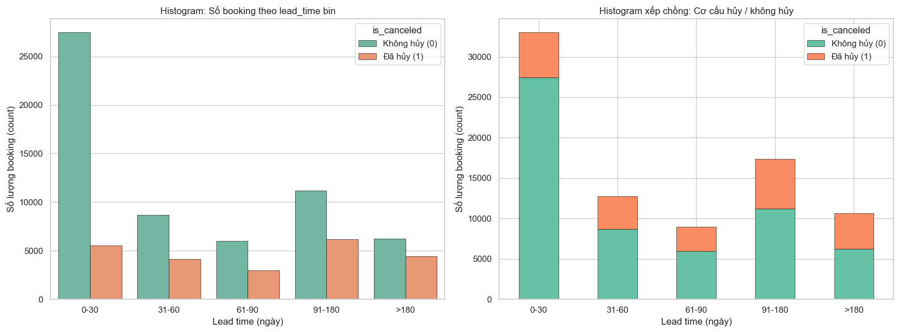
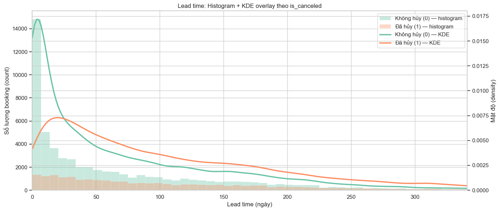
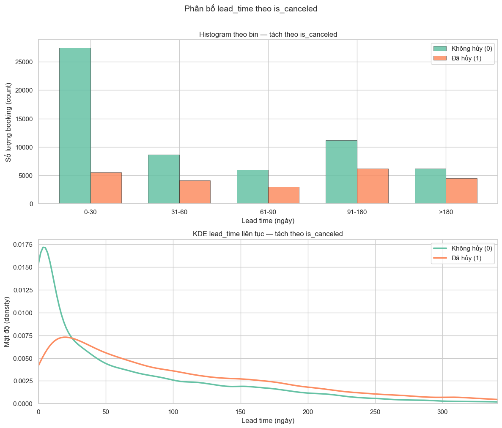
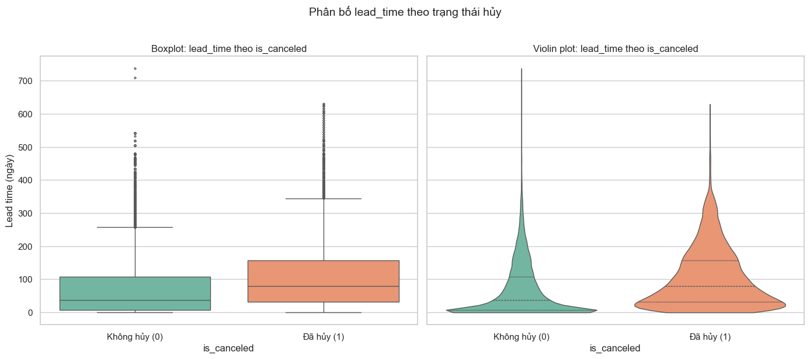
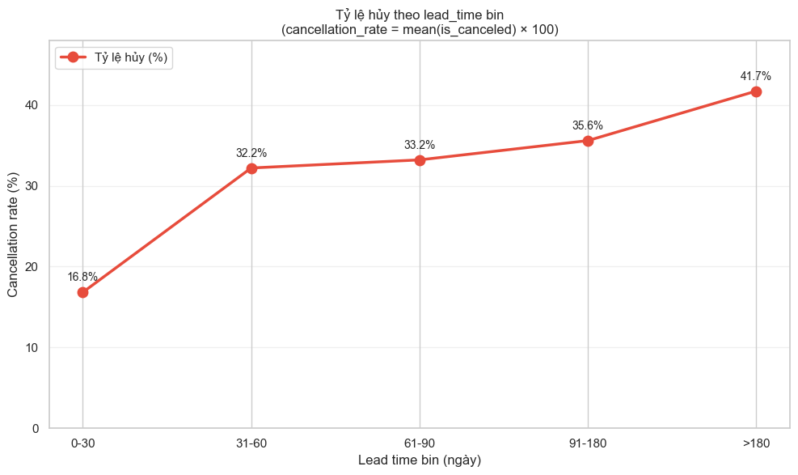
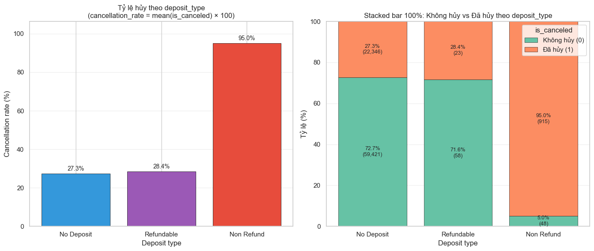
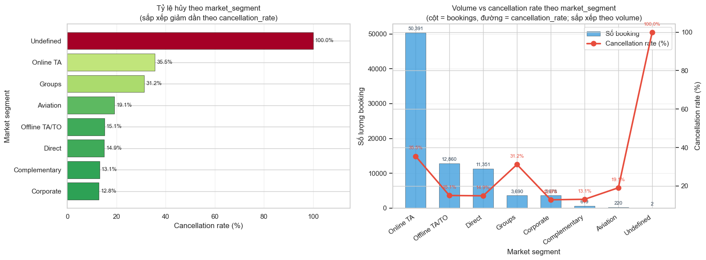
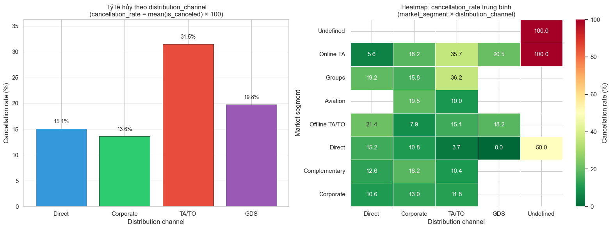

# EDA Stage 1: Cancellation Analysis

> **Nguồn dữ liệu:** `hotel_bookings_v4.csv`  
> **Phạm vi:** 82.811 booking | Tỷ lệ hủy tổng thể: **28,12%** (23.284 booking bị hủy)  
> **Notebook tham chiếu:** `02_eda_stage1_cancellation.ipynb`

---

## Mục tiêu phân tích

Giai đoạn EDA Stage 1 tập trung khám phá mối quan hệ giữa **tỷ lệ hủy phòng (`is_canceled`)** và các yếu tố hành vi đặt phòng: thời gian đặt trước (`lead_time`), loại tiền cọc (`deposit_type`), phân khúc thị trường (`market_segment`) và kênh phân phối (`distribution_channel`). Mười một biểu đồ dưới đây được nhóm theo từng chiều phân tích, kèm insight có thể hành động được.

---

## Nhóm 1 — Lead time (Biểu đồ 1 → 5)

### Biểu đồ 1: Histogram số booking theo lead_time bin (tách theo `is_canceled`)

**Mô tả:** Grouped bar + stacked bar 100% — trục X = khoảng lead_time (0–30, 31–60, 61–90, 91–180, >180 ngày), trục Y = số lượng booking, tách màu theo Không hủy / Đã hủy.

**Insight:**

| Lead time bin | Tổng booking | Đã hủy | Tỷ lệ hủy |
|---|---:|---:|---:|
| 0–30 ngày | 33.039 | 5.559 | 16,8% |
| 31–60 ngày | 12.776 | 4.115 | 32,2% |
| 61–90 ngày | 8.967 | 2.978 | 33,2% |
| 91–180 ngày | 17.355 | 6.178 | 35,6% |
| >180 ngày | 10.674 | 4.454 | 41,7% |

- Bin **0–30 ngày** chiếm **~39,9%** tổng booking và có volume không hủy lớn nhất (27.480 booking) — đây là nhóm "an toàn" nhưng vẫn đóng góp **23,9%** tổng số booking bị hủy.
- Bin **91–180 ngày** có volume cao thứ hai (17.355) và đóng góp **26,5%** tổng cancellation — rủi ro tập trung ở khoảng đặt trước trung-dài hạn.
- Stacked bar 100% cho thấy tỷ lệ phần "Đã hủy" tăng dần rõ rệt từ bin 0–30 sang >180, xác nhận lead_time dài hơn → xác suất hủy cao hơn.

---

### Biểu đồ 2: Histogram + KDE overlay (trục Y kép)

**Mô tả:** Histogram count theo lead_time liên tục (trục Y trái) kết hợp đường KDE density (trục Y phải), tách theo `is_canceled`.

**Insight:**

- Phân bố lead_time của booking **không hủy** tập trung mạnh ở vùng **0–100 ngày**, đỉnh density cao nhất quanh **30–60 ngày**.
- Booking **đã hủy** có phân bố dịch sang phải (lead_time cao hơn), đỉnh density nằm ở khoảng **60–120 ngày** và vẫn còn đuôi dài đến >300 ngày.
- Hai đường KDE giao nhau ở khoảng **~45–55 ngày**: dưới ngưỡng này booking không hủy chiếm ưu thế; trên ngưỡng này booking hủy trở nên phổ biến hơn tương đối.

---

### Biểu đồ 3: Histogram theo bin + KDE liên tục (2 subplot)

**Mô tả:** Subplot trái = histogram rời theo bin; subplot phải = KDE lead_time liên tục — cả hai tách theo trạng thái hủy.

**Insight:**

- Histogram theo bin làm rõ **bước nhảy lớn nhất** về tỷ lệ hủy xảy ra giữa bin **0–30** (16,8%) và **31–60** (32,2%) — gần **gấp đôi**.
- KDE liên tục bổ sung góc nhìn: booking hủy không chỉ "dịch phải" mà còn **phân tán rộng hơn** (độ lệch chuẩn cao hơn), phản ánh sự không chắc chắn cao hơn ở các booking đặt xa ngày đến.
- Kết hợp hai subplot: rủi ro hủy tăng **đột biến** sau 30 ngày lead_time, không phải tăng tuyến tính mượt.

---

### Biểu đồ 4: Boxplot + Violin plot (`lead_time` theo `is_canceled`)

**Mô tả:** Trục X = trạng thái hủy, trục Y = lead_time (ngày).

**Insight:**

| Trạng thái | Số booking | Mean | Median | Std |
|---|---:|---:|---:|---:|
| Không hủy (0) | 59.527 | 68,2 ngày | 37 ngày | 79,1 |
| Đã hủy (1) | 23.284 | 104,9 ngày | 79 ngày | 91,3 |

- Median lead_time của booking hủy (**79 ngày**) cao hơn **gấp ~2.1 lần** so với booking không hủy (**37 ngày**).
- Violin plot cho thấy phân bố booking hủy **dẹt và rộng hơn** ở vùng 60–150 ngày, trong khi booking không hủy tập trung hơn quanh median thấp.
- Boxplot: IQR của nhóm hủy cao hơn đáng kể; cả hai nhóm đều có outlier (lead_time >400 ngày) nhưng nhóm hủy có nhiều outlier hơn ở vùng cao.

---

### Biểu đồ 5: Line chart tỷ lệ hủy theo lead_time bin

**Mô tả:** Trục X = lead_time bin, trục Y = `cancellation_rate (%)`.

**Insight:**

- Xu hướng **monotonic tăng** rõ rệt: 16,8% → 32,2% → 33,2% → 35,6% → 41,7%.
- **Bước nhảy lớn nhất:** từ 0–30 lên 31–60 (+15,4 điểm %). Sau 60 ngày, tỷ lệ hủy tăng chậm hơn nhưng vẫn leo thang.
- Bin **>180 ngày** đạt **41,7%** — gần **2.5 lần** bin 0–30 ngày.
- **Hàm ý vận hành:** ngưỡng lead_time **30 ngày** là ranh giới quan trọng để phân loại rủi ro; booking >180 ngày cần chiến lược giữ chân riêng (cọc, xác nhận, pricing linh hoạt).

---

## Nhóm 2 — Deposit type (Biểu đồ 6 → 7)

### Biểu đồ 6: Bar chart tỷ lệ hủy theo `deposit_type`

**Mô tả:** Trục X = deposit_type, trục Y = cancellation_rate (%).

**Insight:**

| Deposit type | Bookings | Cancellation rate |
|---|---:|---:|
| No Deposit | 81.767 (98,7%) | **27,3%** |
| Non Refund | 963 (1,2%) | **95,0%** |
| Refundable | 81 (<0,1%) | **28,4%** |

- **Non Refund** có tỷ lệ hủy cực cao (~95,0%) — gần như mọi booking loại này đều bị hủy trong dataset. Tuy nhiên volume rất nhỏ (963 booking).
- **No Deposit** chiếm gần toàn bộ dataset và kéo tỷ lệ hủy tổng thể (~28,12%) — đây là nhóm cần ưu tiên can thiệp vì scale lớn.
- **Refundable** có sample quá nhỏ (81) nên tỷ lệ 28,4% cần diễn giải thận trọng.

---

### Biểu đồ 7: Stacked bar 100% — Không hủy vs Đã hủy theo `deposit_type`

**Mô tả:** Trục X = deposit_type, trục Y = tỷ lệ (%), stack theo `is_canceled`.

**Insight:**

| Deposit type | Không hủy | Đã hủy |
|---|---:|---:|
| No Deposit | 72,7% | 27,3% |
| Non Refund | 5,0% | 95,0% |
| Refundable | 71,6% | 28,4% |

- **No Deposit:** cứ 4 booking thì hơn 1 booking bị hủy — rủi ro hệ thống cao khi không yêu cầu cọc.
- **Non Refund:** gần như toàn bộ stack là "Đã hủy" — loại cọc này **không hiệu quả** trong việc giảm hủy (có thể do cách ghi nhận dữ liệu hoặc chính sách cọc thực tế khác với tên gọi).
- **Refundable:** tỷ lệ hủy cao hơn No Deposit (~28,4% vs 27,3%), phù hợp kỳ vọng vì khách có thể hủy và được hoàn cọc.
- **Kết luận chính sách:** yêu cầu cọc (đặc biệt non-refundable) có liên quan mật thiết với hành vi hủy; cần xem xét mở rộng cọc cho segment rủi ro cao thay vì để No Deposit chiếm 98,7% booking.

---

## Nhóm 3 — Market segment (Biểu đồ 8 → 9)

### Biểu đồ 8: Horizontal bar — tỷ lệ hủy theo `market_segment` (sắp giảm dần)

**Mô tả:** Trục Y = market_segment, trục X = cancellation_rate (%).

**Insight (sắp theo tỷ lệ hủy giảm dần):

| Market segment | Bookings | Cancellation rate |
|---|---:|---:|
| Undefined | 2 | 100,0% | *
| Online TA | 50.391 | **35,5**% |
| Groups | 3.690 | **31,2**% |
| Aviation | 220 | 19,1% |
| Offline TA/TO | 12.860 | 15,1% |
| Direct | 11.351 | 14,9% |
| Complementary | 619 | 13,1% |
| Corporate | 3.678 | **12,8**% |

*\*Undefined chỉ 2 booking — không có ý nghĩa thống kê.*

- **Online TA** vừa có volume lớn nhất (~60,9% tổng booking) vừa có tỷ lệ hủy cao nhất trong các segment chính — đây là **điểm nóng rủi ro số 1**.
- **Groups** cũng thuộc nhóm rủi ro cao (31,2%) dù volume nhỏ hơn.
- **Corporate** có tỷ lệ hủy thấp nhất (12,8%) — segment ổn định, thường là khách doanh nghiệp có cam kết cao hơn.
- **Direct** và **Offline TA/TO** ở mức trung bình-thấp (~14,9–15,1%), thấp hơn đáng kể so với Online TA.

---

### Biểu đồ 9: Dual-axis — Volume vs cancellation rate theo `market_segment`

**Mô tả:** Cột = số booking (sắp theo volume giảm dần), đường = cancellation_rate (%).

**Insight:**

- **Online TA** nổi bật: cột cao nhất (50.391) **và** đường cancellation cao (35,5%) — segment "vừa to vừa rủi ro".
- **Offline TA/TO** (12.860 booking, 15,1%) và **Direct** (11.351, 14,9%) có volume đáng kể nhưng tỷ lệ hủy thấp hơn nhiều — hiệu quả hơn về mặt giữ booking.
- **Corporate** (3.678, 12,8%) và **Groups** (3.690, 31,2%) có volume tương đương nhưng tỷ lệ hủy **chênh lệch gần 2.4 lần** — cùng quy mô nhưng rủi ro rất khác nhau.
- **Aviation** (220, 19,1%) và **Complementary** (619, 13,1%) volume nhỏ, ít ảnh hưởng đến tổng cancellation nhưng vẫn hữu ích cho phân khúc chiến lược.

**Hàm ý:** ưu tiên can thiệp tại **Online TA** (impact lớn nhất lên tổng số booking hủy) thay vì tập trung đồng đều tất cả segment.

---

## Nhóm 4 — Distribution channel (Biểu đồ 10 → 11)

### Biểu đồ 10: Bar chart tỷ lệ hủy theo `distribution_channel`

**Mô tả:** Trục X = distribution_channel (Direct, Corporate, TA/TO, GDS), trục Y = cancellation_rate (%).

**Insight:**

| Distribution channel | Bookings | Cancellation rate |
|---|---:|---:|
| TA/TO | 65.956 (79,6%) | **31,5%** |
| GDS | 172 (0,2%) | **19,8%** |
| Direct | 12.291 (14,8%) | **15,1%** |
| Corporate | 4.387 (5,3%) | **13,6%** |

- **TA/TO** chiếm **~80%** booking và có tỷ lệ hủy cao nhất (31,5%) — kênh OTA/travel agent là nguồn chính của cancellation.
- **Direct** (15,1%) và **Corporate** (13,6%) có tỷ lệ hủy thấp hơn **~50%** so với TA/TO — đặt trực tiếp hoặc qua kênh doanh nghiệp ổn định hơn.
- **GDS** có tỷ lệ 19,8% nhưng sample rất nhỏ (172 booking) — cần thận trọng khi kết luận.
- Phân tích riêng theo channel chưa phân tách được sự khác biệt **bên trong** từng market segment — cần Biểu đồ 11 để làm rõ.

---

### Biểu đồ 11: Heatmap `market_segment` × `distribution_channel`

**Mô tả:** Trục X = distribution_channel, trục Y = market_segment, màu = `cancellation_rate` trung bình (%) của từng cặp (segment, channel). Ô trống (NaN) = không có booking cho cặp đó.

**Ma trận cancellation rate (%)**

| Market segment ↓ / Channel → | Direct | Corporate | TA/TO | GDS | Undefined |
|---|---:|---:|---:|---:|---:|
| Online TA | 5,6 | 18,2 | **35,7** | 20,5 | **100,0** |
| Groups | 19,2 | 15,8 | **36,2** | — | — |
| Offline TA/TO | 21,4 | 7,9 | 15,1 | 18,2 | — |
| Direct | 15,2 | 10,8 | 3,7 | 0,0 | **50,0** |
| Complementary | 12,6 | 18,2 | 10,4 | — | — |
| Corporate | 10,6 | 13,0 | 11,8 | — | — |
| Aviation | — | 19,5 | 10,0 | — | — |
| Undefined | — | — | — | — | **100,0** |

*\*Sample rất nhỏ (≤2 booking) — chỉ mang tính tham khảo.*

**Ma trận volume (số booking)**

| Market segment ↓ / Channel → | Direct | Corporate | TA/TO | GDS | Undefined |
|---|---:|---:|---:|---:|---:|
| Online TA | 126 | 33 | **50.104** | 127 | 1 |
| Groups | 478 | 507 | **2.705** | — | — |
| Offline TA/TO | 14 | 76 | **12.726** | 44 | — |
| Direct | **11.057** | 74 | 217 | 1 | 2 |
| Complementary | 475 | 77 | 67 | — | — |
| Corporate | 141 | **3.410** | 127 | — | — |
| Aviation | — | 210 | 10 | — | — |
| Undefined | — | — | — | — | 2 |

**Insight:**

- **Tổ hợp rủi ro cao nhất (volume lớn):** **Online TA × TA/TO** — 50.104 booking, tỷ lệ hủy **35,7%** (~17.866 booking hủy ước tính). Đây là ô "đỏ" lớn nhất trên heatmap, giải thích phần lớn cancellation toàn hệ thống.
- **Tổ hợp rủi ro cao thứ hai:** **Groups × TA/TO** — 2.705 booking, tỷ lệ hủy **36,2%** (cao hơn cả Online TA × TA/TO về mặt tỷ lệ).
- **Tổ hợp ổn định bất ngờ:** **Direct × TA/TO** — chỉ 217 booking nhưng tỷ lệ hủy **3,7%** (thấp nhất trong các ô có n≥50). Segment Direct đặt qua kênh TA/TO hành xử rất khác so với Online TA qua cùng kênh.
- **Online TA × Direct** — 126 booking, tỷ lệ hủy **5,6%**: khi Online TA chuyển sang kênh Direct, rủi ro giảm mạnh so với TA/TO (35,7% → 5,6%).
- **Corporate segment** ổn định trên mọi kênh có dữ liệu: Corporate × Corporate (3.410 booking, 13,0%), Corporate × Direct (10,6%), Corporate × TA/TO (11,8%) — đều dưới mức trung bình chung (28,12%).
- **Offline TA/TO × TA/TO** — 12.726 booking (volume lớn thứ hai) nhưng tỷ lệ hủy chỉ **15,1%**, thấp hơn nhiều so với Online TA × TA/TO dù cùng kênh TA/TO → **market segment quan trọng hơn channel** trong việc giải thích hủy.
- **Groups × Direct** (478 booking, 19,2%) cao hơn Groups × Corporate (15,8%) — kênh Direct không luôn "an toàn" nếu segment vốn rủi ro cao.
- **Aviation × TA/TO** (10 booking, 10,0%) và **Direct × GDS** (1 booking, 0%) — không đủ sample để kết luận.

**Hàm ý chiến lược từ heatmap:**

- Rủi ro hủy không chỉ do kênh TA/TO mà do **sự giao thoa segment × channel** — cùng kênh TA/TO, Online TA (35,7%) và Offline TA/TO (15,1%) chênh lệch **~21 điểm %**.
- Can thiệp nên **target theo ô cụ thể** (vd. Online TA + TA/TO + lead_time dài) thay vì penalize toàn bộ kênh TA/TO.
- Feature interaction **`market_segment × distribution_channel`** là candidate mạnh cho mô hình predictive (Stage 2).

---

## Tổng hợp insight xuyên suốt (Biểu đồ 1–11)

### Các yếu tố rủi ro hủy cao

1. **Lead time > 30 ngày** — tỷ lệ hủy tăng mạnh; >180 ngày đạt 41,7%.
2. **No Deposit** — 98,7% booking không cọc, tỷ lệ hủy ~27,3%.
3. **Online TA** — segment lớn nhất, tỷ lệ hủy ~35,5%.
4. **Kênh TA/TO** — 80% volume, tỷ lệ hủy ~31,5%.
5. **Online TA × TA/TO** (heatmap) — 50.104 booking, tỷ lệ hủy **35,7%** — ô rủi ro lớn nhất toàn dataset.
6. **Groups × TA/TO** — tỷ lệ hủy **36,2%**, cao nhất trong các ô có volume đáng kể.

### Các yếu tố ổn định (hủy thấp)

1. **Lead time ≤ 30 ngày** — tỷ lệ hủy ~16,8%.
2. **Corporate segment** — tỷ lệ hủy ~12,8%.
3. **Kênh Direct / Corporate** — tỷ lệ hủy ~15,1–13,6%.
4. **Direct × TA/TO** — tỷ lệ hủy **3,7%** (217 booking); **Online TA × Direct** — **5,6%** (126 booking).
5. **Corporate × Corporate** — 3.410 booking, tỷ lệ hủy **13,0%** — segment + channel ổn định nhất theo volume.

### Ma trận ưu tiên can thiệp

| Mức ưu tiên | Tổ hợp đặc trưng | Lý do |
|---|---|---|
| **Cao** | Online TA × TA/TO + lead_time > 60 ngày + No Deposit | ~50k booking, cancel rate 35,7%; impact lớn nhất toàn hệ thống |
| **Cao** | Groups × TA/TO + lead_time dài | Cancel rate 36,2% — cao nhất các ô volume đáng kể |
| **Trung bình** | Offline TA/TO × TA/TO | Volume lớn (12k) nhưng rate thấp hơn (15,1%) — theo dõi, chưa cần can thiệp mạnh |
| **Thấp** | Corporate × Corporate / Direct × TA/TO + lead_time ngắn | Tỷ lệ hủy thấp, ít cần can thiệp khẩn |

### Gợi ý hướng xử lý (Stage 2+)

- **Revenue management:** áp dụng chính sách cọc/refund khác nhau theo lead_time bin (đặc biệt >30 và >180 ngày).
- **Channel strategy:** thúc đẩy chuyển dịch từ TA/TO sang Direct cho segment có thể tiếp cận trực tiếp.
- **Segment targeting:** ưu tiên giữ chân Online TA (overbooking policy, deposit, reminder) thay vì can thiệp đồng đều.
- **Feature engineering (modeling):** `lead_time`, `deposit_type`, `market_segment`, `distribution_channel` và các interaction (`lead_time × deposit_type`, **`market_segment × distribution_channel`**) là candidate feature mạnh cho mô hình dự báo hủy.

---

## Phụ lục — Định nghĩa biểu đồ

| # | Loại biểu đồ | Biến phân tích |
|---|---|---|
| 1 | Grouped + Stacked histogram | `lead_time_bin` × `is_canceled` |
| 2 | Histogram + KDE (dual Y) | `lead_time` × `is_canceled` |
| 3 | 2 subplot (histogram bin + KDE) | `lead_time` × `is_canceled` |
| 4 | Boxplot + Violin | `is_canceled` → `lead_time` |
| 5 | Line chart | `lead_time_bin` → cancellation_rate |
| 6 | Bar chart | `deposit_type` → cancellation_rate |
| 7 | Stacked bar 100% | `deposit_type` × `is_canceled` |
| 8 | Horizontal bar | `market_segment` → cancellation_rate |
| 9 | Dual-axis (bar + line) | `market_segment` → volume & rate |
| 10 | Bar chart | `distribution_channel` → cancellation_rate |
| 11 | Heatmap | `market_segment` × `distribution_channel` → cancellation_rate |

---

*Tài liệu được tạo từ kết quả EDA trên `hotel_bookings_v4.csv`. Cập nhật lần cuối: 3/7/2026 — Stage 1 (key dedup mới, 82.811 booking).*
