# EDA Stage 1: Cancellation — City vs Resort

> **Nguồn dữ liệu:** `hotel_bookings_v5.csv`  
> **Phạm vi:** 82.811 booking | Tỷ lệ hủy tổng thể: **28,12%** (23.284 booking bị hủy)  
> **City Hotel:** 50.686 booking · hủy **30,68%** (15.549)  
> **Resort Hotel:** 32.125 booking · hủy **24,08%** (7.735)  
> **Notebook:** [`notebooks/02b_eda_stage1_cancellation_city_resort.ipynb`](../notebooks/02b_eda_stage1_cancellation_city_resort.ipynb)  
> **Figures:** [`reports/figures/02b/`](./figures/02b/) · KPI: [`kpi_compare_city_resort.csv`](./figures/02b/kpi_compare_city_resort.csv)  
> **Báo cáo gộp (không tách hotel):** [`02_eda_stage1_cancellation_analysis.md`](02_eda_stage1_cancellation_analysis.md)

---

## Mục tiêu

Lặp lại EDA Stage 1 của notebook **02** (lead time, cọc, segment, kênh), nhưng **tách và so sánh** hai property. Câu hỏi chốt: tín hiệu hủy trên portfolio có phải là **trung bình hai cơ chế khác nhau** không — và can thiệp có nên dùng một policy cho cả hai hay không.

---

## 0. Snapshot

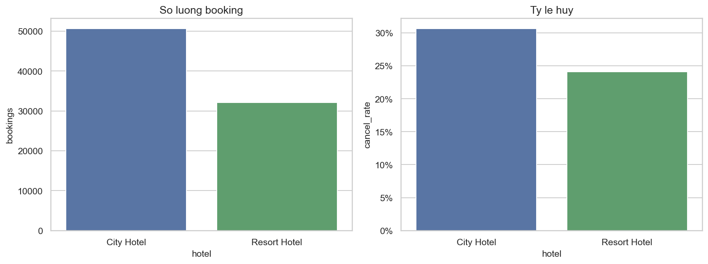

| Hotel | Bookings | Đã hủy | Tỷ lệ hủy | Median lead | Share Online TA | Share TA/TO |
|---|---:|---:|---:|---:|---:|---:|
| **City Hotel** | 50.686 (61,2%) | 15.549 | **30,68%** | 49 ngày | **67,4%** | 83,6% |
| **Resort Hotel** | 32.125 (38,8%) | 7.735 | **24,08%** | 47 ngày | 50,5% | 73,5% |
| Portfolio | 82.811 | 23.284 | 28,12% | 48 ngày | 60,9% | 79,6% |

**So sánh insight**

- City chiếm **61% volume** nhưng **67% số booking hủy** — rủi ro hệ thống lệch về City, không đối xứng với mix phòng.
- Gap hủy City − Resort = **+6,6 điểm %**. Median lead gần bằng nhau (49 vs 47) → **không phải** vì City đặt sớm hơn.
- Mix kênh giải thích một phần: City có **Online TA 67%** vs Resort **51%**. Phần còn lại là hành vi trong cùng segment (xem heatmap).

---

## Nhóm 1 — Lead time

### Volume theo bin (tách hotel)

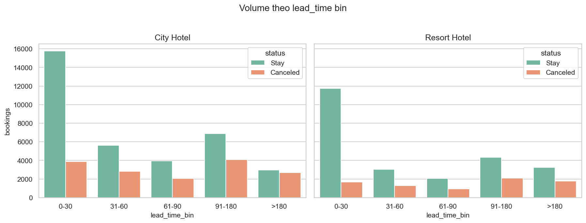

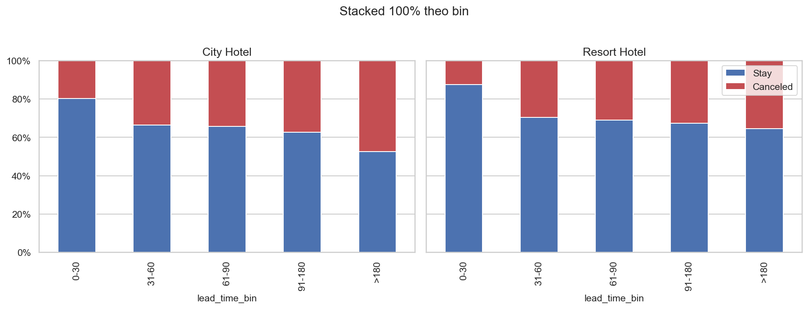

| Lead time bin | City — booking | City — hủy | Resort — booking | Resort — hủy |
|---|---:|---:|---:|---:|
| 0–30 ngày | 19.625 | **19,8%** | 13.414 | **12,5%** |
| 31–60 ngày | 8.468 | 33,5% | 4.308 | 29,6% |
| 61–90 ngày | 5.987 | 34,3% | 2.980 | 30,9% |
| 91–180 ngày | 10.959 | 37,4% | 6.396 | 32,5% |
| >180 ngày | 5.647 | **47,4%** | 5.027 | **35,3%** |

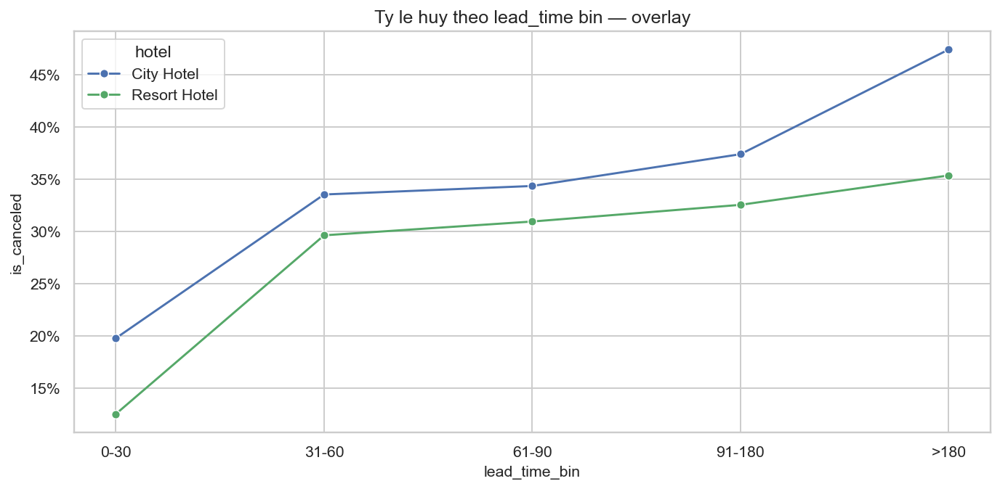

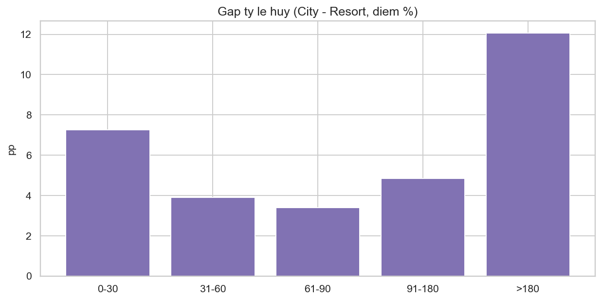

| Bin | Gap hủy (City − Resort) |
|---|---:|
| 0–30 | **+7,3 pp** |
| 31–60 | +3,9 pp |
| 61–90 | +3,4 pp |
| 91–180 | +4,8 pp |
| >180 | **+12,1 pp** |

**So sánh insight**

- Cả hai hotel đều có **bước nhảy lớn sau 30 ngày** (City 19,8% → 33,5%; Resort 12,5% → 29,6%). Ngưỡng 30 ngày vẫn là ranh giới vận hành chung.
- Resort last-minute (0–30) **an toàn hơn rõ**: 12,5% vs 19,8%. City không có “vùng an toàn” rộng như Resort.
- Đuôi >180 ngày **phân hóa mạnh**: City gần **1/2 booking hủy** (47,4%), Resort dừng ở 35,3%. Lead dài ở City đắt hơn về rủi ro, không chỉ về volume.
- Stacked 100% xác nhận monotonic tăng ở **cả hai**, nhưng độ dốc City cao hơn ở hai đầu (last-minute và very-long).

### KDE và boxplot

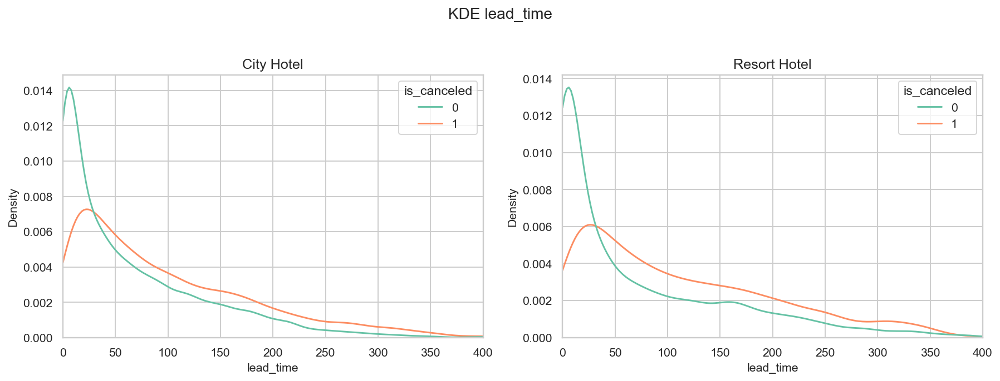

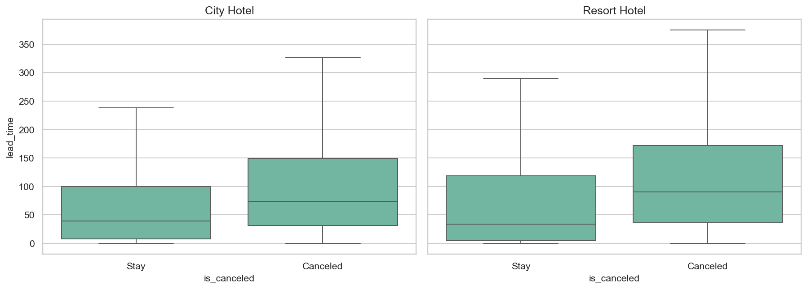

| Hotel | Status | n | Mean | Median | Std |
|---|---|---:|---:|---:|---:|
| City | Stay | 35.137 | 65,2 | **39** | 72,9 |
| City | Canceled | 15.549 | 100,8 | **74** | 90,6 |
| Resort | Stay | 24.390 | 72,5 | **34** | 87,1 |
| Resort | Canceled | 7.735 | 113,0 | **90** | 92,0 |

**So sánh insight**

- Median lead hủy / stay: City **74 / 39** (×1,9); Resort **90 / 34** (×2,6). Resort có **tách phân bố mạnh hơn** — booking hủy đặt sớm hơn tương đối so với stay.
- Mean lead Resort stay (72,5) cao hơn City stay (65,2), nhưng median stay Resort **thấp hơn** (34 vs 39) → Resort lệch phải mạnh: nhiều last-minute *và* đuôi dài.

---

## Nhóm 2 — Deposit type

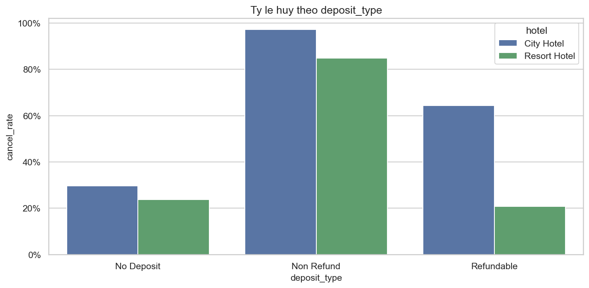

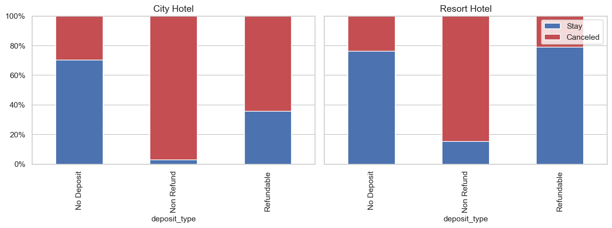

| Deposit | City n | City hủy | Resort n | Resort hủy |
|---|---:|---:|---:|---:|
| No Deposit | 49.873 (98,4%) | **29,6%** | 31.894 (99,3%) | **23,8%** |
| Non Refund | 799 (1,6%) | **97,1%** | 164 (0,5%) | **84,8%** |
| Refundable | 14 | 64,3%* | 67 | 20,9%* |

*\*Sample nhỏ — không suy diễn chính sách từ tỷ lệ thô.*

**So sánh insight**

- **No Deposit** vẫn là hệ thống: cả hai hotel >98%. Gap hủy 29,6% vs 23,8% (**+5,8 pp**) gần bằng gap tổng — rủi ro City không đến từ mix cọc.
- **Non Refund** tập trung ở City (799 vs 164) và hủy cực cao cả hai phía. Đây là artifact / reverse causality như báo cáo **05**, không phải “cọc đang chặn hủy”. Không siết Non Refund hàng loạt cho Resort (volume quá mỏng).
- Refundable gần như không tồn tại ở City (n=14).

---

## Nhóm 3 — Market segment

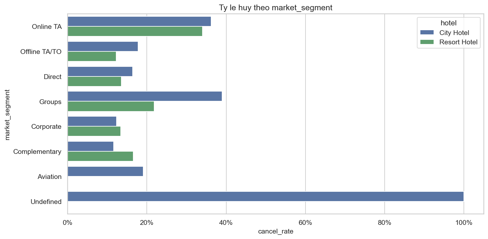

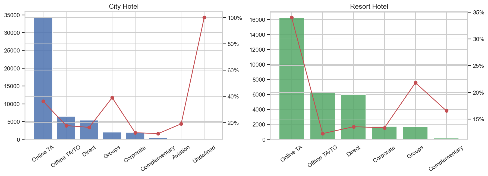

| Segment | City n | City hủy | Resort n | Resort hủy | Gap (pp) |
|---|---:|---:|---:|---:|---:|
| Online TA | 34.167 | **36,3%** | 16.224 | **34,0%** | +2,3 |
| Groups | 2.012 | **39,0%** | 1.678 | **21,8%** | **+17,2** |
| Offline TA/TO | 6.491 | 17,8% | 6.369 | **12,3%** | +5,5 |
| Direct | 5.388 | 16,4% | 5.963 | 13,6% | +2,8 |
| Corporate | 1.968 | 12,3% | 1.710 | 13,4% | −1,0 |
| Complementary | 438 | 11,6% | 181 | 16,6% | −4,9 |
| Aviation | 220 | 19,1% | — | — | City-only |

**So sánh insight**

- **Online TA** là hotspot **cả hai** hotel (34–36%). Gap nhỏ (+2,3 pp) — cùng cơ chế OTA, khác chủ yếu ở **tỷ trọng mix** (City 67% vs Resort 51%).
- **Groups** mới là chỗ City khác Resort: 39,0% vs 21,8% (**+17 pp**). Policy Groups không được copy giữa hai property.
- Offline TA/TO Resort (12,3%) ổn định hơn City (17,8%) dù volume gần bằng (~6,4k).
- Corporate **gần nhau** (~12–13%) — segment cam kết không phụ thuộc loại khách sạn.
- Dual-axis: City = “vừa to vừa rủi ro” ở Online TA; Resort Online TA vẫn là cột lớn nhất nhưng cột Direct/Offline **cân hơn**.

---

## Nhóm 4 — Channel + heatmap

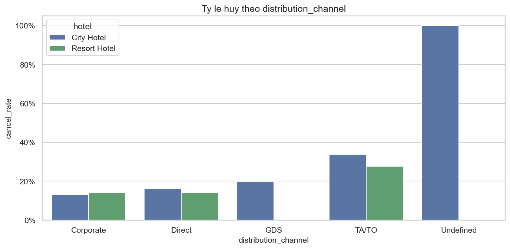

| Channel | City n | City hủy | Resort n | Resort hủy |
|---|---:|---:|---:|---:|
| TA/TO | 42.358 (83,6%) | **33,7%** | 23.598 (73,5%) | **27,7%** |
| Direct | 5.839 | 16,0% | 6.452 | 14,2% |
| Corporate | 2.313 | 13,2% | 2.074 | 14,0% |
| GDS | 172 | 19,8% | — | — |

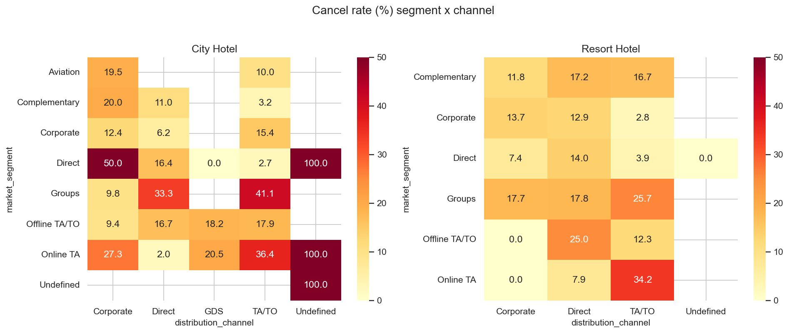

**Ô nóng (volume lớn):**

| Ô | City | Resort |
|---|---|---|
| Online TA × TA/TO | 33.967 booking · **36,4%** | 16.137 · **34,2%** |
| Groups × TA/TO | (trong City Groups 39%) | 860 · 25,7% |
| Offline TA/TO × TA/TO | ~15–18% | 6.349 · **12,3%** |

**So sánh insight**

- Cùng kênh TA/TO, Offline vs Online vẫn chênh ~18–22 pp **ở cả hai hotel** → kết luận notebook 02 giữ nguyên: **segment quan trọng hơn channel**.
- Ô Online TA × TA/TO là nguồn hủy chính **cả hai**, nhưng City gánh **gấp đôi volume** (34k vs 16k).
- Direct channel không cứu được Groups ở Resort (Direct Groups ~17,8%) — kênh Direct không luôn “an toàn” nếu segment vốn rủi ro.

---

## Tổng hợp so sánh & ma trận ưu tiên

### City Hotel — đặc trưng rủi ro

1. Tỷ lệ hủy nền **cao hơn ~6,6 pp**.
2. Mix **Online TA 67%** + đuôi lead **>180 ngày hủy 47%**.
3. **Groups 39%** — đắt hơn Resort cùng segment tới 17 pp.
4. Gánh **67% số hủy** của toàn portfolio.

### Resort Hotel — đặc trưng rủi ro

1. Last-minute (0–30) **khá sạch** (12,5%).
2. Online TA vẫn hotspot (34%) nhưng mix thấp hơn.
3. Groups **không** phải hotspot (21,8%).
4. Lead hủy tách xa stay hơn (median 90 vs 34) — tín hiệu lead **mạnh hơn** (xem **05c**).

### Ma trận ưu tiên (tách hotel)

| Ưu tiên | City | Resort |
|---|---|---|
| **Cao** | Online TA × TA/TO + lead > 30, đặc biệt **>180** | Online TA × TA/TO + lead > 30 |
| **Cao** | Groups (mọi kênh) | — |
| **Trung bình** | Offline TA/TO (17,8%, volume 6,5k) | Lead >180 (35%, volume 5k) |
| **Thấp** | Corporate / Direct lead ngắn | Corporate / Direct / Offline / last-minute |

**Không dùng một deposit / reminder / overbooking rule cho cả portfolio.** Buffer và CRM confirm nên **nặng hơn ở City**; Resort tập trung cửa sổ lead trung–dài của Online TA, không penalize Groups như City.

---

## Tài liệu liên quan

- [`02_eda_stage1_cancellation_analysis.md`](02_eda_stage1_cancellation_analysis.md) — bản gộp  
- [`05c_hypothesis_testing_city_resort.md`](05c_hypothesis_testing_city_resort.md) — kiểm định tách hotel  
- [`03b_eda_stage2_adr_city_resort.md`](03b_eda_stage2_adr_city_resort.md) — ADR tách hotel  
- [`03b_summary_eda_key_findings.md`](03b_summary_eda_key_findings.md) — tổng hợp 02b × 03b  
- [`03b_summary_eda_key_findings.md`](03b_summary_eda_key_findings.md) — tổng hợp 02b × 03b  

---

*Tạo từ `hotel_bookings_v5.csv`. Cập nhật: 18/08/2026 — EDA Stage 1 tách City / Resort.*
