# EDA Stage 2: ADR Analysis

> **Nguồn dữ liệu:** `hotel_bookings_v5.csv` (tái tạo từ v4, thêm `day_of_week`)  
> **Phạm vi:** 58.066 booking (không hủy, `adr > 0`) / 82.811 booking tổng | Mean ADR tổng thể: **105,92**  
> **Notebook tham chiếu:** `03_eda_stage2_adr.ipynb`  
> **Cột mới trong v5:** `day_of_week` (parse từ `arrival_date_year` + `arrival_date_month` + `arrival_date_day_of_month`)

---

## Mục tiêu phân tích

Giai đoạn EDA Stage 2 tập trung khám phá **Average Daily Rate (`adr`)** — mức giá phòng trung bình mỗi đêm — theo các chiều thời gian, sản phẩm phòng và phân khúc khách hàng: tháng đến (`arrival_date_month`), ngày trong tuần (`day_of_week`), loại phòng (`reserved_room_type` / `assigned_room_type`) và loại khách (`customer_type`). Mười một biểu đồ dưới đây được nhóm theo từng chiều phân tích, kèm insight có thể hành động được cho chiến lược **pricing** và **revenue management**.

**Lưu ý phạm vi:** Chỉ phân tích booking **không hủy** (`is_canceled = 0`) và **ADR > 0** để phản ánh giá thực tế của các lưu trú hoàn tất. ADR là giá tại thời điểm đặt phòng, không phải giá theo loại phòng thực tế được gán.

---

## Nhóm 1 — Arrival month (Biểu đồ 1 → 3)

### Biểu đồ 1: Box plot ADR theo `arrival_date_month`

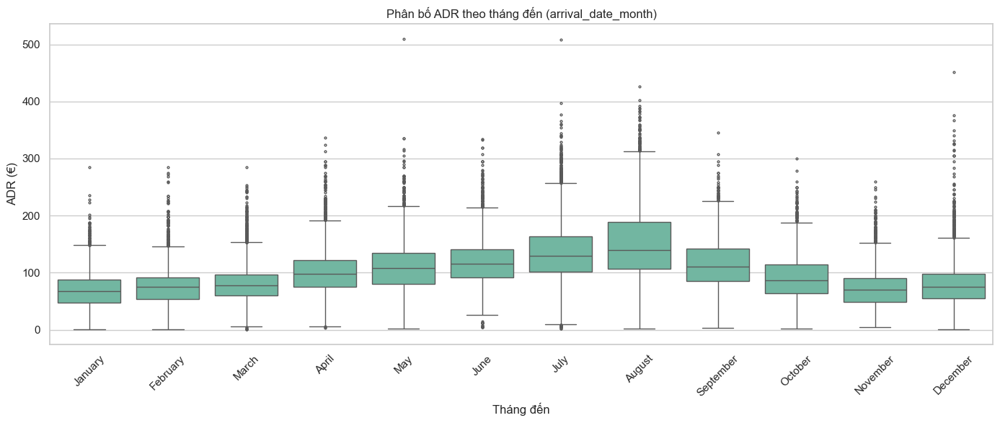

**Mô tả:** Trục X = tháng đến (Jan–Dec, sắp theo thứ tự lịch), trục Y = `adr`. Thể hiện median, IQR và outlier theo từng tháng.

**Insight:**

| Tháng | Bookings | Median ADR | Q1 | Q3 |
|---|---:|---:|---:|---:|
| January | 3.309 | 68,00 € | 48,00 € | 88,00 € |
| February | 4.310 | 74,80 € | 54,00 € | 91,00 € |
| March | 5.205 | 77,35 € | 60,00 € | 97,20 € |
| April | 5.055 | 98,00 € | 75,60 € | 122,00 € |
| May | 5.395 | 108,00 € | 80,00 € | 135,15 € |
| June | 5.018 | 116,00 € | 92,03 € | 141,00 € |
| July | 6.493 | 130,00 € | 101,68 € | 164,00 € |
| August | 7.220 | 140,00 € | 106,67 € | 189,00 € |
| September | 4.487 | 110,00 € | 85,00 € | 141,51 € |
| October | 4.638 | 86,95 € | 63,84 € | 114,00 € |
| November | 3.555 | 70,00 € | 48,50 € | 90,00 € |
| December | 3.381 | 75,00 € | 55,00 € | 97,40 € |

- **August** có median ADR cao nhất (**140,00 €**) và IQR rộng nhất (Q3 = 189,00 €) — tháng cao điểm mùa hè với biến động giá lớn.
- **January** và **November** là hai tháng thấp điểm (median ~68–70 €) — cơ hội promotion / yield management trong mùa thấp.
- IQR mở rộng rõ rệt từ **April** trở đi, phản ánh độ phân tán giá cao hơn trong mùa cao điểm.
- Outlier xuất hiện ở mọi tháng, đặc biệt nhiều ở **July–August** — có thể là suite/premium hoặc booking đặc biệt.

---

### Biểu đồ 2: Line chart mean ADR theo tháng (± 1 std)

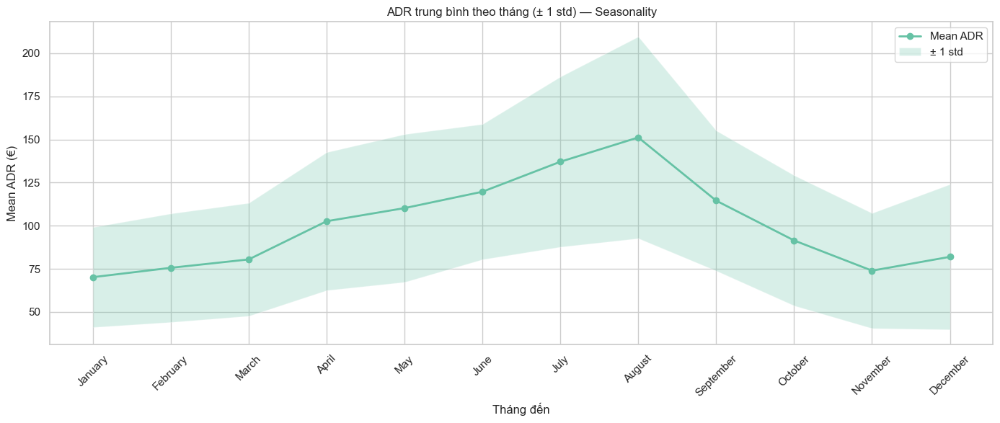

**Mô tả:** Trục X = `arrival_date_month`, trục Y = mean(`adr`), vùng tô ± 1 std — thể hiện seasonality và độ không chắc chắn giá.

**Insight:**

| Tháng | Mean ADR | Std |
|---|---:|---:|
| January | 70,16 € | 29,02 € |
| February | 75,59 € | 31,50 € |
| March | 80,45 € | 32,77 € |
| April | 102,60 € | 40,05 € |
| May | 110,21 € | 42,89 € |
| June | 119,72 € | 39,24 € |
| July | 137,10 € | 49,36 € |
| ** August **| 151,19 € | 58,52 € |
| September | 114,53 € | 40,66 € |
| October | 91,45 € | 37,80 € |
| November | 73,93 € | 33,41 € |
| December | 81,96 € | 42,13 € |

- **Seasonality rõ rệt:** mean ADR tăng từ **70,16 €** (January) lên đỉnh **151,19 €** (August) — chênh lệch **~115%**, sau đó giảm dần về mùa thu-đông.
- **August** vừa có mean cao nhất vừa có std cao nhất (**58,52 €**) — pricing linh hoạt hơn trong tháng cao điểm.
- **Bước nhảy lớn nhất** xảy ra từ **June → July** (+17,39 €) và **July → August** (+14,09 €) — ranh giới vào mùa cao điểm hè.
- **Hàm ý pricing:** áp dụng rate ladder theo mùa; tăng giá mạnh từ tháng 4–5, peak pricing tháng 7–8, giảm dần từ tháng 10.

---

### Biểu đồ 3: Heatmap mean ADR theo `arrival_date_month` × `arrival_date_year`

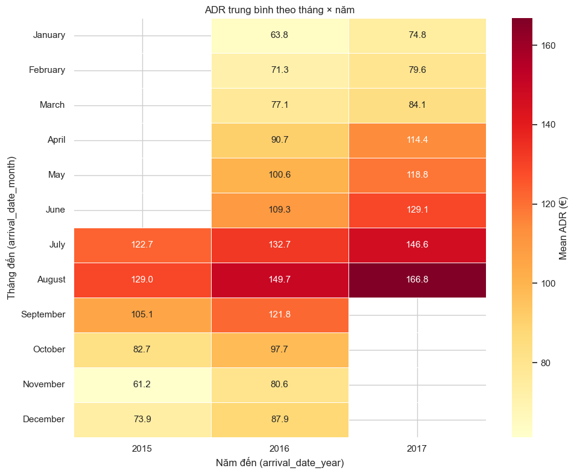

**Mô tả:** Trục X = năm đến, trục Y = tháng đến, màu = mean(`adr`). Phát hiện xu hướng year-over-year.

**Ma trận mean ADR (€)**

| Tháng ↓ / Năm → | 2015 | 2016 | 2017 |
|---|---:|---:|---:|
| January | — | 63,79 | 74,80 |
| February | — | 71,33 | 79,63 |
| March | — | 77,09 | 84,09 |
| April | — | 90,71 | 114,40 |
| May | — | 100,62 | 118,82 |
| June | — | 109,27 | 129,11 |
| July | 122,74 | 132,72 | 146,56 |
| August | 129,01 | 149,66 | 166,80 |
| September | 105,13 | 121,81 | — |
| October | 82,72 | 97,66 | — |
| November | 61,19 | 80,57 | — |
| December | 73,92 | 87,87 | — |

**Insight:**

- Dataset bao phủ **2015 (Jul–Dec)**, **2016 (full year)** và **2017 (Jan–Aug)** — không đối xứng theo năm, cần thận trọng khi so sánh YoY.
- Xu hướng **tăng trưởng ADR** nhất quán qua các năm ở tháng có đủ dữ liệu: vd. **August** 129,01 → 149,66 → 166,80 (+37,79 từ 2015 → 2017).
- **July** tăng **+23,82** (2015 → 2017) — mùa hè có growth mạnh.
- Các tháng chỉ có 2016–2017 (Jan–Jun) đều cho thấy ADR 2017 cao hơn 2016 **~8–24 €** — áp lực tăng giá hoặc mix phòng tốt hơn.
- **Hàm ý:** duy trì chiến lược tăng giá có kiểm soát ở mùa cao điểm; theo dõi YoY tại July–August làm benchmark chính.

---

## Nhóm 2 — Day of week (Biểu đồ 4 → 5)

### Biểu đồ 4: Bar chart mean ADR theo `day_of_week`

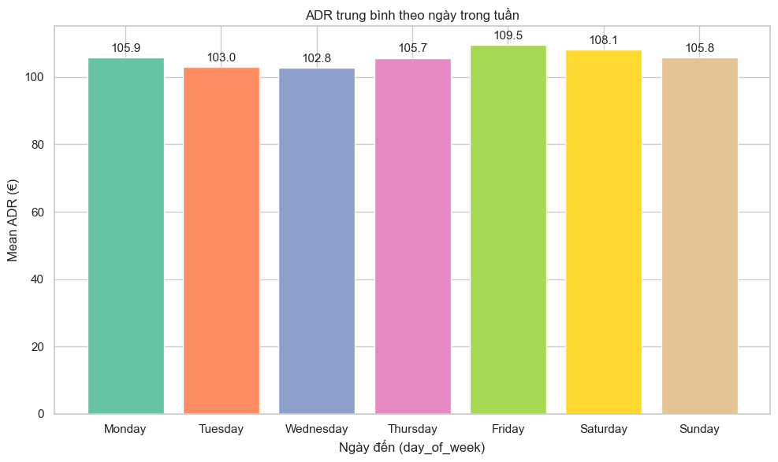

**Mô tả:** Trục X = ngày trong tuần (Mon → Sun), trục Y = mean(`adr`).

**Insight:**

| Ngày | Bookings | Mean ADR |
|---|---:|---:|
| Monday | 9.586 | 105,86 € |
| Tuesday | 7.610 | 102,99 € |
| Wednesday | 7.480 | 102,82 € |
| Thursday | 8.492 | 105,68 € |
| **Friday** | 8.426 | 109,55 € |
| Saturday | 8.460 | 108,07 € |
| Sunday | 8.012 | 105,85 € |

- **Friday** có mean ADR cao nhất (**109,55 €**), cao hơn **Tuesday/Wednesday** (~102,91) khoảng **~6,64 €**.
- **Tuesday** và **Wednesday** là ngày thấp nhất — phù hợp mid-week promotion.
- Chênh lệch mean ADR giữa các ngày **tương đối nhỏ** (~6,64 €, ~6,5%) so với seasonality theo tháng — day-of-week ít quan trọng hơn month nhưng vẫn có thể tinh chỉnh giá cuối tuần.
- **Monday** có volume booking cao nhất (9.586) — khách business/leisure mix đầu tuần.

---

### Biểu đồ 5: Box plot ADR theo `day_of_week`

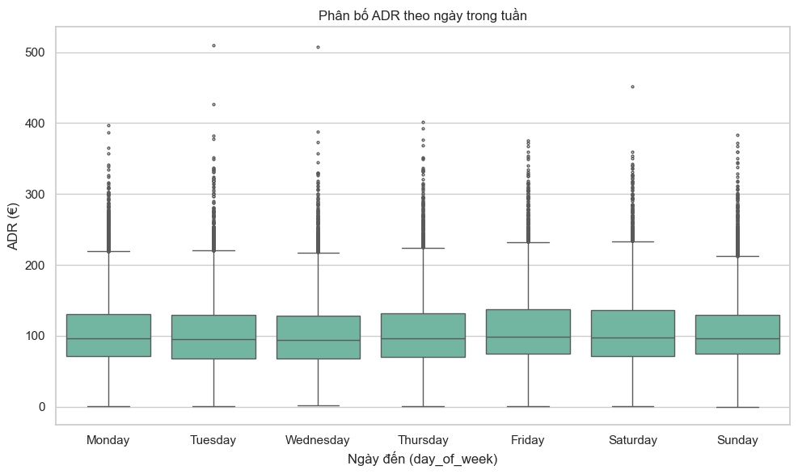

**Mô tả:** Trục X = `day_of_week`, trục Y = `adr`. Bổ sung median, IQR và outlier mà bar chart không thể hiện.

**Insight:**

| Ngày | Median | Q1 | Q3 |
|---|---:|---:|---:|
| Monday | 97,00 € | 72,00 € | 131,00 € |
| Tuesday | 95,00 € | 68,00 € | 129,00 € |
| Wednesday | 94,50 € | 68,07 € | 128,00 € |
| Thursday | 96,30 € | 70,02 € | 132,00 € |
| Friday | 99,00 € | 75,00 € | 138,00 € |
| Saturday | 98,00 € | 71,00 € | 136,02 € |
| Sunday | 97,01 € | 74,80 € | 129,97 € |

- **Friday** có median (**99,00 €**) và Q3 (**138,00 €**) cao nhất — cuối tuần kéo phân phối giá lên phía trên.
- **Tuesday/Wednesday** có median thấp nhất (**95,00 €**) và Q1 thấp (~68,00–68,07 €) — nhiều booking giá budget hơn giữa tuần.
- Std deviation theo ngày tương đương nhau (~47–52 €) — độ phân tán tổng thể ổn định, khác biệt chủ yếu ở vị trí median.
- **Hàm ý:** weekend premium nhẹ (+3–5 € median); weekday discount target Tuesday–Wednesday.

---

## Nhóm 3 — Room type (Biểu đồ 6 → 8)

### Biểu đồ 6: Bar chart ngang mean ADR theo `reserved_room_type`

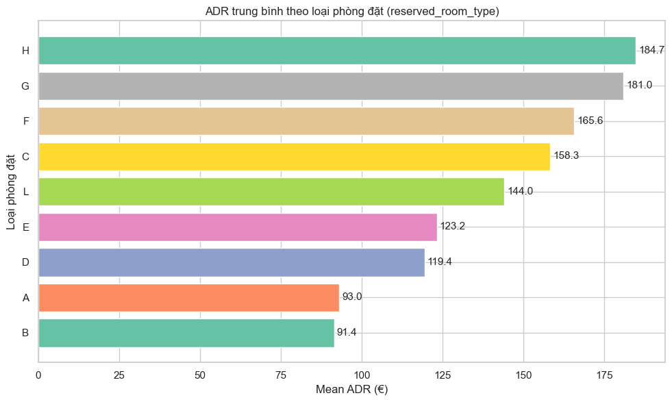

**Mô tả:** Trục Y = loại phòng đặt (A–L), trục X = mean(`adr`), sắp giảm dần.

**Insight (sắp theo mean ADR giảm dần):**

| Room type | Bookings | Mean ADR |
|---|---:|---:|
| **H** | 347 | **184,67 €** |
| G | 1.230 | 180,99 € |
| F | 1.888 | 165,63 € |
| C | 591 | 158,27 € |
| L | 3 | 144,00 € | *
| E | 4.204 | 123,21 € |
| D | 11.614 | 119,42 € |
| A | 37.566 | 93,04 € |
| B | 623 | 91,45 € |

*\*L chỉ 3 booking — không có ý nghĩa thống kê.*

- **H** và **G** là hạng phòng premium (mean >180 €) nhưng volume nhỏ (~1,5k booking).
- **A** chiếm **~64,7%** booking phân tích (37.566) với mean ADR thấp (**93,04 €**) — phòng standard kéo mean tổng thể xuống.
- **D** là hạng phổ biến thứ hai (11.614 booking, 119,42 €) — đóng góp volume lớn ở phân khúc mid-range.
- Gradient giá rõ: A/B (~91–93 €) → D/E (~120–124 €) → F/G/H (~166–185 €).

---

### Biểu đồ 7: Box plot ADR theo `room_match`

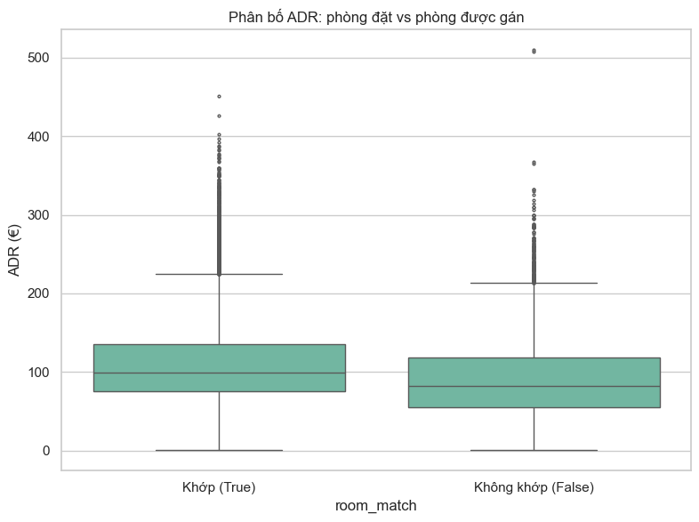

**Mô tả:** Tạo `room_match = (reserved_room_type == assigned_room_type)`. Trục X = Khớp (True) / Không khớp (False), trục Y = `adr`.

**Insight:**

| room_match | Bookings | Mean ADR | Median ADR |
|---|---:|---:|---:|
| **True** (khớp) | 47.642 (82,0%) | **109,20 €** | 99,00 € |
| **False** (không khớp) | 10.424 (18,0%) | **90,96 €** | 81,95 € |

- **82,0%** booking nhận đúng loại phòng đặt.
- Booking **không khớp** có mean ADR **thấp hơn 18,24 €** so với booking khớp — ngược với giả định "upgrade = ADR cao hơn".
- **Giải thích:** ADR phản ánh **giá lúc đặt**, không phải phòng thực tế nhận. Khách đặt phòng giá thấp (A, B) thường bị chuyển phòng (upgrade/downgrade) nhiều hơn; khách premium (F, G, H) thường được gán đúng phòng.
- **Hàm ý vận hành:** room_match là chỉ số **operational** (fulfillment), không phải pricing; cần phân tích riêng upgrade vs downgrade nếu muốn đánh giá impact trải nghiệm khách.

---

### Biểu đồ 8: Heatmap mean ADR theo `reserved_room_type` × `hotel`

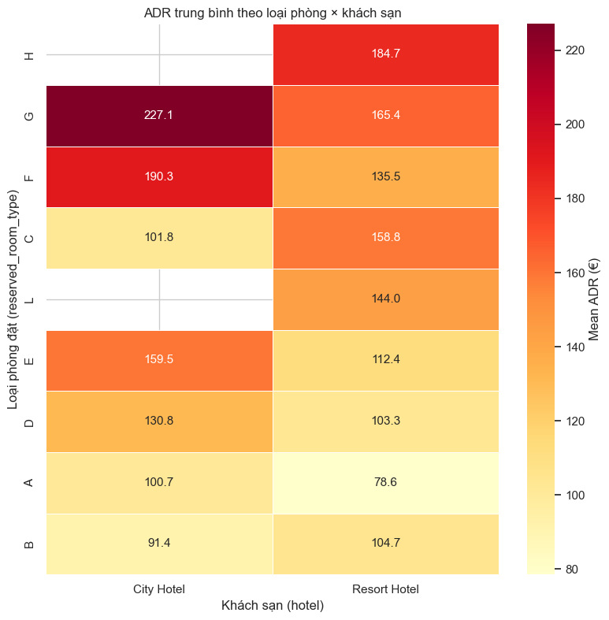

**Mô tả:** Trục X = hotel (City Hotel / Resort Hotel), trục Y = `reserved_room_type`, màu = mean(`adr`).

**Ma trận mean ADR (€)**

| Room type ↓ / Hotel → | City Hotel | Resort Hotel |
|---|---:|---:|
| A | 100,74 | 78,56 |
| B | 91,38 | 104,67 |
| C | 101,80 | 158,76 |
| D | 130,80 | 103,30 |
| E | 159,46 | 112,41 |
| F | 190,34 | 135,51 |
| G | 227,08 | 165,39 |
| H | — | 184,67 |
| L | — | 144,00 * |

*\*Sample rất nhỏ.*

**Insight:**

- **City Hotel** định giá cao hơn ở hầu hết hạng phòng volume lớn: A (100,74 vs 78,56), D (130,80 vs 103,30), E (159,46 vs 112,41), F (190,34 vs 135,51), G (227,08 vs 165,39).
- **Resort Hotel** chỉ cao hơn ở **B** (104,67 vs 91,38) và **C** (158,76 vs 101,80) — có thể do mix sản phẩm/resort positioning khác.
- **H** chỉ xuất hiện ở Resort Hotel (184,67) — suite premium đặc thù resort.
- **Pricing strategy khác biệt rõ:** City Hotel premium hóa phòng standard/mid (A, D, E, F, G); Resort Hotel tập trung resort experience với giá thấp hơn ở phòng A nhưng cao ở C.
- **Hàm ý:** không áp dụng cùng rate card cho hai khách sạn; cần benchmark theo từng cặp (room_type × hotel).

---

## Nhóm 4 — Customer type (Biểu đồ 9 → 11)

### Biểu đồ 9: Bar chart mean ADR theo `customer_type`

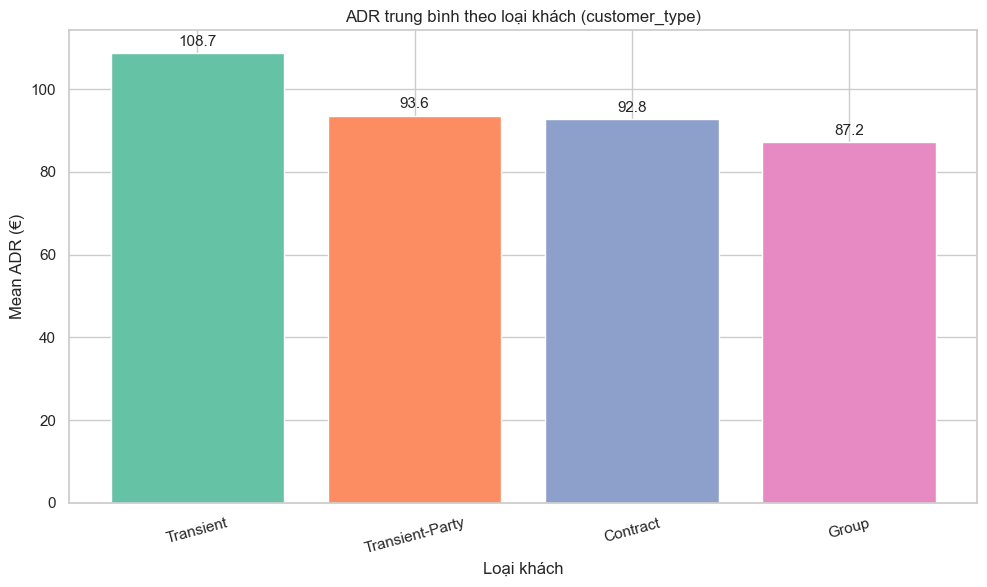

**Mô tả:** Trục X = customer_type (Transient, Transient-Party, Contract, Group), trục Y = mean(`adr`).

**Insight:**

| Customer type | Bookings | Mean ADR |
|---|---:|---:|
| **Transient** | 47.569 (81,9%) | **108,74 €** |
| Transient-Party | 7.516 (12,9%) | 93,61 € |
| Contract | 2.540 (4,4%) | 92,81 € |
| Group | 441 (0,8%) | 87,23 € |

- **Transient** (khách lẻ) đóng góp ADR cao nhất (**108,74 €**) và chiếm **~81,9%** volume — segment chủ lực về doanh thu.
- **Group** có mean ADR thấp nhất (**87,23 €**) nhưng sample nhỏ (441) — phù hợp kỳ vọng giá ưu đãi theo đoàn.
- Chênh lệch Transient vs Group: **~21,51 €** (~24,7%) — room for rate fencing giữa retail và group.
- **Contract** (92,81 €) gần với Transient-Party — cả hai đều thấp hơn Transient ~15,93–15,13 €.

---

### Biểu đồ 10: Box plot ADR theo `customer_type`

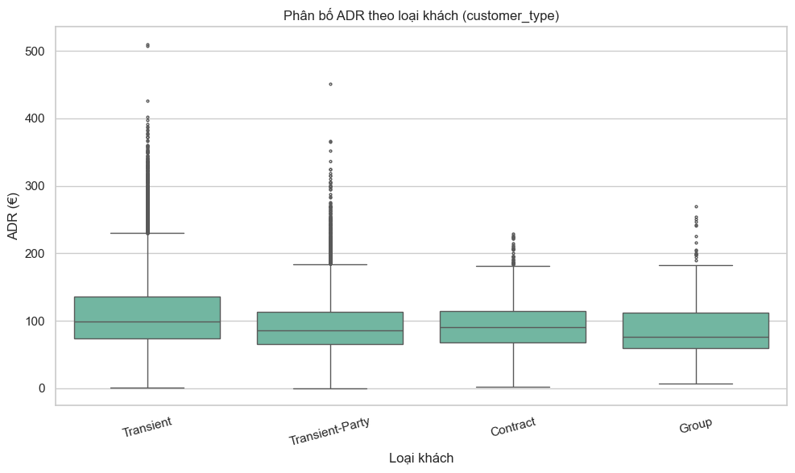

**Mô tả:** Trục X = `customer_type`, trục Y = `adr`. Phát hiện độ phân tán.

**Insight:**

| Customer type | Median | Q1 | Q3 |
|---|---:|---:|---:|
| Transient | 99,00 € | 74,00 € | 136,44 € |
| Transient-Party | 85,50 € | 65,00 € | 112,67 € |
| Contract | 90,32 € | 68,00 € | 114,00 € |
| Group | 76,00 € | 60,00 € | 111,65 € |

- **Transient** có median (**99,00 €**) và Q3 (**136,44 €**) cao nhất — phân khúc có khả năng chi trả cao nhất.
- **Group** có median thấp nhất (**76,00 €**) và Q1 thấp (**60,00 €**) — tập trung booking giá budget, nhưng Q3 vẫn đạt 111,65 € (có booking group premium).
- **Transient-Party** phân bố tương tự Contract — cả hai thấp hơn Transient ~13,50–8,68 € ở median.
- Outlier xuất hiện ở mọi segment — cơ hội upsell/cross-sell đặc biệt ở Transient.

---

### Biểu đồ 11: Grouped bar mean ADR theo `customer_type` × `hotel`

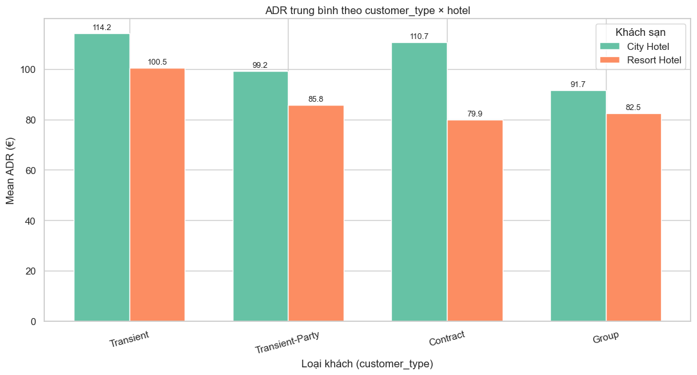

**Mô tả:** Trục X = `customer_type`, nhóm màu = hotel, trục Y = mean(`adr`).

**Insight:**

| Customer type | City Hotel | Resort Hotel | Chênh lệch (City − Resort) |
|---|---:|---:|---:|
| Transient | **114,22 €** | 100,47 € | +13,76 € |
| Transient-Party | 99,22 € | 85,80 € | +13,42 € |
| Contract | **110,66 €** | 79,92 € | **+30,74 €** |
| Group | 91,70 € | 82,45 € | +9,24 |

- **City Hotel** có mean ADR cao hơn Resort ở **mọi** customer_type — phù hợp với mean tổng (City 112,05 € vs Resort 97,09 €).
- Chênh lệch lớn nhất ở **Contract** (+30,74 €) — corporate rate tại City Hotel premium hơn đáng kể.
- **Transient** tại City Hotel đạt **114,22 €** — cao nhất trong toàn bộ ma trận (volume lớn: 47.569 booking).
- Resort Hotel thấp hơn ở Transient (**100,47 €**) nhưng vẫn là segment ADR cao thứ hai toàn hệ thống.
- **Hàm ý:** pricing theo segment × hotel; không dùng chung rate cho Contract giữa City và Resort (chênh ~30 €).

---

## Tổng hợp insight xuyên suốt (Biểu đồ 1–11)

### Các yếu tố ADR cao

1. **Mùa cao điểm (July–August)** — mean ADR 137,10–151,19, median lên 130–140 €.
2. **Cuối tuần (Friday–Saturday)** — mean ADR ~108–110 €, cao hơn mid-week ~5 €.
3. **Hạng phòng premium (G, H, F)** — mean ADR 166–185 €.
4. **Transient tại City Hotel** — mean **114,22 €**, volume lớn nhất.
5. **City Hotel** nhìn chung — mean **112,05 €** vs Resort **97,09 €** (+14,96 €).

### Các yếu tố ADR thấp

1. **Mùa thấp điểm (January, November)** — mean ADR ~70,16–73,93.
2. **Mid-week (Tuesday–Wednesday)** — mean ~103,5 €.
3. **Phòng standard (A, B)** — mean ~91–93 €, chiếm ~65% booking.
4. **Group / Contract** — mean ~88–93 €.
5. **Booking không khớp phòng** — mean **90,96 €** (thấp hơn khớp phòng 18,24 €).

### Ma trận ưu tiên pricing

| Mức ưu tiên | Tổ hợp đặc trưng | Hành động gợi ý |
|---|---|---|
| **Cao** | August + City Hotel + Transient + Room F/G | Peak rate, hạn chế discount |
| **Cao** | July–August + Resort + Room H/C | Premium resort pricing |
| **Trung bình** | April–June + weekday + Room D/E | Shoulder season ladder |
| **Thấp** | Jan/Nov + Tuesday + Group/Contract + Room A | Promotion, package deal |

### Gợi ý hướng xử lý (Stage 3+)

- **Dynamic pricing:** rate calendar theo month (seasonality) × day_of_week × room_type × hotel.
- **Segment strategy:** bảo vệ margin Transient; rate fence riêng cho Group/Contract (đặc biệt tại City Hotel).
- **Product mix:** upsell từ A → D/E trong mùa cao; phát triển premium tier (G, H) tại Resort.
- **Feature engineering (modeling):** `arrival_date_month`, `day_of_week`, `reserved_room_type`, `customer_type`, `hotel` và các interaction (`month × hotel`, `customer_type × hotel`, `room_type × hotel`) là candidate feature mạnh cho mô hình dự báo ADR/revenue.

---

## Phụ lục — Định nghĩa biểu đồ

| # | Loại biểu đồ | Biến phân tích |
|---|---|---|
| 1 | Box plot | `arrival_date_month` → `adr` |
| 2 | Line chart + error band (±1 std) | `arrival_date_month` → mean(`adr`) |
| 3 | Heatmap | `arrival_date_month` × `arrival_date_year` → mean(`adr`) |
| 4 | Bar chart | `day_of_week` → mean(`adr`) |
| 5 | Box plot | `day_of_week` → `adr` |
| 6 | Horizontal bar | `reserved_room_type` → mean(`adr`) |
| 7 | Box plot | `room_match` → `adr` |
| 8 | Heatmap | `reserved_room_type` × `hotel` → mean(`adr`) |
| 9 | Bar chart | `customer_type` → mean(`adr`) |
| 10 | Box plot | `customer_type` → `adr` |
| 11 | Grouped bar | `customer_type` × `hotel` → mean(`adr`) |

---

*Tài liệu được tạo từ kết quả EDA trên `hotel_bookings_v5.csv`. Cập nhật lần cuối: 3/7/2026 — Stage 2 (v5 tái tạo từ v4 + day_of_week, 58.066 booking ADR).*
