# EDA Stage 2: ADR — City vs Resort

> **Nguồn dữ liệu:** `hotel_bookings_v5.csv`  
> **Phạm vi:** 58.066 stay (`is_canceled = 0`, `adr > 0`)  
> **City Hotel:** 34.274 · mean **112,05 €** · median **105,00 €**  
> **Resort Hotel:** 23.792 · mean **97,09 €** · median **77,50 €**  
> **Notebook:** [`notebooks/03b_eda_stage2_adr_city_resort.ipynb`](../notebooks/03b_eda_stage2_adr_city_resort.ipynb)  
> **Figures:** [`reports/figures/03b/`](./figures/03b/) · KPI: [`kpi_compare_city_resort.csv`](./figures/03b/kpi_compare_city_resort.csv)  
> **Báo cáo gộp:** [`03_eda_stage2_adr_analysis.md`](03_eda_stage2_adr_analysis.md)  
> **Chiến lược ADR sâu hơn:** [`17b_adr_strategy_analysis_city_resort.md`](17b_adr_strategy_analysis_city_resort.md)

---

## Mục tiêu

Lặp lại EDA Stage 2 của notebook **03** (tháng, thứ, hạng phòng, loại khách) trên **từng hotel**, rồi đọc gap. ADR phản ánh giá lúc đặt, không phải phòng được gán.

---

## 0. Snapshot

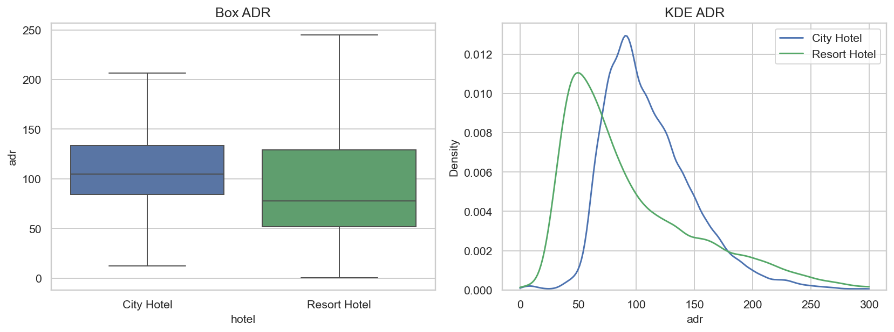

| Hotel | Stay | Mean | Median | Std | P25 | P75 |
|---|---:|---:|---:|---:|---:|---:|
| **City Hotel** | 34.274 | **112,05 €** | **105,00 €** | 39,61 | 84,45 | 133,20 |
| **Resort Hotel** | 23.792 | **97,09 €** | **77,50 €** | 60,37 | 51,80 | 129,00 |
| Gap (City − Resort) | — | **+14,96 €** | **+27,50 €** | City hẹp hơn | — | — |

**So sánh insight**

- Median gap (**+27,50 €**) lớn hơn mean gap (**+14,96 €**): Resort **lệch phải** — khối lượng lớn giá thấp mùa thấp, đuôi peak kéo mean lên.
- Std Resort (60 €) >> City (40 €). Một rate card / một calendar cho portfolio **làm mờ** hai sản phẩm giá khác nhau.
- EDA 03 gộp (mean 105,92 €) nằm giữa hai hotel — số “trung bình” không mô tả property nào.

---

## Nhóm 1 — Arrival month

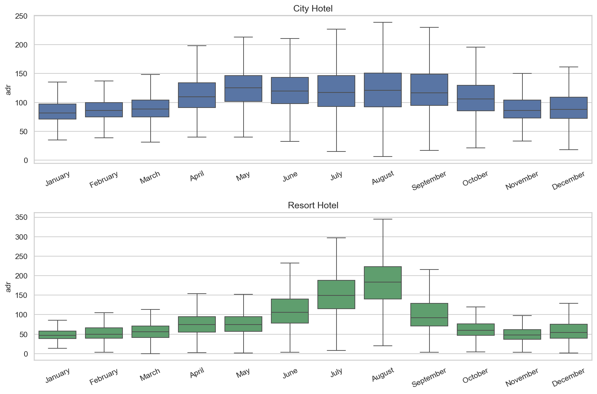

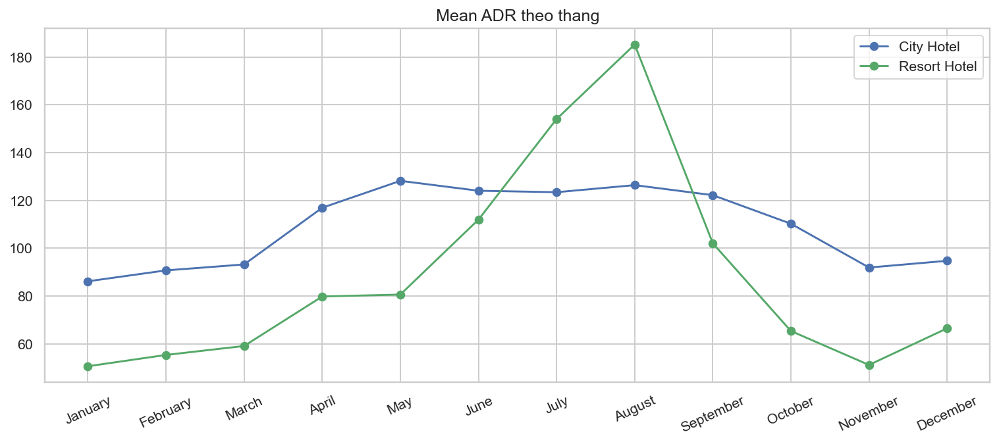

| Tháng | City mean | City median | Resort mean | Resort median | Gap mean |
|---|---:|---:|---:|---:|---:|
| January | 86,18 € | 81,41 € | 50,63 € | 47,00 € | **+35,55 €** |
| February | 90,75 € | 86,00 € | 55,37 € | 50,00 € | +35,38 € |
| March | 93,23 € | 88,20 € | 59,11 € | 55,80 € | +34,12 € |
| April | 116,96 € | 110,00 € | 79,83 € | 75,00 € | +37,13 € |
| **May** | **128,21 €** | **125,10 €** | 80,64 € | 74,76 € | **+47,58 €** |
| June | 124,08 € | 119,85 € | 111,99 € | 105,80 € | +12,09 € |
| July | 123,46 € | 116,95 € | 154,07 € | 149,00 € | **−30,61 €** |
| **August** | 126,42 € | 120,70 € | **185,26 €** | **183,20 €** | **−58,84 €** |
| September | 122,23 € | 116,54 € | 102,09 € | 92,40 € | +20,13 € |
| October | 110,27 € | 105,90 € | 65,38 € | 60,00 € | +44,89 € |
| November | 91,94 € | 85,75 € | 51,18 € | 48,00 € | +40,76 € |
| December | 94,76 € | 88,00 € | 66,51 € | 54,40 € | +28,25 € |

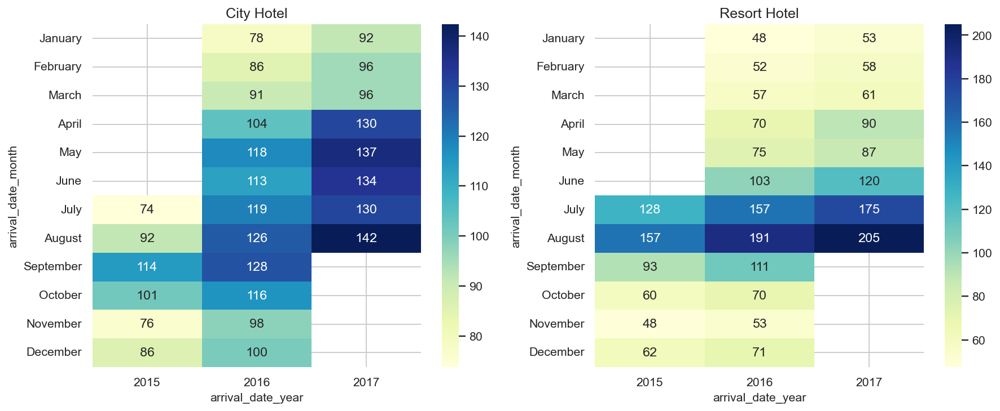

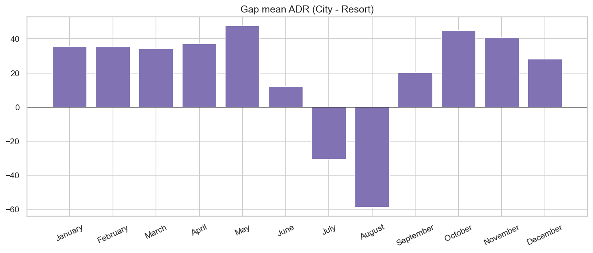

**So sánh insight**

- **City:** đỉnh **May** (128 €), Jul–Aug không phải đỉnh tuyệt đối. Biên độ mùa mean ~49% (May vs January). Lịch đô thị / shoulder hội nghị.
- **Resort:** đỉnh **August** (185 €), January 51 €. Biên độ mean **~266%**. Seasonality nghỉ dưỡng kinh điển.
- **Giao thoa Jun–Sep:** hai đường gặp nhau rồi Resort vượt hẳn Jul–Aug. Các tháng còn lại City cao hơn 28–48 €.
- **Hàm ý giá:** không copy calendar. City ladder Apr→Sep, promotion Jan–Mar/Nov. Resort **harden Jul–Aug**, STIMULATE sâu low season — khớp playbook sau này (`21`, `28`).
- YoY: cả hai hotel tăng ADR 2016→2017 ở các tháng có đủ dữ liệu; August Resort tăng mạnh hơn (đỉnh ngày càng cao).

---

## Nhóm 2 — Day of week

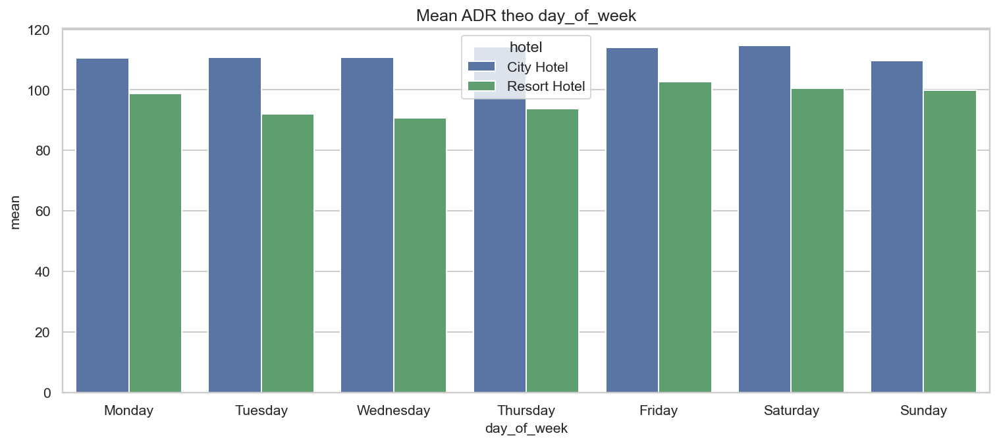

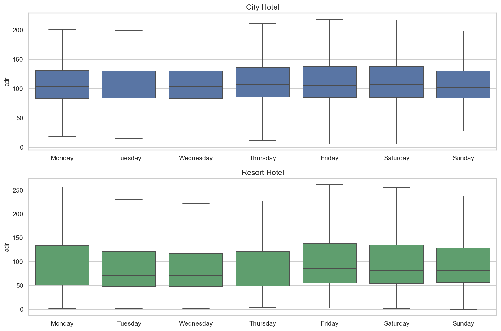

| Ngày | City mean | Resort mean |
|---|---:|---:|
| Monday | 110,48 € | 98,86 € |
| Tuesday | 110,67 € | 91,97 € |
| Wednesday | 110,75 € | **90,71 €** |
| Thursday | 114,22 € | 93,82 € |
| Friday | 114,04 € | **102,62 €** |
| Saturday | **114,61 €** | 100,44 € |
| Sunday | 109,71 € | 99,79 € |

| Hotel | Weekday mean | Weekend mean | Premium |
|---|---:|---:|---:|
| City | 111,52 € | 112,76 € | **+1,24 € (+1,1%)** |
| Resort | 94,13 € | 100,94 € | **+6,81 € (+7,2%)** |

**So sánh insight**

- Weekend surcharge **gần như chỉ có ở Resort**. City phẳng trong tuần (biên độ ~5 €, ~4,5%).
- Resort thấp nhất **Tue–Wed** (~91 €), cao nhất Friday (103 €). Mid-week promo hợp Resort hơn City.
- Báo cáo 03 gộp (“Friday cao nhất +6,6 €”) là **trung bình bị Resort kéo** — không đúng cho City.

---

## Nhóm 3 — Room type

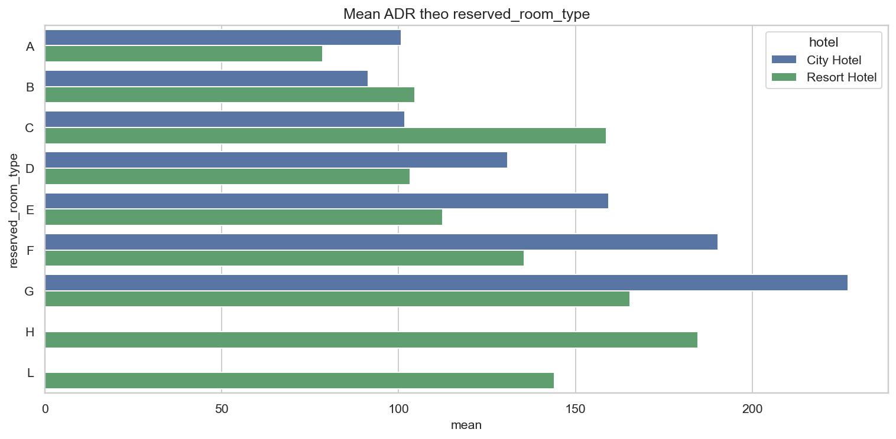

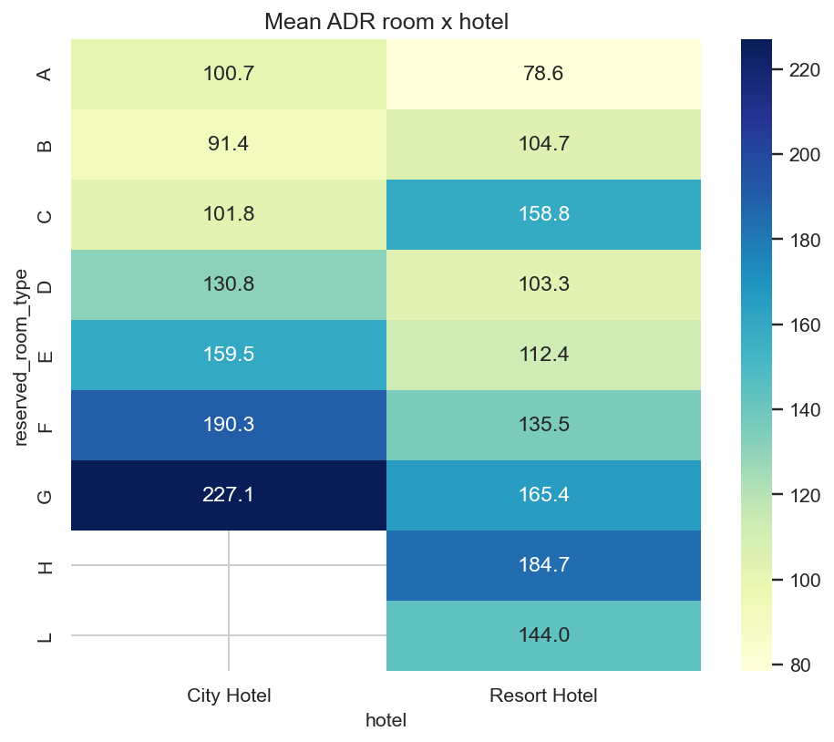

| Room | City n | City mean | Resort n | Resort mean |
|---|---:|---:|---:|---:|
| A | 24.531 | 100,74 € | 13.035 | **78,56 €** |
| B | 620 | 91,38 € | 3* | — |
| C | 5* | — | 586 | **158,76 €** |
| D | 6.805 | 130,80 € | 4.809 | 103,30 € |
| E | 965 | 159,46 € | 3.239 | 112,41 € |
| F | 1.037 | 190,34 € | 851 | 135,51 € |
| G | 311 | **227,08 €** | 919 | 165,39 € |
| H | — | — | 347 | 184,67 € |

*\*n quá nhỏ.*

**So sánh insight**

- City premium hóa **A/D/E/F/G** (A đã 101 € vs Resort 79 €). Resort rẻ ở A nhưng đắt ở **C** và có **H** (suite) — sản phẩm khác, không cùng ladder.
- Volume A: City 72% stay vs Resort 55%. Mix phòng City “standard-heavy”; Resort trải mid/premium hơn (E, G, H).

### Room match

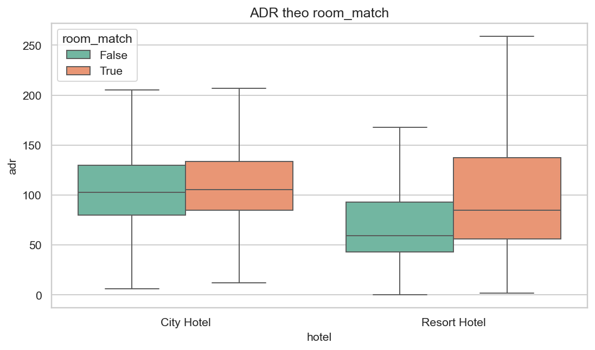

| Hotel | Khớp | n | Mean ADR | Không khớp | n | Mean ADR |
|---|---|---:|---:|---|---:|---:|
| City | 86,2% | 29.545 | 112,61 € | 13,8% | 4.729 | 108,52 € |
| Resort | 76,1% | 18.097 | 103,61 € | **23,9%** | 5.695 | **76,37 €** |

**So sánh insight**

- Mismatch **nặng hơn Resort** (24% vs 14%) và ADR lúc đặt thấp hơn nhiều (76 vs 104 €) — phần lớn là **free upgrade** từ phòng rẻ. City mismatch gần như không lệch giá.
- ADR không đo phòng nhận được. Đánh giá upsell / cost of upgrade: xem **17b**.

---

## Nhóm 4 — Customer type

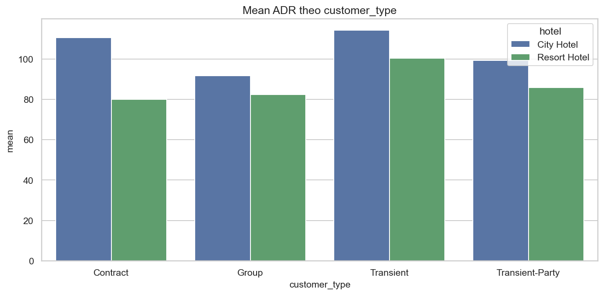

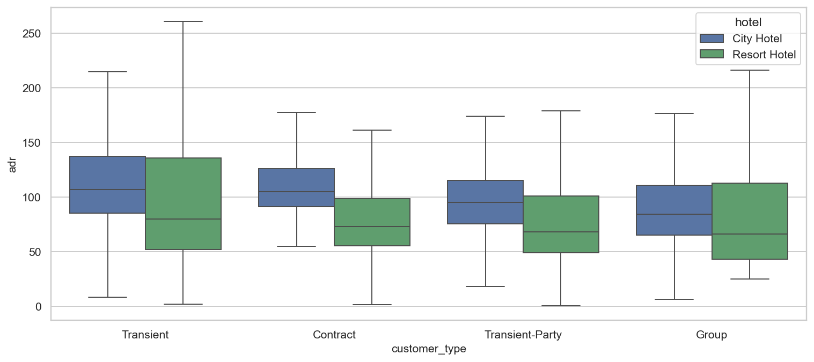

| Customer type | City n | City mean | Resort n | Resort mean | Gap |
|---|---:|---:|---:|---:|---:|
| Transient | 28.609 | **114,22 €** | 18.960 | 100,47 € | +13,76 € |
| Transient-Party | 4.372 | 99,22 € | 3.144 | 85,80 € | +13,42 € |
| Contract | 1.065 | **110,66 €** | 1.475 | 79,92 € | **+30,74 €** |
| Group | 228 | 91,70 € | 213 | 82,45 € | +9,24 € |

**So sánh insight**

- Transient là xương sống **cả hai** (City 83,5% stay · Resort 79,7%) và ADR cao nhất trong từng hotel.
- **Contract** lệch lớn nhất (+31 €): corporate rate City premium hơn hẳn. Không dùng chung contract card.
- Group sample nhỏ; ADR thấp phù hợp rate fence — không phải đòn bẩy giá chính.

---

## Tổng hợp so sánh & ma trận pricing

### City — ADR cao / ổn định hơn

1. Nền giá mid-market, IQR hẹp.
2. Đỉnh **May**, không phải August.
3. Weekend premium **không đáng kể**.
4. Transient + Room A/D là máy in tiền.

### Resort — ADR phân cực theo mùa

1. Median thấp, đuôi Jul–Aug rất cao.
2. Weekend **+7%**.
3. Free upgrade / mismatch 24%.
4. Room A rẻ; C/G/H mới là premium resort.

### Ma trận ưu tiên (tách hotel)

| Ưu tiên | City | Resort |
|---|---|---|
| **Cao** | Bảo vệ May–Sep Transient, hạn chế dump A | Harden **Jul–Aug**; không shock +ADR thuần nếu ε co giãn (xem `22`) |
| **Cao** | Contract fence riêng (~111 €) | Weekend surcharge; mid-week Tue–Wed promo |
| **Trung bình** | Shoulder Apr/Oct | Low season Jan–Mar/Nov floor + stimulate |
| **Thấp** | Weekend tweak | Copy calendar City |

EDA 03 gộp đúng hướng “mùa hè đắt, phòng A kéo mean, Transient chủ lực” — **sai timing và sai weekend** nếu áp một rule cho cả hai. Bản **17b** / forecast **20\*** là bước tiếp theo trên cùng tách này.

---

## Tài liệu liên quan

- [`03_eda_stage2_adr_analysis.md`](03_eda_stage2_adr_analysis.md) — bản gộp  
- [`17b_adr_strategy_analysis_city_resort.md`](17b_adr_strategy_analysis_city_resort.md) — chiến lược ADR  
- [`02b_eda_stage1_cancellation_city_resort.md`](02b_eda_stage1_cancellation_city_resort.md)  
- [`03b_summary_eda_key_findings.md`](03b_summary_eda_key_findings.md) — tổng hợp 02b × 03b  

---

*Tạo từ `hotel_bookings_v5.csv`. Cập nhật: 18/08/2026 — EDA Stage 2 tách City / Resort.*
