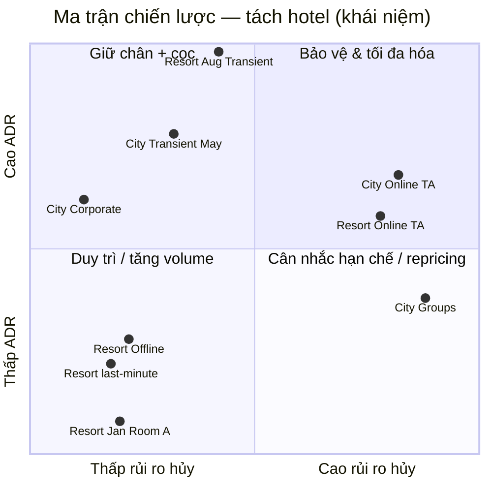

# EDA Tổng hợp — Key Findings City vs Resort

> **Loại:** Executive summary — không có notebook riêng  
> **Tổng hợp từ:** [02b Cancellation](02b_eda_stage1_cancellation_city_resort.md) · [03b ADR](03b_eda_stage2_adr_city_resort.md)  
> **Đối chiếu bản gộp:** [03_summary](03_summary_eda_key_findings.md)  
> **Dữ liệu:** `hotel_bookings_v5.csv`  
> **Notebook:** `02b_eda_stage1_cancellation_city_resort.ipynb` · `03b_eda_stage2_adr_city_resort.ipynb`

---

## 1. Bức tranh tổng quan

Hai giai đoạn EDA vẫn trả lời hai câu hỏi RM — *booking nào không materialize?* và *booking nào mang giá trị?* — nhưng **tách hotel** cho thấy portfolio là **hai sản phẩm**, không phải một đường trung bình.

| | City Hotel | Resort Hotel | Portfolio (gộp) |
|---|---|---|---|
| Booking | 50.686 (61,2%) | 32.125 (38,8%) | 82.811 |
| Tỷ lệ hủy | **30,68%** | **24,08%** | 28,12% |
| Số hủy | 15.549 (**67%** tổng hủy) | 7.735 | 23.284 |
| Stay ADR>0 | 34.274 | 23.792 | 58.066 |
| Mean / median ADR | **112,05 / 105,00 €** | **97,09 / 77,50 €** | 105,92 / 97 € |
| Mix Online TA | **67,4%** | 50,5% | 60,9% |
| Đỉnh ADR | **May** (128 €) | **August** (185 €) | August (151 €) |

**Thông điệp chính:** Bản gộp `03_summary` đúng hướng (OTA rủi ro, mùa hè đắt, Transient chủ lực) nhưng **sai trọng số và sai timing**. City gánh hủy; Resort gánh biến động giá. Một cọc / một weekend premium / một peak calendar cho cả hai sẽ trật ít nhất một property.



---

## 2. Key findings — Stage 1 (Cancellation)

### 2.1 Số liệu nền

| | City | Resort | Gap |
|---|---:|---:|---:|
| Cancel rate | **30,68%** | **24,08%** | **+6,6 pp** |
| No Deposit | 98,4% · hủy 29,6% | 99,3% · hủy 23,8% | +5,8 pp trên No Deposit |
| TA/TO | 83,6% · hủy 33,7% | 73,5% · hủy 27,7% | +6,0 pp |
| Median lead stay / hủy | 39 / 74 ngày | 34 / **90** ngày | Resort tách phân bố mạnh hơn |

Median lead tổng gần bằng (49 vs 47) → gap hủy **không** do City đặt sớm hơn. Mix Online TA (67% vs 51%) giải thích một phần; phần còn lại là hành vi trong cùng ô.

### 2.2 Findings theo chiều — so sánh hai hotel

| Chiều | City | Resort | Chốt so sánh |
|---|---|---|---|
| **Lead 0–30** | hủy **19,8%** | hủy **12,5%** | Resort có vùng last-minute sạch; City không |
| **Lead bước 30 ngày** | 19,8% → 33,5% (+13,8 pp) | 12,5% → 29,6% (**+17,1 pp**) | Ngưỡng 30 ngày **sắc hơn Resort** |
| **Lead >180** | **47,4%** | 35,3% | Đuôi dài là vấn đề **City** (+12,1 pp) |
| **Deposit** | Non Refund 799 booking, 97,1% hủy | Non Refund 164, 84,8% | Artifact tập trung City — không siết cọc hàng loạt Resort |
| **Online TA** | 34.167 · **36,3%** | 16.224 · **34,0%** | Cùng cơ chế; City gánh **gấp đôi volume** |
| **Groups** | **39,0%** | **21,8%** | Hotspot **chỉ City** (+17 pp) |
| **Offline TA/TO** | 17,8% | **12,3%** | Resort ổn định hơn cùng segment |
| **Corporate** | 12,3% | 13,4% | Ổn định **chéo hotel** |
| **Online TA × TA/TO** | 33.967 · **36,4%** | 16.137 · **34,2%** | Ô nóng chung; impact tuyệt đối ở City |

### 2.3 Insight then chốt — Cancellation

1. **Ngưỡng 30 ngày** vẫn là ranh giới chung — nhưng ROI khác: Resort mất vùng an toàn ngay sau 30 ngày; City cần thêm cửa **>180**.
2. **Online TA × TA/TO** là hotspot **cả hai**; **Groups** chỉ là P1 ở City.
3. Segment vẫn quan trọng hơn channel (Offline vs Online cùng TA/TO chênh ~18–22 pp ở cả hai).
4. Buffer / CRM confirm **nặng hơn City** (67% số hủy). Resort không copy rule Groups của City.

---

## 3. Key findings — Stage 2 (ADR)

### 3.1 Số liệu nền

| | City | Resort |
|---|---:|---:|
| Mean / median | 112,05 / **105,00 €** | 97,09 / **77,50 €** |
| Std | 39,61 € (hẹp) | **60,37 €** (phân cực) |
| Weekend premium | **+1,24 € (+1,1%)** | **+6,81 € (+7,2%)** |
| Room match | 86,2% | **76,1%** (mismatch ADR 76 vs 104 €) |

Median gap **+27,50 €** > mean gap **+14,96 €**: Resort lệch phải — low season rẻ, peak đắt.

### 3.2 Findings theo chiều — so sánh hai hotel

| Chiều | City | Resort | Chốt so sánh |
|---|---|---|---|
| **Mùa** | Đỉnh **May** 128 €; Jul–Aug không phải đỉnh | Đỉnh **August 185 €**; Jan 51 € | Biên độ ~49% vs **~266%** |
| **Giao thoa** | Cao hơn Resort 28–48 € hầu hết năm | Vượt City **Jul (−31 €) / Aug (−59 €)** | Hai lịch giá; Jun–Sep cắt nhau |
| **DOW** | Phẳng (~110–115 €) | Tue–Wed ~91 € · Fri 103 € | Weekend surcharge **chỉ Resort** |
| **Room A** | 100,74 € (72% stay) | **78,56 €** (55% stay) | Cùng hạng, hai positioning |
| **Premium** | G **227 €** | C 159 € · H **185 €** (chỉ Resort) | Không chung ladder |
| **Mismatch** | 14%, ADR gần nhau | **24%**, ADR lúc đặt thấp hơn 27 € | Free upgrade nặng Resort |
| **Transient** | **114,22 €** (83,5% stay) | 100,47 € (79,7%) | Xương sống cả hai |
| **Contract** | **110,66 €** | 79,92 € | Gap **+30,74 €** — fence riêng |

### 3.3 Insight then chốt — ADR

1. Driver ADR **tháng × hotel**, không phải “August cho cả portfolio”. City bảo vệ **May–Sep**; Resort harden **Jul–Aug**, stimulate Jan–Mar/Nov.
2. Weekend +3–5 € trong `03_summary` là số **bị Resort kéo** — không áp cho City.
3. Transient + Room A/D là máy in tiền City; Resort kiếm peak ở C/G/H và weekend.
4. Một rate card gộp = underprice City Contract và **over-tighten** Resort low season (hoặc ngược lại ở Aug).

---

## 4. Insight xuyên suốt (02b × 03b)

### 4.1 Nghịch lý theo hotel

| Hiện tượng | City — hủy | City — ADR | Resort — hủy | Resort — ADR | Hàm ý |
|---|---|---|---|---|---|
| **Online TA** | 36,3%, volume 34k | Transient ~114 € | 34,0%, volume 16k | Transient ~100 €; Aug 185 € | Cùng hotspot OTA; City = volume at risk; Resort = **peak € at risk** |
| **Groups** | **39%** | ADR thấp | 22% | ADR thấp | P1 chỉ City; Resort không attrition-siết như City |
| **Lead >180** | **47%** | Mix ADR cao hơn nền | 35% | Đuôi gồm cả peak book sớm | Confirm/cọc đuôi: **ưu tiên City** |
| **Lead 0–30** | 19,8% | — | **12,5%** | Last-minute Resort đang rẻ (17b) | City last-minute không “an toàn”; Resort có thể bán last-minute |
| **Corporate** | 12,3% | Contract **111 €** | 13,4% | Contract **80 €** | Giữ chỗ cả hai; **không** chung contract rate |
| **Jul–Aug** | Hủy cao hơn nền (lead dài + OTA) | City ~123–126 € | Hủy + OTA | **154–185 €** | Mỗi hủy Resort Aug tổn thất **~180 €/đêm**; City ~125 € nhưng **nhiều case hơn** |
| **No Deposit** | 29,6% trên 49,9k | — | 23,8% trên 31,9k | — | Lever hệ thống cả hai; tier **khác ngưỡng** (City + đuôi 180; Resort cửa 30) |

### 4.2 Ma trận ưu tiên — City Hotel (rủi ro × ADR)

| Ưu tiên | Tổ hợp | Cancel | ADR | Chiến lược |
|:---:|---|:---:|:---:|---|
| P1 | Online TA × TA/TO + lead >30, đặc biệt **>180** | Rất cao | Cao | Cọc/reminder/buffer; không dump A mùa May–Sep |
| P1 | Groups (mọi kênh) | Rất cao | Thấp–TB | Attrition + cọc; audit raw 39% vs logistic (xem `05c`) |
| P2 | Transient × **May–Sep** × Room D/F/G | TB–cao | Rất cao | Peak/shoulder ladder; hạn chế OTA discount |
| P2 | No Deposit + lead >30 | Cao | Hỗn hợp | Tiered deposit; cửa 180 ngày siết hơn Resort |
| P3 | Offline TA/TO (17,8%, 6,5k) | TB | TB | Theo dõi; A/B cọc nhẹ |
| P4 | Corporate / Direct + lead ngắn | Thấp | Cao (Contract 111 €) | Giữ quan hệ; fence Contract |
| P4 | Jan/Nov + Room A | Thấp–TB | Thấp hơn peak | Promotion mid-week — **không** cần weekend surcharge |

### 4.3 Ma trận ưu tiên — Resort Hotel (rủi ro × ADR)

| Ưu tiên | Tổ hợp | Cancel | ADR | Chiến lược |
|:---:|---|:---:|:---:|---|
| P1 | Online TA × TA/TO + **cửa 30 ngày** | Cao | Cao ở peak | Confirm sớm (median hủy 90 ngày); cọc sau 30 ngày |
| P1 | **Jul–Aug Transient** / C-G-H | TB–cao | **Rất cao (185 €)** | Harden BAR; **không** shock +ADR thuần nếu ε co giãn (`22`) |
| P2 | Lead >180 (35%, ~5k) | Cao | Hỗn hợp | Nhắc lịch; không cùng độ siết City 47% |
| P2 | Weekend Fri–Sat | — | **+7%** | Weekend surcharge; Tue–Wed promo |
| P3 | Low season Jan–Mar/Nov Room A | Thấp (last-minute sạch) | Rất thấp (51 €) | STIMULATE / floor; last-minute bán được |
| P4 | Groups / Offline / Corporate | Thấp–TB | TB | **Không** copy Groups policy City |
| P4 | Copy calendar City / weekend City | — | — | Không làm |

### 4.4 Ba tension — đọc lại sau khi tách hotel

1. **Volume vs margin:** Online TA vẫn vừa to vừa rủi ro **cả hai**, nhưng City = số case; Resort Aug = €/đêm. Buffer OTA nên **định mức khác nhau**.
2. **Fill vs ADR:** Promotion Jan/Nov **chủ yếu việc của Resort** (51 €). City January đã 86 € — promo nông hơn, tránh erode May.
3. **Fulfillment vs giá:** Mismatch 24% ở Resort là cost upgrade, không phải tín hiệu pricing. City (14%) gần như trung tính theo ADR.

`03_summary` gộp gộp P1 “Jul–Aug + City Transient + F/G” và “weekend +3–5 €” — **City không peak vào August; City không cần weekend premium.**

---

## 5. Hành động đề xuất (tách hotel)

### 5.1 Ngắn hạn (0–3 tháng)

| # | Hành động | City | Resort | Dựa trên |
|---|---|---|---|---|
| 1 | Cọc / confirm theo lead | Siết **>30** và **>180** | Siết ngay sau **30** (bước +17 pp) | 02b H1b |
| 2 | Online TA × TA/TO | Ưu tiên tuyệt đối (34k booking) | Cùng rule, scale nhỏ hơn (16k) | 02b heatmap |
| 3 | Groups | Review hợp đồng / attrition | **Không** cùng độ siết | 02b + 05c |
| 4 | Rate calendar | Ladder **Apr→Sep**, đỉnh May | Harden **Jul–Aug**; floor Jan–Mar | 03b tháng |
| 5 | Weekend / mid-week | Bỏ hoặc +1 € | **+weekend**; promo Tue–Wed | 03b DOW |
| 6 | Low season | Promo nông Jan/Nov | STIMULATE sâu Room A | 03b gap tháng |

### 5.2 Trung hạn (3–6 tháng)

| # | Hành động | City | Resort |
|---|---|---|---|
| 7 | Rate fence | Contract ~111 €; Transient 114 € | Contract ~80 €; không chung card |
| 8 | Upsell | A → D/E (A = 72% stay, 101 €) | A rẻ (79 €) + quản lý free upgrade 24% |
| 9 | Channel shift OTA → Direct | Impact lớn hơn (mix 67% Online TA) | Vẫn đáng; mix đã cân Direct/Offline hơn |
| 10 | Dashboard | Cancel + ADR **facet hotel** — cấm KPI gộp làm quyết định giá | Cùng |

### 5.3 Dài hạn (6–12 tháng)

Giữ hướng modeling của `03_summary` (P(hủy), ADR, expected revenue at risk) nhưng **train / score / policy tách City vs Resort** — đã có tiền lệ `17b`, `20*`, `05c`. Không pool residual rồi mới tách lúc playbook.

---

## 6. KPI đề xuất — baseline tách hotel

| KPI | City baseline | Resort baseline | Gợi ý |
|---|---:|---:|---|
| Tỷ lệ hủy | **30,68%** | **24,08%** | Giảm mỗi bên; không lấy mục tiêu gộp 24% rồi dồn City |
| Online TA × TA/TO | 36,4% | 34,2% | < 30% cả hai |
| Lead 0–30 | 19,8% | **12,5%** | Giữ Resort; kéo City xuống |
| Lead >180 | **47,4%** | 35,3% | Ưu tiên City < 40% |
| No Deposit share | 98,4% | 99,3% | Tiered cọc; ngưỡng khác nhau |
| Mean ADR stay | **112,05 €** | **97,09 €** | Không KPI “+5% portfolio” |
| Peak month mean | May **128 €** | Aug **185 €** | Bảo vệ đúng tháng |
| Low month mean | Jan **86 €** | Jan **51 €** | Fill Resort; giữ floor City |
| Weekend premium | +1,1% | **+7,2%** | Chỉ theo dõi Resort như lever |
| Room match | 86,2% | **76,1%** | Resort ≥ 82% (bớt free upgrade) |
| Transient ADR | **114,22 €** | 100,47 € | Bảo vệ; không dump OTA peak |

---

## 7. Lộ trình gợi ý

```
Giai đoạn 1 (Tháng 1–2)              Giai đoạn 2 (Tháng 3–4)           Giai đoạn 3 (Tháng 5–8)
─────────────────────────            ─────────────────────────         ─────────────────────────
✓ Cọc/confirm tách ngưỡng            ✓ Rate fence Contract             ✓ City: bảo vệ May–Sep
  City >30 & >180 · Resort cửa 30    ✓ Upsell A→D City                 ✓ Resort: harden Jul–Aug
✓ OTA policy cả hai; Groups chỉ City ✓ Weekend surcharge chỉ Resort    ✓ Model hủy / ADR tách hotel
✓ Dashboard facet hotel              ✓ Low-season Resort STIMULATE     ✓ Buffer OTA định mức khác nhau
```

---

## 8. Kết luận

`03_summary` gộp nói đúng bài toán **không phải chọn giảm hủy hay tăng giá**. `03b_summary` thêm một câu: **cũng không được chọn một tổ hợp cho cả portfolio.**

- **City:** bảo vệ doanh thu May–Sep (Transient, A/D, Contract 111 €) *và* kiểm soát hủy hệ thống (OTA 36%, lead >180 = 47%, Groups raw 39%). Mỗi hủy ít € hơn Aug Resort nhưng **nhiều case hơn**.
- **Resort:** harden Jul–Aug (~185 €/đêm) + weekend +7%; last-minute tương đối sạch nên bán được mùa thấp; **không** copy Groups/weekend/peak-month của City.
- **Chung:** Online TA × TA/TO vẫn là ô nóng — cùng OR ~2,8 vs Direct (`05c`) — khác nhau ở **volume (City)** và **€ peak (Resort)**.

Bước tiếp: [`05c`](05c_hypothesis_testing_city_resort.md) (tín hiệu có thật trên từng hotel) → [`17b`](17b_adr_strategy_analysis_city_resort.md) / [`20*`](20_demand_forecasting_dynamic_pricing_city_resort.md) (giá & forecast đã tách).

---

## Phụ lục — Tham chiếu nhanh

| Tài liệu | Nội dung |
|---|---|
| [02b Cancellation City vs Resort](02b_eda_stage1_cancellation_city_resort.md) | Lead, cọc, segment, kênh — tách hotel |
| [03b ADR City vs Resort](03b_eda_stage2_adr_city_resort.md) | Tháng, thứ, phòng, loại khách — tách hotel |
| [03_summary bản gộp](03_summary_eda_key_findings.md) | Ma trận rủi ro × ADR **portfolio** |
| [05c Hypothesis](05c_hypothesis_testing_city_resort.md) | H1–H4 từng hotel |

---

*Tổng hợp từ EDA Stage 1b & 2b. Cập nhật: 18/08/2026 — Executive summary tách City / Resort.*
