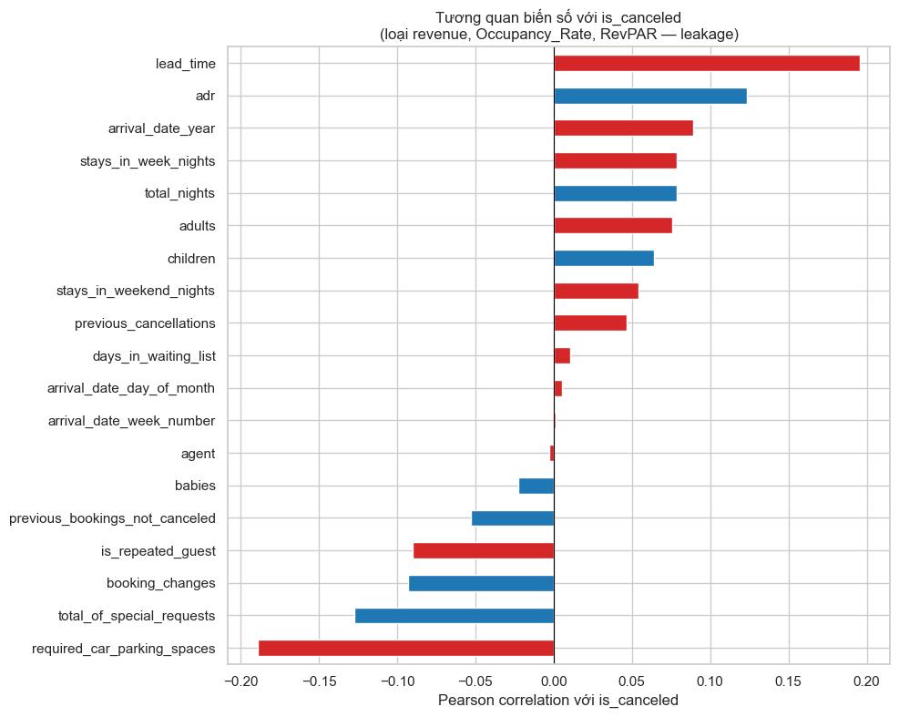
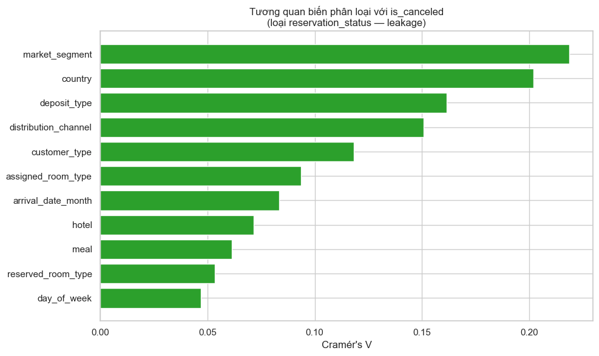
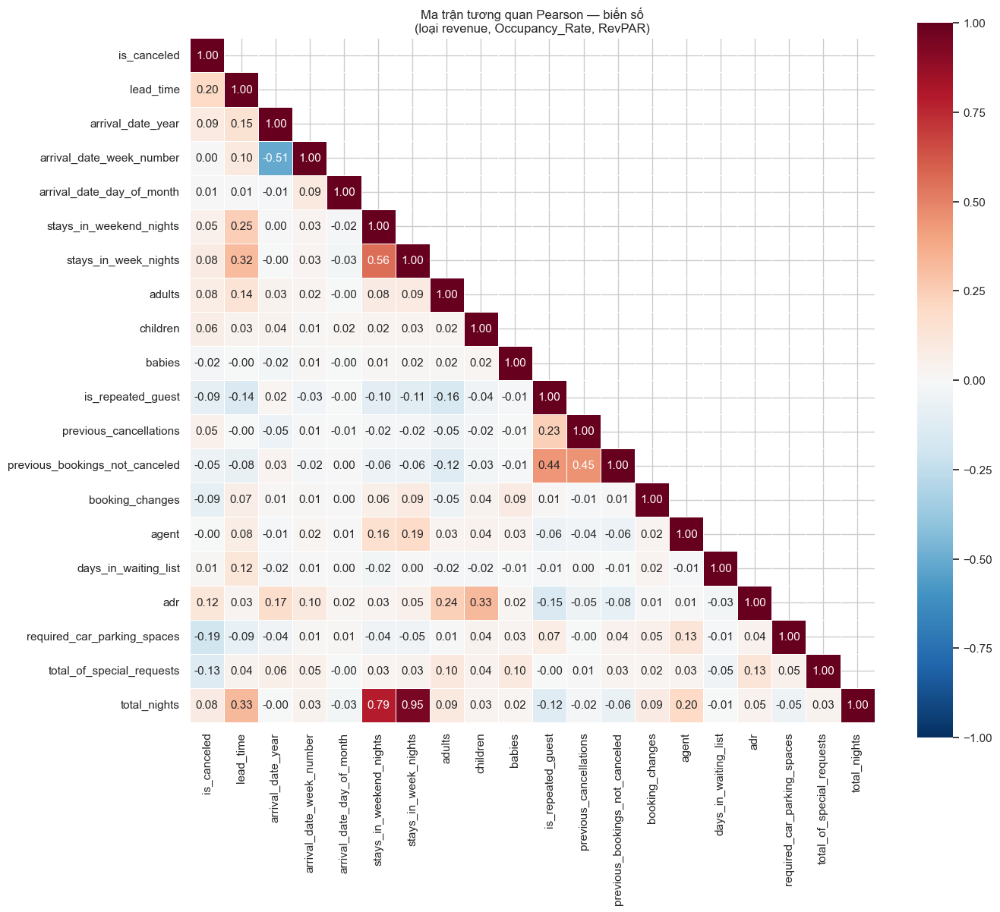
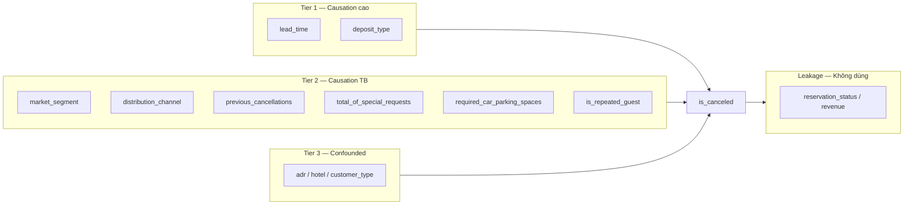
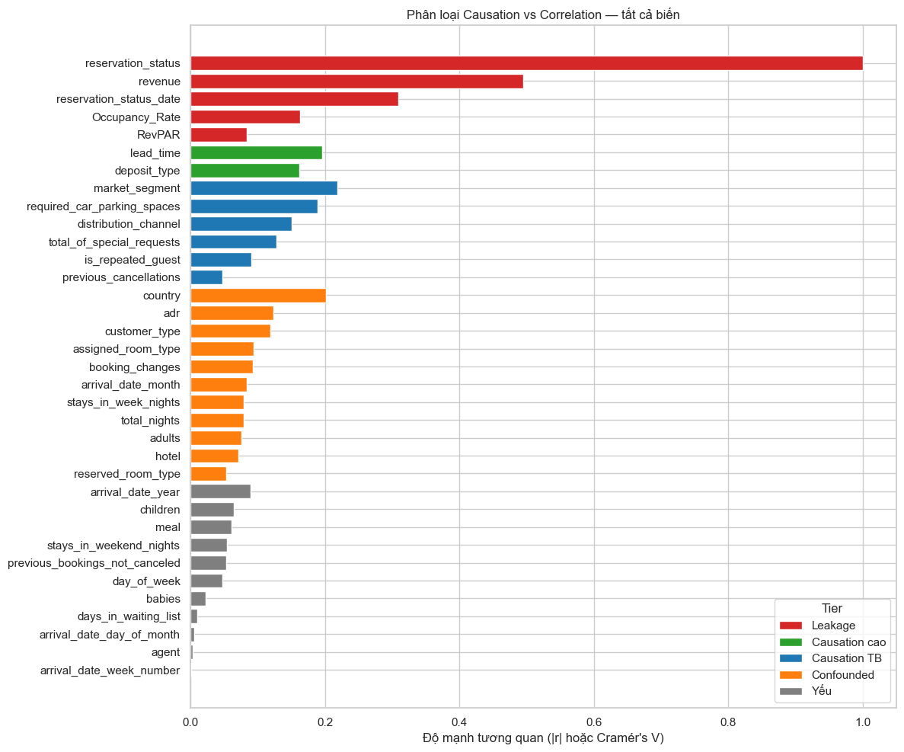
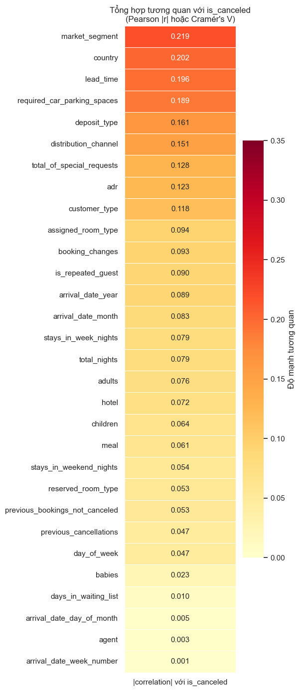

# Correlation Analysis: `is_canceled` vs tất cả biến

> **Nguồn dữ liệu:** `hotel_bookings_v5.csv` (tái tạo từ v4 + `day_of_week`)  
> **Phạm vi:** 82.811 booking | Tỷ lệ hủy tổng thể: **28,12%** (23.284 booking bị hủy)  
> **Notebook tham chiếu:** `04_correlation_analysis.ipynb`  
> **Bổ sung EDA:** [02 02 EDA Stage 1 — Cancellation](02_eda_stage1_cancellation_analysis.md)

---

## Mục tiêu phân tích

Báo cáo này đo mức độ **tương quan thống kê** giữa biến mục tiêu `is_canceled` và toàn bộ 35 biến còn lại trong dataset, sau đó phân loại từng biến theo khả năng **nhân quả (causation)** so với **tương quan giả / leakage / confounding**.

**Phương pháp:**

| Loại biến | Metric | Ghi chú |
|---|---|---|
| Số (22 biến) | **Pearson** r | Tuyến tính; thêm Spearman để kiểm tra phi tuyến |
| Phân loại (13 biến) | **Cramér's V** | Đo mức liên kết với biến nhị phân `is_canceled` |
| Kiểm tra confounding | **Partial correlation** | Kiểm soát `deposit_type` ↔ `lead_time` |

> **Lưu ý quan trọng:** Correlation ≠ Causation. Tương quan cao chỉ cho biết hai biến đồng biến; để gọi là nguyên nhân cần thỏa thứ tự thời gian, cơ chế hợp lý và khả năng can thiệp.

---

## 1. Tổng quan kết quả

### 1.1 Top biến tương quan mạnh nhất (sau khi loại leakage)

| Hạng | Biến | Metric | Giá trị | Hướng |
|:---:|---|:---:|:---:|---|
| 1 | `lead_time` | Pearson r | **0,196** | Dài hơn → hủy nhiều hơn |
| 2 | `required_car_parking_spaces` | Pearson r | **-0,189** | Cần chỗ đậu xe → ít hủy |
| 3 | `total_of_special_requests` | Pearson r | **-0,128** | Nhiều yêu cầu đặc biệt → ít hủy |
| 4 | `market_segment` | Cramér's V | **0,219** | Segment khác nhau → hủy khác nhau |
| 5 | `adr` | Pearson r | **0,123** | Giá cao hơn một chút ở booking hủy |
| 6 | `deposit_type` | Cramér's V | **0,161** | Loại cọc liên quan mạnh đến hủy |
| 7 | `distribution_channel` | Cramér's V | **0,151** | Kênh OTA hủy cao hơn Direct |
| 8 | `customer_type` | Cramér's V | **0,118** | Transient hủy nhiều hơn Contract |

### 1.2 Biến leakage — loại khỏi modeling

| Biến | Metric | Giá trị | Lý do loại |
|---|---|:---:|---|
| `reservation_status` | Cramér's V | **1,000** | Gần như là nhãn của hủy (`Canceled` = 100%) |
| `reservation_status_date` | Cramér's V | 0,309 | Ngày ghi nhận trạng thái — xảy ra **sau** hủy |
| `revenue` | Pearson r | **-0,494** | `revenue = adr × total_nights × (1 − is_canceled)` — tương quan cơ học |
| `Occupancy_Rate` | Pearson r | -0,163 | Biến tổng hợp theo thời gian |
| `RevPAR` | Pearson r | 0,084 | Biến tổng hợp derived |

Xác minh công thức `revenue`: **100,0%** dòng khớp `adr × total_nights × (1 − is_canceled)`.

---

## 2. Tương quan biến số (Pearson & Spearman)

### 2.1 Bảng đầy đủ — Pearson với `is_canceled`

| Biến | Pearson r | abs(r) | Diễn giải nhanh |
|---|---:|:---:|:---|
| `revenue` | -0,494 | 0,494 | ⚠️ Leakage — hậu quả của hủy |
| `lead_time` | 0,196 | 0,196 | Đặt trước xa → hủy cao hơn |
| `required_car_parking_spaces` | -0,189 | 0,189 | Kế hoạch cụ thể → ít hủy |
| `Occupancy_Rate` | -0,163 | 0,163 | ⚠️ Biến tổng hợp |
| `total_of_special_requests` | -0,128 | 0,128 | Cam kết cao → ít hủy |
| `adr` | 0,123 | 0,123 | Confounded (segment/OTA) |
| `booking_changes` | -0,093 | 0,093 | Hướng nhân quả không rõ |
| `is_repeated_guest` | -0,090 | 0,090 | Khách quen → ít hủy |
| `arrival_date_year` | 0,089 | 0,089 | Xu hướng thời gian |
| `RevPAR` | 0,084 | 0,084 | ⚠️ Biến tổng hợp |
| `stays_in_week_nights` | 0,079 | 0,079 | Confounded (Groups) |
| `total_nights` | 0,079 | 0,079 | Confounded |
| `adults` | 0,076 | 0,076 | Proxy loại booking |
| `children` | 0,064 | 0,064 | Yếu |
| `previous_bookings_not_canceled` | -0,053 | 0,053 | Yếu |
| `stays_in_weekend_nights` | 0,054 | 0,054 | Yếu |
| `previous_cancellations` | 0,047 | 0,047 | Lịch sử hủy (Spearman mạnh hơn: +0,12) |
| `babies` | -0,023 | 0,023 | Không đáng kể |
| `days_in_waiting_list` | 0,010 | 0,010 | Không đáng kể |
| `agent` | -0,003 | 0,003 | Không đáng kể |
| `arrival_date_day_of_month` | 0,005 | 0,005 | Không đáng kể |
| `arrival_date_week_number` | 0,001 | 0,001 | Không đáng kể |

**Quy ước đọc |r|:** < 0,1 yếu · 0,1–0,3 trung bình · > 0,3 mạnh (không tính biến leakage).

### 2.2 Spearman — top 10 (kiểm tra phi tuyến)

| Biến | Spearman ρ | Ghi chú so với Pearson |
|---|:---:|---|
| `revenue` | -0,770 | Phi tuyến mạnh do khối lượng revenue = 0 khi hủy |
| `lead_time` | 0,233 | Cao hơn Pearson (0,196) → quan hệ monotonic, có thể phi tuyến |
| `required_car_parking_spaces` | -0,191 | Ổn định với Pearson |
| `total_of_special_requests` | -0,135 | Ổn định |
| `adr` | 0,138 | Ổn định |
| `previous_cancellations` | 0,121 | Mạnh hơn Pearson (0,047) — hiệu ứng ở đuôi phân bố |
| `booking_changes` | -0,124 | Mạnh hơn Pearson (-0,093) |

---

## 3. Tương quan biến phân loại (Cramér's V)

| Biến | Cramér's V | Spread tỷ lệ hủy | Số nhóm | Ghi chú |
|---|:---:|:---:|:---:|---|
| `reservation_status` | 100,0 | 100,0 pp | 3 | ⚠️ Leakage |
| `reservation_status_date` | 0,309 | 100,0 pp | 925 | ⚠️ Hậu quả |
| `market_segment` | **0,219** | 87,1 pp | 8 | Online TA vs Corporate chênh ~23 pp |
| `country` | 0,202 | 100,0 pp | 178 | Nhiều nước sample < 5 — spurious |
| `deposit_type` | **0,161** | 67,4 pp | 3 | Lever chính sách |
| `distribution_channel` | **0,151** | 66,2 pp | 5 | TA/TO vs Corporate |
| `customer_type` | 0,118 | 20,5 pp | 4 | Transient vs Group |
| `assigned_room_type` | 0,094 | 98,5 pp | 12 | Có thể gán sau đặt phòng |
| `arrival_date_month` | 0,083 | 10,8 pp | 12 | Seasonality — confounded |
| `hotel` | 0,072 | 6,6 pp | 2 | City vs Resort |
| `meal` | 0,061 | 17,8 pp | 5 | Yếu–trung bình |
| `reserved_room_type` | 0,053 | 72,9 pp | 10 | Sample nhỏ ở một số loại |
| `day_of_week` | 0,047 | 6,3 pp | 7 | Không đáng kể |

### 3.1 Chi tiết nhóm phân loại quan trọng

**`deposit_type`**

| Loại cọc | Booking | Tỷ lệ hủy |
|---|---:|---:|
| Non Refund | 963 | **95,0%** |
| Refundable | 81 | 28,4% |
| No Deposit | 81.767 | **27,3%** |

- **98,7%** booking là No Deposit → rủi ro hủy mang tính hệ thống.
- Non Refund 95,0% hủy cần diễn giải thận trọng: có thể **reverse causality** (booking rủi ro cao mới bị gán non-refundable) hoặc cách ghi nhận dữ liệu.

**`market_segment`** (sắp theo tỷ lệ hủy)

| Segment | Booking | Tỷ lệ hủy |
|---|---:|---:|
| Undefined | 2 | 100,0% |
| Online TA | 50.391 | **35,5%** |
| Groups | 3.690 | **31,2%** |
| Aviation | 220 | 19,1% |
| Offline TA/TO | 12.860 | 15,1% |
| Direct | 11.351 | 14,9% |
| Complementary | 619 | 13,1% |
| Corporate | 3.678 | **12,8%** |

**`distribution_channel`**

| Kênh | Booking | Tỷ lệ hủy |
|---|---:|---:|
| TA/TO | 65.956 | **31,5%** |
| GDS | 172 | 19,8% |
| Direct | 12.291 | **15,1%** |
| Corporate | 4.387 | **13,6%** |

**`customer_type`**

| Loại khách | Booking | Tỷ lệ hủy |
|---|---:|---:|
| Transient | 69.939 | **30,4%** |
| Contract | 3.068 | 16,5% |
| Transient-Party | 9.294 | 15,8% |
| Group | 510 | **10,6%** |

**`hotel`**

| Khách sạn | Booking | Tỷ lệ hủy |
|---|---:|---:|
| City Hotel | 50.686 | **30,7%** |
| Resort Hotel | 32.125 | **24,1%** |

---

## 4. Partial Correlation — kiểm tra confounding

Kiểm soát một biến khi đo tương quan còn lại giữa hai biến khác:

| Cặp biến | Kiểm soát | r thô | r partial | Kết luận |
|---|---|:---:|:---:|---|
| `lead_time` ↔ `is_canceled` | `deposit_type` | 0,196 | **0,177** | Vẫn dương mạnh — không chỉ do confounding với cọc |
| `deposit_type` ↔ `is_canceled` | `lead_time` | — | **0,112** | Vẫn có hiệu ứng sau khi kiểm soát lead_time |

→ Cả **`lead_time`** và **`deposit_type`** đều là candidate causation độc lập, không chỉ đồng biến do biến thứ ba.

---

## 5. Phân loại Causation vs Correlation

### 5.1 Tier 1 — Causation cao (ưu tiên can thiệp chính sách)

| Biến | Metric | Cơ chế nhân quả | Hành động gợi ý |
|---|---|---|---|
| **`lead_time`** | r = 0,196 | Đặt xa → nhiều biến cố → hủy tăng. EDA: 17% (≤30 ngày) → 42% (>180 ngày) | Cọc tiered theo lead_time; reminder trước ngày đến |
| **`deposit_type`** | V = 0,161 | Chi phí hủy thay đổi theo chính sách cọc | Mở rộng cọc cho segment rủi ro cao (hiện 98,7% No Deposit) |

### 5.2 Tier 2 — Causation trung bình (feature model + can thiệp gián tiếp)

| Biến | Metric | Cơ chế | Ghi chú |
|---|---|---|---|
| **`market_segment`** | V = 0,219 | Hành vi khác nhau theo segment (OTA vs Corporate) | Kết hợp với channel: **Online TA × TA/TO = 35,7%** |
| **`distribution_channel`** | V = 0,151 | OTA cho phép hủy dễ hơn Direct | TA/TO 31,5% vs Direct 15,1% |
| **`previous_cancellations`** | r = 0,047 (ρ = 0,121) | Lịch sử hủy dự báo hành vi tương lai | Behavioral signal |
| **`total_of_special_requests`** | r = -0,128 | Yêu cầu cụ thể = cam kết cao | Scoring risk |
| **`required_car_parking_spaces`** | r = -0,189 | Kế hoạch chuyến đi cụ thể | Scoring risk |
| **`is_repeated_guest`** | r = -0,090 | Loyalty → ít hủy | Retention lever |

### 5.3 Tier 3 — Confounded (tương quan có, nhân quả chưa chắc)

| Biến | Vấn đề |
|---|---|
| `adr` | Giá cao ở booking hủy do mix Online TA + lead_time dài, không phải giá *gây* hủy |
| `customer_type`, `hotel` | Gắn với segment và kênh phân phối |
| `booking_changes` | Hai chiều: đổi vì sắp hủy hoặc đổi vì đã cam kết |
| `stays_in_week_nights`, `total_nights`, `adults` | Proxy cho Groups/segment |
| `arrival_date_month` | Mùa cao điểm ↔ mix OTA |
| `country`, `assigned_room_type`, `reserved_room_type` | Sample nhỏ hoặc thời điểm gán không rõ |

### 5.4 Tier 4 — Tương quan yếu (ít giá trị dự báo)

`agent`, `days_in_waiting_list`, `babies`, `children`, `day_of_week`, `meal`, `arrival_date_year`, `arrival_date_week_number`, `arrival_date_day_of_month`, `previous_bookings_not_canceled`, `stays_in_weekend_nights`

### 5.5 Leakage — tuyệt đối không dùng làm feature

`reservation_status`, `reservation_status_date`, `revenue`, `Occupancy_Rate`, `RevPAR`

---

## 6. Ma trận ưu tiên Feature cho Predictive Modeling

| Ưu tiên | Feature | Lý do |
|:---:|---|---|
| **P1** | `lead_time` | Causation mạnh nhất; partial corr vẫn 0,177 sau kiểm soát deposit |
| **P1** | `deposit_type` | Lever chính sách trực tiếp |
| **P1** | `market_segment` × `distribution_channel` | Interaction mạnh hơn từng biến riêng (EDA Stage 1) |
| **P2** | `previous_cancellations`, `is_repeated_guest` | Behavioral history |
| **P2** | `total_of_special_requests`, `required_car_parking_spaces` | Tín hiệu cam kết |
| **P3** | `customer_type`, `hotel`, `adr` | Có giá trị nhưng confounded — dùng kèm regularization |
| **Loại** | `reservation_status`, `revenue`, `Occupancy_Rate`, `RevPAR` | Data leakage |

---

## 7. Kết luận

### 7.1 Insight then chốt

1. Trong 35 biến phân tích, chỉ **~8 biến** có cơ sở hợp lý để coi là **nguyên nhân tiềm năng** của hủy phòng.
2. **`lead_time`** và **`deposit_type`** là hai lever nhân quả mạnh nhất và **có thể can thiệp** trực tiếp bằng chính sách revenue management.
3. **`market_segment`** và **`distribution_channel`** giải thích nhiều variance nhất trong nhóm phân loại (V ≈ 0,15–0,22), nhưng một phần là proxy hành vi — nên dùng **interaction** thay vì từng biến riêng.
4. **`revenue`** (r = -0,494) và **`reservation_status`** (V = 1,0) là **leakage** — tuyệt đối loại khỏi mô hình dự báo.
5. Phần lớn biến còn lại có |r| < 0,1 hoặc V < 0,1 — đóng góp dự báo hạn chế nếu không kết hợp engineering (binning `lead_time`, interaction segment × channel).

### 7.2 Liên kết với EDA Stage 1

| Phát hiện Correlation | Khớp EDA Stage 1 |
|---|---|
| `lead_time` r = 0,196 | Monotonic 17% → 42%; ngưỡng 30 ngày |
| `deposit_type` V = 0,161 | No Deposit 98,7% volume, 27,3% cancel |
| `market_segment` V = 0,219 | Online TA 35,5% vs Corporate 12,8% |
| `distribution_channel` V = 0,151 | TA/TO 31,5% vs Direct 15,1% |
| Interaction segment × channel | Online TA × TA/TO: 50.104 booking, 35,7% |

### 7.3 Bước tiếp theo

- **Feature engineering:** `lead_time_bin` (ngưỡng 30/60/180 ngày), `market_segment × distribution_channel`, `lead_time × deposit_type`
- **Modeling:** `06_cancellation_model_v1.ipynb` — Logistic Regression / Random Forest với feature Tier 1–2, loại leakage
- **Đánh giá:** SHAP/feature importance để xác nhận directionality sau khi fit model

---

## Phụ lục — Biểu đồ trong notebook

| # | Loại biểu đồ | Nội dung |
|---|---|---|
| 1 | Horizontal bar | Pearson r biến số vs `is_canceled` |
| 2 | Horizontal bar | Cramér's V biến phân loại |
| 3 | Heatmap | Ma trận Pearson đầy đủ (20 biến số) |
| 4 | Heatmap 1 cột | Tổng hợp tất cả biến vs `is_canceled` |
| 5 | Stacked bar theo tier | Phân loại Causation vs Correlation |
| 6 | Bảng | Partial correlation `lead_time` ↔ `deposit_type` |

---

*Tài liệu được tạo từ kết quả phân tích trên `hotel_bookings_v5.csv`. Cập nhật lần cuối: 3/7/2026 — Correlation Analysis (key dedup mới, 82.811 booking).*
