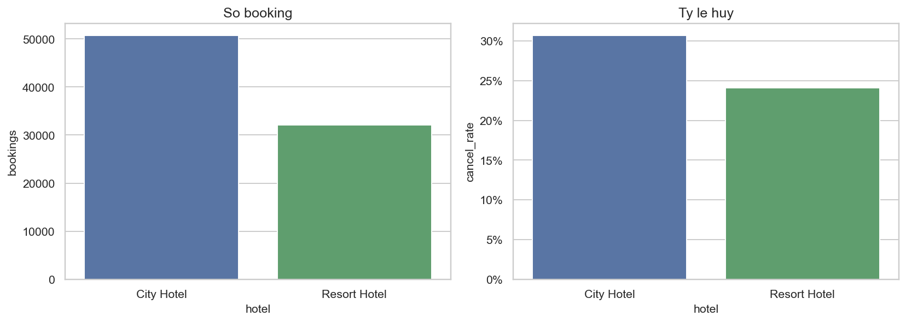
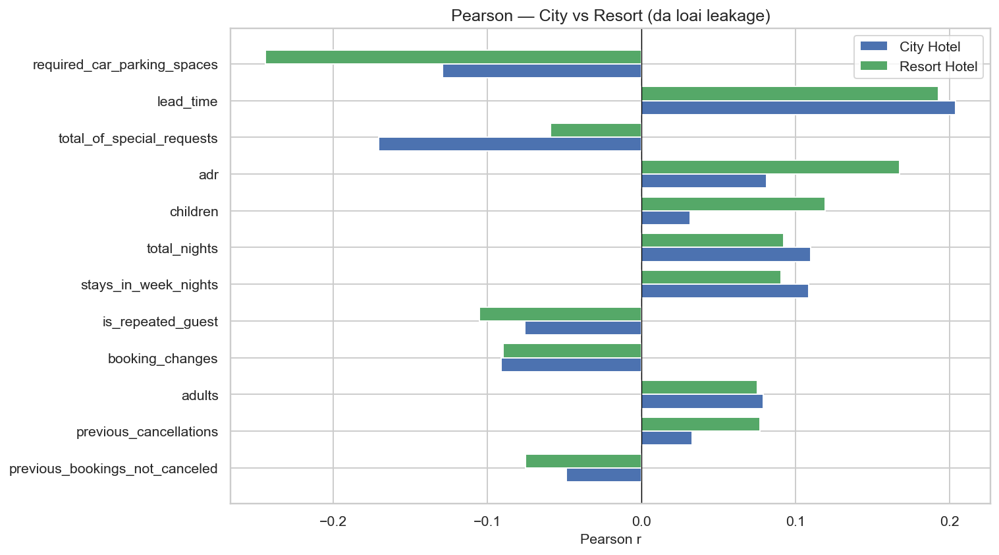
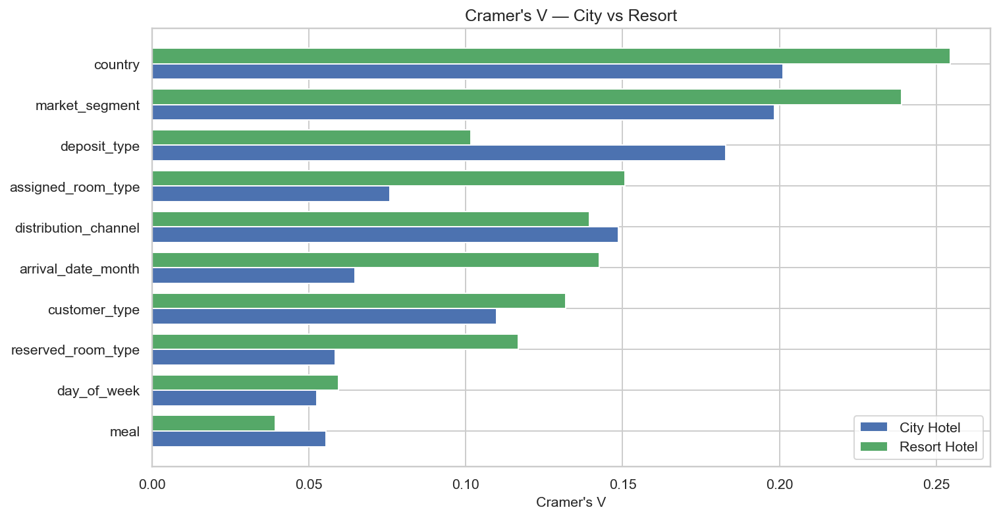
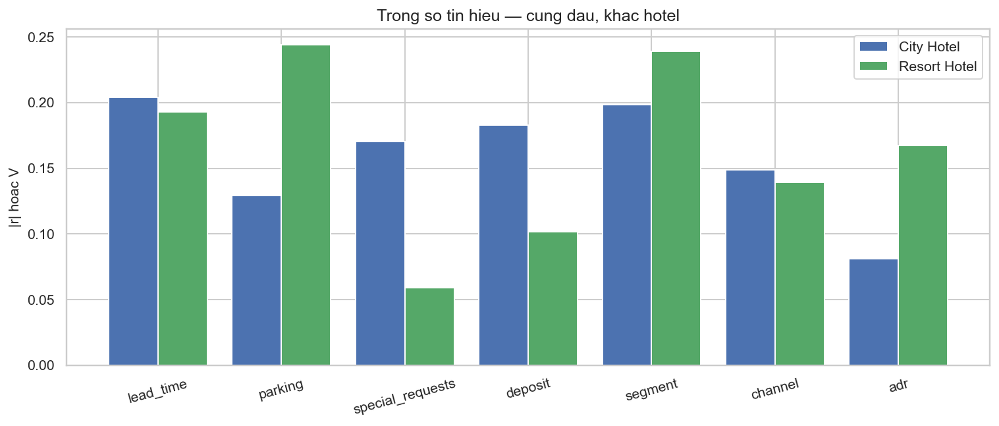
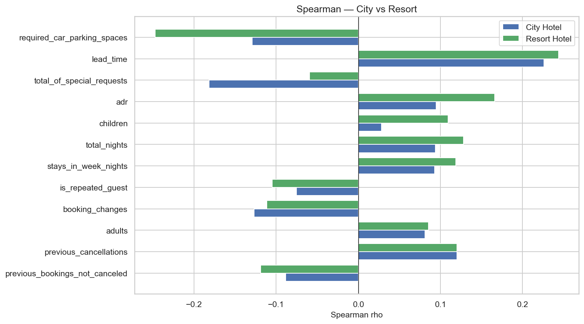
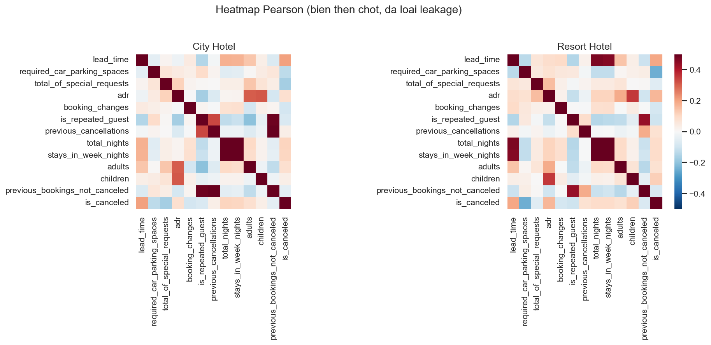
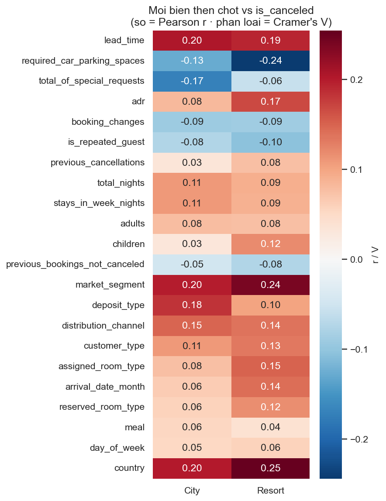
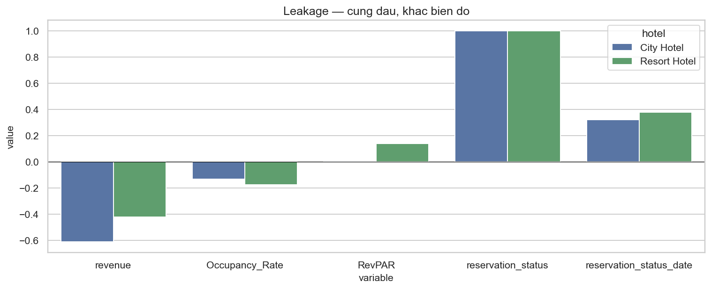
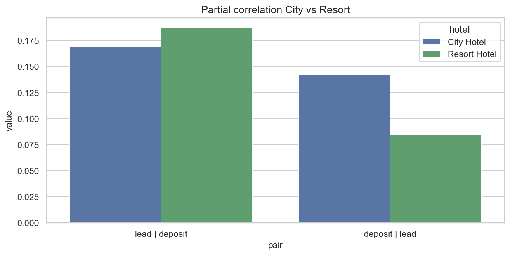
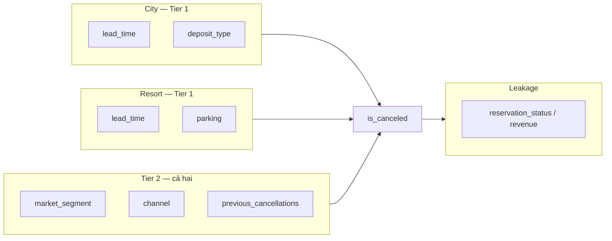

# Correlation Analysis: City vs Resort — `is_canceled`

> **Nguồn dữ liệu:** `hotel_bookings_v5.csv`  
> **Phạm vi:** 82.811 booking | Tỷ lệ hủy tổng thể: **28,12%** (23.284)  
> **City Hotel:** 50.686 booking · hủy **30,68%** (15.549)  
> **Resort Hotel:** 32.125 booking · hủy **24,08%** (7.735)  
> **Notebook:** [`notebooks/04b_correlation_analysis_city_resort.ipynb`](../notebooks/04b_correlation_analysis_city_resort.ipynb)  
> **Figures:** [`reports/figures/04b/`](./figures/04b/) · KPI: [`corr_compare_city_resort.csv`](./figures/04b/corr_compare_city_resort.csv)  
> **Bản gộp (không tách hotel):** [`04_correlation_analysis_is_canceled.md`](04_correlation_analysis_is_canceled.md)  
> **Kiểm định tách hotel:** [`05c_hypothesis_testing_city_resort.md`](05c_hypothesis_testing_city_resort.md)

---

## Mục tiêu

Lặp lại quy trình notebook **04** (Pearson, Spearman, Cramér's V, heatmap, partial correlation, phân loại causation vs leakage) nhưng **tính riêng từng hotel**. Câu hỏi chốt: ranking tín hiệu trên portfolio có phải là **trung bình hai cơ chế khác nhau** không — và feature / lever hủy có nên dùng một bộ cho cả hai property hay không.

**Phương pháp** (giống 04, stratify theo `hotel`):

| Loại biến | Metric | Ghi chú khi tách hotel |
|---|---|---|
| Số | Pearson r + Spearman ρ | Loại `revenue`, Occupancy, RevPAR; không xếp `dep_enc` |
| Phân loại | Cramér's V | **Bỏ `hotel`** (hằng số trong mỗi subset) |
| Confounding | Partial correlation | `lead_time` ↔ `is_canceled` \| `deposit_type` — từng hotel |

> Correlation ≠ causation. `hotel` trong bản 04 có V = 0,072 — đó là gap 6,6 pp, không phải feature khi đã stratify.

---

## 0. Snapshot

| Hotel | Bookings | Đã hủy | Tỷ lệ hủy |
|---|---:|---:|---:|
| **City Hotel** | 50.686 (61,2%) | 15.549 | **30,68%** |
| **Resort Hotel** | 32.125 (38,8%) | 7.735 | **24,08%** |
| Portfolio | 82.811 | 23.284 | 28,12% |

City gánh **67% số hủy** dù 61% volume. Mọi hệ số gộp ở 04 bị kéo về City.

---

## 1. Tổng quan — ranking sau khi loại leakage

### 1.1 Top tín hiệu từng hotel

| Hạng | City Hotel | Metric | Resort Hotel | Metric |
|:---:|---|---:|---|---:|
| 1 | `lead_time` | r = **0,204** | `required_car_parking_spaces` | r = **−0,244** |
| 2 | `total_of_special_requests` | r = **−0,170** | `lead_time` | r = **0,193** |
| 3 | `deposit_type` | V = **0,183** | `market_segment` | V = **0,239** |
| 4 | `market_segment` | V = **0,198** | `adr` | r = **0,168** |
| 5 | `required_car_parking_spaces` | r = −0,129 | `assigned_room_type` | V = 0,151 |
| 6 | `distribution_channel` | V = 0,149 | `arrival_date_month` | V = 0,143 |
| 7 | `total_nights` | r = 0,110 | `distribution_channel` | V = 0,139 |
| 8 | `customer_type` | V = 0,110 | `customer_type` | V = 0,132 |

`country` có V cao (City **0,201** · Resort **0,255**) vì 178 mức và sample nhỏ — **spurious**, không đưa model (giống 04).

### 1.2 So với bản gộp 04

Bản 04 xếp: segment V = 0,219 → lead r = 0,196 → parking −0,189 → special −0,128 → deposit V = 0,161 → ADR 0,123.

| Tín hiệu | Portfolio 04 | City | Resort | Portfolio đang |
|---|---:|---:|---:|---|
| `lead_time` r | 0,196 | **0,204** | 0,193 | Gần đúng cả hai |
| Parking r | −0,189 | −0,129 | **−0,244** | **Kéo về Resort** |
| Special requests r | −0,128 | **−0,170** | −0,059 | **Kéo về City** |
| `deposit_type` V | 0,161 | **0,183** | 0,102 | **Kéo về City** |
| `market_segment` V | 0,219 | 0,198 | **0,239** | **Kéo về Resort** |
| `adr` r | 0,123 | 0,081 | **0,168** | **Kéo về Resort** |
| Tháng V | 0,083 | 0,065 | **0,143** | Ẩn seasonality Resort |

**Thông điệp:** 04 đúng **dấu**, sai **trọng số**. Một feature set / một cancel policy cho cả hai hotel sẽ over-weight cọc & special requests ở Resort, under-weight parking & mùa ở City.

---

## 2. Tương quan biến số

### 2.1 Pearson — bảng then chốt

| Biến | City r | Resort r | Δ (City − Resort) | Đọc |
|---|---:|---:|---:|---|
| `lead_time` | **0,204** | **0,193** | +0,011 | Cùng dấu, gần bằng |
| `required_car_parking_spaces` | −0,129 | **−0,244** | +0,115 | Cam kết đi xe mạnh ở Resort |
| `total_of_special_requests` | **−0,170** | −0,059 | −0,111 | Cam kết dịch vụ mạnh ở City |
| `adr` | 0,081 | **0,168** | −0,086 | Confounded — mix mùa / OTA ở Resort |
| `total_nights` | 0,110 | 0,093 | +0,017 | Proxy stay dài |
| `stays_in_week_nights` | 0,109 | 0,091 | +0,018 | Tương tự |
| `booking_changes` | −0,091 | −0,090 | −0,001 | Ổn định, nhân quả hai chiều |
| `is_repeated_guest` | −0,075 | −0,105 | +0,029 | Loyalty rõ hơn Resort |
| `children` | 0,032 | **0,119** | −0,088 | Gia đình / mùa Resort |
| `previous_cancellations` | 0,033 | 0,077 | −0,044 | Pearson yếu (xem Spearman) |
| `adults` | 0,079 | 0,076 | +0,003 | Yếu |
| `previous_bookings_not_canceled` | −0,049 | −0,075 | +0,026 | Yếu |

`agent` (ID số) Pearson Resort **0,161** vs City −0,054 — **không** dùng như biến tuyến tính; đó là confounding đại lý.

### 2.2 Spearman — phi tuyến

| Biến | City ρ | Resort ρ | vs Pearson |
|---|---:|---:|---|
| `lead_time` | 0,226 | **0,244** | Cả hai > Pearson — monotonic, có thể phi tuyến. Resort Spearman **cao hơn** City dù Pearson thấp hơn |
| `previous_cancellations` | **0,120** | **0,120** | >> Pearson (0,033 / 0,077) — hiệu ứng đuôi, giống 04 |
| `booking_changes` | −0,127 | −0,111 | Mạnh hơn Pearson |
| `required_car_parking_spaces` | −0,129 | −0,248 | Ổn định với Pearson |
| `total_of_special_requests` | −0,182 | −0,059 | Ổn định: City mạnh, Resort yếu |
| `adr` | 0,095 | 0,166 | Ổn định |

Quy ước |r|: < 0,1 yếu · 0,1–0,3 trung bình. Không có biến số (sau leakage) đạt |r| > 0,3 ở City; parking Resort tiến sát ngưỡng mạnh.

---

## 3. Tương quan biến phân loại

| Biến | City V | Resort V | Δ | Ghi chú |
|---|---:|---:|---:|---|
| `market_segment` | 0,198 | **0,239** | −0,041 | Cùng hotspot Online TA; Groups chỉ nóng City (xem 02b) |
| `deposit_type` | **0,183** | 0,102 | +0,081 | Lever cọc **City-weighted** |
| `distribution_channel` | 0,149 | 0,139 | +0,009 | Ổn định — TA/TO vs Direct |
| `customer_type` | 0,110 | 0,132 | −0,022 | Transient |
| `assigned_room_type` | 0,076 | **0,151** | −0,075 | Khớp 03b: room match City 86% vs Resort **76%** |
| `arrival_date_month` | 0,065 | **0,143** | −0,078 | Mùa hủy / ADR đỉnh August ở Resort |
| `reserved_room_type` | 0,058 | 0,117 | −0,058 | Sample / mix phòng |
| `meal` | 0,055 | 0,039 | +0,016 | Yếu |
| `day_of_week` | 0,053 | 0,059 | −0,007 | Yếu |
| `country` | 0,201 | 0,255 | — | Spurious (nhiều mức) |

Không tính `hotel` trong 04b. Bản 04 gộp: hotel V = 0,072 = đúng gap 6,6 pp, nhưng **không** thay thế việc stratify.

---

## 4. Heatmap

Cấu trúc tương quan giữa các biến giải thích **không giống nhau**: Resort gắn ADR–tháng–trẻ em chặt hơn; City gắn special requests–lead–cọc chặt hơn. Train một model gộp mà không có interaction `hotel × feature` sẽ làm loãng cả hai cụm.

---

## 5. Leakage — loại khỏi modeling

| Biến | City | Resort | Lý do loại |
|---|---:|---:|---|
| `reservation_status` V | **1,000** | **1,000** | Nhãn hủy |
| `reservation_status_date` V | 0,321 | 0,378 | Xảy ra **sau** hủy |
| `revenue` r | **−0,610** | −0,422 | `adr × nights × (1 − is_canceled)` — City mạnh hơn vì ADR cao hơn |
| `Occupancy_Rate` r | −0,130 | −0,173 | Proxy tổng hợp |
| `RevPAR` r | 0,006 | 0,140 | Derived; Resort lộ tương quan giả vì mix ADR–mùa |

Cùng danh sách loại với 04. Biên độ leakage **khác hotel** nhưng quyết định giống nhau: **không đưa vào model**.

---

## 6. Partial correlation

Encode `deposit_type`: No Deposit = 0 · Refundable = 1 · Non Refund = 2 (giống 04).

| Cặp | Kiểm soát | City r thô → partial | Resort r thô → partial |
|---|---|---:|---:|
| `lead_time` ↔ hủy | deposit | 0,204 → **0,169** | 0,193 → **0,187** |
| `deposit_type` ↔ hủy | lead | — → **0,142** | — → **0,085** |

Portfolio 04: lead 0,196 → 0,177 · deposit partial 0,112.

**So sánh insight**

- Lead **không** chỉ là confounding với cọc ở cả hai hotel.
- Ở Resort, kiểm soát deposit hầu như **không** làm giảm r lead (0,193 → 0,187) — lead độc lập hơn.
- Ở City, lead và cọc **entangle** hơn (0,204 → 0,169); residual deposit vẫn lớn (0,142).
- Khớp 05c: deposit V City 0,183 vs Resort 0,102; lead effect (rank-biserial) mạnh hơn Resort.

Cả hai vẫn là candidate causation — **nhưng lever cọc ưu tiên City; reminder / fence lead ưu tiên cả hai, đặc biệt Resort**.

---

## 7. Phân loại causation vs correlation

Quy ước giữ như 04. **Hạng trong tier đổi theo hotel.**

### 7.1 Tier 1 — ưu tiên can thiệp

| Hotel | Biến | Metric | Hành động |
|---|---|---|---|
| **City** | `lead_time` | r = 0,204 · partial 0,169 | Cọc tiered + reminder; lead >180 hủy 47% (02b) |
| **City** | `deposit_type` | V = 0,183 · partial 0,142 | Mở rộng cam kết cho Online TA / Groups — **không** copy sang Resort hàng loạt |
| **Resort** | `lead_time` | r = 0,193 · partial **0,187** | Fence lead độc lập với cọc |
| **Resort** | `required_car_parking_spaces` | r = −0,244 | Tín hiệu cam kết (đi xe) — dùng **scoring**, không phải lever giá |

### 7.2 Tier 2 — feature model + lever gián tiếp

| Biến | City | Resort | Ghi chú |
|---|---:|---:|---|
| `market_segment` | V 0,198 | V **0,239** | Online TA hotspot cả hai; Groups raw 39% City bị confound (05c OR 1,09) |
| `distribution_channel` | 0,149 | 0,139 | Ổn định |
| `total_of_special_requests` | r **−0,170** | −0,059 | Scoring City |
| `is_repeated_guest` | −0,075 | −0,105 | Loyalty Resort rõ hơn |
| `previous_cancellations` | ρ 0,120 | ρ 0,120 | Behavioral — dùng Spearman / tree, không tuyến tính |

### 7.3 Tier 3 — confounded

| Biến | Vấn đề khi tách hotel |
|---|---|
| `adr` | City yếu (0,081); Resort 0,168 do mix August / OTA — không kết luận “giá gây hủy” |
| `arrival_date_month` | Chỉ Resort V = 0,143 |
| `assigned_room_type` / `reserved_room_type` | Resort mismatch nhiều hơn (03b) |
| `children` | Resort 0,119 — proxy gia đình / mùa |
| `agent` | ID số, Pearson Resort 0,161 — không dùng linear |
| `customer_type`, `total_nights`, `adults` | Proxy segment |
| `country` | Cardinality |

### 7.4 Leakage

`reservation_status`, `reservation_status_date`, `revenue`, `Occupancy_Rate`, `RevPAR` — tuyệt đối không dùng, cả hai hotel.

---

## 8. Feature priority khi train **tách hotel**

| Ưu tiên | City | Resort |
|:---:|---|---|
| **P1** | `lead_time`, `deposit_type`, `market_segment` × channel, `total_of_special_requests` | `lead_time`, `market_segment` × channel, `required_car_parking_spaces` |
| **P2** | parking, `previous_cancellations`, `is_repeated_guest`, `customer_type` | `customer_type`, special requests, `previous_cancellations`, month FE |
| **P3** | `adr` (yếu), `hotel` không dùng | `adr` + month (confounded — regularization / FE) |
| **Loại** | leakage giống 04 | leakage giống 04; không linear-encode `agent` |

Không stratify thì interaction `hotel × deposit`, `hotel × special_requests`, `hotel × parking` là mức tối thiểu.

---

## 9. Kết luận

1. **Cùng dấu với 04:** lead dương, parking / special requests âm, segment & deposit liên kết với hủy, leakage y nguyên (`reservation_status` V = 1 cả hai).
2. **Sai trọng số nếu không tách:** deposit + special requests là chuyện **City**; parking + segment + ADR/tháng là chuyện **Resort**.
3. Partial correlation: lead độc lập với cọc ở cả hai; residual deposit **gấp ~1,7 lần** ở City (0,142 vs 0,085). Lead sau kiểm soát cọc **mạnh hơn ở Resort** (0,187 vs 0,169) — khớp 05c.
4. `country` và `agent` (Resort) dễ đánh lừa ranking — không đưa model.
5. Bản gộp 04 đủ để **loại leakage** và chọn họ feature; **không đủ** để gán P1 giống nhau cho hai property.

### Liên kết EDA / kiểm định

| 04b | Khớp |
|---|---|
| Lead r ≈ 0,20 cả hai; partial Resort cao hơn | 02b lead >180: City 47% vs Resort 35%; 05c \|r\| lead mạnh hơn Resort |
| Deposit V 0,183 vs 0,102 | 05c H2 cùng hướng |
| Segment V 0,198 vs 0,239 | 02b Groups chỉ nóng City; 05c V segment mạnh hơn Resort |
| Special requests City −0,170 | Cam kết dịch vụ đô thị |
| Parking Resort −0,244 | Cam kết đi xe nghỉ dưỡng |
| Assigned room / month Resort | 03b mismatch 24% · ADR đỉnh August |

### Bước tiếp theo

- Modeling: giữ loại leakage như 04; **stratify hoặc interaction hotel** trước khi tin SHAP gộp.
- Kiểm định: [`05c`](05c_hypothesis_testing_city_resort.md) — H1–H4 bác bỏ H₀ cả hai, effect size khác.
- Không siết Non Refund hàng loạt ở Resort vì V cọc thấp và sample Non Refund nhỏ (xem 02b / 05c).

---

## Phụ lục — Biểu đồ

| # | File | Nội dung |
|---|---|---|
| 0 | `00_snapshot.png` | Volume / tỷ lệ hủy |
| 1 | `01_pearson_compare.png` | Pearson grouped bar |
| 2 | `02_spearman_compare.png` | Spearman grouped bar |
| 3 | `03_cramers_compare.png` | Cramér's V grouped bar |
| 4 | `04_heatmap_pearson.png` | Ma trận Pearson then chốt, 2 hotel |
| 5 | `05_heatmap_target.png` | 1 cột r / V vs target |
| 6 | `06_leakage.png` | Leakage |
| 7 | `07_partial_corr.png` | Partial lead \| deposit |
| 8 | `08_signal_weights.png` | Trọng số tín hiệu then chốt |
| — | `corr_compare_city_resort.csv` | Bảng số đầy đủ |

*Tài liệu tạo từ `hotel_bookings_v5.csv` (82.811 booking). Cùng phương pháp notebook 04, stratify City / Resort.*
