# Kiểm định giả thuyết: City vs Resort (`is_canceled`)

> **Nguồn dữ liệu:** `hotel_bookings_v5.csv`  
> **City:** 50.686 booking · hủy **30,68%**  
> **Resort:** 32.125 booking · hủy **24,08%**  
> **Notebook:** [`notebooks/05c_hypothesis_testing_city_resort.ipynb`](../notebooks/05c_hypothesis_testing_city_resort.ipynb)  
> **Figures:** [`reports/figures/05c/`](./figures/05c/)  
> **Báo cáo gộp:** [`05_hypothesis_testing_is_canceled.md`](05_hypothesis_testing_is_canceled.md)  
> **Hình tổng hợp portfolio:** `05b_hypothesis_visualization.ipynb` (không tách hotel)

**Mức ý nghĩa:** α = 0,05. Cùng bộ H1–H4 như notebook **05**, chạy **riêng từng hotel**.

Baseline logistic: `deposit_type = No Deposit`, `market_segment = Direct` (cùng baseline hai hotel để so sánh OR).

---

## Mục tiêu

Kiểm tra xem association `lead_time` / `deposit_type` / `market_segment` → `is_canceled` **có cùng độ mạnh** ở City và Resort không. n lớn → p-value gần 0 ở hầu hết test; đọc **effect size** và so sánh chéo.

---

## Kết quả tổng hợp

| Giả thuyết | Test | City p | City effect | Resort p | Resort effect | Cùng kết luận H₀? |
|---|---|---|---|---|---|---|
| H1 `lead_time` | Mann–Whitney | ≈ 0 | \|r\| = **0,283** | ≈ 0 | \|r\| = **0,330** | Cả hai bác bỏ |
| H1b `lead_time_bin` | χ² | ≈ 0 | V = **0,206** | ≈ 0 | V = **0,232** | Cả hai bác bỏ |
| H2 `deposit_type` | χ² | ≈ 0 | V = **0,183** | ≈ 0 | V = **0,102** | Cả hai bác bỏ |
| H3 `market_segment` | χ² | ≈ 0 | V = **0,198** | ≈ 0 | V = **0,239** | Cả hai bác bỏ |
| H4 3 biến | Logistic LR | ≈ 0 | R² = **0,087** | ≈ 0 | R² = **0,101** | Cả hai bác bỏ |

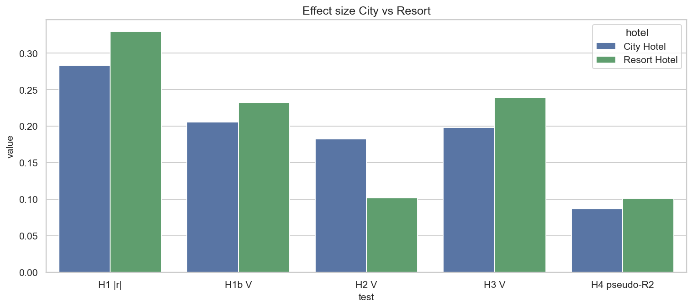

**So sánh effect size (chốt)**

| Metric | City | Resort | Đọc |
|---|---:|---:|---|
| Lead (r) | 0,283 | **0,330** | Tín hiệu lead **mạnh hơn ở Resort** |
| Lead bin (V) | 0,206 | **0,232** | Cùng chiều |
| Deposit (V) | **0,183** | 0,102 | Cọc gắn hủy **rõ hơn ở City** (Non Refund tập trung City) |
| Segment (V) | 0,198 | **0,239** | Mix segment giải thích hủy **mạnh hơn ở Resort** |
| Pseudo R² | 0,087 | **0,101** | Ba biến “đủ hơn” một chút ở Resort |

Portfolio **05** (r = 0,299 · V_segment = 0,219 · V_deposit = 0,161 · R² = 0,094) là **trung bình có trọng số** — che mất: Resort lead/segment mạnh hơn; City deposit mạnh hơn.

---

## H1 — `lead_time` (Mann–Whitney U)

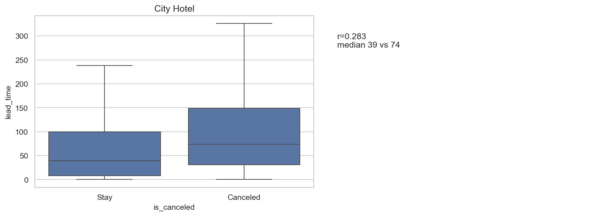

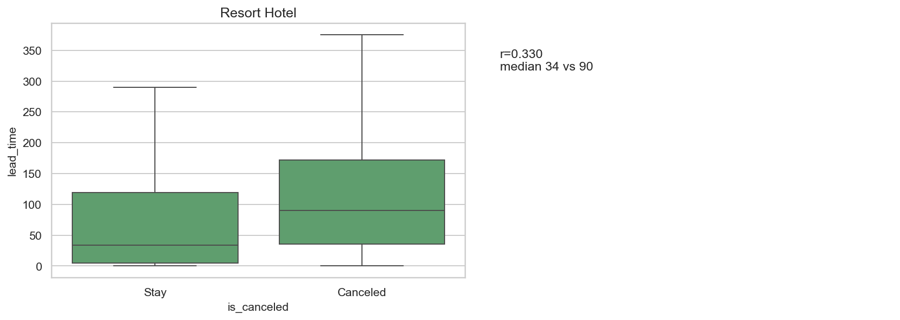

**H₀:** Phân bố `lead_time` giống nhau giữa hủy / không hủy (trong từng hotel).

| | City | Resort |
|---|---:|---:|
| U | 195.791.497 | 63.246.056 |
| p | ≈ 0 | ≈ 0 |
| Rank-biserial *r* | 0,283 | **0,330** |
| Median stay / hủy | 39 / **74** | 34 / **90** |
| Mean stay / hủy | 65,2 / 100,8 | 72,5 / 113,0 |
| Bootstrap Δ median (hủy − stay) | +36 ngày | **+56 ngày** |
| 95% CI | [34, 38] | [53, 60] |

**So sánh insight**

- Cả hai bác bỏ H₀. CI không chứa 0.
- Resort: median hủy gấp **2,6 lần** stay (90 vs 34); City chỉ **1,9 lần** (74 vs 39). \|r\| Resort vượt ngưỡng “trung bình” (0,3) rõ hơn.
- **KD:** reminder / confirm / soft-hold theo lead **siết sớm hơn ở Resort** (khoảng cách 56 ngày). City cần cửa sổ rộng hơn vì stay đã đặt khá sớm (median 39).

---

## H1b — `lead_time_bin` (Chi-squared)

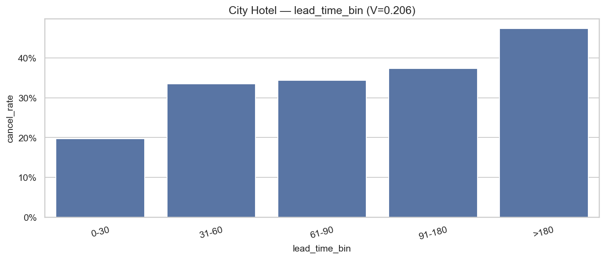

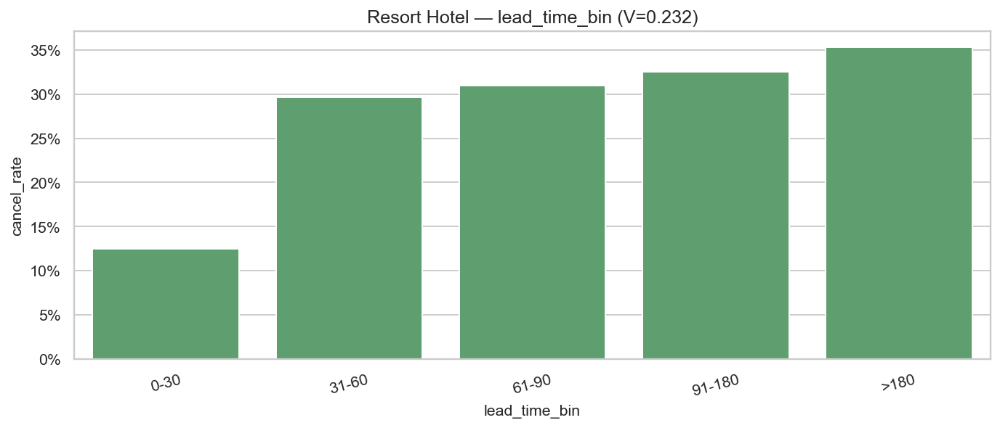

| | City | Resort |
|---|---:|---:|
| χ² (df=4) | 2142,8 | 1729,6 |
| Cramér's V | 0,206 | **0,232** |
| Min expected | 1732 | 718 |

| Bin | City hủy | Resort hủy |
|---|---:|---:|
| 0–30 | 19,8% | **12,5%** |
| 31–60 | 33,5% | 29,6% |
| 61–90 | 34,3% | 30,9% |
| 91–180 | 37,4% | 32,5% |
| >180 | **47,4%** | 35,3% |

**So sánh insight**

- Bước nhảy 0–30 → 31–60: City **+13,8 pp**; Resort **+17,1 pp**. Ngưỡng 30 ngày **sắc hơn ở Resort**.
- City không bão hòa: vẫn leo tới 47% ở >180. Resort tăng chậm sau 60 ngày (30,9% → 35,3%).
- Can thiệp “>180 ngày” **ưu tiên City**; “cửa 30 ngày” **ưu tiên Resort** (mất vùng an toàn ngay khi qua 30).

---

## H2 — `deposit_type` (Chi-squared)

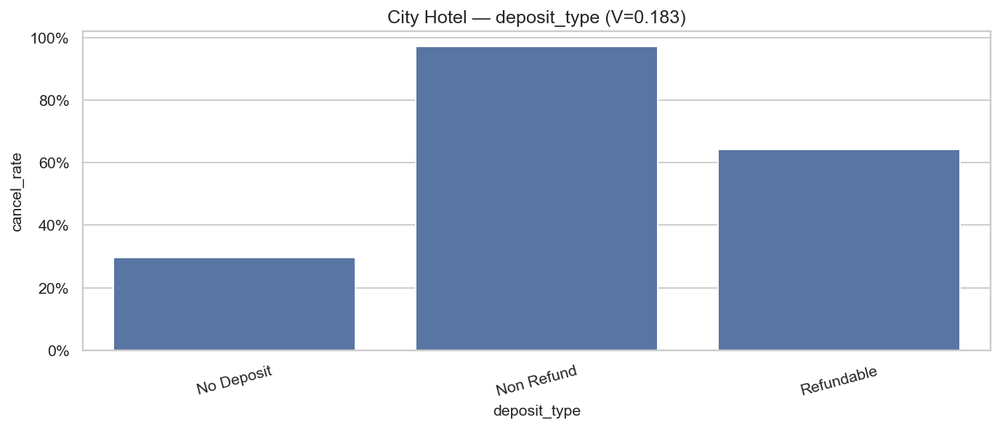

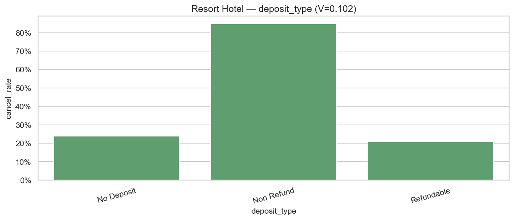

| | City | Resort |
|---|---:|---:|
| χ² (df=2) | 1693,2 | 332,3 |
| V | **0,183** | 0,102 |
| Non Refund n | 799 (97,1% hủy) | 164 (84,8% hủy) |
| No Deposit hủy | 29,6% | 23,8% |

**So sánh insight**

- Association cọc **yếu hơn hẳn ở Resort** (V = 0,10 vs 0,18) vì Non Refund gần như là hiện tượng City.
- Không kết luận nhân quả “đặt cọc làm tăng hủy”. Cùng diễn giải **05**: audit nhãn Non Refund, **không** siết cọc hàng loạt — đặc biệt Resort (n=164).
- Gap No Deposit 29,6% vs 23,8% mới là rủi ro scale.

---

## H3 — `market_segment` (Chi-squared)

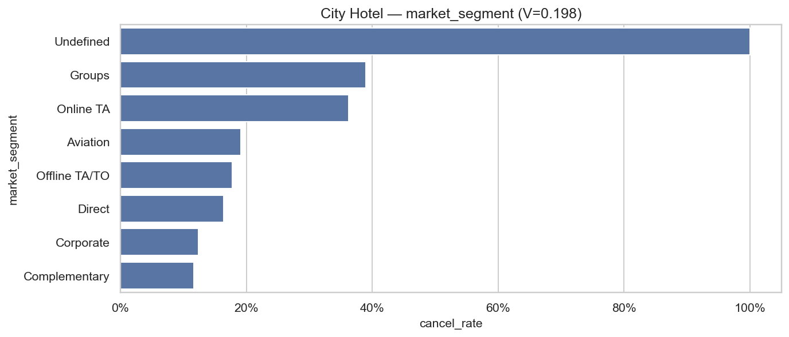

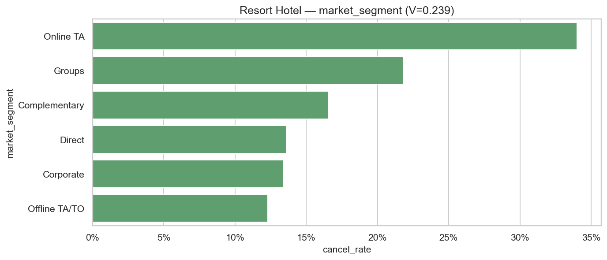

| | City | Resort |
|---|---:|---:|
| χ² | 1995,6 (df=7) | 1834,8 (df=5) |
| V | 0,198 | **0,239** |
| Online TA | 34.167 · **36,3%** | 16.224 · **34,0%** |
| Groups | 2.012 · **39,0%** | 1.678 · **21,8%** |
| Corporate | 12,3% | 13,4% |
| Direct | 16,4% | 13,6% |
| Offline TA/TO | 17,8% | **12,3%** |

**So sánh insight**

- Segment là test phân loại **mạnh nhất ở Resort** (V = 0,239) — vì Online TA tách xa các segment còn lại (12–22%).
- City: Groups **cạnh tranh** Online TA (39% vs 36%) nên V hơi thấp hơn dù cả hai đều cao. Policy City cần **hai** hotspot; Resort chủ yếu **một** (Online TA).
- Corporate ổn định chéo hotel (~12–13%) — ứng viên giữ chỗ / giảm overbook.

---

## H4 — Logistic đa biến

Mô hình: `is_canceled ~ lead_time + deposit_type + market_segment`  
Baseline: No Deposit · Direct.

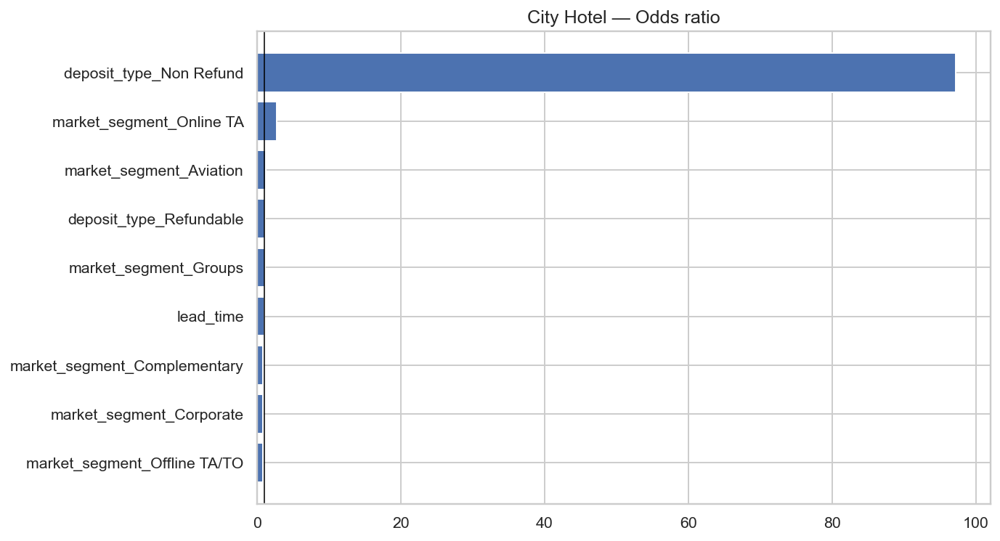

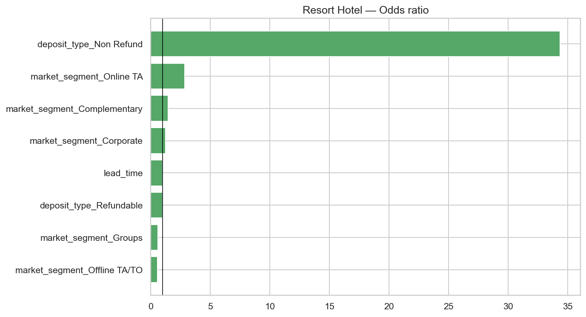

| | City | Resort |
|---|---:|---:|
| n | 50.684 | 32.125 |
| Pseudo R² (McFadden) | 0,087 | **0,101** |
| LR χ² | 5422 (df=9) | 3586 (df=8) |
| OR lead +30 ngày | **1,144** | **1,187** |
| OR Online TA vs Direct | **2,73** | **2,83** |
| OR Offline TA/TO vs Direct | 0,76 | **0,57** |
| OR Groups vs Direct | 1,09 (p=0,27) | **0,61** |
| OR Corporate vs Direct | **0,80** | 1,23 |
| OR Non Refund | Rất cao (~97) | Cao (~34) |

**So sánh insight**

- Sau khi kiểm soát lẫn nhau, **lead_time vẫn có ý nghĩa cả hai**. OR +30 ngày Resort (1,19) > City (1,14) — khớp H1: mỗi tháng đặt sớm, odds hủy Resort tăng mạnh hơn.
- **Online TA ≈ 2,7–2,8× Direct** ở **cả hai** — cùng hệ số, khác volume. Ưu tiên OTA là quyết định portfolio, không chỉ City.
- Groups: City **không khác Direct** sau khi kiểm soát lead/cọc (OR 1,09, p=0,27); raw 39% do **confound lead/cọc**. Resort Groups OR 0,61 — thấp hơn Direct khi đã kiểm soát. **Không copy “Groups = hotspot” từ City sang Resort.**
- Corporate: City bảo vệ (OR 0,80); Resort hơi cao hơn Direct (1,23, p=0,01) — mẫu Corporate Resort không “an toàn” như raw rate gợi ý.
- Pseudo R² 9–10%: hợp lý cho hành vi; còn nhiều yếu tố (quốc gia, history, parking…).

---

## Kết luận so sánh

1. **H1–H4 bác bỏ H₀ ở cả hai hotel** — tín hiệu không phải artifact do gộp City+Resort.
2. **Lead** và **segment** mạnh hơn ở **Resort**; **deposit** mạnh hơn ở **City** (do Non Refund).
3. Online TA là hotspot **chung** (OR ~2,8). Groups là hotspot **raw của City**, yếu đi trong logistic — cần tương tác lead × Groups trước khi siết policy.
4. Portfolio 05 **đúng dấu, sai trọng số**. Playbook hủy / buffer nên **tách hotel** ngay từ EDA (không đợi tới `17b` / `20`).

---

## Khuyến nghị hành động (tách hotel)

| Ưu tiên | City | Resort | Cơ sở |
|---|---|---|---|
| Cao | Online TA + lead > 30, đặc biệt **>180** | Online TA + **cửa 30 ngày** (bước nhảy +17 pp) | H1b, H3, H4 |
| Cao | Audit Groups (raw 39% nhưng OR vs Direct ns) | Không penalize Groups như City | H3 vs H4 |
| Trung bình | Audit Non Refund (n=799) | Lead median hủy 90 ngày → confirm sớm | H2, H1 |
| Trung bình | Corporate / Direct = kho ổn định | Offline TA/TO OR 0,57 — kênh giữ | H3, H4 |

---

## Hạn chế

- n lớn → p ≈ 0; luôn đọc effect size.
- Non Refund / Aviation / Undefined: sample nhỏ hoặc reverse causality.
- Association, không A/B. Logistic giả định log-linear trên lead (H1b đã cho thấy bước nhảy 30 ngày).
- `05b` visualization là bản **gộp**; dùng `05c` khi quyết định theo property.

---

## Tài liệu liên quan

- [`05_hypothesis_testing_is_canceled.md`](05_hypothesis_testing_is_canceled.md) — bản gộp  
- [`02b_eda_stage1_cancellation_city_resort.md`](02b_eda_stage1_cancellation_city_resort.md)  
- [`04_correlation_analysis_is_canceled.md`](04_correlation_analysis_is_canceled.md) — tương quan gộp  
- [`04b_correlation_analysis_city_resort.md`](04b_correlation_analysis_city_resort.md) — tương quan tách hotel  

---

*Tạo từ `hotel_bookings_v5.csv`. Cập nhật: 18/08/2026 — Hypothesis testing tách City / Resort. Notebook `05b` giữ vai trò visualization gộp.*
