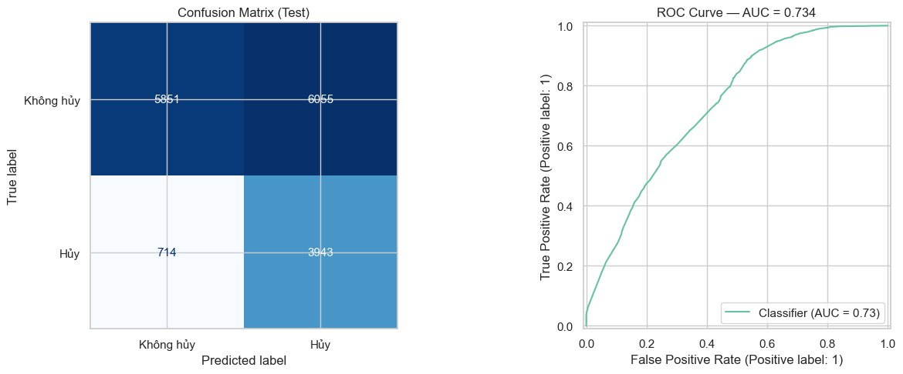
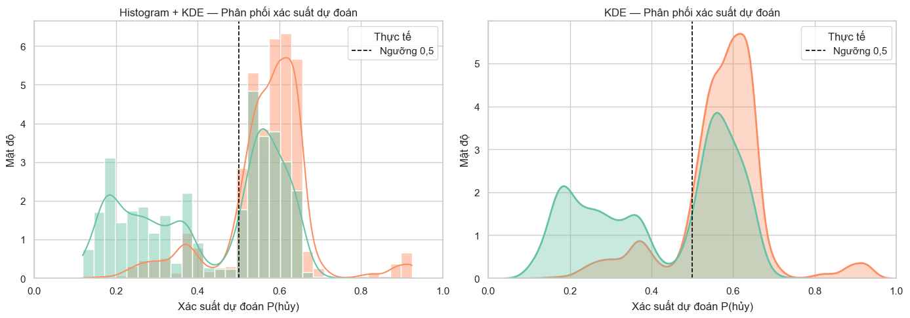
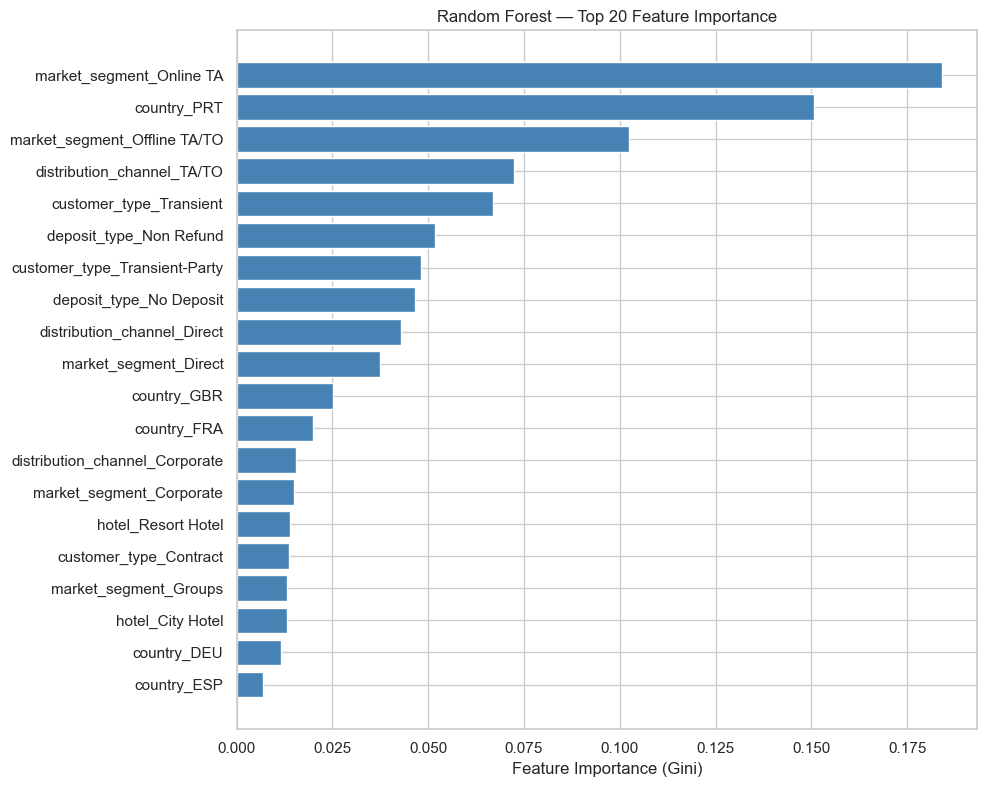

# Báo cáo mô hình dự đoán hủy phòng — Random Forest v1

> **Nguồn dữ liệu:** `hotel_bookings_v5.csv`  
> **Phạm vi:** 82.811 booking | Tỷ lệ hủy tổng thể: **28,12%** (~23.284 booking bị hủy)  
> **Notebook tham chiếu:** `06_cancellation_model_v1.ipynb`  
> **Thuật toán:** `RandomForestClassifier` (scikit-learn)  
> **Ngưỡng phân loại:** **0,50** (mặc định)

---

## 1. Mục tiêu

Xây dựng mô hình **baseline** dự đoán `is_canceled` chỉ từ **6 biến phân loại** có sẵn tại thời điểm đặt phòng, với kiểm soát **data leakage** nghiêm ngặt. Mô hình phục vụ đánh giá khả năng phân tách rủi ro hủy khi chưa bổ sung biến số hành vi (lead time, lịch sử hủy, …).

---

## 2. Thiết kế mô hình

### 2.1 Feature (6 biến phân loại)

| Biến | Số mức | Mã hóa |
|------|--------|--------|
| `deposit_type` | 3 | One-Hot Encoding |
| `market_segment` | 8 | One-Hot Encoding |
| `country` | 178 (gộp hiếm) | One-Hot, `min_frequency=5` |
| `distribution_channel` | 5 | One-Hot Encoding |
| `customer_type` | 4 | One-Hot Encoding |
| `hotel` | 2 | One-Hot Encoding |

### 2.2 Chống data leakage

| Ràng buộc | Cách thực hiện |
|-----------|----------------|
| Không dùng biến hậu quả | Loại `reservation_status`, `reservation_status_date`, `revenue`, `Occupancy_Rate`, `RevPAR` |
| Không leakage khi mã hóa | `train_test_split` (80/20, stratify) **trước** `OneHotEncoder` |
| Category hiếm | Gộp `infrequent` chỉ học từ train |

### 2.3 Siêu tham số Random Forest

| Tham số | Giá trị |
|---------|---------|
| `n_estimators` | 300 |
| `max_depth` | 12 |
| `min_samples_leaf` | 20 |
| `class_weight` | `balanced` |
| `random_state` | 42 |

---

## 3. Kết quả đánh giá (tập test — 16.563 booking)

### 3.1 Chỉ số tổng hợp

| Chỉ số | Giá trị | Diễn giải |
|--------|--------:|-----------|
| **ROC-AUC (test)** | **0,734** | Khả năng xếp hạng hủy / không hủy ở mức **chấp nhận được** (~0,70–0,80) |
| **CV ROC-AUC (5-fold, train)** | **0,733 ± 0,005** | Ổn định, không overfit mạnh trên AUC |
| **Accuracy** | 0,59 | Dễ **đánh giá cao giả** vì class lệch 72/28 |
| **Precision — Hủy** | 0,39 | Trong số dự đoán hủy, ~39% đúng |
| **Recall — Hủy** | **0,85** | Bắt được ~85% booking thực sự hủy |
| **F1 — Hủy** | 0,54 | Cân bằng P/R cho class thiểu số còn trung bình |
| **Precision — Không hủy** | 0,89 | Dự đoán không hủy khá tin cậy |
| **Recall — Không hủy** | 0,49 | Bỏ sót ~51% booking không hủy (gán nhầm sang hủy) |

### 3.2 Ma trận nhầm lẫn (ngưỡng 0,50)

|  | Dự đoán: Không hủy | Dự đoán: Hủy |
|--|--:|--:|
| **Thực tế: Không hủy** | TN = 5.851 | FP = 6.055 |
| **Thực tế: Hủy** | FN = 714 | TP = 3.943 |

**Đọc nhanh:** Mô hình **ưu tiên Recall class Hủy** (chỉ bỏ sót 714/4.657 booking hủy) nhưng trả giá bằng **False Positive cao** (6.055 khách không hủy bị gắn nhãn hủy). Phù hợp khi mục tiêu là **tránh bỏ sót rủi ro hủy** (ví dụ cảnh báo overbooking), không phù hợp nếu cần tránh “báo động giả”.

---

## 4. Feature importance (theo biến gốc)

Gini importance từ Random Forest sau One-Hot (~129 cột). Tổng hợp theo biến gốc — cột **Giá trị ảnh hưởng** chỉ rõ mức nào của biến đẩy rủi ro hủy lên / xuống (đối chiếu tỷ lệ hủy thực tế ~28,1% TB).

| Hạng | Biến gốc | Tổng importance | Giá trị ảnh hưởng mạnh | Hướng tác động | Đánh giá |
|:---:|----------|----------------:|------------------------|----------------|----------|
| 1 | `market_segment` | 0,354 | **Online TA** (hủy ~35,5%); ngược lại **Corporate / Direct / Offline TA/TO** (~13–15%) | Online TA ↑ rủi ro; Corporate/Direct ↓ | **Cao nhất** — phân khúc quyết định mạnh rủi ro hủy |
| 2 | `country` | 0,258 | **PRT** (hủy ~36,8%); **BRA / ITA** cao; **GBR / FRA** thấp hơn (~20%) | PRT/BRA/ITA ↑; GBR/FRA ↓ | Thị trường nguồn — PRT là tín hiệu đơn lẻ mạnh |
| 3 | `customer_type` | 0,132 | **Transient** (hủy ~30,4%); **Group / Transient-Party / Contract** thấp hơn (~11–17%) | Transient ↑; Group/Contract ↓ | Loại khách lẻ rủi ro hơn đoàn / hợp đồng |
| 4 | `distribution_channel` | 0,131 | **TA/TO** (hủy ~31,5%); **Direct / Corporate** (~14–15%) | TA/TO ↑; Direct/Corporate ↓ | Kênh OTA vs Direct — khớp `market_segment` |
| 5 | `deposit_type` | 0,099 | **Non Refund** (hủy ~95%); **No Deposit** (~27%); **Refundable** (~28%) | Non Refund ↑↑ (đặc thù); No Deposit gần TB | Cọc Non Refund cực kỳ đặc thù — thận trọng nhân quả |
| 6 | `hotel` | 0,027 | **City Hotel** (hủy ~30,7%) vs **Resort** (~24,1%) | City ↑ nhẹ so Resort | Yếu hơn trong mô hình chỉ phân loại |

**Top category đơn lẻ (top 5) — giá trị cụ thể sau One-Hot:**

| Feature (sau OHE) | Importance | Giá trị = 1 nghĩa là | Hướng vs TB hủy | Đánh giá |
|-------------------|----------:|----------------------|-----------------|----------|
| `market_segment_Online TA` | 0,184 | Booking thuộc Online TA | **↑ rủi ro** (hủy ~35,5%) | Tín hiệu phân loại mạnh nhất |
| `country_PRT` | 0,151 | Quốc tịch Bồ Đào Nha | **↑ rủi ro** (hủy ~36,8%) | Thị trường nội địa lớn + hủy cao |
| `market_segment_Offline TA/TO` | 0,102 | Offline TA/TO | **↓ rủi ro** (hủy ~15,1%) | Tách rõ khỏi Online TA |
| `distribution_channel_TA/TO` | 0,072 | Kênh đại lý / OTA | **↑ rủi ro** (hủy ~31,5%) | Trùng hướng với Online TA |
| `customer_type_Transient` | 0,067 | Khách lẻ Transient | **↑ rủi ro** (hủy ~30,4%) | Rủi ro hơn Group/Contract |

**Nhận xét:** Online TA và khách Bồ Đào Nha (PRT) là hai **giá trị** đẩy rủi ro hủy lên mạnh nhất; Offline TA/TO và Direct/Corporate kéo rủi ro xuống. Kết quả khớp EDA/hypothesis testing.

---

## 5. Trực quan hóa & đánh giá biểu đồ

### 5.1 Confusion Matrix

- **Mục đích:** Đếm TN/TP/FP/FN trên test.
- **Đánh giá:** Cho thấy rõ trade-off — Recall hủy cao nhưng FP lớn. Không nên chỉ nhìn accuracy 59%.

### 5.2 ROC Curve

- **Mục đích:** Đo khả năng phân tách ở mọi ngưỡng; AUC = 0,734.
- **Đánh giá:** Mô hình vượt ngẫu nhiên (0,5) rõ rệt nhưng **chưa đủ mạnh** để triển khai production chỉ với biến phân loại. Đường ROC phản ánh ranking tốt hơn là calibration xác suất tuyệt đối.

### 5.3 Prediction Probability Distribution (Histogram + KDE)

- **Mục đích:** So sánh phân phối `P(hủy)` giữa booking thực sự hủy vs không hủy.
- **Quy ước màu:** teal = Không hủy · orange = Hủy · đường đứt nét = ngưỡng 0,50.
- **Đánh giá:** Hai phân phối **chồng lấn đáng kể** quanh 0,3–0,6 → khó tách lớp hoàn hảo; phù hợp với AUC ~0,73. Booking hủy có xu hướng `P(hủy)` cao hơn nhưng vẫn nhiều overlap.

### 5.4 Feature Importance (bar chart top 20)

- **Mục đích:** Xác định category / biến gốc ảnh hưởng nhiều nhất tới quyết định cây.
- **Đánh giá:** Hữu ích cho **diễn giải kinh doanh** (tập trung OTA, segment, thị trường PRT); không đồng nghĩa nhân quả.

---

## 6. Kết luận & hạn chế

### Điểm mạnh

1. Pipeline sạch, kiểm soát leakage đúng quy trình ML.
2. Recall class Hủy cao (85%) với ngưỡng 0,5 — hữu ích cho cảnh báo sớm.
3. `market_segment` và `country` là hai trục phân loại quan trọng nhất.

### Hạn chế

1. **Thiếu biến số** (`lead_time`, `total_of_special_requests`, …) → AUC chỉ ~0,73.
2. **Precision thấp** cho class Hủy → nhiều báo động giả.
3. Chỉ dùng biến phân loại → không nắm được hành vi đặt trước xa / cam kết đặc biệt.

### Khuyến nghị

- Dùng v1 làm **baseline phân loại**; chuyển sang **v1.1** khi cần AUC và giải thích đa chiều hơn.
- Kết hợp với [05_hypothesis_testing_is_canceled.md](05_hypothesis_testing_is_canceled.md) và [04_correlation_analysis_is_canceled.md](04_correlation_analysis_is_canceled.md) để đối chiếu association vs prediction.

---

## 7. Tài liệu liên quan

| Tài liệu | Nội dung |
|----------|----------|
| `06_cancellation_model_v1.ipynb` | Notebook đầy đủ |
| `07_cancellation_model_v1_1.md` | Mô hình mở rộng + segment analysis |
| `Guide - Cach doc chi so thong ke.md` | Cách đọc Accuracy, F1, ROC-AUC |
