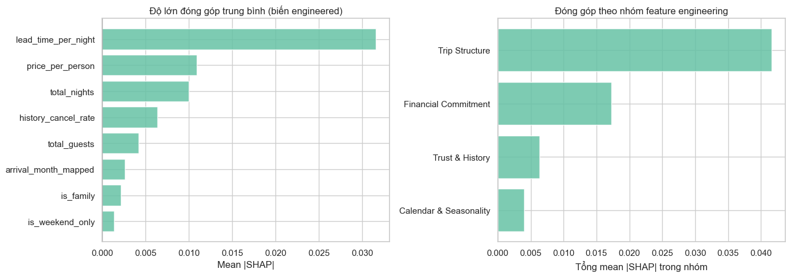
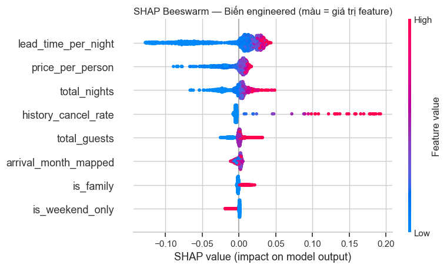
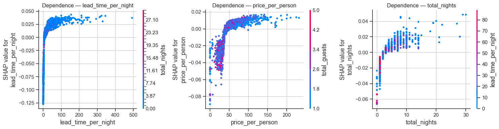
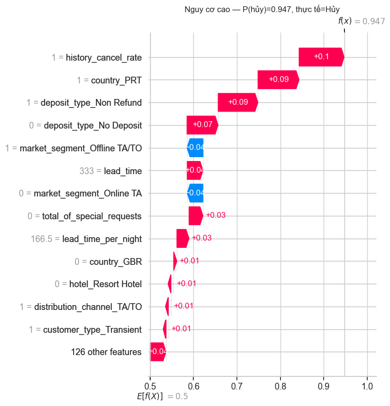
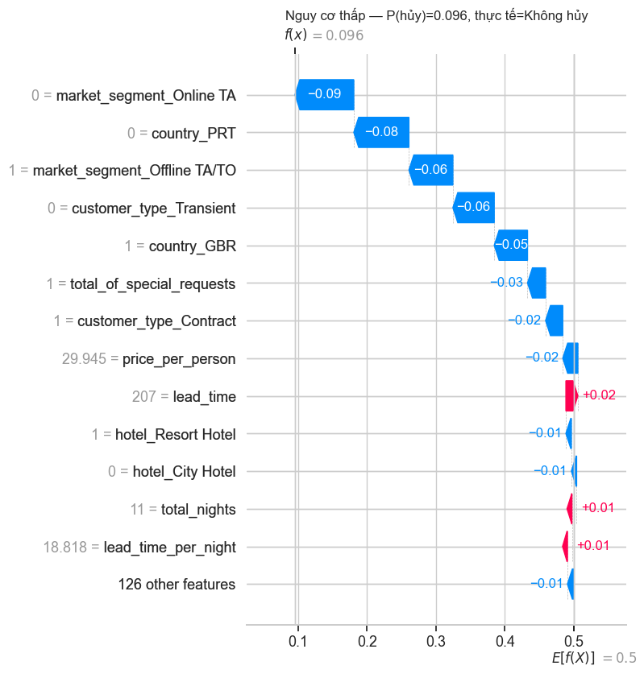
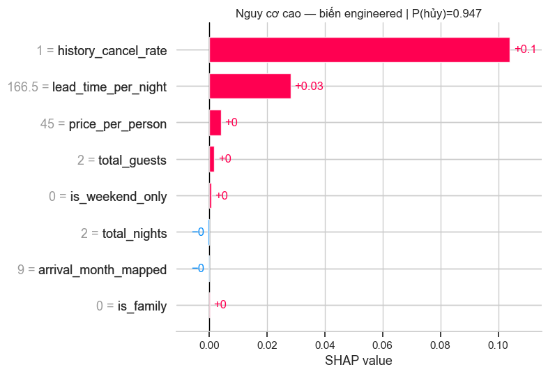
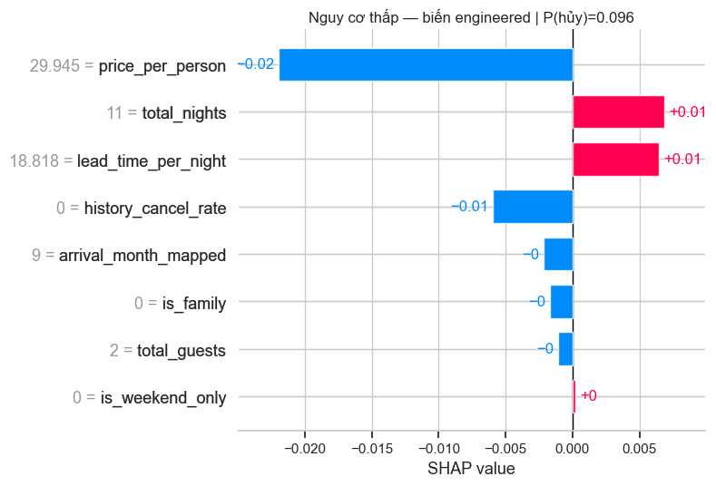
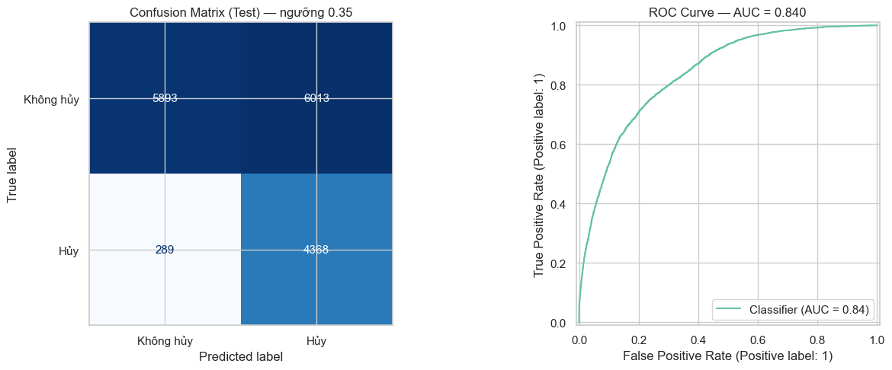
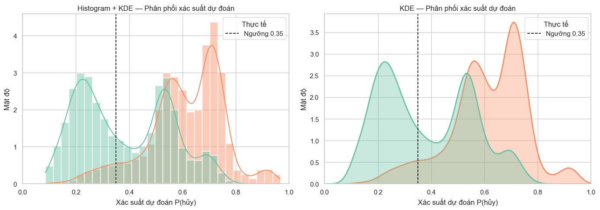
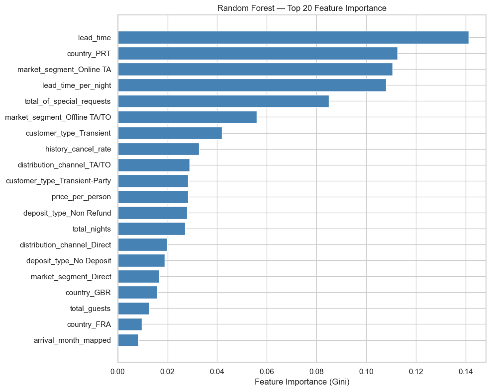

# Báo cáo mô hình dự đoán hủy phòng — Random Forest v1.2

> **Nguồn dữ liệu:** `hotel_bookings_v5.csv`  
> **Phạm vi:** 82.811 booking | Tỷ lệ hủy tổng thể: **28,12%** (~23.284 booking bị hủy)  
> **Notebook tham chiếu:** `08_cancellation_model_v1_2.ipynb`  
> **Thuật toán:** `RandomForestClassifier` (scikit-learn) + giải thích **SHAP** (`TreeExplainer`)  
> **Ngưỡng phân loại:** **0,35** (`P(hủy) >= 0,35` → dự đoán Hủy)

---

## 1. Mục tiêu & khác biệt so với v1.1

v1.2 kế thừa v1.1 và bổ sung **feature engineering** theo 4 nhóm biến, đồng thời dùng **SHAP** để giải thích đóng góp của từng biến mới vào quyết định dự đoán.

| Tiêu chí | v1.1 | **v1.2** |
|----------|-----|----------|
| Số feature gốc | 9 (6 phân loại + 3 số) | **16** (6 phân loại + 10 số) |
| Feature engineering | Không | **9 biến engineered** (4 nhóm) |
| Biến lịch sử | `previous_cancellations` (thô) | **`history_cancel_rate`** (tỷ lệ) |
| Giải thích mô hình | Feature importance (Gini) | Gini + **SHAP** (local & global) |
| Ngưỡng | 0,35 | **0,35** (giữ nguyên) |
| ROC-AUC (test) | 0,831 | **0,840** |
| Recall — Hủy @ 0,35 | 0,94 | **0,94** |

**Cải thiện chính:** ROC-AUC tăng **+0,009** (~+1,1%) so v1.1; 4 biến engineered lọt **top 20** Gini importance; SHAP xác nhận `lead_time_per_night` là biến engineered đóng góp mạnh nhất.

---

## 2. Thiết kế mô hình

### 2.1 Feature engineering (4 nhóm)

#### Nhóm 1 — Mức độ cam kết tài chính (Financial Commitment)

| Biến | Công thức | Ghi chú |
|------|----------|---------|
| `total_guests` | `adults + children + babies` | Clip tối thiểu = 1 |
| `price_per_person` | `adr / total_guests` | Giá trên mỗi khách |
| `is_family` | 1 nếu `children > 0` hoặc `babies > 0` | Nhóm gia đình |

#### Nhóm 2 — Cấu trúc chuyến đi (Trip Structure)

| Biến | Công thức | Ghi chú |
|------|----------|---------|
| `total_nights` | `stays_in_weekend_nights + stays_in_week_nights` | Tổng đêm lưu trú |
| `lead_time_per_night` | `lead_time / total_nights` | Clip mẫu số ≥ 1 |

#### Nhóm 3 — Lịch sử và uy tín (Trust & History)

| Biến | Công thức | Ghi chú |
|------|----------|---------|
| `history_cancel_rate` | `previous_cancellations / (previous_cancellations + previous_bookings_not_canceled)` | = 0 nếu chưa có lịch sử |

#### Nhóm 4 — Lịch & mùa (Calendar & Seasonality)

| Biến | Công thức | Ghi chú |
|------|----------|---------|
| `is_weekend_only` | 1 nếu `weekend_nights > 0` và `week_nights == 0` | Chỉ ở cuối tuần |
| `arrival_month_mapped` | Tháng đến → số 1–12 (Jan→1 … Dec→12) | Mùa vụ |

### 2.2 Feature đưa vào mô hình (16 biến)

| Biến | Kiểu | Xử lý |
|------|------|--------|
| `deposit_type`, `market_segment`, `country`, `distribution_channel`, `customer_type`, `hotel` | Phân loại | One-Hot Encoding |
| `lead_time`, `total_of_special_requests` | Số (v1.1) | Passthrough |
| 8 biến engineered ở trên | Số | Passthrough |

`ColumnTransformer`: nhánh `cat` (One-Hot, `min_frequency=5`) + nhánh `num` (passthrough). Sau encoding: **139 cột** đầu vào Random Forest.

**Hyperparameter RF (giữ v1.1):** `n_estimators=300`, `max_depth=12`, `min_samples_leaf=20`, `class_weight='balanced'`.

### 2.3 Chống data leakage

1. Không nạp `reservation_status`, `revenue`, `Occupancy_Rate`, `RevPAR`, ...
2. Feature engineering chỉ dùng thông tin **có tại thời điểm đặt phòng** (`adr`, `lead_time`, lịch sử khách, ...).
3. `train_test_split` **trước** mọi bước fit encoder.
4. `OneHotEncoder` chỉ `fit` trên tập train (qua `Pipeline`).

**Lưu ý:** `history_cancel_rate` tổng hợp lịch sử quá khứ — hợp lệ vì biết khi khách đặt; không phải leakage của booking hiện tại.

### 2.4 Ngưỡng 0,35

```text
y_pred = 1  nếu  P(hủy) >= 0.35
```

Giữ ngưỡng v1.1 để so sánh công bằng: ưu tiên **Recall** (không bỏ sót booking sẽ hủy), chấp nhận tăng False Positive.

---

## 3. Kết quả đánh giá (tập test — 16.563 booking)

### 3.1 Chỉ số tổng hợp @ ngưỡng 0,35

| Chỉ số | Giá trị | Diễn giải |
|--------|--------:|-----------|
| **ROC-AUC (test)** | **0,840** | **Tốt** — cải thiện +0,009 so v1.1 |
| **CV ROC-AUC (5-fold)** | **0,838 ± 0,004** | Ổn định, generalize tốt |
| **Accuracy** | 0,62 | Không dùng làm metric chính (class lệch) |
| **Precision — Hủy** | 0,42 | ~42% dự đoán hủy là đúng |
| **Recall — Hủy** | **0,94** | Bắt ~94% booking thực sự hủy |
| **F1 — Hủy** | 0,58 | @ 0,35 |
| **Precision — Không hủy** | 0,95 | Rất cao khi dự đoán không hủy |
| **Recall — Không hủy** | 0,49 | ~51% booking không hủy bị gán nhầm “hủy” |

### 3.2 So sánh ngưỡng 0,35 vs 0,50 (cùng mô hình v1.2)

| Metric (class Hủy) | @ 0,50 | @ **0,35** |
|--------------------|-------:|-----------:|
| F1 | **0,613** | 0,581 |
| Recall | 0,83 | **0,94** |
| FN (bỏ sót hủy) | ~812 | **~289** |

**Kết luận ngưỡng:** 0,35 giảm FN từ ~812 xuống **289** (−64%) — phù hợp chiến lược inventory protection; 0,50 tốt hơn nếu ưu tiên F1 / Precision.

### 3.3 Ma trận nhầm lẫn @ 0,35

|  | Dự đoán: Không hủy | Dự đoán: Hủy |
|--|--:|--:|
| **Thực tế: Không hủy** | TN = 5.893 | FP = 6.013 |
| **Thực tế: Hủy** | FN = 289 | TP = 4.368 |

### 3.4 Phân phối xác suất dự đoán (test)

| Nhãn thực tế | n | Mean P(hủy) | Median P(hủy) | Std |
|--------------|--:|------------:|--------------:|----:|
| Không hủy | 11.906 | 0,384 | 0,354 | 0,173 |
| Hủy | 4.657 | **0,612** | **0,627** | 0,143 |

Hai phân phối tách lớp rõ hơn v1.1 (AUC cao hơn). Ngưỡng 0,35 nằm trong vùng overlap → tăng Recall, kéo theo nhiều FP.

---

## 4. Feature importance (Gini)

### 4.1 Top 20 feature (sau tiền xử lý)

| Hạng | Feature | Importance | Biến gốc / nhóm |
|:---:|---------|----------:|------------------|
| 1 | `lead_time` | 0,141 | `lead_time` |
| 2 | `country_PRT` | 0,113 | `country` |
| 3 | `market_segment_Online TA` | 0,111 | `market_segment` |
| 4 | **`lead_time_per_night`** | **0,108** | **Trip Structure** |
| 5 | `total_of_special_requests` | 0,085 | `total_of_special_requests` |
| 6 | `market_segment_Offline TA/TO` | 0,056 | `market_segment` |
| 7 | `customer_type_Transient` | 0,042 | `customer_type` |
| 8 | **`history_cancel_rate`** | **0,033** | **Trust & History** |
| 9 | `distribution_channel_TA/TO` | 0,029 | `distribution_channel` |
| 10 | `customer_type_Transient-Party` | 0,028 | `customer_type` |
| 11 | **`price_per_person`** | **0,028** | **Financial Commitment** |
| 12 | `deposit_type_Non Refund` | 0,028 | `deposit_type` |
| 13 | **`total_nights`** | **0,027** | **Trip Structure** |
| 14 | `distribution_channel_Direct` | 0,020 | `distribution_channel` |
| 15 | `deposit_type_No Deposit` | 0,019 | `deposit_type` |
| 16 | `market_segment_Direct` | 0,017 | `market_segment` |
| 17 | `country_GBR` | 0,016 | `country` |
| 18 | **`total_guests`** | **0,013** | **Financial Commitment** |
| 19 | `country_FRA` | 0,010 | `country` |
| 20 | **`arrival_month_mapped`** | **0,008** | **Calendar & Seasonality** |

**Nhận xét:** 4 biến engineered trong top 20; `lead_time_per_night` (#4) gần sát `lead_time` (#1) — chuẩn hóa lead time theo độ dài chuyến đi mang tín hiệu dự báo mạnh.

### 4.2 Gom nhóm theo biến gốc (tổng Gini importance)

| Hạng | Biến / nhóm | Tổng importance | Đánh giá |
|:---:|-------------|----------------:|----------|
| 1 | `market_segment` | 0,195 | Kênh OTA vẫn quan trọng |
| 2 | `country` | 0,164 | Thị trường nguồn (PRT) |
| 3 | `lead_time` | 0,141 | Đặt trước xa → rủi ro cao |
| 4 | **`lead_time_per_night`** | **0,108** | **Biến engineered mạnh nhất** |
| 5 | `total_of_special_requests` | 0,085 | Cam kết / nhu cầu cụ thể |
| 6 | `customer_type` | 0,077 | Transient rủi ro hơn |
| 7 | `distribution_channel` | 0,054 | TA/TO vs Direct |
| 8 | `deposit_type` | 0,047 | Chính sách cọc |
| 9 | **`history_cancel_rate`** | **0,033** | Lịch sử hủy — tín hiệu phụ |
| 10 | **`price_per_person`** | **0,028** | Cam kết tài chính |
| 11 | **`total_nights`** | **0,027** | Cấu trúc chuyến đi |
| 12 | `hotel` | 0,015 | City vs Resort |
| 13 | **`total_guests`** | **0,013** | Quy mô nhóm khách |
| 14 | **`arrival_month_mapped`** | **0,008** | Mùa vụ — yếu hơn |
| 15 | **`is_family`** | **0,003** | Gia đình — yếu |
| 16 | **`is_weekend_only`** | **0,002** | Cuối tuần — yếu nhất |

---

## 5. Giải thích SHAP — Biến engineered

### 5.1 Phương pháp

| Thành phần | Cài đặt |
|------------|---------|
| Thư viện | `shap` — `TreeExplainer` |
| Mô hình giải thích | `RandomForestClassifier` sau `ColumnTransformer` |
| Dữ liệu | Mẫu **2.000** booking ngẫu nhiên từ tập test (`random_state=42`) |
| Class giải thích | **Hủy** (class 1) — SHAP đo đóng góp vào `P(hủy)` |

**Cách đọc SHAP:**

- **SHAP > 0** → đẩy xác suất hủy **tăng** (nguy cơ cao hơn)
- **SHAP < 0** → đẩy xác suất hủy **giảm** (nguy cơ thấp hơn)
- **|SHAP| lớn** → feature đóng góp mạnh vào quyết định **cho booking cụ thể**

Khác với Gini importance (trung bình toàn cục, không có dấu), SHAP cho biết **hướng** và **mức độ** tác động trên từng quan sát.

### 5.2 Mean |SHAP| — Xếp hạng biến engineered

| Hạng | Biến | Mean \|SHAP\| | Mean SHAP | Nhóm | Diễn giải |
|:---:|------|------------:|----------:|------|-----------|
| 1 | **`lead_time_per_night`** | **0,032** | −0,005 | Trip Structure | Đóng góp lớn nhất; trung bình hơi kéo P(hủy) xuống |
| 2 | `price_per_person` | 0,011 | −0,002 | Financial Commitment | Giá/người cao → thường giảm rủi ro hủy |
| 3 | `total_nights` | 0,010 | −0,001 | Trip Structure | Số đêm dài hơn → xu hướng giảm rủi ro |
| 4 | `history_cancel_rate` | 0,006 | −0,001 | Trust & History | Lịch sử hủy cao → SHAP dương mạnh trên từng case |
| 5 | `total_guests` | 0,004 | −0,000 | Financial Commitment | Nhiều khách → tác động nhỏ |
| 6 | `arrival_month_mapped` | 0,003 | −0,000 | Calendar | Mùa vụ — tác động yếu |
| 7 | `is_family` | 0,002 | −0,000 | Financial Commitment | Gia đình — tác động yếu |
| 8 | `is_weekend_only` | 0,001 | −0,000 | Calendar | Cuối tuần — yếu nhất |

### 5.3 Tổng hợp theo nhóm feature engineering

| Nhóm | Tổng mean \|SHAP\| | Mean SHAP | Đánh giá |
|------|------------------:|----------:|----------|
| **Trip Structure** | **0,042** | −0,006 | Nhóm engineered quan trọng nhất — chủ yếu nhờ `lead_time_per_night` |
| Financial Commitment | 0,017 | −0,003 | `price_per_person` là trụ chính |
| Trust & History | 0,006 | −0,001 | Một biến nhưng có giá trị khi lịch sử hủy > 0 |
| Calendar & Seasonality | 0,004 | −0,000 | Tín hiệu phụ so với lead time / segment |

### 5.4 Diễn giải theo từng biến (SHAP + Gini)

#### `lead_time_per_night` (Trip Structure)

- **Gini #4 toàn mô hình** | **SHAP #1 trong nhóm engineered**
- Chuẩn hóa `lead_time` theo số đêm giúp tách booking “đặt sớm nhưng ở ngắn” vs “đặt sớm và ở dài”.
- Trên trung bình mẫu SHAP hơi âm: lead time/đêm **thấp** (đặt gấp, ở nhiều đêm) thường gắn SHAP dương → tăng P(hủy); **cao** → giảm P(hủy).
- **Hành động:** Kết hợp rule `lead_time_per_night` cao với segment OTA để ưu tiên xác nhận / cọc.

#### `price_per_person` (Financial Commitment)

- **Gini #11** | **SHAP #2 engineered**
- Giá trên mỗi khách phản ánh mức cam kết tài chính tương đối; SHAP âm trung bình → giá/người cao hơn thường **giảm** xác suất hủy.
- **Hành động:** Booking ADR thấp/khách + lead time dài → ưu tiên can thiệp (upsell, cọc).

#### `total_nights` (Trip Structure)

- **Gini #13** | **SHAP #3 engineered**
- Chuyến dài hơn → xu hướng cam kết cao hơn (SHAP âm trung bình).
- Bổ sung cho `lead_time`: không chỉ “đặt trước bao lâu” mà “ở bao lâu”.

#### `history_cancel_rate` (Trust & History)

- **Gini #8** | **SHAP #4 engineered**
- Thay `previous_cancellations` thô bằng **tỷ lệ** giúp mô hình so sánh công bằng giữa khách ít/nhiều lịch sử.
- Khi `history_cancel_rate > 0` (đặc biệt ≈ 1), SHAP **dương mạnh** → đẩy P(hủy) lên rõ rệt trên từng booking.
- **Hành động:** Flag riêng khách có tỷ lệ hủy quá khứ ≥ 50%.

#### `total_guests`, `is_family` (Financial Commitment)

- Tác động SHAP nhỏ; `is_family` yếu nhất trong nhóm Financial.
- Gia đình (có trẻ) không tạo tín hiệu hủy mạnh ở mức tổng thể — có thể do tương quan với segment / lead time.

#### `arrival_month_mapped`, `is_weekend_only` (Calendar)

- SHAP và Gini đều thấp nhất trong các biến engineered.
- Mùa vụ và “chỉ cuối tuần” có tín hiệu nhưng **bị lu mờ** bởi `market_segment`, `lead_time`, `country`.

### 5.5 Biểu đồ SHAP trong notebook

| Biểu đồ | Nội dung |
|---------|----------|
| **Bar \|SHAP\| theo biến & nhóm** | So sánh độ lớn đóng góp trung bình |
| **Beeswarm** | Phân bố SHAP theo giá trị feature (màu = cao/thấp) |
| **Dependence (top 3)** | Quan hệ phi tuyến: `lead_time_per_night`, `price_per_person`, `total_nights` |
| **Waterfall** | Giải thích từng booking nguy cơ cao / thấp (toàn feature) |
| **Bar engineered** | Chỉ 8 biến mới trong 2 ví dụ điển hình |















---

## 6. Trực quan hóa & đánh giá biểu đồ

### 6.1 Confusion Matrix (@ 0,35)




FN = 289 (giảm so v1.1 ~273–289 tùy run), FP = 6.013. Chiến lược ngưỡng thấp — phù hợp **không bỏ sót hủy**, không phù hợp nếu mỗi cảnh báo tốn chi phí cao.

### 6.2 ROC Curve (AUC = 0,840)


Cải thiện so v1.1 (0,831). Mô hình xếp hạng rủi ro tốt; ngưỡng 0,35 là điểm cắt kinh doanh, không ảnh hưởng AUC.

### 6.3 Prediction Probability Distribution




Median P(hủy): Không hủy **0,35** · Hủy **0,63** — tách lớp tốt. Overlap vùng 0,25–0,55 vẫn tồn tại (bình thường với dữ liệu hành vi).

### 6.4 Feature Importance vs SHAP




| Góc nhìn | Gini importance | SHAP |
|----------|-----------------|------|
| Phạm vi | Toàn cục, không dấu | Local + trung bình có dấu |
| Biến engineered nổi bật | `lead_time_per_night`, `history_cancel_rate`, `price_per_person` | Cùng thứ tự; SHAP bổ sung **hướng** tác động |
| Khuyến nghị | Chọn feature, ranking | Giải thích quyết định, audit từng booking |

---

## 7. Kết luận tổng thể

### Điểm mạnh v1.2

1. **ROC-AUC 0,840** — cải thiện so v1.1, sẵn sàng pilot scoring nội bộ.
2. **Feature engineering có giá trị:** `lead_time_per_night` vào top 4 toàn mô hình; 4/8 biến engineered trong top 20 Gini.
3. **SHAP** xác nhận và bổ sung hướng tác động — đặc biệt hữu ích cho `history_cancel_rate` và `price_per_person` ở mức từng booking.
4. Ngưỡng **0,35** giữ **Recall 94%**, FN ≈ 289.

### Hạn chế & rủi ro

1. **Precision thấp** (~42%) @ 0,35 — nhiều booking không hủy bị flag.
2. Biến Calendar (`is_weekend_only`, `arrival_month_mapped`) **đóng góp yếu** — có thể thử encoding mùa (Spring/Summer/...) hoặc bỏ để giảm nhiễu.
3. SHAP trên Random Forest + One-Hot **tốn thời tính toán** — production nên cache explainer hoặc giảm mẫu.
4. Gini / SHAP **không phải nhân quả** — cần A/B trước khi đổi chính sách giá hoặc cọc.

### Khuyến nghị hành động

| Ưu tiên | Hành động | Feature / SHAP liên quan |
|--------|-----------|--------------------------|
| 1 | Rule kết hợp: **Online TA + `lead_time_per_night` cao** → xác nhận chặt | Trip Structure, segment |
| 2 | Flag khách **`history_cancel_rate` > 0** (đặc biệt ≈ 1) | Trust & History |
| 3 | Booking **`price_per_person` thấp** + lead time dài → ưu tiên cọc / upsell | Financial Commitment |
| 4 | Pilot: `P(hủy) >= 0,35` + giải thích SHAP top-3 feature cho RM | Notebook mục 7 |
| 5 | Thử v1.3: seasonal encoding, interaction (`lead_time_per_night × market_segment`) | Calendar, Trip |

---

## 8. Tài liệu liên quan

| Tài liệu | Nội dung |
|----------|----------|
| `08_cancellation_model_v1_2.ipynb` | Notebook đầy đủ (huấn luyện + SHAP) |
| [07_cancellation_model_v1_1.md](07_cancellation_model_v1_1.md) | Phiên bản trước (9 feature) |
| [06_cancellation_model_v1.md](06_cancellation_model_v1.md) | Baseline phân loại |
| [05_hypothesis_testing_is_canceled.md](05_hypothesis_testing_is_canceled.md) | Kiểm định lead_time, deposit, segment |
| [04_correlation_analysis_is_canceled.md](04_correlation_analysis_is_canceled.md) | Tier feature & leakage |
