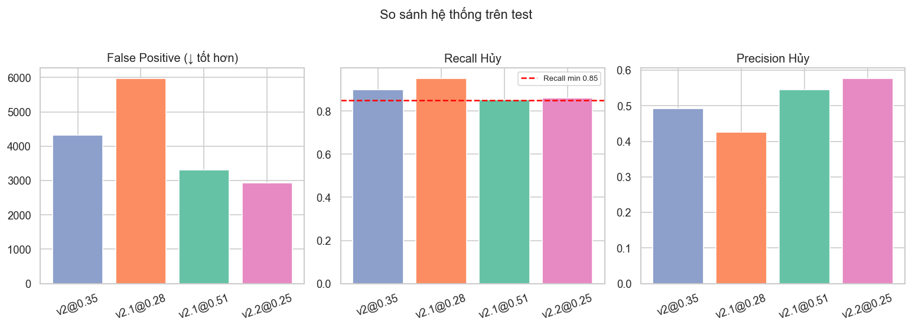
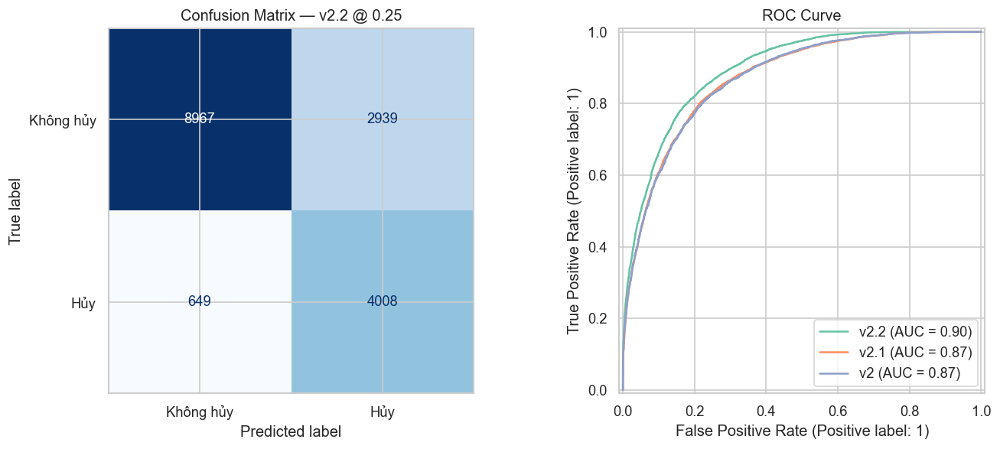
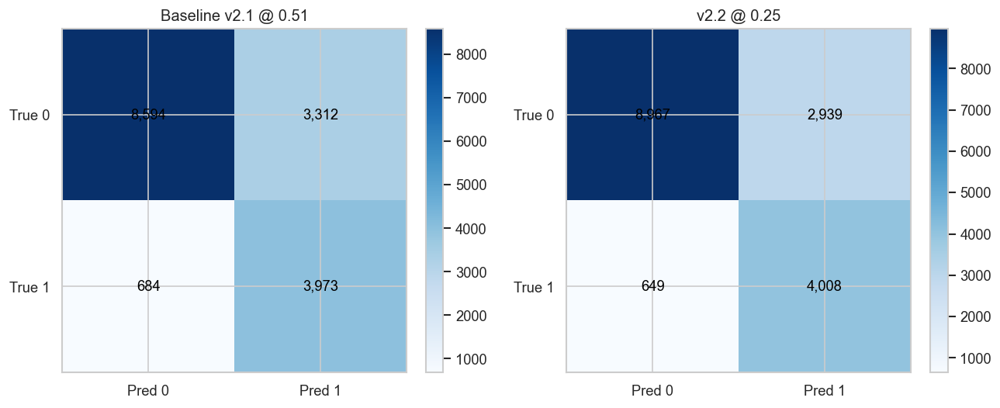
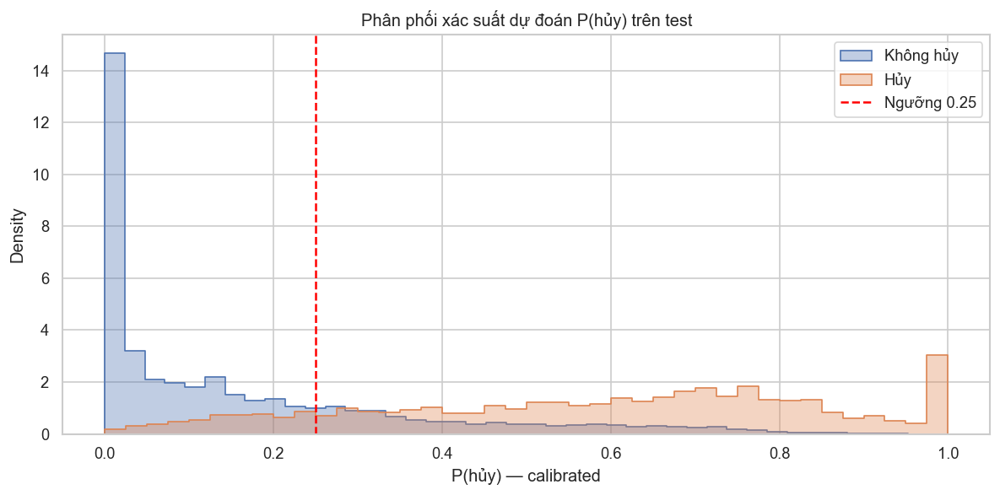
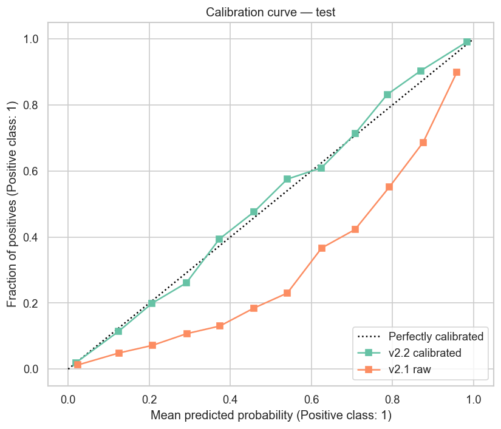
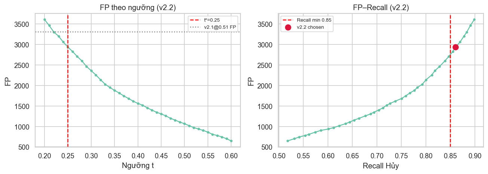
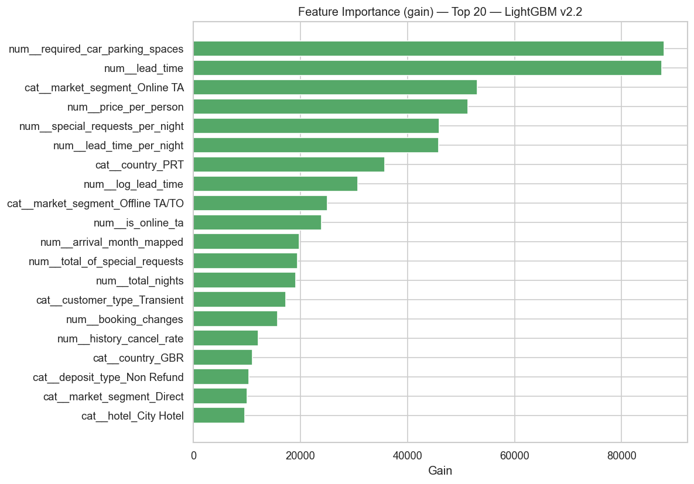
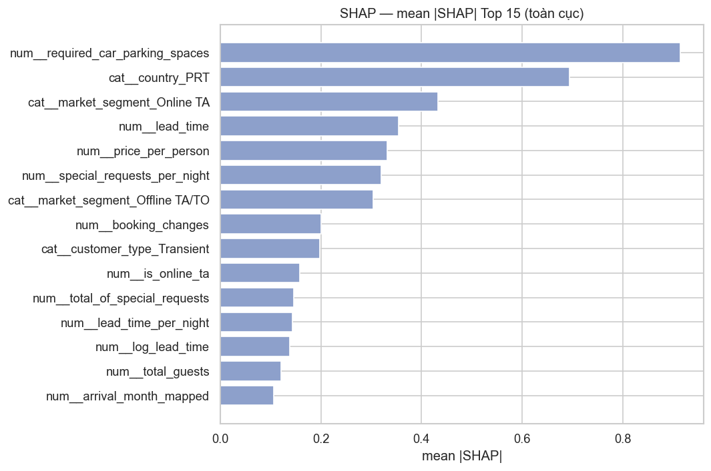
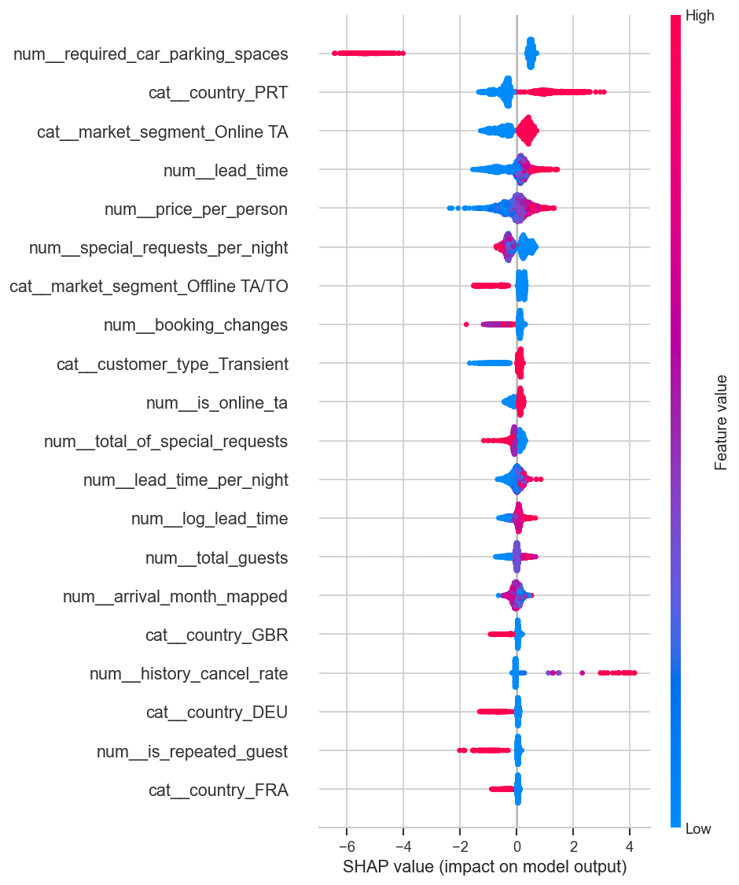
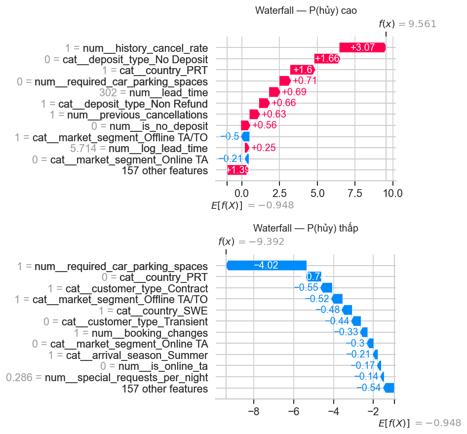

# Cancellation Model v2.2 — kết quả thí nghiệm

> **Thesis:** FE booking-time + LightGBM (warm-start v2.1) + isotonic calibration + ngưỡng tối ưu (Recall ≥ 0.85).  
> **Data:** `hotel_bookings_v5.csv` · split 80/20 seed=42 · threshold chọn trên 15% train-val.  
> **Hình:** `./figures/09_v2_2/chart_01.png` … `chart_10.png`

## 1. So sánh chính (test)

| System | t | ROC-AUC | Recall | Precision | FP | FN |
|--------|--:|--------:|-------:|----------:|---:|---:|
| v2 @ 0.35 | 0.35 | 0.8712 | 0.8993 | 0.4917 | 4330 | 469 |
| v2.1 @ 0.28 | 0.28 | 0.8720 | 0.9517 | 0.4258 | 5976 | 225 |
| v2.1 @ 0.51 | 0.51 | 0.8720 | 0.8531 | 0.5454 | 3312 | 684 |
| **v2.2 calibrated** | **0.25** | **0.8957** | **0.8606** | **0.5769** | **2939** | **649** |

ΔFP vs v2.1@0.28: -3037 (-50.8%)  
ΔFP vs v2.1@0.51: -373 (-11.3%)

## 2. Confusion Matrix & ROC

AUC v2.2 = 0.896. Ma trận @ ngưỡng 0.25: TP=4,008, FP=2,939, FN=649, TN=8,967.

## 3. Phân phối P(hủy) trên test

| Nhãn thực tế | n | Mean P(hủy) | Median P(hủy) | Std |
|--------------|--:|------------:|--------------:|----:|
| Không hủy | 11,906 | 0.161 | 0.084 | 0.198 |
| Hủy | 4,657 | **0.581** | **0.614** | 0.259 |

## 4. Calibration & đường FP–Recall

## 5. Feature importance (gain)

## 6. SHAP

## 7. CV (train)

| Model | CV ROC-AUC |
|-------|-----------:|
| v2.1 | 0.8660 |
| v2.2 | 0.8896 |

## 8. Ablation

Xem `models/Cancellation Predict Model v2/artifacts/v2_2_ablation.csv`.

## 9. Thống kê (v2.2 vs v2.1@0.51)

- McNemar p=7.818e-25 (n01=995, n10=587)
- Bootstrap ΔAUC (v2.2 − v2.1): mean=0.0238, 95% CI [0.0212, 0.0262]
- Two-proportion FPR p=3.938e-08

## 10. Quyết định (ab-test style)

**SHIP_CANDIDATE**

## 11. Artifact & hình

| Đường dẫn | Nội dung |
|-----------|----------|
| `artifacts/best_params_v2_2.json` | Params + threshold |
| `artifacts/threshold_policy_v2_2.json` | Policy quyết định |
| `artifacts/v2_2_comparison.csv` | Bảng so sánh |
| `artifacts/v2_2_stats.json` | McNemar / bootstrap |
| `reports/figures/09_v2_2/` | chart_01 … chart_10 |
