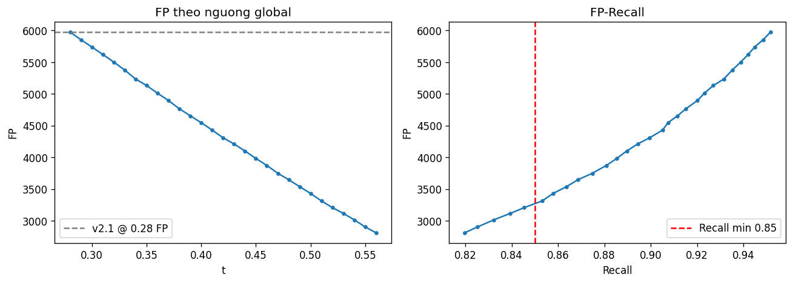
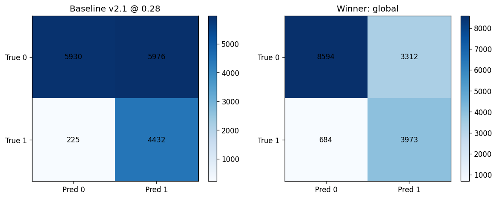

# Giảm False Positive — LightGBM v2.1 (ngưỡng / dual-score)

> **Mục tiêu:** giảm FP so baseline v2.1 @ 0,28, **giữ Recall Hủy ≥ 0,85**.  
> **Phạm vi:** không retrain Optuna / không thêm feature — chỉ đổi **luật quyết định** trên `P(hủy)`.  
> **Dữ liệu:** `hotel_bookings_v5.csv` · test 16.563 booking (`test_size=0.2`, `random_state=42`, stratify).  
> **Notebook:** `models/Cancellation Predict Model v2/09_fp_reduction_threshold_dual_score.ipynb`  
> **Artifact:** `models/Cancellation Predict Model v2/artifacts/fp_reduction_policy_v2_1.json`

---

## 1. Tóm tắt quyết định

| Hạng mục | Giá trị |
|----------|---------|
| **Policy thắng** | **Global threshold `t = 0,51`** trên `p_v21` |
| **Rule type** | `global` |
| **Ràng buộc** | Recall Hủy ≥ 0,85 |
| **FP** | **3.312** (baseline v2.1 @ 0,28: **5.976**) |
| **Δ FP** | **−2.664 (−44,6%)** |
| **Recall Hủy** | **0,853** (baseline 0,952) |
| **Precision Hủy** | **0,545** (baseline 0,426) |
| **FN** | 684 (baseline 225) |

**Kết luận:** Với ràng buộc Recall ≥ 0,85, luật đơn giản nhất (nâng ngưỡng v2.1 lên 0,51) giảm FP mạnh nhất — dual-score và ngưỡng theo segment **không** thắng thêm trên test.

---

## 2. Baseline

| Cấu hình | FP | FN | Recall Hủy | Precision Hủy | F1 Hủy | Accuracy | ROC-AUC |
|----------|---:|---:|-----------:|--------------:|-------:|---------:|--------:|
| **v2.1 @ 0,28** (inventory) | 5.976 | 225 | 0,952 | 0,426 | 0,588 | 0,626 | 0,872 |
| **v2 @ 0,35** (scoring) | 4.330 | 469 | 0,899 | 0,492 | 0,636 | 0,710 | 0,871 |

---

## 3. Ba luật đã quét

Tiêu chí chọn trong mỗi luật (và giữa các luật): **min FP → max Precision → max Recall**, với `recall_cancel ≥ 0,85`.

| Luật | Best config | FP | FN | Recall | Precision | F1 |
|------|-------------|---:|---:|-------:|----------:|---:|
| **A — Global** | `t = 0,51` | **3.312** | 684 | 0,853 | **0,545** | **0,665** |
| **B — Dual AND** | `t21 = 0,50`, `t2 = 0,38` | 3.338 | 687 | 0,852 | 0,543 | 0,664 |
| **C — Segment** | Online TA `0,52` / khác `0,48` | 3.326 | 687 | 0,852 | 0,544 | 0,664 |

**Winner:** Luật A — `global_t=0.51`.

Dual AND và segment gần như ngang A nhưng FP cao hơn nhẹ → không được promote.

---

## 4. So sánh baseline vs policy thắng

| Metric | v2.1 @ 0,28 | **Policy @ 0,51** | Δ |
|--------|------------:|------------------:|---|
| FP | 5.976 | **3.312** | −2.664 |
| FN | 225 | 684 | +459 |
| Recall Hủy | 0,952 | 0,853 | −0,099 |
| Precision Hủy | 0,426 | 0,545 | +0,119 |
| F1 Hủy | 0,588 | 0,665 | +0,077 |
| Accuracy | 0,626 | 0,759 | +0,133 |
| ROC-AUC | 0,872 | 0,872 | (không đổi — cùng model) |





---

## 5. Hướng dẫn vận hành

| Mục tiêu vận hành | Cấu hình | Khi nào dùng |
|-------------------|----------|--------------|
| **Không bỏ sót hủy** (inventory / overbooking) | v2.1 @ **0,28** | Hold phòng, buffer pool — chấp nhận nhiều FP |
| **Giảm cảnh báo giả** (Recall ≥ 0,85) | v2.1 @ **0,51** (`fp_reduction_policy_v2_1.json`) | Cảnh báo RM / yêu cầu xác nhận — ít spam hơn |
| **Scoring cân bằng** | v2 @ **0,35** | Xếp hạng rủi ro toàn bộ booking |

**Quy tắc:** không thay thế mode inventory bằng policy giảm FP. Hai mode song song theo chi phí FP vs FN.

Luật suy luận:

```text
y_pred = 1  nếu  P_v2.1(hủy) >= 0.51
```

---

## 6. Artifact

```json
{
  "policy_name": "global_t=0.51",
  "rule_type": "global",
  "thresholds": { "t": 0.51 },
  "constraint": { "min_recall_cancel": 0.85 }
}
```

File đầy đủ (kèm baselines + best_per_rule):  
`models/Cancellation Predict Model v2/artifacts/fp_reduction_policy_v2_1.json`

---

## 7. Tài liệu liên quan

| Tài liệu | Nội dung |
|----------|----------|
| [09_cancellation_model_v2_1.md](09_cancellation_model_v2_1.md) | LightGBM v2.1 (baseline @ 0,28) |
| [09_cancellation_model_v2.md](09_cancellation_model_v2.md) | LightGBM v2 (@ 0,35) |
| [13_cancellation_model_version_selection.md](13_cancellation_model_version_selection.md) | Ma trận chọn phiên bản (+ kịch bản E) |
| [16_overbooking_policy.md](16_overbooking_policy.md) | Playbook overbooking (vẫn ưu tiên Recall cao) |
