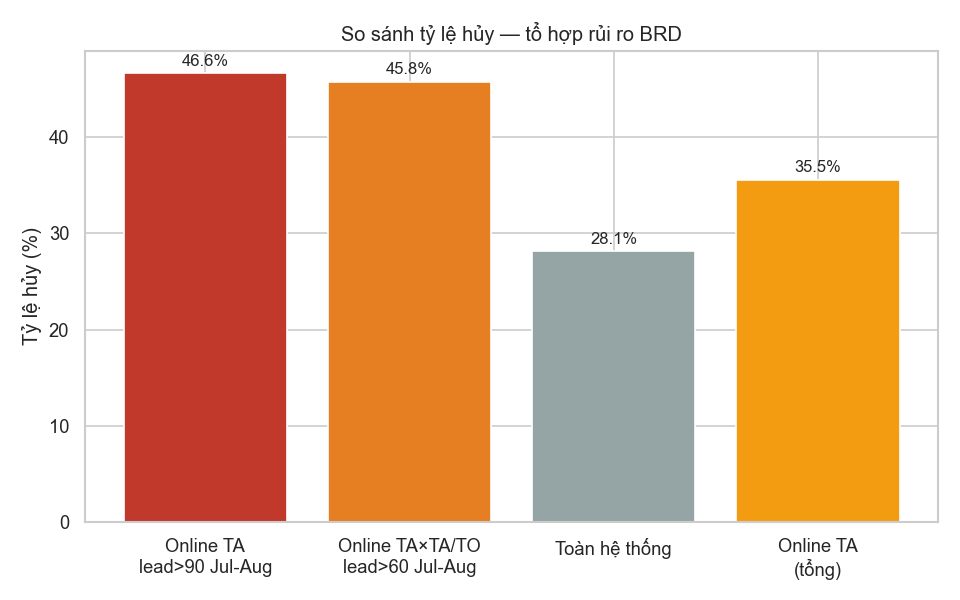
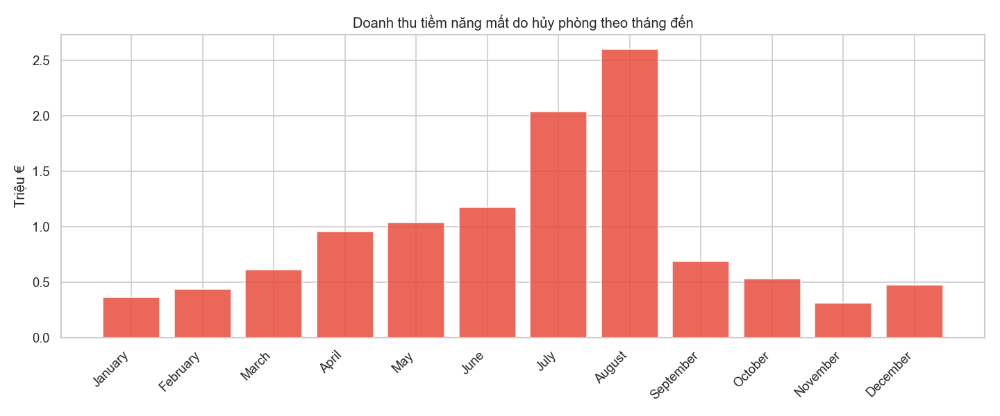
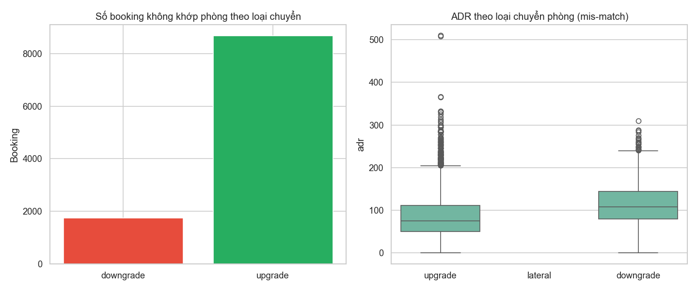
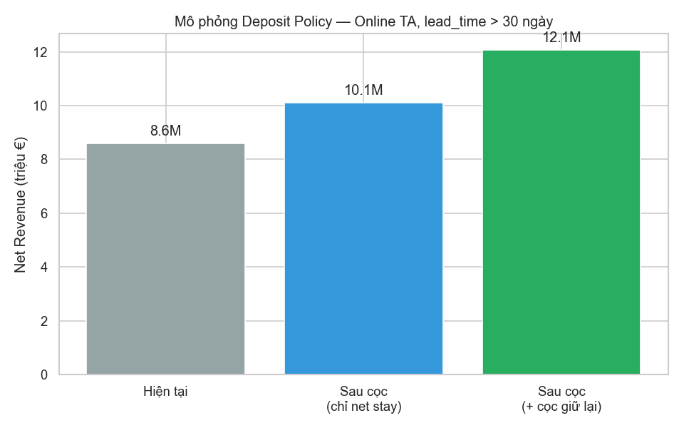

# BRD Gap Analysis — 4 hạng mục ưu tiên

> **Notebook:** `notebooks/12_brd_gap_analysis.ipynb` | **Tạo lúc:** 08/07/2026 19:15

## 1. Interaction 3 chiều

| Chỉ số | Giá trị |
|--------|--------:|
| Số booking | 7.168 |
| Tỷ lệ hủy | **46,64%** |
| Doanh thu mất | 2.545.221 € |
| % tổng mất | **22,63%** |

**BR-REV-02** (Online TA×TA/TO, lead>60, Jul–Aug): 8.574 booking, hủy 45,77%

## 2. Revenue Loss

| Chỉ số | Giá trị |
|--------|--------:|
| Tổng doanh thu mất | **11.245.770 €** |
| Tỷ lệ mất / tiềm năng | **33,74%** |
| Mean mất/đêm Jul–Aug | **155,21 €** |

## 3. Room Mis-match (median ADR)

| Mã | Rank | Median ADR | Booking |
|----|-----:|-----------|--------:|
| I | 1 | 79,21 € | 0 |
| B | 2 | 87,00 € | 623 |
| A | 3 | 89,00 € | 37.566 |
| K | 4 | 99,00 € | 0 |
| E | 5 | 111,59 € | 4.204 |
| D | 6 | 117,50 € | 11.614 |
| L | 7 | 150,00 € | 3 |
| C | 8 | 160,00 € | 591 |
| F | 9 | 171,45 € | 1.888 |
| H | 10 | 175,00 € | 347 |
| G | 11 | 177,90 € | 1.230 |

| Tỷ lệ mis-match | 17,95% |
| Upgrade | 8.677 (83,24%) |
| Downgrade | 1.747 |
| Free upgrade (B/A) | **7.812** (74,94%) |

## 4. Deposit Simulation

| Δ Net Revenue | 1.523.695 € (17,7%) |
| + cọc giữ lại | 3.482.549 € |

