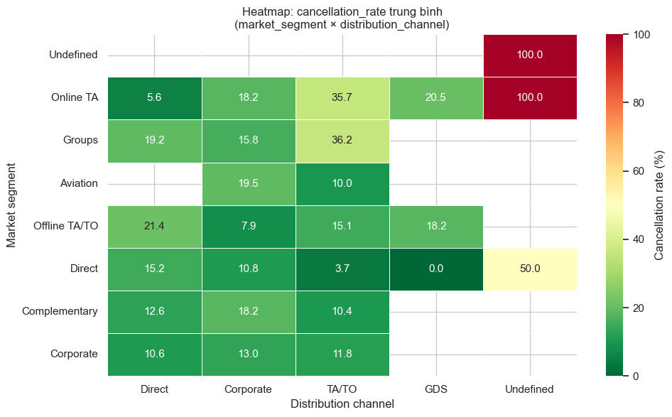
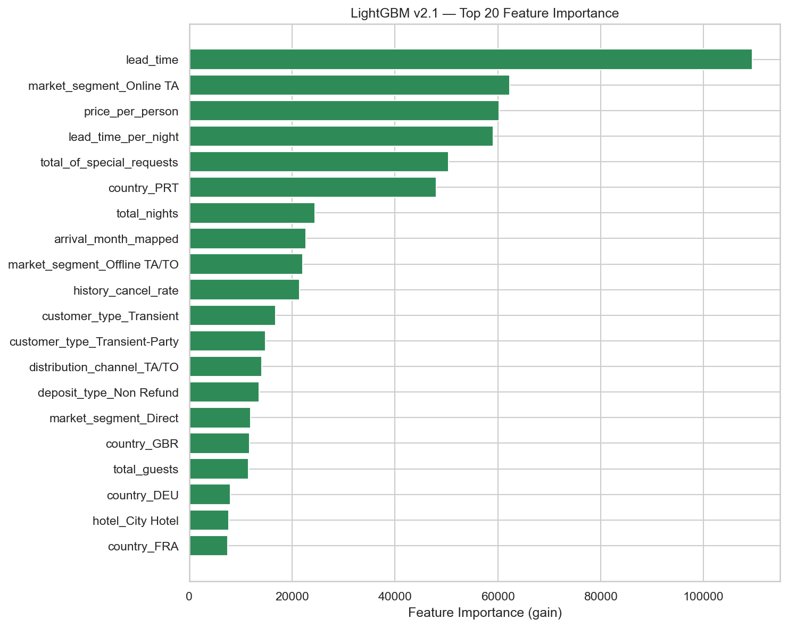
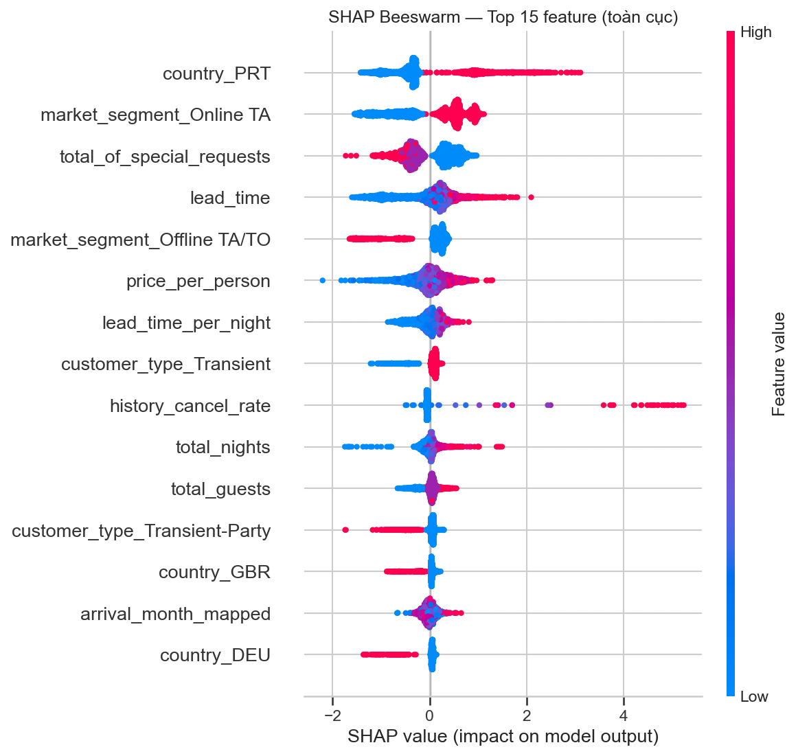
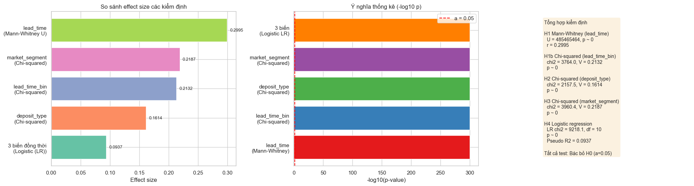
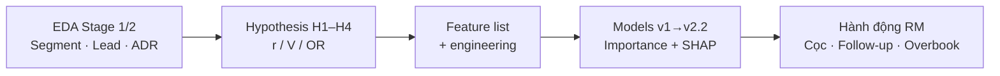

# Key Findings sau tất cả mô hình dự đoán hủy phòng

> **Loại:** Tổng hợp executive — Segment cancellation · Feature importance · Insight EDA & Hypothesis  
> **Dữ liệu:** `hotel_bookings_v5.csv` · **82.811** booking · tỷ lệ hủy **28,12%**  
> **Phạm vi mô hình:** RF **v1 → v1.1 → v1.2** · LightGBM **v2 → v2.1 → v2.2**  
> **Nguồn chính:** `02`/`03` EDA · `04` Correlation · `05` Hypothesis · `06`–`09`/`09_1`/`09` v2.2 Model · `12` BRD Gap · `13` Version selection  
> **Cập nhật:** 19/07/2026

---

## 1. Thông điệp điều hành

Qua năm phiên bản mô hình, dự án **hội tụ cùng một bộ driver hủy** đã lộ diện từ EDA và được kiểm định giả thuyết xác nhận:

1. **Lead time dài** — đặc biệt sau **30 ngày**, đỉnh ở **> 180 ngày**.
2. **Online TA / TA/TO** — volume lớn nhất và rủi ro cao hơn rõ so Offline/Direct/Corporate.
3. **Thiếu cam kết** — No Deposit quy mô hệ thống; `special_requests = 0`; giá/người thấp (theo SHAP).
4. **Quốc gia / lịch sử** — `country_PRT` và `history_cancel_rate` / `previous_cancellations` là tín hiệu mạnh.
5. **Mùa cao điểm + lead dài + Online TA** = hotspot doanh thu mất (BRD Gap).

**Hiệu năng mô hình (tóm tắt):** RF v1 AUC **0,73** → v1.2 **0,84** → LightGBM v2 **0,871** → v2.1 AUC **0,872** với Recall **0,952** (ít bỏ sót hủy nhất) → **v2.2 AUC 0,896** với Precision **0,577** / FP **2.939** khi Recall ≥ 0,85 (chế độ giảm false alarm tốt nhất).

| Mục tiêu vận hành | Bản khuyến nghị | Lý do |
|---|---|---|
| Scoring / giảm FP (Recall ≥ 0,85) | **LightGBM v2.2** @ 0,25 | AUC 0,896 · Precision 0,577 · FP 2.939 |
| Inventory protection / overbooking | **LightGBM v2.1** @ 0,28 | Recall 0,952 · FN thấp nhất |
| Fallback pipeline cũ (không FE v2.2) | **LightGBM v2** @ 0,35 | AUC 0,871 · Precision 0,49 |
| Baseline dễ giải thích (Gini) | **RF v1.2** @ 0,35 | AUC 0,840 · SHAP đầy đủ |

> Chi tiết chọn bản: [`13_cancellation_model_version_selection.md`](13_cancellation_model_version_selection.md).

---

## 2. Tiến hóa mô hình — metrics tổng hợp

| Phiên bản | Thuật toán | # Feature | Ngưỡng | ROC-AUC | Recall Hủy | Precision Hủy | F1 Hủy | Accuracy | FN / FP (test) |
|---|---|---:|---:|---:|---:|---:|---:|---:|---|
| **v1** | Random Forest | 6 cat | 0,50 | 0,734 | 0,85 | 0,39 | 0,54 | 0,59 | 714 / 6.055 |
| **v1.1** | Random Forest | 9 | 0,35 | 0,831 | 0,94 | 0,41 | ~0,57 | ~0,60 | 273 / 6.354 |
| **v1.2** | RF + SHAP | 16 | 0,35 | 0,840 | 0,94 | 0,42 | 0,58 | 0,62 | 289 / 6.013 |
| **v2** | LightGBM + SHAP | 16 | 0,35 | 0,871 | 0,90 | 0,49 | 0,64 | 0,71 | 469 / 4.329 |
| **v2.1** | LightGBM + SHAP | 17 | **0,28** | 0,872 | **0,952** | 0,43 | 0,59 | 0,63 | **~225** / ~5.980 |
| v2.1 giảm FP | LightGBM (cùng model) | 17 | 0,51 | 0,872 | 0,853 | 0,545 | 0,665 | 0,759 | 684 / 3.312 |
| **v2.2** | LightGBM + FE + cal. | **~27** | **0,25** | **0,896** | 0,861 | **0,577** | **~0,69** | **~0,78** | 649 / **2.939** |

### Bài học theo từng bước

| Bước | Thay đổi chính | Kết quả |
|---|---|---|
| v1 → v1.1 | Thêm `lead_time`, `special_requests`, `previous_cancellations` | AUC **+0,10**; `lead_time` lên #1 |
| v1.1 → v1.2 | 9 biến engineered (giá, đêm, lịch sử, tháng…) | AUC +0,009; SHAP giải thích được hướng tác động |
| v1.2 → v2 | Đổi LightGBM + Optuna | AUC +0,031; Precision +7 pp; FP giảm mạnh |
| v2 → v2.1 | `scale_pos_weight` ×1,5 · ngưỡng 0,28 · `arrival_season` | Recall +5,3 pp; FN giảm ~50%; trade-off Precision |
| v2.1 → **v2.2** | FE booking-time mới · isotonic calibration · ngưỡng train-val | AUC **+0,024** · FP −11% vs @0,51 · Rec vẫn ≥ 0,85 |

**Đọc nghiệp vụ:** Không có “một metric thắng tất cả”. AUC cao không đủ nếu FN đắt; Recall cao không đủ nếu FP đắt. Chọn ngưỡng / bản theo chi phí sai lầm.

---

## 3. Segment cancellation — key findings

### 3.1 Bức tranh tổng thể (EDA Stage 1)

| Chỉ số | Giá trị | Ý nghĩa |
|---|---:|---|
| Tỷ lệ hủy toàn hệ thống | **28,12%** | ~1/3 demand không materialize |
| No Deposit | **98,7%** booking | Rủi ro mang tính **hệ thống** |
| Kênh TA/TO | **79,6%** volume · hủy **31,5%** | Kênh chính + rủi ro cao hơn Direct/Corporate |



### 3.2 Theo market segment

| Segment | n | Tỷ lệ hủy | Vai trò trong mô hình |
|---|---:|---:|---|
| **Online TA** | 50.391 | **35,5%** | Top feature mọi bản (Gini/Gain/SHAP) |
| Groups | 3.690 | 31,2% | Rủi ro cao; ADR thấp → double penalty |
| Offline TA/TO | 12.860 | 15,1% | SHAP thường **giảm** rủi ro so Online |
| Direct | 11.351 | 14,9% | Baseline ổn định hơn |
| **Corporate** | 3.678 | **12,8%** | Thấp nhất trong nhóm volume đủ lớn |

**Insight:** Cùng kênh TA/TO, **Online 35,7%** vs **Offline 15,1%** → rủi ro do **segment**, không chỉ do channel.

### 3.3 Theo lead time (khớp H1 / H1b)

| Bin | n | Tỷ lệ hủy |
|---|---:|---:|
| 0–30 ngày | 33.039 | **16,8%** |
| 31–60 | 12.776 | 32,2% |
| 61–90 | 8.967 | 33,2% |
| 91–180 | 17.355 | 35,6% |
| >180 | 10.674 | **41,7%** |

- Median: **Không hủy 37 ngày** vs **Hủy 79 ngày**.
- Bước nhảy lớn nhất: **0–30 → 31–60** (+15,4 pp) — ngưỡng vận hành quan trọng nhất.

### 3.4 Theo deposit, channel, country, tín hiệu khác

| Chiều | Pattern chính |
|---|---|
| **Deposit** | No Deposit 27,3% (khối lượng lớn); Non Refund **95,0%** (n=963 — association mạnh nhưng **cẩn trọng nhân quả**) |
| **Channel** | TA/TO 31,5% · Direct 15,1% · Corporate 13,6% |
| **Country** | PRT **36,8%**; GBR/FRA ~19–20% — khớp `country_PRT` top SHAP |
| **Special requests** | 0 → 34,3%; 3+ → 16,4% — nhiều request = tín hiệu “sẽ đến” |
| **Previous cancellations** | =1 → **76,4%** hủy (n=1.303) — nguồn của `history_cancel_rate` |
| **Customer type** | Transient 30,4% vs Group 10,6% |
| **Hotel** | City 30,7% vs Resort 24,1% |

### 3.5 Hotspot đa chiều (BRD Gap) — nơi mô hình và doanh thu gặp nhau


| Tổ hợp | n | Tỷ lệ hủy | % doanh thu mất |
|---|---:|---:|---:|
| Online TA + lead > 90 + Jul–Aug | 7.168 | **46,64%** | **22,63%** |
| Online TA × TA/TO + lead > 60 + Jul–Aug | 8.574 | **45,77%** | **26,24%** |
| Toàn hệ thống | 82.811 | 28,12% | 100% |

**Kết luận segment:** ~9% booking (tổ hợp 3 chiều) gánh **>22%** doanh thu mất — đúng định nghĩa hotspot. Mô hình v2/v2.1/v2.2 ưu tiên đúng các trục này (`lead_time`, Online TA, mùa/`arrival_month`); v2.2 còn làm nổi `required_car_parking_spaces` và `special_requests_per_night`.

---

## 4. Feature importance — xuyên suốt các phiên bản

### 4.1 Bộ tín hiệu “ổn định” (xuất hiện gần như mọi bản)

| Nhóm | Feature / tín hiệu | Hướng điển hình (SHAP / rate) |
|---|---|---|
| Thời gian | `lead_time`, `lead_time_per_night` | Cao → **tăng** hủy |
| Segment / kênh | Online TA, Offline TA/TO, TA/TO | Online ↑ · Offline/Direct ↓ |
| Quốc gia | `country_PRT` | PRT ↑ · GBR/DEU thường ↓ |
| Cam kết | `total_of_special_requests`, deposit | Nhiều request ↓ · Non Refund ↑↑ (cẩn trọng) |
| Engineered | `price_per_person`, `history_cancel_rate`, `total_nights` | Giá thấp / lịch sử hủy cao → rủi ro ↑ (theo SHAP v2/v2.1) |
| Lịch | `arrival_month_mapped`, `arrival_season` (v2.1+) | Bổ sung mùa; không thay lead_time |
| Cam kết chỗ đậu / request (v2.2) | `required_car_parking_spaces`, `special_requests_per_night` | Parking / nhiều request → thường **giảm** hủy (SHAP) |

### 4.2 Top importance theo phiên bản

#### RF v1 — Gini (6 biến phân loại)

| # | Biến | Importance |
|---:|---|---:|
| 1 | `market_segment` | 0,354 |
| 2 | `country` | 0,258 |
| 3 | `customer_type` | 0,132 |
| 4 | `distribution_channel` | 0,131 |
| 5 | `deposit_type` | 0,099 |
| 6 | `hotel` | 0,027 |

#### RF v1.1 — Gini top (sau khi thêm biến số)

1. **`lead_time`** (0,211)  
2. `market_segment_Online TA`  
3. `country_PRT`  
4. `total_of_special_requests`  
5. `market_segment_Offline TA/TO`  

→ Khớp ngay với H1 (lead_time) và H3 (segment).

#### RF v1.2 — Gini + SHAP engineered

**Gini top:** `lead_time` → PRT → Online TA → **`lead_time_per_night`** → special_requests → Offline → Transient → **`history_cancel_rate`** → TA/TO → **`price_per_person`**

**SHAP engineered mạnh:** `lead_time_per_night`, `price_per_person`, `total_nights`, `history_cancel_rate`, `total_guests`.

#### LightGBM v2 — Gain + SHAP

**Gain top:** `lead_time` → PRT → Online TA → special_requests → **`price_per_person`** → `lead_time_per_night` → `arrival_month_mapped` → `history_cancel_rate` → Transient → `total_nights`

**SHAP engineered #1:** `price_per_person` (mean \|SHAP\| ~0,24) — tín hiệu tài chính nổi lên khi dùng gradient boosting.

#### LightGBM v2.1 — Gain + SHAP (bản mới nhất)



**Gain top:** `lead_time` → Online TA → `price_per_person` → `lead_time_per_night` → special_requests → PRT → `total_nights` → `arrival_month_mapped` → Offline TA/TO → `history_cancel_rate`



**SHAP toàn cục (hướng):**

| Feature | Hướng đọc beeswarm |
|---|---|
| `country_PRT` = 1 | Tăng hủy |
| `market_segment_Online TA` = 1 | Tăng hủy |
| `total_of_special_requests` cao | **Giảm** hủy |
| `lead_time` / `lead_time_per_night` cao | Tăng hủy |
| `history_cancel_rate` cao | Tăng hủy rất mạnh (đuôi dài) |
| Offline TA/TO, GBR, DEU | Thường giảm hủy |

`arrival_season`: Summer có mean \|SHAP\| cao nhất trong bốn mùa (~0,046) — vai trò **bổ sung**, không thay month/lead_time.

#### LightGBM v2.2 — Gain + SHAP (bản mới nhất, 07/2026)


**Gain top:** `required_car_parking_spaces` → `lead_time` → Online TA → `price_per_person` → `special_requests_per_night` → `lead_time_per_night` → PRT → `log_lead_time` → Offline TA/TO → `is_online_ta`


**Đọc nhanh SHAP v2.2:** parking spaces và special requests kéo **giảm** P(hủy); PRT / Online TA / lead dài vẫn **tăng** rủi ro — cùng họ driver với v2.1 nhưng ranking tinh chỉnh nhờ FE mới + calibration.

### 4.3 Chuỗi tiến hóa insight feature

```text
v1:     Segment + Country thống trị (thiếu lead_time số)
   ↓
v1.1:   lead_time #1 — khớp hypothesis H1
   ↓
v1.2:   Engineered (lead/night, history, price) vào top — giải thích sâu hơn
   ↓
v2:     LightGBM đẩy price_per_person + month lên; Precision tốt hơn
   ↓
v2.1:   Giữ cùng driver; tối ưu Recall; season bổ sung mùa vụ
   ↓
v2.2:   FE mới (parking, meal, room type, …) + calibration → AUC↑, FP↓ @ Rec≥0.85
```

**Đối chiếu leakage:** Mọi bản **loại** `reservation_status`, `revenue`, `Occupancy_Rate`, `RevPAR` — metric cao ảo nhưng không dùng được production (`04_correlation_analysis_is_canceled.md`).

---

## 5. Insight bổ trợ từ EDA & Hypothesis testing

### 5.1 Hypothesis — xác nhận thống kê các driver của mô hình

| GT | Biến | Effect size | Kết luận | Liên kết mô hình |
|---|---|---:|---|---|
| **H1** | `lead_time` | rank-biserial **r = 0,300** | Bác bỏ H₀ — hủy có lead_time cao hơn | `lead_time` #1 Gain/Gini từ v1.1 |
| **H1b** | `lead_time_bin` | Cramér's **V = 0,213** | Tỷ lệ hủy tăng theo bin 16,8%→41,7% | Ngưỡng 30 / 180 ngày trong vận hành |
| **H2** | `deposit_type` | **V = 0,161** | Có association; Non Refund cực đoan | Có trong feature; **không** diễn giải nhân quả đơn giản |
| **H3** | `market_segment` | **V = 0,219** (cao nhất phân loại) | Online TA vs Corporate tách rõ | Online TA luôn top importance |
| **H4** | 3 biến đồng thời | Pseudo R² **0,094**; LR p≈0 | Còn ý nghĩa khi kiểm soát lẫn nhau | OR(+30 ngày) ≈ **1,16**; Online TA OR > 1 |



**Điểm then chốt:** Với n lớn, mọi p ≈ 0. Ranking thực tế dựa trên **effect size** — và ranking này **khớp** thứ tự feature importance mô hình (lead_time & segment mạnh hơn deposit về mức độ tổng thể; Non Refund mạnh cục bộ nhưng volume nhỏ).

### 5.2 EDA Stage 1 — Cancellation (khớp segment & feature)

Từ [`02_eda_stage1_cancellation_analysis.md`](02_eda_stage1_cancellation_analysis.md) / [`03_summary_eda_key_findings.md`](03_summary_eda_key_findings.md):

1. Rủi ro tăng **monotonic** theo lead_time; ranh giới **30 ngày** quan trọng nhất.  
2. **Online TA × TA/TO** = ô rủi ro lớn nhất (~50k booking, 35,7%).  
3. **Segment quan trọng hơn channel** khi cùng TA/TO.  
4. Ma trận ưu tiên EDA = đúng top feature mô hình: Online TA + lead dài + No Deposit.

### 5.3 EDA Stage 2 — ADR (bổ sung góc doanh thu)

Từ [`03_eda_stage2_adr_analysis.md`](03_eda_stage2_adr_analysis.md):

1. Mean ADR lưu trú ~**106 €**; City cao hơn Resort.  
2. Seasonality mạnh: Jan ~70 € → Aug ~**151 €**.  
3. **Nghịch lý chiến lược:** Online TA vừa **cancel cao** vừa thường gắn ADR/Transient cao → mỗi hủy mùa hè mất ~**130–150 €/đêm**.  
4. Groups: cancel cao + ADR thấp = **double penalty**.

→ Giải thích vì sao hotspot Jul–Aug + Online TA trong BRD Gap và vì sao `arrival_month` / `price_per_person` có mặt trong top SHAP v2/v2.1.

### 5.4 Correlation — cầu nối EDA → modeling

Từ [`04_correlation_analysis_is_canceled.md`](04_correlation_analysis_is_canceled.md):

| Tier | Biến | Vai trò |
|---|---|---|
| Tier 1 | `lead_time` (r≈0,20), `deposit_type` | Ưu tiên cao |
| Tier 2 | `market_segment` (V=0,219), channel, special_requests, previous_cancellations | Đưa vào từ v1/v1.1 |
| Interaction đề xuất | segment × channel, lead_time × deposit | Khớp heatmap EDA & hotspot BRD |
| Cấm leakage | reservation_status, revenue, Occupancy, RevPAR | Đã tuân thủ mọi notebook mô hình |

---

## 6. Bản đồ hội tụ: EDA → Hypothesis → Model → Hành động



| Phát hiện EDA/Hypothesis | Xuất hiện trong model | Hành động gợi ý |
|---|---|---|
| Lead_time > 30 / > 180 | `#1` Gain/Gini; SHAP dương khi cao | Follow-up / xác nhận sớm; hạn chế overbook mù |
| Online TA (× TA/TO) | Top feature mọi bản | Forecast riêng; chính sách cọc tiered |
| Special requests = 0 | Importance cao; SHAP: nhiều request ↓ hủy | Ưu tiên chăm sóc booking 0 request + lead dài |
| Parking / cam kết chỗ đậu | Gain/SHAP #1 ở **v2.2** | Booking có parking → ưu tiên giữ; ít rủi ro hủy |
| PRT / lịch sử hủy | Top SHAP; history đuôi dài | Flag rủi ro tái hủy |
| Mùa hè + ADR cao | Month/season + price_per_person | Bảo vệ inventory Jul–Aug; mô phỏng cọc (BRD) |
| Corporate / Direct / Offline | OR < 1; residual âm | Ưu tiên giữ chỗ ổn định hơn |

### Gợi ý ưu tiên vận hành (tổng hợp)

| Ưu tiên | Hành động | Cơ sở |
|---|---|---|
| **P0** | Giám sát & chính sách riêng **Online TA × lead > 60 × mùa cao điểm** | EDA + BRD hotspot + SHAP |
| **P0** | Dùng **v2.1 @ 0,28** khi cần không bỏ sót hủy; **v2.2 @ 0,25** khi cần ít false alarm (Rec ≥ 0,85) | Version selection (cập nhật 19/07/2026) |
| **P1** | Trigger theo **P(hủy)** + giải thích SHAP (lead, segment, parking, history, price) | Model v2.1 / **v2.2** |
| **P1** | Mô phỏng / mở rộng **cọc có điều kiện** cho Online TA lead dài | BRD deposit simulation |
| **P2** | Phân tích sâu Non Refund (nhãn vs nhân quả) trước khi dùng làm đòn bẩy chính sách | H2 + residual cực đoan |

---

## 7. Hạn chế cần nhớ khi đọc findings

1. **Association ≠ causation** — đặc biệt `deposit_type_Non Refund`.  
2. **n lớn → p ≈ 0** — luôn kèm effect size / importance / SHAP.  
3. **Recall cao ≠ Precision cao** — v2.1 @ 0,28 chấp nhận nhiều FP; v2.2 cân bằng hơn ở Rec ≥ 0,85.  
4. **Pseudo R² logistic ~0,09** — còn nhiều yếu tố ngoài 3 biến H4; mô hình ML đầy đủ bổ sung.  
5. Findings dựa `hotel_bookings_v5` (Portugal hotels, 2015–2017) — ngoại suy thị trường khác cần thận trọng.  
6. **`required_car_parking_spaces` rất mạnh ở v2.2** — hữu ích vận hành nhưng cần kiểm tra ổn định theo khách sạn / chính sách chỗ đậu.

---

## 8. Tài liệu nguồn

| File | Nội dung dùng trong báo cáo này |
|---|---|
| [`02_eda_stage1_cancellation_analysis.md`](02_eda_stage1_cancellation_analysis.md) | Segment, lead_time, deposit, channel |
| [`03_eda_stage2_adr_analysis.md`](03_eda_stage2_adr_analysis.md) | ADR, mùa vụ, nghịch lý Online TA |
| [`03_summary_eda_key_findings.md`](03_summary_eda_key_findings.md) | Executive EDA |
| [`04_correlation_analysis_is_canceled.md`](04_correlation_analysis_is_canceled.md) | Feature tier & leakage |
| [`05_hypothesis_testing_is_canceled.md`](05_hypothesis_testing_is_canceled.md) | H1–H4 effect size |
| [`06_cancellation_model_v1.md`](06_cancellation_model_v1.md) … [`09_cancellation_model_v2_1.md`](09_cancellation_model_v2_1.md) | Metrics & importance từng bản |
| [`09_cancellation_model_v2_2.md`](09_cancellation_model_v2_2.md) | v2.2 metrics, calibration, SHAP, quyết định ship |
| [`09_fp_reduction_v2_1.md`](09_fp_reduction_v2_1.md) | Policy giảm FP cũ (v2.1 @ 0,51) — baseline so với v2.2 |
| [`12_brd_gap_analysis.md`](12_brd_gap_analysis.md) | Hotspot 3 chiều & doanh thu mất |
| [`13_cancellation_model_version_selection.md`](13_cancellation_model_version_selection.md) | Chọn bản theo mục tiêu (đã gồm v2.2) |
| [`../docs/Guide - Cach doc va danh gia mo hinh du doan.md`](../docs/Guide%20-%20Cach%20doc%20va%20danh%20gia%20mo%20hinh%20du%20doan.md) | Cách đọc metric/chart mô hình |
| [`../docs/Guide - Cach doc chi so thong ke.md`](../docs/Guide%20-%20Cach%20doc%20chi%20so%20thong%20ke.md) | Cách đọc kiểm định & visual |

---

*Báo cáo tổng hợp key findings sau chuỗi mô hình dự đoán hủy phòng (v1–v2.2), đối chiếu EDA và hypothesis testing. Cập nhật: 19/07/2026.*
