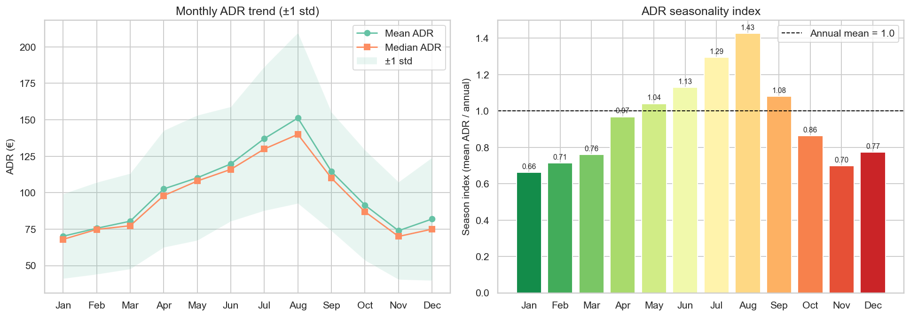
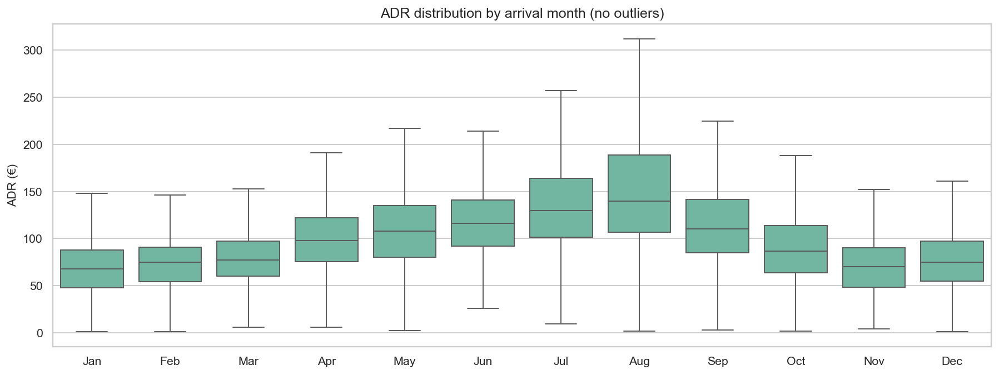
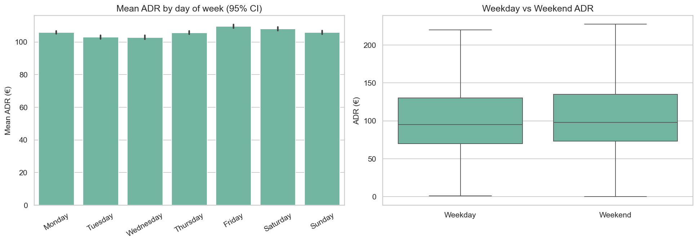
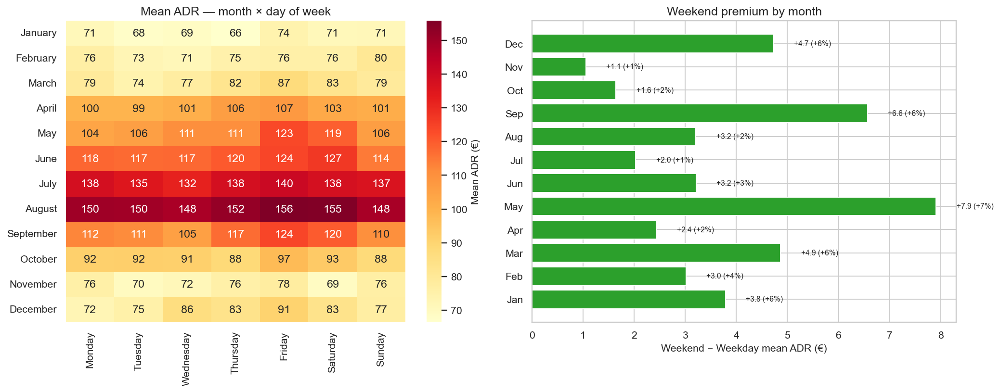
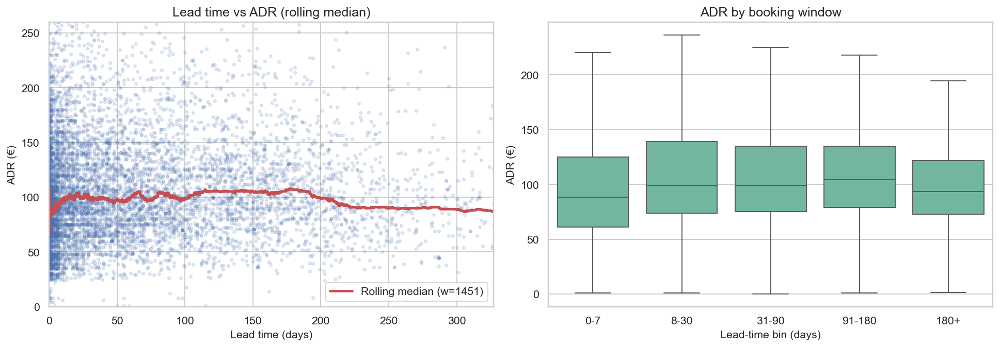
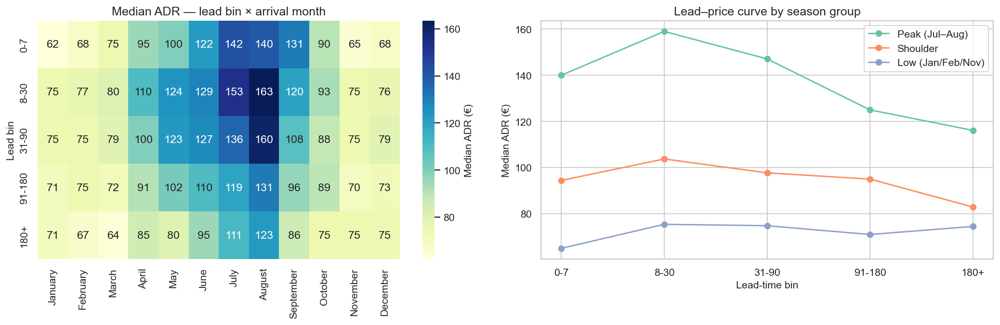
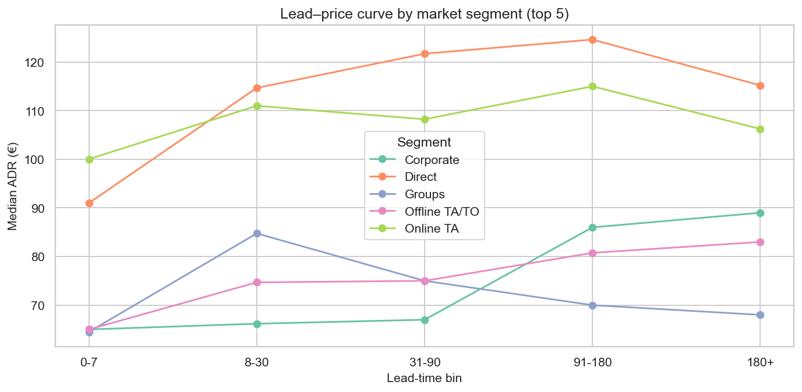
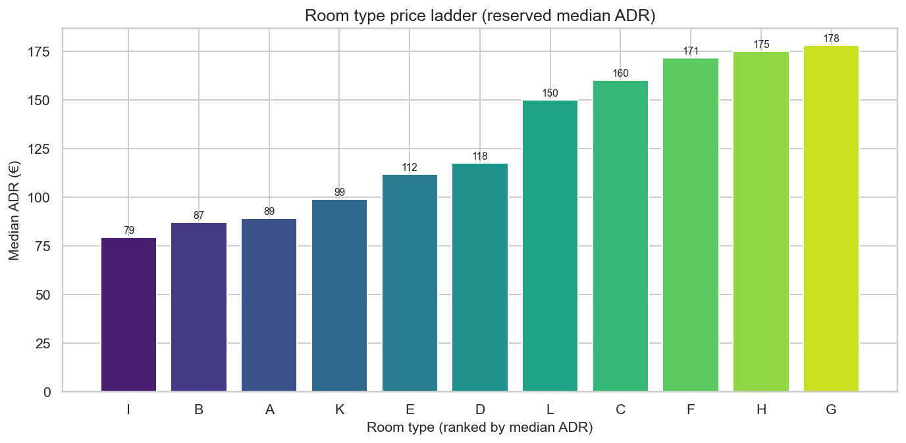
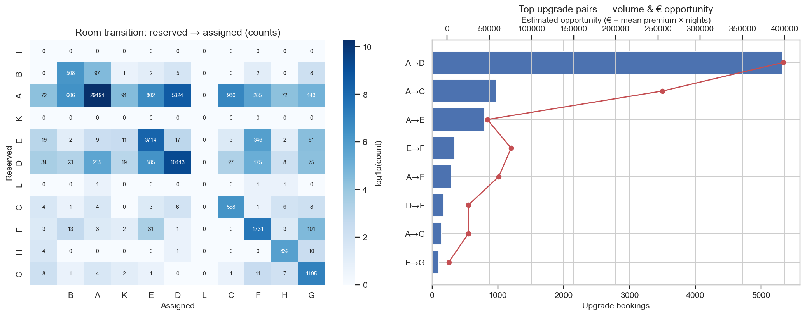
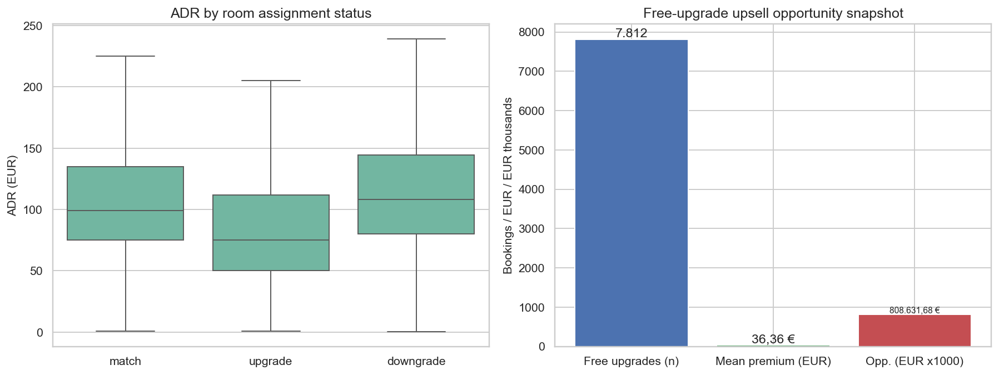

# 17 — ADR Strategy Analysis

> **Nguồn dữ liệu:** `hotel_bookings_v5.csv`  
> **Phạm vi:** 58.066 booking (không hủy, `adr > 0`) / 82.811 booking tổng  
> **Mean ADR:** **105,92 €** · **Median ADR:** **96,60 €** · Weekend share: **42,9%**  
> **Notebook:** [`notebooks/17_adr_strategy_analysis.ipynb`](../notebooks/17_adr_strategy_analysis.ipynb)  
> **Figures:** [`reports/figures/17/`](./figures/17/) · KPI: [`kpi_summary.csv`](./figures/17/kpi_summary.csv)

---

## Mục tiêu

Bổ sung góc **chiến lược pricing / revenue** cho ADR theo ba trụ:

1. **Seasonality** — monthly trend, weekend vs weekday differential  
2. **Lead-time vs ADR** — booking window ảnh hưởng price band  
3. **Room type premium** — `reserved_room_type` vs `assigned_room_type`, upsell opportunity  

**Lưu ý phạm vi:** Chỉ booking hoàn tất (`is_canceled = 0`, `adr > 0`). ADR phản ánh giá tại thời điểm đặt, không phải giá theo phòng được gán thực tế. Upsell opportunity là **ước lượng proxy** (median ladder × nights), không phải cash đã bỏ lỡ kế toán.

Liên kết EDA trước: [`03_eda_stage2_adr_analysis.md`](03_eda_stage2_adr_analysis.md) · Room mis-match BRD: [`12_brd_gap_analysis.md`](12_brd_gap_analysis.md).

---

## 1. Seasonality ADR

### 1.1 Monthly trend

| Tháng | Bookings | Mean ADR | Median ADR | Std | Season index |
|---|---:|---:|---:|---:|---:|
| January | 3.309 | 70,16 € | 68,00 € | 29,02 | 0,66 |
| February | 4.310 | 75,59 € | 74,80 € | 31,50 | 0,71 |
| March | 5.205 | 80,45 € | 77,35 € | 32,77 | 0,76 |
| April | 5.055 | 102,60 € | 98,00 € | 40,05 | 0,97 |
| May | 5.395 | 110,21 € | 108,00 € | 42,89 | 1,04 |
| June | 5.018 | 119,72 € | 116,00 € | 39,24 | 1,13 |
| July | 6.493 | 137,10 € | 130,00 € | 49,36 | 1,29 |
| **August** | **7.220** | **151,19 €** | **140,00 €** | **58,52** | **1,43** |
| September | 4.487 | 114,53 € | 110,00 € | 40,66 | 1,08 |
| October | 4.638 | 91,45 € | 86,95 € | 37,80 | 0,86 |
| November | 3.555 | 73,93 € | 70,00 € | 33,41 | 0,70 |
| December | 3.381 | 81,96 € | 75,00 € | 42,13 | 0,77 |

**Insight**

- Peak **August** (151,19 €) vs low **January** (70,16 €) — spread **~115%**.  
- Season index vượt 1,0 từ **May**; đỉnh Jul–Aug (1,29–1,43).  
- Std rộng nhất ở August (58,52 €) — room lớn cho yield / length-of-stay pricing.  
- **Hàm ý:** rate ladder Apr→Aug; promotion Jan/Nov; bảo vệ inventory Jul–Aug.

### 1.2 Weekend vs weekday

| Nhóm | Bookings | Mean ADR | Median ADR |
|---|---:|---:|---:|
| Weekday (Mon–Thu) | 33.168 | 104,47 € | 95,25 € |
| Weekend (Fri–Sun) | 24.898 | 107,86 € | 98,00 € |

| Ngày | Bookings | Mean ADR | Median ADR |
|---|---:|---:|---:|
| Monday | 9.586 | 105,86 € | 97,00 € |
| Tuesday | 7.610 | 102,99 € | 95,00 € |
| Wednesday | 7.480 | 102,82 € | 94,50 € |
| Thursday | 8.492 | 105,68 € | 96,30 € |
| **Friday** | **8.426** | **109,55 €** | **99,00 €** |
| Saturday | 8.460 | 108,07 € | 98,00 € |
| Sunday | 8.012 | 105,85 € | 97,01 € |

- Weekend − Weekday (mean): **+3,39 € (+3,2%)**; median **+2,75 €**.  
- Mann–Whitney U: **p ≈ 1,01×10⁻¹⁷** — chênh lệch có ý nghĩa thống kê nhưng **biên độ nhỏ** so với seasonality tháng.  
- Friday cao nhất; Tuesday/Wednesday thấp nhất (~6–7 € dưới Friday).

### 1.3 Weekend premium theo tháng

| Tháng | Weekday ADR | Weekend ADR | Δ (€) | Δ (%) |
|---|---:|---:|---:|---:|
| January | 68,53 | 72,32 | +3,79 | +6% |
| February | 74,09 | 77,10 | +3,01 | +4% |
| March | 78,54 | 83,40 | +4,87 | +6% |
| April | 101,45 | 103,89 | +2,44 | +2% |
| **May** | **107,25** | **115,16** | **+7,91** | **+7%** |
| June | 118,39 | 121,60 | +3,21 | +3% |
| July | 136,16 | 138,19 | +2,03 | +1% |
| August | 149,86 | 153,07 | +3,21 | +2% |
| September | 111,82 | 118,39 | +6,57 | +6% |
| October | 90,75 | 92,39 | +1,64 | +2% |
| November | 73,49 | 74,54 | +1,05 | +1% |
| December | 79,94 | 84,67 | +4,73 | +6% |

**Insight**

- Weekend premium **không đều theo tháng**: mạnh nhất **May (+7,91 €)** và **September (+6,57 €)**.  
- Jul–Aug: ADR nền đã rất cao → premium cuối tuần nhỏ hơn về %.  
- **Hàm ý:** surcharge cuối tuần ưu tiên shoulder (May, Sep, Mar); mid-week discount Tue–Wed ở low season.

---

## 2. Lead-time vs ADR

### 2.1 Quan hệ tổng thể & lead bins

| Chỉ số | Giá trị |
|---|---|
| Spearman ρ (lead_time, adr) | **0,090** (p ≈ 2,5×10⁻¹⁰⁴) |
| Pearson r | 0,015 (p ≈ 2,3×10⁻⁴) |

| Lead bin | Bookings | Mean ADR | Median ADR | P25 | P75 |
|---|---:|---:|---:|---:|---:|
| 0–7 | 14.938 | 97,25 € | 88,56 € | 61,20 | 125,00 |
| 8–30 | 11.456 | 109,94 € | 99,00 € | 74,00 | 139,00 |
| 31–90 | 14.466 | 109,36 € | 99,00 € | 75,00 | 135,00 |
| 91–180 | 11.085 | 111,20 € | **104,40 €** | 79,20 | 134,85 |
| 180+ | 6.121 | 101,87 € | 93,73 € | 72,76 | 121,50 |

- Tương quan dương **yếu** (Spearman 0,09): lead dài hơn không đồng nghĩa giá cao tuyến tính.  
- Last-minute (0–7) median **88,56 €** vs early-bird (180+) **93,73 €** — gap **−5,17 €** (last-minute *rẻ hơn* trên median tổng).  
- Band 8–180 ngày giữ median ~99–104 € — “sweet spot” giá ổn định hơn hai cực.

### 2.2 Control theo mùa

Median ADR theo lead bin × season group:

| Lead bin | Low (Jan/Feb/Nov) | Peak (Jul–Aug) | Shoulder |
|---|---:|---:|---:|
| 0–7 | 65,00 € | **140,00 €** | 94,41 € |
| 8–30 | 75,40 € | **159,00 €** | 103,73 € |
| 31–90 | 74,80 € | 147,09 € | 97,71 € |
| 91–180 | 71,00 € | 125,00 € | 95,00 € |
| 180+ | 74,47 € | 116,12 € | 82,92 € |

**Insight**

- Ở **peak**, đặt gần ngày (0–30) có median ADR **cao nhất** (140–159 €) — last-minute peak không “rẻ”.  
- Lead **180+ vào peak** median chỉ 116 € — early-bird peak đang **undercut** so với cửa sổ 8–30.  
- Low season: đường giá phẳng (~65–75 €) — promotion lead dài ít “đốt” margin hơn peak.

### 2.3 Theo market segment (top 5)

| Lead bin | Corporate | Direct | Groups | Offline TA/TO | Online TA |
|---|---:|---:|---:|---:|---:|
| 0–7 | 65,00 | 91,00 | 64,50 | 65,00 | 100,04 |
| 8–30 | 66,18 | 114,68 | 84,75 | 74,68 | 111,00 |
| 31–90 | 67,00 | **121,72** | 75,00 | 75,00 | 108,23 |
| 91–180 | 86,00 | **124,62** | 70,00 | 80,75 | 115,00 |
| 180+ | 89,00 | 115,20 | 68,00 | 83,00 | 106,24 |

**Insight**

- **Direct** giữ ADR cao nhất ở cửa sổ 31–180 ngày.  
- **Online TA** ổn định ~100–115 €; lead dài không giảm mạnh như Groups.  
- **Groups** ADR thấp ở mọi cửa sổ — double penalty khi kết hợp hủy cao (xem EDA / model).  
- **Hàm ý:** bảo vệ BAR last-minute peak; early-bird floor Jul–Aug; hạn chế dump OTA/Groups lead dài; ưu tiên Direct ở 31–180.

---

## 3. Room type premium & upsell

### 3.1 Price ladder (median ADR — không dùng alphabet)

| Room | Median ADR | Rank | Bookings reserved | Premium vs prev |
|---|---:|---:|---:|---:|
| I | 79,21 € | 1 | 0 | — |
| B | 87,00 € | 2 | 623 | +7,79 |
| A | 89,00 € | 3 | 37.566 | +2,00 |
| K | 99,00 € | 4 | 0 | +10,00 |
| E | 111,58 € | 5 | 4.204 | +12,59 |
| D | 117,50 € | 6 | 11.614 | +5,91 |
| L | 150,00 € | 7 | 3 | +32,50 |
| C | 160,00 € | 8 | 591 | +10,00 |
| F | 171,45 € | 9 | 1.888 | +11,45 |
| H | 175,00 € | 10 | 347 | +3,55 |
| G | 177,90 € | 11 | 1.230 | +2,90 |

Thứ tự giá: **I < B < A < K < E < D < L < C < F < H < G** — alphabet `A→B→C…` **không** khớp ladder.

### 3.2 Mis-match & free upgrade

| Chỉ số | Giá trị |
|---|---:|
| Mis-match rate | **17,95%** (10.424 / 58.066) |
| Upgrade | 8.677 (**83,2%** mis-match) |
| Downgrade | 1.747 (16,8%) |
| Free upgrade proxy (reserved **B/A**) | **7.812** (74,9% mis-match) |
| Mean ADR — match | 109,20 € |
| Mean ADR — mis-match | 90,96 € |
| ADR gap (match − mis-match) | **18,24 €** |
| Upsell opportunity ước lượng | **~808.632 €** |
| Sum premium/đêm (free upgrade) | ~284.044 € |

| Status | Bookings | Mean ADR | Median ADR |
|---|---:|---:|---:|
| match | 47.642 | 109,20 € | 99,00 € |
| upgrade | 8.677 | 86,53 € | 75,00 € |
| downgrade | 1.747 | 112,95 € | 108,00 € |

Booking được **free upgrade** thường gắn ADR thấp hơn rõ — đúng profile “trả giá A/B, nhận phòng cao hơn”.

### 3.3 Top upgrade pairs (volume & € opportunity)

| Reserved → Assigned | Bookings | Mean premium (€/đêm) | Nights | Opp. ước lượng (€) |
|---|---:|---:|---:|---:|
| **A → D** | **5.324** | 28,50 | 13.985 | **398.573** |
| A → C | 980 | 71,00 | 3.596 | 255.316 |
| A → E | 802 | 22,59 | 2.111 | 47.677 |
| E → F | 346 | 59,86 | 1.269 | 75.969 |
| A → F | 285 | 82,45 | 744 | 61.343 |
| D → F | 175 | 53,95 | 466 | 25.141 |
| A → G | 143 | 88,90 | 284 | 25.248 |
| F → G | 101 | 6,45 | 308 | 1.987 |

**Insight**

- **A→D** là lever lớn nhất (volume + ~399k € opportunity).  
- **A→C** premium/đêm cao (71 €) dù volume nhỏ hơn — phù hợp paid upsell / guarantee.  
- **Hàm ý:** thay free upgrade bằng paid upsell trên cặp A→D/E/C/F; giữ inventory D/C/F mùa peak; downgrade cần policy bù trừ.

---

## 4. Tổng hợp KPI & hàm ý chiến lược

| Metric | Giá trị |
|---|---:|
| n_stay | 58.066 |
| mean_adr | 105,92 € |
| weekend_premium_eur | +3,39 € (+3,24%) |
| spearman_lead_adr | 0,09 |
| mismatch_rate_pct | 17,95% |
| free_upgrade_bookings | 7.812 |
| upsell_opportunity_eur | ~808.632 € |

### Thông điệp điều hành

1. **Mùa vụ thống trị giá** (Aug vs Jan ~+115%); weekend chỉ +3% — ưu tiên rate calendar tháng trước day-of-week.  
2. **Weekend premium theo tháng**: tập trung May/Sep (+6–8 €), không áp đồng đều Jul–Aug.  
3. **Lead–ADR yếu ở tổng thể**, nhưng **peak**: cửa sổ 8–30 đắt nhất; early-bird 180+ đang rẻ hơn đáng kể — chỉnh early-bird floor.  
4. **Free upgrade A/B** chiếm ~3/4 mis-match; opportunity proxy **~0,81M €** — chuyển sang paid upsell, ưu tiên **A→D**.  
5. **Direct** giữ ADR tốt ở lead 31–180; **Groups** ADR thấp mọi cửa sổ — kết hợp chính sách hủy/cọc.

### Playbook đề xuất

| Lever | Hành động |
|---|---|
| Rate calendar | Tăng mạnh Apr→Aug; promotion Jan/Nov; theo dõi season index |
| Weekend | Surcharge có chọn lọc (May, Sep, Mar); mid-week deal Tue–Wed low season |
| Booking window | Bảo vệ BAR last-minute peak; early-bird floor Jul–Aug; hạn chế dump OTA/Groups lead dài |
| Upsell | Paid upsell / room guarantee trên A→D (và A→C/E/F); giảm free upgrade tự động |
| Inventory | Bảo vệ D/C/F/G cuối tuần shoulder–peak; downgrade có compensation rõ |

---

## 5. Giới hạn & bước tiếp

- Dataset 2015–2017 lệch năm (xem heatmap YoY ở báo cáo `03`) — cẩn trọng khi ngoại suy.  
- Opportunity upsell = proxy median ladder × nights; chưa trừ chi phí vận hành / từ chối upgrade.  
- Chưa tách City vs Resort trong notebook 17 — có thể facet thêm nếu cần playbook theo property.  
- Nên nối với chính sách hủy/cọc ([`15_policy_scenario.md`](15_policy_scenario.md), [`16_overbooking_policy.md`](16_overbooking_policy.md)): booking ADR thấp + free upgrade + lead dài = rủi ro kép.

---

*Báo cáo sinh từ kết quả chạy `notebooks/17_adr_strategy_analysis.ipynb`.*
