# 17b — ADR Strategy Analysis: City vs Resort

> **Nguồn dữ liệu:** `hotel_bookings_v5.csv`  
> **Phạm vi chính:** 58.066 booking stay (`is_canceled = 0`, `adr > 0`) — City **34.274** · Resort **23.792**  
> **Cancel-adjusted:** 81.178 booking `adr > 0` (kể cả hủy)  
> **City:** mean **112,05 €** · median **105,00 €** · weekend share **42,5%**  
> **Resort:** mean **97,09 €** · median **77,50 €** · weekend share **43,5%**  
> **Notebook:** [`notebooks/17b_adr_strategy_analysis_city_resort.ipynb`](../notebooks/17b_adr_strategy_analysis_city_resort.ipynb)  
> **Figures:** [`reports/figures/17b/`](./figures/17b/) · KPI: [`kpi_compare_city_resort.csv`](./figures/17b/kpi_compare_city_resort.csv)  
> **Báo cáo gộp (không tách hotel):** [`17_adr_strategy_analysis.md`](17_adr_strategy_analysis.md)

---

## Mục tiêu

Lặp lại ba trụ chiến lược ADR của notebook **17**, nhưng **tách và so sánh** hai phân khúc property:

1. **Seasonality** — monthly trend, weekend vs weekday  
2. **Lead-time vs ADR** — booking window  
3. **Room type premium** — ladder & upsell  
4. **So sánh chéo** — gap, slope, cancel-adjusted, small multiples theo segment  

**Lưu ý phạm vi:** ADR phản ánh giá tại thời điểm đặt. Upsell opportunity là **proxy** (median ladder × nights). Cancel-adjusted mở rộng sang booking hủy để đọc lệch giá Stay vs Canceled — không phải doanh thu thực thu.

Liên kết: [`17_adr_strategy_analysis.md`](17_adr_strategy_analysis.md) · EDA ADR [`03_eda_stage2_adr_analysis.md`](03_eda_stage2_adr_analysis.md) · Forecast [`18a_demand_forecasting_dynamic_pricing_adr.md`](18a_demand_forecasting_dynamic_pricing_adr.md).

---

## 0. Snapshot phân khúc

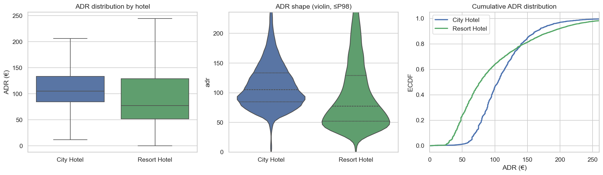

| Hotel | Bookings | Mean ADR | Median ADR | Std (ước) | Weekend share |
|---|---:|---:|---:|---|---:|
| **City Hotel** | 34.274 | **112,05 €** | **105,00 €** | hẹp hơn, đỉnh quanh 100–120 € | 42,5% |
| **Resort Hotel** | 23.792 | **97,09 €** | **77,50 €** | lệch phải mạnh (median << mean) | 43,5% |

- Gap City − Resort: mean **+14,96 €**; median **+27,50 €** (Mann–Whitney p ≈ 0).  
- ECDF: Resort có khối lượng lớn ở band giá thấp; City dịch phải toàn phân bố.

**Phân tích khác biệt & ý nghĩa kinh doanh**

| Khía cạnh | City | Resort | Ý nghĩa KD |
|---|---|---|---|
| Mức giá nền | Cao, ổn định hơn | Thấp hơn trên median, đuôi cao ở peak | Không dùng một BAR / một rate calendar cho cả portfolio |
| Hình dạng ADR | Compact quanh mid-market | Phân cực low-season rẻ vs peak đắt | Resort cần floor thấp mùa thấp + harden mạnh Jul–Aug |
| Weekend share | ~42–43% gần nhau | gần City | Lệch chiến lược không đến từ *tỷ lệ* weekend mà từ *mức premium* (xem mục 1) |

---

## 1. Seasonality ADR

### 1.1 Monthly trend — overlay

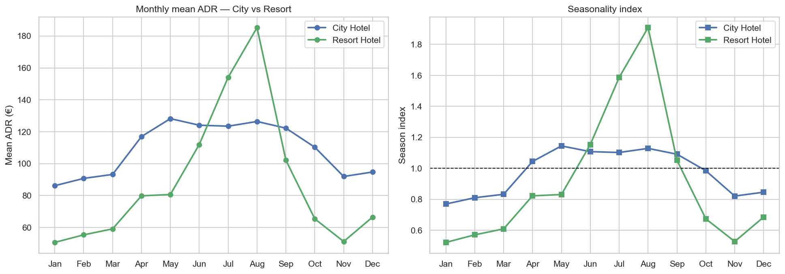

**City Hotel**

| Tháng | Bookings | Mean ADR | Median | Season index |
|---|---:|---:|---:|---:|
| January | 1.818 | 86,18 € | 81,41 € | 0,77 |
| February | 2.463 | 90,75 € | 86,00 € | 0,81 |
| March | 3.255 | 93,23 € | 88,20 € | 0,83 |
| April | 3.100 | 116,96 € | 110,00 € | 1,04 |
| **May** | **3.354** | **128,21 €** | **125,10 €** | **1,14** |
| June | 3.206 | 124,08 € | 119,85 € | 1,11 |
| July | 3.599 | 123,46 € | 116,95 € | 1,10 |
| August | 4.181 | 126,42 € | 120,70 € | 1,13 |
| September | 2.772 | 122,23 € | 116,54 € | 1,09 |
| October | 2.693 | 110,27 € | 105,90 € | 0,98 |
| November | 1.984 | 91,94 € | 85,75 € | 0,82 |
| December | 1.849 | 94,76 € | 88,00 € | 0,85 |

Peak **May** · Low **January** · Spread mean **~49%**.

**Resort Hotel**

| Tháng | Bookings | Mean ADR | Median | Season index |
|---|---:|---:|---:|---:|
| January | 1.491 | 50,63 € | 47,00 € | 0,52 |
| February | 1.847 | 55,37 € | 50,00 € | 0,57 |
| March | 1.950 | 59,11 € | 55,80 € | 0,61 |
| April | 1.955 | 79,83 € | 75,00 € | 0,82 |
| May | 2.041 | 80,64 € | 74,76 € | 0,83 |
| June | 1.812 | 111,99 € | 105,80 € | 1,15 |
| July | 2.894 | 154,07 € | 149,00 € | 1,59 |
| **August** | **3.039** | **185,26 €** | **183,20 €** | **1,91** |
| September | 1.715 | 102,09 € | 92,40 € | 1,05 |
| October | 1.945 | 65,38 € | 60,00 € | 0,67 |
| November | 1.571 | 51,18 € | 48,00 € | 0,53 |
| December | 1.532 | 66,51 € | 54,40 € | 0,68 |

Peak **August** · Low **January** · Spread mean **~266%**.

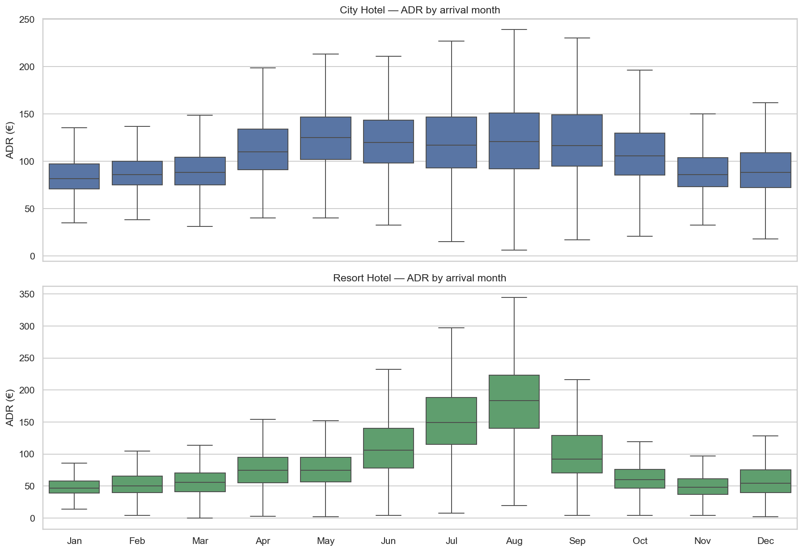

**Phân tích khác biệt & ý nghĩa kinh doanh**

- **City:** đường giá “đô thị / công vụ” — đỉnh sớm (**May**), Jul–Aug không phải đỉnh tuyệt đối; biên độ mùa **vừa phải (~49%)**.  
- **Resort:** seasonality **nghỉ dưỡng kinh điển** — Jul–Aug bùng nổ (index 1,59–1,91), Jan–Mar/Nov rất thấp (index ~0,5–0,6).  
- **Giao thoa:** Jun–Sep hai đường gần nhau hoặc cắt nhau; còn lại City cao hơn rõ.  
- **KD:**  
  - City → rate ladder Apr→Sep, promotion Jan–Mar/Nov, bảo vệ inventory quanh hội nghị / shoulder đô thị.  
  - Resort → harden BAR Jul–Aug mạnh; STIMULATE sâu low season; **không** copy calendar City.

### 1.2 Weekend vs weekday

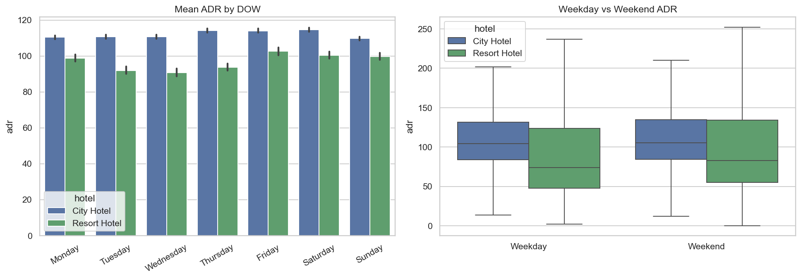

| Hotel | Weekend − Weekday (mean) | Tương đối |
|---|---:|---:|
| City Hotel | **+1,24 €** | **+1,1%** |
| Resort Hotel | **+6,81 €** | **+7,2%** |

**City — theo ngày**

| Ngày | Bookings | Mean ADR | Median |
|---|---:|---:|---:|
| Monday | 5.774 | 110,48 € | 103,70 € |
| Tuesday | 4.486 | 110,67 € | 104,00 € |
| Wednesday | 4.519 | 110,75 € | 103,00 € |
| Thursday | 4.935 | 114,22 € | 107,00 € |
| Friday | 5.111 | 114,04 € | 105,74 € |
| Saturday | 4.555 | **114,61 €** | **107,10 €** |
| Sunday | 4.894 | 109,71 € | 102,00 € |

**Resort — theo ngày**

| Ngày | Bookings | Mean ADR | Median |
|---|---:|---:|---:|
| Monday | 3.812 | 98,86 € | 78,20 € |
| Tuesday | 3.124 | 91,97 € | 71,00 € |
| Wednesday | 2.961 | **90,71 €** | **70,40 €** |
| Thursday | 3.557 | 93,82 € | 73,92 € |
| **Friday** | **3.315** | **102,62 €** | **85,00 €** |
| Saturday | 3.905 | 100,44 € | 82,00 € |
| Sunday | 3.118 | 99,79 € | 81,77 € |

**Phân tích khác biệt & ý nghĩa kinh doanh**

- City gần như **phẳng theo DOW** (spread ngày ~5 €) — tín hiệu công vụ / midweek demand.  
- Resort **hõm Tue–Wed**, nhích Fri–Sun — đúng leisure pattern.  
- **KD:** Resort ưu tiên weekend surcharge + midweek package; City không “bán” weekend premium mạnh — tập trung length-of-stay / corporate midweek, surcharge nhẹ Thu–Sat nếu pickup tốt.

### 1.3 Heatmap tháng × DOW & weekend premium theo tháng

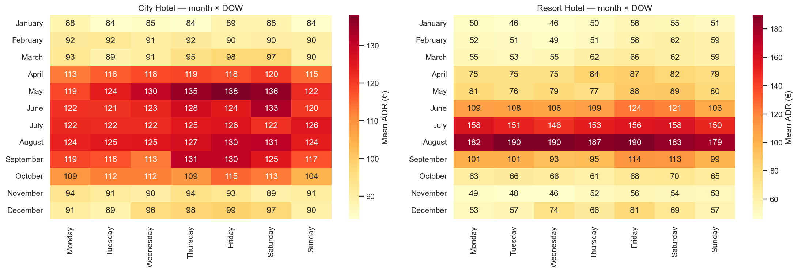

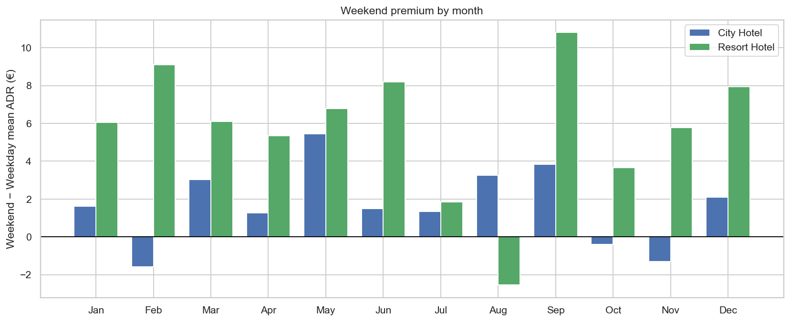

| Tháng | City Δ WE−WD (€) | Resort Δ WE−WD (€) |
|---|---:|---:|
| January | +1,62 | +6,05 |
| February | **−1,58** | +9,10 |
| March | +3,03 | +6,10 |
| April | +1,27 | +5,35 |
| **May** | **+5,43** | +6,77 |
| June | +1,49 | +8,18 |
| July | +1,35 | +1,84 |
| August | +3,26 | **−2,54** |
| **September** | +3,84 | **+10,81** |
| October | −0,39 | +3,65 |
| November | −1,30 | +5,76 |
| December | +2,10 | +7,94 |

**Phân tích khác biệt & ý nghĩa kinh doanh**

- Resort: premium cuối tuần **gần như cả năm** (trừ Aug khi ADR nền đã cực cao). Đỉnh **Sep (+10,8 €)** và **Feb (+9,1 €)**.  
- City: premium nhỏ; vài tháng **âm** (Feb, Oct, Nov) — weekend không luôn đắt hơn weekday.  
- **KD:** surcharge weekend **theo tháng × hotel**; Resort shoulder (Sep, Dec–Mar) là lever chính; City May là cửa sổ WE đáng tiền nhất; tránh áp một mức WE flat cho cả hai.

---

## 2. Lead-time vs ADR

### 2.1 Tổng thể & lead bins

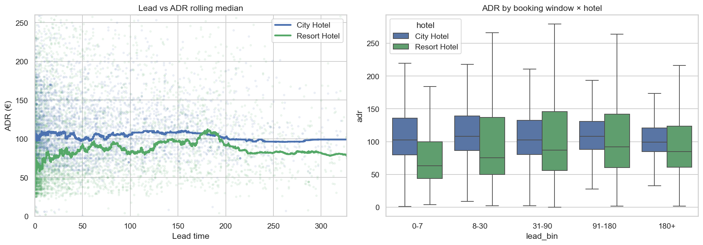

| Hotel | Spearman ρ (lead, ADR) | Last-minute (0–7) median | Early-bird (180+) median | Gap LM − EB |
|---|---:|---:|---:|---:|
| City Hotel | **−0,001** (gần 0) | 102,80 € | 99,45 € | **+3,35 €** |
| Resort Hotel | **+0,191** | 63,00 € | 84,58 € | **−21,58 €** |

**City — lead bins**

| Lead bin | Bookings | Mean | Median |
|---|---:|---:|---:|
| 0–7 | 7.899 | 111,49 € | 102,80 € |
| 8–30 | 7.167 | 115,84 € | 108,00 € |
| 31–90 | 9.466 | 110,38 € | 102,64 € |
| 91–180 | 6.820 | 113,36 € | 108,00 € |
| 180+ | 2.922 | 106,60 € | 99,45 € |

**Resort — lead bins**

| Lead bin | Bookings | Mean | Median |
|---|---:|---:|---:|
| 0–7 | 7.039 | 81,27 € | **63,00 €** |
| 8–30 | 4.289 | 100,08 € | 75,46 € |
| 31–90 | 5.000 | 107,42 € | 87,00 € |
| 91–180 | 4.265 | 107,75 € | **92,00 €** |
| 180+ | 3.199 | 97,54 € | 84,58 € |

**Phân tích khác biệt & ý nghĩa kinh doanh**

- City: đường lead–giá **phẳng** — cửa sổ đặt ít đổi ADR; last-minute không “rẻ” hơn early-bird trên median.  
- Resort: last-minute **rẻ rõ** (median 63 €) vs band 31–180 (~87–92 €) — rủi ro dump giá gần ngày / mix segment thấp giá.  
- **KD:** City bảo vệ BAR đồng đều mọi cửa sổ; Resort **nâng floor last-minute**, siết OTA 0–7 ngày, early-bird có kiểm soát nhưng không undercut band 31–90.

### 2.2 Control theo mùa

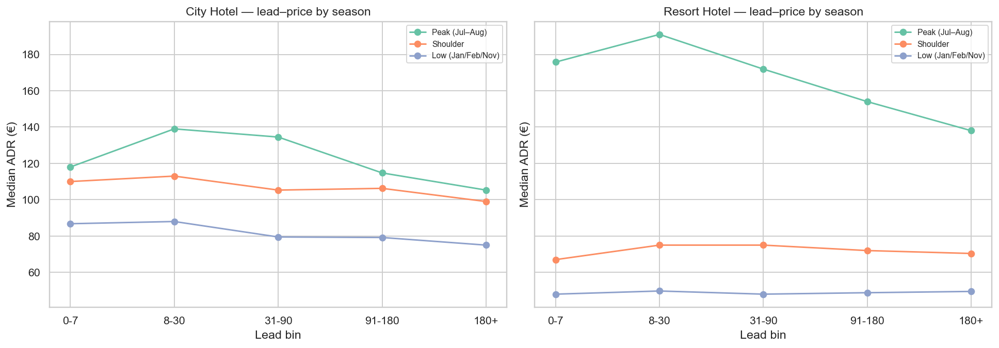

Median ADR — lead × season:

| Lead | City Low | City Peak | City Shoulder | Resort Low | Resort Peak | Resort Shoulder |
|---|---:|---:|---:|---:|---:|---:|
| 0–7 | 86,78 | 118,00 | 110,00 | 48,00 | **175,75** | 67,00 |
| 8–30 | 88,00 | **139,00** | 113,00 | 49,74 | **191,00** | 75,00 |
| 31–90 | 79,48 | 134,50 | 105,30 | 48,00 | 171,90 | 75,00 |
| 91–180 | 79,20 | 114,75 | 106,25 | 48,80 | 154,00 | 72,00 |
| 180+ | 75,00 | 105,30 | 99,00 | 49,50 | 138,00 | 70,40 |

**Phân tích khác biệt & ý nghĩa kinh doanh**

- Peak Resort: cửa sổ **8–30 đắt nhất (191 €)**; early-bird 180+ chỉ 138 € — undercut ~53 €.  
- Peak City: cũng 8–30 cao nhất (139 €) nhưng biên độ hẹp hơn Resort.  
- Low season Resort: đường gần phẳng ~48–50 € — promotion lead dài ít “đốt” margin peak.  
- **KD:** early-bird floor Jul–Aug **bắt buộc với Resort**; City chỉnh nhẹ hơn. Low season Resort có thể dùng lead dài để đầy phòng mà ít hy sinh yield peak.

### 2.3 Theo market segment

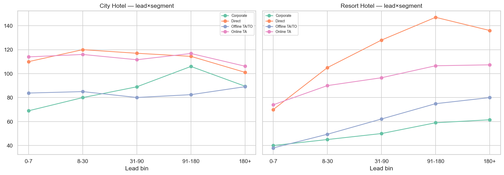

**Phân tích khác biệt & ý nghĩa kinh doanh**

- Cùng segment (Online TA, Direct, …) có **đường lead–giá khác nhau** giữa City và Resort — không gộp channel policy.  
- Direct / Online TA thường giữ ADR cao hơn Groups ở cả hai; Resort last-minute còn kéo thấp bởi mix giá.  
- **KD:** hạn mức dump OTA/Groups lead dài **riêng Resort**; City ưu tiên Direct 31–180 như playbook nb 17 nhưng với BAR nền cao hơn.

---

## 3. Room type premium & upsell

### 3.1 Price ladder (theo hotel)

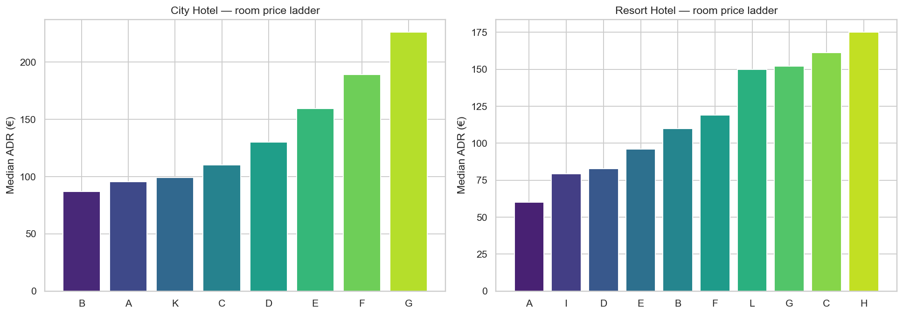

| Hotel | Ladder (rẻ → đắt, median reserved/assigned) |
|---|---|
| City | **B < A < K < C < D < E < F < G** |
| Resort | **A < I < D < E < B < F < L < G < C < H** |

**Phân tích khác biệt & ý nghĩa kinh doanh**

- Alphabet phòng **không** dùng chung giữa hai property — thậm chí thứ tự A/B/C đảo vai trò.  
- City: A/B là khối volume; Resort: A rẻ nhất, C/H nằm top ladder.  
- **KD:** upsell script, guarantee fee, inventory protection phải **tách brand/property**; cấm dùng một “room rank” chung cho portfolio.

### 3.2 Mis-match & opportunity

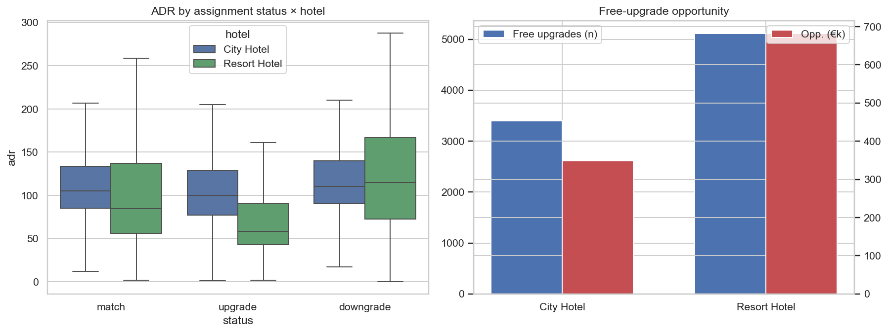

| Metric | City Hotel | Resort Hotel |
|---|---:|---:|
| Mis-match rate | **13,8%** | **23,9%** |
| Upgrade / mis-match | ~82% | ~97% |
| Free upgrade proxy (n) | **3.399** | **5.112** |
| Upsell opportunity (proxy €) | **~348.140 €** | **~681.861 €** |

**Phân tích khác biệt & ý nghĩa kinh doanh**

- Resort **free-upgrade nhiều hơn** (tỷ lệ mis-match + volume proxy) dù ít booking stay hơn City → opportunity € **gần gấp đôi**.  
- City ít “cho không” hơn nhưng vẫn còn ~0,35M € proxy.  
- **KD:** ưu tiên paid upsell / room guarantee ở **Resort** trước (ROI proxy cao hơn); City tối ưu cặp volume lớn trong ladder riêng (thường quanh A/B → D/E/F).

---

## 4. So sánh chéo bổ sung

### 4.1 Gap ADR City − Resort (tháng & DOW)

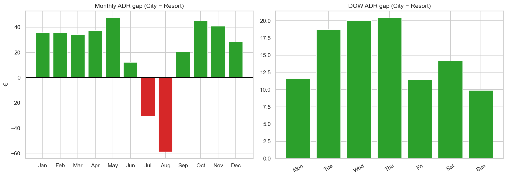

| Tháng | City mean | Resort mean | Gap (City − Resort) |
|---|---:|---:|---:|
| January | 86,18 | 50,63 | **+35,55** |
| February | 90,75 | 55,37 | +35,38 |
| March | 93,23 | 59,11 | +34,12 |
| April | 116,96 | 79,83 | +37,13 |
| **May** | 128,21 | 80,64 | **+47,58** |
| June | 124,08 | 111,99 | +12,09 |
| July | 123,46 | 154,07 | **−30,61** |
| **August** | 126,42 | 185,26 | **−58,84** |
| September | 122,23 | 102,09 | +20,13 |
| October | 110,27 | 65,38 | +44,89 |
| November | 91,94 | 51,18 | +40,76 |
| December | 94,76 | 66,51 | +28,25 |

**Phân tích khác biệt & ý nghĩa kinh doanh**

- Hầu hết năm City “đắt hơn”; **Jul–Aug đảo chiều** — Resort vượt +30 đến +59 €.  
- Gap DOW: City cao hơn mọi ngày, nhưng khoảng cách hẹp hơn cuối tuần (Resort bắt kịp nhờ WE premium).  
- **KD:** messaging & package theo mùa: low/shoulder bán City như lựa chọn giá ổn định; peak hè bán Resort như premium vacation; tránh so sánh BAR ngang hàng hai brand trên OTA cùng tháng peak.

### 4.2 Heatmap lead × month + gap

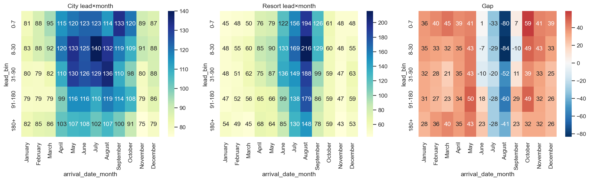

**Phân tích khác biệt & ý nghĩa kinh doanh**

- Ô đỏ/xanh trên heatmap gap cho thấy **ô giá “City đắt hơn”** tập trung low/shoulder × mọi lead; **ô Resort đắt hơn** tập trung peak × lead ngắn–trung.  
- **KD:** dynamic floor theo (hotel × tháng × lead bin); rule engine pricing không flatten hai property.

### 4.3 KPI profile

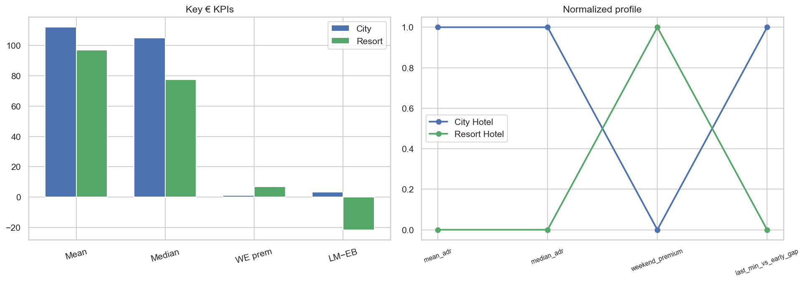

| KPI | City | Resort | Đọc nhanh |
|---|---:|---:|---|
| Mean ADR | 112,05 € | 97,09 € | City nền cao hơn |
| Median ADR | 105,00 € | 77,50 € | Resort lệch phải mạnh |
| Weekend premium | +1,24 € | +6,81 € | Resort lever WE |
| LM − EB median gap | +3,35 € | −21,58 € | Resort last-minute yếu giá |

**Phân tích khác biệt & ý nghĩa kinh doanh**

- Hai “fingerprint” pricing khác hẳn: City = **ổn định / midweek**; Resort = **mùa vụ + weekend + rủi ro LM**.  
- **KD:** forecast & stance (nb 18a/18b) nên **tách model**; KPI board RM tách cột City / Resort.

### 4.4 Slope — customer_type & deposit_type

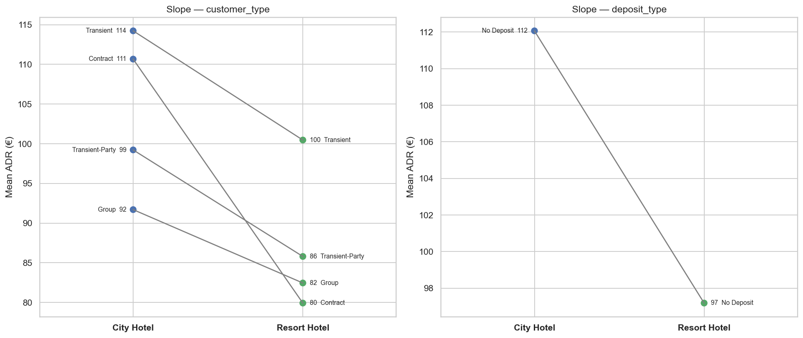

| customer_type | City mean ADR | Resort mean ADR | Gap |
|---|---:|---:|---:|
| Transient | 114,2 € | 100,5 € | +13,7 |
| Contract | 110,7 € | 79,9 € | +30,8 |
| Transient-Party | 99,2 € | 85,8 € | +13,4 |
| Group | 91,7 € | 82,5 € | +9,2 |

*(Deposit: gần như toàn bộ stay là No Deposit; Non Refund / Refundable n nhỏ — đọc thận trọng.)*

**Phân tích khác biệt & ý nghĩa kinh doanh**

- Mọi `customer_type` City ≥ Resort; **Contract** lệch lớn nhất (~31 €) — hợp đồng công vụ City định giá cao hơn rõ.  
- Group thấp nhất ở cả hai — penalty giá khi bán đoàn.  
- **KD:** negotiation rate Contract **tách property**; hạn mức Group discount chặt hơn ở Resort (đã thấp giá + seasonality mạnh).

### 4.5 Cancel-adjusted — Stay vs Canceled

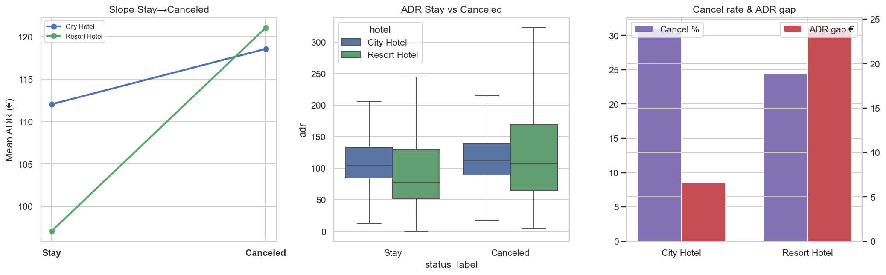

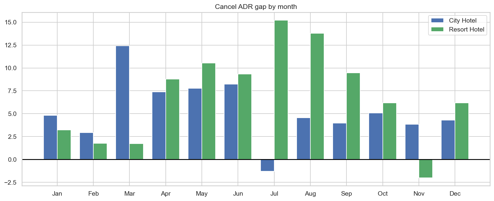

| Hotel | Cancel rate (`adr>0`) | Mean Stay | Mean Canceled | Gap (Can − Stay) |
|---|---:|---:|---:|---:|
| City Hotel | **31,1%** | 112,05 € | 118,58 € | **+6,53 €** |
| Resort Hotel | **24,4%** | 97,09 € | 121,09 € | **+23,99 €** |

**Phân tích khác biệt & ý nghĩa kinh doanh**

- City hủy nhiều hơn nhưng ADR canceled chỉ cao hơn Stay ~6,5 €.  
- Resort hủy ít hơn tương đối, nhưng booking hủy mang ADR **cao hơn Stay ~24 €** — hủy đang “ăn” các booking giá cao / peak.  
- **KD:** Resort ưu tiên chính sách giữ chỗ peak (cọc, hạn hủy, paid hold) vì mất mát yield khi hủy đắt; City tập trung giảm **tỷ lệ** hủy (volume) hơn là gap ADR. Kết hợp [`15_policy_scenario.md`](15_policy_scenario.md) / [`16_overbooking_policy.md`](16_overbooking_policy.md).

### 4.6 Small multiples — weekend premium theo market_segment

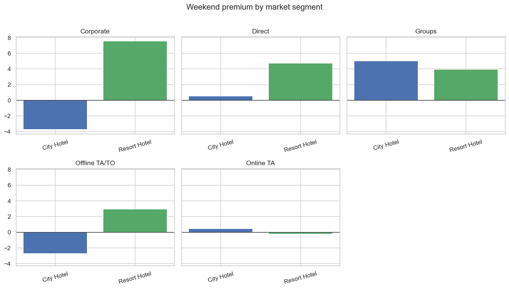

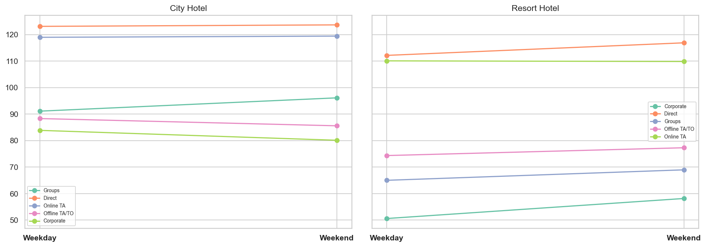

Một số premium nổi bật (Weekend − Weekday mean):

| Hotel | Segment | Premium € |
|---|---|---:|
| Resort | Corporate | **+7,56** |
| Resort | Direct | +4,74 |
| Resort | Groups | +3,95 |
| City | Groups | +5,02 |
| City | Corporate | **−3,73** |
| City | Offline TA/TO | −2,73 |

**Phân tích khác biệt & ý nghĩa kinh doanh**

- Resort: hầu hết segment có premium WE dương — surcharge có thể **phủ channel**.  
- City: Corporate / Offline có thể **weekend rẻ hơn weekday** — đúng B2B midweek; đừng surcharge WE Corporate City.  
- **KD:** rule weekend = f(hotel, market_segment); Online TA gần trung tính ở cả hai → không phải lever chính.

---

## 5. Bảng tổng hợp ý nghĩa kinh doanh theo biểu đồ

| # | Biểu đồ / mục | Khác biệt chính City vs Resort | Ý nghĩa kinh doanh / hành động |
|---|---|---|---|
| 0 | Snapshot ADR (box / violin / ECDF) | City mean/median cao hơn; Resort lệch phải, median thấp | Tách BAR & positioning; không so sánh “một ADR portfolio” |
| 1.1 | Monthly overlay + season index | City peak **May**, spread ~49%; Resort peak **Aug**, spread ~266% | Rate calendar & inventory protection **riêng**; Resort harden Jul–Aug |
| 1.2 | DOW / Weekend box | City WE +1,1%; Resort +7,2%; Resort hõm Tue–Wed | Resort: WE surcharge + midweek package; City: ưu tiên midweek corporate |
| 1.3 | Heatmap & WE premium theo tháng | Resort premium hầu hết tháng (đỉnh Sep); City nhỏ / đôi khi âm | Surcharge theo tháng×hotel; tránh flat WE fee |
| 2.1 | Lead–ADR scatter & bins | City ρ≈0; Resort ρ=+0,19 & LM median rất thấp | Resort nâng floor 0–7 ngày; City giữ BAR ổn định mọi cửa sổ |
| 2.2 | Lead × season | Resort peak 8–30 đắt nhất; EB 180+ undercut mạnh | Early-bird floor Jul–Aug (đặc biệt Resort) |
| 2.3 | Lead × segment | Đường channel khác nhau theo hotel | Channel rules & commission theo property |
| 3.1 | Room ladder | Thứ tự phòng **không trùng** giữa City/Resort | Upsell & inventory rank tách brand |
| 3.2–3.3 | Mis-match / upsell | Resort mis-match & opp € cao hơn | Ưu tiên paid upsell Resort; City tối ưu cặp volume A/B |
| 4.1 | Gap tháng & DOW | City > Resort gần cả năm; **Jul–Aug đảo chiều** | Positioning OTA theo mùa; package peak vs low khác nhau |
| 4.2 | Heatmap lead×month gap | Ô gap đổi dấu theo mùa & lead | Dynamic floor (hotel × tháng × lead) |
| 4.3 | KPI profile | Hai fingerprint pricing | Dashboard RM & forecast tách cột |
| 4.4 | Slope customer / deposit | Mọi type City ≥ Resort; Contract lệch lớn | Negotiate Contract theo property; siết Group |
| 4.5 | Cancel-adjusted | City hủy nhiều hơn; Resort gap ADR Can−Stay lớn hơn | Resort: giữ chỗ peak / cọc; City: giảm cancel rate |
| 4.6 | Small multiples WE × segment | Resort premium đa segment; City Corporate WE âm | Rule WE = f(hotel, segment); không surcharge Corporate City |

---

## 6. Thông điệp điều hành & playbook

### Thông điệp

1. **Hai property = hai sản phẩm giá** — gộp như nb 17 làm mờ peak Resort và midweek City.  
2. **Seasonality là lever #1 ở Resort**; ở City là **ổn định + May shoulder**.  
3. **Weekend surcharge chủ yếu là chuyện Resort** (+7% vs +1% City).  
4. **Last-minute Resort đang rẻ** — rủi ro yield; City không cùng vấn đề.  
5. **Free upgrade / mis-match nặng hơn Resort** — ưu tiên monetize upsell tại đây.  
6. **Hủy ở Resort “đắt” hơn Stay** — mất yield khi cancel peak; chính sách giữ chỗ quan trọng hơn City.

### Playbook đề xuất

| Lever | City Hotel | Resort Hotel |
|---|---|---|
| Rate calendar | Tăng Apr→Sep; đỉnh May; promo Jan–Mar/Nov | Harden Jul–Aug mạnh; STIMULATE sâu Jan–Mar/Nov |
| Weekend | Surcharge nhẹ, ưu tiên May; không ép Corporate WE | Surcharge hầu hết tháng (đặc biệt Sep, shoulder); midweek deal Tue–Wed |
| Booking window | BAR ổn định mọi lead | Floor 0–7; early-bird floor peak; siết OTA dump |
| Upsell | Paid upsell theo ladder City (A/B → D/E/F) | Ưu tiên chuyển free upgrade → paid (opp proxy cao hơn) |
| Cancel / policy | Giảm tỷ lệ hủy (volume) | Bảo vệ booking ADR cao / peak (cọc, hạn hủy) |
| Forecast / DP | Model & stance riêng (nb 18) | Model & stance riêng; pressure Jul–Aug cao hơn |

---

## 7. Giới hạn & bước tiếp

- Dataset 2015–2017 lệch năm — cẩn trọng ngoại suy.  
- Upsell opportunity = proxy median × nights, chưa trừ chi phí vận hành.  
- Deposit Non Refund / Refundable trên **stay** rất mỏng — slope deposit chỉ mang tính minh họa.  
- Nên nối forecast tách hotel ([`18a`](18a_demand_forecasting_dynamic_pricing_adr.md) / [`18b`](18b_demand_forecasting_dynamic_pricing_RevPAR.md)) và policy hủy/cọc ([`15`](15_policy_scenario.md), [`16`](16_overbooking_policy.md)).

---

*Báo cáo sinh từ kết quả phân tích `notebooks/17b_adr_strategy_analysis_city_resort.ipynb` và figures trong `reports/figures/17b/`.*
