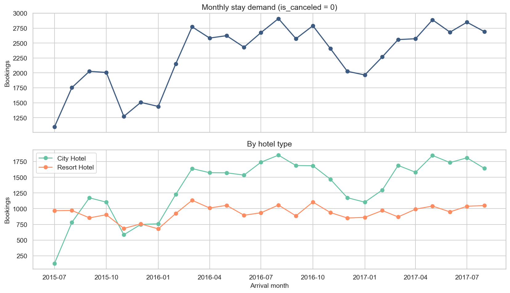
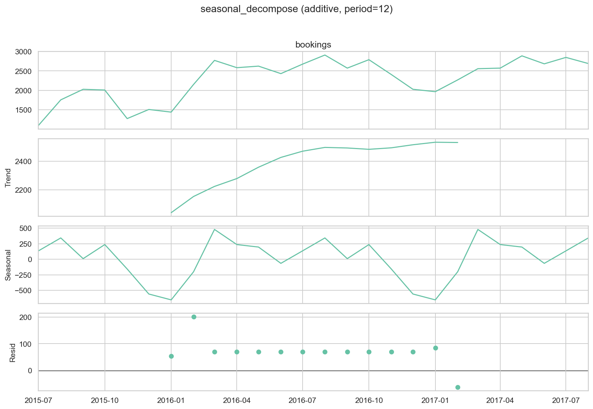
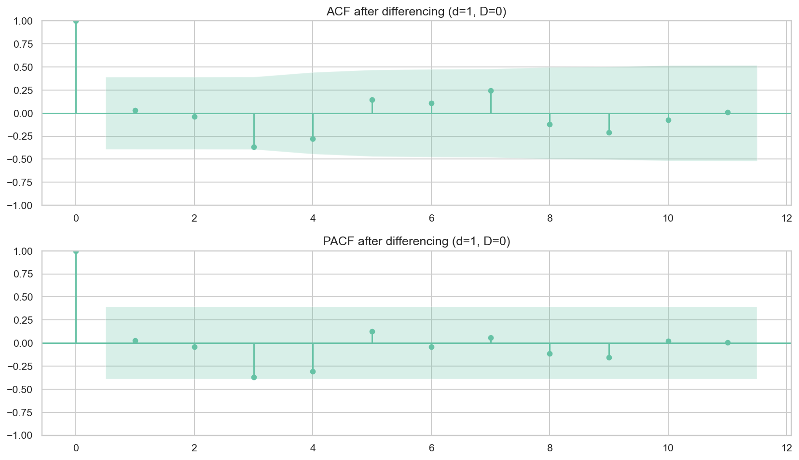
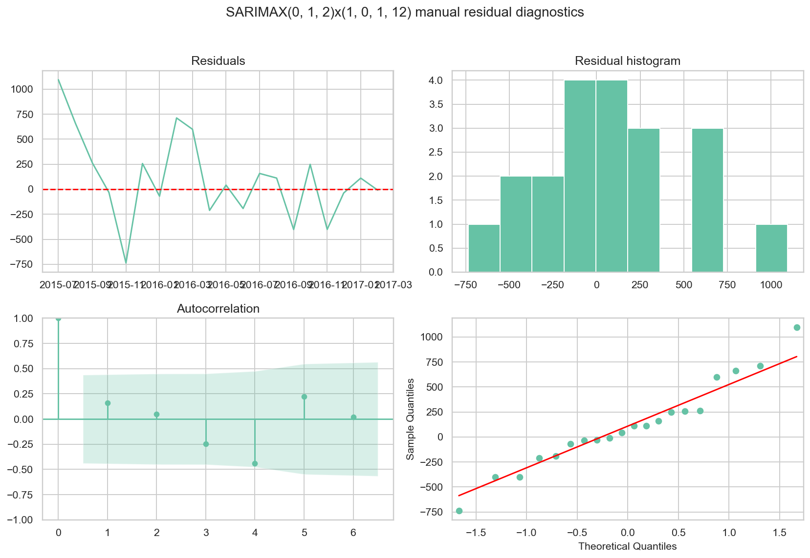
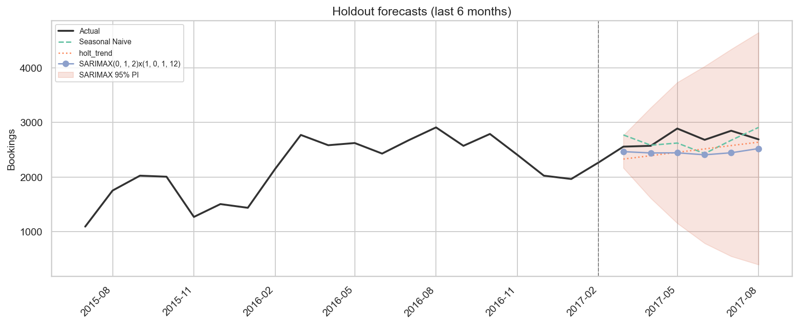
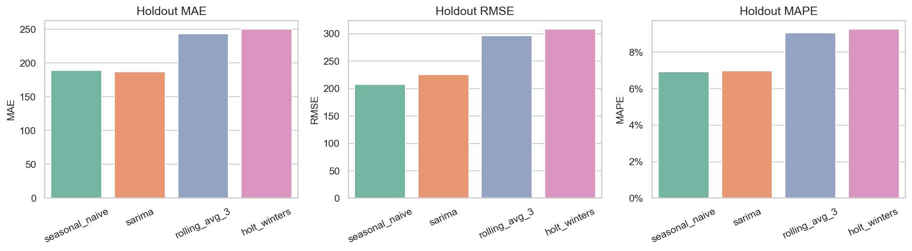
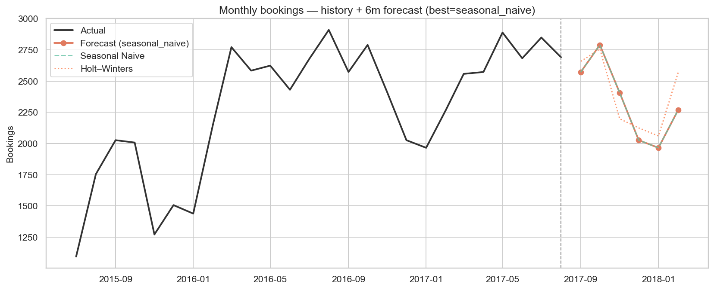
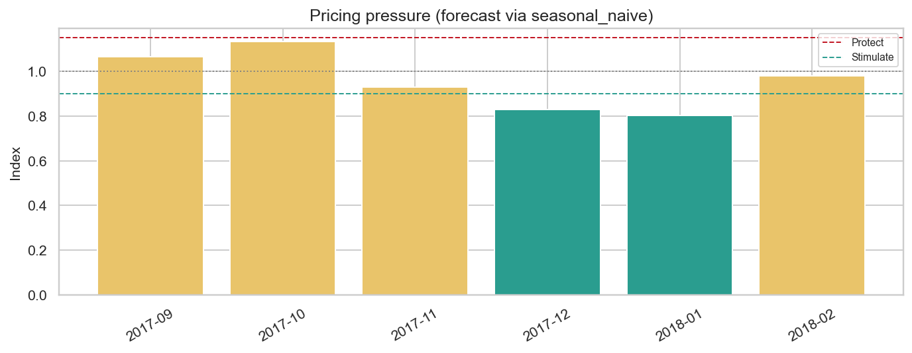

# 18 — Demand Forecasting for Dynamic Pricing (statsmodels)

> **Nguồn dữ liệu:** `hotel_bookings_v5.csv`  
> **Phạm vi:** stay bookings (`is_canceled = 0`) · 59.527 booking · 26 tháng (2015-07 → 2017-08)  
> **Skill:** [`statsmodels`](../.cursor/skills/statsmodels/SKILL.md) — Workflow 4 Time Series Forecasting  
> **Library:** statsmodels **0.14.6**  
> **Notebook:** [`notebooks/18_demand_forecasting_dynamic_pricing.ipynb`](../notebooks/18_demand_forecasting_dynamic_pricing.ipynb)  
> **Figures:** [`reports/figures/18/`](./figures/18/) · KPI: [`kpi_summary.csv`](./figures/18/kpi_summary.csv)

---

## Mục tiêu

Dự báo demand tháng cho dynamic pricing theo pipeline **statsmodels**:

1. Plot + `seasonal_decompose`  
2. Stationarity **ADF / KPSS** → chọn `d`, `D`  
3. **ACF / PACF**  
4. **SARIMAX** grid (AIC/BIC) + **Holt–Winters / Holt**  
5. Residual diagnostics (`plot_diagnostics`, Ljung–Box)  
6. Forecast có **95% prediction interval**  
7. Holdout vs **Seasonal Naive** baseline  

---

## 1. Series & decomposition

### 1.1 Monthly demand (overall + by hotel)

**Insight**

- Chuỗi **26 tháng** (2015-07 → 2017-08), tổng **59.527** stay bookings — đủ thấy chu kỳ năm nhưng ngắn cho model phức tạp.  
- Demand có **biên độ mùa rõ**: thấp hơn đầu năm / cuối năm, cao hơn quanh mùa hè và shoulder.  
- **City Hotel** và **Resort Hotel** không cùng biên độ → nếu làm rate calendar theo property nên forecast tách riêng.  
- **Hàm ý:** dynamic pricing theo tháng là hướng đúng; đừng dùng rolling average làm primary (dễ làm mượt peak).

### 1.2 Seasonal decompose

**Insight**

- Thành phần **seasonal** (period=12) tách rõ khỏi trend/residual — xác nhận seasonality năm là tín hiệu chính.  
- **Trend** tăng nhẹ qua mẫu (một phần do 2015 chỉ có H2, 2017 cắt Aug) — cẩn trọng khi ngoại suy.  
- Residual còn biến động → còn room cho AR/MA sau khi khác biệt chuỗi.  
- **Hàm ý:** ưu tiên model có seasonal term (SARIMAX / HW / Seasonal Naive), không dùng ARIMA thuần.

---

## 2. Stationarity (ADF + KPSS)

| Series | n | ADF p | ADF stationary | KPSS p | KPSS stationary |
|---|---:|---:|:---:|---:|:---:|
| level | 26 | 0,091 | No | 0,044 | No |
| **diff1** | 25 | ≈0 | **Yes** | 0,100 | **Yes** |
| seasonal_diff12 | 14 | ≈0 | Yes | 0,018 | No |
| diff1_seasonal12 | 13 | ≈0 | Yes | 0,100 | Yes |

**Chọn differencing:** `d=1`, `D=0` (ưu tiên phương án ít “đốt” mẫu hơn khi cả ADF+KPSS đạt trên chuỗi ngắn).

**Insight**

- Level **không stationary** (ADF chưa reject + KPSS reject) → không fit ARIMA trên level thô.  
- `diff1` đạt cả hai test với n=25 — lựa chọn ổn định nhất cho mẫu ngắn.  
- `seasonal_diff12` làm ADF “quá đẹp” nhưng KPSS fail và n chỉ còn 14 → rủi ro over-differencing.  
- **Hàm ý:** giữ `d=1`, mô hình hóa mùa bằng seasonal AR/MA `(P,0,Q,12)` thay vì ép `D=1`.

### 2.1 ACF / PACF sau differencing

**Insight**

- ACF/PACF trên chuỗi đã diff giúp gợi ý bậc `q` / `p`; spike gần lag mùa gợi ý `P`/`Q`.  
- Với n nhỏ, đồ thị chỉ mang tính **định hướng** — quyết định cuối dựa trên **AIC grid + holdout**.  
- **Hàm ý:** kết hợp rule-of-thumb ACF/PACF với grid `p,q∈{0,1,2}`, `P,Q∈{0,1}` thay vì chọn tay một order duy nhất.

---

## 3. SARIMAX selection & residual diagnostics

Train = 20 tháng đầu · Test/holdout = 6 tháng cuối.

**Best by AIC:** `SARIMAX(0,1,2)×(1,0,1,12)`  
- AIC ≈ **62,8** · BIC ≈ **59,7** · LLF ≈ −26,4  

(Grid lưu tại [`sarimax_aic_grid.csv`](./figures/18/sarimax_aic_grid.csv).)

**Insight (model selection)**

- Order thắng AIC có cả **MA(2)** và **seasonal AR/MA** — phù hợp residual còn autocorrelation sau diff1.  
- Train chỉ 20 điểm → AIC hữu ích để loại model kém, nhưng **không đủ** để chọn model pricing cuối.  
- Holt–Winters seasonal **không fit được trên train** (cần ≥24 tháng) → fallback **Holt trend**; full sample mới dùng HW seasonal.

### 3.1 Residual diagnostics (train)

| Model | Ljung–Box p (lag 6) | Ljung–Box p (lag 12) |
|---|---:|---:|
| SARIMAX | 0,17 | 0,18 |
| Holt trend (train fallback) | 0,32 | 0,28 |

**Insight**

- Ljung–Box lag 6/12 **không bác bỏ** white-noise residuals (p > 0,05) → fit train “sạch” về autocorrelation.  
- Histogram / Q–Q trên mẫu ngắn dễ lệch; ưu tiên Ljung–Box + holdout hơn vẻ đẹp đồ thị.  
- Residual std vẫn lớn (~428 bookings) → khoảng tin cậy forecast sẽ rộng.  
- **Hàm ý:** diagnostics đạt → được phép dùng SARIMAX cho interval; nhưng vẫn phải so holdout với Naive.

---

## 4. Holdout accuracy (6 tháng)

### 4.1 Holdout forecasts + 95% PI

**Insight**

- Seasonal Naive bám actual tốt trên 6 tháng cuối; SARIMAX lệch hơn ở vài tháng nhưng **PI 95% bao phủ 100%** actual.  
- PI rất rộng → SARIMAX hữu ích hơn như **dải rủi ro** hơn là point forecast cho pricing.  
- Holt trend thiếu mùa → kém ở tháng có seasonality mạnh.  
- **Hàm ý:** point forecast pricing dùng Naive; SARIMAX dùng để cảnh báo biên không chắc chắn.

### 4.2 Holdout MAPE

| Model | MAE | RMSE | MAPE |
|---|---:|---:|---:|
| **Seasonal Naive** | 189,2 | 207,3 | **6,9%** |
| Holt trend | 221,9 | 250,7 | 8,1% |
| SARIMAX(0,1,2)(1,0,1)₁₂ | 251,8 | 285,3 | 9,1% |

**Insight**

- **Best holdout = Seasonal Naive (MAPE 6,9%)** — thắng nhẹ Holt (8,1%) và SARIMAX (9,1%).  
- AIC tốt trên train **không** chuyển thành thắng ngoài mẫu trên chuỗi ~26 điểm.  
- Gap MAPE ~2 điểm % là có ý nghĩa với revenue calendar (hàng trăm booking/tháng).  
- **Hàm ý:** primary model cho rate calendar = Seasonal Naive; giữ SARIMAX làm đối chứng + PI.

---

## 5. Forecast 6 tháng (full-sample refit)

Primary cho stance pricing = model thắng holdout → **Seasonal Naive**.  
SARIMAX / Holt–Winters giữ làm đối chứng + interval.

| Tháng | Seasonal Naive | SARIMAX | SARIMAX 95% PI | Holt–Winters |
|---|---:|---:|---|---:|
| 2017-09 | 2.573 | 2.620 | [2.301, 2.939] | 2.659 |
| 2017-10 | 2.790 | 2.891 | [2.534, 3.247] | 2.758 |
| 2017-11 | 2.408 | 2.705 | [2.348, 3.061] | 2.198 |
| 2017-12 | 2.027 | 2.337 | [1.980, 2.693] | 2.125 |
| 2018-01 | 1.966 | 2.299 | [1.942, 2.656] | 2.061 |
| 2018-02 | 2.269 | 2.426 | [2.069, 2.782] | 2.569 |

File: [`forecast_next_6m.csv`](./figures/18/forecast_next_6m.csv)

**Insight**

- Ba model **đồng thuận hướng mùa**: Oct cao hơn; Dec–Jan thấp hơn.  
- SARIMAX thường cao hơn Naive ở Nov–Jan; HW seasonal thấp hơn ở Nov — dùng divergence như tín hiệu bất định.  
- PI rộng dần theo horizon (đúng kỳ vọng) → càng xa càng không nên harden BAR chỉ dựa point forecast.  
- **Hàm ý:** Sep–Oct giữ BAR / tactical weekend; Dec–Jan chuẩn bị promo; luôn đọc kèm PI.

---

## 6. Pricing stance

| Tháng | Forecast (Naive) | Pressure | Stance |
|---|---:|---:|---|
| 2017-09 | 2.573 | 1,07 | NEUTRAL |
| 2017-10 | 2.790 | 1,13 | NEUTRAL (gần protect) |
| 2017-11 | 2.408 | 0,93 | NEUTRAL |
| 2017-12 | 2.027 | 0,83 | **STIMULATE** |
| 2018-01 | 1.966 | 0,80 | **STIMULATE** |
| 2018-02 | 2.269 | 0,98 | NEUTRAL |

**Insight**

- **Dec / Jan** rõ ràng **STIMULATE** (pressure 0,80–0,83) — promo, early-bird, package.  
- **Oct** gần ngưỡng PROTECT (1,13) — hạn chế dump OTA, weekend premium chọn lọc (nối notebook 17).  
- Sep / Nov / Feb ở vùng **NEUTRAL** — hold BAR, chỉnh tactical theo lead-time / channel.  
- Stance = `0,5·season_index + 0,5·demand_forecast` → kết hợp tín hiệu lịch sử mùa với volume forecast.  
- **Hàm ý playbook:** Dec–Jan kích cầu; Oct bảo vệ inventory; nối ADR season/weekend từ [`17_adr_strategy_analysis.md`](17_adr_strategy_analysis.md).

---

## 7. Gợi ý chiến lược

Kết hợp **demand forecast (nb 18)** với **ADR seasonality / weekend / lead-time (nb 17)** để ra playbook pricing–inventory theo tháng.

### 7.1 Thông điệp điều hành

1. **Primary forecast = Seasonal Naive** (holdout MAPE 6,9%) — dùng làm volume signal cho rate calendar; SARIMAX chỉ hỗ trợ **dải rủi ro (95% PI)**.  
2. **Mùa vẫn thống trị**: Dec–Jan STIMULATE; Oct gần PROTECT; Sep/Nov/Feb NEUTRAL — ưu tiên lịch tháng trước day-of-week.  
3. **Khi PI rộng / model lệch nhau** (vd. Nov): không harden BAR mạnh; giữ linh hoạt channel & length-of-stay.  
4. **Nối ADR nb 17**: peak ADR Jul–Aug (+115% vs Jan); weekend premium chọn lọc (May/Sep); early-bird floor ở mùa cao.  
5. **Tách City vs Resort** khi triển khai thật — biên độ demand khác nhau; có thể cần model/stance riêng từng property.

### 7.2 Playbook theo stance forecast

| Tháng (minh họa) | Stance | Gợi ý chiến lược |
|---|---|---|
| **2017-09** | NEUTRAL | Hold BAR; weekend premium nhẹ (Sep historically mạnh ở nb 17); ưu tiên Direct lead 31–180 |
| **2017-10** | NEUTRAL → gần PROTECT | Hạn chế dump OTA/Groups; bảo vệ inventory cuối tuần; hạn chế deep discount |
| **2017-11** | NEUTRAL | Tactical promo mid-week; theo dõi PI — nếu demand thực thấp hơn Naive thì nới promo |
| **2017-12** | **STIMULATE** | Package / early-bird / F&B bundle; mid-week deal Tue–Wed; không cắt sâu BAR peak weekend |
| **2018-01** | **STIMULATE** | Campaign kích cầu mạnh nhất cửa sổ; length-of-stay promo; giữ floor tránh race-to-bottom OTA |
| **2018-02** | NEUTRAL | Chuyển dần từ promo → hold BAR; chuẩn bị ladder tăng dần vào shoulder |

### 7.3 Playbook theo lever

| Lever | Hành động đề xuất |
|---|---|
| **Rate calendar** | Dec–Jan: promo có kiểm soát; Oct: harden BAR; Apr–Aug (từ nb 17): ladder tăng — dùng Naive volume để chỉnh depth giảm giá |
| **Weekend premium** | Áp chọn lọc May/Sep (+6–8 € nb 17); Oct shoulder: surcharge cuối tuần nếu pickup mạnh; Jul–Aug: không cần weekend premium lớn (ADR nền đã cao) |
| **Booking window** | Peak/shoulder: bảo vệ BAR last-minute; STIMULATE months: early-bird có floor; hạn chế Groups lead dài đẩy ADR xuống |
| **Inventory** | Oct gần protect: giữ room class cao cuối tuần; Dec–Jan: mở bán linh hoạt hơn, ưu tiên Direct |
| **Channel mix** | STIMULATE: tăng visibility OTA có kiểm soát commission; NEUTRAL/PROTECT: đẩy Direct, giảm dump rate |
| **Hủy / overbooking** | Nối [`15_policy_scenario.md`](15_policy_scenario.md), [`16_overbooking_policy.md`](16_overbooking_policy.md): tháng STIMULATE chấp nhận overbook thận trọng hơn; tháng gần PROTECT siết cọc/hủy |
| **Model ops** | Mỗi quý: re-fit holdout; nếu Naive thua SARIMAX ≥2 điểm MAPE trong 2 cửa sổ liên tiếp → đổi primary; bổ sung exog khi có ≥36 tháng |

### 7.4 Ưu tiên triển khai (90 ngày)

| Ưu tiên | Việc làm | Kết quả kỳ vọng |
|---|---|---|
| P0 | Lock rate calendar Dec–Jan (STIMULATE) + Oct (gần protect) theo bảng 7.2 | Tránh discount sai mùa / bỏ lỡ kích cầu thấp điểm |
| P1 | Gắn pickup tuần với Naive forecast: nếu pickup << forecast → nới promo sớm 2–3 tuần | Giảm void inventory cuối tháng yếu |
| P2 | Facet City vs Resort: stance + BAR riêng | Tránh một policy “one-size” làm lệch RevPAR |
| P3 | Dashboard: actual vs Naive vs SARIMAX PI theo tháng | Cảnh báo sớm khi demand lệch dải 95% |

---

## 8. KPI

| Metric | Value |
|---|---|
| n_months | 26 |
| differencing | d=1, D=0 |
| best SARIMAX (AIC) | (0,1,2)×(1,0,1,12) |
| best holdout model | seasonal_naive |
| best holdout MAPE | 6,9% |
| SARIMAX holdout MAPE | 9,1% |
| SARIMAX PI95 coverage | 100% |
| statsmodels | 0.14.6 |

---

## 9. Giới hạn (statsmodels + dữ liệu ngắn)

- Chỉ ~26 điểm → seasonal HW không fit trên train holdout; SARIMAX PI rất rộng.  
- AIC trên train không đảm bảo thắng Naive ngoài mẫu.  
- Dataset lệch năm (2015 H2 / 2017 cắt Aug) — forecast 2018 mang tính minh họa.  
- Gợi ý chiến lược ở mục 7 là **recommend-only** trên proxy lịch sử; cần validate với pickup thực tế và chi phí channel.  
- Bước tiếp: thêm năm dữ liệu, hoặc SARIMAX + exog (`lead_time`, channel mix); nối ADR playbook ở [`17_adr_strategy_analysis.md`](17_adr_strategy_analysis.md).

---

*Báo cáo sinh từ `notebooks/18_demand_forecasting_dynamic_pricing.ipynb` (statsmodels Workflow 4).*
