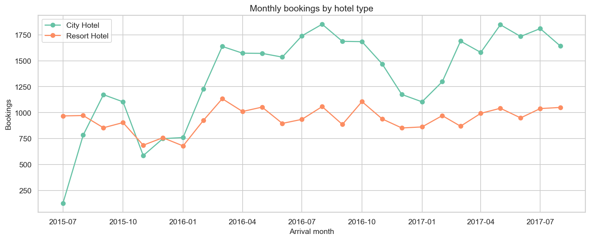
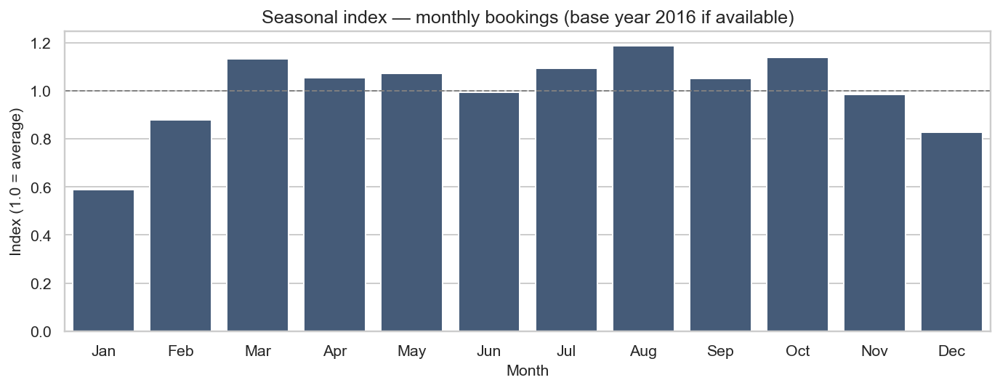
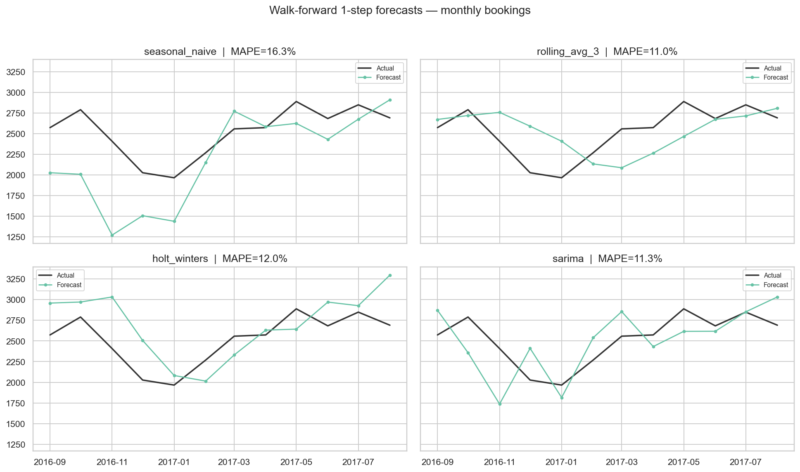
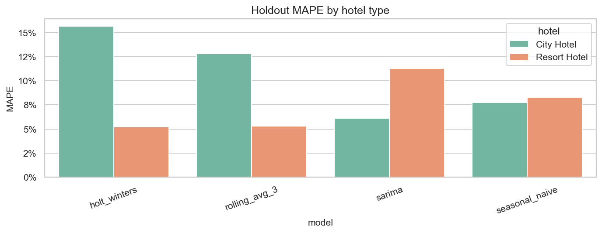

# 18 — Demand Forecasting for Dynamic Pricing

> **Nguồn dữ liệu:** `hotel_bookings_v5.csv`  
> **Phạm vi:** stay bookings (`is_canceled = 0`) · 59.527 booking · 26 tháng (2015-07 → 2017-08)  
> **Notebook:** [`notebooks/18_demand_forecasting_dynamic_pricing.ipynb`](../notebooks/18_demand_forecasting_dynamic_pricing.ipynb)  
> **Figures:** [`reports/figures/18/`](./figures/18/) · KPI: [`kpi_summary.csv`](./figures/18/kpi_summary.csv)

---

## Mục tiêu

Xây **demand forecast theo tháng** để hỗ trợ dynamic pricing:

1. Chuỗi demand (bookings + room-nights), overall và theo `hotel`
2. So sánh **Seasonal Naive · Rolling Average (w=3) · Holt–Winters · SARIMA**
3. Walk-forward 1-step + holdout 6 tháng cuối → chọn model
4. Forecast 6 tháng + **pricing stance** (liên kết seasonality notebook 17)

---

## 1. EDA — chuỗi demand

**Insight**

- Peak demand quanh mùa hè / shoulder (phù hợp ADR peak Aug ở báo cáo 17).  
- City Hotel và Resort Hotel có biên độ khác nhau → nên tách forecast khi làm rate calendar theo property.  
- Chỉ ~26 điểm tháng → model phức tạp dễ overfit; baseline seasonal rất quan trọng.

---

## 2. Backtest

### 2.1 Walk-forward đầy đủ (sau `min_train=14`, n=12 origins)

| Model | MAE | RMSE | MAPE |
|---|---:|---:|---:|
| Rolling Avg (3) | 260,1 | 315,6 | **11,0%** |
| SARIMA | 277,5 | 325,8 | 11,3% |
| Holt–Winters | 295,4 | 347,8 | 12,0% |
| Seasonal Naive | 396,9 | 501,7 | 16,3% |

### 2.2 Holdout 6 tháng cuối (bookings) — tiêu chí chọn model

| Model | MAE | RMSE | MAPE |
|---|---:|---:|---:|
| **Seasonal Naive** | 189,2 | 207,3 | **6,9%** |
| SARIMA | 187,1 | 225,1 | 7,0% |
| Rolling Avg (3) | 243,6 | 296,3 | 9,1% |
| Holt–Winters | 250,5 | 308,7 | 9,3% |

**Kết luận chọn model (bookings):** **Seasonal Naive** thắng nhẹ trên holdout (MAPE 6,9%), sát SARIMA (7,0%).  
Holt–Winters / Rolling Avg kém hơn trên cửa sổ gần nhất — đúng kỳ vọng với chuỗi ngắn + seasonality mạnh.

> Lưu ý: trên walk-forward dài hơn, Rolling/SARIMA có MAPE tốt hơn Naive. Với mục tiêu pricing gần hạn, **ưu tiên holdout gần nhất** → giữ Seasonal Naive làm primary; SARIMA là đối chứng gần ngang.

### 2.3 Theo hotel type (holdout MAPE)

| Model | City Hotel | Resort Hotel |
|---|---:|---:|
| SARIMA | **6,1%** | 11,3% |
| Seasonal Naive | 7,8% | 8,3% |
| Rolling Avg (3) | 12,8% | 5,3% |
| Holt–Winters | 15,7% | **5,3%** |

- **City:** SARIMA tốt nhất.  
- **Resort:** Holt–Winters / Rolling tốt nhất.  
→ Nếu pricing tách property: dùng model riêng theo hotel, không ép một model overall.

### 2.4 Secondary target — room-nights (holdout)

| Model | MAE | MAPE |
|---|---:|---:|
| **SARIMA** | 506,7 | **5,2%** |
| Seasonal Naive | 572,2 | 5,7% |
| Holt–Winters | 817,8 | 8,1% |
| Rolling Avg (3) | 1.356,2 | 14,0% |

Room-nights: **SARIMA** thắng rõ hơn Rolling Avg (MAPE ~5% vs 14%).

---

## 3. Forecast 6 tháng (từ 2017-09)

Primary model (overall bookings): **Seasonal Naive** (= cùng tháng năm trước).

| Tháng | Seasonal Naive | Holt–Winters | SARIMA |
|---|---:|---:|---:|
| 2017-09 | 2.573 | 2.659 | 1.791 |
| 2017-10 | 2.790 | 2.758 | 2.226 |
| 2017-11 | 2.408 | 2.198 | 2.171 |
| 2017-12 | 2.027 | 2.125 | 1.221 |
| 2018-01 | 1.966 | 2.061 | 1.166 |
| 2018-02 | 2.269 | 2.569 | 1.090 |

File: [`forecast_next_6m.csv`](./figures/18/forecast_next_6m.csv)

---

## 4. Pricing stance (demand × season)

Chỉ số: `combined_pressure = 0,5 · season_index + 0,5 · demand_index`  
- ≥ 1,15 → **PROTECT**  
- ≤ 0,90 → **STIMULATE**  
- còn lại → **NEUTRAL**

| Tháng | Forecast bookings | Season idx | Pressure | Stance |
|---|---:|---:|---:|---|
| 2017-09 | 2.573 | 1,05 | 1,05 | NEUTRAL — hold BAR, weekend premium chọn lọc |
| 2017-10 | 2.790 | 1,14 | 1,14 | NEUTRAL (gần ngưỡng protect) |
| 2017-11 | 2.408 | 0,98 | 0,98 | NEUTRAL |
| 2017-12 | 2.027 | 0,83 | 0,83 | **STIMULATE** — promo / package |
| 2018-01 | 1.966 | 0,59 | 0,70 | **STIMULATE** — early-bird / promo |
| 2018-02 | 2.269 | 0,88 | 0,90 | NEUTRAL / nhẹ stimulate |

File: [`pricing_stance_forecast.csv`](./figures/18/pricing_stance_forecast.csv)

### Playbook đề xuất

| Lever | Hành động |
|---|---|
| Rate calendar | Dec/Jan: promo; Sep–Oct: giữ BAR + weekend tactical (May/Sep logic từ nb 17) |
| Model layer | Overall bookings → Seasonal Naive; room-nights / City → SARIMA; Resort → ETS |
| Inventory | Shoulder gần peak (Oct): hạn chế dump OTA nếu pressure tăng |
| Next data | Khi có thêm ≥12 tháng: re-benchmark holdout; cân nhắc exogenous (lead_time, channel) |

---

## 5. KPI tóm tắt

| Metric | Value |
|---|---|
| n_months | 26 |
| total_stay_bookings | 59.527 |
| best_model_bookings (holdout) | seasonal_naive |
| best_mape_bookings | 6,9% |
| best_model_room_nights | sarima |
| best_mape_room_nights | 5,2% |
| forecast_horizon | 6 tháng |

---

## 6. Giới hạn & bước tiếp

- Dataset lệch năm (2015 chỉ H2, 2017 chỉ đến Aug) — forecast 2018Q1 mang tính minh họa.  
- Seasonal Naive “thắng” vì pattern YoY ổn; nếu có shock ngoại sinh (event, covid-like) sẽ fail.  
- Chưa gắn elasticity ADR–demand; notebook này chỉ cung cấp **volume signal** cho pricing.  
- Nối tiếp tự nhiên: kết hợp [`17_adr_strategy_analysis.md`](17_adr_strategy_analysis.md) (ADR season / weekend / lead) + forecast stance ở đây để ra rate ladder tháng.

---

*Báo cáo sinh từ kết quả chạy `notebooks/18_demand_forecasting_dynamic_pricing.ipynb`.*
