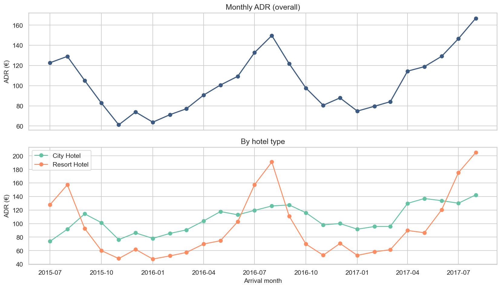
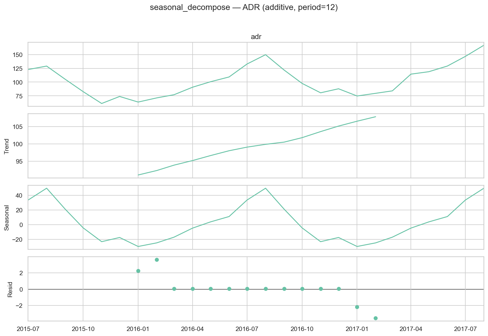
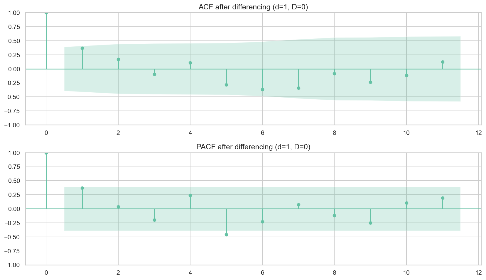
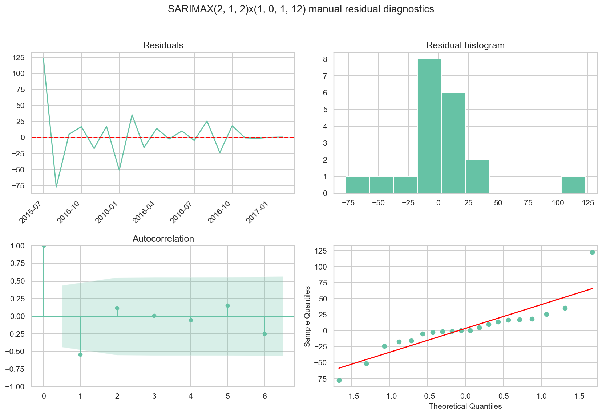
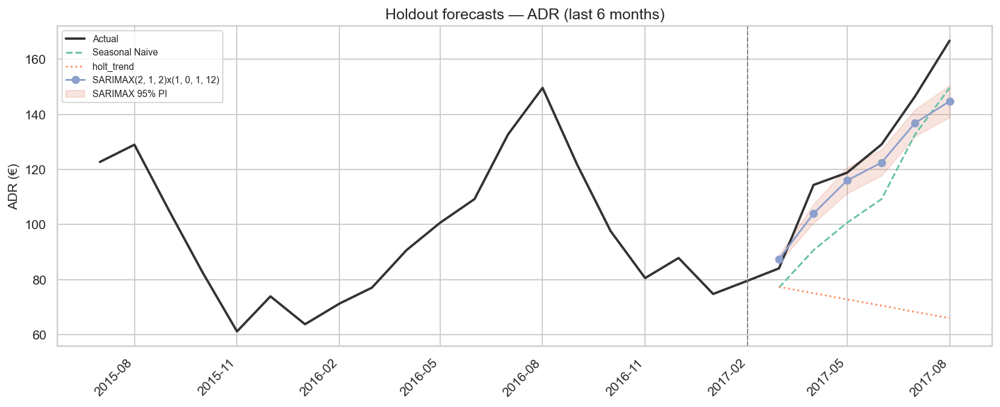
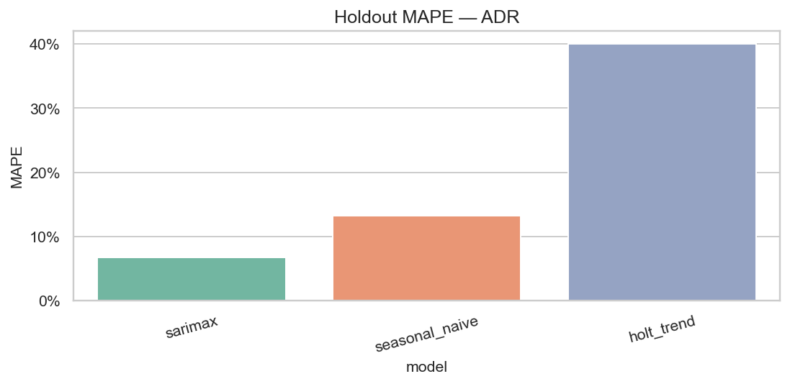
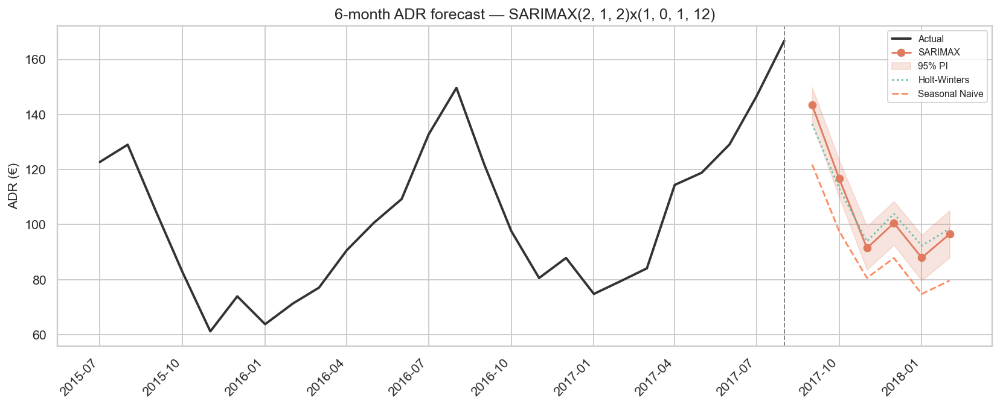
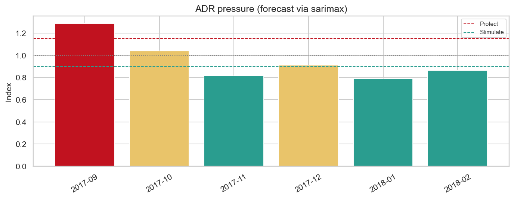

# 18a — ADR Forecasting for Dynamic Pricing (statsmodels)

> **Nguồn dữ liệu:** `hotel_bookings_v5.csv`  
> **Phạm vi:** stay bookings (`is_canceled = 0`, `adr > 0`) · mean ADR tháng · 26 tháng (2015-07 → 2017-08)  
> **Mean ADR lịch sử:** **102,77 €** · Min 61,19 · Max 166,80  
> **Skill:** [`statsmodels`](../.cursor/skills/statsmodels/SKILL.md) — Workflow 4 Time Series Forecasting  
> **Library:** statsmodels **0.14.6**  
> **Notebook:** [`notebooks/18a_demand_forecasting_dynamic_pricing_adr.ipynb`](../notebooks/18a_demand_forecasting_dynamic_pricing_adr.ipynb)  
> **Figures:** [`reports/figures/18_adr/`](./figures/18_adr/) · KPI: [`kpi_summary.csv`](./figures/18_adr/kpi_summary.csv)  
> **Liên kết:** demand [`18_...md`](18_demand_forecasting_dynamic_pricing.md) · ADR strategy [`17_adr_strategy_analysis.md`](17_adr_strategy_analysis.md) · RevPAR [`18b_...md`](18b_demand_forecasting_dynamic_pricing_RevPAR.md)

---

## Mục tiêu

Dự báo **ADR tháng** cho dynamic pricing theo pipeline **statsmodels**:

1. Plot + `seasonal_decompose`  
2. Stationarity **ADF / KPSS** → chọn `d`, `D`  
3. **ACF / PACF**  
4. **SARIMAX** grid (AIC/BIC) + **Holt–Winters / Holt**  
5. Residual diagnostics (`plot_diagnostics`, Ljung–Box)  
6. Forecast có **95% prediction interval**  
7. Holdout vs **Seasonal Naive** baseline  

**Target series:** mean `adr` theo tháng arrival (chỉ stay hoàn tất, `adr > 0`).

---

## 1. Series & decomposition

### 1.1 Monthly ADR (overall + by hotel)

**Insight**

- Chuỗi **26 tháng** (2015-07 → 2017-08), mean ADR **102,77 €** — đủ thấy chu kỳ năm nhưng ngắn cho model phức tạp.  
- ADR có **biên độ mùa rất rõ**: đáy đông (~61–80 €), peak hè (Jul–Aug lên ~147–167 € trên holdout).  
- **City Hotel** và **Resort Hotel** lệch biên độ / timing → rate calendar theo property nên forecast tách riêng khi triển khai.  
- **Hàm ý:** ADR forecast bổ sung volume signal ở nb 18; đừng dùng rolling average làm primary (dễ làm mượt peak Jul–Aug).

### 1.2 Seasonal decompose

**Insight**

- Thành phần **seasonal** (period=12) tách rõ — seasonality năm là tín hiệu chính của ADR.  
- **Trend** tăng qua mẫu (2015 chỉ H2, 2017 cắt Aug + mix channel/segment đổi) — cẩn trọng khi ngoại suy 2018.  
- Residual còn biến động → còn room cho AR/MA sau differencing.  
- **Hàm ý:** ưu tiên model có seasonal term (SARIMAX / HW / Seasonal Naive), không dùng ARIMA thuần.

---

## 2. Stationarity (ADF + KPSS)

| Series | n | ADF p | ADF stationary | KPSS p | KPSS stationary |
|---|---:|---:|:---:|---:|:---:|
| level | 26 | 0,940 | No | 0,100 | Yes |
| **diff1** | 25 | 0,004 | **Yes** | 0,100 | **Yes** |
| seasonal_diff12 | 14 | 0,019 | Yes | 0,100 | Yes |
| diff1_seasonal12 | 13 | ≈0 | Yes | 0,100 | Yes |

**Chọn differencing:** `d=1`, `D=0` (ưu tiên phương án ít “đốt” mẫu hơn khi cả ADF+KPSS đạt trên chuỗi ngắn).

**Insight**

- Level **không đạt ADF** → không fit ARIMA trên level thô.  
- `diff1` đạt cả hai test với n=25 — lựa chọn ổn định nhất cho mẫu ngắn.  
- Seasonal-diff cũng pass nhưng n chỉ còn 14 → rủi ro over-differencing.  
- **Hàm ý:** giữ `d=1`, mô hình hóa mùa bằng seasonal AR/MA `(P,0,Q,12)`.

### 2.1 ACF / PACF sau differencing

**Insight**

- ACF/PACF trên chuỗi đã diff giúp gợi ý bậc `q` / `p`; spike gần lag mùa gợi ý `P`/`Q`.  
- Với n nhỏ, đồ thị chỉ mang tính **định hướng** — quyết định cuối dựa trên **AIC grid + holdout**.  
- **Hàm ý:** kết hợp rule-of-thumb với grid `p,q∈{0,1,2}`, `P,Q∈{0,1}`.

---

## 3. SARIMAX selection & residual diagnostics

Train = 20 tháng đầu · Test/holdout = 6 tháng cuối.

**Best by AIC:** `SARIMAX(2,1,2)×(1,0,1,12)`  
- AIC ≈ **23,1** · BIC ≈ **18,8**  

(Grid lưu tại [`sarimax_aic_grid.csv`](./figures/18_adr/sarimax_aic_grid.csv).)

**Insight (model selection)**

- Order thắng AIC có **AR(2)+MA(2)** và **seasonal AR/MA** — phù hợp ADR còn autocorrelation sau diff1.  
- Train chỉ 20 điểm → AIC hữu ích để loại model kém, nhưng **không đủ** một mình để chọn model pricing cuối.  
- Holt–Winters seasonal **không fit được trên train** (cần ≥24 tháng) → fallback **Holt trend**; full sample mới dùng HW seasonal.

### 3.1 Residual diagnostics (train)

| Model | Ljung–Box p (lag 6) | Ljung–Box p (lag 12) |
|---|---:|---:|
| SARIMAX | 0,13 | 0,56 |
| Holt trend (train fallback) | 0,30 | 0,07 |

**Insight**

- Ljung–Box lag 6/12 **không bác bỏ** white-noise residuals SARIMAX (p > 0,05).  
- Residual std ~**38 €** — lớn so với mean ~103 € → PI có thể hẹp giả tạo nếu model under-cover trên holdout.  
- **Hàm ý:** diagnostics in-sample đạt → vẫn phải đối chiếu holdout coverage trước khi tin PI.

---

## 4. Holdout accuracy (6 tháng)

### 4.1 Holdout forecasts + 95% PI

**Insight**

- **SARIMAX** bám actual tốt hơn Naive trên cửa sổ Mar–Aug 2017 (đặc biệt Apr–Jun).  
- PI 95% **chỉ bao phủ 16,7%** actual — interval quá hẹp / bias: **không dùng SARIMAX PI làm risk band tin cậy** trên cửa sổ này.  
- Holt trend thiếu mùa → lệch mạnh khi ADR tăng mùa hè.  
- **Hàm ý:** point forecast ADR dùng **SARIMAX**; PI cần cải thiện (exog / thêm năm) trước khi dùng cho risk band.

### 4.2 Holdout MAPE

| Model | MAE | RMSE | MAPE |
|---|---:|---:|---:|
| **SARIMAX(2,1,2)(1,0,1)₁₂** | 9,1 | 11,2 | **6,7%** |
| Seasonal Naive | 16,6 | 17,4 | 13,2% |
| Holt trend | 54,9 | 62,5 | 40,0% |

**Insight**

- **Best holdout = SARIMAX (MAPE 6,7%)** — thắng rõ Naive (13,2%) và Holt (40%).  
- Khác demand nb 18 (Naive thắng): với ADR, cấu trúc AR/MA + seasonal bắt được trend tăng giá 2017 tốt hơn “copy năm trước”.  
- Gap MAPE ~6 điểm % vs Naive là có ý nghĩa cho BAR calendar (€/đêm).  
- **Hàm ý:** primary model cho ADR rate calendar = **SARIMAX**; giữ Naive làm đối chứng.

---

## 5. Forecast 6 tháng (full-sample refit)

Primary cho stance pricing = model thắng holdout → **SARIMAX**.  
Seasonal Naive / Holt–Winters giữ làm đối chứng.

| Tháng | **SARIMAX (primary)** | SARIMAX 95% PI | Seasonal Naive | Holt–Winters |
|---|---:|---|---:|---:|
| 2017-09 | **143,4** | [136,9, 149,8] | 121,8 | 136,5 |
| 2017-10 | **116,8** | [110,1, 123,4] | 97,7 | 113,2 |
| 2017-11 | **91,4** | [83,6, 99,3] | 80,6 | 93,9 |
| 2017-12 | **100,5** | [92,6, 108,4] | 87,9 | 103,9 |
| 2018-01 | **88,0** | [79,7, 96,2] | 74,8 | 92,3 |
| 2018-02 | **96,5** | [87,9, 105,1] | 79,6 | 98,5 |

File: [`forecast_next_6m.csv`](./figures/18_adr/forecast_next_6m.csv)

**Insight**

- Ba model **đồng thuận hướng mùa**: Sep còn cao; Nov–Jan thấp hơn; Feb hồi nhẹ.  
- SARIMAX **cao hơn Naive ~15–22 €** hầu hết tháng — phản ánh trend ADR 2017; nếu 2018 không giữ trend thì Naive an toàn hơn.  
- PI hẹp nhưng holdout coverage kém → đọc PI mang tính minh họa, không harden BAR chỉ vì cận dưới PI.  
- **Hàm ý:** Sep bảo vệ BAR; Nov–Jan chuẩn bị nới / promo có floor; đối chiếu pickup thực tế.

---

## 6. Pricing stance (ADR pressure)

| Tháng | Forecast (SARIMAX) | Pressure | Stance |
|---|---:|---:|---|
| 2017-09 | 143,4 | 1,29 | **PROTECT** |
| 2017-10 | 116,8 | 1,04 | NEUTRAL |
| 2017-11 | 91,4 | 0,82 | **STIMULATE** |
| 2017-12 | 100,5 | 0,91 | NEUTRAL |
| 2018-01 | 88,0 | 0,79 | **STIMULATE** |
| 2018-02 | 96,5 | 0,86 | **STIMULATE** |

**Insight**

- **Sep** rõ **PROTECT** (pressure 1,29) — harden BAR, hạn chế dump OTA (khớp peak ADR nb 17).  
- **Nov / Jan / Feb** **STIMULATE** — promo / early-bird có floor; không race-to-bottom.  
- Oct / Dec vùng **NEUTRAL** — hold BAR, weekend premium chọn lọc.  
- Stance = `0,5·season_index + 0,5·ADR_forecast_index`.  
- **Hàm ý playbook:** nối volume stance nb 18 + ADR season/weekend nb 17; Dec–Jan vừa STIMULATE volume vừa STIMULATE ADR → kích cầu có kiểm soát floor.

---

## 7. Gợi ý chiến lược

Kết hợp **ADR forecast (nb 18a)** với **demand forecast (nb 18)** và **ADR seasonality / weekend / lead-time (nb 17)**.

### 7.1 Thông điệp điều hành

1. **Primary ADR forecast = SARIMAX** (holdout MAPE 6,7%) — dùng làm rate signal; Naive đối chứng; **không tin PI 95%** trên cửa sổ hiện tại (coverage 17%).  
2. **Mùa vẫn thống trị**: Sep PROTECT; Nov/Jan/Feb STIMULATE; Oct/Dec NEUTRAL.  
3. **Khi SARIMAX >> Naive** (~15–20 €): kiểm tra pickup & competitive set trước khi lock BAR cao.  
4. **Nối nb 17**: peak Jul–Aug; weekend premium May/Sep; early-bird floor mùa cao.  
5. **Tách City vs Resort** khi triển khai — biên độ ADR khác nhau.

### 7.2 Playbook theo stance forecast

| Tháng (minh họa) | Stance | Gợi ý chiến lược |
|---|---|---|
| **2017-09** | **PROTECT** | Harden BAR; hạn chế deep discount OTA; weekend premium nhẹ; ưu tiên Direct |
| **2017-10** | NEUTRAL | Hold BAR; theo dõi pickup vs forecast; surcharge cuối tuần nếu pickup mạnh |
| **2017-11** | **STIMULATE** | Early-bird / mid-week deal; giữ floor tránh race-to-bottom |
| **2017-12** | NEUTRAL | Package có kiểm soát; không cắt sâu BAR weekend lễ |
| **2018-01** | **STIMULATE** | Campaign kích cầu mạnh; length-of-stay promo; floor rõ |
| **2018-02** | **STIMULATE** | Tiếp tục kích cầu nhẹ; ladder tăng dần vào shoulder |

### 7.3 Playbook theo lever

| Lever | Hành động đề xuất |
|---|---|
| **Rate calendar** | Sep: harden; Nov–Feb: promo có floor theo SARIMAX; đối chiếu Naive nếu competitive set yếu |
| **Weekend premium** | Sep: áp chọn lọc (+6–8 € nb 17); tháng STIMULATE: premium nhẹ hoặc bỏ |
| **Booking window** | PROTECT: bảo vệ last-minute BAR; STIMULATE: early-bird có floor |
| **Channel mix** | PROTECT: đẩy Direct; STIMULATE: OTA có kiểm soát commission |
| **Model ops** | Mỗi quý re-fit holdout; theo dõi PI coverage — nếu <50% trong 2 cửa sổ → dừng dùng PI cho risk |

### 7.4 Ưu tiên triển khai (90 ngày)

| Ưu tiên | Việc làm | Kết quả kỳ vọng |
|---|---|---|
| P0 | Lock BAR Sep (PROTECT) + promo floor Nov–Jan theo SARIMAX | Tránh discount sai mùa / bỏ lỡ kích cầu |
| P1 | So sánh weekly pickup vs ADR forecast; nếu lệch >10% → chỉnh depth giảm giá | Giảm void / over-discount |
| P2 | Facet City vs Resort | Tránh one-size làm lệch RevPAR |
| P3 | Dashboard ADR actual vs SARIMAX vs Naive | Cảnh báo sớm khi giá lệch |

---

## 8. KPI

| Metric | Value |
|---|---|
| n_months | 26 |
| mean ADR (history) | 102,77 € |
| differencing | d=1, D=0 |
| best SARIMAX (AIC) | (2,1,2)×(1,0,1,12) |
| best holdout model | **sarimax** |
| best holdout MAPE | **6,7%** |
| Seasonal Naive MAPE | 13,2% |
| SARIMAX PI95 coverage | 16,7% |
| statsmodels | 0.14.6 |

---

## 9. Giới hạn (statsmodels + dữ liệu ngắn)

- Chỉ ~26 điểm → seasonal HW không fit trên train holdout.  
- SARIMAX thắng MAPE nhưng **PI coverage kém** — interval chưa dùng được cho risk band.  
- Dataset lệch năm (2015 H2 / 2017 cắt Aug) — forecast 2018 mang tính minh họa.  
- ADR phản ánh giá tại thời điểm đặt, không phải giá phòng gán thực tế.  
- Gợi ý chiến lược ở mục 7 là **recommend-only**; validate với pickup và competitive set.  
- Bước tiếp: thêm năm dữ liệu; SARIMAX + exog (`lead_time`, channel mix); nối RevPAR [`18b_...md`](18b_demand_forecasting_dynamic_pricing_RevPAR.md).

---

*Báo cáo sinh từ `notebooks/18a_demand_forecasting_dynamic_pricing_adr.ipynb` (statsmodels Workflow 4).*
