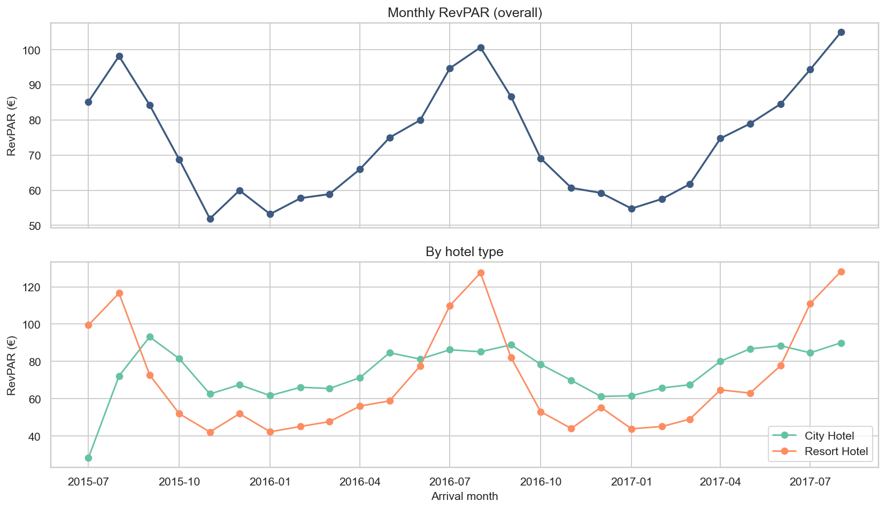
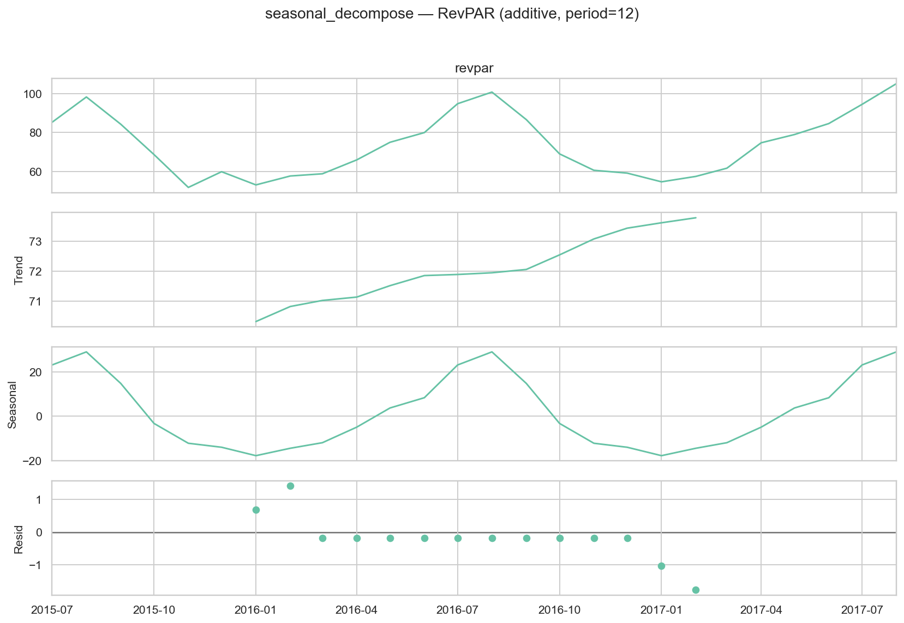
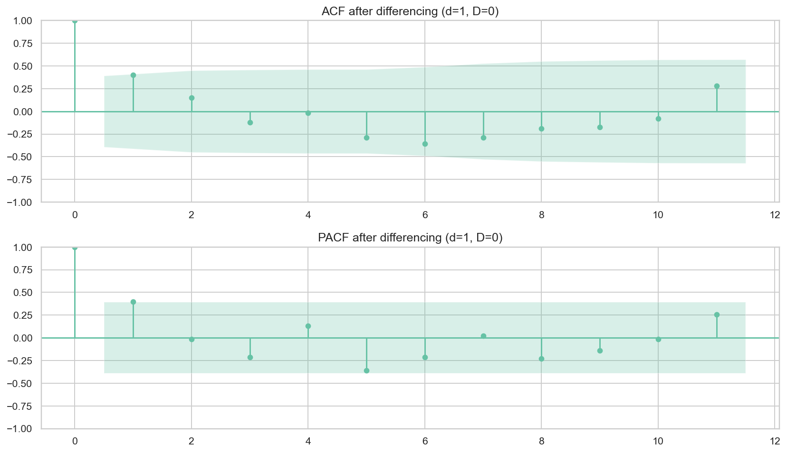
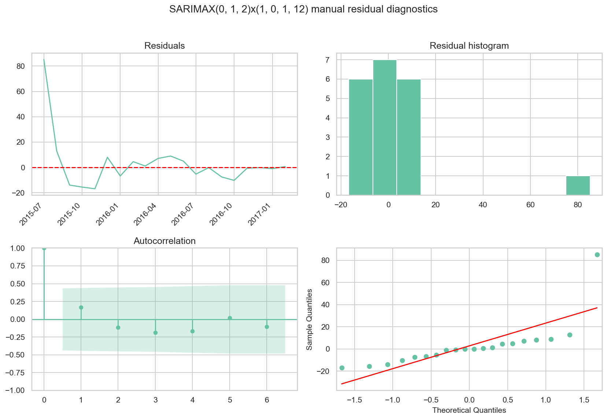
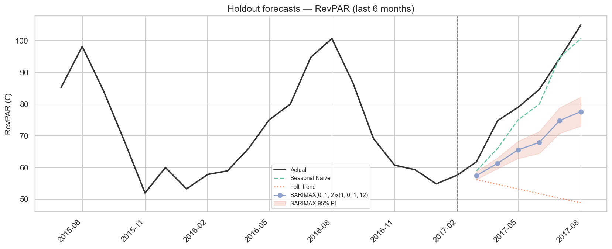
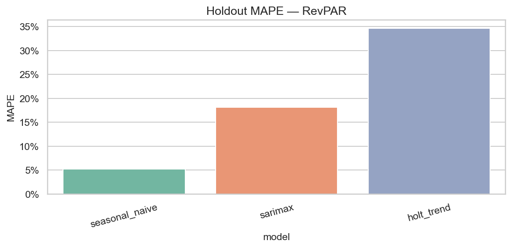
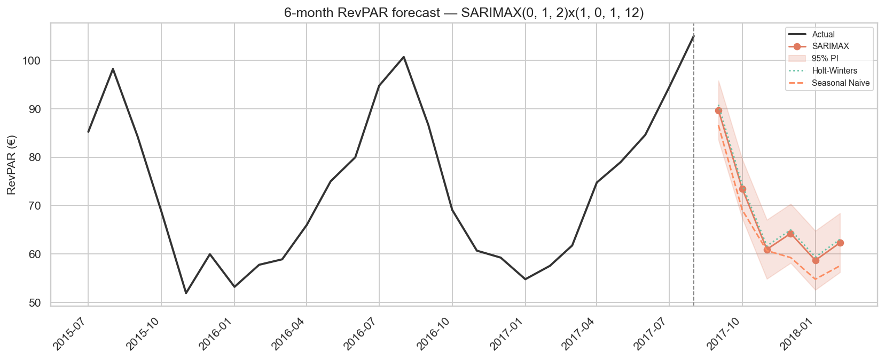
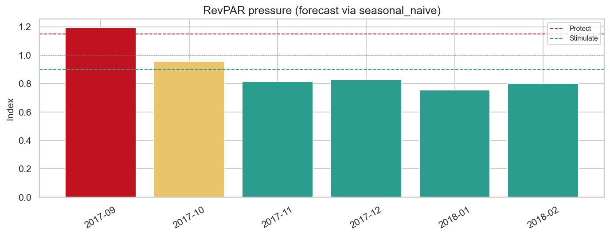

# 18b — RevPAR Forecasting for Dynamic Pricing (statsmodels)

> **Nguồn dữ liệu:** `hotel_bookings_v5.csv`  
> **Phạm vi:** RevPAR tháng (proxy) · 26 tháng (2015-07 → 2017-08)  
> **Mean RevPAR lịch sử:** **73,92 €** · Min 51,92 · Max 105,00  
> **Công thức (nb 01):** `RevPAR = ADR × Occupancy_Rate`  
> · ADR = mean `adr` stay (`adr > 0`)  
> · Occupancy_Rate = tỷ lệ booking không hủy (proxy — **không** phải inventory thật)  
> **Skill:** [`statsmodels`](../.cursor/skills/statsmodels/SKILL.md) — Workflow 4 Time Series Forecasting  
> **Library:** statsmodels **0.14.6**  
> **Notebook:** [`notebooks/18b_demand_forecasting_dynamic_pricing_RevPAR.ipynb`](../notebooks/18b_demand_forecasting_dynamic_pricing_RevPAR.ipynb)  
> **Figures:** [`reports/figures/18_revpar/`](./figures/18_revpar/) · KPI: [`kpi_summary.csv`](./figures/18_revpar/kpi_summary.csv)  
> **Liên kết:** demand [`18_...md`](18_demand_forecasting_dynamic_pricing.md) · ADR forecast [`18a_...md`](18a_demand_forecasting_dynamic_pricing_adr.md) · ADR strategy [`17_adr_strategy_analysis.md`](17_adr_strategy_analysis.md)

---

## Mục tiêu

Dự báo **RevPAR tháng** (metric tổng hợp giá × công suất proxy) theo pipeline **statsmodels**:

1. Plot + `seasonal_decompose`  
2. Stationarity **ADF / KPSS** → chọn `d`, `D`  
3. **ACF / PACF**  
4. **SARIMAX** grid (AIC/BIC) + **Holt–Winters / Holt**  
5. Residual diagnostics (`plot_diagnostics`, Ljung–Box)  
6. Forecast có **95% prediction interval**  
7. Holdout vs **Seasonal Naive** baseline  

**Vì sao RevPAR:** một số duy nhất phản ánh đồng thời **giá (ADR)** và **công suất (occupancy proxy)** — phù hợp theo dõi hiệu quả revenue tổng hợp sau khi đã có demand (nb 18) và ADR (nb 18a).

---

## 1. Series & decomposition

### 1.1 Monthly RevPAR (overall + by hotel)

**Insight**

- Chuỗi **26 tháng**, mean RevPAR **73,92 €** — thấp hơn mean ADR (~103 €) đúng như kỳ vọng vì nhân với Occupancy_Rate < 1.  
- Biên độ mùa rõ: thấp đông, cao hè — kết hợp pattern ADR + occupancy.  
- City vs Resort lệch biên độ → khi tối ưu RevPAR nên tách property.  
- **Hàm ý:** RevPAR là KPI điều hành tổng hợp; vẫn cần nhìn tách ADR và occupancy khi stance mâu thuẫn (giá cao / occ thấp hoặc ngược lại).

### 1.2 Seasonal decompose

**Insight**

- Thành phần **seasonal** (period=12) tách rõ — seasonality năm thống trị.  
- **Trend** tăng nhẹ qua mẫu (mix năm lệch + ADR 2017 cao hơn).  
- Residual còn nhiễu → AR/MA sau differencing vẫn cần.  
- **Hàm ý:** ưu tiên model seasonal (SARIMAX / HW / Seasonal Naive).

---

## 2. Stationarity (ADF + KPSS)

| Series | n | ADF p | ADF stationary | KPSS p | KPSS stationary |
|---|---:|---:|:---:|---:|:---:|
| level | 26 | 0,074 | No | 0,100 | Yes |
| **diff1** | 25 | 0,003 | **Yes** | 0,100 | **Yes** |
| seasonal_diff12 | 14 | 0,944 | No | 0,100 | Yes |
| diff1_seasonal12 | 13 | ≈0 | Yes | 0,042 | No |

**Chọn differencing:** `d=1`, `D=0`.

**Insight**

- Level chưa đạt ADF → không fit trên level thô.  
- Chỉ **`diff1`** đạt cả ADF + KPSS với n hợp lý.  
- `diff1_seasonal12` KPSS fail — tránh over-differencing.  
- **Hàm ý:** giữ `d=1` + seasonal AR/MA `(P,0,Q,12)`.

### 2.1 ACF / PACF sau differencing

**Insight**

- ACF/PACF định hướng `p,q` / `P,Q`; n nhỏ → quyết định cuối = **AIC + holdout**.  
- **Hàm ý:** grid nhỏ `p,q∈{0,1,2}`, `P,Q∈{0,1}` giống nb 18 / 18a.

---

## 3. SARIMAX selection & residual diagnostics

Train = 20 tháng đầu · Test/holdout = 6 tháng cuối.

**Best by AIC:** `SARIMAX(0,1,2)×(1,0,1,12)`  
- AIC ≈ **18,3** · BIC ≈ **15,3**  

(Grid: [`sarimax_aic_grid.csv`](./figures/18_revpar/sarimax_aic_grid.csv).)

**Insight (model selection)**

- Order giống cấu trúc demand nb 18 (`(0,1,2)×(1,0,1,12)`) — RevPAR kế thừa cả volume và giá.  
- Train 20 điểm → AIC loại model kém, không đủ để chốt primary.  
- HW seasonal không fit trên train → **Holt trend** fallback.

### 3.1 Residual diagnostics (train)

| Model | Ljung–Box p (lag 6) | Ljung–Box p (lag 12) |
|---|---:|---:|
| SARIMAX | 0,81 | 0,98 |
| Holt trend (train fallback) | 0,27 | 0,08 |

**Insight**

- Ljung–Box SARIMAX rất “sạch” in-sample (p cao) — nhưng **không đảm bảo** thắng ngoài mẫu.  
- Residual std ~**21 €** trên mean ~74 €.  
- **Hàm ý:** vẫn bắt buộc so holdout với Naive trước khi chọn primary.

---

## 4. Holdout accuracy (6 tháng)

### 4.1 Holdout forecasts + 95% PI

**Insight**

- **Seasonal Naive** bám actual sát trên Mar–Aug 2017; SARIMAX **thiên thấp** rõ ở Apr–Aug.  
- PI 95% coverage = **0%** — interval lệch hoàn toàn (under-forecast): **không dùng PI SARIMAX** làm risk band.  
- Holt trend thiếu mùa → kém nhất.  
- **Hàm ý:** point forecast RevPAR = **Seasonal Naive**; SARIMAX chỉ đối chứng cho đến khi có thêm dữ liệu / exog.

### 4.2 Holdout MAPE

| Model | MAE | RMSE | MAPE |
|---|---:|---:|---:|
| **Seasonal Naive** | 4,1 | 4,8 | **5,2%** |
| SARIMAX(0,1,2)(1,0,1)₁₂ | 15,8 | 17,3 | 18,1% |
| Holt trend | 30,8 | 34,8 | 34,6% |

**Insight**

- **Best holdout = Seasonal Naive (MAPE 5,2%)** — tốt hơn hẳn SARIMAX (18,1%).  
- Pattern giống **demand nb 18** (Naive thắng), khác **ADR nb 18a** (SARIMAX thắng): RevPAR bị kéo bởi occupancy/volume theo năm → “copy mùa năm trước” ổn định hơn.  
- AIC tốt trên train **không** chuyển thành thắng ngoài mẫu.  
- **Hàm ý:** primary RevPAR = Seasonal Naive; giữ SARIMAX để theo dõi khi có ≥36 tháng.

---

## 5. Forecast 6 tháng (full-sample refit)

Primary cho stance = model thắng holdout → **Seasonal Naive**.  
SARIMAX / Holt–Winters đối chứng (+ PI minh họa).

| Tháng | **Seasonal Naive (primary)** | SARIMAX | SARIMAX 95% PI | Holt–Winters |
|---|---:|---:|---|---:|
| 2017-09 | **86,6** | 89,7 | [83,6, 95,8] | 90,8 |
| 2017-10 | **69,1** | 73,5 | [67,4, 79,6] | 74,3 |
| 2017-11 | **60,7** | 61,0 | [54,9, 67,1] | 61,7 |
| 2017-12 | **59,2** | 64,2 | [58,1, 70,3] | 65,0 |
| 2018-01 | **54,8** | 58,7 | [52,6, 64,8] | 59,4 |
| 2018-02 | **57,6** | 62,3 | [56,2, 68,4] | 63,0 |

File: [`forecast_next_6m.csv`](./figures/18_revpar/forecast_next_6m.csv)

**Insight**

- Ba model **đồng thuận hướng mùa**: Sep cao; Dec–Jan đáy; Feb hồi nhẹ.  
- SARIMAX / HW hơi cao hơn Naive ở hầu hết tháng — divergence vừa phải ở Sep–Oct, lớn hơn Dec–Feb.  
- PI không đáng tin trên holdout → không harden / nới chỉ vì cận PI.  
- **Hàm ý:** Sep bảo vệ revenue; Nov–Feb kích cầu có kiểm soát; đọc kèm ADR (18a) và demand (18).

---

## 6. Pricing stance (RevPAR pressure)

| Tháng | Forecast (Naive) | Pressure | Stance |
|---|---:|---:|---|
| 2017-09 | 86,6 | 1,19 | **PROTECT** |
| 2017-10 | 69,1 | 0,96 | NEUTRAL |
| 2017-11 | 60,7 | 0,81 | **STIMULATE** |
| 2017-12 | 59,2 | 0,82 | **STIMULATE** |
| 2018-01 | 54,8 | 0,75 | **STIMULATE** |
| 2018-02 | 57,6 | 0,80 | **STIMULATE** |

**Insight**

- **Sep PROTECT** — đồng thuận với ADR 18a (PROTECT) và gần protect volume Oct ở nb 18.  
- **Nov–Feb STIMULATE** — cửa sổ yếu về RevPAR tổng hợp; cần kích cầu + giữ floor ADR.  
- Oct **NEUTRAL** — cân bằng rate–occ.  
- Stance = `0,5·season_index + 0,5·RevPAR_forecast_index`.  
- **Hàm ý playbook:** khi RevPAR STIMULATE nhưng ADR PROTECT (hiếm) → ưu tiên occ; khi cả hai STIMULATE → promo có floor; khi cả hai PROTECT → harden BAR + bảo vệ inventory.

---

## 7. Gợi ý chiến lược

Kết hợp **RevPAR (18b)** + **demand (18)** + **ADR (18a / 17)** thành một playbook điều hành.

### 7.1 Thông điệp điều hành

1. **Primary RevPAR forecast = Seasonal Naive** (MAPE 5,2%) — KPI tổng hợp cho rate–inventory; SARIMAX chưa dùng làm primary / PI.  
2. **Mùa thống trị**: Sep PROTECT; Nov–Feb STIMULATE; Oct NEUTRAL.  
3. **Đối chiếu 3 tín hiệu** mỗi tháng: volume (18) · ADR (18a) · RevPAR (18b) — nếu lệch nhau, ưu tiên hành động theo lever bị yếu (occ vs rate).  
4. **RevPAR là proxy** (không có rooms available thật) — dùng cho xu hướng / stance, không dùng như RevPAR kế toán.  
5. **Tách City vs Resort** khi triển khai.

### 7.2 Playbook theo stance forecast

| Tháng (minh họa) | Stance | Gợi ý chiến lược |
|---|---|---|
| **2017-09** | **PROTECT** | Harden BAR + bảo vệ inventory; hạn chế dump OTA; ưu tiên Direct / room class cao |
| **2017-10** | NEUTRAL | Hold rate–occ balance; weekend surcharge nếu pickup mạnh |
| **2017-11** | **STIMULATE** | Promo mid-week / early-bird; mở bán linh hoạt hơn |
| **2017-12** | **STIMULATE** | Package / F&B bundle; giữ floor ADR (xem 18a NEUTRAL) |
| **2018-01** | **STIMULATE** | Campaign kích cầu mạnh nhất; LOS promo; floor rõ |
| **2018-02** | **STIMULATE** | Tiếp tục kích cầu nhẹ; chuyển dần sang hold khi vào shoulder |

### 7.3 Đối chiếu 3 notebook (minh họa Sep 2017 → Feb 2018)

| Tháng | Demand (18) | ADR (18a) | RevPAR (18b) | Ưu tiên hành động |
|---|---|---|---|---|
| Sep | NEUTRAL | **PROTECT** | **PROTECT** | Harden BAR; bảo vệ inventory |
| Oct | NEUTRAL≈protect | NEUTRAL | NEUTRAL | Hold; hạn chế dump |
| Nov | NEUTRAL | **STIMULATE** | **STIMULATE** | Promo có floor |
| Dec | **STIMULATE** | NEUTRAL | **STIMULATE** | Kích cầu volume; giữ ADR floor |
| Jan | **STIMULATE** | **STIMULATE** | **STIMULATE** | Kích cầu mạnh + floor |
| Feb | NEUTRAL | **STIMULATE** | **STIMULATE** | Promo nhẹ; chuẩn bị shoulder |

### 7.4 Playbook theo lever

| Lever | Hành động đề xuất |
|---|---|
| **Rate calendar** | Sep harden; Nov–Feb promo có floor theo ADR 18a; depth giảm giá theo gap pickup vs Naive RevPAR |
| **Occupancy lever** | Tháng STIMULATE RevPAR + demand: mở bán / overbook thận trọng (nb 16); tháng PROTECT: siết inventory |
| **Weekend premium** | Sep: áp chọn lọc; tháng STIMULATE: giảm / bỏ premium |
| **Channel mix** | PROTECT → Direct; STIMULATE → OTA kiểm soát commission |
| **Model ops** | Re-fit quý; nếu Naive thua SARIMAX ≥2 điểm MAPE × 2 cửa sổ → đổi primary; bổ sung capacity thật khi có |

### 7.5 Ưu tiên triển khai (90 ngày)

| Ưu tiên | Việc làm | Kết quả kỳ vọng |
|---|---|---|
| P0 | Lock playbook Sep (PROTECT) + Nov–Jan (STIMULATE) theo bảng 7.2–7.3 | Đồng bộ volume–ADR–RevPAR |
| P1 | Dashboard 3 series: demand · ADR · RevPAR actual vs forecast | Phát hiện sớm lệch occ vs rate |
| P2 | Facet City vs Resort | Tránh one-size làm lệch RevPAR |
| P3 | Khi có capacity thật: thay Occupancy proxy bằng Rooms sold / Available | RevPAR gần định nghĩa ngành |

---

## 8. KPI

| Metric | Value |
|---|---|
| n_months | 26 |
| mean RevPAR (history) | 73,92 € |
| formula | RevPAR = ADR × Occupancy_Rate (proxy) |
| differencing | d=1, D=0 |
| best SARIMAX (AIC) | (0,1,2)×(1,0,1,12) |
| best holdout model | **seasonal_naive** |
| best holdout MAPE | **5,2%** |
| SARIMAX holdout MAPE | 18,1% |
| SARIMAX PI95 coverage | 0% |
| statsmodels | 0.14.6 |

---

## 9. Giới hạn (statsmodels + dữ liệu ngắn)

- Chỉ ~26 điểm; HW seasonal không fit trên train holdout.  
- SARIMAX AIC tốt nhưng holdout kém + **PI coverage 0%** — không dùng cho point hay risk band.  
- Occupancy là **proxy booking success**, không phải phòng available thật → RevPAR mang tính xu hướng.  
- Dataset lệch năm — forecast 2018 minh họa.  
- Mục 7 **recommend-only**; validate với pickup, competitive set và (nếu có) capacity.  
- Bước tiếp: thêm năm; exog; capacity thật; nối [`18_...md`](18_demand_forecasting_dynamic_pricing.md) + [`18a_...md`](18a_demand_forecasting_dynamic_pricing_adr.md).

---

*Báo cáo sinh từ `notebooks/18b_demand_forecasting_dynamic_pricing_RevPAR.ipynb` (statsmodels Workflow 4).*
