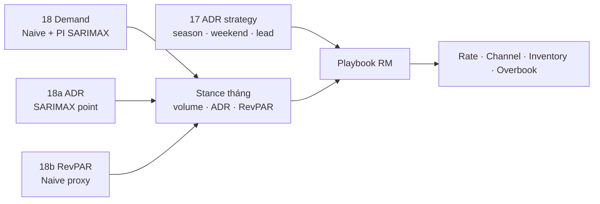

# Key Findings sau tất cả mô hình dự báo Demand · ADR · RevPAR

> **Loại:** Tổng hợp executive — Holdout accuracy · Primary model · Pricing stance · Playbook điều hành  
> **Dữ liệu:** `hotel_bookings_v5.csv` · stay bookings · **26 tháng** (2015-07 → 2017-08)  
> **Phạm vi series:** **Demand** (n=59.527 stay) · **ADR** (mean 102,77 €) · **RevPAR** (proxy ADR × Occupancy_Rate, mean 73,92 €)  
> **Pipeline:** statsmodels Workflow 4 — ADF/KPSS · SARIMAX grid · Holt/HW · Seasonal Naive · holdout 6 tháng · forecast 6 tháng  
> **Nguồn chính:** `18` Demand · `18a` ADR · `18b` RevPAR · `17` ADR strategy · KPI `figures/18*`  
> **Cập nhật:** 20/07/2026

---

## 1. Thông điệp điều hành

Ba chuỗi dự báo dùng **cùng pipeline statsmodels** trên mẫu ngắn (~26 điểm) nhưng **không hội tụ cùng một primary model** — đúng kỳ vọng khi volume, giá và metric tổng hợp có động lực khác nhau:

1. **Demand (volume)** — primary = **Seasonal Naive** (MAPE **6,9%**); SARIMAX chỉ hỗ trợ **dải rủi ro** (PI 95% coverage 100%).
2. **ADR (€/đêm)** — primary = **SARIMAX(2,1,2)×(1,0,1,12)** (MAPE **6,7%**); thắng rõ Naive (13,2%) nhưng **PI không tin được** (coverage 16,7%).
3. **RevPAR (proxy)** — primary = **Seasonal Naive** (MAPE **5,2%**); SARIMAX holdout kém (18,1%) + PI coverage **0%**.
4. **Mùa vẫn thống trị cả 3 series** — Sep mạnh (PROTECT giá/RevPAR); Dec–Jan yếu (STIMULATE volume ± giá); Oct cân bằng / gần protect volume.
5. **Điều hành = đối chiếu 3 tín hiệu mỗi tháng** (volume · ADR · RevPAR) — không harden BAR chỉ từ một series.

| Mục tiêu vận hành | Series / model khuyến nghị | Lý do |
|---|---|---|
| Rate calendar volume (rooms/tháng) | **Demand · Seasonal Naive** | Holdout MAPE 6,9%; PI SARIMAX = risk band |
| BAR / ADR ladder (€/đêm) | **ADR · SARIMAX** | Holdout MAPE 6,7%; Δ vs Naive ≈ −6 pp |
| KPI tổng hợp rate × occ | **RevPAR · Seasonal Naive** | Holdout MAPE 5,2%; proxy xu hướng, không kế toán |
| Risk band 95% | Chỉ **Demand SARIMAX** | Coverage 100%; ADR/RevPAR PI **không** dùng |
| Stance pricing tháng | **Bảng đối chiếu 3 stance** (§6) | Ưu tiên lever yếu (occ vs rate) khi lệch |

> Chi tiết từng series: [`18_demand_forecasting_dynamic_pricing.md`](18_demand_forecasting_dynamic_pricing.md) · [`18a_..._adr.md`](18a_demand_forecasting_dynamic_pricing_adr.md) · [`18b_..._RevPAR.md`](18b_demand_forecasting_dynamic_pricing_RevPAR.md).

---

## 2. So sánh mô hình — metrics tổng hợp

### 2.1 Bảng holdout (6 tháng cuối · train 20 tháng)

| Series | Primary (holdout) | Best MAPE | Naive MAPE | SARIMAX MAPE | Δ primary vs Naive | SARIMAX order (AIC) | PI95 coverage |
|---|---|---:|---:|---:|---:|---|---:|
| **Demand** | Seasonal Naive | **6,9%** | 6,9% | 9,1% | 0 (baseline thắng) | (0,1,2)×(1,0,1,12) | **100%** |
| **ADR** | **SARIMAX** | **6,7%** | 13,2% | 6,7% | **−6,5 pp** | (2,1,2)×(1,0,1,12) | 16,7% |
| **RevPAR** | Seasonal Naive | **5,2%** | 5,2% | 18,1% | 0 (baseline thắng) | (0,1,2)×(1,0,1,12) | **0%** |

Holt trend (fallback khi HW seasonal không fit trên train): Demand MAPE 8,1% · ADR 40% · RevPAR 34,6% — **không** dùng làm primary.

### 2.2 Bài học theo series

| Observation | Interpretation | Implication | Next step |
|---|---|---|---|
| Demand & RevPAR: **Naive thắng**; ADR: **SARIMAX thắng** | Volume/occ theo năm ổn định hơn; ADR 2017 có trend tăng giá mà “copy năm trước” bỏ sót | Primary **không** chung một model cho mọi KPI | Giữ dual-track: Naive volume/RevPAR + SARIMAX ADR |
| AIC tốt trên train **không** đảm bảo thắng holdout (Demand, RevPAR) | n_train=20 → AIC chỉ lọc model kém | Chốt pricing bằng **holdout MAPE**, không bằng AIC | Re-fit quý; đổi primary nếu Naive thua ≥2 pp MAPE × 2 cửa sổ |
| PI95: Demand 100% · ADR 17% · RevPAR 0% | PI hẹp giả tạo / bias under-forecast trên ADR & RevPAR | Chỉ Demand SARIMAX làm risk band; ADR/RevPAR đọc point + đối chứng Naive | Thêm năm / exog trước khi tin PI giá |
| Cả 3 chọn `d=1`, `D=0` | Level chưa stationary; seasonal-diff đốt mẫu (n→14) | Seasonal AR/MA `(P,0,Q,12)` thay vì ép `D=1` | Giữ rule này đến khi ≥36–48 tháng |
| HW seasonal không fit trên train holdout | Cần ≥24 tháng seasonal | Full-sample mới dùng HW; holdout dùng Holt trend | Không so HW seasonal trên cửa sổ 20 tháng |

**Đọc nghiệp vụ:** Không có “một model thắng tất cả”. Volume theo mùa năm trước; giá cần cấu trúc AR/MA + seasonal; RevPAR bị kéo bởi occupancy proxy → gần Demand hơn ADR.

---

## 3. Series & seasonality — key findings

### 3.1 Bức tranh tổng thể

| Chỉ số | Demand | ADR | RevPAR |
|---|---:|---:|---:|
| Đơn vị | bookings/tháng (stay) | €/đêm (mean) | € (proxy) |
| Mean lịch sử | — (tổng 59.527 stay / 26 tháng) | **102,77 €** | **73,92 €** |
| Biên độ mùa | Thấp đông · cao hè/shoulder | Đáy ~61–80 · peak Jul–Aug ~147–167 | Kết hợp ADR × occ |
| Differencing | d=1, D=0 | d=1, D=0 | d=1, D=0 |
| Tín hiệu chính | Seasonal năm | Seasonal năm + trend giá 2017 | Seasonal năm (kéo theo volume) |


**Insight chung**

1. **Seasonality năm** tách rõ trên cả 3 `seasonal_decompose` (period=12) → ưu tiên model có seasonal term.  
2. **City vs Resort** lệch biên độ / timing → triển khai thật cần stance + BAR **tách property**.  
3. Trend tăng nhẹ qua mẫu (2015 chỉ H2, 2017 cắt Aug) — forecast 2018 mang tính **minh họa**.  
4. RevPAR mean < ADR đúng kỳ vọng (nhân Occupancy_Rate < 1) — vẫn phải nhìn tách occ vs rate khi stance mâu thuẫn.

### 3.2 Stationarity (ADF + KPSS) — đồng thuận `d=1`

| Series | Level ADF stationary | `diff1` cả ADF+KPSS | Ghi chú |
|---||:---:|:---:|---|
| Demand | No | **Yes** | seasonal_diff12: KPSS fail |
| ADR | No (ADF) | **Yes** | seasonal-diff pass nhưng n=14 |
| RevPAR | No (ADF) | **Yes** | `diff1_seasonal12` KPSS fail |

**Kết luận:** Không fit ARIMA trên level thô; tránh over-differencing `D=1` trên mẫu ngắn.

---

## 4. Primary model & holdout — xuyên suốt 3 notebook

### 4.1 Demand — Naive thắng, SARIMAX = risk band


| Model | MAE | RMSE | MAPE |
|---|---:|---:|---:|
| **Seasonal Naive** | 189,2 | 207,3 | **6,9%** |
| Holt trend | 221,9 | 250,7 | 8,1% |
| SARIMAX(0,1,2)(1,0,1)₁₂ | 251,8 | 285,3 | 9,1% |

- Ljung–Box SARIMAX train: p lag6/12 ≈ 0,17–0,18 (residuals “sạch” in-sample).  
- PI rộng nhưng **bao phủ 100%** actual holdout → dùng làm dải rủi ro, không làm point pricing.  
- **Hàm ý:** rate calendar volume = Naive; khi PI rộng / model lệch → không harden BAR.

### 4.2 ADR — SARIMAX thắng rõ


| Model | MAE | RMSE | MAPE |
|---|---:|---:|---:|
| **SARIMAX(2,1,2)(1,0,1)₁₂** | 9,1 | 11,2 | **6,7%** |
| Seasonal Naive | 16,6 | 17,4 | 13,2% |
| Holt trend | 54,9 | 62,5 | 40,0% |

- Gap ~**6 điểm %** MAPE vs Naive có ý nghĩa €/đêm cho BAR.  
- PI coverage **16,7%** → **không** dùng PI ADR làm risk band trên cửa sổ hiện tại.  
- SARIMAX full-sample thường **cao hơn Naive ~15–22 €** → kiểm tra pickup & competitive set trước khi lock BAR cao.

### 4.3 RevPAR — Naive thắng mạnh; SARIMAX lệch thấp


| Model | MAE | RMSE | MAPE |
|---|---:|---:|---:|
| **Seasonal Naive** | 4,1 | 4,8 | **5,2%** |
| SARIMAX(0,1,2)(1,0,1)₁₂ | 15,8 | 17,3 | 18,1% |
| Holt trend | 30,8 | 34,8 | 34,6% |

- Pattern giống **Demand** (Naive thắng), khác **ADR** (SARIMAX thắng).  
- PI coverage **0%** (under-forecast) → không dùng point lẫn risk band SARIMAX.  
- Occupancy là **proxy booking success**, không phải rooms available → RevPAR = xu hướng / stance, không phải RevPAR kế toán.

### 4.4 Chuỗi tiến hóa insight chọn model

```text
Demand:   AIC → SARIMAX(0,1,2)×(1,0,1,12)  → holdout → Naive thắng  → primary Naive + PI SARIMAX
   ↓
ADR:      AIC → SARIMAX(2,1,2)×(1,0,1,12)  → holdout → SARIMAX thắng → primary SARIMAX; PI bỏ
   ↓
RevPAR:   AIC → SARIMAX(0,1,2)×(1,0,1,12)  → holdout → Naive thắng mạnh → primary Naive; PI bỏ
```

**Đối chiếu leakage / định nghĩa:** RevPAR dùng proxy từ nb 01 (`ADR × Occupancy_Rate`); ADR chỉ stay `adr > 0`; Demand chỉ `is_canceled = 0` — không lẫn series khi đọc stance.

---

## 5. Forecast 6 tháng & pricing stance

### 5.1 Point forecast (primary từng series)

| Tháng | Demand (Naive) | ADR (SARIMAX) € | RevPAR (Naive) € |
|---|---:|---:|---:|
| 2017-09 | 2.573 | **143,4** | **86,6** |
| 2017-10 | 2.790 | 116,8 | 69,1 |
| 2017-11 | 2.408 | 91,4 | 60,7 |
| 2017-12 | 2.027 | 100,5 | 59,2 |
| 2018-01 | 1.966 | 88,0 | 54,8 |
| 2018-02 | 2.269 | 96,5 | 57,6 |

Ba model trong mỗi notebook **đồng thuận hướng mùa**: Sep/Oct cao hơn; Dec–Jan đáy; Feb hồi nhẹ. Divergence (SARIMAX vs Naive) dùng như tín hiệu bất định — đặc biệt Nov (Demand) và khi ADR SARIMAX >> Naive.

### 5.2 Đối chiếu stance 3 tín hiệu (Sep 2017 → Feb 2018)

Stance = `0,5·season_index + 0,5·forecast_index` (ngưỡng PROTECT / NEUTRAL / STIMULATE theo từng notebook).

| Tháng | Demand (18) | ADR (18a) | RevPAR (18b) | Ưu tiên hành động |
|---|---|---|---|---|
| **Sep** | NEUTRAL | **PROTECT** (1,29) | **PROTECT** (1,19) | Harden BAR; bảo vệ inventory; hạn chế dump OTA |
| **Oct** | NEUTRAL ≈ protect (1,13) | NEUTRAL | NEUTRAL | Hold; hạn chế dump; weekend surcharge nếu pickup mạnh |
| **Nov** | NEUTRAL | **STIMULATE** | **STIMULATE** | Promo có floor; theo dõi PI volume |
| **Dec** | **STIMULATE** | NEUTRAL | **STIMULATE** | Kích cầu volume; **giữ ADR floor** (không cắt sâu) |
| **Jan** | **STIMULATE** | **STIMULATE** | **STIMULATE** | Kích cầu mạnh nhất + floor rõ |
| **Feb** | NEUTRAL | **STIMULATE** | **STIMULATE** | Promo nhẹ; ladder dần vào shoulder |


**Quy tắc giải quyết mâu thuẫn stance**

| Tình huống | Ưu tiên |
|---|---|
| ADR + RevPAR **PROTECT**, Demand NEUTRAL | Harden BAR / inventory (Sep) |
| Demand **STIMULATE**, ADR NEUTRAL, RevPAR STIMULATE | Kích cầu volume, giữ floor giá (Dec) |
| Cả 3 **STIMULATE** | Promo mạnh + floor + LOS (Jan) |
| Demand gần PROTECT, ADR/RevPAR NEUTRAL | Hạn chế dump OTA; bảo vệ weekend (Oct) |

---

## 6. Bản đồ hội tụ: Forecast → Stance → Hành động



| Phát hiện forecast | Xuất hiện ở series | Hành động gợi ý |
|---|---|---|
| Naive đủ tốt cho volume/RevPAR | 18, 18b | Primary calendar = Seasonal Naive |
| SARIMAX bắt trend giá | 18a | Primary BAR = SARIMAX; đối chiếu Naive |
| PI chỉ đáng tin ở Demand | 18 | Risk band volume; bỏ PI ADR/RevPAR |
| Sep PROTECT giá/RevPAR | 18a, 18b | Harden BAR; Direct; hạn chế Groups dump |
| Dec–Jan STIMULATE (volume ± giá) | cả 3 | Promo / package / LOS; giữ floor |
| City ≠ Resort biên độ | cả 3 | Facet property khi live |
| Nối hủy / overbook | 15, 16 | STIMULATE: overbook thận trọng; PROTECT: siết cọc |

### Gợi ý ưu tiên vận hành (90 ngày)

| Ưu tiên | Hành động | Cơ sở |
|---|---|---|
| **P0** | Lock playbook **Sep PROTECT** + **Nov–Jan STIMULATE** theo bảng §5.2 | Đồng bộ 3 stance |
| **P0** | Rate calendar: volume = Naive; ADR = SARIMAX; RevPAR = Naive (KPI) | Holdout MAPE tốt nhất từng series |
| **P1** | Dashboard 3 series: actual vs forecast (+ PI Demand) | Cảnh báo lệch occ vs rate sớm |
| **P1** | Pickup tuần vs forecast: lệch >10% → chỉnh depth promo / harden | Giảm void / over-discount |
| **P2** | Facet City vs Resort (stance + BAR riêng) | Tránh one-size lệch RevPAR |
| **P3** | Khi có capacity thật: thay Occupancy proxy | RevPAR gần định nghĩa ngành |
| **P3** | Model ops quý: re-fit holdout; đổi primary nếu Naive thua ≥2 pp × 2 cửa sổ | Tránh bám model sai mùa |

### Playbook theo lever (tổng hợp)

| Lever | Hành động đề xuất |
|---|---|
| **Rate calendar** | Sep harden; Nov–Feb promo có floor theo ADR 18a; depth theo gap pickup vs Naive volume/RevPAR |
| **Weekend premium** | Sep chọn lọc (+6–8 € từ nb 17); tháng STIMULATE: giảm/bỏ; Jul–Aug (lịch sử): ADR nền đã cao |
| **Booking window** | PROTECT: bảo vệ last-minute BAR; STIMULATE: early-bird có floor |
| **Channel mix** | PROTECT → Direct; STIMULATE → OTA kiểm soát commission |
| **Inventory / overbook** | Nối [`15`](15_policy_scenario.md) / [`16`](16_overbooking_policy.md): STIMULATE mở linh hoạt hơn; PROTECT siết |
| **Model ops** | Không dùng PI ADR/RevPAR; theo dõi PI Demand coverage; bổ sung exog khi ≥36 tháng |

---

## 7. Hạn chế cần nhớ khi đọc findings

1. **~26 điểm** — HW seasonal không fit trên train holdout; SARIMAX PI dễ lệch; power thấp.  
2. **AIC ≠ ngoài mẫu** — đặc biệt Demand & RevPAR.  
3. **RevPAR là proxy** (`ADR × Occupancy_Rate` booking success) — không phải rooms sold / available.  
4. **Dataset lệch năm** (2015 H2 / 2017 cắt Aug) — horizon 2018 minh họa.  
5. **ADR** = giá tại thời điểm đặt, không phải BAR gán phòng thực tế.  
6. Stance & playbook là **recommend-only** — validate với pickup, competitive set, chi phí channel.  
7. Chưa tách City/Resort trong primary model tổng hợp — biên độ khác nhau đã thấy trên plot.

---

## 8. Tài liệu nguồn

| File | Nội dung dùng trong báo cáo này |
|---|---|
| [`18_demand_forecasting_dynamic_pricing.md`](18_demand_forecasting_dynamic_pricing.md) | Demand series, Naive primary, PI, stance volume |
| [`18a_demand_forecasting_dynamic_pricing_adr.md`](18a_demand_forecasting_dynamic_pricing_adr.md) | ADR series, SARIMAX primary, stance giá |
| [`18b_demand_forecasting_dynamic_pricing_RevPAR.md`](18b_demand_forecasting_dynamic_pricing_RevPAR.md) | RevPAR proxy, Naive primary, bảng đối chiếu 3 stance |
| [`17_adr_strategy_analysis.md`](17_adr_strategy_analysis.md) | Season / weekend / lead-time ADR playbook |
| [`15_policy_scenario.md`](15_policy_scenario.md) · [`16_overbooking_policy.md`](16_overbooking_policy.md) | Nối hủy & overbooking theo mùa |
| [`./figures/18/kpi_summary.csv`](./figures/18/kpi_summary.csv) · [`18_adr`](./figures/18_adr/kpi_summary.csv) · [`18_revpar`](./figures/18_revpar/kpi_summary.csv) | KPI holdout / order / coverage |
| Notebooks `18` / `18a` / `18b` | Pipeline statsmodels Workflow 4 |

---

## 9. Suggested next experiments

1. **Thêm ≥12 tháng** (hoặc full năm 2015–2018+) rồi re-run holdout — kiểm tra Naive vs SARIMAX còn giữ ranking không.  
2. **SARIMAX + exog** (`lead_time` mix, channel share, Online TA %) — đặc biệt để cải thiện PI ADR/RevPAR.  
3. **Facet City vs Resort** — primary model + stance riêng; đo Δ RevPAR vs one-size.  
4. **Capacity thật** — thay Occupancy proxy; so RevPAR kế toán vs proxy stance.  
5. **Backtest stance** — nếu áp PROTECT/STIMULATE theo bảng §5.2 trên cửa sổ lịch sử, ADR×occ thực có tốt hơn baseline BAR cố định không.

---

*Báo cáo tổng hợp key findings sau chuỗi dự báo Demand · ADR · RevPAR (nb 18 / 18a / 18b), đối chiếu holdout và pricing stance. Cập nhật: 20/07/2026.*
