# 20 — Demand Forecasting: City vs Resort (statsmodels)

> **Nguồn dữ liệu:** `hotel_bookings_v5.csv`  
> **Phạm vi:** stay bookings (`is_canceled = 0`) · **tách property** · 26 tháng (2015-07 → 2017-08)  
> **City:** 35.137 stay · mean ~1.351 booking/tháng · **Resort:** 24.390 stay · mean ~938 booking/tháng  
> **Pipeline:** statsmodels Workflow 4 (ADF/KPSS · SARIMAX · Holt/HW · Seasonal Naive · holdout 6 tháng)  
> **Notebook:** [`notebooks/20_demand_forecasting_dynamic_pricing_city_resort.ipynb`](../notebooks/20_demand_forecasting_dynamic_pricing_city_resort.ipynb)  
> **Figures:** [`reports/figures/20/`](./figures/20/) · so sánh: [`compare_city_vs_resort.csv`](./figures/20/compare_city_vs_resort.csv)  
> **Clone từ:** [`18_demand_forecasting_dynamic_pricing.md`](18_demand_forecasting_dynamic_pricing.md) (overall) → facet City / Resort  
> **Cập nhật:** 21/07/2026

---

## Mục tiêu

Dự báo **demand tháng riêng** cho City Hotel và Resort Hotel, rồi đối chiếu:

1. Overview City vs Resort  
2. Stationarity · ACF/PACF · SARIMAX + Holt · residuals (per hotel)  
3. Holdout 6 tháng vs Seasonal Naive  
4. Forecast 6 tháng + pricing stance  
5. **So sánh nghiệp vụ** giữa hai property  

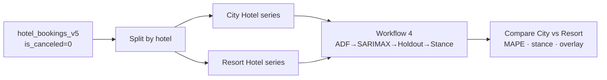

---

## 1. Overview series — City vs Resort

**Đọc biểu đồ:** Hai đường booking/tháng trên cùng trục thời gian. City (xanh dương) luôn cao hơn Resort (xanh lá) về mức tuyệt đối; quan trọng hơn là **biên độ mùa và pha** — cùng peak hè / đáy đông hay lệch?

**Insight + ý nghĩa kinh doanh**

| Quan sát trên chart | Ý nghĩa City | Ý nghĩa Resort |
|---|---|---|
| City volume ~1,4× Resort (mean) | Lịch inventory / overbook phải scale theo City | Không copy depth promo của City |
| Cùng nhịp năm (hè cao, đông thấp) | Seasonal Naive hợp lý làm baseline | Cùng logic mùa nhưng **biên độ khác** |
| Resort sóng “gọn” hơn City | City chịu shock midweek / OTA nhiều hơn | Resort dễ dự báo hơn trên holdout (MAPE thấp hơn) |

**Hàm ý:** one-size overall (nb 18) làm mượt lệch property → **rate calendar volume phải tách City / Resort**.

### 1.1 Series từng hotel

| | City Hotel | Resort Hotel |
|---|---:|---:|
| Tổng stay (26 tháng) | **35.137** | **24.390** |
| Mean / tháng | ~1.351 | ~938 |
| Differencing chọn | d=1, D=0 | d=1, D=0 (level đã pass cả ADF+KPSS; vẫn ưu tiên diff1 trong grid) |

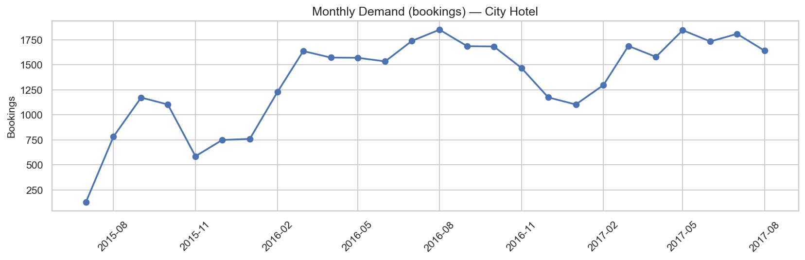

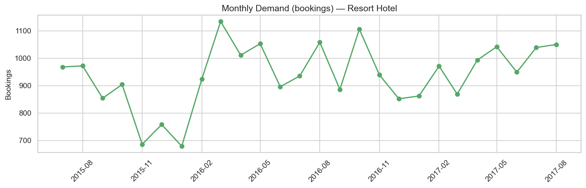

**Đọc biểu đồ:** Mỗi panel = một property. So đỉnh–đáy: City peak cao hơn tuyệt đối; Resort vẫn có Jul–Aug mạnh nhưng nền thấp hơn → cùng % STIMULATE/PROTECT có thể cần **depth promo khác**.

---

## 2. Seasonality & stationarity

### 2.1 Seasonal decompose

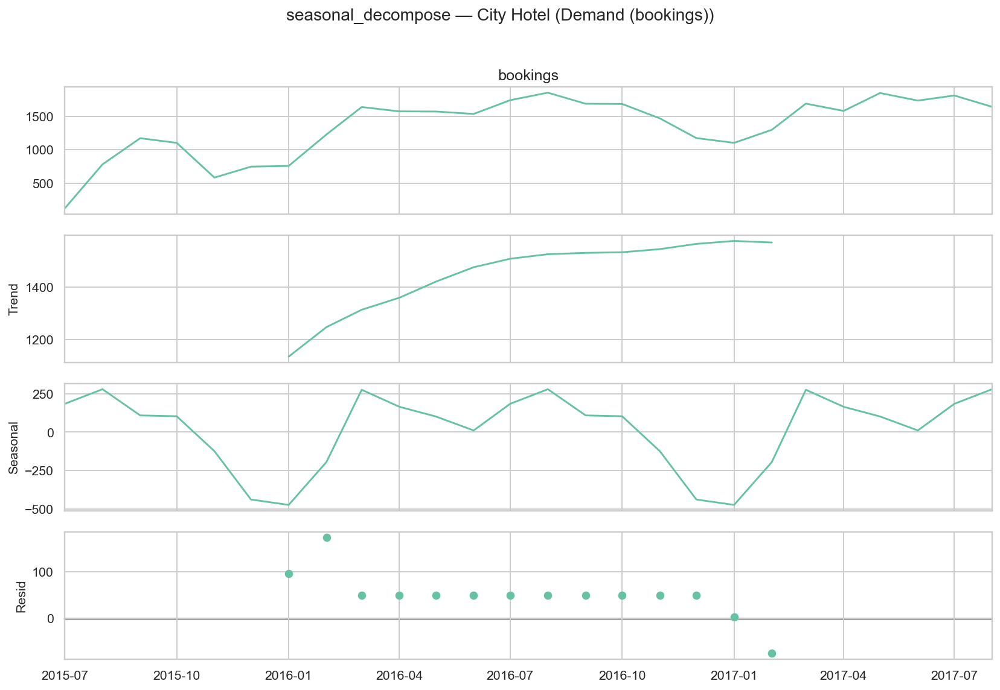

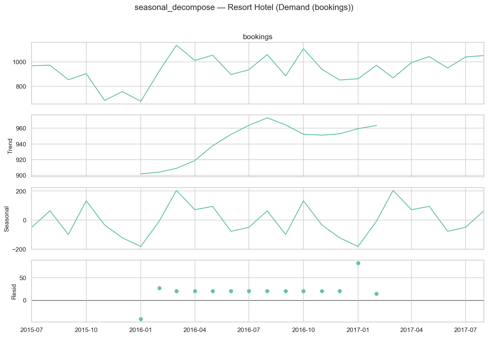

**Đọc biểu đồ:** Trend + seasonal (period=12) + residual. Seasonal rõ = tín hiệu chính cho pricing theo tháng.

**So sánh**

- Cả hai có **seasonal năm rõ** → ưu tiên model có seasonal term.  
- City residual lớn hơn (volume lớn + nhiễu OTA) → PI / MAPE SARIMAX dễ xấu hơn.  
- **Hàm ý:** không ép một SARIMAX order chung; chọn primary **theo holdout từng hotel**.

### 2.2 ACF / PACF (sau differencing)

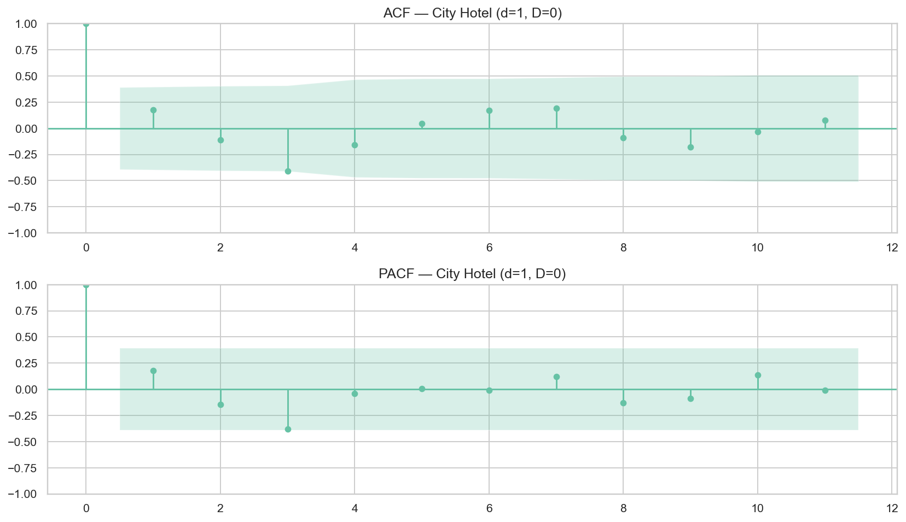

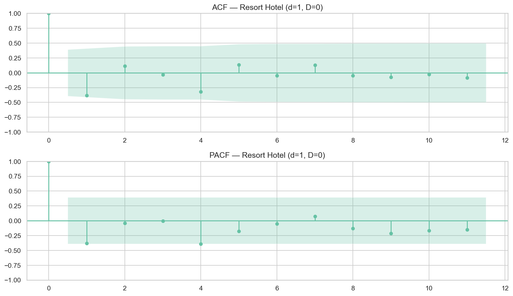

**Đọc biểu đồ:** “Trí nhớ” sau khi làm phẳng. Chỉ định hướng; chốt model ở holdout MAPE.

---

## 3. Model selection & residuals

| Hotel | Best AIC SARIMAX | AIC | Train HW |
|---|---|---:|---|
| **City** | (2,1,2)×(1,0,1,12) | 54,3 | Holt trend (n_train=20 &lt; 24) |
| **Resort** | (0,1,2)×(1,0,1,12) | 49,5 | Holt trend |

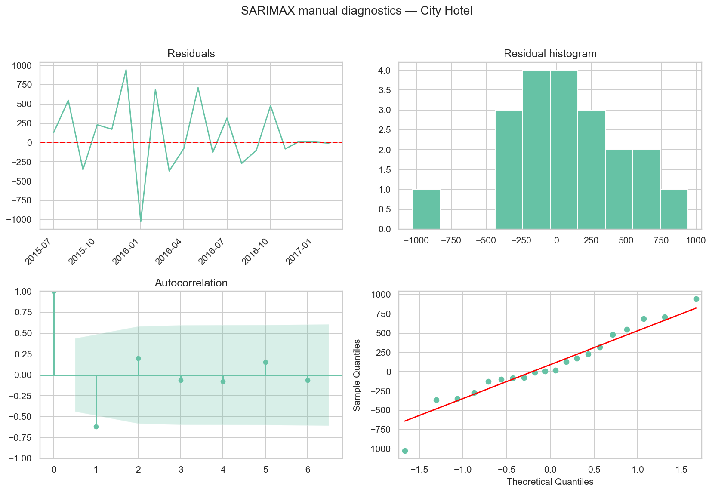

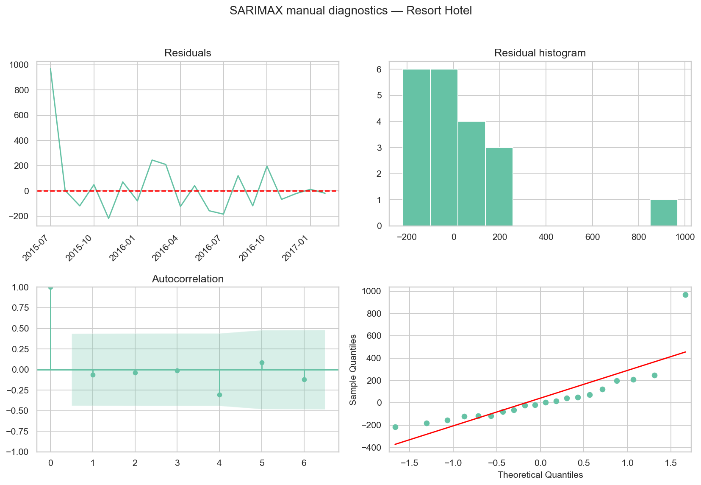

| Hotel | Ljung–Box SARIMAX p(lag6) | Ghi chú |
|---|---:|---|
| City | 0,09 | Biên; residual std lớn (~450) |
| Resort | 0,76 | Residuals “sạch” hơn in-sample |

**Hàm ý:** AIC / residuals train **không** đủ để chọn primary — City AIC “đẹp” nhưng holdout SARIMAX rất kém (§4).

---

## 4. Holdout accuracy — so sánh City vs Resort

### 4.1 Holdout forecasts

**Đọc biểu đồ:** 6 tháng giấu — ai bám actual? Vùng tô = PI 95% SARIMAX.

| Hotel | Primary (holdout) | Best MAPE | Naive | SARIMAX | Holt | PI95 coverage |
|---|---|---:|---:|---:|---:|---:|
| **City** | **Seasonal Naive** | **7,8%** | 7,8% | **45,1%** | 12,2% | **0%** |
| **Resort** | **Holt trend** | **5,5%** | 8,3% | 6,1% | **5,5%** | **83,3%** |

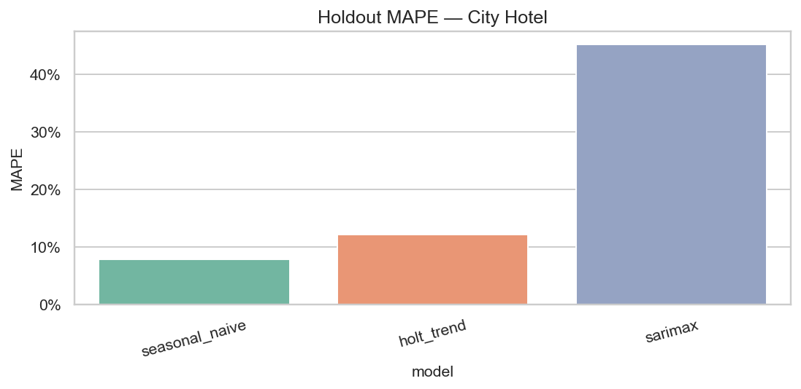

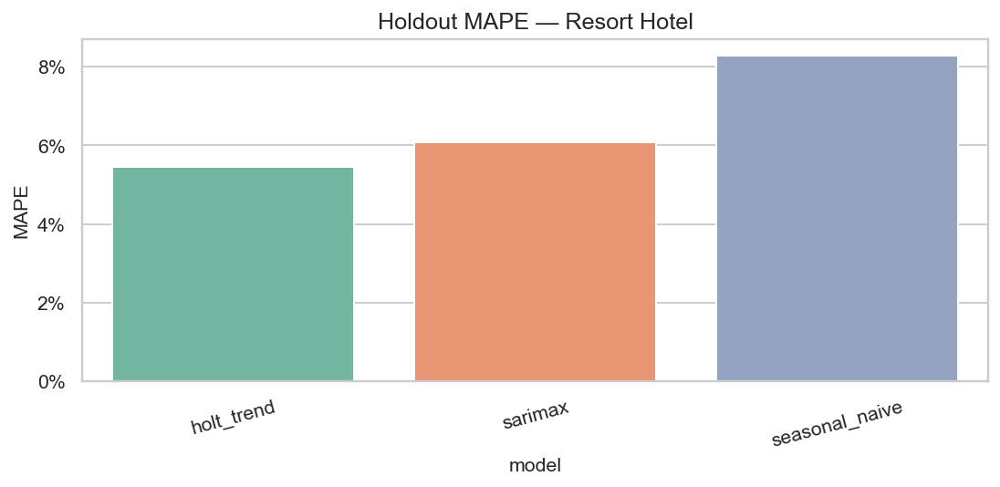

**Đọc biểu đồ MAPE:** Cột thấp = tốt. City: Naive thắng rõ, SARIMAX “vỡ”. Resort: Holt / SARIMAX gần nhau, cả hai tốt hơn Naive.

**Ý nghĩa kinh doanh**

| Phát hiện | City | Resort |
|---|---|---|
| Primary khác nhau | Volume calendar = **copy cùng tháng năm trước** | Volume có **trend ngắn** → Holt điểm tốt hơn Naive |
| SARIMAX City MAPE 45% | **Không** dùng point SARIMAX cho City inventory | SARIMAX usable (6,1%) như đối chứng |
| PI coverage | 0% → **bỏ** risk band SARIMAX City | 83% → có thể dùng PI như dải rủi ro mềm |
| Gap vs overall nb 18 | Overall Naive 6,9% che lệch property | Facet làm lộ Resort “dễ forecast” hơn City |

---

## 5. Forecast 6 tháng (full-sample)

Primary stance = model thắng holdout.

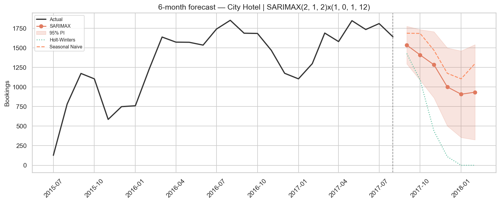

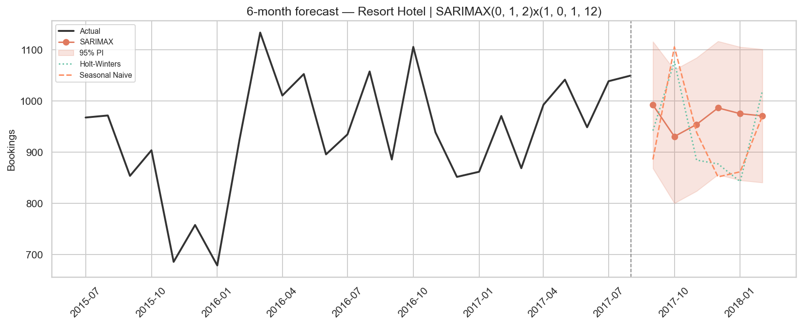

**Đọc biểu đồ overlay:** Lịch sử + 6 tháng SARIMAX (nét đứt) hai property. City luôn cao hơn; quan trọng là **hướng mùa có đồng pha không** (đồng thuận Sep–Oct mạnh hơn Dec–Jan).

| Tháng | City (Naive) | Resort (Holt) | Gap City−Resort |
|---|---:|---:|---:|
| 2017-09 | 1.687 | 942 | +745 |
| 2017-10 | 1.684 | 1.077 | +607 |
| 2017-11 | 1.469 | 885 | +584 |
| 2017-12 | 1.175 | 877 | +298 |
| 2018-01 | 1.104 | 843 | +261 |
| 2018-02 | 1.298 | 1.020 | +278 |

**Insight**

- Gap tuyệt đối **thu hẹp** Dec–Jan → mùa yếu “nén” cả hai; depth promo nên tính **% so với baseline property**, không copy số booking City sang Resort.  
- City Naive Sep–Oct ~1.680 — bảo vệ inventory / hạn chế dump.  
- Resort Holt Oct ~1.077 cao hơn Sep → shoulder Resort có thể mạnh hơn City về **áp lực phòng** tương đối.

---

## 6. Pricing stance — City vs Resort

**Đọc biểu đồ:** Cột ≥1,15 = PROTECT; ≤0,90 = STIMULATE; giữa = NEUTRAL. Đổi volume forecast thành hành động tháng **từng property**.

| Tháng | City stance | Resort stance | Ưu tiên hành động tách property |
|---|---|---|---|
| **Sep** | **PROTECT** (1,15) | NEUTRAL (0,97) | City harden BAR / siết promo; Resort hold, không copy harden City |
| **Oct** | NEUTRAL ≈ protect (1,14) | NEUTRAL (1,12) | Cả hai hạn chế dump; weekend surcharge nếu pickup mạnh |
| **Nov** | NEUTRAL (0,92) | NEUTRAL (0,91) | Hold; theo dõi pickup tuần |
| **Dec** | **STIMULATE** (0,79) | NEUTRAL (0,90) | City kích cầu rõ; Resort gần ngưỡng — promo nhẹ, giữ floor |
| **Jan** | **STIMULATE** (0,75) | **STIMULATE** (0,86) | Đồng bộ kích cầu; depth theo gap pickup từng property |
| **Feb** | NEUTRAL (0,95) | NEUTRAL (1,05) | Hold; ladder dần vào shoulder |

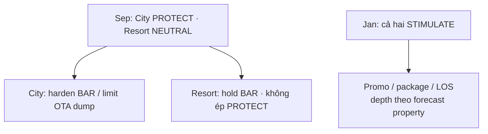

**Hàm ý playbook volume**

- **Không** áp Sep PROTECT overall nếu chỉ City cần harden.  
- Dec–Jan: City kích cầu sớm/sâu hơn Resort (pressure thấp hơn).  
- Nối [`17b_adr_strategy_analysis_city_resort`](../notebooks/17b_adr_strategy_analysis_city_resort.ipynb) cho weekend / lead-time **tách property**.

---

## 7. KPI tóm tắt

| Metric | City | Resort |
|---|---|---|
| Primary holdout | Seasonal Naive | Holt trend |
| Best MAPE | 7,8% | 5,5% |
| SARIMAX order (AIC) | (2,1,2)×(1,0,1,12) | (0,1,2)×(1,0,1,12) |
| SARIMAX MAPE | 45,1% | 6,1% |
| PI95 coverage | 0% | 83,3% |
| d / D | 1 / 0 | 1 / 0 |

File: [`kpi_summary_city_vs_resort.csv`](./figures/20/kpi_summary_city_vs_resort.csv)

---

## 8. Hạn chế

1. ~26 tháng/hotel — HW seasonal không fit trên train holdout.  
2. City SARIMAX holdout “vỡ” (MAPE 45%, PI 0%) — không dùng cho inventory City.  
3. Holt Resort thắng trên 1 cửa sổ 6 tháng — re-fit quý trước khi lock primary.  
4. Forecast 2018 minh họa (2017 cắt Aug).  
5. Recommend-only — validate với pickup & competitive set.

---

## 9. Tài liệu liên quan

| File | Vai trò |
|---|---|
| [`18_demand_forecasting_dynamic_pricing.md`](18_demand_forecasting_dynamic_pricing.md) | Overall (không facet) |
| Notebook `20` | Pipeline + figures |
| [`17b` notebook](../notebooks/17b_adr_strategy_analysis_city_resort.ipynb) | ADR strategy City vs Resort |
| Key findings facet | [`21_key_findings_after_forecasting_models_city_resort.md`](21_key_findings_after_forecasting_models_city_resort.md) |

---

*Báo cáo Demand forecasting tách City / Resort (nb 20). Cập nhật: 21/07/2026.*
