# 20a — ADR Forecasting: City vs Resort (statsmodels)

> **Nguồn dữ liệu:** `hotel_bookings_v5.csv`  
> **Phạm vi:** mean ADR tháng (stay, `adr > 0`) · **tách property** · 26 tháng (2015-07 → 2017-08)  
> **City mean ADR:** **106,78 €** (min 73,8 · max 142,4) · **Resort mean ADR:** **94,45 €** (min 47,6 · max 205,0)  
> **Pipeline:** statsmodels Workflow 4  
> **Notebook:** [`notebooks/20a_demand_forecasting_dynamic_pricing_adr_city_resort.ipynb`](../notebooks/20a_demand_forecasting_dynamic_pricing_adr_city_resort.ipynb)  
> **Figures:** [`reports/figures/20_adr/`](./figures/20_adr/) · [`compare_city_vs_resort.csv`](./figures/20_adr/compare_city_vs_resort.csv)  
> **Clone từ:** [`18a_demand_forecasting_dynamic_pricing_adr.md`](18a_demand_forecasting_dynamic_pricing_adr.md)  
> **Cập nhật:** 21/07/2026

---

## Mục tiêu

Dự báo **ADR (€/đêm) tháng** riêng City / Resort để set BAR ladder theo property — bổ sung tín hiệu volume ở [`20_...demand...`](20_demand_forecasting_dynamic_pricing_city_resort.md).

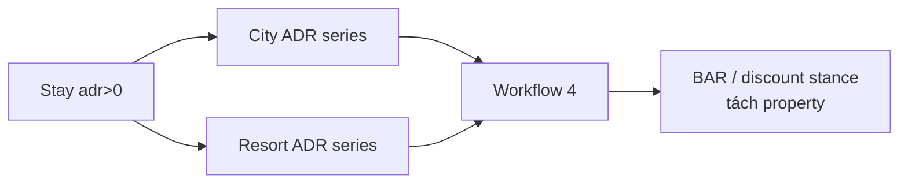

---

## 1. Overview — City vs Resort ADR

**Đọc biểu đồ:** Hai đường €/đêm. City nền cao hơn và “phẳng” hơn; Resort **biên độ cực mạnh** (đáy đông ~50 €, peak hè có thể &gt;200 € trên lịch sử).

**Insight + ý nghĩa kinh doanh**

| Quan sát | City | Resort |
|---|---|---|
| Mean cao hơn (~107 vs ~94 €) | BAR nền / corporate midweek | Giá cảm xúc mùa vụ mạnh |
| Biên độ Resort lớn | Ladder tháng hẹp hơn | Sai 1 tháng peak/đáy = lệch RevPAR lớn |
| Cùng pha hè cao / đông thấp | Seasonal term bắt buộc | Naive dễ thua nếu có trend giá |

**Hàm ý:** không dùng một BAR calendar chung; Jul–Aug Resort harden mạnh hơn City; đông Resort cần floor + package rõ.

### 1.1 Series & decompose từng hotel

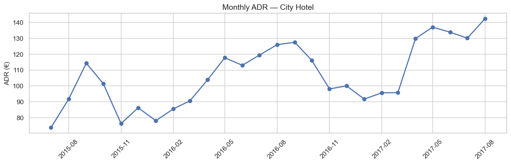

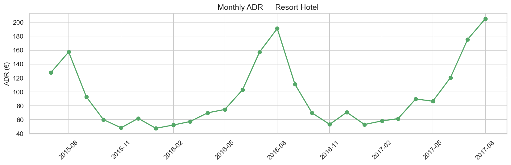

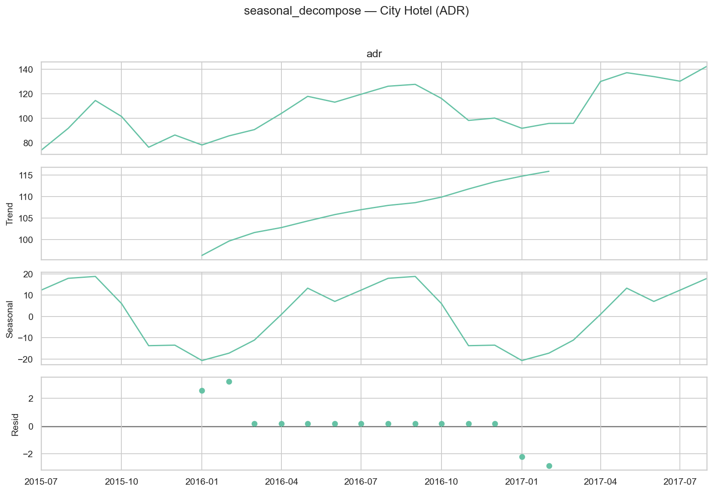

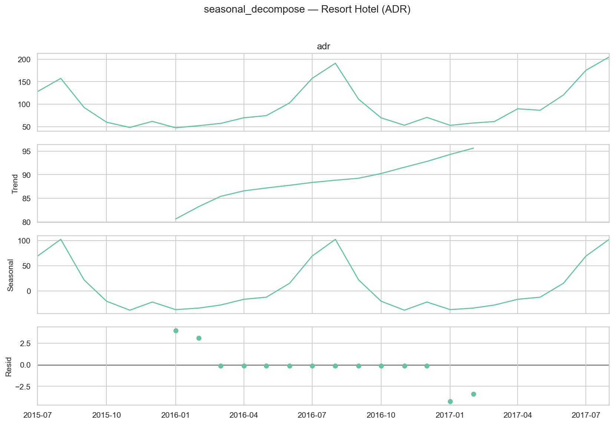

**Đọc biểu đồ decompose:** Seasonal period=12 nổi trên cả hai; Resort seasonal amplitude lớn hơn → forecast lệch mùa đắt hơn về €.

| Hotel | Differencing | Ghi chú |
|---|---|---|
| City | **d=0, D=1** | Seasonal-diff pass ADF+KPSS; model gần “mùa thuần” |
| Resort | **d=1, D=0** | Level không stationary; diff1 ổn |

---

## 2. ACF / PACF & model selection

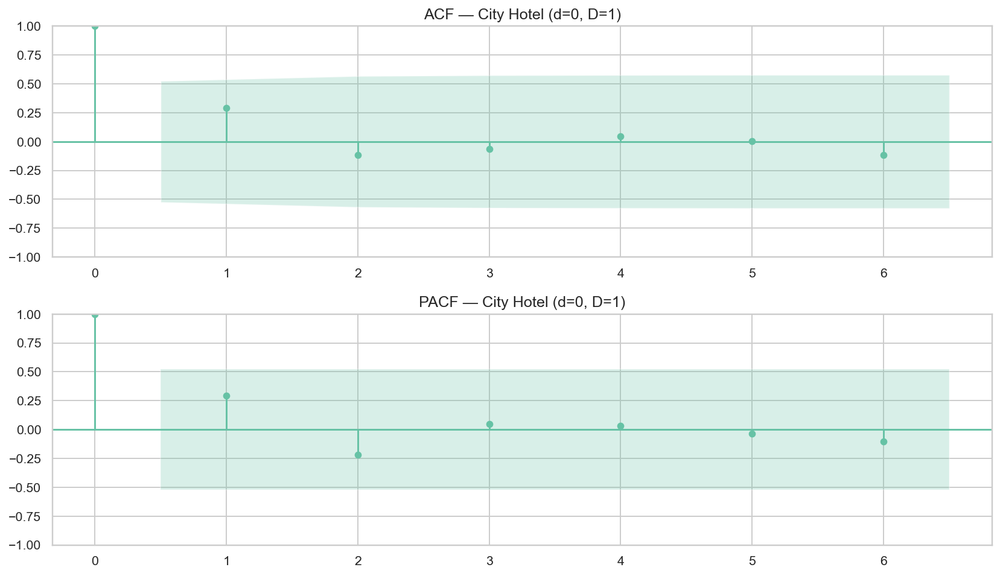

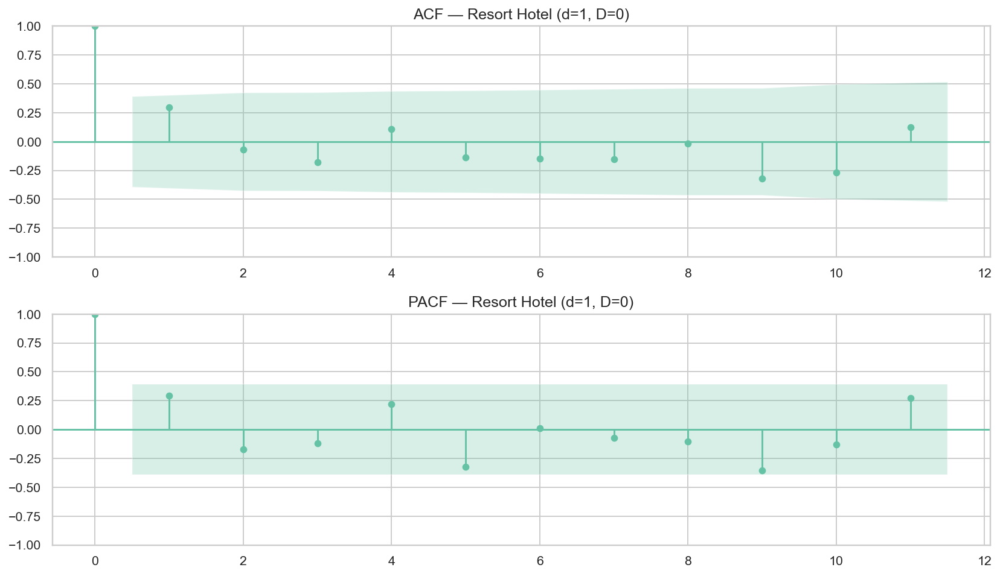

| Hotel | Best AIC SARIMAX | AIC | Diễn giải ngắn |
|---|---|---:|---|
| **City** | (0,0,0)×(0,1,1,12) | 4,0 | Gần seasonal MA sau diff mùa — holdout **hòa** Naive |
| **Resort** | (2,1,0)×(1,0,0,12) | 9,1 | AR + seasonal AR bắt trend/mùa Resort |

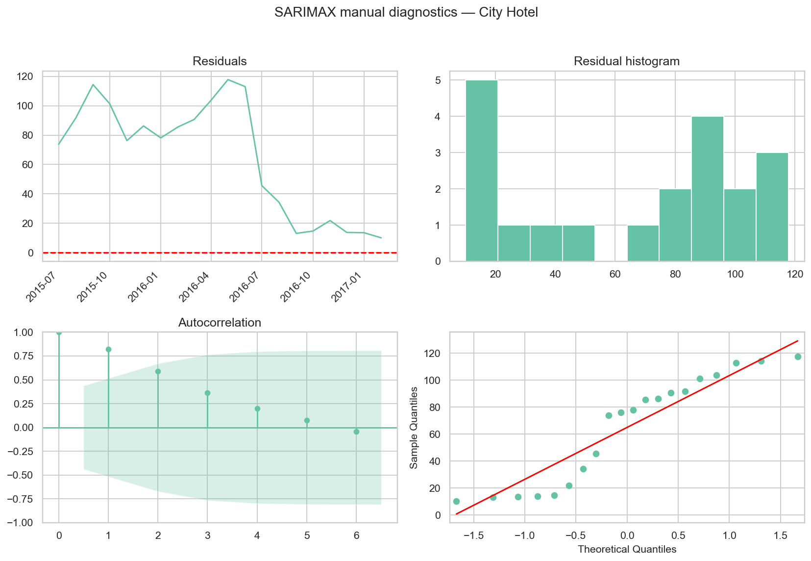

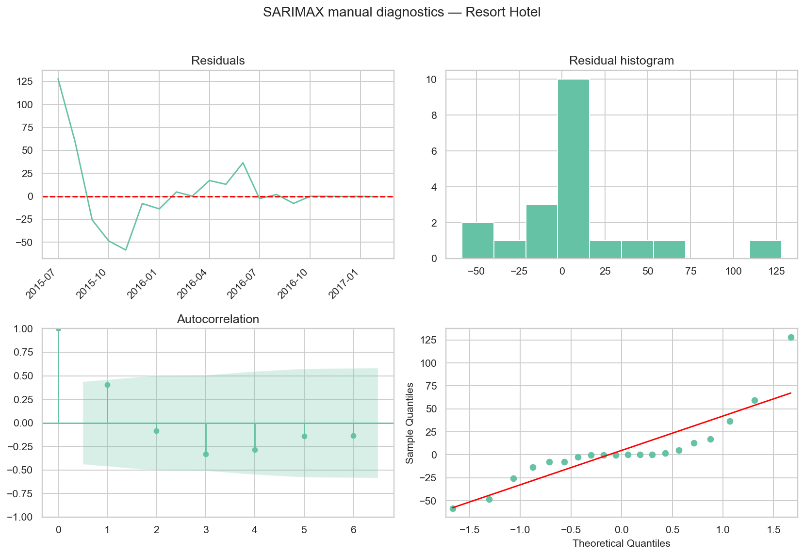

**Hàm ý:** City “model mùa đơn giản” ≈ Naive; Resort SARIMAX **có giá trị gia tăng** vs copy năm trước (~5 pp MAPE).

---

## 3. Holdout — so sánh City vs Resort

**Đọc biểu đồ:** Ai bám ADR actual 6 tháng cuối? PI hẹp giả tạo trên City (model seasonal đơn giản) vẫn có coverage 83%; Resort PI coverage chỉ 17%.

| Hotel | Primary | Best MAPE | Naive MAPE | SARIMAX | Holt | PI95 |
|---|---|---:|---:|---:|---:|---:|
| **City** | SARIMAX ≈ Naive | **12,4%** | 12,4% | 12,4% | 21,4% | 83,3% |
| **Resort** | **SARIMAX** | **7,1%** | 12,4% | **7,1%** | 53,9% | 16,7% |

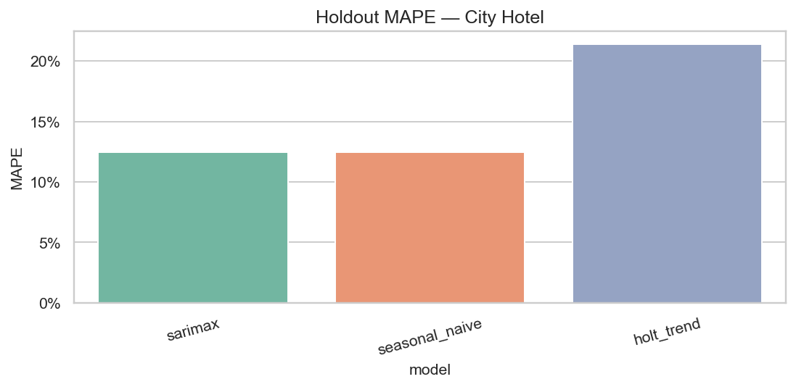

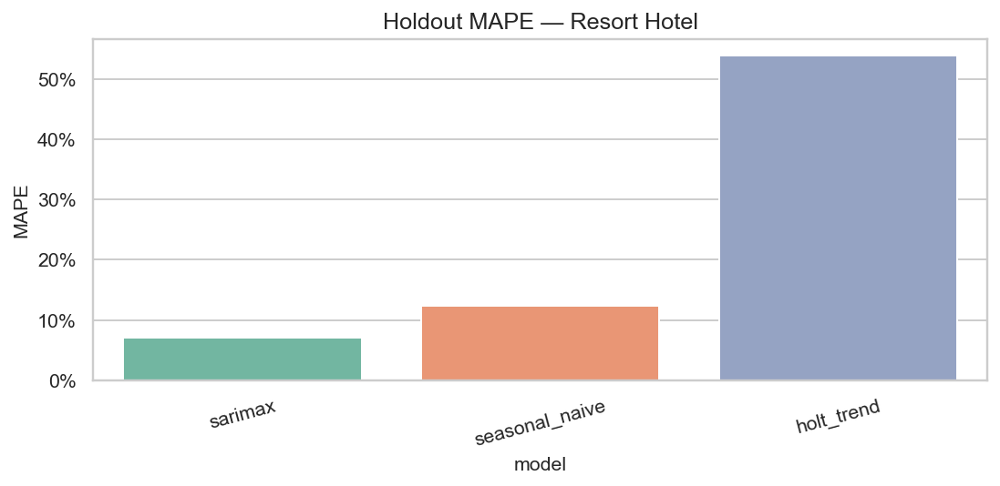

**Ý nghĩa kinh doanh**

| Phát hiện | Hành động |
|---|---|
| Resort: SARIMAX thắng Naive **~5 pp** | Primary BAR Resort = SARIMAX; đối chiếu Naive trước khi lock |
| City: SARIMAX = Naive (12,4%) | BAR City có thể dùng Naive hoặc SARIMAX mùa; đừng overfit |
| Holt trend MAPE rất xấu (21–54%) | **Không** dùng Holt cho ADR pricing |
| PI Resort 17% | **Không** dùng PI ADR Resort làm risk band; đọc point + Naive |
| City MAPE tuyệt đối cao hơn Resort | City khó dự báo €/đêm hơn trên cửa sổ này — siết competitive set |

---

## 4. Forecast 6 tháng

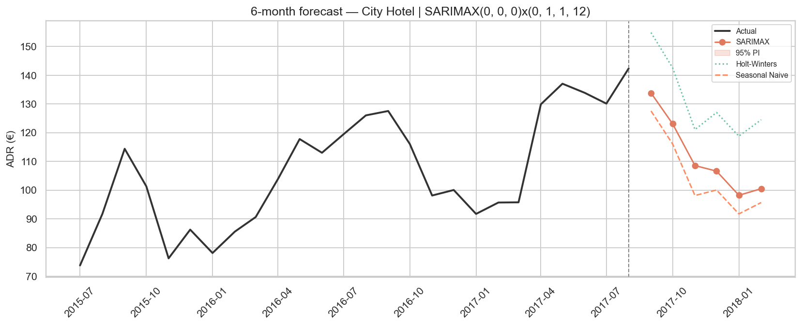

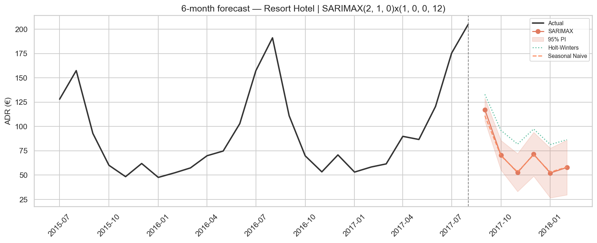

**Đọc biểu đồ overlay:** City ADR forecast đi ngang–cao (~98–134 €); Resort **rơi mạnh** sau Sep (117 → ~52–70 €). Đây là tín hiệu quan trọng nhất cho tách BAR.

| Tháng | City SARIMAX € | Resort SARIMAX € | Gap City−Resort € |
|---|---:|---:|---:|
| 2017-09 | **133,8** | **117,2** | +16,6 |
| 2017-10 | 123,1 | 70,4 | **+52,7** |
| 2017-11 | 108,5 | 52,5 | **+56,0** |
| 2017-12 | 106,6 | 71,4 | +35,2 |
| 2018-01 | 98,2 | 52,1 | **+46,1** |
| 2018-02 | 100,5 | 57,8 | +42,8 |

**Insight kinh doanh từ chart dự báo**

1. **Sep:** cả hai còn cao → harden BAR / hạn chế discount (đồng pha với RevPAR PROTECT).  
2. **Oct–Feb Resort:** ADR dự báo thấp hơn City 35–56 € → promo Resort **không** copy depth % của City (dễ phá floor cảm xúc thương hiệu nghỉ dưỡng).  
3. Divergence SARIMAX vs Naive trên Resort (đặc biệt nếu Naive cao hơn) = tín hiệu bất định — check pickup trước khi cắt sâu.  
4. City PI cực hẹp trên chart (model seasonal) → **đừng** hiểu là “chắc chắn từng cent”; đó là artifact mẫu ngắn.

---

## 5. Rate stance — City vs Resort

**Đọc biểu đồ:** Pressure ≥1,15 PROTECT; ≤0,90 STIMULATE.

| Tháng | City ADR stance | Resort ADR stance | Ưu tiên |
|---|---|---|---|
| **Sep** | **PROTECT** (1,20) | **PROTECT** (1,24) | Đồng bộ harden BAR; Direct; hạn chế Groups dump |
| **Oct** | NEUTRAL (1,09) | **STIMULATE** (0,77) | City hold; **Resort** kích cầu sớm hơn (ADR rơi mạnh) |
| **Nov** | NEUTRAL (0,92) | **STIMULATE** (0,59) | Resort promo mạnh + floor; City gần ngưỡng |
| **Dec** | NEUTRAL (0,94) | **STIMULATE** (0,78) | Không cắt City sâu; Resort package/early-bird |
| **Jan** | **STIMULATE** (0,86) | **STIMULATE** (0,58) | Đồng bộ kích cầu; depth Resort &gt; City |
| **Feb** | **STIMULATE** (0,90) | **STIMULATE** (0,64) | Ladder dần; Resort vẫn cần floor rõ |

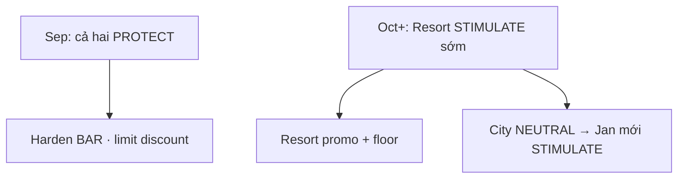

**Hàm ý:** Oct là tháng **lệch pha giá** rõ nhất — overall nb 18a (NEUTRAL) che mất việc Resort đã cần kích cầu.

---

## 6. KPI tóm tắt

| Metric | City | Resort |
|---|---|---|
| Primary | SARIMAX (≈ Naive) | **SARIMAX** |
| Best MAPE | 12,4% | **7,1%** |
| Δ vs Naive | 0 pp | **−5,3 pp** |
| Order | (0,0,0)×(0,1,1,12) | (2,1,0)×(1,0,0,12) |
| d / D | 0 / 1 | 1 / 0 |
| PI95 coverage | 83,3% | 16,7% |
| Mean ADR lịch sử | 106,78 € | 94,45 € |

---

## 7. Hạn chế

1. City SARIMAX hòa Naive — không overclaim “SARIMAX thắng City”.  
2. PI Resort không đáng tin (16,7%).  
3. ADR = giá lúc đặt, không phải BAR gán phòng thực.  
4. Mẫu ngắn; re-fit quý.  
5. Nối volume [`20`](20_demand_forecasting_dynamic_pricing_city_resort.md) + RevPAR [`20b`](20b_demand_forecasting_dynamic_pricing_RevPAR_city_resort.md) trước khi lock.

---

## 8. Tài liệu liên quan

| File | Vai trò |
|---|---|
| [`18a_...adr.md`](18a_demand_forecasting_dynamic_pricing_adr.md) | Overall ADR |
| [`17b` notebook](../notebooks/17b_adr_strategy_analysis_city_resort.ipynb) | Season / weekend / lead City vs Resort |
| [`21_key_findings_...city_resort.md`](21_key_findings_after_forecasting_models_city_resort.md) | Tổng hợp 3 series facet |

---

*Báo cáo ADR forecasting tách City / Resort (nb 20a). Cập nhật: 21/07/2026.*
