# 20b — RevPAR Forecasting: City vs Resort (statsmodels)

> **Nguồn dữ liệu:** `hotel_bookings_v5.csv`  
> **Phạm vi:** monthly RevPAR proxy = ADR × Occupancy_Rate · **tách property** · 26 tháng (2015-07 → 2017-08)  
> **City mean RevPAR:** **74,26 €** · **Resort mean RevPAR:** **69,92 €**  
> **Pipeline:** statsmodels Workflow 4  
> **Notebook:** [`notebooks/20b_demand_forecasting_dynamic_pricing_RevPAR_city_resort.ipynb`](../notebooks/20b_demand_forecasting_dynamic_pricing_RevPAR_city_resort.ipynb)  
> **Figures:** [`reports/figures/20_revpar/`](./figures/20_revpar/) · [`compare_city_vs_resort.csv`](./figures/20_revpar/compare_city_vs_resort.csv)  
> **Clone từ:** [`18b_demand_forecasting_dynamic_pricing_RevPAR.md`](18b_demand_forecasting_dynamic_pricing_RevPAR.md)  
> **Cập nhật:** 21/07/2026

---

## Mục tiêu

Dự báo **RevPAR proxy** riêng City / Resort — KPI tổng hợp rate × occupancy (booking-success proxy, **không** phải RevPAR kế toán rooms available).

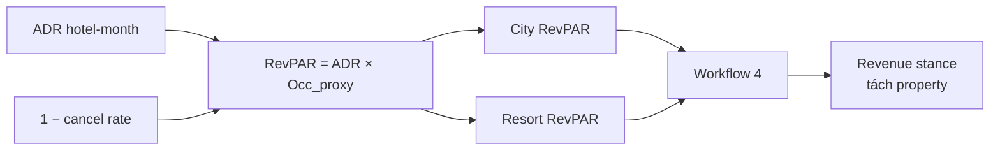

---

## 1. Overview — City vs Resort RevPAR

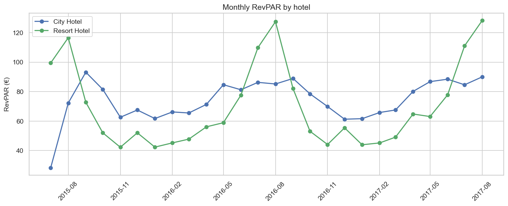

**Đọc biểu đồ:** Hai đường € proxy. City nhịp ổn định hơn quanh 60–90 €; Resort peak hè cao nhưng **đáy đông sâu** (kéo bởi ADR thấp + occ).

**Insight + ý nghĩa kinh doanh**

| Quan sát | City | Resort |
|---|---|---|
| Mean gần nhau (74 vs 70 €) | Cân bằng rate×occ đô thị | Peak cao / đáy sâu → rủi ro mùa đông |
| Shape gần Demand hơn ADR thuần | Occ proxy kéo RevPAR theo volume | Đừng đọc RevPAR như “chỉ giá” |
| Mean &lt; ADR | Đúng kỳ vọng (occ &lt; 1) | Cùng logic |

**Hàm ý:** RevPAR stance dùng để chọn **lever** (occ vs rate) khi Demand và ADR lệch — luôn tách property.

### 1.1 Series & decompose

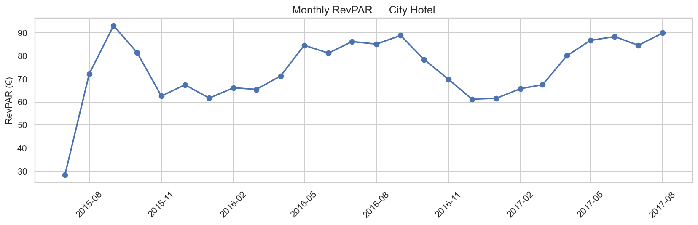

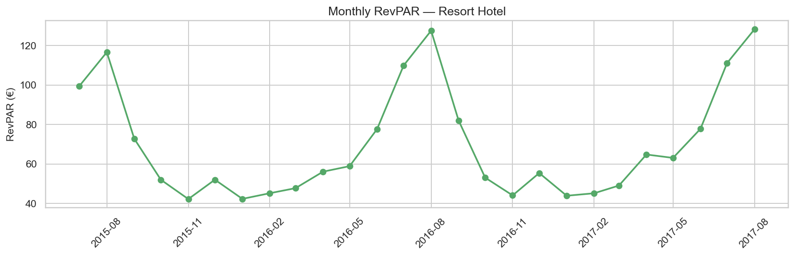

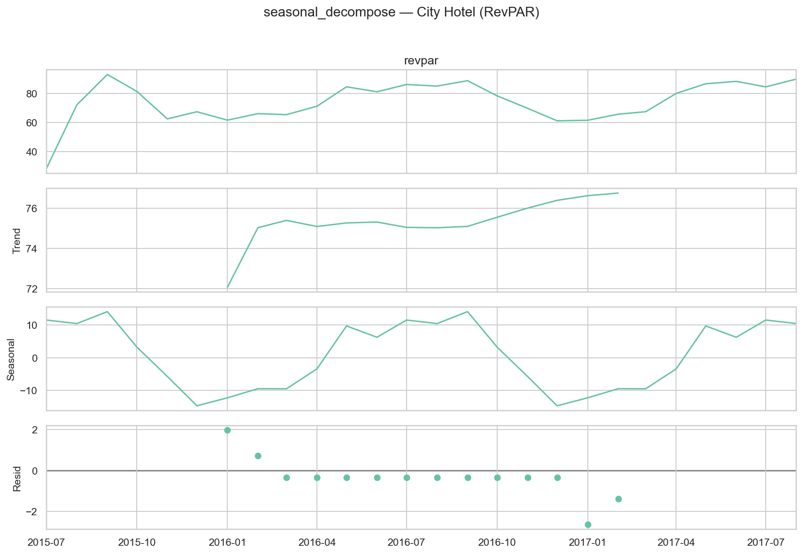

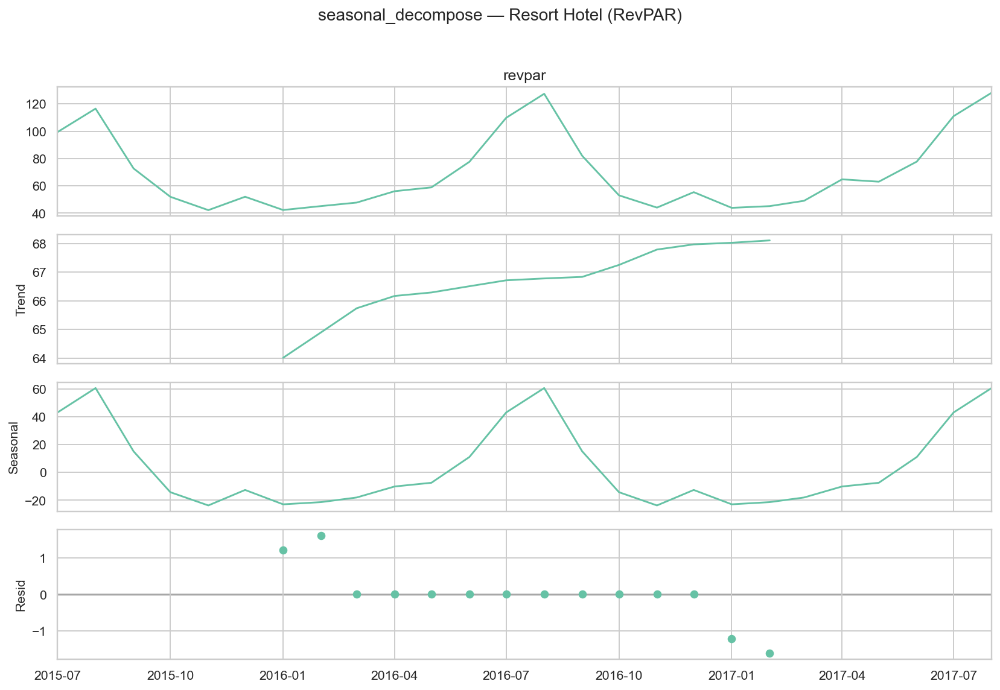

| Hotel | Differencing |
|---|---|
| City | d=1, D=0 |
| Resort | d=1, D=0 (level đã pass; vẫn dùng diff1 trong grid) |

---

## 2. Model selection

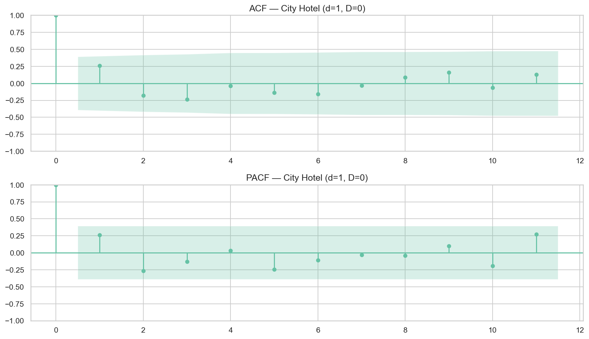

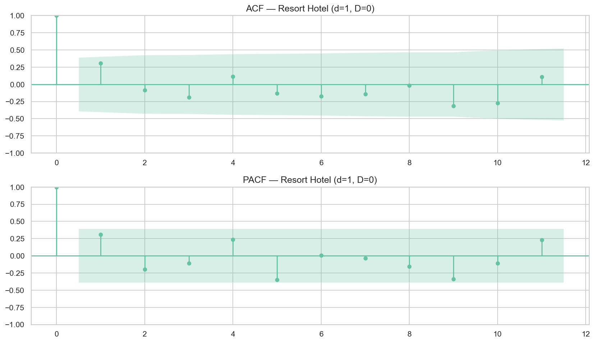

| Hotel | Best AIC SARIMAX | AIC |
|---|---|---:|
| City | (2,1,2)×(1,0,1,12) | −15,4 |
| Resort | (1,1,2)×(1,0,1,12) | 7,6 |

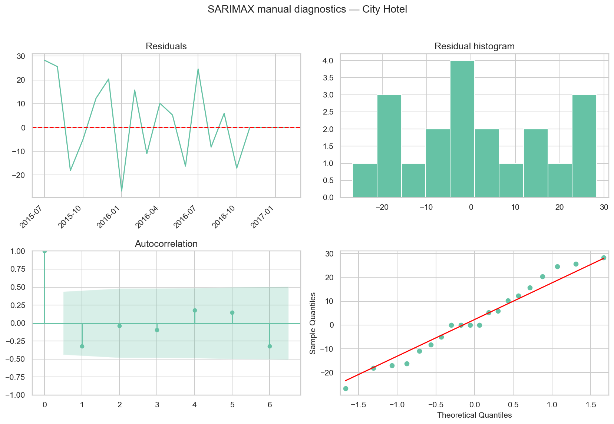

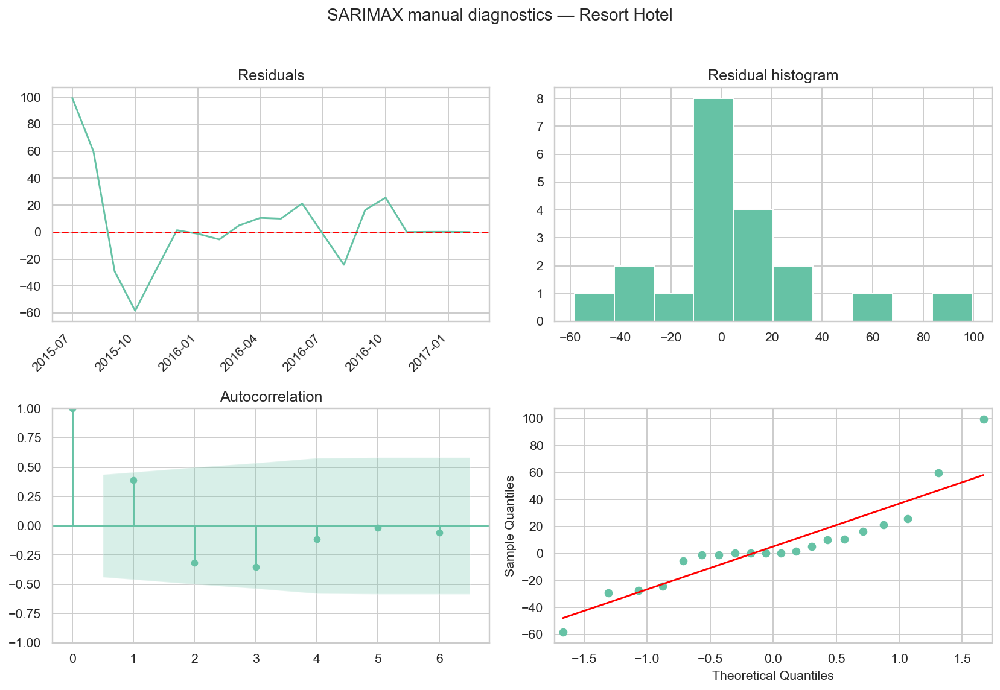

**Hàm ý:** AIC tốt trên train **không** chuyển thành thắng holdout (§3) — giống pattern overall nb 18b.

---

## 3. Holdout — so sánh City vs Resort

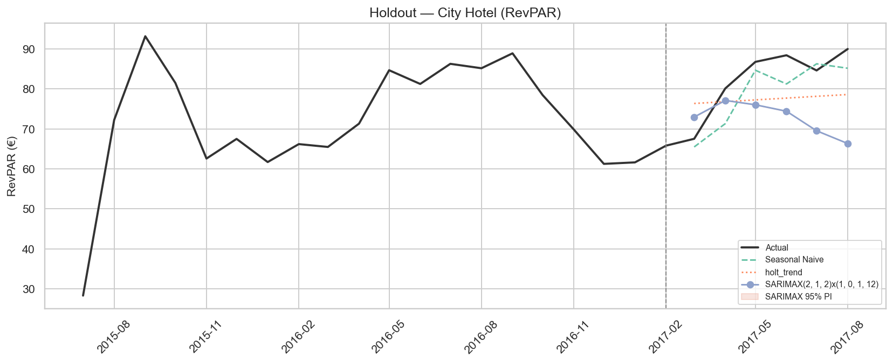

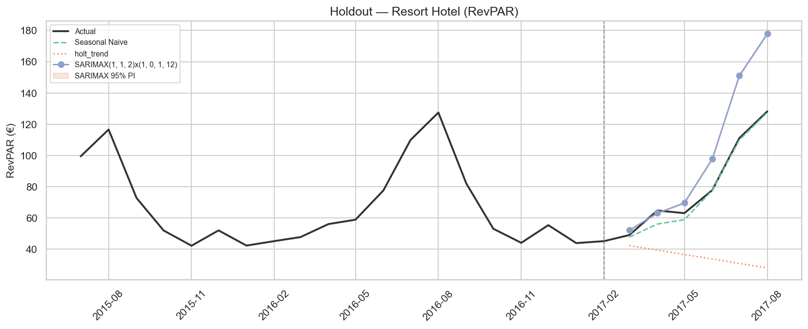

**Đọc biểu đồ:** Naive bám actual; SARIMAX lệch (thường cao/thấp sai pha) và PI **không bao phủ** actual (coverage 0% cả hai).

| Hotel | Primary | Best MAPE | Naive | SARIMAX | Holt | PI95 |
|---|---|---:|---:|---:|---:|---:|
| **City** | **Seasonal Naive** | **5,3%** | 5,3% | 14,0% | 10,1% | **0%** |
| **Resort** | **Seasonal Naive** | **4,1%** | 4,1% | 20,0% | 50,3% | **0%** |

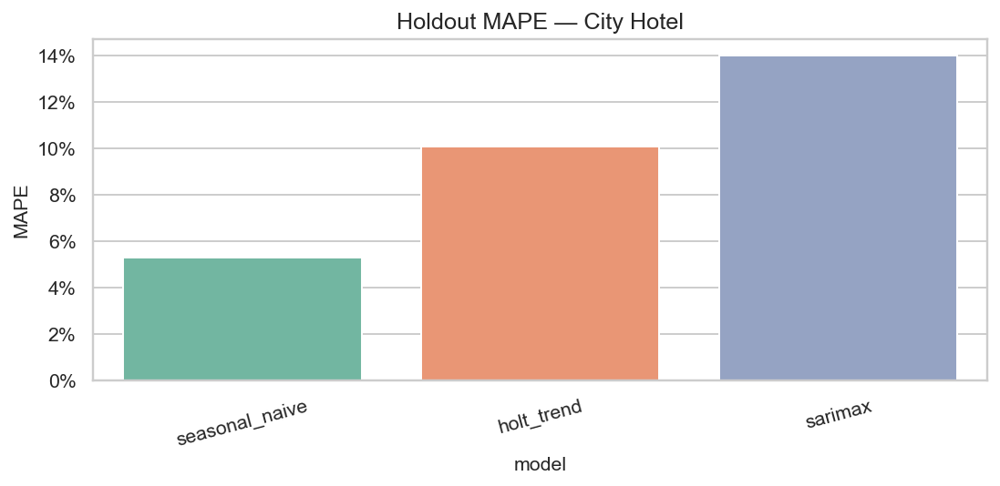

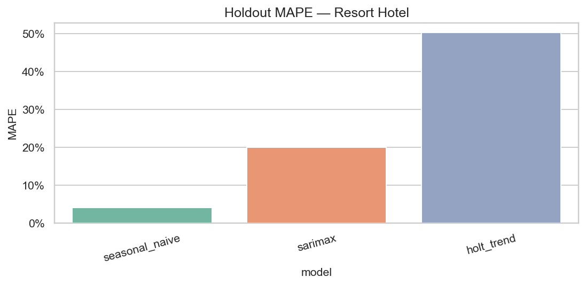

**Ý nghĩa kinh doanh**

| Phát hiện | Hành động |
|---|---|
| Cả hai: Naive thắng rõ | Primary KPI RevPAR = **Seasonal Naive** từng property |
| SARIMAX MAPE 14–20% + PI 0% | **Bỏ** point & risk band SARIMAX RevPAR |
| Resort Naive MAPE tốt hơn City (4,1% vs 5,3%) | RevPAR Resort “ổn định năm” hơn City trên cửa sổ này |
| Holt rất kém Resort (50%) | Không dùng Holt cho RevPAR Resort |

---

## 4. Forecast 6 tháng

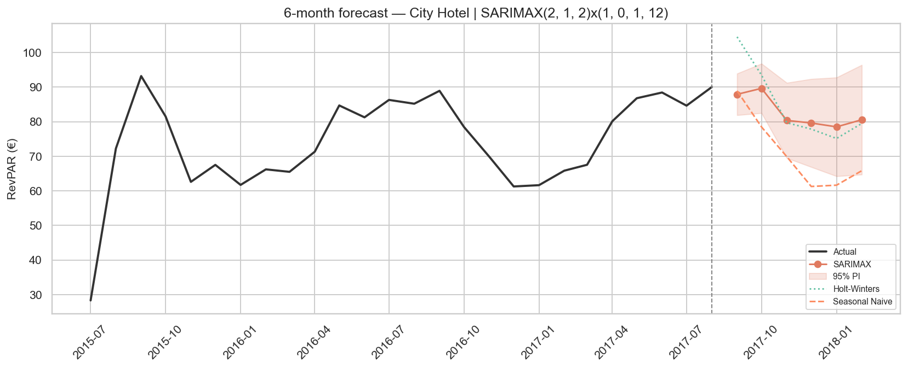

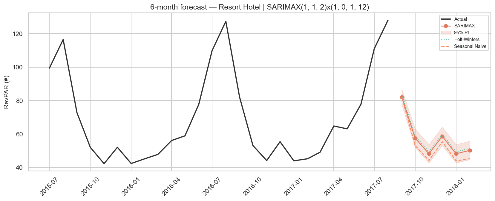

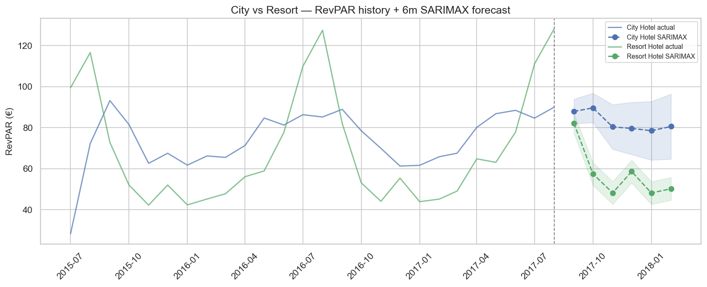

**Đọc biểu đồ overlay:** Sau Sep, Resort RevPAR Naive **rơi mạnh** (82 → ~44–55 €) trong khi City giảm nhẹ hơn (89 → ~61–79 €). Chart này giải thích vì sao stance Resort STIMULATE dài hơn City.

| Tháng | City Naive € | Resort Naive € | Gap |
|---|---:|---:|---:|
| 2017-09 | **88,9** | **82,0** | +6,9 |
| 2017-10 | 78,5 | 53,1 | **+25,4** |
| 2017-11 | 69,9 | 44,1 | **+25,8** |
| 2017-12 | 61,3 | 55,4 | +5,9 |
| 2018-01 | 61,6 | 43,9 | +17,7 |
| 2018-02 | 65,8 | 45,2 | +20,6 |

**Insight kinh doanh từ chart dự báo**

1. **Sep** gần nhau và cao → cả hai có thể PROTECT doanh thu (harden rate + bảo vệ occ chất lượng).  
2. **Oct–Nov Resort** sụt mạnh → cần kích cầu sớm; nếu chỉ nhìn City sẽ **trễ promo Resort**.  
3. SARIMAX trên chart thường **cao hơn** Naive (City Dec–Feb) — divergence = bất định, không dùng để harden BAR.  
4. RevPAR thấp đông = kết hợp ADR thấp (nb 20a) + occ; ưu tiên **package/LOS** hơn dump ADR trần.

---

## 5. Revenue stance — City vs Resort

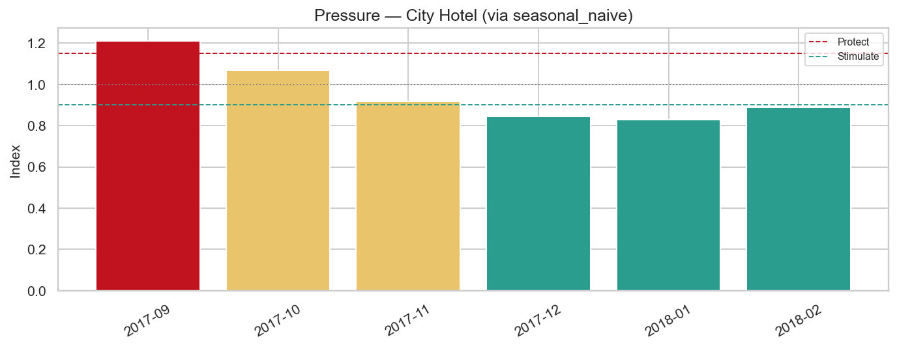

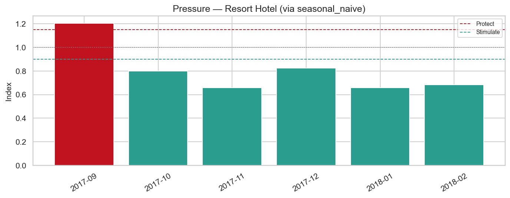

**Đọc biểu đồ:** Pressure từ forecast Naive + season index.

| Tháng | City RevPAR | Resort RevPAR | Ưu tiên lever |
|---|---|---|---|
| **Sep** | **PROTECT** (1,21) | **PROTECT** (1,21) | Harden BAR; hạn chế dump; bảo vệ Direct |
| **Oct** | NEUTRAL (1,07) | **STIMULATE** (0,80) | City hold; Resort kích cầu (occ ± rate có floor) |
| **Nov** | NEUTRAL (0,92) | **STIMULATE** (0,66) | Resort promo mạnh; City theo dõi |
| **Dec** | **STIMULATE** (0,85) | **STIMULATE** (0,83) | Đồng bộ kích cầu; giữ ADR floor (nb 20a) |
| **Jan** | **STIMULATE** (0,83) | **STIMULATE** (0,66) | Depth Resort &gt; City |
| **Feb** | **STIMULATE** (0,89) | **STIMULATE** (0,68) | Ladder; không cắt City quá sớm |

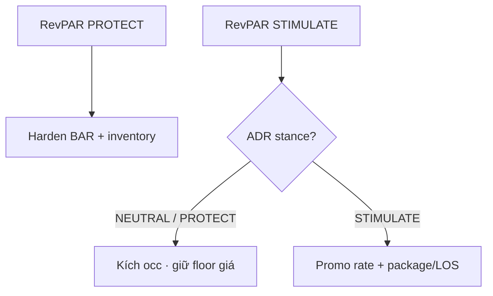

**Đối chiếu với Demand (20) & ADR (20a)**

| Tháng | Demand City/Resort | ADR City/Resort | RevPAR City/Resort | Đọc nhanh |
|---|---|---|---|---|
| Sep | PROTECT / NEUTRAL | PROTECT / PROTECT | PROTECT / PROTECT | Harden giá; City siết volume |
| Oct | NEUTRAL / NEUTRAL | NEUTRAL / **STIM** | NEUTRAL / **STIM** | **Resort** kích cầu sớm |
| Jan | STIM / STIM | STIM / STIM | STIM / STIM | Promo mạnh nhất đồng bộ |

---

## 6. KPI tóm tắt

| Metric | City | Resort |
|---|---|---|
| Primary | Seasonal Naive | Seasonal Naive |
| Best MAPE | 5,3% | **4,1%** |
| SARIMAX MAPE | 14,0% | 20,0% |
| Order (AIC) | (2,1,2)×(1,0,1,12) | (1,1,2)×(1,0,1,12) |
| PI95 coverage | 0% | 0% |
| Mean RevPAR | 74,26 € | 69,92 € |

---

## 7. Hạn chế

1. Occupancy = proxy booking success — **không** phải rooms sold/available.  
2. PI SARIMAX 0% — không dùng interval RevPAR.  
3. Mẫu ngắn; 2018 minh họa.  
4. Recommend-only; validate pickup & capacity thật khi có.

---

## 8. Tài liệu liên quan

| File | Vai trò |
|---|---|
| [`18b_...RevPAR.md`](18b_demand_forecasting_dynamic_pricing_RevPAR.md) | Overall |
| [`20_...demand...`](20_demand_forecasting_dynamic_pricing_city_resort.md) · [`20a_...adr...`](20a_demand_forecasting_dynamic_pricing_adr_city_resort.md) | Volume & rate facet |
| [`21_key_findings_...city_resort.md`](21_key_findings_after_forecasting_models_city_resort.md) | Executive tổng hợp |

---

*Báo cáo RevPAR forecasting tách City / Resort (nb 20b). Cập nhật: 21/07/2026.*
