# Key Findings sau mô hình dự báo Demand · ADR · RevPAR — City vs Resort

> **Loại:** Tổng hợp executive facet — Holdout · Primary model · Stance · Playbook **tách property**  
> **Dữ liệu:** `hotel_bookings_v5.csv` · 26 tháng (2015-07 → 2017-08)  
> **City:** Demand 35.137 stay · ADR mean 106,78 € · RevPAR mean 74,26 €  
> **Resort:** Demand 24.390 stay · ADR mean 94,45 € · RevPAR mean 69,92 €  
> **Pipeline:** statsmodels Workflow 4 · holdout 6 tháng · forecast 6 tháng  
> **Nguồn:** `20` Demand · `20a` ADR · `20b` RevPAR · đối chiếu overall `19`  
> **Cập nhật:** 21/07/2026

---

## 1. Thông điệp điều hành

Facet City / Resort **không** chỉ “vẽ thêm đường” — nó đổi **primary model** và **tháng kích cầu** so với overall nb 18/19:

1. **Demand** — City primary = **Seasonal Naive** (MAPE **7,8%**); Resort = **Holt trend** (**5,5%**). SARIMAX City **vỡ** (MAPE 45%, PI 0%).
2. **ADR** — cả hai chọn SARIMAX, nhưng City **hòa Naive** (12,4%); Resort SARIMAX **thắng rõ** Naive (−5,3 pp, MAPE **7,1%**).
3. **RevPAR** — cả hai **Seasonal Naive** (City 5,3% · Resort **4,1%**); SARIMAX + PI **không** dùng (coverage 0%).
4. **Lệch pha quan trọng nhất: Oct** — City còn NEUTRAL trên ADR/RevPAR; Resort đã **STIMULATE** mạnh (ADR/RevPAR rơi sâu trên chart forecast).
5. **Sep** — gần như đồng thuận **PROTECT giá/RevPAR**; chỉ Demand City PROTECT trong khi Resort volume NEUTRAL.

| Mục tiêu vận hành | City | Resort |
|---|---|---|
| Volume calendar | **Seasonal Naive** | **Holt trend** (đối chiếu Naive) |
| BAR / ADR ladder | SARIMAX ≈ Naive | **SARIMAX** (primary) |
| RevPAR KPI | **Seasonal Naive** | **Seasonal Naive** |
| Risk band PI | **Không** (Demand PI 0%) | Demand PI ~83% (mềm); ADR/RevPAR PI bỏ |
| Tháng kích cầu sớm | Dec–Jan | **Từ Oct** (giá + RevPAR) |

> Chi tiết: [`20_...demand...`](20_demand_forecasting_dynamic_pricing_city_resort.md) · [`20a_...adr...`](20a_demand_forecasting_dynamic_pricing_adr_city_resort.md) · [`20b_...RevPAR...`](20b_demand_forecasting_dynamic_pricing_RevPAR_city_resort.md).  
> Overall (không facet): [`19_key_findings_after_forecasting_models.md`](19_key_findings_after_forecasting_models.md).

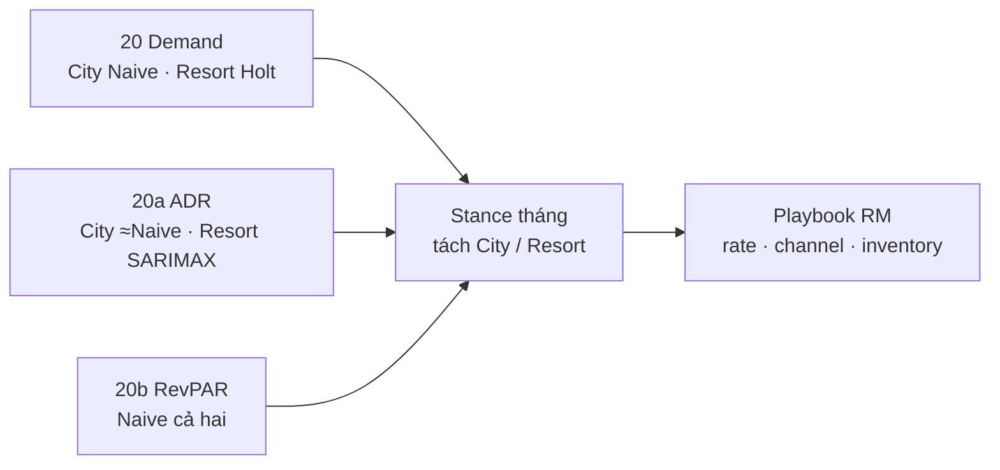

---

## 2. So sánh mô hình — City vs Resort × 3 series

### 2.1 Bảng holdout (train 20 · test 6)

| Series | Hotel | Primary | Best MAPE | Naive | SARIMAX | PI95 | Order (AIC) |
|---|---|---|---:|---:|---:|---:|---|
| Demand | City | Seasonal Naive | **7,8%** | 7,8% | 45,1% | 0% | (2,1,2)×(1,0,1,12) |
| Demand | Resort | **Holt trend** | **5,5%** | 8,3% | 6,1% | **83%** | (0,1,2)×(1,0,1,12) |
| ADR | City | SARIMAX ≈ Naive | **12,4%** | 12,4% | 12,4% | 83% | (0,0,0)×(0,1,1,12) |
| ADR | Resort | **SARIMAX** | **7,1%** | 12,4% | 7,1% | 17% | (2,1,0)×(1,0,0,12) |
| RevPAR | City | Seasonal Naive | **5,3%** | 5,3% | 14,0% | 0% | (2,1,2)×(1,0,1,12) |
| RevPAR | Resort | Seasonal Naive | **4,1%** | 4,1% | 20,0% | 0% | (1,1,2)×(1,0,1,12) |

### 2.2 Bài học facet (khác overall nb 19)

| Observation | Interpretation | Implication | Next step |
|---|---|---|---|
| Overall Demand Naive “ổn” nhưng City SARIMAX MAPE 45% | Gộp property che model hỏng trên City | **Không** dùng SARIMAX volume City | Primary = Naive City; Holt/SARIMAX chỉ Resort |
| Resort Demand Holt thắng Naive | Resort có drift ngắn trên cửa sổ holdout | Volume Resort không chỉ “copy năm trước” | Re-fit quý; nếu Naive thắng lại → đổi primary |
| Resort ADR SARIMAX −5 pp vs Naive | Biên độ giá nghỉ dưỡng cần cấu trúc AR/mùa | BAR Resort = SARIMAX | Đối chiếu Naive trước lock |
| City ADR hòa Naive | Giá đô thị gần seasonal thuần | Đừng overfit SARIMAX City | Dùng Naive hoặc SARIMAX mùa đơn giản |
| RevPAR Naive thắng cả hai; PI 0% | Giống 18b; facet không cứu PI | Primary RevPAR = Naive; bỏ PI | Capacity thật khi có |
| Oct lệch pha ADR/RevPAR | Resort đáy sớm hơn City trên chart forecast | Promo Resort **trước** City | Playbook §5 |

**Đọc nghiệp vụ:** One-size (nb 19) đúng hướng mùa nhưng **sai timing/depth** nếu không tách property — đặc biệt Oct–Nov Resort.

---

## 3. Series & chart dự báo — ý nghĩa kinh doanh

### 3.1 Overview overlays

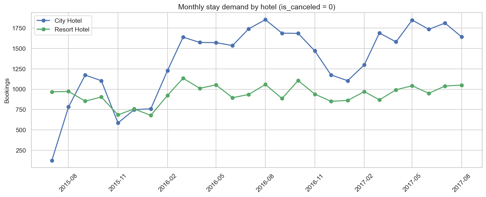

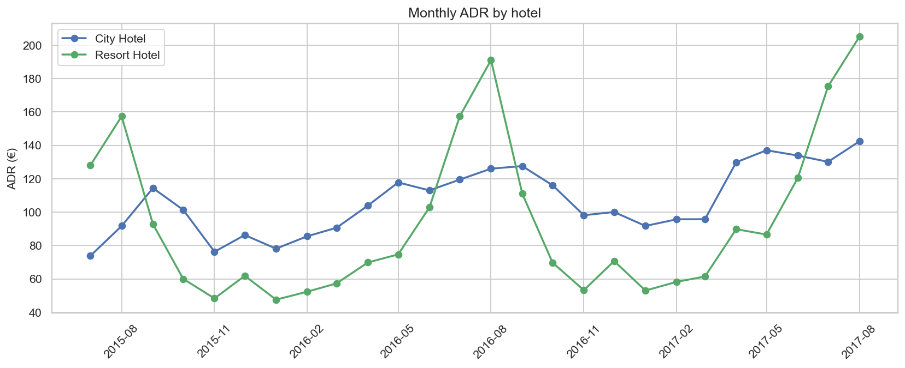

**Đọc bộ 3 chart overview**

| Chart | City vs Resort trên hình | Ý nghĩa điều hành |
|---|---|---|
| Demand | City luôn cao hơn tuyệt đối; cùng nhịp năm | Scale inventory theo City; depth promo theo % baseline property |
| ADR | City phẳng–cao; Resort biên độ cực đại | Sai tháng peak/đáy Resort = lệch € lớn |
| RevPAR | Sau hè Resort rơi sâu hơn City | Revenue gap mùa đông = bài toán Resort trước |

### 3.2 Forecast horizon overlays (6 tháng)

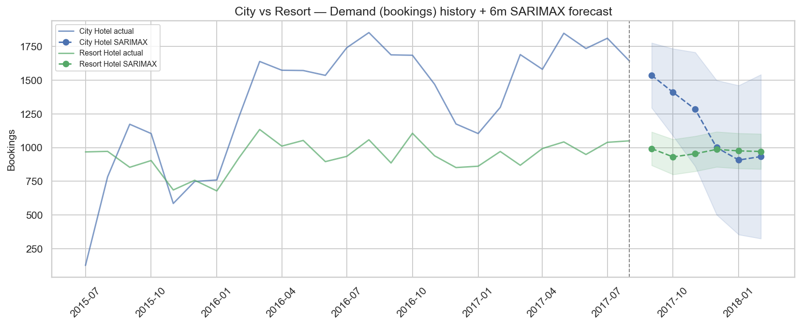

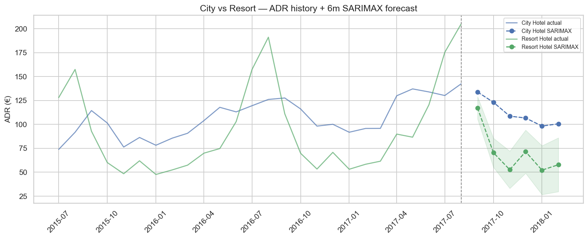

**Đọc bộ 3 chart forecast overlay**

1. **Demand overlay** — City giữ ~1.1–1.7k; Resort ~0.8–1.1k; gap thu hẹp Dec–Jan → mùa yếu “nén” cả hai.  
2. **ADR overlay** — sau Sep, Resort **rơi thẳng** (117 → ~52–70 €) trong khi City giữ ~98–134 € → **không** copy % discount City sang Resort.  
3. **RevPAR overlay** — xác nhận ADR: Resort Oct–Nov sụt ~25 € so với City → kích cầu Resort sớm là đúng chart, không phải “cảm tính”.

| Tháng | Demand City / Resort | ADR € City / Resort | RevPAR € City / Resort |
|---|---|---|---|
| 2017-09 | 1.687 / 942 | 133,8 / 117,2 | 88,9 / 82,0 |
| 2017-10 | 1.684 / 1.077 | 123,1 / **70,4** | 78,5 / **53,1** |
| 2017-11 | 1.469 / 885 | 108,5 / **52,5** | 69,9 / **44,1** |
| 2017-12 | 1.175 / 877 | 106,6 / 71,4 | 61,3 / 55,4 |
| 2018-01 | 1.104 / 843 | 98,2 / **52,1** | 61,6 / **43,9** |
| 2018-02 | 1.298 / 1.020 | 100,5 / 57,8 | 65,8 / 45,2 |

---

## 4. Holdout charts — đọc nhanh từng series

### 4.1 Demand

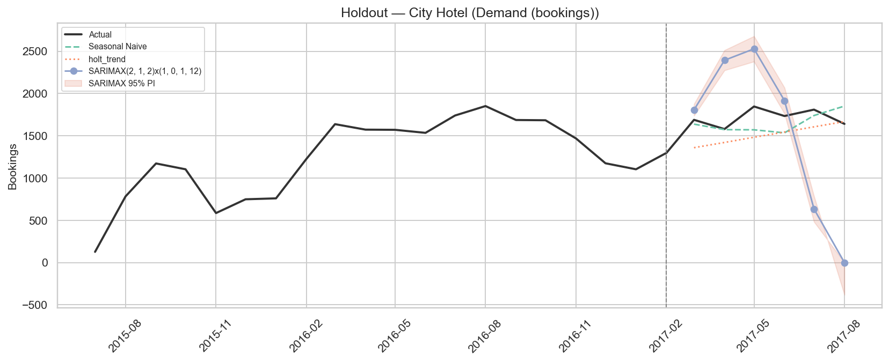

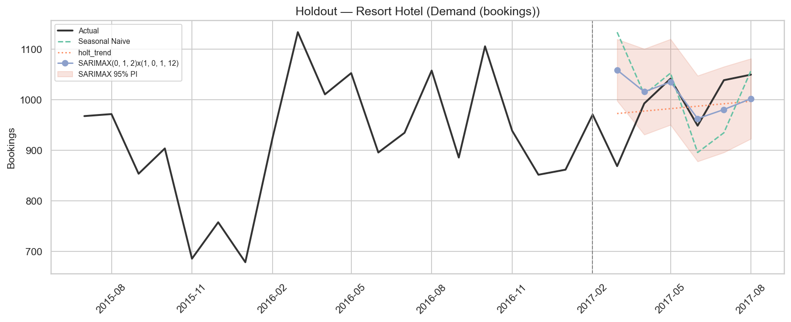

- City: Naive bám; SARIMAX lệch mạnh → **không** tin point SARIMAX City.  
- Resort: Holt/SARIMAX sát actual hơn Naive → primary Holt, PI SARIMAX mềm (83%).

### 4.2 ADR

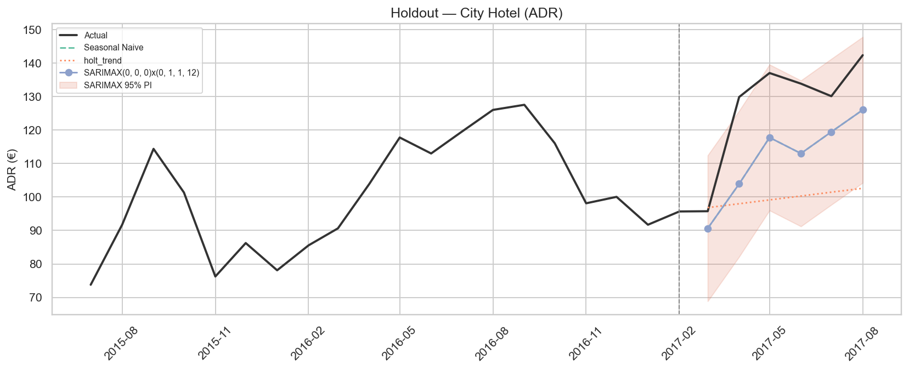

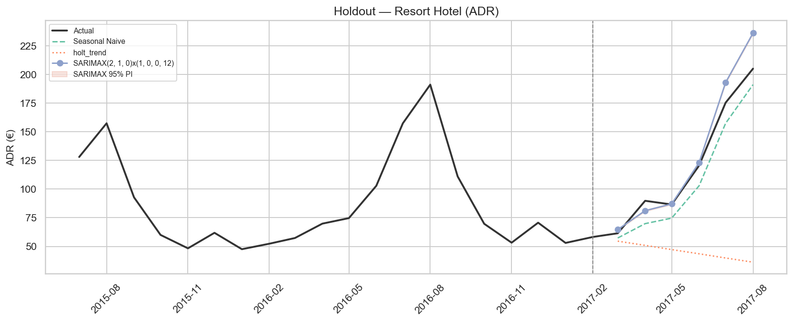

- City: Naive ≈ SARIMAX — BAR có thể seasonal đơn giản.  
- Resort: SARIMAX thắng; PI hẹp giả tạo / coverage thấp → chỉ dùng point.

### 4.3 RevPAR

- Cả hai: Naive thắng; SARIMAX + PI bỏ — giống kết luận overall 18b, **ổn định hơn khi facet**.

---

## 5. Đối chiếu stance 3 tín hiệu × 2 property

Stance = `0,5·season_index + 0,5·forecast_index` (ngưỡng PROTECT / NEUTRAL / STIMULATE).

### 5.1 Bảng Sep 2017 → Feb 2018

| Tháng | City D / A / R | Resort D / A / R | Ưu tiên hành động |
|---|---|---|---|
| **Sep** | **PROTECT** / **PROTECT** / **PROTECT** | NEUTRAL / **PROTECT** / **PROTECT** | Harden BAR cả hai; City siết volume/OTA; Resort không ép PROTECT volume |
| **Oct** | NEUTRAL / NEUTRAL / NEUTRAL | NEUTRAL / **STIM** / **STIM** | **Resort kích cầu giá+RevPAR**; City hold |
| **Nov** | NEUTRAL / NEUTRAL / NEUTRAL | NEUTRAL / **STIM** / **STIM** | Resort promo + floor; City theo dõi pickup |
| **Dec** | **STIM** / NEUTRAL / **STIM** | NEUTRAL / **STIM** / **STIM** | City kích volume giữ ADR floor; Resort kích giá/occ |
| **Jan** | **STIM** / **STIM** / **STIM** | **STIM** / **STIM** / **STIM** | Đồng bộ promo mạnh nhất; depth theo gap property |
| **Feb** | NEUTRAL / **STIM** / **STIM** | NEUTRAL / **STIM** / **STIM** | Promo nhẹ → ladder shoulder |

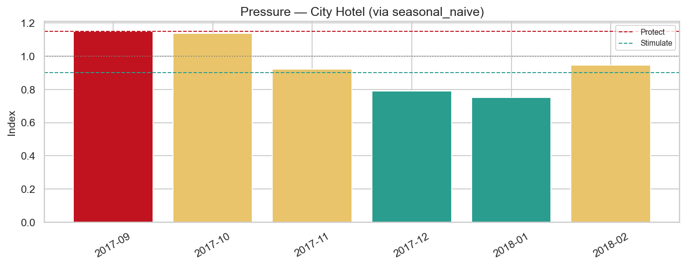

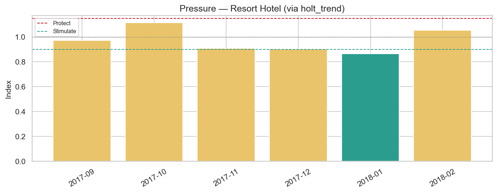

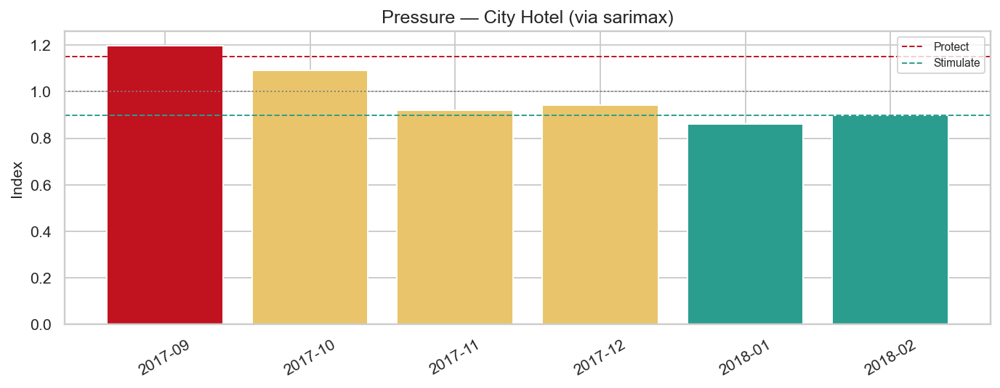

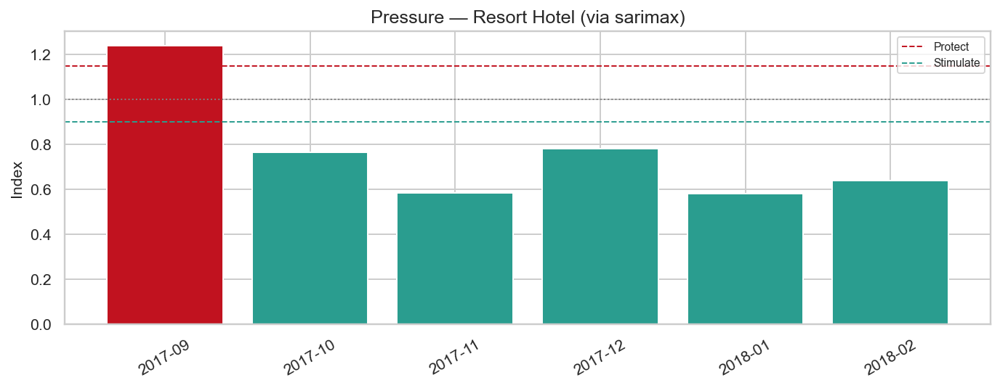

**Đọc bộ chart stance:** Cột đỏ (PROTECT) tập trung Sep; xanh (STIMULATE) dài hơn rõ trên **Resort ADR/RevPAR** từ Oct — đây là khác biệt facet vs overall nb 19 (overall Oct còn NEUTRAL chung).

### 5.2 Quy tắc giải quyết mâu thuẫn (facet)

| Tình huống | Ưu tiên |
|---|---|
| ADR+RevPAR **PROTECT**, Demand NEUTRAL (Resort Sep) | Harden **giá**; không siết volume quá tay |
| Demand **PROTECT**, ADR+RevPAR PROTECT (City Sep) | Harden BAR **và** hạn chế dump inventory |
| Demand NEUTRAL, ADR+RevPAR **STIMULATE** (Resort Oct–Nov) | Kích cầu **giá/occ có floor** — không chờ volume signal |
| Demand **STIM**, ADR NEUTRAL, RevPAR STIM (City Dec) | Kích **volume**; giữ ADR floor |
| Cả 3 **STIM** (Jan) | Promo mạnh + floor + LOS; depth Resort ≥ City |

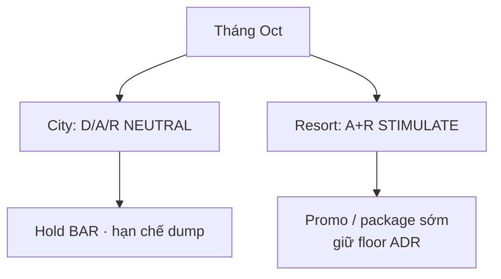

---

## 6. Playbook điều hành 90 ngày (City vs Resort)

| Ưu tiên | Hành động | Cơ sở chart / metrics |
|---|---|---|
| **P0** | Lock **Sep PROTECT giá** cả hai; City thêm siết volume | Stance Sep + ADR/RevPAR overlay cao |
| **P0** | **Oct–Nov: promo Resort trước City** | ADR/RevPAR overlay rơi sâu Resort; stance STIM |
| **P0** | Primary: City volume=Naive; Resort volume=Holt; Resort ADR=SARIMAX; RevPAR=Naive | Bảng holdout §2 |
| **P1** | Dashboard 3 series × 2 hotel: actual vs forecast | Cảnh báo lệch occ vs rate sớm từng property |
| **P1** | Pickup tuần vs forecast: lệch &gt;10% → chỉnh depth | Giảm void / over-discount |
| **P2** | Weekend / lead-time theo [`17b`](../notebooks/17b_adr_strategy_analysis_city_resort.ipynb) | Bổ sung lever khi stance NEUTRAL |
| **P3** | Re-fit quý; đổi primary nếu ranking đổi ≥2 pp × 2 cửa sổ | Mẫu ngắn |
| **P3** | Capacity thật thay Occ proxy | RevPAR gần định nghĩa ngành |

### Playbook theo lever

| Lever | City | Resort |
|---|---|---|
| **Rate calendar** | Sep harden; Jan–Feb promo có floor | Sep harden; **Oct đã promo**; Jan depth cao hơn |
| **Weekend premium** | Sep chọn lọc; tháng STIM giảm | Peak hè nền ADR đã cao — weekend tinh chỉnh |
| **Booking window** | PROTECT: bảo vệ last-minute | STIM sớm: early-bird có floor từ Oct |
| **Channel** | PROTECT → Direct | STIM → OTA kiểm soát commission |
| **Inventory / overbook** | Nối 15/16: PROTECT siết hơn | STIM: mở linh hoạt hơn khi RevPAR đáy |
| **Model ops** | Cấm SARIMAX volume; ADR ≈ Naive | Cấm PI ADR/RevPAR; giữ Demand PI mềm |

---

## 7. Hạn chế cần nhớ

1. ~26 điểm/hotel — HW seasonal không fit train holdout; power thấp.  
2. AIC ≠ ngoài mẫu (đặc biệt Demand City, RevPAR cả hai).  
3. RevPAR = proxy ADR × booking-success — không phải kế toán.  
4. Dataset lệch năm (2015 H2 / 2017 cắt Aug) — horizon 2018 minh họa.  
5. Holt Resort Demand thắng trên **một** cửa sổ — cần re-fit.  
6. Recommend-only — validate pickup, competitive set, chi phí channel.  
7. Overall nb 19 vẫn hữu ích cho hướng mùa; **facet 21** bắt buộc khi live property.

---

## 8. Tài liệu nguồn

| File | Nội dung |
|---|---|
| [`20_demand_forecasting_dynamic_pricing_city_resort.md`](20_demand_forecasting_dynamic_pricing_city_resort.md) | Demand facet · Naive/Holt · stance volume |
| [`20a_demand_forecasting_dynamic_pricing_adr_city_resort.md`](20a_demand_forecasting_dynamic_pricing_adr_city_resort.md) | ADR facet · SARIMAX Resort · lệch pha Oct |
| [`20b_demand_forecasting_dynamic_pricing_RevPAR_city_resort.md`](20b_demand_forecasting_dynamic_pricing_RevPAR_city_resort.md) | RevPAR facet · Naive · lever occ/rate |
| [`19_key_findings_after_forecasting_models.md`](19_key_findings_after_forecasting_models.md) | Overall (không facet) |
| [`./figures/20*/`](./figures/20/) | KPI · stance · overlay PNGs |
| Notebooks `20` / `20a` / `20b` | Pipeline statsmodels Workflow 4 |

---

## 9. Suggested next experiments

1. **Rolling holdout** (nhiều cửa sổ 6 tháng) — kiểm tra Holt Resort Demand có ổn định không.  
2. **SARIMAX + exog** (lead_time, channel mix) — cải thiện ADR City & PI.  
3. **Backtest stance facet** Oct–Jan — Δ RevPAR vs one-size nb 19.  
4. **Capacity thật** — thay Occ proxy; so RevPAR kế toán vs stance.  
5. **Nối 15/16** — overbook / cancellation policy theo stance từng property.

---

*Báo cáo tổng hợp key findings facet City vs Resort sau nb 20 / 20a / 20b. Cập nhật: 21/07/2026.*
