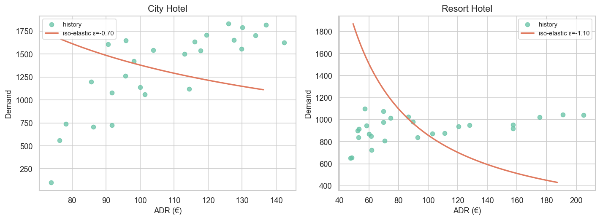

# 22 — Price Elasticity of Demand: City vs Resort

> **Loại:** Báo cáo khoa học kỹ thuật (IMRAD) · recommend-only  
> **Dữ liệu:** `hotel_bookings_v5.csv` · stay (`is_canceled = 0`, `adr > 0`) · ~26 tháng/hotel (2015-07 → 2017-08)  
> **Notebook:** [`notebooks/22_dynamic_pricing_elasticity_city_resort.ipynb`](../notebooks/22_dynamic_pricing_elasticity_city_resort.ipynb)  
> **Figures:** [`reports/figures/22_elasticity/`](./figures/22_elasticity/)  
> **Đầu ra chính:** [`elasticity_by_hotel.csv`](./figures/22_elasticity/elasticity_by_hotel.csv) → notebook **23**  
> **Cập nhật:** 22/07/2026

---

## Abstract

This technical report estimates the price elasticity of monthly stay demand for City Hotel and Resort Hotel from the cleaned booking panel `hotel_bookings_v5.csv`. Three econometric specifications were estimated for each property: log–log ordinary least squares with month fixed effects, first-difference regression, and segment-level log–log regression with month fixed effects. Across all historical estimators the point estimates were positive, which is inconsistent with the theoretical expectation $\varepsilon = \partial\log Q/\partial\log P < 0$ and indicates residual seasonality and price endogeneity rather than a causal demand slope. Consequently, operational elasticities were set to revenue-management priors of $-0.70$ (City) and $-1.10$ (Resort) and exported for rate optimization. The resulting parameters imply inelastic demand at City (favoring protective BAR moves) and mildly elastic demand at Resort (favoring deeper stimulation when pressure is weak).

---

## 1. Introduction

Dynamic pricing for hotel properties requires a quantitative link between rate and booking volume. Forecast notebooks 20, 20a, and 20b supply monthly demand, average daily rate (ADR), and revenue per available room (RevPAR) signals by property, yet they do not specify how quantity responds when the BAR is moved away from the forecast baseline. Price elasticity of demand fills that gap by providing a scalar control parameter for subsequent optimization.

The classical definition used here is $\varepsilon = \partial\log Q/\partial\log P$. Under standard demand theory $\varepsilon$ is negative; absolute values below one indicate inelastic demand (rate hardening tends to raise revenue), whereas absolute values above one indicate elastic demand (promotional cuts can expand revenue when occupancy pressure is soft). Estimating $\varepsilon$ from observational hotel data is difficult because ADR co-moves with seasonality, channel mix, and inventory controls. The present study therefore compares several reduced-form estimators, documents their bias, and selects a primary elasticity suitable for recommend-only rate planning rather than causal inference.

The objective was threefold: construct a monthly panel of demand, ADR, occupancy, and RevPAR by hotel; estimate elasticity under log–log, first-difference, and market-segment specifications; and publish a primary elasticity table for notebook 23.

---

## 2. Methods

### 2.1 Data and panel construction

Stay bookings with positive ADR were aggregated to calendar month within each hotel. The resulting panel contains twenty-six months per property. City Hotel contributed 35,137 stays with mean monthly ADR of approximately €106.78, while Resort Hotel contributed 24,390 stays with mean monthly ADR of approximately €94.45. Occupancy and RevPAR were retained as contextual metrics but were not used as the dependent variable of the elasticity regressions.

### 2.2 Econometric specifications

Three estimators were applied separately to each hotel.

1. Log–log OLS with month fixed effects: $\log Q_{t} = \alpha + \varepsilon\log P_{t} + \sum_{m}\delta_{m} + u_{t}$.  
2. First-difference regression: $\Delta\log Q_{t} = \varepsilon\Delta\log P_{t} + e_{t}$, intended to attenuate low-frequency trend.  
3. Segment log–log with month fixed effects: observations were expanded to hotel × year-month × market segment so that within-month channel/ADR variation could identify $\varepsilon$.

Statistical significance was assessed with conventional $t$-statistics and 95% confidence intervals. Sample sizes were $n = 26$ for monthly specifications, $n = 25$ after first differencing, and $n = 124$ (City) / $n = 113$ (Resort) for the segment panel.

### 2.3 Primary elasticity selection rule

Because all three historical estimators returned positive $\varepsilon$ for at least one hotel (and strongly positive for City), the selection rule preferred any negative statistically significant estimate from the ordered list {first-difference, segment, log–log}; otherwise a revenue-management prior was applied. Priors were City $\varepsilon = -0.70$ and Resort $\varepsilon = -1.10$, reflecting the operational judgment that urban demand is less price-responsive than leisure resort demand.

---

## 3. Results

### 3.1 Descriptive relationship between ADR and demand

Figure 1 shows the raw scatter of mean ADR against monthly stay demand by hotel together with a linear trend overlay. The visual association is dominated by seasonal co-movement: high-ADR summer months also tend to carry high volume, so an unconditional slope need not be negative.

*Figure 1. Scatter of monthly mean ADR (€) against stay demand for City Hotel and Resort Hotel, with hotel-specific trend lines.*

### 3.2 Econometric estimates

Table 1 reports all estimated elasticities. For City Hotel, log–log month FE yielded $\varepsilon = 3.50$ (SE $= 0.53$, $p < .001$, $R^{2} = 0.83$), first-difference yielded $\varepsilon = 1.93$ (SE $= 0.59$, $p = .003$), and segment log–log yielded $\varepsilon = 3.32$ (SE $= 0.45$, $p < .001$). For Resort Hotel, the corresponding estimates were $0.41$ ($p = .096$), $0.11$ ($p = .24$), and $1.07$ ($p < .001$). No specification produced a negative point estimate that satisfied the primary-selection rule.

**Table 1.** Elasticity estimates by hotel and method

| Hotel | Method | $\varepsilon$ | SE | $t$ | $p$ | $R^{2}$ | $n$ | 95% CI |
|---|---|---:|---:|---:|---:|---:|---:|---|
| City | loglog_ols_month_fe | 3.50 | 0.53 | 6.55 | <.001 | 0.83 | 26 | [2.45, 4.55] |
| Resort | loglog_ols_month_fe | 0.41 | 0.23 | 1.80 | .096 | 0.72 | 26 | [−0.04, 0.85] |
| City | first_difference | 1.93 | 0.59 | 3.28 | .003 | 0.31 | 25 | [0.77, 3.08] |
| Resort | first_difference | 0.11 | 0.09 | 1.21 | .238 | 0.06 | 25 | [−0.07, 0.30] |
| City | segment_loglog_month_fe | 3.32 | 0.45 | 7.44 | <.001 | 0.34 | 124 | [2.44, 4.19] |
| Resort | segment_loglog_month_fe | 1.07 | 0.28 | 3.81 | <.001 | 0.23 | 113 | [0.52, 1.63] |

### 3.3 Primary elasticities for operations

Table 2 records the exported primary parameters. Both hotels were assigned the revenue-management prior because OLS estimates remained positively biased. City was labeled inelastic ($|\varepsilon| < 1$), while Resort was labeled mildly elastic ($|\varepsilon| > 1$).

**Table 2.** Primary elasticity exported to optimization

| Hotel | $\varepsilon_{\mathrm{primary}}$ | Source | Note |
|---|---:|---|---|
| City Hotel | **−0.70** | rm_prior | OLS biased positive (seasonality/endogeneity) |
| Resort Hotel | **−1.10** | rm_prior | OLS biased positive (seasonality/endogeneity) |

Figure 2 displays iso-elastic demand curves centered at each hotel’s mean ADR using the primary elasticities. The steeper absolute slope for Resort illustrates greater quantity response to a given percentage rate change.

*Figure 2. Fitted iso-elastic curves $Q(P)$ around mean ADR using $\varepsilon_{\mathrm{primary}}$ for City (−0.70) and Resort (−1.10).*

---

## 4. Discussion

The uniformly positive reduced-form elasticities should not be interpreted as evidence that guests book more when prices rise. Instead, they indicate that the short monthly panel cannot separate exogenous price variation from seasonal demand shocks: summer months combine high ADR with high volume, and even month fixed effects or first differences leave residual endogeneity. Segment-level pooling increases sample size but still fails to recover a negative City slope, reinforcing that a causal design (instrument, natural experiment, or controlled A/B rate test) would be required for identification.

For revenue management, the practical implication is to treat $\varepsilon$ as a **control parameter** with an explicit prior rather than as an estimated causal constant. With City $\varepsilon = -0.70$, a one-percent BAR increase is expected to reduce demand by about 0.7%, so protective pricing in high-pressure months is consistent with revenue growth. With Resort $\varepsilon = -1.10$, promotional cuts are more effective when ADR and RevPAR pressure fall below seasonal baselines, which aligns with the Oct–Jan stimulation window identified in the forecast playbook (report 21).

Several limitations constrain generalization. The panel spans only about twenty-six months per hotel, so power is low and confidence intervals are wide. Competitive set rates, events, and capacity constraints are unobserved. The priors themselves are not estimated from this dataset and should be stress-tested with sensitivity grids in optimization. Finally, all recommendations remain advisory until validated against pickup and sell-out outcomes.

---

## 5. Conclusions

Historical log–log and first-difference estimators of monthly price elasticity were positively biased for both City and Resort hotels and therefore were not used as operational controls. Primary elasticities of $-0.70$ (City) and $-1.10$ (Resort) were selected from revenue-management priors and published in `elasticity_by_hotel.csv` for notebook 23. These values encode an inelastic urban property and a mildly elastic resort property, providing a transparent link between forecast pressure and subsequent BAR optimization.

---

## References (project artifacts)

1. Notebook source: `notebooks/22_dynamic_pricing_elasticity_city_resort.ipynb`  
2. Output tables: `reports/figures/22_elasticity/elasticity_estimates_all.csv`, `elasticity_by_hotel.csv`, `monthly_panel.csv`  
3. Upstream forecasts: reports `20`, `20a`, `20b`, synthesis `21`  
4. Downstream consumer: notebook `23_dynamic_pricing_optimization_city_resort.ipynb`

---

*Báo cáo sinh theo khung scientific-writing (IMRAD) từ `notebooks/22_dynamic_pricing_elasticity_city_resort.ipynb`. Cập nhật: 22/07/2026.*
