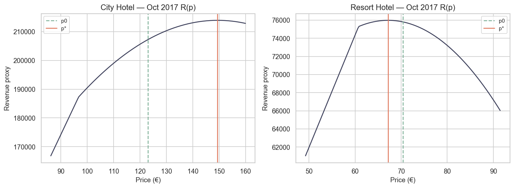

# 23 — Tối ưu dynamic pricing: Elasticity × Forecast (City vs Resort)

> **Loại:** Báo cáo khoa học kỹ thuật (IMRAD) · recommend-only  
> **Đầu vào:** Forecast Demand / ADR / RevPAR (`20` / `20a` / `20b`) · $\varepsilon$ primary (`22`)  
> **Horizon:** 2017-09 → 2018-02 (6 tháng minh họa)  
> **Notebook:** [`notebooks/23_dynamic_pricing_optimization_city_resort.ipynb`](../notebooks/23_dynamic_pricing_optimization_city_resort.ipynb)  
> **Figures:** [`reports/figures/23_optimization/`](./figures/23_optimization/)  
> **Đầu ra chính:** [`optimal_rate_plan.csv`](./figures/23_optimization/optimal_rate_plan.csv)  
> **Cập nhật:** 22/07/2026

---

## Tóm tắt

Báo cáo này chuyển forecast demand, ADR và RevPAR theo từng property thành kế hoạch BAR tháng bằng cách tối đa hóa revenue proxy dưới demand local-linear, hiệu chỉnh theo $\varepsilon$ primary từ notebook 22. Với mỗi tháng trên horizon 2017-09 → 2018-02, grid search trong khoảng $p \in [0.70\,P_0,\,1.30\,P_0]$ chọn $p^{\star}$ sao cho $R(p)=p\cdot Q(p)$ đạt cực đại, chịu soft capacity $1.15\times$ demand forecast, và điểm tham chiếu tìm kiếm được nghiêng theo blended pressure. City Hotel nhận action RAISE đồng nhất $+21{,}4\%$ so với ADR forecast, tăng revenue proxy khoảng $+3{,}2\%$/tháng. Resort Hotel nhận action CUT đồng nhất $-4{,}5\%$, tăng revenue proxy khoảng $+0{,}23\%$/tháng. Hai chiều recommendation ngược dấu này chính thức hóa sự bất đối xứng vận hành đã thấy ở forecast stance: bảo vệ giá đô thị (PROTECT) trong khi kích cầu resort qua đáy mùa đông (STIMULATE).

---

## 1. Giới thiệu

Các notebook forecast 20–20b cho biết volume và rate kỳ vọng theo baseline mùa vụ; notebook 22 cung cấp độ dốc liên hệ thay đổi giá với số lượng. Nếu thiếu bước tối ưu tường minh, revenue manager buộc phải diễn dịch tín hiệu một cách định tính. Nghiên cứu này khép khoảng trống đó bằng bài toán tối đa hóa doanh thu tháng có ràng buộc, trả về $p^{\star}$ rõ ràng, $\Delta$ phần trăm so với ADR forecast, và nhãn action rời rạc (RAISE / CUT / HOLD).

Câu hỏi trung tâm là liệu elasticity và chỉ số pressure theo property có tạo ra recommendation BAR khác biệt đáng kể trên cùng horizon 6 tháng hay không. Báo cáo tổng hợp 21 đã chỉ ra ADR và RevPAR của Resort rơi sớm và sâu hơn City sau tháng 9; bước tối ưu kiểm tra xem lệch pha thời gian đó còn tồn tại khi doanh thu được tối đa hóa dưới các $\varepsilon$ đã công bố.

---

## 2. Phương pháp

### 2.1 Đầu vào

Với mỗi hotel và tháng $t$ trên horizon, bộ tối ưu nhận ADR forecast $P_0$, demand forecast $Q_0$, RevPAR forecast, cùng các chỉ số pressure $\pi_{\mathrm{demand}}$, $\pi_{\mathrm{ADR}}$, $\pi_{\mathrm{RevPAR}}$ từ primary model ở notebooks 20, 20a và 20b. Elasticity primary là $\varepsilon_{\mathrm{City}}=-0{,}70$ và $\varepsilon_{\mathrm{Resort}}=-1{,}10$ từ `elasticity_by_hotel.csv`.

### 2.2 Phản ứng demand và hàm mục tiêu

Đường iso-elastic thuần $Q(p)=Q_0(p/P_0)^{\varepsilon}$ với $|\varepsilon|<1$ đẩy optimum không ràng buộc lên trần giá và ít tạo sắc thái theo calendar. Do đó dùng xấp xỉ local-linear:

$$
Q(p)=Q_0\left(1+\varepsilon\frac{p-P_0}{P_0}\right),
$$

cắt dưới tại $0{,}05\,Q_0$ và trần soft capacity $Q_{\mathrm{cap}}=1{,}15\,Q_0$. Revenue proxy là $R(p)=p\cdot\min\{Q(p),Q_{\mathrm{cap}}\}$.

### 2.3 Nghiêng theo pressure và grid search

Blended pressure $\bar{\pi}$ là trung bình ba series pressure. Rate tham chiếu trước khi tìm kiếm:

$$
P_{\mathrm{ref}}=P_0\cdot\mathrm{clip}(0{,}70+0{,}30\,\bar{\pi},\,0{,}80,\,1{,}20).
$$

Các mức giá ứng viên được đánh giá trên lưới dày trong $[0{,}70\,P_0,\,1{,}30\,P_0]$. Nghiệm analytic $p_{\mathrm{analytic}}=P_0(\varepsilon-1)/(2\varepsilon)$ (khi $\varepsilon<0$) được lưu để đối chiếu chẩn đoán. Action gán RAISE nếu $\Delta p\ge +3\%$, CUT nếu $\Delta p\le -3\%$, và HOLD nếu khác, với $\Delta p=100(p^{\star}/P_0-1)$.

---

## 3. Kết quả

### 3.1 Đường rate tối ưu so với ADR forecast

Hình 1 chồng ADR forecast ($P_0$) và BAR tối ưu ($p^{\star}$) theo hotel. City $p^{\star}$ luôn nằm trên $P_0$, trong khi Resort $p^{\star}$ luôn nằm dưới $P_0$. Khoảng cách tuyệt đối (€) lớn hơn khi ADR City cao (tháng 9) và khi ADR Resort sụp (tháng 10–1), nhưng phần trăm thay đổi gần như cố định trong từng hotel vì optimum local-linear tỷ lệ với $P_0$ khi $\varepsilon$ cố định.

*Hình 1. $P_0$ (ADR forecast) và $p^{\star}$ (BAR tối ưu) theo tháng cho City Hotel và Resort Hotel, 2017-09 → 2018-02.*

### 3.2 $\Delta$ giá phần trăm và tóm tắt action

Hình 2 thể hiện $\Delta p$ theo tháng. City khóa ở $+21{,}375\%$ mọi tháng (optimum analytic với $\varepsilon=-0{,}70$ là $P_0(\varepsilon-1)/(2\varepsilon)\approx 1{,}214\,P_0$). Resort khóa ở $-4{,}5\%$ mọi tháng (optimum analytic với $\varepsilon=-1{,}10$ ≈ $0{,}955\,P_0$). Do đó action rời rạc không đảo chiều trong cùng hotel trên horizon này.

*Hình 2. $\Delta$ giá tối ưu (%) so với ADR forecast; cột xanh/đỏ mã hóa RAISE so với CUT.*

**Bảng 1.** Tóm tắt action trên horizon 6 tháng

| Hotel | Action chủ đạo | $n$ tháng | Mean $\Delta p$ (%) | Mean $\Delta$ revenue (%) |
|---|---|---:|---:|---:|
| City Hotel | RAISE | 6 | **+21,38** | **+3,21** |
| Resort Hotel | CUT | 6 | **−4,50** | **+0,23** |

### 3.3 Rate plan đối chiếu City vs Resort

**Bảng 2.** Kế hoạch tối ưu City so với Resort (cột chọn lọc)

| Tháng | City $P_0$ (€) | City $p^{\star}$ (€) | City action | Resort $P_0$ (€) | Resort $p^{\star}$ (€) | Resort action |
|---|---:|---:|---|---:|---:|---|
| 2017-09 | 133,81 | 162,41 | RAISE | 117,22 | 111,95 | CUT |
| 2017-10 | 123,07 | 149,38 | RAISE | 70,37 | 67,20 | CUT |
| 2017-11 | 108,55 | 131,75 | RAISE | 52,53 | 50,17 | CUT |
| 2017-12 | 106,62 | 129,41 | RAISE | 71,41 | 68,20 | CUT |
| 2018-01 | 98,20 | 119,19 | RAISE | 52,09 | 49,75 | CUT |
| 2018-02 | 100,51 | 121,99 | RAISE | 57,75 | 55,15 | CUT |

### 3.4 Đường cong revenue tháng Oct (tháng lệch pha)

Hình 3 vẽ đường cong revenue tháng 10/2017 cho cả hai hotel, đánh dấu $P_0$, $p^{\star}$ và tham chiếu analytic. Tháng 10 là thời điểm forecast stance đã phân kỳ rõ (City còn gần NEUTRAL trên ADR/RevPAR trong khi Resort bước vào STIMULATE). Mức CUT tối ưu của Resort vẫn khiêm tốn (−4,5%), cho thấy kích cầu theo elasticity không đồng nghĩa giảm sâu khi soft capacity ràng buộc và $|\varepsilon|$ chỉ hơi lớn hơn 1.

*Hình 3. Revenue proxy $R(p)$ theo BAR tháng 10/2017, làm nổi $P_0$ và $p^{\star}$ từng hotel.*

### 3.5 Đối chiếu với forecast stance

Forecast stance (PROTECT / NEUTRAL / STIMULATE) thay đổi theo tháng và series, trong khi action của optimizer cố định trong từng hotel khi $\varepsilon$ không đổi. Các tháng City có stance STIMULATE (ví dụ tháng 12–1 trên demand/RevPAR) vẫn nhận RAISE vì demand kém co giãn khiến BAR cao hơn vẫn tối ưu doanh thu trong band ±30%. Căng thẳng này là có chủ đích: stance kể câu chuyện pressure theo mùa, còn $p^{\star}$ nói optimum doanh thu cục bộ dưới $\varepsilon$ đã chọn. Thực tế vận hành nên hòa giải xung đột bằng cách giữ ADR floor và kiểm tra occupancy thật trước khi lock một tín hiệu đơn lẻ.

---

## 4. Thảo luận

Mẫu City RAISE ngược Resort CUT là kết quả điều hành chính. Nó không đến từ việc ước lượng lại $\varepsilon$ từng tháng, mà từ việc City được tham số hóa là inelastic và Resort là mildly elastic. Do đó $\Delta$ phần trăm gần như bất biến trên horizon, trong khi recommendation tuyệt đối (€) kế thừa đường ADR forecast — gồm cả sụt Oct–Jan của Resort đã ghi ở báo cáo 21.

Pressure tilt điều chỉnh điểm tham chiếu tìm kiếm nhưng không đảo dấu analytic của $p^{\star}-P_0$ khi $\varepsilon$ cố định. Muốn có flip action trong cùng hotel cần elasticity đổi theo tháng, ràng buộc competitive set, hoặc capacity rooms available thật sự ràng buộc. Cho đến khi đó, giá trị calendar của notebook 23 chủ yếu là dịch $P_0$ forecast thành band kỷ luật quanh optimum theo property, chứ không tạo bảng chữ cái action mới từng tháng.

Hạn chế là thực chất. Phản ứng demand là proxy local-linear, không có competitive rate hay feedback hủy phòng. Soft capacity $1{,}15\times Q_0$ không phải inventory vật lý. Horizon 2018 mang tính minh họa vì dataset gốc cắt ở 2017-08. Mọi đầu ra vẫn recommend-only, chờ validate pickup.

---

## 5. Kết luận

Dưới $\varepsilon$ primary từ notebook 22 và forecast từ notebooks 20–20b, tối ưu BAR nhằm tối đa hóa doanh thu khuyến nghị City RAISE bền vững khoảng $+21\%$ và Resort CUT bền vững khoảng $-4{,}5\%$ trên horizon minh họa 6 tháng, với mức tăng revenue proxy lần lượt $+3{,}2\%$ và $+0{,}23\%$. Kế hoạch chính thức hóa rate calendar hai đường: harden BAR City so với forecast, đồng thời kích cầu Resort qua đáy ADR mùa đông. Logic ensemble ở notebook 24 nên xem $p^{\star}$ như một phiếu bầu cạnh forecast stance và tín hiệu BAR từ machine learning, chứ không phải khóa duy nhất.

---

## Tài liệu nguồn (artifact dự án)

1. Notebook nguồn: `notebooks/23_dynamic_pricing_optimization_city_resort.ipynb`  
2. Đầu ra: `optimal_rate_plan.csv`, `action_summary.csv`, `compare/city_vs_resort_rate_plan.csv`  
3. Elasticity đầu vào: `reports/figures/22_elasticity/elasticity_by_hotel.csv`  
4. Forecast đầu vào: `reports/figures/20/`, `20_adr/`, `20_revpar/`

---

*Báo cáo theo khung scientific-writing (IMRAD), trình bày tiếng Việt, từ `notebooks/23_dynamic_pricing_optimization_city_resort.ipynb`. Cập nhật: 22/07/2026.*
