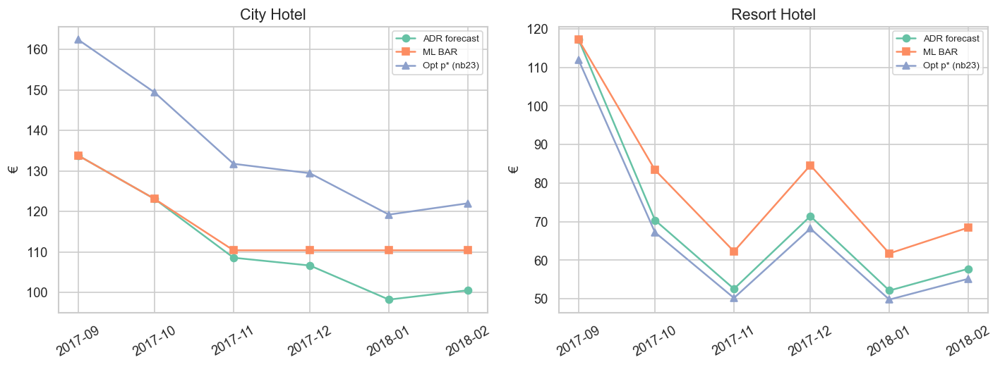
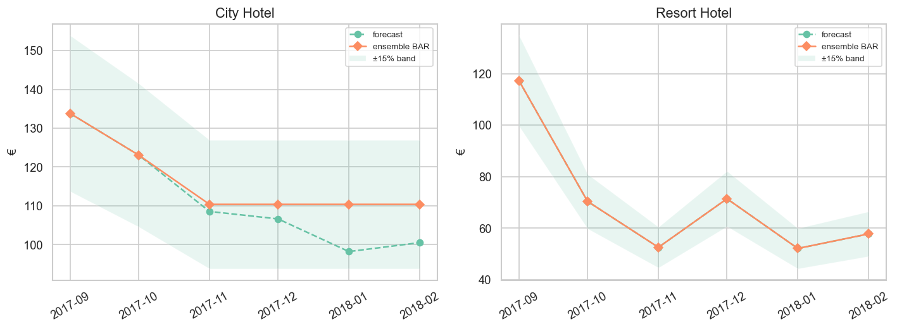

# 24 — ML Dynamic Pricing: City vs Resort

> **Loại:** Báo cáo khoa học kỹ thuật (IMRAD) · recommend-only  
> **Đầu vào:** Panel lịch sử + forecast/pressure `20*` + optimization $p^{\star}$ (`23`)  
> **Models:** `HistGradientBoostingRegressor` · `HistGradientBoostingClassifier` (scikit-learn)  
> **Horizon:** 2017-09 → 2018-02  
> **Notebook:** [`notebooks/24_dynamic_pricing_ml_city_resort.ipynb`](../notebooks/24_dynamic_pricing_ml_city_resort.ipynb)  
> **Figures:** [`reports/figures/24_ml_pricing/`](./figures/24_ml_pricing/)  
> **Đầu ra chính:** [`ensemble_rate_recommend.csv`](./figures/24_ml_pricing/ensemble_rate_recommend.csv)  
> **Cập nhật:** 22/07/2026

---

## Abstract

This report develops a machine-learning layer for property-specific dynamic pricing that predicts next-month ADR and a three-class pricing stance, then ensembles those predictions with classical forecast ADR and optimization $p^{\star}$. Using lag and mix features on the monthly stay panel, HistGradientBoosting models were trained under time-series cross-validation. Out-of-fold regressor performance was weak on the short sample (fold MAPE from 0.25 to 0.88; negative $R^{2}$), and stance accuracy was unstable (0.17–0.83 across folds). On the September 2017–February 2018 horizon the classifier labeled every month PROTECT, while the regressor often lifted Resort ADR toward a seasonal adjustment band. A median ensemble of forecast ADR, ML ADR, and $p^{\star}$ produced a BAR recommendation with $\pm 15\%$ guardrails and majority-vote final actions. The ensemble softened pure optimization extremes: City mixed RAISE and HOLD, whereas Resort mixed HOLD (September) with CUT thereafter, preserving the winter stimulation narrative without blindly applying the $+21\%$ City raise from notebook 23.

---

## 1. Introduction

Classical forecasting (notebooks 20–20b) and elasticity optimization (notebook 23) are transparent but parametric. A complementary question is whether supervised learning on historical monthly states can propose ADR and stance labels that improve operational robustness when models disagree. The present study therefore trains dual heads—ADR regression and stance classification—and fuses ML outputs with forecast and optimization signals into a single recommend-only BAR band.

The scientific goal is not to claim state-of-the-art predictive accuracy on twenty-six months of data; rather, it is to document what a constrained tree ensemble can and cannot contribute, and to publish an auditable ensemble rule that revenue managers can challenge against pickup.

---

## 2. Methods

### 2.1 Feature engineering

A monthly feature panel was built per hotel with calendar indicators (`hotel_code`, `month`), lags of demand, ADR, RevPAR, occupancy, and lead time at $t-1$ and $t-12$, three-month rolling means of ADR and demand, and contemporaneous mix shares (Online TA, Groups, Transient), special-request incidence, and mean length of stay. Historical stance labels were derived from the same pressure recipe used in notebook 20 (thresholds mapping combined pressure to STIMULATE / NEUTRAL / PROTECT). After dropping incomplete lag rows, thirteen training months remained per hotel.

### 2.2 Models and validation

Two HistGradientBoosting models (`max_depth=3`, `learning_rate=0.08`, `max_iter=200–250`, `random_state=42`) were fit: a regressor targeting next-month ADR and a classifier targeting stance class. Validation used three expanding time-series folds on the pooled hotel panel. Metrics were mean absolute percentage error (MAPE) and $R^{2}$ for regression, and accuracy for classification. A final full-history fit was applied to the forecast horizon after constructing horizon feature rows from the last observed lags plus forecast context.

### 2.3 Horizon application and ensemble rule

On each horizon month the pipeline produced ML ADR (with a seasonal percentage adjustment clipped for stability) and ML stance. Ensemble BAR was defined as the median of $\{P_0^{\mathrm{fc}},\,P^{\mathrm{ML}},\,p^{\star}\}$, with floor $0.85\times$ and ceiling $1.15\times$ that median. Final action used majority vote (≥2 of 3) among mapped signals from ML stance, optimization action, and ADR-pressure direction, yielding RAISE, CUT, or HOLD.

---

## 3. Results

### 3.1 Cross-validation performance

**Table 1.** Time-series CV — regressor

| Fold | MAPE | $R^{2}$ |
|---:|---:|---:|
| 1 | 0.248 | −3.08 |
| 2 | 0.885 | −7.12 |
| 3 | 0.357 | −0.10 |

**Table 2.** Time-series CV — stance classifier

| Fold | Accuracy |
|---:|---:|
| 1 | 0.833 |
| 2 | 0.333 |
| 3 | 0.167 |

Mean fold MAPE was approximately 0.50 and mean stance accuracy approximately 0.44. Negative $R^{2}$ values indicate that, on held-out folds, the regressor underperformed a trivial mean baseline—an expected outcome on a short monthly sample with strong seasonality. A holdout-style window on the last six in-sample months yielded MAPE ≈ 0.27 and overall stance accuracy 0.50, with perfect recall but only moderate precision on the PROTECT class.

### 3.2 Horizon ML plan versus forecast and optimization

Figure 1 compares forecast ADR, ML ADR, and optimization $p^{\star}$ over the six-month horizon. For City, ML ADR tracks $P_0$ in September–October and then sits near €110.4, which is above weak winter forecast ADR and far below the aggressive $p^{\star}$ raise. For Resort, ML ADR lies above the collapsed forecast path from October onward (for example €83.4 versus €70.4 in October), while $p^{\star}$ remains a modest cut beneath $P_0$.

*Figure 1. Horizon comparison of forecast ADR ($P_0$), ML ADR, and optimization $p^{\star}$ by hotel.*

Despite forecast pressure often signaling STIMULATE for Resort ADR/RevPAR in winter, the fitted classifier emitted PROTECT for all twelve hotel-months on the horizon. This conservatism is consistent with class imbalance and the small training support for STIMULATE in the lagged panel; it also warns against treating ML stance as a standalone lock.

### 3.3 Ensemble BAR band and final actions

Figure 2 shows the ensemble recommendation with floor and ceiling bands. Table 3 summarizes final actions after majority vote.

*Figure 2. Ensemble BAR (median of forecast, ML, and $p^{\star}$) with floor $0.85\times$ and ceiling $1.15\times$.*

**Table 3.** Ensemble final actions (2017-09 → 2018-02)

| Month | City final | City BAR rec. (€) | Resort final | Resort BAR rec. (€) |
|---|---|---:|---|---:|
| 2017-09 | RAISE | 133.81 | HOLD | 117.22 |
| 2017-10 | HOLD | 123.07 | CUT | 70.37 |
| 2017-11 | HOLD | 110.38 | CUT | 52.53 |
| 2017-12 | RAISE | 110.38 | CUT | 71.41 |
| 2018-01 | RAISE | 110.38 | CUT | 52.09 |
| 2018-02 | RAISE | 110.38 | CUT | 57.75 |

Relative to notebook 23’s uniform City RAISE / Resort CUT, the ensemble introduces HOLD months for City (October–November) and a HOLD for Resort in September, when ADR/RevPAR pressure remains strong. Winter Resort CUT is retained, matching the phase-shift playbook, while City raises are milder because the median is pulled toward forecast/ML rather than toward $p^{\star}$ alone.

---

## 4. Discussion

The dual-head ML layer adds value primarily as a **regularizer and mediator**, not as a high-accuracy forecaster. Cross-validation shows that HistGradientBoosting cannot stably learn ADR dynamics from roughly one year of usable lagged months per hotel; depth was therefore capped at three to limit overfit. On the horizon, the regressor’s seasonal adjustment lifts soft Resort ADR forecasts, while the always-PROTECT classifier vetoes aggressive stimulation language even when classical pressure is weak.

The ensemble rule is the operational product. By taking the median of three differently biased estimators and requiring majority agreement for RAISE/CUT, the pipeline avoids locking the analytic $+21\%$ City raise that inelastic local-linear optimization prefers. Simultaneously it preserves Resort winter cuts when optimization and pressure align, with September HOLD acknowledging residual peak-season strength. This is a heuristic governance layer, not reinforcement learning and not a substitute for competitive-set monitoring.

Limitations include the short monthly sample, frozen lag state for multi-step horizon inference, absence of competitor rates and event calendars, and the heuristic nature of voting thresholds. Models should be re-fit when additional actual months arrive, and BAR recommendations should be scored against pickup before live lock.

---

## 5. Conclusions

On the available monthly panel, HistGradientBoosting ADR and stance models are statistically fragile under time-series cross-validation, yet their horizon outputs usefully temper optimization extremes when median-ensembled with forecast ADR and $p^{\star}$. The published recommend-only plan raises or holds City BAR near the forecast/ML median and cuts Resort BAR from October through February inside a $\pm 15\%$ band. Notebook 24 therefore completes the City–Resort dynamic pricing stack as a governed decision surface rather than as a standalone predictive champion.

---

## References (project artifacts)

1. Notebook source: `notebooks/24_dynamic_pricing_ml_city_resort.ipynb`  
2. Outputs: `ml_rate_plan.csv`, `ensemble_rate_recommend.csv`, `cv_regressor.csv`, `cv_classifier.csv`  
3. Upstream: reports `20`/`20a`/`20b`/`21`, `22`, `23`  
4. Library: scikit-learn `HistGradientBoostingRegressor` / `HistGradientBoostingClassifier`

---

*Báo cáo sinh theo khung scientific-writing (IMRAD) từ `notebooks/24_dynamic_pricing_ml_city_resort.ipynb`. Cập nhật: 22/07/2026.*
