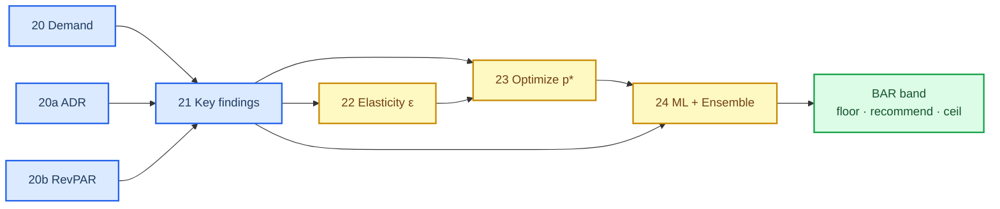
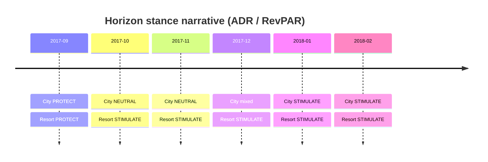
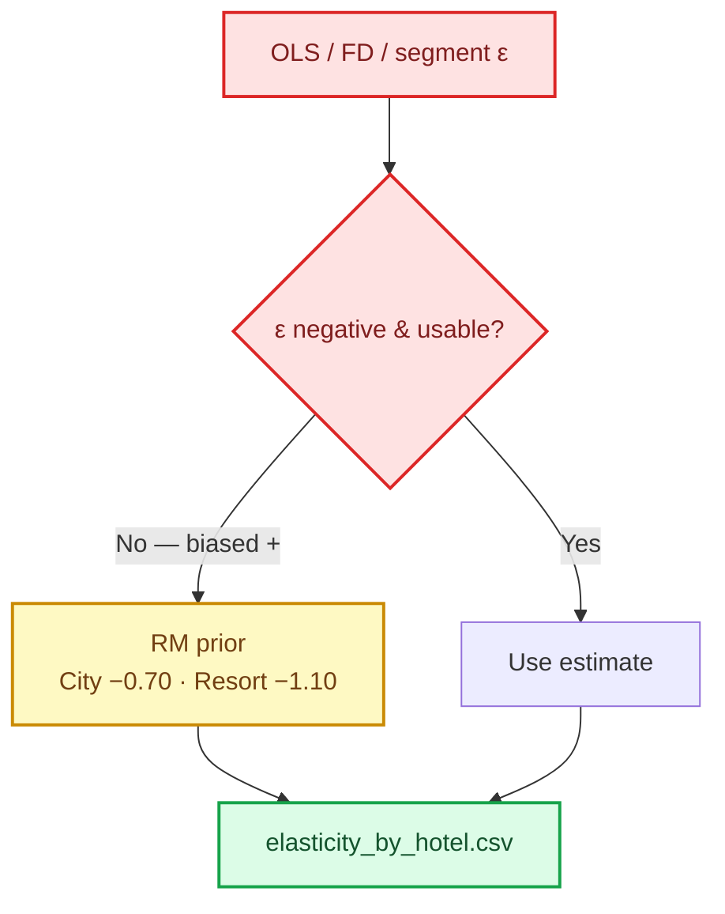
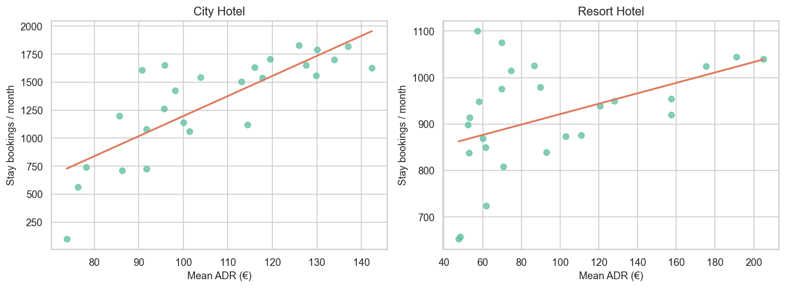
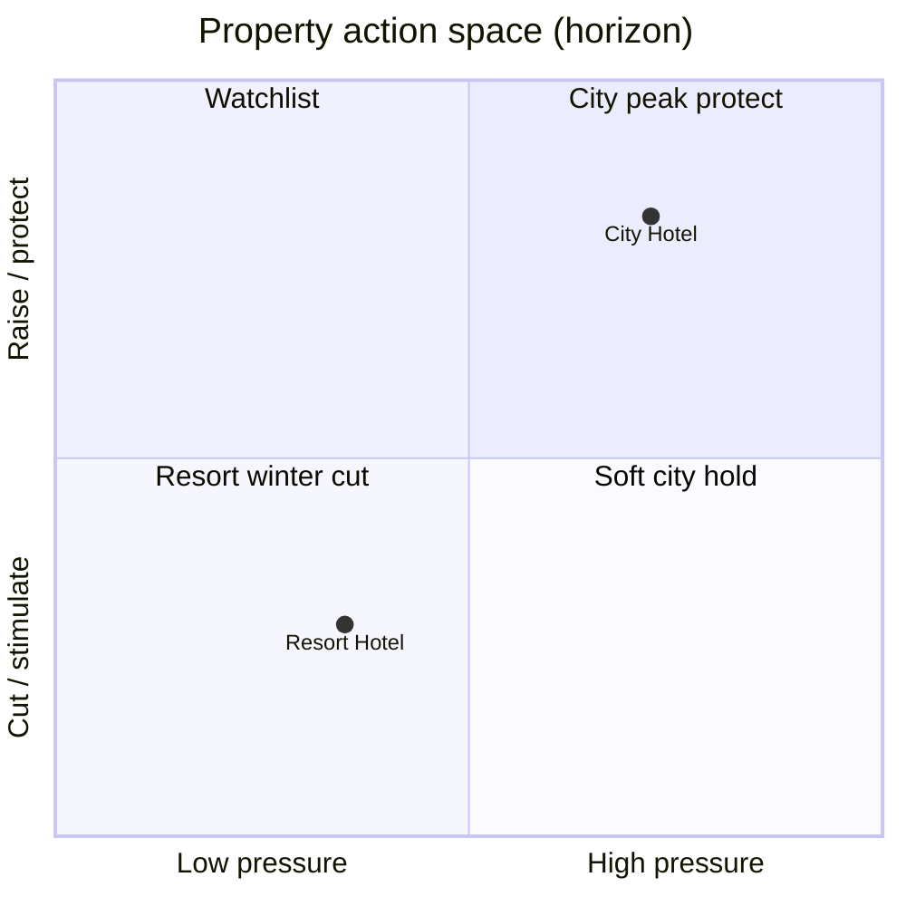
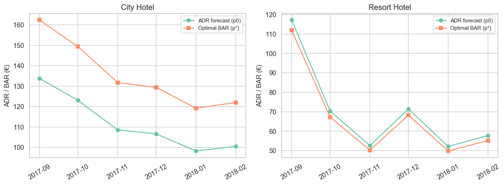
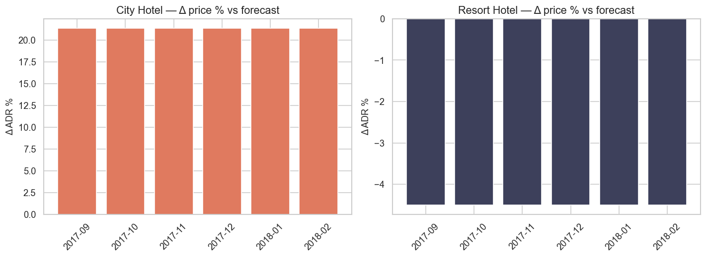
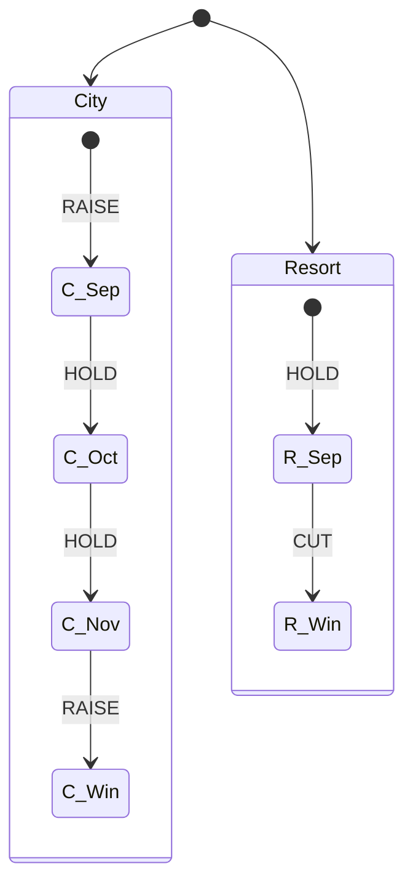
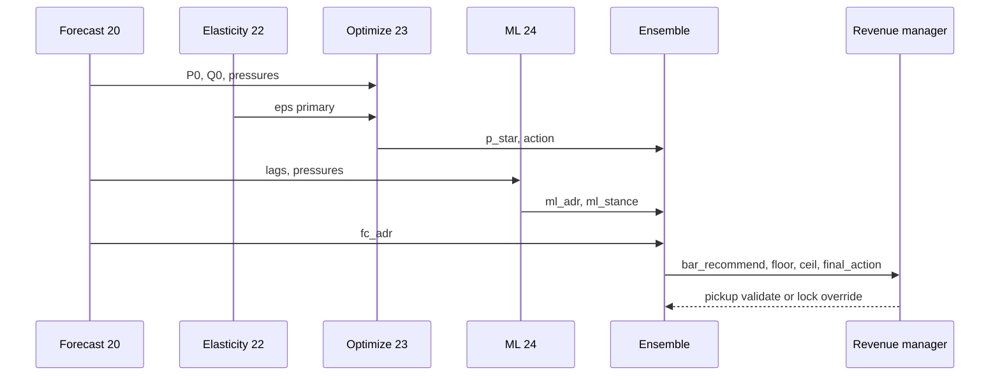

# Dynamic pricing pipeline — tổng hợp City vs Resort (notebooks 20 → 24)

_Hotel Booking Demand · facet City / Resort · báo cáo điều hành end-to-end · cập nhật 22/07/2026_

---

## 📋 TL;DR

- **Overall:** Chuỗi 20→24 hoàn tất vòng forecast → elasticity → tối ưu → ML ensemble cho **hai property riêng**.
- **Primary forecast:** City volume = Seasonal Naive; Resort volume = Holt; Resort ADR = SARIMAX; RevPAR cả hai = Naive.[^1]
- **Elasticity vận hành:** City $\varepsilon=-0.70$ (kém co giãn) · Resort $\varepsilon=-1.10$ (co giãn nhẹ) — OLS lịch sử bị bias dương nên dùng RM prior.[^2]
- **Tối ưu thuần:** City **RAISE ~+21%** · Resort **CUT ~−4.5%** trên cả 6 tháng horizon.[^3]
- **Ensemble cuối (24):** City RAISE/HOLD ôn hòa hơn · Resort HOLD tháng 9 rồi **CUT từ Oct** — khớp lệch pha ADR/RevPAR.[^4]

---

## 🔄 Pipeline overview

Chuỗi notebook tạo một pipeline quyết định giá theo tháng, tách City / Resort từ đầu đến cuối.

| Stage | Notebook / report | Deliverable |
| ----- | ----------------- | ----------- |
| Forecast volume | [`20`](20_demand_forecasting_dynamic_pricing_city_resort.md) | Primary model + stance demand |
| Forecast rate | [`20a`](20a_demand_forecasting_dynamic_pricing_adr_city_resort.md) | ADR ladder + stance ADR |
| Forecast RevPAR | [`20b`](20b_demand_forecasting_dynamic_pricing_RevPAR_city_resort.md) | KPI proxy + stance RevPAR |
| Synthesis forecast | [`21`](21_key_findings_after_forecasting_models_city_resort.md) | Playbook 90 ngày |
| Elasticity | [`22`](22_dynamic_pricing_elasticity_city_resort.md) | $\varepsilon_{\mathrm{primary}}$ |
| Optimization | [`23`](23_dynamic_pricing_optimization_city_resort.md) | $p^{\star}$, $\Delta p$, action |
| ML + ensemble | [`24`](24_dynamic_pricing_ml_city_resort.md) | `bar_recommend` ±15% |

---

## 📡 Health of the stack

| Area | Status | Trend | Notes |
| ---- | ------ | ----- | ----- |
| **Forecast facet** | 🟢 Ready | → | Holdout MAPE đủ dùng; PI SARIMAX hạn chế[^1] |
| **Elasticity ID** | 🟡 Prior | → | OLS dương → không causal; dùng RM prior[^2] |
| **Optimization** | 🟢 Ready | → | $p^{\star}$ analytic ổn định theo $\varepsilon$[^3] |
| **ML accuracy** | 🟡 Fragile | ↓ | CV MAPE ~0.50 · stance acc không ổn[^4] |
| **Ensemble governance** | 🟢 Ready | ↑ | Median + majority vote làm mềm cực trị 23 |

**Status key:** 🟢 On track · 🟡 At risk / caveat · 🔴 Blocked

---

## 📊 Forecast layer (20 · 20a · 20b · 21)

### Holdout primary models

| Series | City primary | City MAPE | Resort primary | Resort MAPE |
| ------ | ------------ | --------: | -------------- | ----------: |
| Demand | Seasonal Naive | **7.8%** | Holt trend | **5.5%** |
| ADR | SARIMAX ≈ Naive | **12.4%** | **SARIMAX** | **7.1%** |
| RevPAR | Seasonal Naive | **5.3%** | Seasonal Naive | **4.1%** |

### Phase-shift that drives pricing

| Observation | Interpretation | Implication |
| ----------- | -------------- | ----------- |
| Sep đồng thuận PROTECT | Peak còn cứng | Harden BAR cả hai |
| Oct Resort ADR/RevPAR rơi sâu | Lệch pha vs City | Promo Resort **trước** City |
| City SARIMAX demand MAPE 45% | Model volume gãy | Cấm SARIMAX volume City |
| RevPAR PI coverage 0% | Khoảng tin cậy vô dụng | Primary = Naive; bỏ PI |

Chi tiết chart overlay và playbook lever: [`21_key_findings_after_forecasting_models_city_resort.md`](21_key_findings_after_forecasting_models_city_resort.md).

---

## 📉 Elasticity layer (22)

| Hotel | $\varepsilon_{\mathrm{primary}}$ | Business read |
| ----- | -------------------------------: | ------------- |
| City | **−0.70** | Inelastic → dễ PROTECT / RAISE |
| Resort | **−1.10** | Mildly elastic → CUT/promo hiệu quả hơn khi pressure thấp |

Ước lượng lịch sử (không dùng làm primary)

| Hotel | Method | $\varepsilon$ | $p$ |
| ----- | ------ | ------------: | --: |
| City | log–log month FE | +3.50 | <.001 |
| City | first difference | +1.93 | .003 |
| Resort | log–log month FE | +0.41 | .096 |
| Resort | segment log–log | +1.07 | <.001 |

---

## 🎯 Optimization layer (23)

Mục tiêu: $\max_p\, R(p)=p\cdot Q(p)$ với demand local-linear quanh $(P_0,Q_0)$, band $[0.70P_0,1.30P_0]$, soft capacity $1.15Q_0$.[^3]

| Hotel | Action (6/6 tháng) | Mean $\Delta p$ | Mean $\Delta$ revenue |
| ----- | ------------------ | -------------: | --------------------: |
| City | RAISE | **+21.4%** | **+3.2%** |
| Resort | CUT | **−4.5%** | **+0.23%** |

> **Lưu ý điều hành:** $\Delta p$ gần như **không đổi theo tháng** vì $\varepsilon$ cố định — calendar “sống” nhờ đường $P_0$ forecast (đặc biệt Resort Oct–Jan), không nhờ flip action.

---

## 🤖 ML + ensemble layer (24)

### Model health

| Head | CV signal | Horizon behavior |
| ---- | --------- | ---------------- |
| HGB Regressor | MAPE folds 0.25 / 0.89 / 0.36 · $R^{2}<0$ | Nâng ADR Resort mùa yếu; City kéo về ~€110 |
| HGB Classifier | Acc 0.83 / 0.33 / 0.17 | **PROTECT mọi tháng** horizon — quá bảo thủ |
| Ensemble | Median($P_0$, ML, $p^{\star}$) ±15% | Final action = majority vote |

### Final recommend actions

| Month | City final | City BAR € | Resort final | Resort BAR € |
| ----- | ---------- | ---------: | ------------ | -----------: |
| 2017-09 | RAISE | 133.81 | HOLD | 117.22 |
| 2017-10 | HOLD | 123.07 | CUT | 70.37 |
| 2017-11 | HOLD | 110.38 | CUT | 52.53 |
| 2017-12 | RAISE | 110.38 | CUT | 71.41 |
| 2018-01 | RAISE | 110.38 | CUT | 52.09 |
| 2018-02 | RAISE | 110.38 | CUT | 57.75 |

---

## 🧭 Decision map — từ tín hiệu đến BAR

_Monthly BAR decision sequence: forecast, elasticity, optimization, and ML feed a median ensemble with guardrails for the revenue manager._

| Nếu… | Thì ưu tiên… | Vì… |
| ---- | ------------ | --- |
| 2/3 tín hiệu RAISE/PROTECT | Harden trong band | Bảo vệ yield City / peak |
| 2/3 tín hiệu CUT/STIMULATE | Promo có floor 0.85× median | Kích cầu Resort đáy |
| Stance STIM nhưng opt RAISE (City) | Floor ADR + check Occ thật | $\varepsilon$ inelastic vs narrative mùa |
| ML stance luôn PROTECT | Không lock riêng ML | CV yếu · class imbalance |

---

## 📒 Playbook 90 ngày (cập nhật sau 22–24)

| Ưu tiên | Hành động | Cơ sở |
| ------- | --------- | ----- |
| **P0** | Sep: harden cả hai; Resort **HOLD** ensemble (không cắt sớm) | Pressure cao + vote HOLD |
| **P0** | Oct–Feb Resort: **CUT** trong band ensemble (không copy +21% City) | Opt −4.5% + forecast STIM |
| **P0** | City: RAISE chọn lọc (Sep, Dec–Feb); HOLD Oct–Nov | Ensemble làm mềm $p^{\star}$ |
| **P1** | Dashboard 3 series × 2 hotel + `bar_recommend` | Phát hiện lệch pickup |
| **P1** | Sensitivity $\varepsilon$ ±0.2 quanh prior | OLS chưa identify được |
| **P2** | Re-fit forecast/ML mỗi quý | Mẫu ngắn · Holt/CV mong manh |
| **P3** | Capacity thật + competitive set | Soft cap 1.15×$Q_0$ chỉ là proxy |

### Lever sheet

| Lever | City | Resort |
| ----- | ---- | ------ |
| **Rate calendar** | Median ensemble; tránh lock +21% thuần | CUT mùa đông; Sep HOLD |
| **Promo depth** | Nông · có ceiling 1.15× | Sâu hơn City nhưng ≥ floor 0.85× |
| **Channel** | PROTECT → Direct | STIM → OTA kiểm soát commission |
| **Model ops** | Cấm SARIMAX volume; ML không solo | Cấm PI RevPAR; ε prior bắt buộc ghi chú |

---

## ⚠️ Decisions needed

### Decision 1: Lock ensemble BAR hay tối ưu thuần (23)?

**Context:** Notebook 23 đẩy City +21% mọi tháng; notebook 24 làm mềm thành RAISE/HOLD quanh forecast/ML median.

| Option | Impact | Recommendation |
| ------ | ------ | -------------- |
| A — Ensemble (24) | An toàn pickup · ít shock ADR | **Recommended** cho live trial |
| B — Opt $p^{\star}$ (23) | Max proxy revenue theo $\varepsilon$ | Chỉ A/B test có kiểm soát |
| C — Forecast stance only (21) | Đúng narrative mùa · thiếu € BAR | Không đủ để lock số |

**Deadline:** Trước khi mở bán sâu horizon tiếp theo · nếu trì hoãn → giữ NEUTRAL + weekend tactical.

### Decision 2: Giữ RM prior ε hay chạy A/B để ước lượng lại?

**Context:** Mọi estimator lịch sử cho $\varepsilon>0$; primary đang là prior.[^2]

| Option | Impact | Recommendation |
| ------ | ------ | -------------- |
| A — Giữ prior + sensitivity | Ổn định pipeline | **Recommended** ngắn hạn |
| B — Rate experiment có control | ε gần causal hơn | Lên kế hoạch P2 |

---

## 🚧 Limitations

1. ~26 tháng/hotel — HW/SARIMAX/ML đều power thấp.[^1]
2. Elasticity không identify được từ OLS — prior là giả định vận hành.[^2]
3. Opt dùng soft capacity & local-linear — không competitive set.[^3]
4. ML CV yếu — ensemble là governance, không phải “model thắng”.[^4]
5. Horizon 2018 minh họa (data cắt 2017-08) · recommend-only.

---

## 📚 Source index

| Artifact | Role |
| -------- | ---- |
| [`20_...md`](20_demand_forecasting_dynamic_pricing_city_resort.md) | Demand facet |
| [`20a_...md`](20a_demand_forecasting_dynamic_pricing_adr_city_resort.md) | ADR facet |
| [`20b_...md`](20b_demand_forecasting_dynamic_pricing_RevPAR_city_resort.md) | RevPAR facet |
| [`21_...md`](21_key_findings_after_forecasting_models_city_resort.md) | Forecast synthesis |
| [`22_...md`](22_dynamic_pricing_elasticity_city_resort.md) | Elasticity IMRAD |
| [`23_...md`](23_dynamic_pricing_optimization_city_resort.md) | Optimization IMRAD |
| [`24_...md`](24_dynamic_pricing_ml_city_resort.md) | ML ensemble IMRAD |
| `reports/figures/20*/` · `22_elasticity/` · `23_optimization/` · `24_ml_pricing/` | CSV + PNG |

---

## ✅ Next experiments

1. Rolling holdout nhiều cửa sổ 6 tháng cho forecast + ML.
2. Sensitivity grid $\varepsilon\in\{-0.5,-0.7,-0.9\}$ (City) và $\{-0.9,-1.1,-1.3\}$ (Resort).
3. Backtest ensemble vs stance-only: $\Delta$ RevPAR proxy / pickup.
4. Thay Occ proxy bằng capacity thật; gắn policy 15/16.
5. Thêm competitor rate / event calendar vào feature ML.

---

*Báo cáo tổng hợp theo `markdown-mermaid-writing` (Mermaid = source of truth). Phạm vi notebooks **20 → 24**. Cập nhật: 22/07/2026.*

[^1]: [`21_key_findings_after_forecasting_models_city_resort.md`](21_key_findings_after_forecasting_models_city_resort.md) — bảng holdout City/Resort × Demand/ADR/RevPAR.
[^2]: [`22_dynamic_pricing_elasticity_city_resort.md`](22_dynamic_pricing_elasticity_city_resort.md) · `reports/figures/22_elasticity/elasticity_by_hotel.csv`.
[^3]: [`23_dynamic_pricing_optimization_city_resort.md`](23_dynamic_pricing_optimization_city_resort.md) · `reports/figures/23_optimization/action_summary.csv`.
[^4]: [`24_dynamic_pricing_ml_city_resort.md`](24_dynamic_pricing_ml_city_resort.md) · `cv_regressor.csv` · `cv_classifier.csv` · `ensemble_rate_recommend.csv`.
