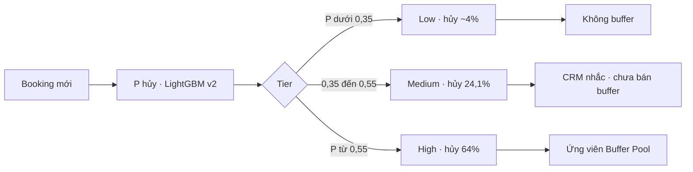
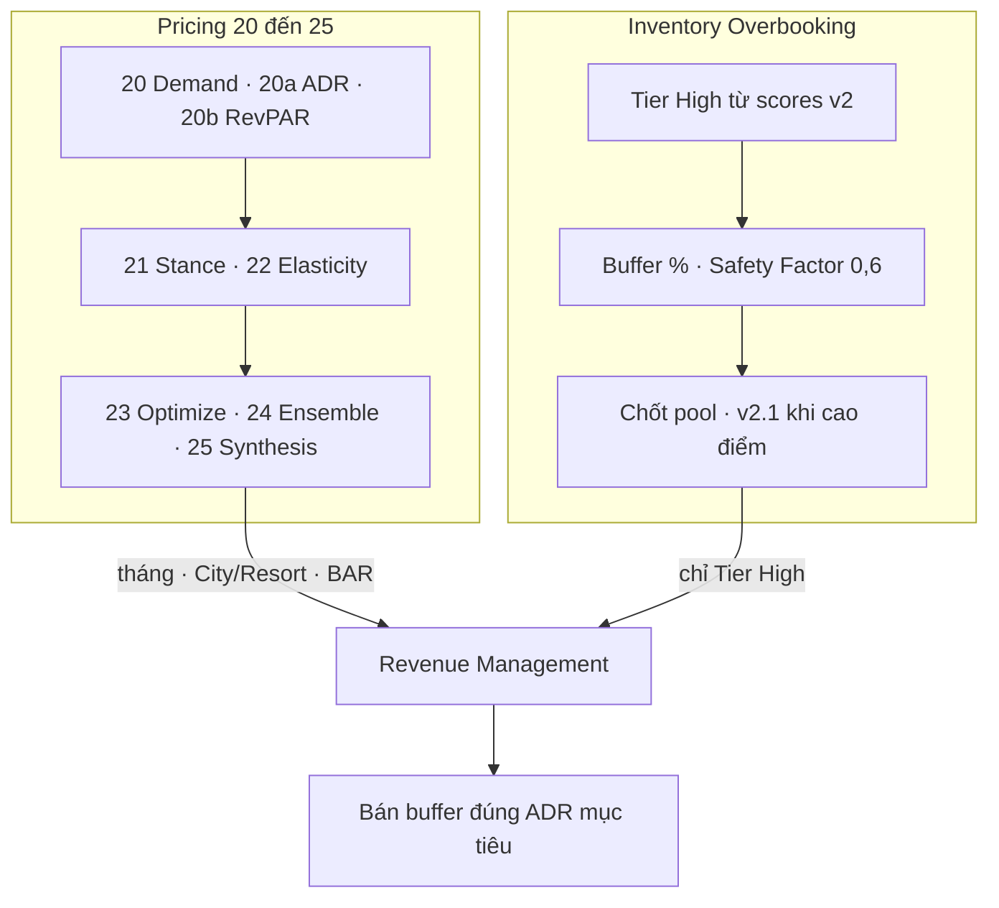
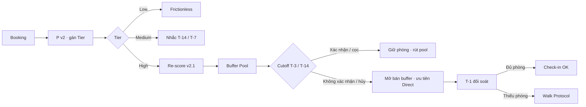
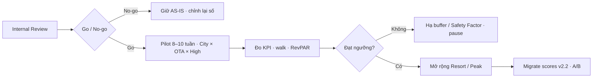

# 26 — Overbooking Buffer Strategy

> **Loại:** Phân tích nghiệp vụ (BA) · Phase 2 Deliverable  
> **Dữ liệu:** `hotel_bookings_v5.csv` · **82.811** booking · tỷ lệ hủy **28,12%**  
> **Scoring vận hành hiện tại:** LightGBM **v2** @ 0,35 (`data/11_cancellation_probability_scores.csv`)  
> **Nâng cấp / mode phụ:** LightGBM **v2.2** @ 0,25 (calibrated) · **v2.1** @ 0,28 (inventory protection)  
> **Nguồn hủy:** [`11`](11_cancellation_probability_scores.md) · [`11` by variable](11_cancellation_probability_by_variable.md) · [`11b`](11b_cancellation_probability_overview.md) · [`13`](13_cancellation_model_version_selection.md) · [`16`](16_overbooking_policy.md)  
> **Nguồn giá / demand:** [`20`](20_demand_forecasting_dynamic_pricing_city_resort.md) → [`25`](25_key_findings_dynamic_pricing_pipeline_city_resort.md)  
> **Cập nhật:** 23/07/2026

---

## 1. Phân loại cấp độ rủi ro (Business Risk Tier Translation)

Hệ thống gán mỗi booking một **P(hủy)**. Để vận hành, P được quy đổi thành **3 tier** — nhưng phải tách rõ hai lớp mô hình:

| Lớp | Vai trò | Ghi chú số liệu |
|-----|---------|-----------------|
| **Scores hiện tại (v2 @ 0,35)** | Tier hóa toàn bộ booking + % hủy thật theo bucket | File `11_scores` — **nguồn tier vận hành hôm nay** |
| **v2.2 (isotonic, t\* = 0,25)** | Xác suất bám sát tần suất thật hơn (median P không hủy **0,084** · hủy **0,614** trên test) | Chỉ dùng làm **roadmap migrate**; chưa được gán % hủy 24,1% / 64% lên khoảng cắt 0,25 |

**Ba tier vận hành (calibrate bằng outcome trên scores v2 — khớp `11` / `16`):**

- **Low Risk (P &lt; 0,35):** Nhóm an toàn, ~**48,7%** booking. Tỷ lệ hủy thật ~**4,0%**. Không đưa vào overbooking. (Trên thang v2.2, khách không hủy thường dồn về P rất thấp — median **0,084** — nên sau khi migrate scores có thể siết biên Low gần ngưỡng 0,25, **sau khi đo lại % hủy thật**.)
- **Medium Risk (0,35 ≤ P &lt; 0,55):** Đã vượt ngưỡng gắn nhãn hủy của v2 (0,35). Rủi ro trung bình: hủy thật **24,1%** (n = 13.957). Theo dõi / nhắc — **chưa** bán buffer.
- **High Risk (P ≥ 0,55):** Báo động đỏ. Hủy thật **64,0%** (n = 28.560). Đây là **nguồn chính** của Buffer Pool. Median P của booking hủy trên test v2.2 đạt **0,614** — củng cố rằng vùng P cao tách biệt rõ sau calibration.

> **Lưu ý sửa sai draft cũ:** Không gắn Medium = khoảng 0,25–0,55 với hủy 24,1%. Trên CSV v2, khoảng 0,25–0,55 chỉ hủy ~**19,3%**; mốc 24,1% thuộc đúng **0,35–0,55**.



---

## 2. Thiết kế chiến lược Overbooking (Overbooking Buffer Strategy)

Sức mạnh của **v2.2** (khi đã migrate) là giảm **50,8%** False Positive so với v2.1 @ 0,28 trong khi vẫn giữ Recall ≥ 0,85 (FP test **2.939** · AUC **0,896**), giúp bộ đệm overbooking **mỏng và an toàn hơn**. Trong lúc chờ re-score, buffer vẫn tính trên **hủy thật theo ô** và chiết khấu vì Precision v2 ~**0,49**:

```text
Buffer % (ô) = Tỷ lệ hủy thực tế (segment × mùa × hotel) × Safety Factor 0,6
Cap = 20% phòng/hạng/ngày   (Groups: cap 15%)
```

_Mùa: Peak = Jul–Aug · Shoulder = Apr–Jun, Sep–Oct · Low = Nov–Mar. Bảng đầy đủ: [`16`](16_overbooking_policy.md)._

**Bảng buffer rút gọn (ô trọng yếu):**

| Ô | Hủy thật | Buffer đề xuất | Ghi chú |
|---|----------:|---------------:|---------|
| Online TA × Peak | 39,0% | **20%** (cap) | Hotspot chính |
| Online TA × Shoulder | 35,6% | **20%** (cap) | Volume lớn |
| Online TA × Low | 32,4% | **19%** | Vẫn cao |
| City Hotel × Peak | 32,9% | **20%** | Sàn nhanh theo property |
| Resort Hotel × Peak | 31,6% | **19%** | Thấp hơn City nhẹ |
| Resort Hotel × Low | 17,2% | **10%** | Đáy mùa — buffer mỏng |
| Groups (mọi mùa) | 28–45% | **15%** (cap riêng) | Hủy theo block — bổ trợ attrition, không thay hợp đồng |
| Offline / Direct / Corporate × Low | ~10–12% | **6–7%** | Ít overbook |

- **Tính toán buffer theo kênh:** Đẩy hệ số tối đa với **Online TA** (hủy thật 35,5% · mean P 0,50; SHAP Online TA Mean |SHAP| = **0,433** trên v2.2). City cao hơn Resort (30,7% vs 24,1%).
- **Kiểm soát bằng tín hiệu cam kết:** Không overbook bừa. Khi có **chỗ đậu xe** (`required_car_parking_spaces` > 0) hoặc nhiều special request, rủi ro giảm mạnh (parking Mean |SHAP| = **0,915** trên v2.2) — ưu tiên **không** đưa vào pool dù kênh OTA.
- **Chế độ phòng thủ (Inventory Protection):** Cao điểm / lễ, trống phòng do hủy là tối kỵ → RM chuyển chốt ứng viên buffer sang **v2.1 @ 0,28** (FN ~**225**, Recall ~0,95).

**Ma trận phối hợp Pricing (20→25) × Buffer:**



| Tình huống (từ `21`/`25`) | Pricing stance / BAR | Overbooking buffer |
|---------------------------|----------------------|--------------------|
| City Peak / PROTECT (+ RAISE tối ưu `23`) | Giữ / nâng BAR | Buffer **cao có kiểm soát** (OTA/City 18–20%); bán lại **Direct** đúng ADR mục tiêu |
| Resort từ **Oct** / STIMULATE + CUT | Hạ BAR / promo | Mở buffer **sớm hơn City**; mức vừa (Peak 19% → Low 10%); không phá giá đáy |
| Sep gần đồng thuận PROTECT | HOLD / bảo vệ | Buffer theo ô nóng; siết cutoff reconfirm |
| Low season · pressure yếu | CUT / STIM nhẹ | Buffer **6–10%**; ưu tiên trải nghiệm, hạn chế walk |
| Lễ / inventory tối kỵ trống | PROTECT | Mode **v2.1 @ 0,28**; cap cứng; Walk Protocol sẵn sàng |

**Chỉ bán / mở buffer trên nền Tier High** — không trên Low/Medium. Ưu tiên bán phòng buffer cho walk-in / last-minute **Direct** hơn OTA giá thấp.

---

## 3. Cancellation Policy Playbook (Quy trình xử lý hành động)

Bộ quy tắc cho Lễ tân / CSKH / CRM (cutoff chi tiết T-3 / T-14 xem [`16`](16_overbooking_policy.md)):



| Risk Tier | Dấu hiệu nhận diện chính | Hành động vận hành (Action) |
|-----------|--------------------------|-----------------------------|
| **Low Risk** | P &lt; 0,35; thường Offline/Direct/Corporate; có parking / nhiều special request (tín hiệu an toàn v2.2) | **Frictionless checkout.** Không đòi cọc. Trải nghiệm đặt nhanh để giữ chân. |
| **Medium Risk** | P 0,35–0,55; hủy thật ~24%; ít lịch sử hủy | CRM Email/SMS **T-14 / T-7** (hoặc tối thiểu **72 giờ** trước check-in) yêu cầu bấm **Xác nhận lịch trình**. Chưa mở buffer. |
| **High Risk** | P ≥ 0,55; hủy thật ~64%; thường **Online TA** · **Transient** · **PRT** · lead dài · `history_cancel_rate` cao | Re-score **v2.1**; đưa vào **Buffer Pool**. Gửi payment link thu **cọc 1 đêm**. Thẻ declined / không reconfirm trước cutoff (**T-3** mặc định · hotspot OTA lead dài **T-14**) → giải phóng slot cho overbooking. Ưu tiên bán lại Direct đúng BAR từ pipeline 20–25. |

### Walk Protocol (khi buffer đã bán > phòng trống thật)

Xảy ra khi dự báo hủy lệch (Precision v2 ~0,49 — lý do bắt buộc Safety Factor). Chi phí tham chiếu ~**1,5 × ADR** tháng đó + 1 đêm comp.

| Bước | Hành động | Trách nhiệm |
|-----:|-----------|-------------|
| 1 | **T-1:** đối soát booking đã xác nhận vs phòng trống thực tế | Revenue Management |
| 2 | Thiếu phòng → walk theo thứ tự **ADR thấp → loyalty thấp → đặt muộn** (không walk VIP / loyalty cao) | FO Manager |
| 3 | Đưa khách sang KS cùng hạng hoặc cao hơn trong khu vực; trả chênh lệch + **1 đêm comp** | FO / Kế toán |
| 4 | Log ca walk (chi phí, segment, nguyên nhân) → feedback Safety Factor / buffer % | BA + Data Analyst |
| 5 | Báo cáo walk rate tháng; nếu vượt ngưỡng pilot (mục 5) → **hạ buffer hoặc Safety Factor** kỳ sau | BA → Ban Giám đốc |

---

## 4. Phân tích chi phí — lợi ích (Estimated Revenue Recovery)

Tham số giá trị từ `v5` (đơn vị **€**, không dùng USD của draft cũ):

| Tham số | Giá trị |
|---------|--------:|
| ADR trung bình | **107,60 €** (≈ 107,6) |
| ALOS | **3,67 đêm** (≈ 3,7) |
| Booking value proxy (ADR × ALOS) | **~403 €** |

**Năng lực phát hiện (v2.2 trên test, scale đúng test→full ≈ ×5):**

| Chỉ số | Test | Quy đổi full (~×5) | Draft cũ (sai, ×~1,67) |
|--------|-----:|-------------------:|-----------------------:|
| True Positive (bắt hủy) | 4.008 | ~**20.040** | 6.680 |
| False Positive | 2.939 | ~**14.694** | 4.898 |

Các con số phục hồi kiểu “6.680 × 40% × … → \$745k / Net \$550k” **không còn dùng**.

**Khung ROI nghiệp vụ (neo BRD / policy — khớp `12` · `15` · `16`):**

- **Thất thoát gốc:** Doanh thu mất do hủy **11,25M €**/năm; sau bán lại thụ động ~30% còn ~**7,87M €** mất trắng.
- **Doanh thu phục hồi thêm** nhờ overbooking có chủ đích (Tier High + safety factor, nâng phục hồi lên ~55–65% phần mất trắng): **+4,33M → +5,12M €**/năm *(ước lượng BA, chưa pilot)*.
- **Chi phí walk** kỳ vọng: ~**0,08M → 0,15M €**/năm.
- **Net benefit năm đầu (ước lượng):** **≈ +4,2M → +5,0M €**.

**Đọc nhanh proxy sau migrate v2.2 (minh họa, không thay khung trên):** nếu sau playbook giữ lại thêm một phần hủy đã bắt (TP scale ~20k) với booking value ~403 €, lợi ích biên phụ thuộc tỷ lệ giữ chỗ / bán lại thật và walk — **chỉ chốt sau A/B**. Mục tiêu kỹ thuật của v2.2 là **giảm FP** (ít khách “bị oan” khi đòi cọc), không phải thổi phồng net benefit trước pilot.

---

## 5. Khung trình bày Phase 2 Deliverable (Presentation Structure)

Để bảo vệ dự án trước Ban Giám đốc, presentation đề xuất **5 slides** trọng tâm (giữ flow gốc):

1. **The Crisis & The Cause** — Tỷ lệ hủy **28,12%**; mất **11,25M €**; chính sách “cào bằng rủi ro”; hotspot Online TA + lệch pha City/Resort từ forecast [`21`](21_key_findings_after_forecasting_models_city_resort.md) / [`25`](25_key_findings_dynamic_pricing_pipeline_city_resort.md).
2. **The AI Solution (LightGBM v2 → v2.2)** — Scores vận hành v2; roadmap v2.2 AUC **0,896**, giảm FP vs v2.1@0,51 (win–win trên ràng buộc Recall ≥ 0,85); dual-mode v2.1@0,28 khi inventory protection.
3. **Behavioral Insights** — Driver: lead dài, Online TA, PRT, thiếu cam kết; tín hiệu an toàn: **bãi đỗ xe**, special requests (SHAP v2.2).
4. **Operational Transformation** — Bảng Playbook (mục 3); Buffer × Safety Factor; phối hợp BAR từ pipeline **20→25** (PROTECT/STIMULATE × buffer).
5. **Financial Impact & Next Steps** — Net benefit ước lượng **+4,2M → +5,0M €**/năm (không dùng \$550k). Xin **go/no-go pilot** theo khung dưới; sau ổn định mới tích hợp `threshold_policy_v2_2.json` và A/B rộng.

### Phạm vi pilot đề xuất (go/no-go)



| Hạng mục | Đề xuất |
|----------|---------|
| Phạm vi | **City Hotel × Online TA × Tier High** · 1 tháng trước Peak để đo trước Jul–Aug |
| Buffer / Safety Factor | **20%** · **0,6** — **cố định** suốt pilot (không chỉnh giữa chừng) |
| Model | Tier bằng **v2**; chốt pool bằng **v2.1 @ 0,28** |
| Đồng bộ pricing | Stance / BAR theo ensemble [`24`](24_dynamic_pricing_ml_city_resort.md) / [`25`](25_key_findings_dynamic_pricing_pipeline_city_resort.md) — không đổi ngoài guardrail |
| Thời gian | **8–10 tuần** (có thể song song deposit pilot [`15`](15_policy_scenario.md)) |
| Mitigation OTA | Soft launch; theo dõi volume Online TA hàng tuần (`15` § rủi ro ranking) |

**KPI đo trong pilot**

| KPI | Mục tiêu định hướng | Ngưỡng cảnh báo |
|-----|---------------------|-----------------|
| Occupancy / phòng trống do hủy | Tăng vs baseline cùng mùa | Không cải thiện sau 4 tuần → review ô buffer |
| Walk rate | **&lt; 3–5%** buffer đã bán | ≥ 5% → hạ buffer hoặc Safety Factor ngay |
| Net revenue recovered | Hướng tới cận dưới khung mục 4 | Âm sau chi phí walk → pause mở rộng |
| RevPAR vs baseline `20b` | Không giảm vì walk / cắt giá bán lại | RevPAR giảm > ngưỡng RM → dừng CUT kèm buffer |
| Khiếu nại / “bị đòi cọc oan” | Theo dõi tuyệt đối & tỷ lệ trên FP | Tăng đột biến → nới playbook Medium trước khi siết High |

**RACI rút gọn:** BA hoàn thiện số liệu (R) · Revenue Management duyệt vận hành (A) · FO/Sales thực thi playbook · Ban Giám đốc chốt go/no-go.

---

## Tài liệu liên quan

| Nhóm | File |
|------|------|
| Hủy / scoring | [`11_cancellation_probability_scores.md`](11_cancellation_probability_scores.md) · [`11_cancellation_probability_by_variable.md`](11_cancellation_probability_by_variable.md) · [`11b_cancellation_probability_overview.md`](11b_cancellation_probability_overview.md) · [`13_cancellation_model_version_selection.md`](13_cancellation_model_version_selection.md) · [`09_cancellation_model_v2_2.md`](09_cancellation_model_v2_2.md) |
| Policy | [`15_policy_scenario.md`](15_policy_scenario.md) · [`16_overbooking_policy.md`](16_overbooking_policy.md) · [`12_brd_gap_analysis.md`](12_brd_gap_analysis.md) |
| Pricing | [`20`](20_demand_forecasting_dynamic_pricing_city_resort.md) · [`20a`](20a_demand_forecasting_dynamic_pricing_adr_city_resort.md) · [`20b`](20b_demand_forecasting_dynamic_pricing_RevPAR_city_resort.md) · [`21`](21_key_findings_after_forecasting_models_city_resort.md) · [`22`](22_dynamic_pricing_elasticity_city_resort.md) · [`23`](23_dynamic_pricing_optimization_city_resort.md) · [`24`](24_dynamic_pricing_ml_city_resort.md) · [`25`](25_key_findings_dynamic_pricing_pipeline_city_resort.md) |
