# 27 — Validate Simulation: RevPAR · What-if · Elasticity · Optimal · Back-test → Pricing Playbook

> **Loại:** Báo cáo khoa học kỹ thuật (IMRAD) · recommend-only · Phase 2 validation  
> **Dữ liệu:** `hotel_bookings_v5.csv` · panel tháng 2015-07 → 2017-08 · ε prior từ [`22`](22_dynamic_pricing_elasticity_city_resort.md)  
> **Notebook:** [`notebooks/27_validate_simulation.ipynb`](../notebooks/27_validate_simulation.ipynb) · script [`27_validate_simulation.py`](../notebooks/27_validate_simulation.py)  
> **Figures / tables:** [`reports/figures/27_validate_simulation/`](./figures/27_validate_simulation/)  
> **Nguồn upstream:** [`20`–`25`](25_key_findings_dynamic_pricing_pipeline_city_resort.md) pricing · [`26`](26_overbooking_buffer_strategy.md) buffer  
> **Cập nhật:** 23/07/2026

---

## Tóm tắt

Notebook 27 kiểm chứng pipeline dynamic pricing trên lịch sử trước khi đóng **Pricing Playbook** và nối với **Booking Process Optimization** (tier hủy × buffer). Năm khối: (1) mô phỏng RevPAR baseline vs $p^\star$ local-linear; (2) what-if Peak ADR +5/+10/+15%; (3) elasticity theo `market_segment` kèm $\varepsilon_{\mathrm{ops}}$; (4) tối ưu kép revenue × cancel risk; (5) back-test rule 2015–2016.

**Kết luận vận hành:** City kém co giãn — RAISE/PROTECT Peak hợp lệ (+2,3% RevPAR khi +10% ADR; back-test Peak win-rate 100%). Resort co giãn hơn — Peak +10% ADR **làm giảm** RevPAR (−2,1%); Low-season CUT −5% tăng nhẹ revenue (+0,23%) và giảm proxy cancel. Dual-objective hạ BAR ~7–8% so với tối ưu thuần doanh thu để giảm rủi ro hủy. Cả hai property đạt **go=True** trên cửa sổ 2015–2016 theo KPI đã định.

---

## 1. Giới thiệu

Pipeline 20→24 đã cho forecast, $\varepsilon$ prior, $p^\star$ và ensemble BAR; báo cáo 26 gắn buffer với stance giá. Thiếu mắt xích: **validate** trên dữ liệu quá khứ rằng rule giá (1) cải thiện RevPAR proxy, (2) không đẩy cancel vượt ngưỡng, (3) phân biệt đúng City vs Resort / Peak vs Low.

Câu hỏi trung tâm:

1. RevPAR dưới $p^\star$ (ε prior) có vượt baseline `ADR × Occ` không?  
2. Shock Peak +10% ADR đổi RevPAR bao nhiêu theo property?  
3. Segment nào dùng được $\hat\varepsilon$ âm, segment nào phải giữ prior?  
4. Điểm giá tối ưu khi cân cancel risk lệch $p^\star$ thuần revenue thế nào?  
5. Rule đơn giản (City Peak RAISE / Resort Low CUT) có pass back-test 2015–2016 không?

Phạm vi: **recommend-only** — không triển khai live OTA; không thay OLS dương bằng causal ε mới.

---

## 2. Phương pháp

### 2.1 Dữ liệu và proxy KPI

- Panel tháng từ [`monthly_panel.csv`](./figures/22_elasticity/monthly_panel.csv) (stay `is_canceled=0`, `adr>0`) + `cancel_rate` từ mọi booking cùng `hotel × ym`.  
- $\varepsilon_{\mathrm{City}}=-0{,}70$, $\varepsilon_{\mathrm{Resort}}=-1{,}10$ (RM prior, notebook 22).  
- **RevPAR proxy nhất quán:** $\mathrm{RevPAR}=ADR\times Occ$ (tránh lệch với mean RevPAR booking-level trên panel).  
- Mùa: Peak = Jul–Aug · Shoulder = Apr–Jun, Sep–Oct · Low = Nov–Mar (khớp 16/26).

### 2.2 Demand response và tối ưu

Local-linear như notebook 23:

$$
Q(p)=Q_0\Bigl(1+\varepsilon\frac{p-P_0}{P_0}\Bigr),\quad
Q\in[0{,}05\,Q_0,\,1{,}15\,Q_0],\quad
R(p)=p\cdot Q(p).
$$

Grid $p\in[0{,}70\,P_0,\,1{,}30\,P_0]$. Action: RAISE nếu $\Delta p\ge +3\%$, CUT nếu $\le -3\%$, else HOLD.

### 2.3 What-if Peak

Shock ADR $+5/+10/+15\%$ chỉ trên stay Peak, breakdown `hotel × market_segment` (lọc $n\ge 30$ booking). Tổng hợp hotel = trung bình có trọng số `n_stay`.

### 2.4 Elasticity theo segment

Log–log + month FE trên panel `hotel × segment × ym`. Quy tắc $\varepsilon_{\mathrm{ops}}$: dùng $\hat\varepsilon$ nếu âm và $n_{\mathrm{months}}\ge 10$; ngược lại gán prior hotel.

### 2.5 Dual objective

$$
\mathrm{Score}(p)=\alpha\,R_{\mathrm{norm}}(p)-(1-\alpha)\,\mathrm{Risk}_{\mathrm{norm}}(p),\quad \alpha\in\{0{,}5,\,0{,}7,\,0{,}9\}.
$$

Risk proxy:

$$
\mathrm{cancel}_{0} + \hat{\beta}\log(p/P_{0})
$$

với $\hat{\beta}$ từ hồi quy mô tả cancel ~ log ADR theo tháng ($\hat{\beta}(\mathrm{City})\approx 0{,}069$, $\hat{\beta}(\mathrm{Resort})\approx 0{,}145$).

### 2.6 Back-test 2015-07 → 2016-12

| Điều kiện | Multiplier |
|-----------|------------|
| City × Peak | ×1,10 (RAISE) |
| Resort × Low | ×0,95 (CUT) |
| Khác | ×1,00 (HOLD) |

**Go/no-go:** mean $\Delta$RevPAR ≥ 0 · City Peak $\Delta$RevPAR ≥ 0 · mean $\Delta$cancel ≤ +1 pp.

---

## 3. Kết quả

### 3.1 RevPAR simulation (toàn panel lịch sử)

Áp $p^\star$ analytic/local-linear với ε prior trên mọi tháng → City khóa **RAISE +21,4% ADR** và **+3,21%** RevPAR/revenue; Resort khóa **CUT −4,5%** và **+0,23%** RevPAR — khớp hướng notebook 23 trên horizon forecast.

**Bảng 1.** Tóm tắt ΔRevPAR theo hotel × mùa

| Hotel | Mùa | $n$ | Mean ΔADR % | Mean ΔRevPAR % | RevPAR base → sim (€) |
|-------|-----|----:|------------:|---------------:|----------------------:|
| City | Low | 10 | +21,38 | **+3,21** | 64,96 → 67,05 |
| City | Peak | 6 | +21,38 | **+3,21** | 74,44 → 76,83 |
| City | Shoulder | 10 | +21,38 | **+3,21** | 83,46 → 86,14 |
| Resort | Low | 10 | −4,50 | **+0,23** | 46,72 → 46,82 |
| Resort | Peak | 6 | −4,50 | **+0,23** | 115,44 → 115,70 |
| Resort | Shoulder | 10 | −4,50 | **+0,23** | 65,81 → 65,96 |

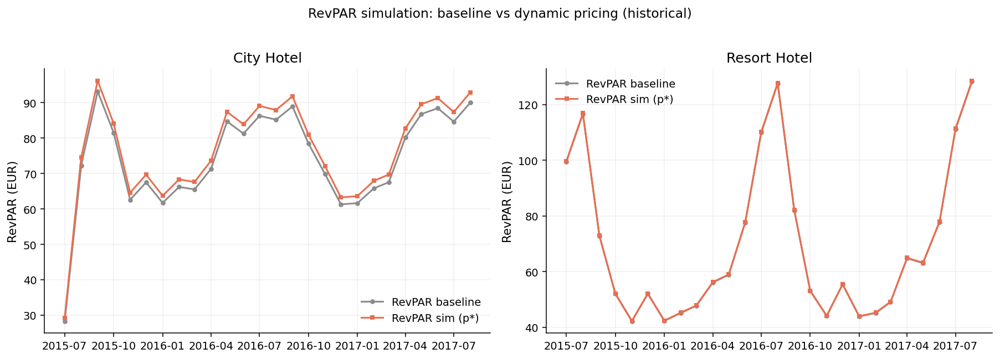

*Hình 1. RevPAR proxy baseline ($ADR\times Occ$) và sau $p^\star$ theo tháng, tách City / Resort.*

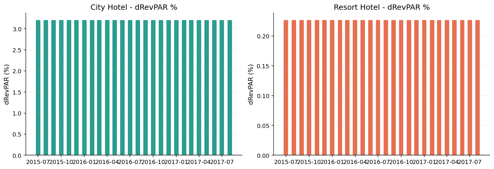

*Hình 2. ΔRevPAR % theo tháng (màu = RAISE / CUT / HOLD).*

> **Đọc điều hành:** Δ% gần như phẳng trong từng hotel vì ε cố định — “lịch sống” nằm ở mức ADR/Occ tuyệt đối theo mùa (đặc biệt Resort Peak cao), không ở flip action.

CSV: [`revpar_simulation_monthly.csv`](./figures/27_validate_simulation/tables/revpar_simulation_monthly.csv) · [`revpar_simulation_summary.csv`](./figures/27_validate_simulation/tables/revpar_simulation_summary.csv)

---

### 3.2 What-if Peak ADR +10% (và ladder)

**Bảng 2.** Peak shock có trọng số demand

| Hotel | Shock | ΔDemand % | ΔRevPAR % | ΔRevenue % |
|-------|------:|----------:|----------:|-----------:|
| City | +5% | −3,5 | **+1,32** | +1,32 |
| City | **+10%** | **−7,0** | **+2,30** | **+2,30** |
| City | +15% | −10,5 | +2,92 | +2,92 |
| Resort | +5% | −5,5 | −0,77 | −0,77 |
| Resort | **+10%** | **−11,0** | **−2,10** | **−2,10** |
| Resort | +15% | −16,5 | −3,97 | −3,97 |

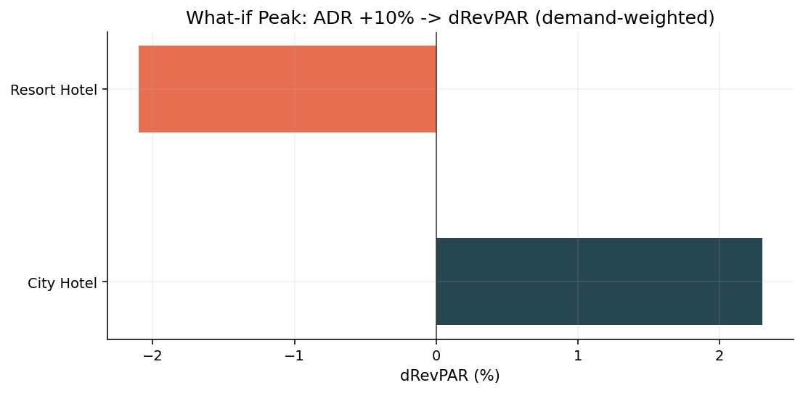

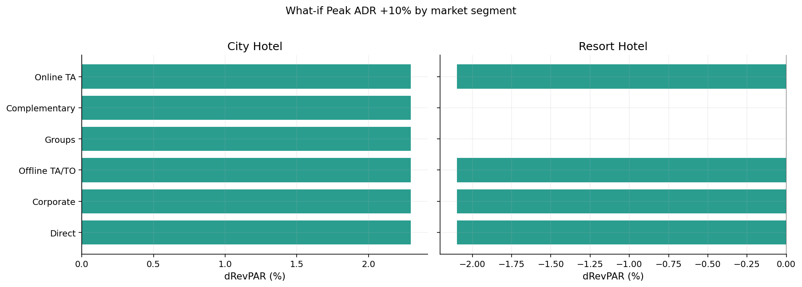

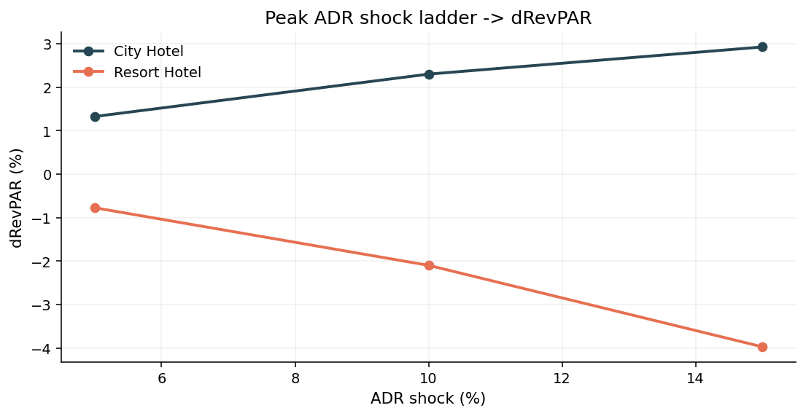

*Hình 3–5. What-if Peak: tornado hotel, breakdown segment, ladder 5/10/15%.*

**Ý nghĩa:** City Peak **ủng hộ harden BAR**; Resort Peak **không** nên +10% ADR thuần — volume rơi nhanh hơn phần giá thu được. Promo/CUT phù hợp hơn khi pressure Resort yếu (khớp 23/25).

CSV: [`whatif_peak_plus10_hotel.csv`](./figures/27_validate_simulation/tables/whatif_peak_plus10_hotel.csv) · [`whatif_peak_adr_ladder.csv`](./figures/27_validate_simulation/tables/whatif_peak_adr_ladder.csv)

---

### 3.3 Elasticity theo segment

**Bảng 3.** $\hat\varepsilon$ OLS vs $\varepsilon_{\mathrm{ops}}$

| Hotel | Segment | $\hat\varepsilon$ | SE | $n$ | $\varepsilon_{\mathrm{ops}}$ | Nguồn |
|-------|---------|------------------:|---:|----:|-----------------------------:|-------|
| City | Groups | **−0,42** | 1,30 | 26 | −0,42 | loglog_month_fe |
| City | Corporate / Direct / Offline / Online TA | dương | — | 25–26 | **−0,70** | rm_prior |
| Resort | Offline TA/TO | **−2,24** | 0,39 | 26 | −2,24 | loglog_month_fe |
| Resort | Groups | **−0,40** | 1,11 | 24 | −0,40 | loglog_month_fe |
| Resort | Corporate / Direct / Online TA | dương | — | 26 | **−1,10** | rm_prior |

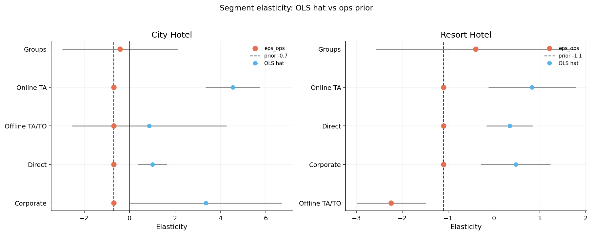

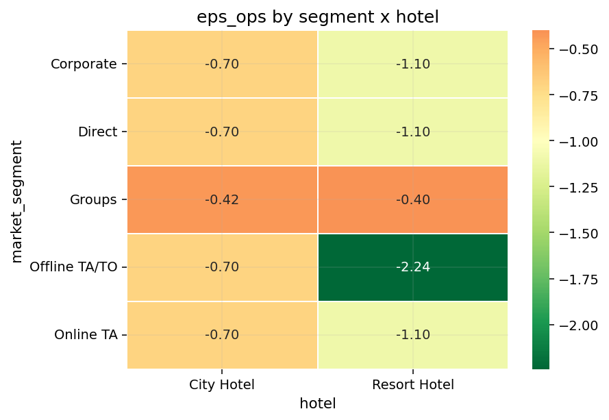

*Hình 6–7. Diagnostic OLS (thường dương) vs ε vận hành; heatmap ε_ops.*

**Ý nghĩa:** Giống cổng chọn của 22 — OLS segment vẫn chủ yếu bias dương. Ngoại lệ đáng chú ý: **Resort Offline TA/TO** rất co giãn ($\varepsilon_{\mathrm{ops}}\approx -2{,}24$) → promo Offline Resort hiệu quả hơn Online nếu kiểm soát được hủy; **Groups** cả hai property inelastic nhẹ → harden/attrition hợp đồng quan trọng hơn dump giá.

CSV: [`elasticity_by_segment.csv`](./figures/27_validate_simulation/tables/elasticity_by_segment.csv)

---

### 3.4 Optimal point — revenue × cancel risk

Trên toàn panel, với $\alpha=0{,}7$:

| Hotel | Mean $p^\star_{\mathrm{rev}}$ | Mean $p^\star_{\mathrm{dual}}$ | Mean Δ (dual vs rev) | Risk rev → dual |
|-------|-----------------------------:|-------------------------------:|---------------------:|----------------:|
| City | ~129,6 € | ~118,8 € | **−8,3%** | 0,315 → 0,309 |
| Resort | ~90,2 € | ~83,5 € | **−7,5%** | 0,222 → 0,211 |

**Bảng 4.** Sensitivity α — tháng Peak demand cao nhất (2016-08)

| Hotel | α | $p^\star_{\mathrm{dual}}$ (€) | Risk | Revenue proxy |
|-------|--:|------------------------------:|-----:|--------------:|
| City | 0,5 | 117,5 | 0,32 | 225k |
| City | 0,7 | 140,2 | 0,33 | 236k |
| City | 0,9 | 150,1 | 0,34 | 238k |
| Resort | 0,5 | 165,3 | 0,31 | 198k |
| Resort | 0,7 | 168,9 | 0,31 | 199k |
| Resort | 0,9 | 178,9 | 0,32 | 200k |

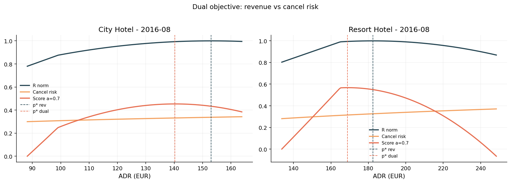

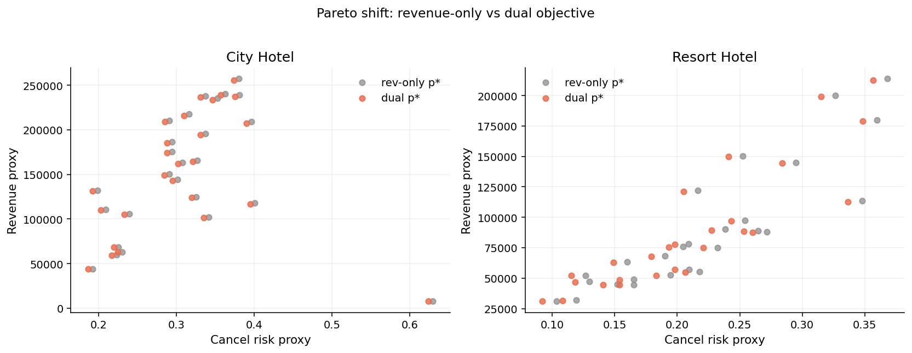

*Hình 8–9. Đường R / risk / score và dịch chuyển Pareto rev-only → dual.*

**Ý nghĩa cho playbook:** Ensemble BAR (24) đã làm mềm cực trị RAISE +21% của 23; dual-objective củng cố rằng **không chốt trần revenue-only** khi Peak + inventory protection (26 dùng v2.1 @ 0,28). Khuyến nghị band: floor–recommend–ceil của 24, ưu tiên cạnh dưới khi walk risk / OTA High tier cao.

CSV: [`optimal_dual_monthly.csv`](./figures/27_validate_simulation/tables/optimal_dual_monthly.csv) · [`optimal_dual_alpha_sensitivity.csv`](./figures/27_validate_simulation/tables/optimal_dual_alpha_sensitivity.csv)

---

### 3.5 Back-test 2015–2016

**Bảng 5.** Hiệu quả rule theo hotel × mùa

| Hotel | Mùa | $n$ | Mean ΔRevPAR % | Mean ΔRev % | Mean ΔCancel (pp) | Win-rate (ΔRevPAR>0) |
|-------|-----|----:|---------------:|------------:|------------------:|---------------------:|
| City | Peak | 4 | **+2,30** | +2,30 | +0,66 | **1,00** |
| City | Low / Shoulder | 7+7 | 0 | 0 | 0 | 0 (HOLD) |
| Resort | Low | 7 | **+0,23** | +0,23 | **−0,74** | **1,00** |
| Resort | Peak / Shoulder | 4+7 | 0 | 0 | 0 | 0 (HOLD) |

**Bảng 6.** Go / no-go

| Hotel | Mean ΔRevPAR (all) | Peak ΔRevPAR | Mean ΔCancel (pp) | pass_revpar | pass_peak_city | pass_cancel | **go** |
|-------|-------------------:|-------------:|------------------:|:-----------:|:--------------:|:-----------:|:------:|
| City | +0,51 | +2,30 | +0,15 | ✓ | ✓ | ✓ | **True** |
| Resort | +0,09 | 0,00 | −0,29 | ✓ | ✓ | ✓ | **True** |

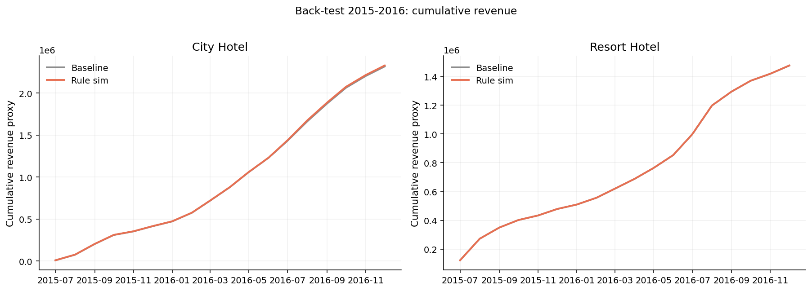

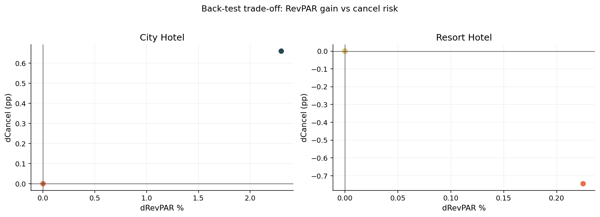

*Hình 10–11. Tích lũy revenue proxy và trade-off ΔRevPAR–ΔCancel trên cửa sổ back-test.*

CSV: [`backtest_2015_2016_summary.csv`](./figures/27_validate_simulation/tables/backtest_2015_2016_summary.csv) · [`backtest_go_nogo.csv`](./figures/27_validate_simulation/tables/backtest_go_nogo.csv)

---

## 4. Thảo luận

1. **Xác nhận bất đối xứng City / Resort** đã thấy ở 21–25: harden City Peak; không shock tăng giá Resort Peak; kích cầu Resort Low.  
2. **What-if +10%** là stress test đơn giản hơn RAISE +21% của 23 — vẫn dương cho City, âm cho Resort → playbook Peak phải tách property.  
3. **ε segment** bổ sung nuance (Resort Offline rất elastic; Groups inelastic) nhưng **không** thay prior hotel làm primary toàn cục khi OLS còn bias.  
4. **Dual objective** nối thẳng sang 26: giá tối ưu thuần có thể xung đột buffer/walk — RM nên ưu tiên `bar_recommend` ± band và hạ α (nặng risk) khi OTA High + Peak.  
5. **Hạn chế:** counterfactual in-sample (không phải RCT); risk proxy mô tả; ε prior giả định; HOLD months không tạo “win” giả nhờ proxy ADR×Occ nhất quán.

---

## 5. Pricing Playbook (đóng từ 20–27)

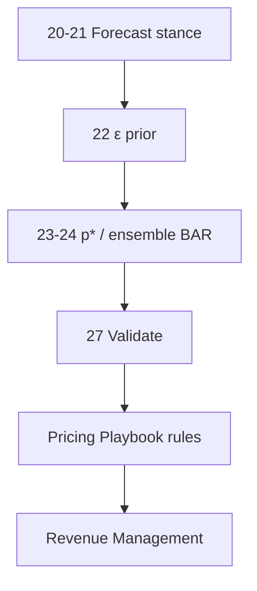

| Ô (Hotel × mùa) | Stance | BAR / action | Guardrail từ 27 |
|-----------------|--------|--------------|-----------------|
| **City × Peak** | PROTECT / RAISE | Harden BAR trong band 24; what-if +10% OK (+2,3% RevPAR) | Không chốt +21% thuần nếu High-tier OTA lớn — dual / cạnh dưới band |
| **City × Shoulder** | HOLD / NEUTRAL | Giữ `bar_recommend` | Tránh dump OTA |
| **City × Low** | STIM nhẹ | Promo có kiểm soát | ε inelastic — đừng cắt sâu |
| **Resort × Peak** | PROTECT nhẹ / HOLD | **Cấm** shock +10% ADR thuần (−2,1% RevPAR) | Ưu tiên mix Direct; Groups harden |
| **Resort × từ Oct / Low** | STIMULATE / CUT | CUT ~−5% (back-test +0,23% rev, cancel ↓) | Offline TA co giãn mạnh — promo Offline trước Online nếu hủy kiểm soát được |
| **Mọi ô** | Ensemble 24 | floor · recommend · ceil (±15%) | Back-test go=True trước khi promote rule mới |

---

## 6. Booking Process Optimization (nối 11 · 26 · 27)

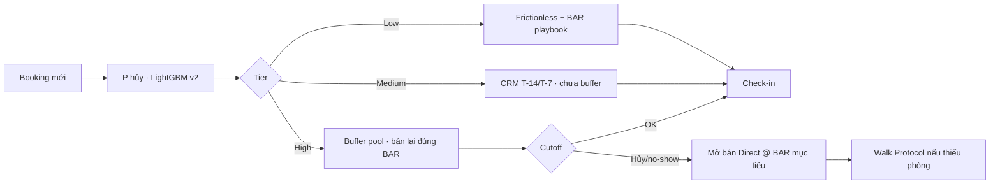

| Tier | Pricing | Vận hành |
|------|---------|----------|
| Low | Áp playbook tháng (mục 5) | Frictionless |
| Medium | Giữ BAR; không promo phá sàn | Nhắc xác nhận |
| High | Bán lại **đúng** `bar_recommend` (ưu tiên Direct) | Buffer + cutoff T-3/T-14; Peak → mode v2.1 @ 0,28 |
| KPI chung | RevPAR vs baseline 20b/27 | Walk &lt; 3–5% · Δcancel ≤ +1 pp trên ô đang test |

Ma trận Pricing × Buffer giữ nguyên [`26` mục 2](26_overbooking_buffer_strategy.md); 27 bổ sung **bằng chứng** City Peak RAISE và Resort Low CUT, đồng thời **cảnh báo** Resort Peak tăng giá.

---

## 7. Kết luận và bước tiếp

Validation 27 ủng hộ đóng Pricing Playbook bất đối xứng và nối booking flow theo tier hủy. Go/no-go back-test **đạt** cho cả City và Resort trên 2015–2016.

**Next (recommend-only → pilot):**

1. Đồng bộ rule mục 5 vào slide Phase 2 cùng 26.  
2. Pilot City × OTA × High (đã đề xuất ở 26) **kèm** BAR Peak harden trong band 24 — đo RevPAR + walk.  
3. Không mở shock +ADR Resort Peak; ưu tiên CUT Low + promo Offline có cap hủy.  
4. Báo cáo sau: A/B thật hoặc shadow mode trên 2017 holdout nếu RM yêu cầu.

---

## Tài liệu liên quan

| Nhóm | File |
|------|------|
| Code / artifact | [`notebooks/27_validate_simulation.ipynb`](../notebooks/27_validate_simulation.ipynb) · [`figures/27_validate_simulation/`](./figures/27_validate_simulation/) |
| Pricing | [`20`](20_demand_forecasting_dynamic_pricing_city_resort.md) · [`22`](22_dynamic_pricing_elasticity_city_resort.md) · [`23`](23_dynamic_pricing_optimization_city_resort.md) · [`24`](24_dynamic_pricing_ml_city_resort.md) · [`25`](25_key_findings_dynamic_pricing_pipeline_city_resort.md) |
| Hủy / buffer | [`11`](11_cancellation_probability_scores.md) · [`16`](16_overbooking_policy.md) · [`26`](26_overbooking_buffer_strategy.md) |
