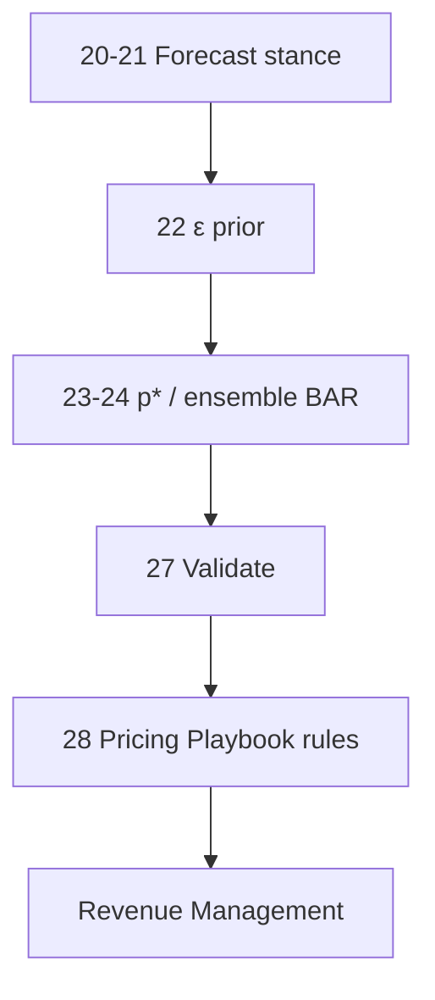
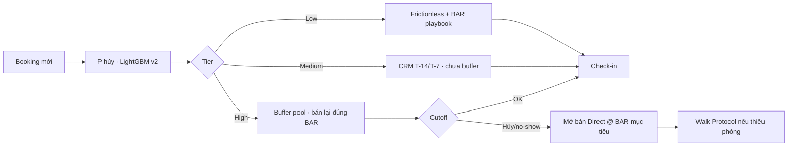
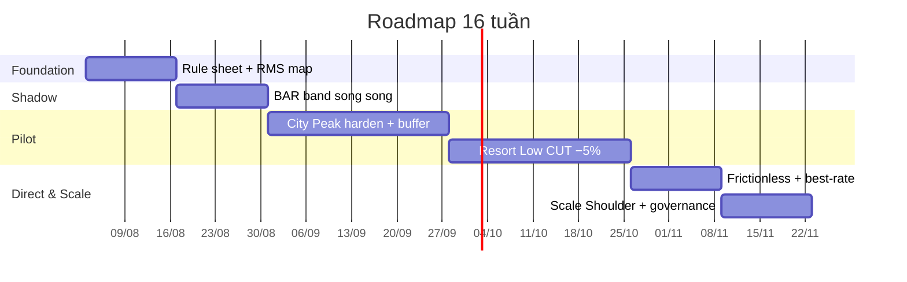
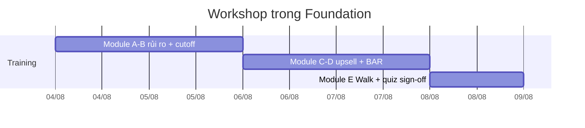

# 28 — Finalize Dynamic Pricing Playbook · Booking Optimization · ROI · Roadmap · Risk

> **Loại:** Báo cáo điều hành (BA / RM) · Phase 2 Deliverable · recommend-only  
> **Phạm vi:** City Hotel vs Resort Hotel · rule theo segment × season · booking flow × Direct · upsell · ROI (pricing + hủy) · implementation roadmap · risk assessment  
> **Dữ liệu:** `hotel_bookings_v5.csv` · **82.811** booking · panel tháng 2015-07 → 2017-08  
> **Nguồn upstream:** [`27`](27_validate_simulation_pricing_playbook.md) validation · [`24`](24_dynamic_pricing_ml_city_resort.md) ensemble BAR · [`26`](26_overbooking_buffer_strategy.md) buffer · [`22`](22_dynamic_pricing_elasticity_city_resort.md)–[`25`](25_key_findings_dynamic_pricing_pipeline_city_resort.md) pipeline · [`11`](11_cancellation_probability_scores.md) P(hủy) · [`17`](17_adr_strategy_analysis.md) upsell  
> **Bản chiến lược đồng bộ:** [`28_dynamic_pricing_strategy.md`](28_dynamic_pricing_strategy.md)  
> **Cập nhật:** 16/08/2026 (thêm memo quyết định + timeline 16 tuần theo cổng go/no-go)

---

## Tóm tắt

| KPI | Giá trị |
|-----|--------:|
| Booking / tỷ lệ hủy | **82.811** · **28,12%** (Online TA **35,5%**) |
| ADR / ALOS (v5) | **107,60 €** · **3,67 đêm** (booking value ≈ **403 €**) |
| City ΔRevPAR (p★ simulation) | **+3,21%** |
| City Peak +10% ADR (what-if / back-test) | **+2,30%** |
| Resort ΔRevPAR (CUT −5%) | **+0,23%** |
| Resort Peak +10% ADR | **−2,10%** (cấm shock thuần) |
| Back-test 2015–2016 | **go=True** cả City và Resort |
| ε vận hành | City **−0,70** · Resort **−1,10** |
| Net benefit hủy + buffer (ước) | **≈ +4,2M → +5,0M €**/năm ([`26`](26_overbooking_buffer_strategy.md)) |
| Uplift pricing + Direct mix (ước) | **≈ +10k → +70–85k €**/năm (mục 3) |
| Upsell A→D opportunity | **398.573 €** · Downgrade **1.747** ca ([`17`](17_adr_strategy_analysis.md)) |

**Verdict vận hành:** City kém co giãn → harden Peak trong band BAR (±15%). Resort co giãn hơn → CUT ~−5% Low (không tăng giá Peak thuần). Dual-objective hạ BAR ~7–8% so với tối ưu thuần doanh thu. Cả hai property đạt go trên cửa sổ 2015–2016. Trụ cột hủy dùng tier **Low &lt; 0,35 / Medium 0,35–0,55 / High ≥ 0,55** — **không** dùng cutoff draft 25%/55% hay Net Benefit \$550k.

**Mùa:** Peak = Jul–Aug · Shoulder = Apr–Jun, Sep–Oct · Low = Nov–Mar.

---

## 0. Chiến lược giá — 3 quyết định khóa

**Bottom line.** Một rate card cho cả hai property đang để City bỏ headroom và Resort chịu RevPAR âm nếu bị shock giá Peak. Ba quyết định dưới đây khóa playbook trước khi đụng BAR.

| # | Quyết định | Làm | Không làm | Bằng chứng |
|---|------------|-----|-----------|------------|
| **D1** | Tách City / Resort | City Peak harden BAR trong band; Resort Peak HOLD; Resort Low CUT ~−5% (Offline trước Online) | +10% ADR đồng loạt hai property | City Peak +10% → RevPAR **+2,3%**; Resort Peak +10% → **−2,1%** |
| **D2** | Không chốt cực trị +21% | Luôn floor–recommend–ceil (±15%); dual α ≤ 0,7 khi Peak + High OTA | Publish p★ thuần doanh thu | Dual hạ BAR ~7–8% so tối ưu thuần revenue |
| **D3** | Refill đúng BAR, ưu tiên Direct | High-tier (P ≥ 0,55) vào buffer → mở Direct trước OTA | Dump OTA cận ngày; overbook Low/Medium | Hủy thật High-tier **~64%**; Direct hủy **15,1%** |

**Đề xuất quyết định.** Duyệt D1–D3 + pilot 16 tuần (mục 4) với kill switch. Policy lock: **cấm** shock +ADR Resort Peak.

Chi tiết cổng go/no-go: [`29`](29_executive_summary.md) · thao tác: [`34`](34_implementation_guide.md).

---

## 1. Pricing Playbook — rule theo segment × season

Nguồn số: [`27`](27_validate_simulation_pricing_playbook.md) · [`22`](22_dynamic_pricing_elasticity_city_resort.md) · [`24`](24_dynamic_pricing_ml_city_resort.md) · [`25`](25_key_findings_dynamic_pricing_pipeline_city_resort.md) · `figures/27_validate_simulation/tables/elasticity_by_segment.csv`.

### 1.1 Ma trận Hotel × Mùa (primary)

| Ô | Stance | BAR / action | Guardrail | Bằng chứng 27 |
|---|--------|--------------|-----------|---------------|
| **City × Peak** | PROTECT / RAISE | Harden trong band 24; ưu tiên cạnh dưới nếu High-tier OTA lớn | Không chốt +21% thuần revenue-only | +2,3% RevPAR @ +10% ADR |
| **City × Shoulder** | HOLD / NEUTRAL | Giữ `bar_recommend` | Tránh dump OTA | HOLD trên back-test |
| **City × Low** | STIM nhẹ | Promo có kiểm soát | ε inelastic — không cắt sâu | p★ sim +3,2% nhưng dual −8% |
| **Resort × Peak** | PROTECT nhẹ / HOLD | Giữ mix Direct; Groups harden | **Cấm** shock +10% ADR thuần · **không** charge 150% last-minute (draft cũ) | −2,1% RevPAR nếu +10% |
| **Resort × Low / từ Oct** | STIMULATE / CUT | CUT ~−5% · promo Offline trước Online | Cap hủy Offline; không phá sàn | +0,23% rev · cancel ↓ 0,74 pp |
| **Mọi ô** | Ensemble 24 | floor · recommend · ceil (±15%) | Promote rule mới chỉ khi go=True | City/Resort go=True 2015–16 |

> City median ADR ~**105 €** (phẳng quanh năm — phù hợp Corporate). Resort biến động mùa vụ gắt — ưu tiên calendar tháng, không “Ultra-Peak penalty” kiểu draft.

### 1.2 Rule chi tiết theo market segment

| Hotel | Segment | ε_ops | Nhãn | Pricing rule | Ghi chú |
|-------|---------|------:|------|--------------|---------|
| City | Groups | −0,42 | Inelastic | Harden hợp đồng / attrition; hạn chế dump block | OLS âm dùng được |
| City | Corporate | −0,70 | Inelastic | Giữ BAR; negotiated rate cố định theo quý | rm_prior |
| City | Direct | −0,70 | Inelastic | Ưu tiên Direct @ `bar_recommend`; loyalty / best-rate | Giảm friction checkout |
| City | Offline TA/TO | −0,70 | Inelastic | HOLD Peak; STIM nhẹ Low có floor | rm_prior |
| City | Online TA | −0,70 | Inelastic | Peak RAISE trong band; High-tier → buffer bán lại Direct | Hotspot hủy — dual α↓ |
| Resort | Groups | −0,40 | Inelastic | Harden / attrition; cap buffer Groups 15% | Không dump giá block |
| Resort | Corporate | −1,10 | Elastic | Negotiated + CUT Low theo calendar | rm_prior |
| Resort | Direct | −1,10 | Elastic | Best-rate guarantee; ưu tiên mở buffer Direct | Mix channel |
| Resort | Offline TA/TO | **−2,24** | Rất elastic | Promo Offline trước Online khi Low; đo cancel | OLS âm · n=26 |
| Resort | Online TA | −1,10 | Elastic | CUT từ Oct; Peak HOLD — không +ADR shock | Buffer cap 19–20% Peak |

> **Quy tắc ε_ops:** dùng $\hat\varepsilon$ nếu âm và $n_{\mathrm{months}}\ge 10$; ngược lại gán prior hotel (City −0,70 · Resort −1,10). OLS dương = bias — **không** dùng làm primary.

### 1.3 Dual-objective BAR

$$
\mathrm{Score}(p)=\alpha\,R_{\mathrm{norm}}(p)-(1-\alpha)\,\mathrm{Risk}_{\mathrm{norm}}(p)
$$

| Chỉ số | Giá trị |
|--------|--------:|
| City $p^\star$ rev → dual | **−8,3%** |
| Resort $p^\star$ rev → dual | **−7,5%** |
| α mặc định | **0,7** |
| α Peak nóng (OTA High) | **0,5–0,7** |

Dual hạ giá so với tối ưu thuần revenue — ưu tiên cạnh dưới band khi Peak + High-tier OTA (khớp buffer [`26`](26_overbooking_buffer_strategy.md)).

---

## 2. Booking Process Optimization — giảm friction, tăng Direct

Nối scoring hủy ([`11`](11_cancellation_probability_scores.md) / LightGBM v2) × buffer ([`26`](26_overbooking_buffer_strategy.md)) × BAR playbook (mục 1).

### 2.0 5 Whys / Root Cause — phụ thuộc OTA, không cọc

**Vấn đề quan sát:** Online TA hủy **35,5%** (toàn portfolio hủy **28,12%** trên 82.811 booking) — hotspot chính làm “cào bằng rủi ro” và mất RevPAR.

| Why | Câu hỏi | Trả lời (từ data / vận hành) |
|----:|---------|------------------------------|
| 1 | Vì sao mất doanh thu / phòng trống bất thường? | Tỷ lệ hủy cao, đặc biệt kênh **Online TA**. |
| 2 | Vì sao Online TA hủy nhiều? | Nhiều booking **hủy miễn phí / không cọc** — khách “đặt giữ chỗ” nhiều KS cùng lúc. |
| 3 | Vì sao KS vẫn mở bán không cọc trên OTA? | Phụ thuộc traffic & thứ hạng hiển thị OTA; sợ siết điều kiện → mất ranking / volume. |
| 4 | Vì sao phụ thuộc OTA kéo dài? | Direct / Offline chưa đủ frictionless + best-rate; thiếu refill có kiểm soát khi High-tier hủy. |
| 5 | Vì sao hệ thống chưa chặn được? | Thiếu **risk-based policy** (tier P(hủy) × cọc/cutoff) và **buffer overbooking** bán lại đúng BAR — chính sách vẫn “một giá rủi ro cho mọi booking”. |

**Root cause:** Phụ thuộc lớn vào OTA + chấp nhận mở bán không cọc để giữ thứ hạng → không có khung **Risk-based pricing / deposit theo tier** → hủy ảo chiếm inventory, bán lại thụ động không đủ.

**Hướng xử lý (khớp mục dưới):** Tier Low/Med/High (§2.2) · Partial Deposit / Non-Refundable (§2.5) · Buffer refill Direct · giảm phụ thuộc OTA qua best-rate Direct (§2.3).

### 2.1 Flow end-to-end

| Bước | Nội dung |
|-----:|----------|
| 1 | **Booking mới** — Direct web / Offline / Online TA / Corporate / Groups |
| 2 | **P(hủy)** LightGBM v2 @ 0,35 → tier Low / Medium / High (Peak có thể re-score v2.1 @ 0,28) |
| 3 | **Cutoff → Direct refill** — không reconfirm / hủy → mở slot buffer @ BAR, ưu tiên Direct trước OTA giá thấp |
| 4 | **T-1 đối soát · Walk Protocol** — thiếu phòng: ADR thấp → loyalty thấp → đặt muộn · chi phí ~1,5×ADR + 1 đêm comp · KPI walk &lt; 3–5% |

### 2.2 Hành động theo tier

| Tier | Phủ sóng | Pricing | Vận hành |
|------|----------|---------|----------|
| **Low** (P &lt; 0,35) | ~48,7% booking · hủy ~4% | Áp playbook tháng | Frictionless — không đòi cọc; best-rate + upsell nhẹ; **không** vào buffer |
| **Medium** (0,35–0,55) | Hủy thật ~24,1% | Giữ BAR — không promo phá sàn | CRM nhắc T-14 / T-7; Direct 1-tap confirm; **chưa** mở buffer |
| **High** (P ≥ 0,55) | Hủy thật ~64% · nguồn buffer | Bán lại đúng `bar_recommend` | Cọc 1 đêm; cutoff T-3 (OTA lead dài: T-14); ưu tiên Direct / walk-in |

### 2.3 Levers tăng Direct (giảm friction)

| Lever | Hành động | Mục tiêu | KPI |
|-------|-----------|----------|-----|
| Checkout tốc độ | Low-tier: bỏ bước cọc; prefill guest; mobile-first | Giảm abandon Direct | Conversion Direct ↑ |
| Best-rate guarantee | Direct ≤ OTA cùng hạng/ngày (sau thuế phí) | Shift OTA → Direct | % Direct room nights |
| Buffer refill Direct | Slot High-tier hủy chỉ mở Direct / walk-in trước | Thu BAR đầy đủ + tiết kiệm commission | Commission saved € |
| CRM confirm 1-tap | Medium: SMS/email confirm không redirect OTA | Giữ booking, giảm no-show | Reconfirm rate |
| Loyalty / member rate | Member-only trong band floor–recommend | Repeat Direct | Repeat booking % |

### 2.4 Upsell & room mismatch (đồng bộ chiến lược)

Nguồn: [`17`](17_adr_strategy_analysis.md) · n_stay = 58.066 · mis-match **17,95%**.

| Metric | Giá trị |
|--------|--------:|
| Upsell opportunity tổng (proxy) | **~808.632 €** |
| Cặp **A → D** (volume lớn nhất) | **5.324** booking · **398.573 €** · mean premium **28,50 €/đêm** |
| Free upgrade proxy (reserved B/A) | **7.812** (74,9% mis-match) |
| **Downgrade** | **1.747** · mean ADR **112,95 €** |

**Vận hành:** Paid upsell tại quầy với "Marginal WTP" (~**20–28 €/đêm** trên A→D thay vì full ladder). Khi phát hiện downgrade → Refund chênh lệch hoặc Voucher dịch vụ (tránh khủng hoảng trải nghiệm trên ADR cao).

### 2.5 Policy scenarios (cọc / non-refundable)

| Kịch bản | Phạm vi | Ghi chú |
|----------|---------|---------|
| **Partial Deposit (1 đêm ~107,60 €)** | Ưu tiên **High-tier** + pilot một phần OTA | Cutoff T-3 / T-14; không áp đồng loạt Low-tier |
| **Fully Non-Refundable (−15% vs BAR)** | Tối đa ~**30%** quỹ phòng | Phối hợp Peak City / inventory D+; giữ Direct best-rate |

---

## 3. ROI projection — doanh thu tăng thêm

Hai lớp ROI **không cộng gộp máy móc** (buffer hủy và pricing uplift đo trên baseline khác nhau). Đơn vị chuẩn: **€**. Draft “TP ~6.680 → \$745k / Net \$550k” **không còn dùng**.

### 3.0 Trụ cột hủy + buffer (nguồn [`26`](26_overbooking_buffer_strategy.md))

| Chỉ số | Giá trị |
|--------|--------:|
| FP giảm (v2.2 vs v2.1 @ 0,28) | **−50,8%** (FP test 2.939 · AUC 0,896) |
| TP test → full (~×5) | 4.008 → **~20.040** *(không dùng 6.680)* |
| Thất thoát gốc do hủy | **~11,25M €**/năm |
| Còn mất trắng sau bán lại thụ động ~30% | **~7,87M €**/năm |
| Phục hồi thêm (overbooking có chủ đích) | **+4,33M → +5,12M €**/năm |
| Chi phí walk kỳ vọng | **~0,08M → 0,15M €**/năm |
| **Net benefit năm đầu (ước)** | **≈ +4,2M → +5,0M €** |

### 3.1 Baseline năm hóa (pricing panel)

Proxy doanh thu = ADR × demand stay (panel tháng 2015-07→2017-08), năm hóa ×12/26. Không gồm commission Direct shift ở kịch bản A/B (ước riêng ở C).

| Property | Base (năm hóa) | Nguồn |
|----------|---------------:|-------|
| City | **€1,77M** | Σ `rev_base` × 12/26 |
| Resort | **€1,07M** | Σ `rev_base` × 12/26 |
| **Portfolio** | **€2,84M** | City + Resort |

CSV: [`revpar_simulation_monthly.csv`](./figures/27_validate_simulation/tables/revpar_simulation_monthly.csv)

### 3.2 Kịch bản uplift (pricing)

| Kịch bản | City Δ% | Resort Δ% | Δ € / năm (ước) | Ghi chú |
|----------|--------:|----------:|----------------:|---------|
| **A · Conservative back-test** | +0,51% | +0,09% | **~€10k** | Chỉ Peak City RAISE +10% / Low Resort CUT −5% |
| **B · Full p★ (ε prior)** | +3,21% | +0,23% | **~€59k** | Ensemble band 24 làm mềm cực trị +21% |
| **C · B + Direct / buffer refill** | +3,2% + mix | +0,2% + mix | **~€70–85k** | Commission ~15% trên ~2–3% RN chuyển OTA→Direct (ước RM) |

| Breakdown năm hóa (€ nghìn) | City | Resort | Portfolio |
|-----------------------------|-----:|-------:|----------:|
| Conservative (back-test rule) | ~9 | ~1 | ~10 |
| Full p★ simulation | ~57 | ~2,4 | ~59 |
| Full p★ + Direct mix (ước) | ~72 | ~12 | ~84 |

> **Caveat:** Counterfactual in-sample / proxy ADR×Occ — không phải RCT. Triển khai live nên đo **shadow mode** trước. Dual-objective cắt một phần uplift thuần revenue để đổi lấy cancel risk thấp hơn. ROI hủy ([`26`](26_overbooking_buffer_strategy.md)) chỉ chốt sau A/B.

---

## 4. Implementation roadmap

Timeline **16 tuần** · recommend-only → pilot → scale. Mỗi phase trả lời **một câu hỏi go/no-go**; không đạt cổng thì HOLD — không sang phase sau.

| Phase | Tuần | Quyết định | Làm | Không làm | Cổng thoát |
|-------|------|------------|-----|-----------|------------|
| **0 · Foundation** | 1–2 | Tách playbook City / Resort? | Rule sheet + workshop FO/Sales (§4.2) | Đổi giá OTA | Chữ ký GM + RM · attendance ≥ 90% |
| **1 · Shadow** | 3–4 | Dải BAR có đáng tin? | `bar_recommend` ±15% nội bộ | Đẩy rate plan OTA | ≥10 ngày; không alert ảo kéo dài |
| **2 · City Peak** | 5–8 | Harden City Peak? | BAR trong band + buffer High-tier refill Direct | Shock Resort Peak; overbook Low/Medium | ΔRevPAR ≥ 0 · Δcancel ≤ +1 pp · walk < 5% |
| **3 · Resort Low** | 9–12 | CUT ~−5% mùa thấp? | Promo Offline trước Online | +ADR Resort Peak | Rev không giảm; zero sự cố Peak |
| **4 · Direct UX** | 13–14 | Public best-rate? | Frictionless Low-tier; Legal parity | Best-rate nếu Legal chưa OK (**được trượt**) | % Direct ↑ hoặc refill Direct im lặng |
| **5 · Scale** | 15–16 | Mở Shoulder? | Playbook v1.1; dashboard tuần | Scale khi kill switch từng kích | Post-mortem; scale hoặc HOLD |

**Kill switch.** Δcancel > +1 pp / 2 tuần → HOLD ô. Walk > 5%/tuần → siết buffer. Resort Peak đỏ sau +ADR → rollback. Khiếu nại parity → tắt best-rate.

Bảng deliverable / owner (vận hành):

| Phase | Thời gian | Deliverable | Owner | Exit criteria |
|-------|-----------|-------------|-------|---------------|
| **0 · Foundation** | W1–2 | Đồng bộ rule playbook vào RMS / calendar; map segment × season; **Workshop FO/Sales** (mục 4.2) | RM + Data + FO | Rule sheet signed-off · attendance ≥ 90% |
| **1 · Shadow** | W3–4 | `bar_recommend` ±15% chạy song song — không đẩy OTA | Data + RM | Δ vs actual trong band; không alert ảo |
| **2 · Pilot City Peak** | W5–8 | Harden BAR Peak City + OTA High buffer refill Direct | RM + FO + CRM | ΔRevPAR ≥ 0 · Δcancel ≤ +1 pp · walk &lt; 5% |
| **3 · Resort Low** | W9–12 | CUT −5% Low · promo Offline trước Online | RM + Sales | Rev ↑ · cancel không tăng; **không** Peak +ADR |
| **4 · Direct UX** | W13–14 | Frictionless Low-tier · best-rate · 1-tap confirm | Digital + CRM | % Direct room nights ↑ vs baseline |
| **5 · Scale** | W15–16 | Mở Shoulder theo go/no-go; dashboard KPI tuần; refresher workshop nếu cần | RM lead | Playbook v1.1 + post-mortem |

### 4.1 Checklist go-live mỗi ô

| Check | Ngưỡng |
|-------|--------|
| Mean ΔRevPAR vs baseline | ≥ 0 |
| City Peak ΔRevPAR (nếu test Peak) | ≥ 0 |
| Mean Δcancel | ≤ +1 pp |
| Walk rate | &lt; 3–5% |
| BAR trong floor–ceil | 100% ngày live |
| Không shock Resort Peak +ADR | Policy lock |

### 4.2 Workshop đào tạo Lễ tân / Sales

Tổ chức trong **W1–2 (Foundation)** trước shadow/pilot — bắt buộc cho Front Office, Sales, CRM; RM/Data hỗ trợ nội dung số liệu.

| Module | Nội dung | Audience | Thời lượng gợi ý |
|--------|----------|----------|-----------------:|
| **A · Đọc rủi ro** | Tier Low / Med / High từ P(hủy); vì sao OTA + không cọc là root cause (§2.0); **không** đòi cọc Low-tier | FO + CRM | 45–60 phút |
| **B · Playbook cutoff** | Payment link cọc 1 đêm (~107,60 €) cho High; T-3 / T-14; khi thẻ lỗi → nhả slot buffer | FO + RM | 45 phút |
| **C · Upsell A → D** | Script Marginal WTP (~20–28 €/đêm); khi nào offer; xử lý **downgrade** (Refund / Voucher) | FO + Sales | 60 phút |
| **D · BAR & Direct** | City Peak harden vs Resort Peak **cấm +ADR**; best-rate Direct; không dump OTA | Sales + RM | 45 phút |
| **E · Walk Protocol** | T-1 đối soát; thứ tự walk; log chi phí — chỉ khi buffer lệch | FO Manager | 30 phút |

**Exit criteria workshop:** quiz ngắn ≥ 80% đạt; mỗi ca FO có 1 “champion” đọc tier trên PMS; script upsell A→D dán tại quầy / CRM template sẵn sàng trước Phase 2.

---

## 5. Risk assessment — đổi pricing policy

| Rủi ro | Mức | Tác động | Mitigation | Owner |
|--------|-----|----------|------------|-------|
| Shock +ADR Resort Peak | **Cao** | RevPAR −2,1% @ +10% (đã chứng minh) | Policy lock: HOLD/PROTECT nhẹ; cấm ladder +10/+15 | RM |
| Chốt RAISE +21% City thuần | **Cao** | Cancel ↑ · OTA High walk risk | Dual α≤0,7 · dùng cạnh dưới band 24 | RM |
| ε OLS bias dương | **Cao** | Sai hướng co giãn → cắt/tăng sai | Giữ RM prior; chỉ dùng ε̂ âm đủ tháng | Data |
| Promo Offline Resort quá sâu | Trung bình | Volume ↑ nhưng hủy / margin ↓ | Floor BAR · cap hủy · đo ε_ops −2,24 có kiểm soát | RM + Sales |
| Precision buffer ~0,49 (v2) | Trung bình | Overbook → walk đắt (~1,5×ADR) | Safety factor 0,6 · Peak mode v2.1 @ 0,28 | FO + RM |
| OTA parity / contract | Trung bình | Best-rate Direct xung đột hợp đồng | Legal review rate parity trước launch Direct | Legal + RM |
| Perception giá không nhất quán | Thấp–TB | Guest complaint · brand | Member rate trong band; giải thích phí OTA | CRM |
| ML ensemble MAPE cao | Thấp–TB | `bar_recommend` lệch tháng yếu | Majority vote + median; shadow 2 tuần | Data |

### 5.1 Kill switches

- Δcancel ô pilot &gt; +1 pp trong 2 tuần → **HOLD**
- Walk &gt; 5% tuần → siết buffer / chuyển v2.1
- Resort Peak RevPAR đỏ sau bất kỳ +ADR → **rollback**
- OTA complaint parity → tạm best-rate Direct

### 5.2 Những gì báo cáo này không làm

- Không chạy DDL / không đẩy giá live OTA
- Không thay ε prior bằng OLS dương
- Chưa A/B thật 2017 holdout — đề xuất shadow trước
- ROI Direct mix là ước RM — cần đo commission thật khi pilot

---

## 6. Kết luận và bước tiếp

1. **Đóng playbook bất đối xứng** City Peak RAISE (trong band) / Resort Peak HOLD / Resort Low CUT — đã validate ở [`27`](27_validate_simulation_pricing_playbook.md).  
2. **Root cause OTA + không cọc** (§2.0) → **nối booking flow** tier hủy (Low &lt; 0,35 / Med 0,35–0,55 / High ≥ 0,55) × BAR × buffer refill Direct ([`26`](26_overbooking_buffer_strategy.md)).  
3. **ROI hai trụ cột:** hủy+buffer **≈ +4,2M → +5,0M €**/năm; pricing **~€10k → ~€70–85k**/năm trên base portfolio ~€2,84M — **không** dùng Net Benefit \$550k.  
4. **Upsell A→D** (~398,6k € opportunity) + xử lý **1.747** downgrade — chuyển free upgrade sang paid.  
5. **Triển khai** 16 tuần theo mục 4: **Workshop FO/Sales W1–2** (§4.2) trước shadow/pilot; mọi ô phải pass checklist go-live.  
6. **Next:** Pilot City × OTA × High kèm BAR Peak harden; không mở shock +ADR Resort Peak; ưu tiên CUT Low + promo Offline có cap hủy; tích hợp `threshold_policy_v2_2.json` sau ổn định shadow.

---

## Tài liệu liên quan

| Nhóm | File |
|------|------|
| Chiến lược đồng bộ | [`28_dynamic_pricing_strategy.md`](28_dynamic_pricing_strategy.md) |
| Canvas | `canvases/dynamic-pricing-playbook.canvas.tsx` |
| Validation / playbook nguồn | [`27`](27_validate_simulation_pricing_playbook.md) · [`figures/27_validate_simulation/`](./figures/27_validate_simulation/) |
| Pricing pipeline | [`20`](20_demand_forecasting_dynamic_pricing_city_resort.md)–[`25`](25_key_findings_dynamic_pricing_pipeline_city_resort.md) |
| Hủy / buffer / ADR upsell | [`11`](11_cancellation_probability_scores.md) · [`16`](16_overbooking_policy.md) · [`26`](26_overbooking_buffer_strategy.md) · [`17`](17_adr_strategy_analysis.md) |
| Tables chính | `elasticity_by_segment.csv` · `revpar_simulation_summary.csv` · `whatif_peak_plus10_hotel.csv` · `backtest_go_nogo.csv` · `ensemble_rate_recommend.csv` |
