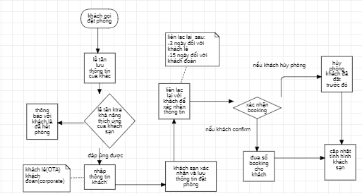

# BUSINESS REQUIREMENT DOCUMENT (BRD)

## TÀI LIỆU YÊU CẦU KINH DOANH - PHIÊN BẢN 1.1

- **Tên dự án:** Hotel Booking Demand Project (Dự án Dự báo Nhu cầu & Tối ưu hóa Doanh thu Đặt phòng)
- **Tác giả:** Nguyễn Đăng Khôi
- **Chức vụ:** Business Analyst
- **Ngày khởi tạo:** 30/06/2026
- **Ngày cập nhật:** 07/07/2026
- **Trạng thái:** To be Approved

## 1. Kiểm soát Phiên bản (Version Control)

| **Phiên bản** | **Ngày thay đổi** | **Người thay đổi** | **Mô tả chi tiết nội dung thay đổi**                                                                                                                                                                                                                                    | **Trạng thái**     |
| ------------- | ----------------- | ------------------ | ----------------------------------------------------------------------------------------------------------------------------------------------------------------------------------------------------------------------------------------------------------------------- | ------------------ |
| **v1.0**      | 30/06/2026        | Business Analyst   | Khởi tạo tài liệu ban đầu dựa trên cấu trúc file mẫu và tệp phân tích dữ liệu thô hotel_bookings.csv.                                                                                                                                                                   | Draft              |
| **v1.1**      | 06/07/2026        | Business Analyst   | Tích hợp sâu kết quả phân tích khám phá dữ liệu (EDA Stage 1 & 2). Bổ sung bài toán chiến lược RevPAR, ma trận phân tích Market Segment, sơ đồ quy trình nghiệp vụ As-Is, nhận diện điểm nghẽn hệ thống và cập nhật 05 Luật nghiệp vụ cốt lõi (BR-REV, BR-PRC, BR-OPS). | **To be Approved** |
| **v1.1.1**    | 07/07/2026        | Business Analyst   | Đồng bộ BRD với POC LightGBM v2; làm rõ nguồn tỷ lệ hủy (thô vs v5); thay ảnh base64 bằng PNG; cập nhật REQ-M-01, mục 3.4 và ngưỡng Use Case. | **To be Approved** |

## 2. Phê duyệt (Sign-off / Approvals)

| **Vai trò**                    | **Tên & Chức vụ**         | **Chữ ký / Xác nhận** | **Ngày phê duyệt** | **Ghi chú**                     |
| ------------------------------ | ------------------------- | --------------------- | ------------------ | ------------------------------- |
| **Project Sponsor**            | \[Tên Giám đốc Vận hành\] | _Chờ ký_              | -                  | Sponsor chính của dự án         |
| **Product Owner / BA Lead**    | \[Tên BA Lead\]           | _Chờ ký_              | -                  | Chốt nghiệp vụ kinh doanh       |
| **Technical Lead / Architect** | \[Tên Tech Lead\]         | _Chờ ký_              | -                  | Phê duyệt tính khả thi kỹ thuật |

## 3. Tổng quan Dự án (Project Overview)

### 3.1. Bối cảnh Dự án (Project Background)

Qua khảo sát và trích xuất dữ liệu thô từ hệ thống PMS (Property Management System) tại tệp hotel_bookings.csv, tỷ lệ hủy phòng của chuỗi khách sạn (gồm City Hotel và Resort Hotel) đang ở mức rất cao, gây tổn thất lớn về doanh thu tiềm năng và lãng phí nguồn lực vận hành (phòng trống không kịp bán lại, sắp xếp nhân sự buồng phòng không tối ưu).

Hiện tại, việc quản lý và dự đoán trạng thái phòng hoàn toàn dựa vào kinh nghiệm thủ công, chưa có hệ thống tự động hóa cảnh báo sớm dựa trên các chỉ số như thời gian đặt trước (lead_time), loại tiền đặt cọc (deposit_type), hay lịch sử hủy phòng trước đó của khách hàng.

### 3.2. Định nghĩa Bài toán Chiến lược: RevPAR thấp do Cancellation hay ADR chưa tối ưu?

Để xác định đúng trọng tâm chiến lược, đội ngũ dự án đã bóc tách dữ liệu thực tế thu được các chỉ số sau:

- **Tỷ lệ hủy phòng tổng quan (Cancellation Rate):** Hệ thống ghi nhận tỷ lệ hủy phòng cực kỳ nghiêm trọng lên tới **37,04%** trên tổng số **119.390** lượt đặt phòng trong `hotel_bookings.csv` (dữ liệu thô). Trong đó, City Hotel chạm mức báo động **41,73%** và Resort Hotel ở mức **27,76%**.
  - _Lưu ý nguồn dữ liệu:_ Sau pipeline làm sạch (`hotel_bookings_v5.csv`, loại outlier và booking không hợp lệ), tỷ lệ hủy còn **28,12%** trên **82.811** booking. Con số này được dùng cho mục tiêu **OB-04** và POC mô hình LightGBM v2 (xem `09_cancellation_model_v2.md`).
- **Giá phòng trung bình hằng ngày (ADR):** Mức ADR trung bình của các booking thực tế check-in thành công là **99.99 €**. Đáng chú ý, các phòng bị hủy lại có mức ADR trung bình cao hơn, ở mức **104.96 €**.

**Business Insights:** Chỉ số **RevPAR** (Revenue Per Available Room - Doanh thu trên mỗi phòng sẵn có) thấp phần lớn do nguyên nhân **tỷ lệ hủy phòng quá cao**, chứ không phải do định giá ADR kém. Khách sạn vẫn đang bán được phòng với mức giá trung bình rất tốt, chứng tỏ lực cầu và năng lực định giá của đội ngũ Sales/Marketing không hề yếu.

Tuy nhiên, việc gần 42% lượng phòng tại City Hotel bị huỷ đã trực tiếp kéo tụt tỷ lệ lấp đầy thực tế (Occupancy Rate). Khi phòng bị hủy muộn, phòng đó biến thành _"phòng trống vô giá trị"_ vào đêm lưu trú, làm sụt giảm nghiêm trọng RevPAR thực tế. Do đó, trọng tâm của dự án phải dồn vào việc kiểm soát, dự báo hủy phòng nhằm áp dụng kỹ thuật Overbooking hoặc thắt chặt chính sách đặt cọc đối với nhóm rủi ro cao để bảo vệ dòng RevPAR.

### 3.3. Nghiên cứu Tiêu chuẩn Ngành (Industry Benchmarks)

- **Tiêu chuẩn ngành:** Tỷ lệ hủy phòng trung bình ngành dao động từ 20% đến 40% tùy thuộc vào kênh đặt phòng. Các kênh đặt trực tiếp (Direct Web) thường có tỷ lệ hủy thấp (<15%), trong khi các kênh Đại lý du lịch trực tuyến (OTA như Booking.com, Agoda) có chính sách "Hủy miễn phí" (Free Cancellation) thường đẩy tỷ lệ hủy lên sát ngưỡng 40%.
- **Đối chiếu với doanh nghiệp:** Tỷ lệ hủy chung của chuỗi là 37.04% (và 41.73% đối với City Hotel) đang nằm ở cận trên cực kỳ nguy hiểm của benchmark ngành. Điều này xác thực rằng doanh nghiệp đang bị lạm dụng chính sách hủy phòng thoáng, đòi hỏi bắt buộc phải có một giải pháp công nghệ can thiệp nhằm siết chặt nhóm rủi ro cao mà không làm ảnh hưởng trải nghiệm của nhóm khách hàng uy tín.

### 3.4. Điểm cần đào sâu thêm & Business Questions bổ sung cho Data Analyst (DA)

Hiện tại phân tích ADR chỉ dựa trên các booking thành công (is_canceled = 0). Việc tách rời này làm mờ đi bức tranh tổng thể về Doanh thu tiềm năng bị mất do hủy phòng (Revenue Loss), đặc biệt là vào mùa cao điểm hè (July-August) khi mỗi phòng hủy gây tổn thất ước tính 130-150 €/đêm. POC mô hình dự báo hủy **LightGBM v2** đã hoàn thành (ROC-AUC test **0,872**, ngưỡng **0,35** — chi tiết tại `09_cancellation_model_v2.md`). Song song, DA vẫn cần trả lời các câu hỏi kinh doanh mang tính đa chiều sau để tinh chỉnh chính sách vận hành:

- **Interaction 3 chiều (Lead time × Segment × Mùa vụ):** Tỷ lệ hủy của nhóm Online TA có lead_time > 90 ngày vào mùa cao điểm (Jul-Aug) chính xác là bao nhiêu? Nhóm này đang chiếm bao nhiêu phần trăm trong tổng doanh thu bị tổn thất?
- **Chi phí cơ hội của Room Mis-match:** Booking không khớp phòng có ADR thấp hơn booking khớp phòng là 18.24 €. DA cần làm rõ: Đây là do chúng ta chủ động nâng hạng phòng miễn phí (Free Upgrade) cho khách đặt phòng giá rẻ (Room A, B) để giải phóng phòng, hay do lỗi hệ thống vận hành làm mất cơ hội Upsell thu phí?
- **Mô phỏng tài chính cho Chính sách cọc (Deposit Simulation):** Nếu áp dụng chính sách bắt buộc cọc tiền 1 đêm cho tất cả booking có lead_time > 30 ngày thuộc phân khúc Online TA, và giả định tỷ lệ hủy giảm 30% nhưng tổng volume đặt phòng giảm 10% (do khách ngại cọc), thì Net Revenue cuối cùng của khách sạn thay đổi như thế nào?

### 3.5. Mục tiêu Kinh doanh (Business Objectives)

Ứng dụng dữ liệu lớn và thuật toán thông minh nhằm đạt các mục tiêu SMART sau:

- **OB-01 (Mục tiêu 1):** Giảm tỷ lệ tổn thất doanh thu do hủy phòng ảo xuống 15% trong vòng 6 tháng kể từ khi vận hành hệ thống thông qua cơ chế dự báo sớm.
- **OB-02 (Mục tiêu 2):** Tự động hóa 90% quy trình phân loại và chấm điểm rủi ro hủy đặt phòng (is_canceled) của khách hàng ngay khi booking được tạo.
- **OB-03 (Mục tiêu 3):** Tối ưu hóa chỉ số doanh thu trung bình trên mỗi phòng sẵn có (RevPAR) tăng 8% nhờ chiến lược Overbooking thông minh (cho phép đặt vượt tải an toàn dựa trên tỷ lệ dự báo hủy).
- **OB-04 (Cập nhật):** Giảm tỷ lệ hủy phòng tổng thể từ 28.12% xuống < 24% trong vòng 12 tháng.
- **OB-05 (Cập nhật):** Tăng tỷ lệ booking có đặt cọc (Tiered Deposit) từ 1.3% hiện tại lên tối thiểu 15%.
- **OB-06 (Cập nhật):** Nâng chỉ số Room Match thành công từ 82% lên > 85% thông qua việc siết chặt phân bổ room inventory và thiết lập quy trình Upsell có thu phí.
- **OB-07 (Cập nhật):** Tăng trưởng chỉ số ADR tổng thể thêm 5% - 8% YoY thông qua chiến lược giá động (Dynamic Pricing) theo mùa vụ.

### 3.6. Phạm vi Dự án (Project Scope)

- **Trong phạm vi (In-Scope):**
  - **Phân hệ Báo cáo & Dashboard Thông minh:** Trực quan hóa cấu trúc doanh thu đặt phòng (adr), tỷ lệ khách hủy theo tháng/quý, chân dung khách hàng (Adults, Children, Babies, Quốc tịch country).
  - **Mô hình Dự báo Rủi ro Hủy phòng (Predictive Model):** Tích hợp AI/Machine Learning chấm điểm xác suất hủy phòng theo thời gian thực dựa trên các thuộc tính đầu vào (Lead time, Customer type, Market segment...).
  - **Hệ thống Cảnh báo sớm & Đề xuất hành động:** Tự động gửi thông báo cho bộ phận Sales/Receptions khi một booking có rủi ro hủy cao vượt ngưỡng kiểm soát để kích hoạt quy trình xác nhận lại hoặc yêu cầu đặt cọc bổ sung.
- **Ngoài phạm vi (Out-of-Scope):**
  - Hệ thống xử lý thanh toán trực tiếp (Payment Gateway) với ngân hàng (Sẽ sử dụng API cổng thanh toán hiện tại).
  - Phân hệ quản lý chấm công, lương của nhân viên khách sạn.

## 4. Phân tích Phân khúc Thị trường (Market Segment Matrix)

Sử dụng dữ liệu từ phân tích EDA, dưới đây là ma trận phân tích hiệu suất doanh thu và rủi ro của 3 phân khúc chiến lược chính nhằm định hình hệ thống quản lý:

| **Tiêu chí**                      | **Online TA (OTA)**                                                                                                                                                               | **Direct (Trực tiếp)**                                                                                                 | **Corporate (Doanh nghiệp)**                                                                                                      |
| --------------------------------- | --------------------------------------------------------------------------------------------------------------------------------------------------------------------------------- | ---------------------------------------------------------------------------------------------------------------------- | --------------------------------------------------------------------------------------------------------------------------------- |
| **Volume (Quy mô)**               | **Cực đại** (~60.9% tổng portfolio với 50.391 booking).                                                                                                                           | **Trung bình** (11.351 booking qua segment Direct, 12.291 qua channel Direct).                                         | **Nhỏ** (3.678 booking qua segment Corporate).                                                                                    |
| **Average Daily Rate (ADR)**      | **Cao** (Phân khúc Transient đi qua OTA đạt ADR 108.74 €; đặc biệt City Hotel Transient đạt 114.22 €).                                                                            | **Trung bình** (Nằm ở mức trung bình của hệ thống, khoảng 91-104 € tùy loại hình khách sạn).                           | **Thấp - Trung bình** (ADR tổng thể ~92.81 €, riêng City Contract đạt premium 110.66 € nhưng Resort Contract rất thấp: 79.92 €).  |
| **Tỷ lệ Hủy (Cancellation Rate)** | **Cực cao** (35.5% đối với segment Online TA, 35.7% khi đi qua channel TA/TO).                                                                                                    | **Thấp** (14.9% ở segment Direct, giảm còn 3.7% nếu là khách Direct đi qua hệ thống TA/TO).                            | **Thấp nhất** (12.8% ở segment Corporate, tính ổn định cực cao).                                                                  |
| **Hàm ý về Doanh thu thực tế**    | **Kênh "Con dao hai lưỡi":** Mang lại dòng doanh thu tiềm năng lớn nhất nhưng tạo ra "nhu cầu ảo" khổng lồ. Gần 1/3 doanh thu từ OTA không bao giờ thực sự được ghi nhận thực tế. | **Kênh biên lợi nhuận cao:** ADR ổn định, tỷ lệ hủy thấp, không tốn chi phí hoa hồng cho bên thứ ba (Commission-free). | **Kênh lấp đầy nền (Base filler):** Mang lại nguồn doanh thu ổn định, chắc chắn, ít rủi ro hủy, đặc biệt hiệu quả tại City Hotel. |

## 5. Các Bên Liên quan, Đối tượng Sử dụng & Quy trình Nghiệp vụ

### 5.1. Ma trận các Bên liên quan chính (Key Stakeholders)

- **Ban Giám Đốc (Board of Directors):** Theo dõi KPI doanh thu toàn chuỗi, duyệt ngân sách dự án.
- **Đội ngũ Quản trị Doanh thu (Revenue Management Team):** Sử dụng các dự báo để điều chỉnh giá phòng (adr) và chiến lược Overbooking.
- **Đội ngũ Lễ tân & Sale (Front Office / Sales):** Tiếp nhận danh sách booking rủi ro để xử lý nghiệp vụ chăm sóc/xác nhận phòng.
- **Đội ngũ IT / Data Engineer:** Hỗ trợ kết nối database hệ thống cũ và bảo trì mô hình.

### 5.2. Các nhóm người dùng (User Personas / Roles)

- **Revenue Manager (Quản lý Doanh thu):** Xem báo cáo tổng quan, cấu hình ngưỡng rủi ro cảnh báo hủy phòng.
- **Receptionist / Sales Agent (Nhân viên vận hành):** Tiếp nhận danh sách đặt phòng, cập nhật trạng thái phòng thực tế.
- **System Admin:** Quản trị hệ thống, cấu hình phân quyền người dùng (RBAC).

### 5.3. Quy trình Đặt phòng & Nhận diện Điểm nghẽn Hiện tại (As-Is Process Map)

#### A. Sơ đồ quy trình tiếp nhận và xác nhận thủ công (As-Is Flowchart)

Tham khảo từ tài liệu quy trình hiện tại, luồng nghiệp vụ thủ công đang được vận hành như sau:

#### B. Điểm nghẽn Kinh doanh (Business Pain Points) gây thiệt hại RevPAR

Bằng việc phân tích sâu vào hệ thống PMS thông qua biểu đồ, RevPAR bị tổn hại nghiêm trọng do ba "rò rỉ" lớn sau:

- **Điểm nghẽn từ nhóm "Online TA × Lead time dài × Mùa cao điểm" (Tổn thất trực tiếp Doanh thu Cơ hội):**
  - _Bằng chứng dữ liệu:_ Khách đặt qua OTA có tỷ lệ hủy lên tới 35.5%, lead time dài trên 180 ngày tỷ lệ hủy lên đến 41.7%. Sự kết hợp này tạo ra lượng hủy cực lớn vào tháng 7 và tháng 8 (mùa đỉnh điểm với ADR cao nhất: 137-151 €).
  - _Thiết hại:_ Do chính sách cọc quá lỏng lẻo (98.7% No Deposit), khách hàng giữ chỗ trước nhiều tháng trên OTA như một quyền chọn miễn phí, sau đó hủy sát ngày. Khách sạn không kịp bán lại phòng với giá Last-minute tương đương, khiến phòng bị bỏ trống vào ngày cao điểm, trực tiếp kéo tụt Occupancy Rate và RevPAR mùa hè.
- **Double Penalty từ phân khúc Nhóm (Groups × TA/TO):**
  - _Bằng chứng dữ liệu:_ Tổ hợp này có tỷ lệ hủy cao nhất hệ thống (36.2%) nhưng lại có ADR thấp nhất portfolio (87.23 €).
  - _Thiệt hại:_ Phân khúc này vừa chiếm giữ một block phòng lớn làm giảm không gian bán phòng giá cao cho khách lẻ (Transient ADR 108.74 €), vừa có nguy cơ hủy đồng loạt ở phút chót mà không có điều khoản bồi thường (Attrition clause) chặt chẽ.
- **Sự kém hiệu quả của việc phân bổ phòng Standard (Room A):**
  - _Bằng chứng dữ liệu:_ Loại phòng A chiếm đến 64.7% tổng volume lưu trú nhưng có mức giá rất thấp (93.04 €). Thêm vào đó, tỷ lệ không khớp phòng lên đến 18% với ADR trung bình bị kéo giảm.
  - _Thiệt hại:_ Khách sạn đang bị quá tải cục bộ ở phân khúc phòng giá rẻ, dẫn đến việc phải chuyển đổi phòng hình thức (mis-match), lãng phí các hạng phòng cao cấp (D, E, F, G) cho khách áp giá phòng Standard mà không thu được phí nâng hạng (Upsell premium).

## 6. Các Use Cases chính của hệ thống

- **Use Case 1: Trực quan hóa Biến động ADR và Tỷ lệ Hủy**
  - _Đối tượng:_ Dành cho Revenue Manager.
  - _Mô tả:_ Hệ thống cung cấp dashboard thời gian thực phân tích chỉ số ADR, doanh thu mất mát do hủy phòng theo tháng và loại hình khách sạn.
- **Use Case 2: Tự động chấm điểm Rủi ro Đặt phòng**
  - _Đối tượng:_ Dành cho Hệ thống tự động / Machine Learning Pipeline.
  - _Mô tả:_ Ngay khi một booking được tạo qua Website/OTA, hệ thống tự động bóc tách các trường thông tin (ví dụ: `lead_time`, `deposit_type`, `market_segment`) qua pipeline LightGBM v2 và trả về xác suất hủy **P(hủy)** trong khoảng 0–100%.
  - _Ngưỡng phân loại POC:_ **P(hủy) ≥ 0,35** → dự đoán Hủy (ưu tiên Recall để bảo vệ inventory).
- **Use Case 3: Quản lý và xử lý Cảnh báo Đặt phòng rủi ro**
  - _Đối tượng:_ Dành cho Nhân viên Lễ tân / Sales.
  - _Mô tả:_ Hệ thống phân tầng cảnh báo dựa trên **P(hủy)** từ mô hình:
    - **Tier Trung bình (0,35 ≤ P < 0,70):** Gợi ý xác nhận lại booking / nhắc chính sách cọc.
    - **Tier Cao (P ≥ 0,70):** Ưu tiên can thiệp — "Yêu cầu thanh toán trước 100%" hoặc "Mở bán Overbooking cho phòng này".
  - _Ghi chú:_ Ngưỡng **0,35** là ngưỡng phân loại mô hình POC; ngưỡng **0,70** là ngưỡng nghiệp vụ cho hành động khẩn (Revenue Manager có thể cấu hình).

## 7. Thay đổi cấu trúc và Luật nghiệp vụ mới (Business Rules - BR v1.1)

Hệ thống quản lý đặt phòng mới yêu cầu cấu hình các luật tự động nghiêm ngặt sau để bít các lỗ hổng tài chính:

| **Mã luật**   | **Quy trình / Phân khúc**                                  | **Mô tả chi tiết luật nghiệp vụ mới cập nhật**                                                                                                                                                                                                                                                                                                                             | **Cơ sở dữ liệu chứng minh (Từ EDA)**                                                                                                                                              |
| ------------- | ---------------------------------------------------------- | -------------------------------------------------------------------------------------------------------------------------------------------------------------------------------------------------------------------------------------------------------------------------------------------------------------------------------------------------------------------------- | ---------------------------------------------------------------------------------------------------------------------------------------------------------------------------------- |
| **BR-REV-01** | **Tiered Deposit Policy** _(Chính sách cọc theo phân lớp)_ | Hệ thống PMS/Booking Engine tự động áp dụng đặt cọc bắt buộc:     \- Lead time từ 31-180 ngày: Yêu cầu đặt cọc trước giá trị 1 đêm (hoàn hủy linh hoạt theo điều kiện).     \- Lead time > 180 ngày: Bắt buộc cọc 2 đêm hoặc thanh toán gói _Non-refundable partial_ (không hoàn lại một phần).                                                    | **Bước nhảy rủi ro hủy:** Tỷ lệ hủy tăng vọt từ 16.8% (vùng \$\\le 30\$ ngày) lên 32.2% (vùng \$>30\$ ngày) và đạt đỉnh 41.7% ở vùng \$>180\$ ngày.                                |
| **BR-REV-02** | **OTA Risk Mitigation** _(Kiểm soát rủi ro OTA)_           | Riêng tổ hợp phân khúc **Online TA x TA/TO** có Lead time > 60 ngày đặt phòng vào mùa cao điểm (Mùa hè tháng 7, 8) sẽ áp dụng khung thời gian khóa sổ (_Cut-off date_) nghiêm ngặt là 14 ngày trước khi đến (thay vì 3 ngày như trước đây).                                                                                                                                | **Điểm nóng rủi ro lớn nhất:** Chiếm volume lớn nhất với hơn 50.104 booking với tỷ lệ hủy cực lớn 35.7%.                                                                           |
| **BR-REV-03** | **Group Attrition Clause** _(Điều khoản phạt hủy nhóm)_    | Tất cả các hợp đồng đặt phòng theo đoàn (**Groups × TA/TO**) phải ký cam kết điều khoản _Attrition clause_: Đại lý chỉ được quyền hủy tối đa 10% số lượng buồng đã chặn bán mà không phạt; vượt quá tỷ lệ này sẽ bị thu phí phạt dựa trên mức ADR cam kết đoàn (87.23 €).                                                                                                  | **Rủi ro Double Penalty:** Tỷ lệ hủy nhóm cao nhất hệ thống (36.2%) đi kèm mức biên lợi nhuận ADR thấp nhất (87.23 €).                                                             |
| **BR-PRC-01** | **Dynamic Seasonal Pricing** _(Giá động theo mùa)_         | Phòng tài chính cấu hình biểu giá riêng biệt (_Rate Fence_) cho hai cơ sở:     \- **City Hotel:** Tập trung Premium hóa phân khúc Transient đầu tuần (Thứ 2) và Contract (Giữ mức chênh lệch +30 € so với Resort).     \- **Resort Hotel:** Thiết lập biểu giá cao điểm cho mùa hè (Tháng 7, 8) tập trung vào các hạng phòng Suite/Premium (H, C). | **Đặc trưng phân hóa:** Tháng 8 đạt đỉnh ADR toàn chuỗi (151.19 €). City Hotel có lợi thế vượt trội về giá Contract (+30.74 €) và Transient (+13.76 €).                            |
| **BR-OPS-01** | **Paid Upsell Path** _(Quy trình Upsell phòng Standard)_   | Hệ thống tự động gửi email/SMS ưu đãi nâng hạng phòng tự động có thu phí (Path \$A \\rightarrow D/E\$) cho khách hàng Transient trước ngày check-in 7 ngày vào mùa cao điểm, chấm dứt tình trạng tự động upgrade miễn phí tại quầy dẫn đến lệch phòng.                                                                                                                     | **Tối ưu hóa năng suất:** Phòng Standard loại A chiếm 65% volume nhưng ghìm giá hệ thống, trong khi việc phòng không khớp (mis-match 18%) đang làm mất 18.24 € trên mỗi đêm phòng. |

## 8. Cập nhật Yêu cầu Hệ thống & Mô hình hóa (System & Predictive Requirements)

- **REQ-M-01 (Mô hình Hủy phòng — POC đã giao):** Hệ thống đã triển khai POC **LightGBM v2** (báo cáo: `09_cancellation_model_v2.md`, notebook: `models/Canncellation Predict Model v2/09_cancellation_model_v2.ipynb`):
  - **16 feature** (6 phân loại + 10 số, gồm 8 biến engineered từ v1.2) — không dùng feature tương tác tường minh; LightGBM học phi tuyến qua cây quyết định.
  - Pipeline: One-Hot Encoding (`min_frequency=5`) + `LGBMClassifier`; tinh chỉnh **GridSearchCV** & **Optuna**.
  - **Ngưỡng phân loại:** **0,35** (`P(hủy) ≥ 0,35` → Hủy).
  - **Kết quả test (tuned):** ROC-AUC **0,872** | Recall Hủy **0,884** | Precision Hủy **0,505** @ ngưỡng 0,35.
  - **Yêu cầu production:** Tích hợp pipeline trên để trả về xác suất hủy theo thời gian thực (*Probability of Cancellation*) cho từng booking đơn lẻ.
- **REQ-M-02 (Mô hình ADR tối ưu):** Thuật toán gợi ý giá động phải tích hợp các biến kiểm soát biến động cao bao gồm: Tháng đến (arrival_date_month), Ngày trong tuần (day_of_week), và cặp tương tác (customer_type × hotel) nhằm tránh tình trạng Underpricing đối với khách doanh nghiệp tại City Hotel.

## 9. Tài liệu liên quan (Related Documents)

| Tài liệu | Mô tả |
| -------- | ----- |
| [`09_cancellation_model_v2.md`](09_cancellation_model_v2.md) | Báo cáo POC LightGBM v2 — metric, feature, SHAP |
| [`08_cancellation_model_v1_2.md`](08_cancellation_model_v1_2.md) | Báo cáo RF v1.2 — baseline feature engineering |
| `models/Canncellation Predict Model v2/09_cancellation_model_v2.ipynb` | Notebook huấn luyện & đánh giá v2 |
| `figures/brd_v1_1_as_is_flowchart.png` | Sơ đồ quy trình As-Is (mục 5.3) |
